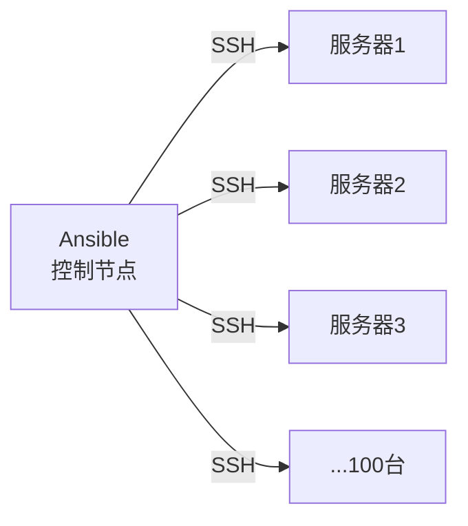

+++
title = "第61章：Ansible 入门"
weight = 610
date = "2026-03-24T13:18:28+08:00"
type = "docs"
description = ""
isCJKLanguage = true
draft = false
+++


# 第六十一章：Ansible 入门

## 61.1 Ansible 简介

### 什么是 Ansible？

想象一下：你有 100 台服务器，需要在每一台上安装 Nginx、更新配置文件、重启服务。

**手动操作**：
1.  SSH 连接到第一台服务器
2. 执行安装命令
3. 修改配置文件
4. 重启服务
5. 重复以上步骤 99 次...

**使用 Ansible**：
```bash
ansible-playbook -i hosts nginx.yml
```
一条命令搞定所有！



### Ansible 的优势

| 特点 | 说明 |
|------|------|
| 无 Agent | 不需要在被管理主机安装软件 |
| SSH 驱动 | 只需要 SSH 连接 |
| 幂等性 | 多次执行结果一致 |
| YAML 语法 | 人类可读的配置文件 |
| 模块化 | 丰富的内置模块 |
| 社区支持 | 大量 Galaxy 角色可用 |

### Ansible vs 其他工具

| 特性 | Ansible | Puppet | Chef |
|------|---------|--------|------|
| Agent | 无 | 需要 | 需要 |
| 配置语言 | YAML | DSL | Ruby |
| 学习曲线 | 低 | 中 | 高 |
| 规模 | 1000+ | 1000+ | 1000+ |
| 社区 | 活跃 | 活跃 | 活跃 |

### 安装 Ansible

```bash
# Ubuntu/Debian
sudo apt update
sudo apt install ansible

# CentOS/RHEL
sudo yum install epel-release
sudo yum install ansible

# macOS
brew install ansible

# pip 安装（最新版）
pip install ansible

# 验证安装
ansible --version
```

## 61.2 Inventory

Inventory 是 Ansible 管理的主机清单。

### 基本 Inventory 文件

```bash
# 文件：hosts
# 定义单个主机
web1.example.com

# 定义主机组
[webservers]
web1.example.com
web2.example.com
web3.example.com

[dbservers]
db1.example.com
db2.example.com

[loadbalancers]
lb1.example.com
```

### Inventory 高级配置

```ini
# 使用端口
web1.example.com:2222

# 使用 IP 地址
192.168.1.101

# 主机范围
web[1:3].example.com  # web1, web2, web3

# 定义变量
[webservers]
web1.example.com ansible_user=ubuntu ansible_port=22

[dbservers]
db1.example.com ansible_user=root
```

### Inventory 变量

```ini
[all:vars]
ansible_user=admin
ansible_password=secret
ansible_python_interpreter=/usr/bin/python3

[webservers:vars]
nginx_port=80
app_path=/var/www/app

[dbservers:vars]
db_port=3306
db_name=myapp
```

### 动态 Inventory

```bash
# AWS EC2 动态 Inventory
pip install boto3 botocore

# 下载 AWS 动态 Inventory 脚本
wget https://raw.githubusercontent.com/ansible/ansible/stable/contrib/inventory/ec2.py
chmod +x ec2.py

# 配置 AWS 凭证
export AWS_ACCESS_KEY_ID='...'
export AWS_SECRET_ACCESS_KEY='...'

# 使用
ansible -i ec2.py all -m ping
```

### 目录结构

```
project/
├── hosts                 # Inventory 文件
├── ansible.cfg          # Ansible 配置文件
├── group_vars/          # 组变量
│   └── webservers.yml
├── host_vars/           # 主机变量
│   └── web1.yml
├── roles/              # 角色目录
└── playbooks/          # 剧本目录
```

## 61.3 Ad-hoc

Ad-hoc 是执行单个 Ansible 任务的方式，适合临时操作。

### 基本语法

```bash
ansible <host-pattern> -m <module> -a <arguments>
```

### 常用模块

**ping 模块**：
```bash
# 测试主机连通性
ansible all -m ping

# 指定 Inventory
ansible all -i hosts -m ping
```

**command 模块**：
```bash
# 执行命令
ansible all -m command -a "uptime"

# 指定用户
ansible webservers -m command -a "whoami" -u ubuntu

# sudo 执行
ansible all -m command -a "apt update" -b -K
```

**shell 模块**：
```bash
# 执行 shell 命令（支持管道等）
ansible all -m shell -a "ps aux | grep nginx"
```

**copy 模块**：
```bash
# 复制文件到远程
ansible all -m copy -a "src=./app.conf dest=/etc/app.conf"

# 带权限
ansible all -m copy -a "src=./app.conf dest=/etc/app.conf mode=0644"
```

**file 模块**：
```bash
# 创建目录
ansible all -m file -a "path=/data state=directory"

# 创建链接
ansible all -m file -a "path=/link dest=/target state=link"

# 删除
ansible all -m file -a "path=/tmp/cache state=absent"
```

**yum/apt 模块**：
```bash
# 安装包（CentOS）
ansible all -m yum -a "name=nginx state=present"

# 安装包（Debian）
ansible all -m apt -a "name=nginx state=present update_cache=yes"

# 安装多个包
ansible all -m apt -a "name=nginx,git,vim state=present"
```

**service 模块**：
```bash
# 启动服务
ansible all -m service -a "name=nginx state=started"

# 重启服务
ansible all -m service -a "name=nginx state=restarted"

# 停止服务
ansible all -m service -a "name=nginx state=stopped"
```

### Ansible 配置

```bash
# ansible.cfg
[defaults]
inventory = hosts
remote_user = ubuntu
host_key_checking = False
timeout = 10

[privilege_escalation]
become = True
become_method = sudo
become_user = root
become_ask_pass = False
```

## 61.4 Playbook

Playbook 是 Ansible 的核心，使用 YAML 格式编写。

### 基本结构

```yaml
# playbook.yml
---
- hosts: webservers        # 目标主机
  become: true            # 提升权限
  vars:                   # 变量
    nginx_port: 80
    app_path: /var/www
  
  tasks:                  # 任务列表
    - name: 安装 Nginx
      apt:
        name: nginx
        state: present
        update_cache: yes

    - name: 配置 Nginx
      template:
        src: nginx.conf.j2
        dest: /etc/nginx/nginx.conf
      notify: 重启 Nginx

    - name: 启动 Nginx
      service:
        name: nginx
        state: started
        enabled: yes

  handlers:               # 处理器
    - name: 重启 Nginx
      service:
        name: nginx
        state: restarted
```

### 执行 Playbook

```bash
# 执行
ansible-playbook playbook.yml

# 指定 Inventory
ansible-playbook -i hosts playbook.yml

# 语法检查
ansible-playbook --syntax-check playbook.yml

# 模拟执行（dry run）
ansible-playbook -C playbook.yml

# 显示执行的主机
ansible-playbook playbook.yml --list-hosts

# 指定标签
ansible-playbook playbook.yml --tags=nginx

# 跳过标签
ansible-playbook playbook.yml --skip-tags=config
```

### 条件执行

```yaml
---
- hosts: all
  vars:
    os_type: centos

  tasks:
    - name: CentOS 安装 Nginx
      yum:
        name: nginx
        state: present
      when: ansible_os_family == "RedHat"

    - name: Ubuntu 安装 Nginx
      apt:
        name: nginx
        state: present
      when: ansible_os_family == "Debian"
```

### 循环

```yaml
---
- hosts: webservers
  tasks:
    - name: 创建多个用户
      user:
        name: "{{ item }}"
        state: present
        shell: /bin/bash
      loop:
        - alice
        - bob
        - charlie

    - name: 安装多个包
      apt:
        name: "{{ packages }}"
      vars:
        packages:
          - nginx
          - git
          - vim
```

### 错误处理

```yaml
---
- hosts: webservers
  tasks:
    - name: 忽略错误继续执行
      command: /might/fail
      ignore_errors: yes

    - name: 失败时执行其他任务
      block:
        - name: 执行可能失败的任务
          command: /might/fail
      rescue:
        - name: 失败时执行
          debug:
            msg: "任务失败了，我来接管"
      always:
        - name: 总是执行
          debug:
            msg: "无论成功失败我都会执行"
```

## 61.5 模块

Ansible 内置了大量模块，涵盖各种场景。

### 文件操作模块

```yaml
# copy 模块
- name: 复制文件
  copy:
    src: app.conf
    dest: /etc/app.conf
    owner: root
    group: root
    mode: '0644'
    backup: yes

# template 模块
- name: 复制模板
  template:
    src: app.conf.j2
    dest: /etc/app.conf

# lineinfile 模块
- name: 添加行
  lineinfile:
    path: /etc/sysctl.conf
    line: "vm.swappiness = 10"
    create: yes

# blockinfile 模块
- name: 添加代码块
  blockinfile:
    path: /etc/hosts
    marker: "# {mark} 我的标记"
    block: |
      192.168.1.100 server1
      192.168.1.101 server2
```

### 包管理模块

```yaml
# apt 模块
- name: 安装包
  apt:
    name:
      - nginx
      - git
    state: present
    update_cache: yes
    cache_valid_time: 3600

# yum 模块
- name: 安装包
  yum:
    name: nginx
    state: present
    enablerepo: epel

# pip 模块
- name: 安装 Python 包
  pip:
    name: django
    version: '4.0'
    virtualenv: /opt/venv
```

### 系统模块

```yaml
# systemd/service 模块
- name: 启动服务
  systemd:
    name: nginx
    state: started
    enabled: yes
    daemon_reload: yes

# user 模块
- name: 创建用户
  user:
    name: deploy
    comment: "Deploy User"
    shell: /bin/bash
    groups: sudo
    password: "{{ 'password' | password_hash('sha512') }}"

# cron 模块
- name: 添加定时任务
  cron:
    name: "备份数据库"
    hour: 2
    minute: 0
    job: "/scripts/backup.sh"
    state: present
```

### 云模块

```yaml
# AWS EC2 模块
- name: 创建 EC2 实例
  ec2:
    key_name: mykey
    instance_type: t2.micro
    image: ami-12345678
    region: us-east-1
    count: 2
    vpc_subnet_id: subnet-12345678
    assign_public_ip: yes
    security_group: default
  register: ec2_instances

# Docker 模块
- name: 启动容器
  docker_container:
    name: web
    image: nginx:latest
    ports:
      - "80:80"
    state: started
```

## 61.6 变量与模板

### 变量定义

```yaml
# 方式一：Playbook 中定义
- hosts: webservers
  vars:
    app_name: myapp
    app_version: 1.0.0

# 方式二：文件定义
# group_vars/webservers.yml
---
app_name: myapp
nginx_workers: 4
```

### 变量使用

```yaml
---
- hosts: webservers
  vars:
    port: 8080
  tasks:
    - name: 显示变量
      debug:
        msg: "端口是 {{ port }}"
```

### Jinja2 模板

```j2
{# nginx.conf.j2 #}
user {{ nginx_user }};
worker_processes {{ nginx_workers }};

events {
    worker_connections {{ max_connections }};
}

http {
    server {
        listen {{ port }};
        server_name {{ domain_name }};
        
        location / {
            root {{ document_root }};
            index index.html;
        }
    }
}
```

### 模板过滤器

```yaml
# 内置过滤器
{{ name | upper }}              # 大写
{{ name | lower }}              # 小写
{{ list | join(", ") }}        # 合并
{{ dict | to_json }}            # JSON
{{ path | basename }}           # 获取文件名
{{ path | dirname }}            # 获取目录
{{ count | default(0) }}        # 默认值
{{ password | password_hash }}  # 密码哈希
```

## 61.7 Roles

Roles 是组织 Playbook 的最佳方式。

### 目录结构

```
roles/
└── nginx/
    ├── defaults/           # 默认变量（最低优先级）
    │   └── main.yml
    ├── vars/               # 变量（高优先级）
    │   └── main.yml
    ├── tasks/              # 任务
    │   └── main.yml
    ├── handlers/           # 处理器
    │   └── main.yml
    ├── templates/         # 模板文件
    │   └── nginx.conf.j2
    ├── files/              # 静态文件
    │   └── index.html
    └── meta/               # 依赖关系
        └── main.yml
```

### Role 示例

```yaml
# roles/nginx/tasks/main.yml
---
- name: 安装 Nginx
  apt:
    name: nginx
    state: present
    update_cache: yes

- name: 配置 Nginx
  template:
    src: nginx.conf.j2
    dest: /etc/nginx/nginx.conf
  notify: 重启 Nginx

- name: 启动 Nginx
  service:
    name: nginx
    state: started
    enabled: yes
```

```yaml
# roles/nginx/handlers/main.yml
---
- name: 重启 Nginx
  service:
    name: nginx
    state: restarted
```

```yaml
# roles/nginx/defaults/main.yml
---
nginx_port: 80
nginx_workers: 4
nginx_user: www-data
```

### 使用 Role

```yaml
# site.yml
---
- hosts: webservers
  roles:
    - nginx
    - mysql
    - app

# 带参数
- hosts: databases
  roles:
    - role: mysql
      mysql_port: 3307
      when: ansible_os_family == "Debian"
```

### Ansible Galaxy

```bash
# 下载他人共享的 Role
ansible-galaxy install geerlingguy.nginx
ansible-galaxy install geerlingguy.mysql

# 搜索 Role
ansible-galaxy search mysql

# 查看已安装
ansible-galaxy list

# 创建 Role 骨架
ansible-galaxy init myrole
```

## 本章小结

本章我们学习了 Ansible 的基础知识：

| 概念 | 说明 |
|------|------|
| Inventory | 管理主机清单 |
| Ad-hoc | 单个命令执行 |
| Playbook | YAML 任务剧本 |
| Module | 功能模块 |
| Variable | 变量 |
| Template | Jinja2 模板 |
| Role | 角色/任务组织 |

Ansible 工作流程：


---

> 💡 **温馨提示**：
> Ansible 的精髓在于"幂等性"——无论执行多少次，结果都一样。写 Playbook 时要想着"如果已经配置好了，还要执行吗？"，这样写出来的 Playbook 才健壮！

---

**第六十一章：Ansible 入门 — 完结！** 🎉

下一章我们将学习"其他自动化工具"，包括 SaltStack 和 Puppet。敬请期待！ 🚀
