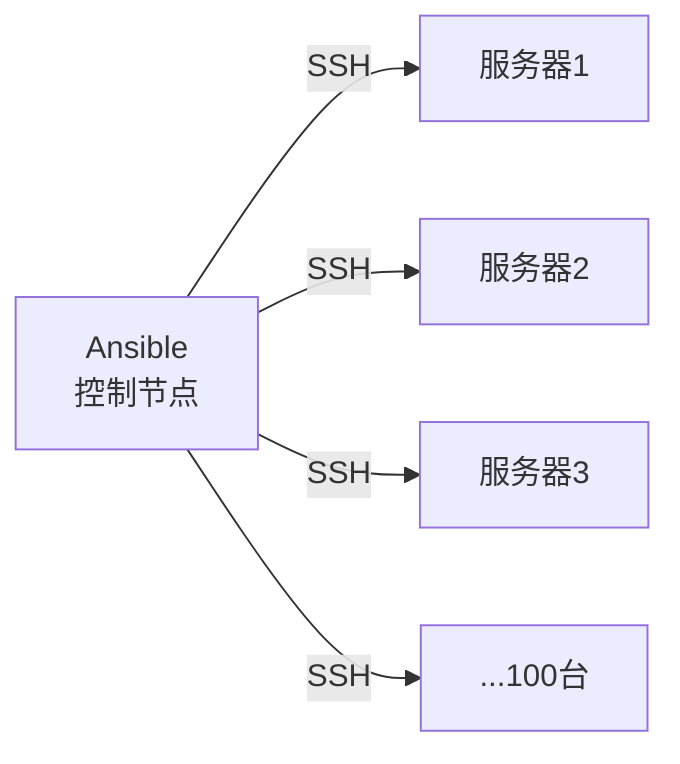
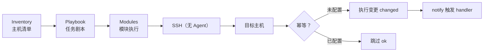

+++
title = "第61章：Ansible 入门"
weight = 610
date = "2026-03-24T13:18:28+08:00"
type = "docs"
description = ""
isCJKLanguage = true
draft = false
+++


# 第六十一章：Ansible 入门

## 61.1 Ansible 简介

### 什么是 Ansible？

想象一下：你有 100 台服务器，需要在每一台上安装 Nginx、更新配置文件、重启服务。

**手动操作**：
1.  SSH 连接到第一台服务器
2. 执行安装命令
3. 修改配置文件
4. 重启服务
5. 重复以上步骤 99 次...

**使用 Ansible**：
```bash
ansible-playbook -i hosts nginx.yml
```
一条命令搞定所有！


```mermaid
graph LR
    A[Ansible<br/>控制节点] -->|SSH| B[服务器1]
    A -->|SSH| C[服务器2]
    A -->|SSH| D[服务器3]
    A -->|SSH| E[...100台]
```

### Ansible 的优势

| 特点 | 说明 |
|------|------|
| 无 Agent | 不需要在被管理主机安装软件 |
| SSH 驱动 | 只需要 SSH 连接 |
| 幂等性 | 多次执行结果一致 |
| YAML 语法 | 人类可读的配置文件 |
| 模块化 | 丰富的内置模块 |
| 社区支持 | 大量 Galaxy 角色可用 |

### Ansible vs 其他工具

| 特性 | Ansible | Puppet | Chef |
|------|---------|--------|------|
| Agent | 无 | 需要 | 需要 |
| 配置语言 | YAML | DSL | Ruby |
| 学习曲线 | 低 | 中 | 高 |
| 规模 | 1000+ | 1000+ | 1000+ |
| 社区 | 活跃 | 活跃 | 活跃 |

### 安装 Ansible

```bash
# 先搞清楚两个包名：
#   ansible-core —— 引擎本体 + 少量核心模块（很轻）
#   ansible      —— ansible-core + 官方收录的几百个集合（日常推荐装这个）

# Ubuntu/Debian（用官方 PPA，发行版自带的版本通常很旧）
sudo apt install -y software-properties-common
sudo add-apt-repository --yes --update ppa:ansible/ansible
sudo apt install -y ansible

# RHEL/Rocky/Alma（需要 EPEL）
sudo dnf install -y epel-release
sudo dnf install -y ansible

# macOS
brew install ansible

# pip 方式（想用最新版时）
# ⚠️ Debian 12 / Ubuntu 23.04 之后系统 Python 是"受管理环境"，
#    直接 pip install 会报 externally-managed-environment 错误，
#    正确姿势是用 pipx 或虚拟环境：
pipx install --include-deps ansible
# 或者
python3 -m venv ~/.venvs/ansible && ~/.venvs/ansible/bin/pip install ansible

# 验证安装（会显示版本、配置文件位置、模块搜索路径）
ansible --version
# 只记版本号可以这样写：
ansible --version | head -1

# 查看某个模块的用法（比搜索引擎快）
ansible-doc apt
ansible-doc -l | grep nginx
```

> 💡 **版本兼容要留意**：Ansible 2.10 之后采用"引擎 + 集合"的拆分模式，模块前缀变成了集合名（如 `ansible.builtin.copy`、`community.general.ufw`）。写 Playbook 时用**全限定名（FQCN）**更稳妥，也更容易看懂。

```bash
# 安装额外的集合（很多云模块、Docker 模块都在集合里）
ansible-galaxy collection install community.general community.docker amazon.aws

# 团队协作时把依赖写进 requirements.yml，一条命令装齐
# requirements.yml:
#   collections:
#     - name: community.general
#       version: ">=8.0.0"
ansible-galaxy collection install -r requirements.yml

# 所有依赖（角色 + 集合）一起装
ansible-galaxy install -r requirements.yml
```

### Ansible 是怎么"连上去"的？

Ansible 不装 Agent，靠的是 SSH + 目标机上的 Python。所以第一次使用前，先确认两件事：

```bash
# 1. SSH 免密登录已经配好（推荐，最省事）
ssh-copy-id ubuntu@web1.example.com
ssh ubuntu@web1.example.com 'echo ok'   # 能免密执行才算成功

# 2. 目标机有 Python（Ansible 模块要在上面跑）
ssh ubuntu@web1.example.com 'python3 --version'

# 目标机没有 Python 时，只有 raw 模块能用（不依赖 Python）
ansible all -i hosts -m raw -a "which python3" -b
```

> ⚠️ **不要在 Inventory 里写明文密码**（`ansible_password=secret` 这种写法很常见，但很不安全）。优先用 SSH 密钥；确实需要密码时，用 `ansible-vault` 加密（见 61.8）。

## 61.2 Inventory

Inventory 是 Ansible 管理的主机清单。

### 基本 Inventory 文件

```ini
# 文件：hosts（INI 格式）
# 定义单个主机
web1.example.com

# 定义主机组
[webservers]
web1.example.com
web2.example.com
web3.example.com

[dbservers]
db1.example.com
db2.example.com

[loadbalancers]
lb1.example.com
```

> 💡 Inventory 文件本身不是 shell 脚本，用 `ini` 语法高亮即可。文件里的 `#` 是注释。

### Inventory 高级配置

```ini
# 使用端口
web1.example.com:2222

# 使用 IP 地址
192.168.1.101

# 主机范围
web[1:3].example.com  # web1, web2, web3

# 定义变量
[webservers]
web1.example.com ansible_user=ubuntu ansible_port=22

[dbservers]
db1.example.com ansible_user=root
```

**组还可以"嵌套"**，这在环境分层时特别有用：

```ini
[webservers]
web1.example.com
web2.example.com

[dbservers]
db1.example.com

# :children 表示"这个组由哪些组组成"
[prod:children]
webservers
dbservers

[prod:vars]
env_name=prod

# 全局变量（所有主机都生效）
[all:vars]
ansible_python_interpreter=/usr/bin/python3
```

```bash
# 看清 Inventory 展开后的结构，比读文件直观得多
ansible-inventory -i hosts --graph
# @all:
#   |--@ungrouped:
#   |--@webservers:
#   |  |--web1.example.com
#   |  |--web2.example.com
#   |--@prod:
#   |  |--@webservers:
#   |  |--@dbservers:
```

### Inventory 变量

```ini
[all:vars]
ansible_user=admin
ansible_python_interpreter=/usr/bin/python3
# ⚠️ 不要写 ansible_password=明文密码！
#    优先用 SSH 密钥，确实需要密码时把变量加密（见 61.8 ansible-vault）
#    如果非要用密码，让它从命令行询问：ansible-playbook -k

[webservers:vars]
nginx_port=80
app_path=/var/www/app

[dbservers:vars]
db_port=3306
db_name=myapp
```

> 常见连接变量速查：
>
> | 变量 | 含义 |
> |------|------|
> | `ansible_host` | 实际连接地址（域名 ≠ 连接地址时用） |
> | `ansible_port` | SSH 端口，默认 22 |
> | `ansible_user` | 登录用户 |
> | `ansible_ssh_private_key_file` | 指定私钥路径 |
> | `ansible_become` / `ansible_become_user` | 是否提权 / 提权成谁 |
> | `ansible_python_interpreter` | 目标机 Python 路径（多 Python 版本时必配） |

### 动态 Inventory

```bash
# ⚠️ 注意：老的 ec2.py / ec2.ini 脚本早已从 Ansible 仓库移除，
#    网上很多教程还在教这个，照抄会 404。
#    现代做法是"Inventory 插件"（plugin），配置文件就是清单本身。

# 1. 安装 AWS 集合和依赖
ansible-galaxy collection install amazon.aws
pipx install --include-deps ansible   # boto3/botocore 会一并装好

# 2. 写插件配置 aws_ec2.yml
# plugin: amazon.aws.aws_ec2
# regions:
#   - us-east-1
# aws_profile: prod                 # 用 profile，别把密钥写进文件
# filters:
#   tag:Env: prod
# keyed_groups:
#   - key: tags.Role                # 按标签自动分组：Role=web 归入 role_web 组
#     prefix: role
# compose:
#   ansible_host: public_ip_address  # 用公网 IP 作为连接地址

# 3. 确认它能跑通（--graph 只查询、不执行任何任务）
ansible-inventory -i aws_ec2.yml --graph

# 4. 直接当 Inventory 用
ansible -i aws_ec2.yml all -m ping
```

> 💡 动态 Inventory 的价值：云上实例每天都在增减，靠手工维护 `hosts` 文件迟早出错。插件直接从云 API 拉取实例列表，还能**按标签自动分组**——只要给实例打好 `Role=web`、`Env=prod` 标签，分组就是自动的。

### 目录结构

```
project/
├── hosts                 # Inventory 文件
├── ansible.cfg          # Ansible 配置文件
├── group_vars/          # 组变量
│   └── webservers.yml
├── host_vars/           # 主机变量
│   └── web1.yml
├── roles/              # 角色目录
└── playbooks/          # 剧本目录
```

## 61.3 Ad-hoc

Ad-hoc 是执行单个 Ansible 任务的方式，适合临时操作。

### 基本语法

```bash
ansible <host-pattern> -m <module> -a <arguments>
```

### 常用模块

**ping 模块**：
```bash
# 测试主机连通性
ansible all -m ping
# 输出各主机的 "pong" 就说明 SSH 通了、Python 能跑、模块能下发
# 注意：这里的 ping 不是 ICMP，而是"跑一个最简单的 Ansible 模块"

# 指定 Inventory
ansible all -i hosts -m ping

# 只对部分主机执行（--limit 支持通配和逗号分隔）
ansible all -i hosts --limit 'web1,web2' -m ping
ansible all -i hosts --limit 'webservers:!web3' -m ping   # 排除某台
```

**command 模块**：
```bash
# 执行命令
ansible all -m command -a "uptime"

# 指定用户
ansible webservers -m command -a "whoami" -u ubuntu

# sudo 执行
ansible all -m command -a "apt update" -b -K

# 幂等写法：判断"文件不存在才执行"（重跑时不会重复执行）
ansible all -m command -a "creates=/opt/app/bin/app /opt/app/install.sh"
```

**shell 模块**：
```bash
# 执行 shell 命令（支持管道等）
ansible all -m shell -a "ps aux | grep nginx"
```

> ⚠️ **`command` 和 `shell` 的区别，以及为什么优先用 `command`**：
>
> - `command` 不经过 shell，`|`、`>`、`&&`、变量展开都不生效；也正因为不经过 shell，**不会被目标机上的特殊字符注入**。
> - `shell` 会把整串命令交给 `/bin/sh` 执行，功能全但风险也大——如果命令里拼接了来自 Inventory 或用户输入的变量，就可能被注入。
> - 两者**都不具备幂等性**：每次执行都会真的跑一遍。要么加 `creates=` / `removes=` 判断，要么改成专门的模块（`copy`、`file`、`systemd`…）。

**copy 模块**：
```bash
# 复制文件到远程
ansible all -m copy -a "src=./app.conf dest=/etc/app.conf"

# 带权限
ansible all -m copy -a "src=./app.conf dest=/etc/app.conf mode=0644"
```

**file 模块**：
```bash
# 创建目录
ansible all -m file -a "path=/data state=directory"

# 创建链接
ansible all -m file -a "path=/link dest=/target state=link"

# 删除
ansible all -m file -a "path=/tmp/cache state=absent"
```

**yum/apt 模块**：
```bash
# 安装包（CentOS）
ansible all -m dnf -a "name=nginx state=present"
# 老写法 yum 模块仍可用（RHEL 系已把 yum 软链到 dnf），新代码建议用 dnf；
# 想跨发行版通用，用 package 模块或 FQCN：ansible.builtin.package

# 安装包（Debian）
ansible all -m apt -a "name=nginx state=present update_cache=yes"

# 安装多个包
ansible all -m apt -a "name=nginx,git,vim state=present"
```

**service 模块**：
```bash
# 启动服务
ansible all -m service -a "name=nginx state=started"

# 重启服务
ansible all -m service -a "name=nginx state=restarted"

# 停止服务
ansible all -m service -a "name=nginx state=stopped"
```

### Ansible 配置

```ini
# 文件名就叫 ansible.cfg
[defaults]
inventory = hosts
remote_user = ubuntu
timeout = 10
# 每隔 60 秒复用一次 SSH 连接，避免几十个任务反复握手（对多主机提速明显）
forks = 20
host_key_checking = False   # ⚠️ 见下方说明

[privilege_escalation]
become = true
become_method = sudo
become_user = root
become_ask_pass = False
```

> ⚠️ **`host_key_checking = False` 是"能用但危险"的设置**。它关掉了 SSH 主机指纹校验，中间人攻击就无从察觉。新手教程爱用它来绕过 "Host key verification failed"，更好的做法是先手工 `ssh-keyscan` 并写进 `known_hosts`，或用配置管理工具把主机密钥分发下去。

Ansible 配置文件是**分优先级的**，从高到低：

1. 命令行指定的 `ANSIBLE_CONFIG` 环境变量
2. 当前目录的 `./ansible.cfg`（项目级，最常用）
3. 家目录的 `~/.ansible.cfg`
4. `/etc/ansible/ansible.cfg`

> 💡 建议把 `ansible.cfg` 放进项目目录一起进 Git，这样团队成员不用配置就有统一行为。想确认"到底加载了哪个配置文件"，`ansible --version` 的输出里会明确写出来。

## 61.4 Playbook

Playbook 是 Ansible 的核心，使用 YAML 格式编写。

### 基本结构

```yaml
# playbook.yml
---
- hosts: webservers        # 目标主机
  become: true            # 提升权限
  vars:                   # 变量
    nginx_port: 80
    app_path: /var/www
  
  tasks:                  # 任务列表
    - name: 安装 Nginx
      apt:
        name: nginx
        state: present
        update_cache: yes

    - name: 配置 Nginx
      template:
        src: nginx.conf.j2
        dest: /etc/nginx/nginx.conf
      notify: 重启 Nginx

    - name: 启动 Nginx
      service:
        name: nginx
        state: started
        enabled: yes

  handlers:               # 处理器
    - name: 重启 Nginx
      service:
        name: nginx
        state: restarted
```

先别急着往下看，这段二十行的 Playbook 里有四个关键点：

1. **一个 Playbook 是一个"列表"**，最外层的 `-` 表示"一个 play"。一个文件里可以写多个 play，分别针对不同主机组。
2. **缩进必须一致**，YAML 用空格（**绝对不能用 Tab**），同级元素缩进两格是最常见风格。
3. **`notify` + `handlers` 是"只在变化时才执行"**：只有当"配置 Nginx"这个任务**真的改动了文件内容**，才会触发"重启 Nginx"。第二次运行同样内容时，任务显示 `ok`（未变更），handler 也不会跑——这就是幂等带来的好处：不会每次都重启服务。
4. **模块参数一律用"键: 值"写**，比 `key=value` 的老写法更清晰；布尔值用 `true` / `false`（`yes`/`no` 也能解析，但统一风格更省心）。

再看一眼"幂等"到底长什么样，两次执行 `ansible-playbook` 的输出会明显不同：

```text
# 第一次执行
TASK [安装 Nginx] ***************************************
changed: [web1.example.com]

# 第二次执行（什么都没变）
TASK [安装 Nginx] ***************************************
ok: [web1.example.com]
```

> 💡 习惯看 `changed` / `ok` 的颜色统计：**"全绿"（全是 ok）才是理想的重复执行结果**。如果每次都一堆 `changed`，说明任务没有幂等，迟早出问题。

### 执行 Playbook

```bash
# 执行
ansible-playbook playbook.yml

# 指定 Inventory
ansible-playbook -i hosts playbook.yml

# 语法检查
ansible-playbook --syntax-check playbook.yml

# 模拟执行（dry run）+ 显示文件差异，强烈推荐组合使用
ansible-playbook -C --diff playbook.yml
# 注意：check 模式下，依赖前一步执行结果的命令类任务可能显示 skipped，属正常现象

# 显示执行的主机
ansible-playbook playbook.yml --list-hosts

# 只对部分主机执行
ansible-playbook playbook.yml --limit webservers

# 列出所有任务（不执行），快速检查流程
ansible-playbook playbook.yml --list-tasks

# 指定标签
ansible-playbook playbook.yml --tags=nginx

# 跳过标签
ansible-playbook playbook.yml --skip-tags=config

# 逐步确认每一步（调试用，每执行一个任务问一次）
ansible-playbook playbook.yml --step
```

> ⚠️ 有些控制方式**不是命令行开关，而是写进 Playbook 的关键字**（网上的命令示例经常写错）。比如：
>
> | 需求 | 写法 | 说明 |
> |------|------|------|
> | 一台失败就整体停下 | play 里写 `any_errors_fatal: true` | 默认行为是"跳过这台，继续跑其他主机" |
> | 滚动发布，一次只动 2 台 | play 里写 `serial: 2` | 逐批执行，配合负载均衡做不停机发布 |
> | 允许失败比例 | play 里写 `max_fail_percentage: 20` | 超过 20% 主机失败则中止 |
> | 先完成一台再继续 | play 里写 `strategy: linear`（默认） / `free` | `free` 是各主机各跑各的，互不等待 |

```yaml
# 滚动发布的典型写法：一批 2 台，一批批替换，失败超过 20% 就停
- hosts: webservers
  serial: 2
  max_fail_percentage: 20
  any_errors_fatal: true
  tasks:
    - name: 部署新版本
      copy:
        src: app.jar
        dest: /opt/app/app.jar
      notify: 重启应用
```

### 条件执行

```yaml
---
- hosts: all
  tasks:
    - name: RedHat 系安装 Nginx
      dnf:
        name: nginx
        state: present
      when: ansible_os_family == "RedHat"

    - name: Debian 系安装 Nginx
      apt:
        name: nginx
        state: present
      when: ansible_os_family == "Debian"
```

`when` 里的 `ansible_os_family` 来自 **facts**——Ansible 在执行每个 play 前，会自动连上目标主机收集一堆系统信息（发行版、内核、CPU、内存、网卡、挂载点……）。常用 facts：

| 变量 | 含义 |
|------|------|
| `ansible_os_family` | 发行版家族：`RedHat` / `Debian` / `Suse` |
| `ansible_distribution` | 具体发行版：`Ubuntu` / `Rocky` / `CentOS` |
| `ansible_distribution_version` | 版本号，如 `9.3` |
| `ansible_hostname` / `ansible_default_ipv4.address` | 主机名 / 默认网卡地址 |
| `ansible_memtotal_mb` / `ansible_processor_vcpus` | 内存（MB）/ vCPU 数 |
| `ansible_mounts` | 挂载点列表 |

```bash
# 把某台主机的所有 facts 打印出来（调试 when 条件时的神器）
ansible web1.example.com -m setup
# 只看部分
ansible web1.example.com -m setup -a "filter=ansible_os_family"

# 主机很多时，收集 facts 会变慢；不需要时可以关掉
# play 里写：gather_facts: false
```

**"先执行、再根据结果决定后续动作"**，靠 `register` + `when` 配合：

```yaml
- hosts: webservers
  tasks:
    - name: 检查应用是否已安装
      stat:
        path: /opt/app/app.jar
      register: app_jar

    - name: 未安装才下载
      get_url:
        url: https://example.com/app.jar
        dest: /opt/app/app.jar
      when: not app_jar.stat.exists

    - name: 判断执行结果并给出提示
      debug:
        msg: "上一台机器的 IP 是 {{ ansible_default_ipv4.address }}"
      when: app_jar.stat.exists
```

> 💡 `register` 的结果是个结构复杂的对象，调试时先 `debug: var=app_jar` 看一眼，再决定 `when` 里怎么取值。常见写法还有 `result.rc == 0`、`result.stdout is search('ok')`、`result is changed`。

**判断顺序**：`when` 只在任务级别生效；想对整个 play 生效就用 `when` 写在 play 上，或者用 `block` 包一组任务。

### 循环

```yaml
---
- hosts: webservers
  tasks:
    - name: 创建多个用户
      user:
        name: "{{ item }}"
        state: present
        shell: /bin/bash
      loop:
        - alice
        - bob
        - charlie

    - name: 安装多个包
      apt:
        name: "{{ packages }}"
      vars:
        packages:
          - nginx
          - git
          - vim
```

### 错误处理

```yaml
---
- hosts: webservers
  tasks:
    - name: 忽略错误继续执行
      command: /might/fail
      ignore_errors: yes

    - name: 失败时执行其他任务
      block:
        - name: 执行可能失败的任务
          command: /might/fail
      rescue:
        - name: 失败时执行
          debug:
            msg: "任务失败了，我来接管"
      always:
        - name: 总是执行
          debug:
            msg: "无论成功失败我都会执行"
```

错误处理的三个层次，按"精细度"排列：

| 关键字 | 作用 |
|--------|------|
| `ignore_errors: true` | 这个任务失败也继续（**慎用**，会掩盖真问题） |
| `failed_when` | 自定义"什么算失败"，例如命令返回非 0 但其实是正常情况 |
| `changed_when` | 自定义"什么算变更"，避免 `command` 任务每次都报 `changed` |
| `block` / `rescue` / `always` | 一组任务的 try / catch / finally |
| `any_errors_fatal: true` | 一台失败就整体停止 |

```yaml
# 实用写法：命令模块默认"永远报 changed"，用 changed_when 修正
- name: 检查配置语法
  command: nginx -t
  register: nginx_test
  changed_when: false          # 只是检查，不算变更
  failed_when: "'syntax is ok' not in nginx_test.stdout"

# 重试：网络抖动、依赖还没就绪时特别有用
- name: 等待应用端口就绪
  wait_for:
    port: 8080
    delay: 2
    timeout: 60
  register: result
  retries: 5
  delay: 5
  until: result is succeeded
```

### 标签（tags）

一个完整的 Playbook 往往有几十个任务。全量执行太慢，全部重跑又有风险，于是有了"标签"：

```yaml
- hosts: webservers
  tasks:
    - name: 安装 Nginx
      apt: { name: nginx, state: present }
      tags: [nginx, packages]

    - name: 部署配置文件
      template:
        src: nginx.conf.j2
        dest: /etc/nginx/nginx.conf
      tags: [nginx, config]
```

```bash
ansible-playbook site.yml --tags nginx          # 只跑带 nginx 标签的任务
ansible-playbook site.yml --tags "config"       # 只更新配置
ansible-playbook site.yml --skip-tags packages  # 除了装包，其他都跑
ansible-playbook site.yml --list-tags           # 看看有哪些标签可用
```

> 💡 好习惯：至少给每个 play 打上 `config`、`packages`、`deploy` 这类标签。出故障时能"只重跑相关部分"，比整本重跑安全得多。

### 委派与本地执行

有些任务虽然写在"针对 webservers 的 play"里，但实际要在别处执行：

```yaml
- hosts: webservers
  tasks:
    # 在控制机（本机）执行，比如调用云 API、发通知
    - name: 调用 API 把新实例加入负载均衡后端
      uri:
        url: https://lb.example.com/api/backend
        method: POST
      delegate_to: localhost
      run_once: true      # 只跑一次，不在每台主机上重复执行

    # 在数据库主机上执行，把本机数据导出过去
    - name: 导出备份到数据库机
      command: pg_dump mydb
      delegate_to: db1.example.com
```

## 61.5 模块

Ansible 内置了大量模块，涵盖各种场景。

### 文件操作模块

```yaml
# copy 模块
- name: 复制文件
  copy:
    src: app.conf
    dest: /etc/app.conf
    owner: root
    group: root
    mode: '0644'
    backup: yes

# template 模块
- name: 复制模板
  template:
    src: app.conf.j2
    dest: /etc/app.conf

# lineinfile 模块
- name: 添加行
  lineinfile:
    path: /etc/sysctl.conf
    line: "vm.swappiness = 10"
    create: yes

# blockinfile 模块
- name: 添加代码块
  blockinfile:
    path: /etc/hosts
    marker: "# {mark} 我的标记"
    block: |
      192.168.1.100 server1
      192.168.1.101 server2
```

### 包管理模块

```yaml
# apt 模块
- name: 安装包
  apt:
    name:
      - nginx
      - git
    state: present
    update_cache: yes
    cache_valid_time: 3600

# yum 模块
- name: 安装包
  yum:
    name: nginx
    state: present
    enablerepo: epel

# pip 模块
- name: 安装 Python 包
  pip:
    name: django
    version: '4.0'
    # 用 Python 自带的 venv，避免依赖已被弃用的 virtualenv 包
    virtualenv: /opt/venv
    virtualenv_command: python3 -m venv
```

### 系统模块

```yaml
# systemd/service 模块
- name: 启动服务
  systemd:
    name: nginx
    state: started
    enabled: yes
    daemon_reload: yes

# user 模块
- name: 创建用户
  user:
    name: deploy
    comment: "Deploy User"
    shell: /bin/bash
    groups: sudo
    password: "{{ 'password' | password_hash('sha512') }}"

# cron 模块
- name: 添加定时任务
  cron:
    name: "备份数据库"
    hour: 2
    minute: 0
    job: "/scripts/backup.sh"
    state: present
```

### 云模块

```yaml
# AWS EC2 模块（集合 amazon.aws；老的 ec2 模块已不再更新）
- name: 创建 EC2 实例
  amazon.aws.ec2_instance:
    key_name: mykey
    instance_type: t3.micro
    # 用 data 源动态取镜像，别写死 ami-12345678
    image_id: "{{ ami_id }}"
    region: us-east-1
    vpc_subnet_id: subnet-12345678
    assign_public_ip: true
    security_group: default
    tags:
      Name: web
    wait: true
  register: ec2_instances

# Docker 模块（集合 community.docker；老的 docker_container 不带前缀已不推荐）
- name: 启动容器
  community.docker.docker_container:
    name: web
    image: nginx:latest
    ports:
      - "80:80"
    state: started
```

> 💡 **模块名一定优先写全限定名（FQCN）**，也就是 `集合名.模块名`：
>
> | 老写法（可能找不到） | 推荐写法 |
> |----------------------|----------|
> | `ec2` / `ec2_instance` | `amazon.aws.ec2_instance` |
> | `docker_container` | `community.docker.docker_container` |
> | `ufw` | `community.general.ufw` |
> | `copy` / `apt` / `template` | `ansible.builtin.copy` / `.apt` / `.template` |
>
> 原因：Ansible 2.10 之后几百个模块被拆进不同集合，不装对应集合的话，短名会直接报 "couldn't resolve module/action"。

### 常用模块速查表

| 想做什么 | 用哪个模块 |
|----------|-----------|
| 管理软件包（跨发行版） | `ansible.builtin.package` |
| 管理服务 | `ansible.builtin.systemd_service` |
| 复制文件 / 渲染模板 | `ansible.builtin.copy` / `ansible.builtin.template` |
| 建目录 / 软链 / 删文件 | `ansible.builtin.file` |
| 改配置文件中的某一行 | `ansible.builtin.lineinfile` / `blockinfile` |
| 下载文件 / 调用 API | `ansible.builtin.get_url` / `ansible.builtin.uri` |
| 管理用户、组、定时任务 | `ansible.builtin.user` / `group` / `cron` |
| 管理防火墙 | `ansible.posix.firewalld` / `community.general.ufw` |
| 管理 Git 仓库 | `ansible.builtin.git` |
| 拉取容器镜像 / 起容器 | `community.docker.docker_image` / `docker_container` |
| 等待端口/文件出现 | `ansible.builtin.wait_for` |

## 61.6 变量与模板

### 变量定义

```yaml
# 方式一：Playbook 中定义
- hosts: webservers
  vars:
    app_name: myapp
    app_version: 1.0.0

# 方式二：文件定义
# group_vars/webservers.yml
---
app_name: myapp
nginx_workers: 4
```

变量的作用范围是理解 Ansible 的关键，常用位置及优先级（从低到高）：

| 位置 | 作用范围 | 典型用途 |
|------|----------|----------|
| `roles/x/defaults/main.yml` | 角色默认值 | 提供"可被覆盖的默认值" |
| `inventory` 里 `[group:vars]` | 该组所有主机 | 环境相关的连接参数 |
| `group_vars/组名.yml` | 该组所有主机 | 同一组机器共享的配置（**最常用**） |
| `host_vars/主机名.yml` | 单台主机 | 个别机器的特殊值（如本机 IP） |
| play 里的 `vars:` | 该 play | 这个剧本专用的值 |
| 任务里的 `vars:` / `--extra-vars` | 单个任务 / 全局覆盖 | 临时调试、传密码 |

> ⚠️ 两个新手常踩的坑：**`defaults/` 里的值几乎总是会被别处覆盖**（这是它的设计目的，不是 bug）；**`--extra-vars`（`-e`）的优先级最高**，调试时用它覆盖变量很方便，但千万别把它写进 CI 脚本当成常规配置。

> 💡 变量命名建议加前缀（如 `nginx_port`、`app_path`），避免和内置变量或角色里的变量撞名。

### 变量使用

```yaml
---
- hosts: webservers
  vars:
    port: 8080
  tasks:
    - name: 显示变量
      debug:
        msg: "端口是 {{ port }}"
```

> 💡 `{{ }}` 里写变量名，是 Jinja2 模板语法。几个易错点：
>
> - `{{ port }}` 用在字符串中间会自动转成文本；**整个字段如果以 `{{` 开头，Ansible 会尝试保留数据类型**（比如列表、布尔），这是它和普通模板引擎的区别。
> - 需要输出字面量 `{{` 时用 `{{ ... }}` 包起来。
> - 变量不存在会直接报错。想给默认值用 `{{ my_var | default('fallback') }}`。

### Jinja2 模板

```j2
{# nginx.conf.j2 #}
user {{ nginx_user }};
worker_processes {{ nginx_workers }};

events {
    worker_connections {{ max_connections }};
}

http {
    server {
        listen {{ port }};
        server_name {{ domain_name }};
        
        location / {
            root {{ document_root }};
            index index.html;
        }
    }
}
```

### 模板过滤器

```jinja2
# 内置过滤器
{{ name | upper }}              # 大写
{{ name | lower }}              # 小写
{{ list | join(", ") }}         # 合并
{{ dict | to_json }}            # JSON
{{ path | basename }}           # 获取文件名
{{ path | dirname }}            # 获取目录
{{ count | default(0) }}        # 默认值
{{ ports | length }}            # 长度
{{ ip | ansible.utils.ipaddr }} # IP 处理（需要 ansible.utils 集合）
```

密码相关的两个过滤器要特别小心，**用错了等于把密码写进文件**：

```yaml
# ❌ 错误写法：每次执行都会生成不同的随机盐，
#    导致"同一个人设置的密码每次都不一样"，反复改动系统状态
- name: 创建用户
  user:
    name: deploy
    password: "{{ 'secret' | password_hash('sha512') }}"

# ✅ 正确写法一：盐固定下来，结果才稳定（幂等）
- name: 创建用户
  user:
    name: deploy
    # salt 用 vault 加密后存放，或从独立变量传入
    password: "{{ 'secret' | password_hash('sha512', vault_password_salt) }}"

# ✅ 正确写法二（更推荐）：只在"用户不存在"时设置随机密码，
#    然后强制首次登录改密码，密码本身不进代码库
- name: 创建用户
  user:
    name: deploy
    password: "{{ lookup('password', '/tmp/deploy_pw chars=ascii_letters,digits length=16') | password_hash('sha512') }}"
    update_password: on_create
```

## 61.7 Roles

Roles 是组织 Playbook 的最佳方式。

### 目录结构

```
roles/
└── nginx/
    ├── defaults/           # 默认变量（最低优先级）
    │   └── main.yml
    ├── vars/               # 变量（高优先级）
    │   └── main.yml
    ├── tasks/              # 任务
    │   └── main.yml
    ├── handlers/           # 处理器
    │   └── main.yml
    ├── templates/         # 模板文件
    │   └── nginx.conf.j2
    ├── files/              # 静态文件
    │   └── index.html
    └── meta/               # 依赖关系
        └── main.yml
```

### Role 示例

```yaml
# roles/nginx/tasks/main.yml
---
- name: 安装 Nginx
  apt:
    name: nginx
    state: present
    update_cache: true

- name: 配置 Nginx
  template:
    src: nginx.conf.j2
    dest: /etc/nginx/nginx.conf
  notify: 重启 Nginx

- name: 启动 Nginx
  systemd_service:
    name: nginx
    state: started
    enabled: true
```

> 💡 上面的 `apt` 只适用于 Debian 系。想让角色跨发行版可用，可以换成 `package` 模块，或按 `ansible_os_family` 分支：
>
> ```yaml
> - name: 安装 Nginx（跨发行版写法）
>   package:
>     name: nginx
>     state: present
> ```

```yaml
# roles/nginx/handlers/main.yml
---
- name: 重启 Nginx
  service:
    name: nginx
    state: restarted
```

```yaml
# roles/nginx/defaults/main.yml
---
nginx_port: 80
nginx_workers: 4
nginx_user: www-data
```

```yaml
# roles/nginx/handlers/main.yml 里用到的变量同理，角色内直接引用即可
# roles/nginx/meta/main.yml —— 声明依赖和角色信息
---
galaxy_info:
  author: your_name
  description: 安装并配置 Nginx
  license: MIT
  min_ansible_version: "2.15"
  platforms:
    - name: Ubuntu
      versions: [jammy]
    - name: EL
      versions: ["9"]

dependencies:
  - role: common        # 先跑 common 角色，再跑本角色
```

> 💡 一个角色只要满足两个条件就算"好角色"：**默认值都能在 `defaults/` 里被覆盖**（别人用时不用改你的代码），**重复执行不产生变更**（幂等）。

### 使用 Role

```yaml
# site.yml
---
- hosts: webservers
  roles:
    - nginx
    - mysql
    - app

# 带参数
- hosts: databases
  roles:
    - role: mysql
      mysql_port: 3307
      when: ansible_os_family == "Debian"
```

> ⚠️ 新语法里 `when` 是**角色级别的条件**（不满足就整段跳过），如果要写到"角色内部某个任务"，请用 `tasks/main.yml` 里的 `when` 或 `include_tasks`。另外老式的 `roles:` 列表写法虽然还能用，但官方推荐用 `tasks: - import_role:` 或 `- include_role:`，可读性和调试体验更好。

### Ansible Galaxy

```bash
# 下载他人共享的 Role
ansible-galaxy install geerlingguy.nginx
ansible-galaxy install geerlingguy.mysql

# 搜索 Role
ansible-galaxy search mysql

# 查看已安装（新版本用 role list）
ansible-galaxy role list

# 创建 Role 骨架
ansible-galaxy role init myrole

# 指定版本安装（生产环境一定锁定版本！）
ansible-galaxy role install geerlingguy.nginx,3.1.4

# 批量安装：把依赖写进 requirements.yml 一起装
ansible-galaxy install -r requirements.yml
```

```yaml
# requirements.yml
---
roles:
  - name: geerlingguy.nginx
    version: "3.1.4"
collections:
  - name: community.general
    version: ">=8.0.0"
```

> ⚠️ 从 Galaxy 直接装角色等于**引入了别人的代码**，而角色里的任务是以 root 权限在目标机执行的。生产项目请：锁定版本号、优先选下载量高且维护活跃的角色、上线前自己读一遍关键任务。

## 61.8 用 ansible-vault 保护敏感信息

前面一直强调"密码不要写进文件"，那密码到底放哪？答案是 `ansible-vault`——Ansible 自带的加密工具。

```bash
# 1. 创建一个加密文件（会打开编辑器输入内容）
ansible-vault create group_vars/all/vault.yml
#   在编辑器里写：
#   vault_db_password: "s3cr3t-p@ss"
#   vault_api_key: "abcdef123456"

# 2. 加密已有文件
ansible-vault encrypt secrets.yml

# 3. 查看明文（临时看内容）
ansible-vault view group_vars/all/vault.yml

# 4. 修改加密文件
ansible-vault edit group_vars/all/vault.yml

# 5. 在命令行里加密单个字符串（用来填进别的文件）
ansible-vault encrypt_string --name 'vault_api_key' 'abcdef123456'

# 6. 解密（一般不需要，除非要放弃加密）
ansible-vault decrypt secrets.yml
```

使用时只需要在运行时提供密码：

```bash
# 交互式输入密码
ansible-playbook site.yml --ask-vault-pass

# 密码存在文件里（注意：这个文件本身绝不能进 Git，权限设 600）
echo 'my-vault-password' > ~/.vault_pass
chmod 600 ~/.vault_pass
ansible-playbook site.yml --vault-password-file ~/.vault_pass

# CI/CD 里把密码放到环境变量或密钥管理服务，运行时注入
export ANSIBLE_VAULT_PASSWORD_FILE=/run/secrets/vault_pass
ansible-playbook site.yml
```

**约定俗称的用法**：把明文变量和加密变量分开存放，`vault.yml` 只放密码，其他变量引用它。

```yaml
# group_vars/all/vars.yml（明文，可以进 Git）
db_user: myapp
db_password: "{{ vault_db_password }}"   # 引用加密文件里的变量
```

> ⚠️ 三个容易忽略的点：
> 1. **变量名加 `vault_` 前缀**，一眼就能看出它来自加密文件。
> 2. **`vault_password_file` 千万不要提交进 Git**，一旦泄露，加密形同虚设。
> 3. **`-v` 详细模式可能把变量值打印到日志里**，排查问题时注意别把明文密码贴进工单或聊天记录。

## 61.9 常见问题排查

| 现象 | 常见原因 | 排查方向 |
|------|----------|----------|
| `UNREACHABLE` | SSH 连不上 | `-vvv` 看详细日志；手工 `ssh user@host` 验证；检查端口/密钥/安全组 |
| `MODULE FAILURE`、"python not found" | 目标机没有 Python | 装 `python3`；或设 `ansible_python_interpreter`；应急用 `raw` 模块 |
| "couldn't resolve module/action" | 模块短名没装对应集合 | 装集合并改用 FQCN，如 `community.general.ufw` |
| "Host key verification failed" | 首次连接或重装过系统 | 手工 `ssh` 确认指纹后写入 `known_hosts`（**不要**直接关掉 host_key_checking） |
| 任务每次都 `changed` | 用了 `command`/`shell` 等非幂等模块 | 加 `creates=`/`removes=`，或改用 `copy`/`template`/`systemd` 等模块 |
| YAML 报语法错误 | 用了 Tab 缩进 / 冒号后少了空格 | 用 `yamllint` 或 `ansible-lint` 检查；`ansible-playbook --syntax-check` |
| 变量"明明定义了却不生效" | 优先级被覆盖 | `ansible-playbook -e` 或 `vars:` 覆盖了；用 `debug: var=xxx` 打印实际值 |
| 中文文件名/内容乱码 | 编码或 YAML 引号问题 | 统一 UTF-8；含特殊字符的值加引号 |
| 执行太快、部分主机没生效 | `forks` 并发过大或 handler 未 flush | 减小 `forks`；必要时 `meta: flush_handlers` |

**日常必备的两把刷子**：

```bash
# 静态检查 Playbook（风格 + 潜在错误，装上后能省很多调试时间）
pipx install ansible-lint yamllint
ansible-lint site.yml

# 排查问题时的三档详细输出
ansible-playbook site.yml -v      # 显示任务结果
ansible-playbook site.yml -vv     # 显示模块参数
ansible-playbook site.yml -vvv    # 显示 SSH 连接细节（连不上时看这个）
```

## 本章小结

本章我们学习了 Ansible 的基础知识：

| 概念 | 说明 |
|------|------|
| Inventory | 主机清单，支持静态文件与云插件动态发现 |
| Ad-hoc | 一条命令执行一个任务（适合临时操作） |
| Playbook | YAML 任务剧本，可重复执行 |
| Module | 功能模块，优先用全限定名（FQCN） |
| Variable | 变量，注意不同位置的优先级差异 |
| Template | Jinja2 模板，配合 `copy` / `template` 模块渲染配置 |
| Role | 角色，把任务、模板、变量、handler 打包复用 |
| ansible-vault | 加密敏感变量，密码不进 Git |

Ansible 工作流程：


```mermaid
flowchart LR
    A["Inventory<br/>主机清单"] --> B["Playbook<br/>任务剧本"]
    B --> C["Modules<br/>模块执行"]
    C --> D["SSH（无 Agent）"]
    D --> E["目标主机"]
    E --> F{"幂等？"}
    F -->|未配置| G["执行变更 changed"]
    F -->|已配置| H["跳过 ok"]
    G --> I["notify 触发 handler"]
```

写 Playbook 的四条实践原则：

1. **优先用模块，少用 `command` / `shell`**。模块自带幂等和状态判断，命令模块只是"执行一遍"。
2. **一切重复的东西都抽成变量或角色**，别复制粘贴主机名、路径和端口。
3. **密码、密钥一律走 vault**，仓库里出现的明文密码迟早会泄露。
4. **先 `--check --diff` 再执行**，特别是第一次对生产环境跑新剧本时。

---

> 💡 **温馨提示**：
> Ansible 的精髓在于"幂等性"——无论执行多少次，结果都一样。写 Playbook 时要想着"如果已经配置好了，还要执行吗？"，这样写出来的 Playbook 才健壮！
>
> 另一个值得养成的习惯是：**把 Playbook 当代码对待**——进 Git、做 review、写注释、跑 lint。它描述的可是你生产环境的真实状态。

---

**第六十一章：Ansible 入门 — 完结！** 🎉

下一章我们将学习"其他自动化工具"，包括 SaltStack 和 Puppet。敬请期待！ 🚀
