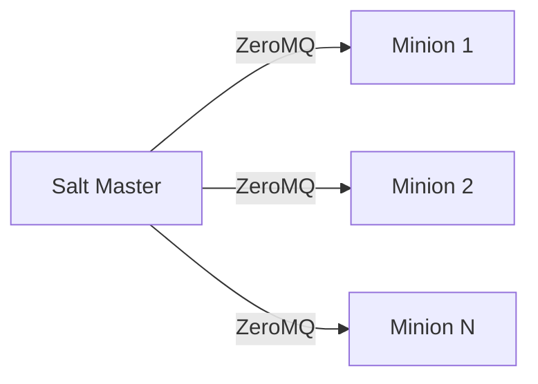
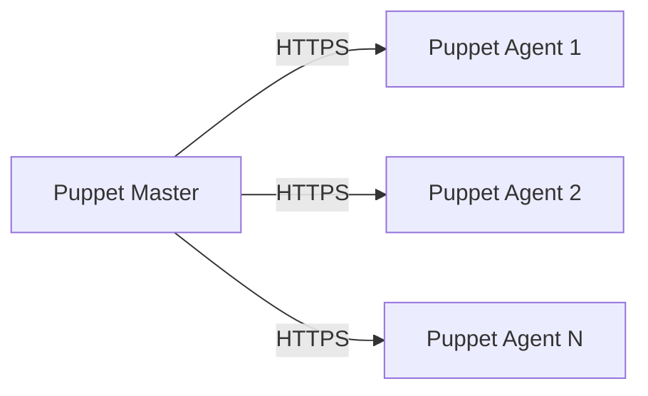
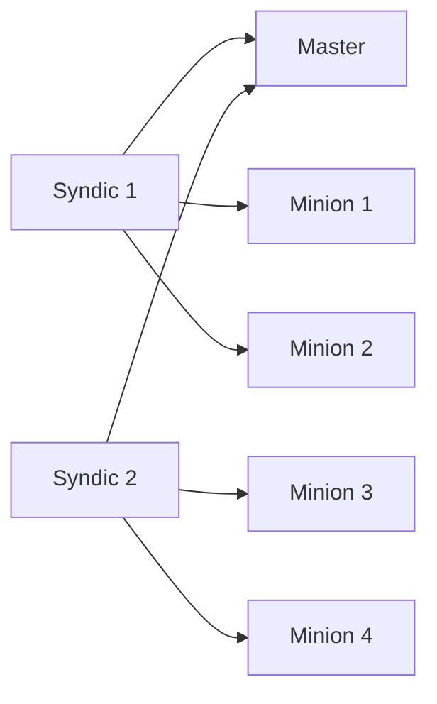
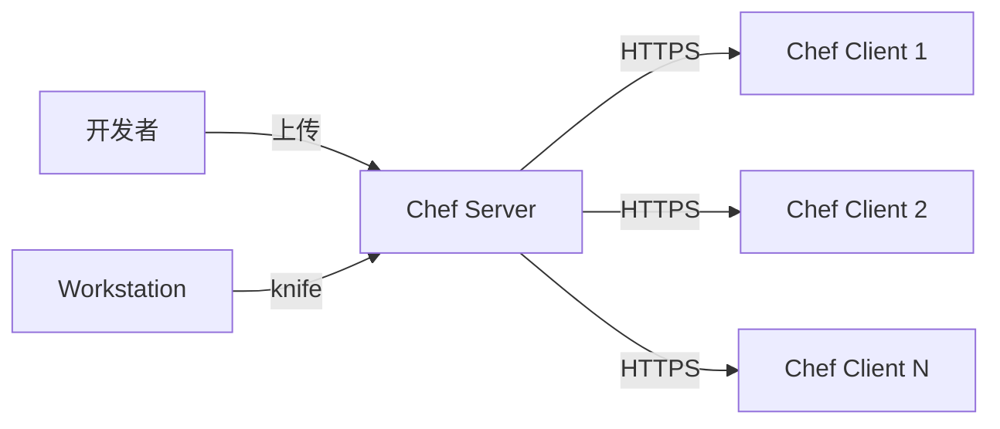
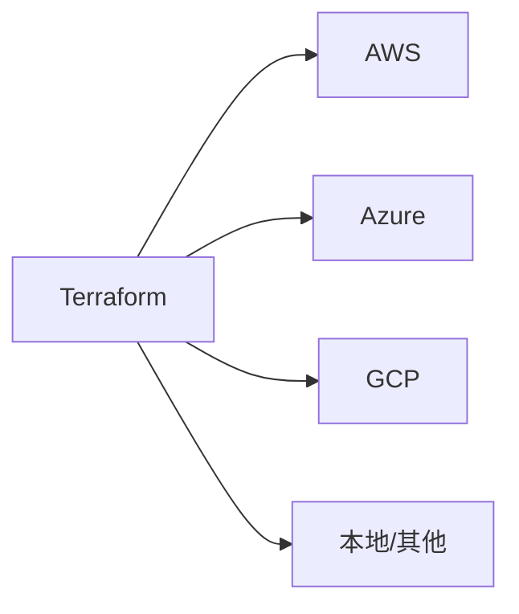
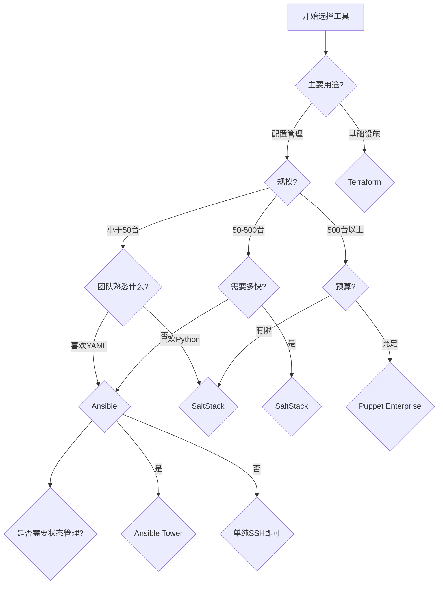
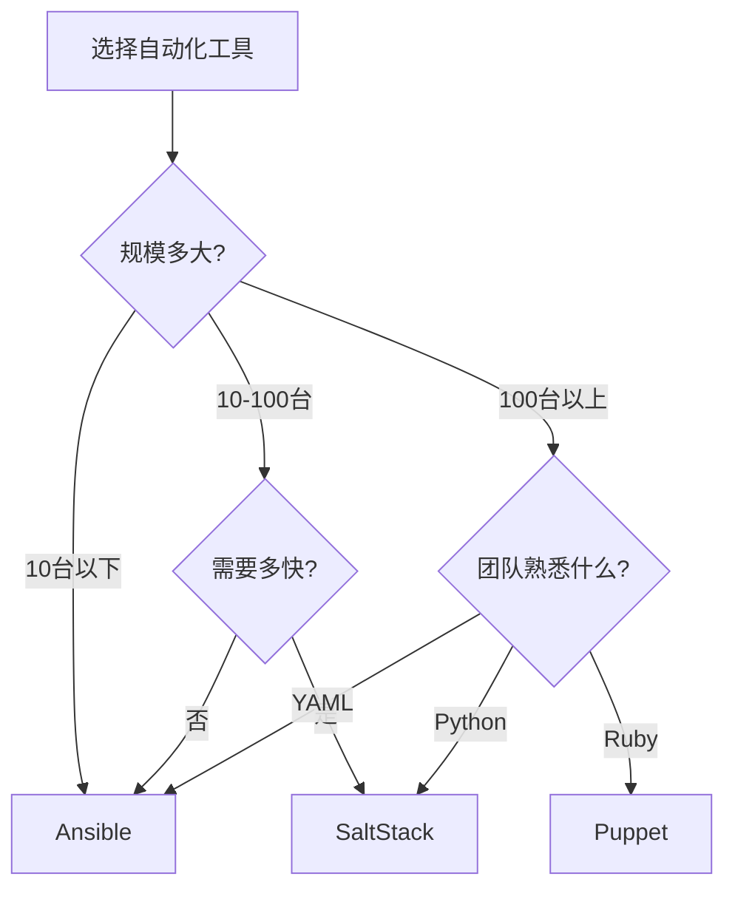

+++
title = "第62章：其他自动化工具"
weight = 620
date = "2026-03-24T13:18:28+08:00"
type = "docs"
description = ""
isCJKLanguage = true
draft = false
+++


# 第六十二章：其他自动化工具

## 62.1 SaltStack

### SaltStack 简介

SaltStack（简称 Salt）是另一个强大的自动化工具，与 Ansible 有很多相似之处，但也有一些独特优势。



| 特性 | Ansible | SaltStack |
|------|---------|-----------|
| 通信 | SSH | ZeroMQ/SSH |
| 速度 | 较快 | 非常快（毫秒级） |
| Agent | 无（SSH） | 需要 Minion |
| 并行执行 | 支持 | 支持（更高效） |
| 状态管理 | 模板 | SLS 文件 |

### SaltStack 安装

```bash
# Master 安装（控制节点）
# CentOS/RHEL
sudo yum install salt-master salt-minion
sudo systemctl enable salt-master salt-minion
sudo systemctl start salt-master

# Ubuntu/Debian
sudo apt install salt-master salt-minion
sudo systemctl enable salt-master salt-minion
sudo systemctl start salt-master
```

### Minion 配置

```bash
# /etc/salt/minion
master: 192.168.1.100    # Master 地址
minion_id: web-server-1   # Minion ID
master_port: 4506
minion_port: 4505

# 启动 Minion
sudo systemctl start salt-minion
```

### Master 配置

```bash
# /etc/salt/master
interface: 0.0.0.0
publish_port: 4505
ret_port: 4506
worker_threads: 10
file_roots:
  base:
    - /srv/salt
pillar_roots:
  base:
    - /srv/pillar
```

### Salt 命令

```bash
# 接受 Minion 密钥
sudo salt-key -A

# 查看已接受的密钥
sudo salt-key -L

# 测试 Minion 连通性
sudo salt '*' test.ping

# 执行命令
sudo salt 'web-*' cmd.run "uptime"

# 安装包
sudo salt 'db-*' pkg.install nginx

# 复制文件
sudo salt 'web-*' cp.get_file salt://nginx/nginx.conf /etc/nginx/nginx.conf
```

### Salt State（SLS）

```yaml
# /srv/salt/nginx/init.sls
nginx_install:
  pkg.installed:
    - name: nginx

nginx_service:
  service.running:
    - name: nginx
    - enable: True
    - require:
      - pkg: nginx_install

nginx_config:
  file.managed:
    - name: /etc/nginx/nginx.conf
    - source: salt://nginx/nginx.conf
    - template: jinja
    - require:
      - pkg: nginx_install
  service.running:
    - name: nginx
    - watch:
      - file: nginx_config
```

### 执行 State

```bash
# 应用 State
sudo salt '*' state.apply nginx

# 高状态文件
sudo salt '*' state.highstate

# 语法测试
sudo salt '*' state.sls nginx test=True

# 查看差异
sudo salt '*' state.show_highstate
```

### Salt Pillar

```yaml
# /srv/pillar/init.sls
# pillar 数据，类似变量

mysql_root_password: "{{ pillar.get('mysql_root_password', 'default_pass') }}"
app_version: 1.0.0

# /srv/pillar/top.sls
base:
  '*':
    - init
  'db-*':
    - database
```

### Salt Masterless

```bash
# 不需要 Master，在 Minion 本地执行
salt-call --local state.apply nginx
salt-call --local state.highstate
```

## 62.2 Puppet

### Puppet 简介

Puppet 是老牌的配置管理工具，采用声明式 DSL，有完善的企业版。



| 特性 | 说明 |
|------|------|
| 语言 | 自定义 DSL（Ruby 风格） |
| 工作模式 | Pull（Agent 拉取） |
| 配置 | 声明式（描述最终状态） |
| 幂等性 | 原生支持 |
| 企业版 | 功能强大（，商业版） |

### Puppet 安装

```bash
# CentOS/RHEL
# 安装 Puppet Repository
sudo rpm -ivh https://yum.puppetlabs.com/puppet7-release-el-7.noarch.rpm
sudo yum install puppetserver

# 启动
sudo systemctl enable puppetserver
sudo systemctl start puppetserver

# Agent 安装
sudo yum install puppet-agent
```

### Puppet Agent 配置

```bash
# /etc/puppetlabs/puppet/puppet.conf
[main]
server = puppet.example.com
certname = web-server-1.example.com
runinterval = 1800

# 启动 Agent
sudo systemctl start puppet
sudo systemctl enable puppet

# 手动触发
sudo puppet agent --test
```

### Puppet Manifest

```puppet
# 示例：安装 Nginx
# /etc/puppetlabs/code/environments/production/manifests/nginx.pp

class nginx {
  # 安装包
  package { 'nginx':
    ensure => installed,
  }

  # 配置文件
  file { '/etc/nginx/nginx.conf':
    ensure  => file,
    source  => 'puppet:///modules/nginx/nginx.conf',
    require => Package['nginx'],
  }

  # 服务
  service { 'nginx':
    ensure     => running,
    enable     => true,
    hasrestart => true,
    subscribe  => File['/etc/nginx/nginx.conf'],
  }
}

# 应用类
include nginx
```

### Puppet 资源类型

```puppet
# 包资源
package { 'vim':
  ensure => installed,
}

# 文件资源
file { '/tmp/test.txt':
  content => "Hello Puppet\n",
  mode    => '0644',
  owner   => 'root',
}

# 服务资源
service { 'sshd':
  ensure     => running,
  enable     => true,
  hasrestart => true,
}

# 用户资源
user { 'deploy':
  ensure     => present,
  shell      => '/bin/bash',
  home       => '/home/deploy',
  managehome => true,
}

# cron 资源
cron { 'backup':
  command => '/scripts/backup.sh',
  hour    => 2,
  minute  => 0,
  ensure  => present,
}
```

### Puppet 类和模块

```puppet
# /etc/puppetlabs/code/environments/production/modules/mysql/manifests/init.pp
class mysql {
  package { 'mysql-server':
    ensure => installed,
  }

  service { 'mysqld':
    ensure => running,
    enable => true,
  }

  file { '/etc/my.cnf':
    source => 'puppet:///modules/mysql/my.cnf',
    notify => Service['mysqld'],
  }
}
```

### Puppet Hiera

```yaml
# Hiera 数据（分层配置）
# /etc/puppetlabs/code/environments/production/hieradata/common.yaml
---
ntp::servers:
  - 0.pool.ntp.org
  - 1.pool.ntp.org

# /etc/puppetlabs/code/environments/production/hieradata/production.yaml
---
ntp::servers:
  - time1.example.com
  - time2.example.com

# 使用 Hiera 数据
class { 'ntp':
  servers => hiera('ntp::servers'),
}
```

### Puppet 环境

```bash
# /etc/puppetlabs/puppet/puppetserver.conf
environmentpath = /etc/puppetlabs/code/environments

# 创建环境
mkdir -p /etc/puppetlabs/code/environments/production/{manifests,modules}
mkdir -p /etc/puppetlabs/code/environments/staging/{manifests,modules}

# 指定环境运行
puppet agent --test --environment staging
```

### Salt Masterless 模式

不需要 Master，在 Minion 本地执行：

```bash
# 不需要 Master，在 Minion 本地执行
salt-call --local state.apply nginx
salt-call --local state.highstate

# 配置文件位置
# /etc/salt/minion.d/masterless.conf
master_type: disable
file_client: local
```

### Salt Grains

Grains 是 Salt Minion 的静态信息，用于目标定位和配置：

```bash
# 查看 grains 信息
sudo salt 'web-*' grains.items

# 查看特定 grains
sudo salt '*' grains.item os osrelease

# 自定义 grains
# /etc/salt/grains
roles:
  - webserver
  - api
environment: production
```

### Salt Pillar 进阶

Pillar 是 Salt 的数据管理中心，支持分层配置：

```yaml
# /srv/pillar/top.sls
base:
  '*':
    - common
  'os:Ubuntu':
    - ubuntu
  'role:web':
    - webserver
```

```yaml
# /srv/pillar/webserver.sls

nginx_user: www-data

nginx_user: nginx


web_port: 80
app_path: /var/www/app
```

### Salt Reactor（事件驱动）

Reactor 允许 Salt 根据事件自动响应：

```bash
# /etc/salt/master
reactor:
  - 'minion_start':
    - /srv/reactor/start.sls
  - 'salt/auth/fail':
    - /srv/reactor/auth_fail.sls
```

```yaml
# /srv/reactor/start.sls
new_minion_start:
  local.state.apply:
    - tgt: {{ data['id'] }}
    - arg:
      - setup
```

### Salt Wheel 模块

Wheel 模块用于管理 Salt Master 本身：

```bash
# 管理密钥
sudo salt-run wheel.key.list_all
sudo salt-run wheel.key.accept minions=('minion1', 'minion2')
sudo salt-run wheel.key.reject minions=('bad_minion',)

# 查看 runner
sudo salt-run wheel.config.values
```

### Salt Syndic（分布式 Master）



```bash
# Syndic 配置
# /etc/salt syndic
# syndic_master: 192.168.1.100
# syndic_master_port: 4506
```

### SaltSSH（无 Agent 模式）

不需要 Minion，使用 SSH 执行：

```bash
# 配置 roster
# /etc/salt/roster
web1:
  host: 192.168.1.101
  user: ubuntu
  sudo: True

# 执行
sudo salt-ssh 'web-*' state.sls nginx
```

---

## 62.3 Chef 简介

Chef 是另一个老牌的配置管理工具，与 Puppet 齐名。

### Chef vs 其他工具



| 特性 | Chef | Puppet | Ansible |
|------|------|--------|---------|
| 配置语言 | Ruby DSL | 自定义 DSL | YAML |
| 服务器 | 必须有 Chef Server | 可选 Master | 可无（ Ansible Tower） |
| Agent | Chef Client | Puppet Agent | 无或 SSH |
| 难度 | 较高 | 中高 | 较低 |

### Chef 核心概念

| 概念 | 说明 |
|------|------|
| Recipe | 食谱，描述如何配置一个组件 |
| Cookbook | 食谱书，包含多个 Recipe |
| Resource | 资源类型（package、file、service） |
| Attribute | 属性，节点的特征 |
| Template | 模板，配置文件模板 |
| Role | 角色，一组 Recipe 和属性 |
| Environment | 环境（dev、staging、prod） |

### Chef 安装

```bash
# 安装 Chef DK (Development Kit)
# https://downloads.chef.io/chefdk

# Linux/macOS
curl -L https://omnitruck.chef.io/install.sh | sudo bash

# 验证安装
chef --version
```

### Chef 基础配置

```bash
# 初始化 Chef 工作目录
mkdir chef-repo
cd chef-repo
chef generate repo .

# 创建 cookbook
chef generate cookbook mycookbook

# 目录结构
mycookbook/
├── recipes/
│   └── default.rb
├── attributes/
├── templates/
├── files/
└── metadata.rb
```

### Chef Recipe 示例

```ruby
# recipes/default.rb

# 安装 Nginx
package 'nginx' do
  action :install
end

# 启动服务
service 'nginx' do
  action [:enable, :start]
end

# 复制配置
template '/etc/nginx/nginx.conf' do
  source 'nginx.conf.erb'
  owner 'root'
  group 'root'
  mode '0644'
  notifies :restart, 'service[nginx]'
end

# 创建网站目录
directory '/var/www/myapp' do
  owner 'www-data'
  group 'www-data'
  mode '0755'
  action :create
end
```

### Chef 资源类型

```ruby
# package 资源
package 'vim' do
  action :install
end

# service 资源
service 'nginx' do
  action [:enable, :start]
end

# file 资源
file '/tmp/test.txt' do
  content 'Hello Chef!'
  mode '0644'
  owner 'root'
end

# directory 资源
directory '/opt/myapp' do
  owner 'app'
  group 'app'
  mode '0755'
  recursive true
end

# user 资源
user 'deploy' do
  shell '/bin/bash'
  home '/home/deploy'
  manage_home true
end

# cron 资源
cron 'backup' do
  hour '2'
  minute '0'
  command '/scripts/backup.sh'
end
```

### Chef 模板

```erb
# templates/default/nginx.conf.erb
user <%= @nginx_user %>;
worker_processes <%= @worker_processes %>;
pid /run/nginx.pid;

events {
    worker_connections <%= @max_connections %>;
}

http {
    include /etc/nginx/mime.types;
    
    server {
        listen <%= @port %>;
        server_name <%= @server_name %>;
        
        location / {
            root <%= @document_root %>;
        }
    }
}
```

### Chef 角色

```ruby
# roles/webserver.rb
name 'webserver'
description 'Web Server Role'
run_list 'recipe[nginx]', 'recipe[myapp]'

default_attributes({
  'nginx' => {
    'port' => 80,
    'worker_processes' => 4
  }
})

override_attributes({
  'myapp' => {
    'environment' => 'production'
  }
})
```

### Chef 执行

```bash
# 使用 knife 与 Server 通信
knife node list
knife cookbook upload mycookbook
knife role from file webserver.rb

# Chef Client 本地模式（无 Server）
chef-client --local-mode --recipe-url=/path/to/recipe.rb

# Chef Zero（本地测试）
chef-zero &
knifecookbook local-mode
```

### Chef Solo（历史版本）

```bash
# chef-solo 配置文件
# /etc/chef/solo.rb
cookbook_path '/root/cookbooks'
json_attribs '/etc/chef/node.json'

# 运行
chef-solo -c /etc/chef/solo.rb
```

---

## 62.4 Terraform 基础设施即代码

Terraform 是 HashiCorp 出品的"基础设施编排器"，专注于云资源管理。

### Terraform vs 其他工具

| 工具 | Terraform | Ansible | Chef |
|------|-----------|---------|------|
| 定位 | 基础设施 | 配置管理 | 配置管理 |
| 语言 | HCL | YAML | Ruby |
| 状态 | 有状态 | 无状态 | 无状态 |
| 用途 | 创建/销毁云资源 | 配置已有服务器 | 配置已有服务器 |



### Terraform 安装

```bash
# macOS
brew install terraform

# Linux
wget https://releases.hashicorp.com/terraform/1.6.0/terraform_1.6.0_linux_amd64.zip
unzip terraform_1.6.0_linux_amd64.zip
sudo mv terraform /usr/local/bin/

# 验证
terraform --version
```

### Terraform 基本配置

```hcl
# main.tf

# 指定 Provider
provider "aws" {
  region = "us-east-1"
}

# 创建资源
resource "aws_instance" "web" {
  ami           = "ami-0c55b159cbfafe1f0"
  instance_type = "t2.micro"
  
  tags = {
    Name        = "web-server"
    Environment = "production"
  }
}

# 创建安全组
resource "aws_security_group" "web_sg" {
  name = "web-security-group"
  
  ingress {
    from_port   = 80
    to_port     = 80
    protocol    = "tcp"
    cidr_blocks = ["0.0.0.0/0"]
  }
  
  egress {
    from_port   = 0
    to_port     = 0
    protocol    = "-1"
    cidr_blocks = ["0.0.0.0/0"]
  }
}
```

### Terraform 命令

```bash
# 初始化
terraform init

# 格式化代码
terraform fmt

# 验证配置
terraform validate

# 预览执行计划
terraform plan

# 应用更改
terraform apply

# 查看当前状态
terraform show

# 列出资源
terraform state list

# 销毁资源
terraform destroy

# 输出
terraform output
```

### Terraform 变量和输出

```hcl
# variables.tf
variable "instance_type" {
  description = "EC2 实例类型"
  type        = string
  default     = "t2.micro"
}

variable "environment" {
  description = "环境名称"
  type        = string
  default     = "production"
}

# outputs.tf
output "instance_ip" {
  description = "实例公网 IP"
  value       = aws_instance.web.public_ip
}

output "instance_id" {
  description = "实例 ID"
  value       = aws_instance.web.id
}
```

### Terraform 模块

```hcl
# modules/vpc/main.tf
module "vpc" {
  source = "./modules/vpc"
  
  cidr_block = "10.0.0.0/16"
  environment = var.environment
}
```

---

## 62.5 工具对比总结

| 工具 | Ansible | SaltStack | Puppet | Chef | Terraform |
|------|---------|-----------|--------|------|-----------|
| 架构 | 无 Agent/SSH | Master-Minion | Master-Agent | Server-Agent | 无 Agent |
| 配置语言 | YAML | YAML + Python | 自定义 DSL | Ruby DSL | HCL |
| 速度 | 快 | 非常快 | 中等 | 中等 | 取决于云 API |
| 学习曲线 | 低 | 中 | 中高 | 高 | 中 |
| 社区 | 活跃 | 活跃 | 成熟 | 成熟 | 非常活跃 |
| 企业版 | Tower/AWX | SaltStack Enterprise | Puppet Enterprise | Chef Automate | Terraform Cloud |
| 适用场景 | 通用 | 大规模高性能 | 大型企业 | 大型企业 | 云基础设施 |

### 工具选择决策树



### 实际生产环境推荐

| 场景 | 推荐工具 | 原因 |
|------|---------|------|
| 小团队，快速起步 | Ansible | 上手快，文档丰富 |
| 100+服务器，追求速度 | SaltStack | ZeroMQ 超快 |
| 大型企业，成熟流程 | Puppet | 10+年企业级方案 |
| 混合云基础设施 | Terraform + Ansible | 各司其职 |
| 容器环境 | Ansible + kubectl | 与 K8s 完美结合 |

---

> 💡 **温馨提示**：
> 工具选型没有标准答案，关键看团队背景和业务需求。记住：**最好的工具是团队能用好的工具**。不要追新，找到平衡点才是王道！

---

**第六十二章：其他自动化工具 — 完结！** 🎉

下一章我们将学习"负载均衡"，掌握 Nginx、HAProxy、LVS、云负载均衡等内容。敬请期待！ 🚀

## 本章小结

本章我们学习了其他自动化运维工具：

| 工具 | 特点 | 适用场景 |
|------|------|---------|
| SaltStack | 速度快、ZeroMQ 通信 | 大规模、高性能需求 |
| Puppet | 成熟、声明式 DSL | 企业级、大规模 |

自动化工具选择指南：



---

> 💡 **温馨提示**：
> 工具只是手段，不是目的。选择最适合自己的就好。对于大多数场景，Ansible 已经足够；对于大规模、高性能需求，可以考虑 SaltStack；对于大型企业且有预算，Puppet Enterprise 是不错的选择。

---

**第六十二章：其他自动化工具 — 完结！** 🎉

下一章我们将学习"负载均衡"，掌握 Nginx、HAProxy、LVS、云负载均衡等内容。敬请期待！ 🚀
