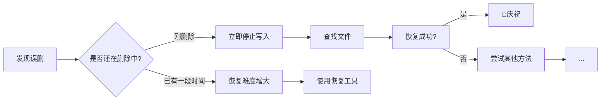
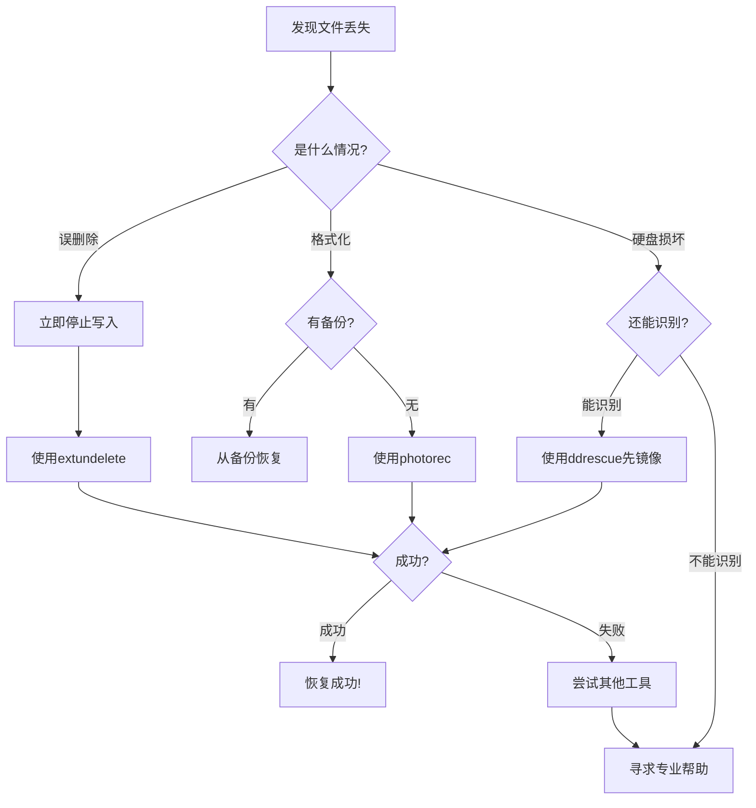
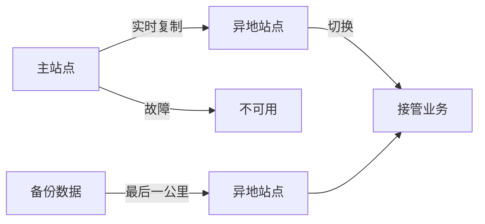
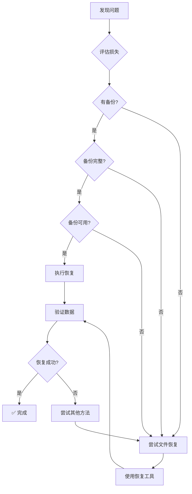

+++
title = "第60章：数据恢复"
weight = 600
date = "2026-03-24T13:18:28+08:00"
type = "docs"
description = ""
isCJKLanguage = true
draft = false
+++


# 第六十章：数据恢复

## 60.1 文件恢复

### 误删文件的"黄金时间"

> "世界上最痛苦的事，不是文件丢了，而是文件丢了却不知道能恢复。"
> —— 过来人的忠告



### 恢复的前提条件

**关键：误删文件后，千万别往磁盘写入新数据！**

```bash
# 立即卸载分区或只读挂载
umount /dev/sda1
mount -o remount,ro /dev/sda1

# 如果 /home 是单独分区
umount /home

# 如果是根分区，使用 Live USB 启动
```

### extundelete（Ext4 文件恢复）

```bash
# 安装
sudo apt install extundelete

# 查看已删除文件（模拟）
extundelete /dev/sda1 --inode 2

# 恢复特定文件
extundelete /dev/sda1 --restore-file path/to/deleted/file

# 恢复目录
extundelete /dev/sda1 --restore-directory path/to/deleted/dir

# 恢复所有删除文件
extundelete /dev/sda1 --restore-all

# 按时间恢复
extundelete /dev/sda1 --restore-files-after 2024-01-01
```

### testdisk（分区恢复）

```bash
# 安装
sudo apt install testdisk

# 启动（交互式）
sudo testdisk

# 命令行恢复
photorec /dev/sda1

# photorec 恢复已删除文件
sudo photorec /dev/sda1
# 选择分区 → File Opt → 选择要恢复的文件类型 → Search
```

### ext4magic

```bash
# 安装
sudo apt install ext4magic

# 恢复所有文件
ext4magic /dev/sda1 -r -f / -d /recovery

# 按文件名恢复
ext4magic /dev/sda1 -r -f "myfile.txt" -d /recovery

# 按时间恢复
ext4magic /dev/sda1 -a $(date -d '7 days ago' +%s) -r -d /recovery
```

### Scalpel（文件雕刻）

Scalpel 是基于文件系统结构的"雕刻"工具，不依赖文件系统元数据：

```bash
# 安装
sudo apt install scalpel

# 配置
sudo nano /etc/scalpel/scalpel.conf

# 编辑配置文件，取消注释需要的文件类型
# 示例：
pdf     y       10000000    \x25\x50\x44\x46    \x25\x25\x45\x4f\x46
jpg     y       20000000    \xff\xd8\xff\xe0    \xff\xd9
png     y       10000000    \x89\x50\x4e\x47    \x49\x45\x4e\x44
doc     y       10000000    \xd0\xcf\x11\xe0    \x00\x00\x00\x00

# 运行恢复
sudo scalpel /dev/sda1 -o /recovery

# 查看恢复的文件
ls -lh /recovery/jpg-*-0/
```

### Foremost（文件雕刻老前辈）

```bash
# 安装
sudo apt install foremost

# 配置
sudo nano /etc/foremost.conf

# 运行恢复
foremost -t jpg,pdf,doc -i /dev/sda1 -o /recovery

# 查看结果
ls -lh /recovery/jpg/
```

### ddrescue（磁盘镜像）

创建磁盘镜像后再恢复，避免进一步损坏：

```bash
# 安装
sudo apt install gddrescue

# 创建磁盘镜像（重要！先镜像再恢复）
sudo ddrescue /dev/sda1 /backup/disk.img /backup/disk.log

# 从镜像恢复文件
# 先在镜像上运行恢复工具
sudo extundelete /backup/disk.img --restore-all

# 或使用 mount 挂载镜像
sudo mount -o loop /backup/disk.img /mnt/recovery
```

### 恢复工具对比

| 工具 | 类型 | 适用场景 | 优点 | 缺点 |
|------|------|---------|------|------|
| extundelete | 元数据恢复 | Ext4文件系统 | 简单易用 | 仅Ext4 |
| ext4magic | 元数据恢复 | Ext4文件系统 | 可恢复目录 | 仅Ext4 |
| testdisk | 分区恢复 | 丢失分区 | 恢复分区表 | 较复杂 |
| photorec | 文件雕刻 | 任何文件系统 | 不依赖FS | 可能碎片化 |
| scalpel | 文件雕刻 | 已知文件头尾 | 速度快 | 需要配置 |
| foremost | 文件雕刻 | 多种文件类型 | 经典工具 | 配置复杂 |
| ddrescue | 镜像工具 | 损坏磁盘 | 防止进一步损坏 | 耗时 |

### 文件恢复的"黄金法则"



### 常见文件恢复场景

**场景一：误删除了重要文档**
```bash
# 1. 立即卸载分区
sudo umount /dev/sda1

# 2. 使用 extundelete
sudo extundelete /dev/sda1 --restore-all

# 3. 恢复的文件在 RECOVERED_FILES/ 目录
ls -la RECOVERED_FILES/
```

**场景二：不小心格式化了U盘**
```bash
# 1. 不要在格式化的分区写入任何数据！
# 2. 使用 photorec
sudo photorec /dev/sdb

# 3. 选择U盘分区 → File Opt → 选择要恢复的文件类型 → Search

# 4. 恢复的文件在 recup_dir.1 等目录
```

**场景三：分区表损坏**
```bash
# 1. 使用 testdisk 分析
sudo testdisk

# 2. 选择损坏的磁盘
# 3. 选择分区表类型（通常是 Intel）
# 4. 选择 Analyse → Quick Search
# 5. 如果找到分区，选择 Write 保存
```

**场景四：硬盘有坏道**
```bash
# 1. 先创建镜像（跳过坏道）
sudo ddrescue --no-split /dev/sda1 /backup/disk.img /backup/disk.log

# 2. 尝试恢复数据
sudo mount -o ro,loop /backup/disk.img /mnt/recovery

# 3. 或者在镜像上运行恢复工具
sudo extundelete /backup/disk.img --restore-all
```

### 恢复脚本

```bash
#!/bin/bash
# recover_deleted.sh

TARGET_PARTITION="/dev/sda1"
RECOVERY_DIR="/recovery"
LOG_FILE="/var/log/recovery.log"

mkdir -p "$RECOVERY_DIR"

echo "[$(date)] 开始恢复已删除文件" | tee -a "$LOG_FILE"

# 使用 extundelete 恢复
echo "尝试 extundelete..." | tee -a "$LOG_FILE"
extundelete "$TARGET_PARTITION" --restore-all --output-dir "$RECOVERY_DIR/extundelete" 2>&1 | tee -a "$LOG_FILE"

# 使用 photorec 恢复
echo "尝试 photorec..." | tee -a "$LOG_FILE"
echo "请手动运行: sudo photorec $TARGET_PARTITION"

echo "[$(date)] 恢复完成" | tee -a "$LOG_FILE"
ls -la "$RECOVERY_DIR"
```

## 60.2 数据库恢复

### MySQL/MariaDB 恢复

```bash
# 基本恢复
mysql -u root -p database_name < backup.sql

# 恢复所有数据库
mysql -u root -p < all_databases.sql

# 解压并恢复
gunzip < backup.sql.gz | mysql -u root -p database_name

# 恢复特定表
mysql -u root -p database_name -e "DROP TABLE IF EXISTS users;"
mysql -u root -p database_name < users_table.sql
```

### 基于时间点恢复

```bash
# 1. 恢复完整备份
mysql -u root -p < full_backup.sql

# 2. 获取 binlog 位置
# (在备份时使用 --master-data=2，记录了 binlog 位置)

# 3. 应用 binlog 到指定时间点
mysqlbinlog --stop-datetime="2024-01-15 14:30:00" \
    binlog.000001 binlog.000002 | mysql -u root -p
```

### MySQL 全量+增量恢复

```bash
#!/bin/bash
# point_in_time_recovery.sh

DB_USER="root"
DB_PASS="password"
DB_NAME="myapp"
BACKUP_DIR="/backup/mysql"

# 恢复最近完整备份
echo "恢复完整备份..."
mysql -u "$DB_USER" -p"$DB_PASS" "$DB_NAME" < "$BACKUP_DIR/latest_full.sql"

# 获取备份后的 binlog
START_BINLOG=$(cat "$BACKUP_DIR/binlog_position.txt")
STOP_TIME="2024-01-15 14:30:00"

# 应用增量
echo "应用 binlog..."
mysqlbinlog --start-position="$START_BINLOG" \
    --stop-datetime="$STOP_TIME" \
    /var/lib/mysql/binlog.* | mysql -u "$DB_USER" -p"$DB_PASS"
```

### PostgreSQL 恢复

```bash
# 基本恢复
psql -U postgres database_name < backup.sql

# 恢复压缩文件
gunzip -c backup.sql.gz | psql -U postgres database_name

# 恢复自定义格式
pg_restore -U postgres -d database_name backup.dump

# 创建新数据库并恢复
createdb -U postgres new_database
pg_restore -U postgres -d new_database backup.dump
```

### PostgreSQL PITR（时间点恢复）

```bash
# 1. 配置 wal archiving
# postgresql.conf
# wal_level = replica
# archive_mode = on
# archive_command = 'cp %p /archive/%f'

# 2. 恢复命令
pg_ctl stop -D $PGDATA

# 3. 备份现有数据
mv $PGDATA $PGDATA.broken

# 4. 恢复基础备份
pg_basebackup -U replication -D $PGDATA -X stream

# 5. 创建恢复配置
cat > $PGDATA/recovery.conf << EOF
restore_command = 'cp /archive/%f %p'
recovery_target_time = '2024-01-15 14:30:00 UTC'
EOF

# 6. 启动 PostgreSQL
pg_ctl start -D $PGDATA
```

### Redis 恢复

```bash
# 停止 Redis
sudo systemctl stop redis

# 恢复 RDB 文件
sudo cp /backup/dump.rdb /var/lib/redis/dump.rdb
sudo chown redis:redis /var/lib/redis/dump.rdb

# 恢复 AOF
sudo cp /backup/appendonly.aof /var/lib/redis/appendonly.aof

# 启动 Redis
sudo systemctl start redis

# 验证
redis-cli PING
redis-cli DBSIZE
```

### MongoDB 恢复

```bash
# 恢复整个备份
mongorestore --db database_name /backup/mongo/database_name/

# 恢复压缩备份
mongorestore --gzip --archive=/backup/mongo.gz

# 恢复特定集合
mongorestore --db database_name --collection users /backup/users.bson

# 恢复并覆盖
mongorestore --db database_name --drop /backup/database_name/

# 验证恢复
mongo database_name --eval "db.stats()"
```

## 60.3 系统恢复

### GRUB 引导恢复

```bash
# 1. 使用 Live USB 启动
# 2. 挂载原系统分区
sudo mount /dev/sda1 /mnt
sudo mount --bind /dev /mnt/dev
sudo mount --bind /proc /mnt/proc
sudo mount --bind /sys /mnt/sys

# 3. chroot 到原系统
sudo chroot /mnt

# 4. 重新安装 GRUB
grub-install /dev/sda
update-grub

# 5. 退出并重启
exit
sudo umount -R /mnt
sudo reboot
```

### 系统文件恢复

```bash
# 1. 使用 Live USB 启动
# 2. 挂载并 chroot（见上）

# 3. 重新安装损坏的包
apt-get install --reinstall dpkg coreutils bash

# 4. 如果系统文件完全损坏，重新安装基础包
apt-get install --reinstall $(dpkg --get-selections | grep install | cut -f1)

# 5. 修复依赖
apt-get -f install
```

### MBR 恢复

```bash
# 备份 MBR
sudo dd if=/dev/sda of=/backup/mbr.img bs=512 count=1

# 恢复 MBR
sudo dd if=/backup/mbr.img of=/dev/sda bs=512 count=1

# 仅恢复 MBR（保留分区表）
sudo dd if=/backup/mbr.img of=/dev/sda bs=446 count=1

# 重建 GRUB
grub-install /dev/sda
```

### 备份与恢复整个系统

```bash
#!/bin/bash
# system_backup.sh

TARGET="/dev/sda"
BACKUP_FILE="/backup/system_$(date +%Y%m%d).img.gz"

# 备份（排除不需要的目录）
sudo dd if="$TARGET" bs=4M | gzip > "$BACKUP_FILE"

# 恢复
gunzip -c "$BACKUP_FILE" | sudo dd of="$TARGET" bs=4M
```

### 使用 Timeshift（系统快照）

```bash
# 安装
sudo apt install timeshift

# 创建快照
sudo timeshift --create --comments "Before upgrade"

# 查看快照
sudo timeshift --list

# 恢复快照
sudo timeshift --restore

# 定时快照（编辑 /etc/timeshift.json）
```

### 使用 Rsync 备份整个系统

```bash
#!/bin/bash
# rsync_system_backup.sh

SOURCE="/"
DEST="/external/backup/system"
EXCLUDES="/root/backup_excludes.txt"

# 创建排除列表
cat > "$EXCLUDES" << EOF
/dev/*
/proc/*
/sys/*
/tmp/*
/run/*
/mnt/*
/media/*
/lost+found
/var/cache/*
/home/*/.cache
EOF

# 执行备份
rsync -aAXHv \
    --exclude-from="$EXCLUDES" \
    --delete \
    "$SOURCE" "$DEST"
```

### 云端系统恢复

```bash
# AWS EC2 备份（快照）
# 1. 创建 EBS 快照
aws ec2 create-snapshot \
    --volume-id vol-1234567890abcdef0 \
    --description "System backup $(date)" \
    --tag-specifications 'ResourceType=snapshot,Tags=[{Key=Name,Value=SystemBackup}]'

# 2. 从快照创建新卷
aws ec2 create-volume \
    --snapshot-id snap-1234567890abcdef0 \
    --availability-zone us-east-1a

# 3. 附加到实例
aws ec2 attach-volume \
    --volume-id vol-0987654321fedcba0 \
    --instance-id i-1234567890abcdef0 \
    --device /dev/sdf

# Google Cloud 备份
gcloud compute disks snapshot DISK_NAME --snapshot-names=SNAPSHOT_NAME
gcloud compute disks create NEW_DISK --source-snapshot=SNAPSHOT_NAME
```

## 恢复检查清单

```bash
#!/bin/bash
# recovery_check.sh - 恢复后必做检查

echo "========== 恢复后检查清单 =========="

echo "1. 检查磁盘空间"
df -h

echo "2. 检查关键文件"
for file in /etc/passwd /etc/shadow /etc/group /etc/fstab; do
    if [ -f "$file" ]; then
        echo "  ✓ $file 存在"
    else
        echo "  ✗ $file 缺失！"
    fi
done

echo "3. 检查服务状态"
for svc in sshd nginx mysql postgresql redis; do
    if systemctl is-active --quiet "$svc" 2>/dev/null; then
        echo "  ✓ $svc 运行正常"
    else
        echo "  ⚠ $svc 未运行或不存在"
    fi
done

echo "4. 检查启动项"
systemctl list-unit-files --state=enabled | grep -v "listed"

echo "5. 检查网络"
ip addr
ping -c 3 8.8.8.8

echo "6. 检查日志"
journalctl -p err --since "1 hour ago" | tail -10

echo "========== 检查完成 =========="
```

### MySQL 数据库修复

当数据库损坏时的急救措施：

```bash
# 检查表
mysqlcheck -u root -p database_name

# 检查并修复所有表
mysqlcheck -u root -p --auto-repair --optimize --all-databases

# 修复特定表
myisamchk /var/lib/mysql/database/users.MYI

# 如果是 InnoDB 表损坏，尝试
mysql -u root -p
# 执行（在 my.cnf 中添加：innodb_force_recovery=1）
# 然后导出数据，重建数据库
```

### 误删表的紧急恢复

```bash
# 如果开启了 binlog，可以从 binlog 恢复
# 1. 查看 binlog 事件
mysqlbinlog --database=myapp /var/lib/mysql/binlog.000001 > /tmp/binlog.sql

# 2. 找到误删操作的时间点
mysqlbinlog --database=myapp --start-datetime="2024-01-15 10:00:00" \
    --stop-datetime="2024-01-15 10:30:00" /var/lib/mysql/binlog.* > /tmp/deleted.sql

# 3. 编辑删除恢复数据
# 在 binlog 中搜索 DROP TABLE 或 DROP DATABASE
# 找到之前的 position，恢复到那个点之前
```

### 异地容灾恢复

当主站点完全不可用时：



```bash
# 异地恢复步骤
# 1. 确认主站点不可恢复
# 2. 激活异地灾备站点
# 3. 更新 DNS 指向新 IP
# 4. 验证应用连接
# 5. 通知用户

# DNS 切换策略
# 方案一：修改域名解析
# 在 DNS 提供商处修改 A 记录指向新的 IP

# 方案二：使用 CDN 回源
# 通过 CDN 回源到新的站点

# 方案三：使用负载均衡健康检查
# 异地站点健康检查通过后自动切换
```

### 数据库恢复演练

```bash
#!/bin/bash
# database_recovery_drill.sh - 定期进行数据库恢复演练

DB_NAME="myapp"
DRILL_DIR="/backup/drill"
TIMESTAMP=$(date +%Y%m%d_%H%M%S)

echo "========== 数据库恢复演练 =========="
echo "时间: $TIMESTAMP"
echo "数据库: $DB_NAME"

# 创建测试环境
echo "1. 创建测试数据库..."
mysql -u root -p -e "CREATE DATABASE IF NOT EXISTS ${DB_NAME}_drill_${TIMESTAMP};"

# 恢复备份到测试库
echo "2. 恢复备份到测试库..."
zcat /backup/mysql/${DB_NAME}_latest.sql.gz | \
    mysql -u root -p "${DB_NAME}_drill_${TIMESTAMP}"

# 验证数据完整性
echo "3. 验证数据..."
TABLE_COUNT=$(mysql -u root -p -N -e \
    "SELECT COUNT(*) FROM information_schema.tables WHERE table_schema='${DB_NAME}_drill_${TIMESTAMP}';")
echo "   恢复表数量: $TABLE_COUNT"

ROW_COUNT=$(mysql -u root -p -N -e \
    "SELECT SUM(table_rows) FROM information_schema.tables WHERE table_schema='${DB_NAME}_drill_${TIMESTAMP}';")
echo "   恢复记录数: $ROW_COUNT"

# 检查关键表
echo "4. 检查关键表..."
for table in users orders products; do
    if mysql -u root -p -e "SELECT 1 FROM ${DB_NAME}_drill_${TIMESTAMP}.${table} LIMIT 1;" 2>/dev/null; then
        echo "   ✓ $table 存在"
    else
        echo "   ✗ $table 缺失！"
    fi
done

# 清理测试数据库
echo "5. 清理测试数据库..."
mysql -u root -p -e "DROP DATABASE IF EXISTS ${DB_NAME}_drill_${TIMESTAMP};"

echo "========== 演练完成 =========="
```

## 本章小结

本章我们学习了数据恢复的完整方案：

| 恢复类型 | 工具/方法 | 说明 |
|---------|-----------|------|
| 文件恢复 | extundelete/testdisk | 恢复误删文件 |
| MySQL | mysql + binlog | 时间点恢复 |
| PostgreSQL | pg_restore + WAL | PITR 恢复 |
| Redis | RDB/AOF | 持久化恢复 |
| MongoDB | mongorestore | 备份恢复 |
| 系统恢复 | GRUB/MBR | 引导修复 |

数据恢复流程：



---

> 💡 **温馨提示**：
> 恢复的黄金法则：**预防大于恢复**。做好备份、测试恢复、记录恢复步骤。记住：没有测试过的恢复方案等于没有恢复方案！

---

**第六十章：数据恢复 — 完结！** 🎉

下一章我们将学习"自动化运维"，掌握 Ansible 的安装、Inventory、Playbook、模块等核心知识。敬请期待！ 🚀
