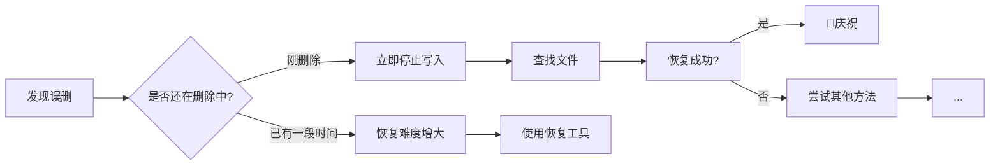
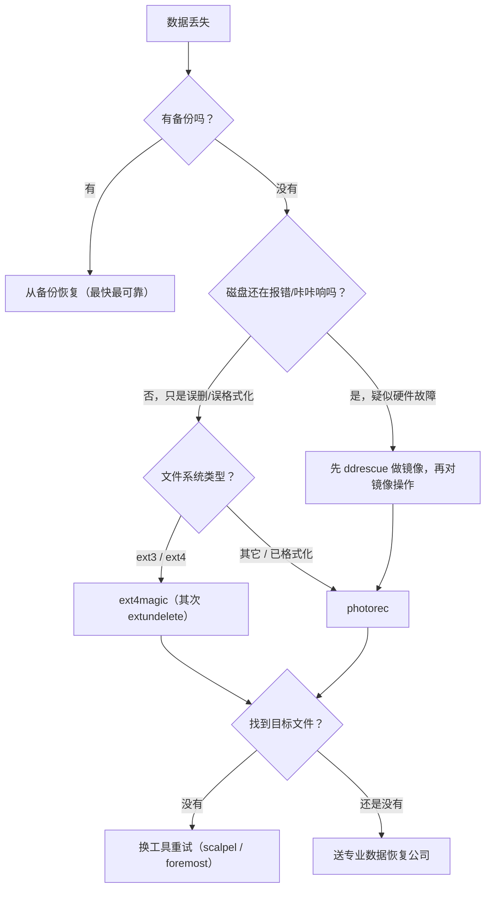
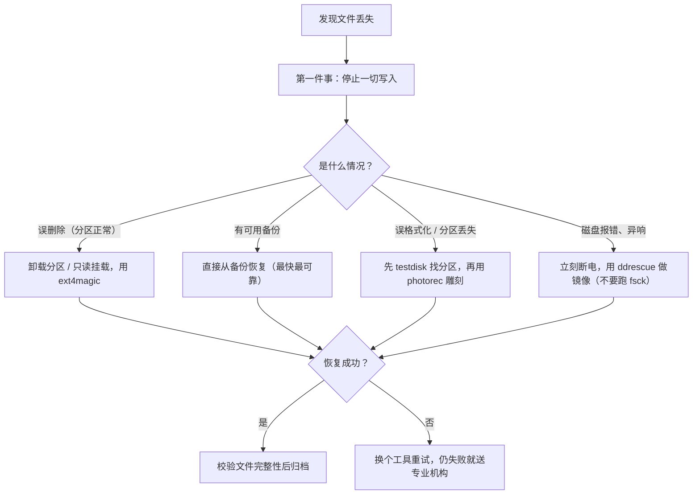
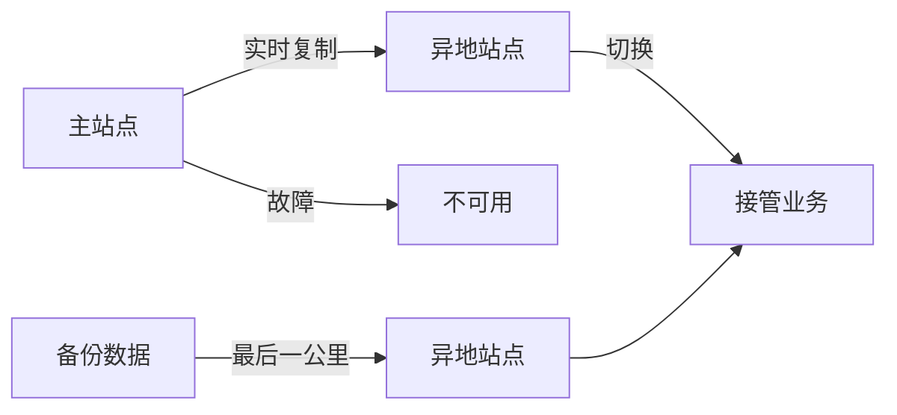
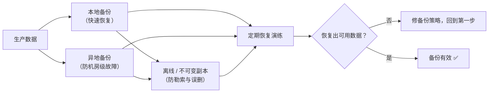
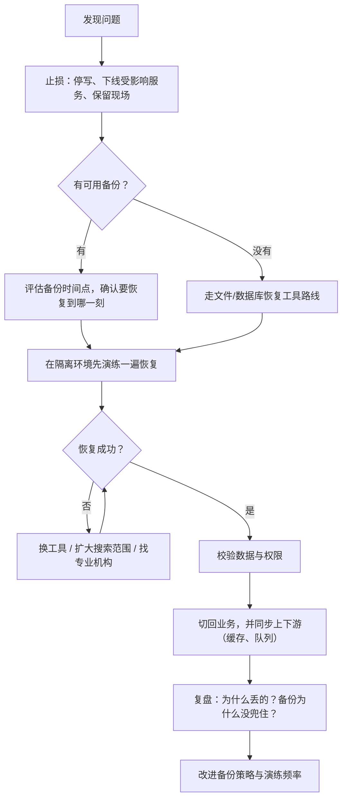

+++
title = "第60章：数据恢复"
weight = 600
date = "2026-03-24T13:18:28+08:00"
type = "docs"
description = ""
isCJKLanguage = true
draft = false
+++


# 第六十章：数据恢复

## 60.1 文件恢复

### 误删文件的"黄金时间"

> "世界上最痛苦的事，不是文件丢了，而是文件丢了却不知道能恢复。"
> —— 过来人的忠告


```mermaid
graph LR
    A[发现误删] --> B{是否还在删除中?}
    B -->|刚删除| C[立即停止写入]
    B -->|已有一段时间| D[恢复难度增大]
    C --> E[查找文件]
    D --> F[使用恢复工具]
    E --> G[恢复成功?]
    G -->|是| H[🎉庆祝]
    G -->|否| I[尝试其他方法]
    I --> J[...]
```

### 恢复的前提条件

**关键：误删文件后，千万别往磁盘写入新数据！**

```bash
# 立即卸载分区，或把它改成只读挂载
sudo umount /dev/sda1

# 卸载不掉（有进程在用）时，先找出占用者
sudo lsof +f -- /home
# 然后改为只读挂载：注意 remount 后面跟的是"挂载点"，不是设备名
sudo mount -o remount,ro /home

# 根分区没法卸载（系统正在跑），正确做法是用 Live USB 启动，
# 从 U 盘里的系统去操作那块硬盘
```

> ⚠️ **三个"手快就毁数据"的禁忌**：
> 1. 不要往原分区或同一块物理盘**写入任何东西**（下载恢复工具、保存恢复结果都不行）。
> 2. 恢复出来的文件要存到**另一块盘**，否则会覆盖还没读到的数据块。
> 3. 不要反复开关机、不要跑 `fsck -y`。`fsck` 会"修复"目录结构，**可能把残留的目录项直接清掉**，反而让可恢复的文件彻底消失。

### extundelete（Ext4 文件恢复）

```bash
# 安装
sudo apt install extundelete

# 查看已删除文件（模拟）
extundelete /dev/sda1 --inode 2

# 恢复特定文件
extundelete /dev/sda1 --restore-file path/to/deleted/file

# 恢复目录
extundelete /dev/sda1 --restore-directory path/to/deleted/dir

# 恢复所有删除文件
extundelete /dev/sda1 --restore-all

# 只恢复某个时间点之后删除的文件（--after 接的是"删除时间戳"）
extundelete /dev/sda1 --after 1704038400 --restore-all
# 时间用 Unix 时间戳，可用 date 换算：
#   date -d '2024-01-01' +%s

# 指定输出目录（务必放在另一块盘上）
extundelete /dev/sda1 --restore-all --output-dir /mnt/backup/RECOVERED
```

> ⚠️ **extundelete 已多年停止维护**（最后版本 0.2.4，2015 年）。它在启用了 `metadata_csum`、`64bit` 特性的现代 ext4 上经常直接报错或恢复不出文件——而这些特性从 e2fsprogs 1.43 起默认开启。换句话说，**在今天的发行版上 extundelete 成功率很低**。
>
> 可以先用 `sudo dumpe2fs -h /dev/sda1 | grep features` 看分区特性：
>
> - 带了 `metadata_csum` / `64bit`：优先用 `ext4magic` 或 `testdisk` / `photorec`。
> - 老的 ext4 / ext3：extundelete 仍可用。
>
> 它还有两个硬限制：**必须卸载分区**（挂载状态下会拒绝执行）；**只能恢复到"删除前的目录结构还在"的情况**。

### testdisk（分区恢复）

```bash
# 安装
sudo apt install testdisk

# 启动（交互式）
sudo testdisk

# testdisk 是交互式向导，典型流程：
# 选择磁盘 → 分区表类型（Intel/GPT）→ Analyse → Quick Search
#   → 没找到就 Deeper Search → 确认分区 → Write 写回分区表
# 写回前一定要先看清"将要写入的分区表"，这一步改错了会丢分区
sudo testdisk /dev/sda
```

> ⚠️ `testdisk` 和 `photorec` 是两个不同程序（同一个软件包）：**testdisk 修分区表，photorec 找文件**。网上很多命令把两者混着写。

### photorec（按文件签名找文件）

```bash
# photorec 同样是交互式的，但可以直接指定磁盘开始
cd /mnt/backup        # 先切到"另一块盘"的目录，恢复结果会落在 recup_dir.N/
sudo photorec /dev/sdb

# 交互流程：选择磁盘 → 选择分区 → 选择文件系统类型 → File Opt（勾选要恢复的类型）
#          → Search → 选择恢复目录
# 默认会匹配 480 多种文件签名，不勾选类型的话会恢复出海量无用文件
```

> 💡 photorec 的杀手锏是**不依赖文件系统元数据**，所以对"被格式化过的 U 盘、损坏的分区、相机存储卡"同样有效。代价是**恢复出来的文件没有原文件名和目录结构**，只剩 `f1234567.jpg` 这类编号，需要自己按时间、内容筛选。

### ext4magic

```bash
# 安装
sudo apt install ext4magic

# 恢复所有还能找到的文件到指定目录（目录要放在另一块盘上，且必须是空目录）
sudo mkdir -p /mnt/backup/recover
sudo ext4magic /dev/sda1 -r -d /mnt/backup/recover

# 只恢复某个文件（-f 后面跟原始路径）
sudo ext4magic /dev/sda1 -r -f /home/user/report.docx -d /mnt/backup/recover

# 只恢复某时间段内被删除的文件（时间格式：YYYYMMDDHHMMSS）
sudo ext4magic /dev/sda1 -r -a 20240115000000 -b 20240116000000 -d /mnt/backup/recover
```

> 💡 ext4magic 比 extundelete 更"能打"的地方在于：它**会去读 ext4 的日志（journal）**，从而恢复出文件名和目录结构。代价是**必须卸载分区**，而且**日志如果被新写的数据覆盖了就失效**——所以"停写"这一步永远是第一优先级。

### Scalpel（文件雕刻）

Scalpel 是基于文件系统结构的"雕刻"工具，不依赖文件系统元数据：

```bash
# 安装（Debian/Ubuntu 的包名是 scalpel；RHEL 系在 EPEL 里）
sudo apt install scalpel

# 1. 复制一份默认配置再改，别直接动 /etc 下的原件
sudo cp /etc/scalpel/scalpel.conf /root/scalpel.conf
sudo nano /root/scalpel.conf

# 2. 默认配置里所有类型都被注释掉了，必须手动"取消注释"才会生效
#    格式：扩展名  区分大小写  最大长度  文件头  文件尾
# 示例（去掉行首的 #）：
jpg     y       20000000    \xff\xd8\xff\xe0    \xff\xd9
png     y       10000000    \x89\x50\x4e\x47    \x49\x45\x4e\x44
pdf     y       10000000    %PDF                %EOF

# 3. 输出目录必须"事先存在且为空"，否则报错
sudo mkdir -p /mnt/backup/scalpel-out
sudo scalpel /dev/sda1 -c /root/scalpel.conf -o /mnt/backup/scalpel-out

# 4. 结果按类型分目录，文件名是编号
ls -lh /mnt/backup/scalpel-out/jpg-*/
```

> ⚠️ 三个容易卡住的点：
> 1. **输出目录不能落在待恢复的分区上**（等于一边读一边覆盖）。
> 2. **只勾选你真正要找的类型**。勾得越多、跑得越久，恢复出的垃圾也越多。
> 3. 文件头/文件尾写错会直接导致该类型一个都恢复不出来——不确定时先用默认配置里的值，它们经过了大量验证。

### Foremost（文件雕刻老前辈）

```bash
# 安装
sudo apt install foremost

# 只看有哪些可用类型（-t 后面接类型列表，逗号分隔不要空格）
# 常用：jpg gif png bmp avi mov pdf doc zip rar htm exe
sudo foremost -t jpg,png,pdf,zip -i /dev/sda1 -o /mnt/backup/foremost-out

# 结果在 audited.txt（审计报告）和按类型分的子目录里
cat /mnt/backup/foremost-out/audited.txt
ls -lh /mnt/backup/foremost-out/jpg/
```

> ⚠️ **foremost 也是个"老前辈"**（最后更新在 2010 年前后，由美国空军实验室开发）。它仍然可用，但面对现代的文件格式和容量已经力不从心。做文件雕刻时，**优先用 photorec（维护更活跃、支持格式更多）**；foremost 主要作为备选，或用它的自定义头尾规则能力。

### ddrescue（磁盘镜像）

创建磁盘镜像后再恢复，避免进一步损坏：

```bash
# 安装
sudo apt install gddrescue

# ⚠️ 注意包名叫 gddrescue，但命令名是 ddrescue；别装成 dd_rescue（是另一个老工具）

# 第一遍：快速把好读的区域全部抓下来（-n 表示不反复刮擦坏区）
sudo ddrescue -n /dev/sda /mnt/backup/disk.img /mnt/backup/disk.log

# 第二遍：针对剩下的坏区做刮擦式重读（不加 -n，多花时间但尽量把数据抠出来）
sudo ddrescue -d -r3 /dev/sda /mnt/backup/disk.img /mnt/backup/disk.log

# 关键点：
#  - 镜像整个磁盘 /dev/sda（而不是 /dev/sda1），分区偏移才能对齐
#  - 日志文件（.log）就是"进度记录"，分次运行必须带上它才能接着上次继续
#  - 盘正在坏的时候可以加 -R（反向读），绕过响应越来越慢的区域

# 从镜像恢复文件
# 先在镜像上运行恢复工具
sudo extundelete /backup/disk.img --restore-all

# 或挂载镜像（必须加 ro，绝不能以可写方式挂载，否则会破坏证据/数据）
sudo mount -o ro,loop,offset=$((2048*512)) /mnt/backup/disk.img /mnt/recovery
# 偏移量从分区表里取，用 fdisk -l /dev/sda 或 parted 查看"起始扇区"
```

> ⚠️ 老 ddrescue（1.18 及更早）里的 `--no-split` 在新版本中已改名为 `-n` / `--no-scrape`。网上还在流传 `--no-split` 的写法，在新版上会直接报"无效选项"。

> 💡 **"先做镜像再恢复"是所有数据恢复的铁律**：恢复工具会反复读取那块盘，一块已经开始坏的盘被反复读取，很可能从"部分可读"变成"完全读不出来"。先 ddrescue 出一份镜像，之后所有操作都在镜像上进行，随时可以重来。

### 恢复工具对比

| 工具 | 类型 | 适用场景 | 优点 | 缺点 |
|------|------|---------|------|------|
| `testdisk` | 分区表恢复 | 分区丢失、分区表损坏 | 能救回"整块分区" | 交互式，操作不可逆，需谨慎 |
| `photorec` | 文件雕刻 | 格式化、分区损坏、任何文件系统 | 不依赖文件系统元数据 | 丢文件名/目录结构，文件海量 |
| `ext4magic` | 元数据 + 日志 | ext3/ext4 误删、误清空 | 能靠 journal 还原文件名 | 仅 ext 系；分区必须卸载 |
| `extundelete` | 元数据恢复 | 老 ext3 / 老 ext4 | 命令简单 | **已停维护**，现代 ext4 常失败 |
| `scalpel` | 文件雕刻 | 已知头尾特征、想按类型筛 | 可精细控制 | 需要手改配置 |
| `foremost` | 文件雕刻 | 作为 photorec 的备选 | 经典、规则可自定义 | **多年未更新**，能力有限 |
| `ddrescue` | 磁盘镜像 | 磁盘有坏道、必须先保全现场 | 断点续做、防止二次损伤 | 耗时长，需要额外存储空间 |

**选择顺序建议**（按"先易后难、先保现场"）：


```mermaid
flowchart TD
    A["数据丢失"] --> B{"有备份吗？"}
    B -->|有| C["从备份恢复（最快最可靠）"]
    B -->|没有| D{"磁盘还在报错/咔咔响吗？"}
    D -->|"是，疑似硬件故障"| E["先 ddrescue 做镜像，再对镜像操作"]
    D -->|"否，只是误删/误格式化"| F{"文件系统类型？"}
    F -->|"ext3 / ext4"| G["ext4magic（其次 extundelete）"]
    F -->|"其它 / 已格式化"| H["photorec"]
    E --> H
    G --> I{"找到目标文件？"}
    H --> I
    I -->|"没有"| J["换工具重试（scalpel / foremost）"]
    I -->|"还是没有"| K["送专业数据恢复公司"]
```

### 文件恢复的"黄金法则"


```mermaid
graph TD
    A["发现文件丢失"] --> B["第一件事：停止一切写入"]
    B --> C{"是什么情况？"}
    C -->|"误删除（分区正常）"| D["卸载分区 / 只读挂载，用 ext4magic"]
    C -->|"误格式化 / 分区丢失"| E["先 testdisk 找分区，再用 photorec 雕刻"]
    C -->|"磁盘报错、异响"| F["立刻断电，用 ddrescue 做镜像（不要跑 fsck）"]
    C -->|"有可用备份"| H["直接从备份恢复（最快最可靠）"]
    D --> I{"恢复成功？"}
    H --> I
    E --> I
    F --> I
    I -->|"是"| J["校验文件完整性后归档"]
    I -->|"否"| K["换个工具重试，仍失败就送专业机构"]
```

> 💡 形状上的区别值得留意：**方块是动作，菱形是判断**。看流程时先找菱形，判断清楚了再动手，比一上来就 `extundelete --restore-all` 靠谱得多。

### 常见文件恢复场景

**场景一：误删除了重要文档**
```bash
# 1. 立即卸载分区（卸不掉就先改成只读挂载）
sudo umount /dev/sda1

# 2. 确认分区特性，决定用哪个工具
sudo dumpe2fs -h /dev/sda1 | grep features
#   出现 metadata_csum / 64bit → 用 ext4magic（extundelete 大概率失败）
sudo mkdir -p /mnt/backup/recover
sudo ext4magic /dev/sda1 -r -d /mnt/backup/recover
#   特性较老、或上面失败时再试：
#   sudo extundelete /dev/sda1 --restore-all --output-dir /mnt/backup/recover

# 3. 查看结果（extundelete 默认落在当前目录的 RECOVERED_FILES/）
ls -la /mnt/backup/recover/
```

> ⚠️ 恢复出来的文件**先复制一份留档，再打开检查**。某些恢复工具输出的文件内容的块是错位的，直接编辑可能把唯一的一份也搞坏。

**场景二：不小心格式化了U盘**
```bash
# 1. 不要在格式化的分区写入任何数据！
#    也尽量别用同一台机器的系统盘当输出目标
# 2. 进入另一块盘的目录，再启动 photorec
cd /mnt/backup
sudo photorec /dev/sdb

# 3. 选择U盘分区 → File Opt → 选择要恢复的文件类型 → Search

# 4. 恢复的文件在 recup_dir.1 等目录（文件名是编号，需要自己按内容筛）
```

> 💡 格式化（尤其是"快速格式化"）通常只改写了文件系统的元数据区，**数据块本身大多还在**，所以 photorec 这类雕刻工具的命中率往往比误删场景更高。

**场景三：分区表损坏**
```bash
# 1. 先备份当前分区表（有备无患，出问题还能回到现状）
sudo sfdisk -d /dev/sda > /mnt/backup/parttable-before.txt

# 2. 使用 testdisk 分析
sudo testdisk /dev/sda
#    选择磁盘 → 分区表类型（Intel=Mbr/GPT）→ Analyse → Quick Search
#    → 找到分区后可以按 P 预览里面的文件（确认是不是要找的分区）
#    → 确认无误再 Write 写回分区表
```

> ⚠️ **这一步是"改结构"，不是"读数据"**。写回分区表之前，务必用 `P` 键确认能列出文件；写错了要立刻用第 1 步备份的原始分区表恢复。

**场景四：硬盘有坏道**
```bash
# 1. 先创建镜像（整盘，不是单个分区），-n 表示第一遍快速抓取不刮擦
sudo ddrescue -n /dev/sda /mnt/backup/disk.img /mnt/backup/disk.log
#    再补一遍刮擦式重读
sudo ddrescue -d -r3 /dev/sda /mnt/backup/disk.img /mnt/backup/disk.log

# 2. 尝试挂载镜像（只读！偏移量从分区表里读）
sudo fdisk -l /mnt/backup/disk.img
sudo mount -o ro,loop,offset=$((2048*512)) /mnt/backup/disk.img /mnt/recovery

# 3. 或者在镜像上运行恢复工具
sudo ext4magic /mnt/backup/disk.img -r -d /mnt/backup/recover
```

> ⚠️ 老写法 `--no-split` 在 ddrescue 1.19+ 已被 `-n` / `--no-scrape` 取代。另外**别在坏盘上跑 `fsck`**：它会大量读写，等于加速硬盘报废。

### 恢复脚本

```bash
#!/bin/bash
# recover_deleted.sh
set -uo pipefail       # 恢复失败要允许继续尝试下一个工具，所以不加 -e

TARGET_PARTITION="${1:?用法: $0 <设备，如 /dev/sda1>}"
RECOVERY_DIR="/mnt/backup/recovery-$(date +%Y%m%d_%H%M%S)"
LOG_FILE="/var/log/recovery.log"

mkdir -p "$RECOVERY_DIR/ext4magic" "$RECOVERY_DIR/extundelete"

echo "[$(date)] 开始恢复已删除文件" | tee -a "$LOG_FILE"
echo "目标分区: $TARGET_PARTITION" | tee -a "$LOG_FILE"
echo "输出目录: $RECOVERY_DIR（务必在另一块物理盘上）" | tee -a "$LOG_FILE"

# 1) 先看文件系统特性，决定主用工具
sudo dumpe2fs -h "$TARGET_PARTITION" 2>/dev/null | grep -i features | tee -a "$LOG_FILE"

# 2) ext4magic：读 journal，能还原文件名（推荐首选）
echo "尝试 ext4magic..." | tee -a "$LOG_FILE"
sudo ext4magic "$TARGET_PARTITION" -r -d "$RECOVERY_DIR/ext4magic" 2>&1 | tee -a "$LOG_FILE" || \
    echo "ext4magic 失败，继续尝试下一个工具" | tee -a "$LOG_FILE"

# 3) extundelete：老 ext4/ext3 上还有机会
echo "尝试 extundelete..." | tee -a "$LOG_FILE"
sudo extundelete "$TARGET_PARTITION" --restore-all \
    --output-dir "$RECOVERY_DIR/extundelete" 2>&1 | tee -a "$LOG_FILE" || \
    echo "extundelete 失败，继续尝试下一个工具" | tee -a "$LOG_FILE"

# 4) photorec 是交互式的，没法在这里自动跑完，给出提示
echo "如果上面都没找到，请手动执行：" | tee -a "$LOG_FILE"
echo "  cd $RECOVERY_DIR && sudo photorec $TARGET_PARTITION" | tee -a "$LOG_FILE"

echo "[$(date)] 本轮恢复结束，结果在 $RECOVERY_DIR" | tee -a "$LOG_FILE"
du -sh "$RECOVERY_DIR"
```

## 60.2 数据库恢复

### MySQL/MariaDB 恢复

```bash
# 基本恢复
mysql -u root -p database_name < backup.sql

# 恢复所有数据库
mysql -u root -p < all_databases.sql

# 解压并恢复
gunzip < backup.sql.gz | mysql -u root -p database_name

# 恢复特定表
mysql -u root -p database_name -e "DROP TABLE IF EXISTS users;"
mysql -u root -p database_name < users_table.sql
```

> ⚠️ **恢复前先确认三件事**：备份文件是完整的（`gzip -t backup.sql.gz` 能通过）、备份对应的 MySQL 大版本和目标一致、目标库已经被清空或确认可以覆盖。直接把备份灌进一个还有数据的库，轻则数据错乱，重则主键冲突中途失败、留下半份数据。

> 💡 命令行里带 `-p密码` 会把密码写进 shell 历史、并出现在 `ps` 输出里。生产脚本请改用配置文件：
>
> ```bash
> cat > ~/.my.cnf << 'EOF'
> [client]
> user=root
> password=你的密码
> EOF
> chmod 600 ~/.my.cnf
> mysql --defaults-extra-file=~/.my.cnf database_name < backup.sql
> ```

### 基于时间点恢复

```bash
# 1. 恢复完整备份
mysql -u root -p < full_backup.sql

# 2. 取出备份时记录的 binlog 位置
#    备份命令里要带 --source-data=2 它才会写进备份文件
#    ⚠️ MySQL 8.0.26 起 --master-data 已更名，新版本用 --source-data，
#       老教程里的 --master-data=2 在新版本会直接报错
grep -A2 "CHANGE REPLICATION SOURCE TO" full_backup.sql
# 输出里形如 SOURCE_LOG_FILE='binlog.000003', SOURCE_LOG_POS=156

# 3. 应用 binlog 到"误操作之前"的那个时间点
mysqlbinlog \
    --start-position=156 \
    --stop-datetime="2024-01-15 14:30:00" \
    /var/lib/mysql/binlog.000003 /var/lib/mysql/binlog.000004 \
  | mysql -u root -p
```

> ⚠️ **默认 binlog 格式是 ROW**。用 `mysqlbinlog` 直接看是乱码，加 `-v --base64-output=DECODE-ROWS` 才能看清每一行改了什么：
>
> ```bash
> mysqlbinlog -v --base64-output=DECODE-ROWS /var/lib/mysql/binlog.000003 | less
> ```
>
> **找到"误操作"的位置再回放**，是最容易被忽略的一步：先看 binlog 找到那条 `DROP` / `DELETE` 的确切 position，`--stop-position` 停到它之前。顺序错了等于把误操作又执行了一遍。

### MySQL 全量+增量恢复

```bash
#!/bin/bash
# point_in_time_recovery.sh
set -euo pipefail

DB_USER="root"
DB_NAME="myapp"
BACKUP_DIR="/backup/mysql"
MYSQL_CNF="$HOME/.my.cnf"        # 里面写 [client] user / password，权限 600

# ⚠️ 不要把密码写在变量里：会进 shell 历史，也会出现在 ps 输出中

# 恢复最近完整备份
echo "恢复完整备份..."
mysql --defaults-extra-file="$MYSQL_CNF" -u "$DB_USER" "$DB_NAME" < "$BACKUP_DIR/latest_full.sql"

# 取出备份时记录的 binlog 文件与起始位置
START_FILE=$(grep -oP "SOURCE_LOG_FILE='\K[^']+" "$BACKUP_DIR/latest_full.sql" | tail -1)
START_POS=$(grep -oP "SOURCE_LOG_POS=\K[0-9]+" "$BACKUP_DIR/latest_full.sql" | tail -1)
echo "从 $START_FILE:$START_POS 开始回放"

# 应用增量，停在误操作发生之前
# 注意：--stop-datetime 要和 MySQL 服务器同一时区，别混用 UTC 和本地时间
STOP_TIME="2024-01-15 14:30:00"
echo "应用 binlog..."
mysqlbinlog --start-position="$START_POS" \
    --stop-datetime="$STOP_TIME" \
    "/var/lib/mysql/$START_FILE" /var/lib/mysql/binlog.0000[0-9][0-9] \
  | mysql --defaults-extra-file="$MYSQL_CNF" -u "$DB_USER"

# 说明：起始 position 只对"第一个文件"有意义，
#       所以要把备份对应的那个文件排在第一位，后面按序跟上更新的文件

echo "完成。请立即核对关键表的数据是否已回到预期状态。"
```

> ⚠️ 回放 binlog 时也要**明确知道自己在做什么**：如果这台机器还在跑、还在写 binlog，回放出来的操作又会被写进新的 binlog，后续要继续做 PITR 就会乱。有条件的话，回放到一台**独立的临时实例**上验证，确认数据正确后再切流量。

### PostgreSQL 恢复

```bash
# 基本恢复
psql -U postgres database_name < backup.sql

# 恢复压缩文件
gunzip -c backup.sql.gz | psql -U postgres database_name

# 恢复自定义格式
pg_restore -U postgres -d database_name backup.dump

# 创建新数据库并恢复
createdb -U postgres new_database
pg_restore -U postgres -d new_database backup.dump
```

### PostgreSQL PITR（时间点恢复）

```bash
# ---------- 第一步：日常就要配好 WAL 归档（没配就没法 PITR） ----------
# postgresql.conf
# wal_level = replica
# archive_mode = on
# archive_command = 'test ! -f /archive/%f && cp %p /archive/%f'
# ⚠️ 直接写 'cp %p /archive/%f' 有隐患：目标文件已存在时 cp 会静默覆盖，也不报错，
#    加 test ! -f 之后"已存在"会返回非 0，PostgreSQL 就知道该重试，而不是假装归档成功。
#    生产环境更推荐用 pgBackRest / WAL-G 之类的工具，而不是裸 cp。

# 改完需要重启（archive_mode 是 postgresql.conf 里少数必须重启才生效的参数）
sudo systemctl restart postgresql
psql -c "SELECT name, setting FROM pg_settings WHERE name IN ('wal_level','archive_mode','archive_command');"

# ---------- 第二步：出事之后，先停库、保现场 ----------
sudo systemctl stop postgresql
sudo mv "$PGDATA" "${PGDATA}.broken"     # 不要删！留着它可能还能救出部分数据

# ---------- 第三步：把"事前"的基础备份放回数据目录 ----------
# 基础备份是出事之前就该定期做的（用 pg_basebackup 生成），
# 这里只是把它复制/解包回来，而不是现在才去连数据库拉一份新的。
sudo install -d -o postgres -g postgres -m 700 "$PGDATA"
sudo rsync -a --delete /backup/base/ "$PGDATA"/
sudo chown -R postgres:postgres "$PGDATA"

# ---------- 第四步：写恢复配置 ----------
# ⚠️ PostgreSQL 12 起已经没有 recovery.conf 这个文件了！
#    现在是把恢复参数写进 postgresql.conf（或 postgresql.auto.conf），
#    另外在数据目录里放一个空的 recovery.signal 文件作为"我要做恢复"的开关。
sudo tee -a "$PGDATA/postgresql.auto.conf" > /dev/null << 'EOF'
restore_command = 'cp /archive/%f %p'
recovery_target_time = '2024-01-15 14:30:00+00'
recovery_target_action = 'promote'
EOF

sudo touch "$PGDATA/recovery.signal"
sudo chown postgres:postgres "$PGDATA/postgresql.auto.conf" "$PGDATA/recovery.signal"
sudo chmod 600 "$PGDATA/postgresql.auto.conf"

# ---------- 第五步：启动并观察恢复日志 ----------
sudo systemctl start postgresql
sudo -u postgres psql -c "SELECT pg_is_in_recovery();"
# 等到它变成 f（已提升为主库）就说明恢复完成

# ---------- 第六步：确认数据没问题后，把恢复配置清理掉 ----------
# recovery.signal 在恢复成功时会被自动删除；
# 但 postgresql.auto.conf 里的 restore_command / recovery_target_time 还留着，
# 下次重启会让人误以为还在恢复流程里。业务验证通过后把它清掉。
```

> ⚠️ **两个最容易踩的坑**：
> 1. **`recovery_target_time` 的时区要写清楚**（推荐带 `+08` 或 `+00`），否则会和数据库日志里的时间对不上，恢复到的不是你要的那个点。
> 2. **恢复完不要直接把恢复配置留着当"默认配置"**。曾经的 PITR 参数留在 `postgresql.auto.conf` 里，是运维事故的常见来源。

### Redis 恢复

```bash
# 停止 Redis
sudo systemctl stop redis

# 先确认数据目录和文件名（不一定是默认值）
redis-cli CONFIG GET dir dbfilename appendonly
# dir        → 数据目录，例如 /var/lib/redis
# dbfilename → RDB 文件名，默认 dump.rdb
# appendonly → 是否开启 AOF，yes/no

# ---- 情况一：用 RDB 恢复 ----
sudo install -o redis -g redis -m 640 /backup/dump.rdb /var/lib/redis/dump.rdb
# 恢复前先校验 RDB 文件能不能读
sudo -u redis redis-check-rdb /var/lib/redis/dump.rdb

# ---- 情况二：用 AOF 恢复 ----
# ⚠️ Redis 7 起 AOF 不再是一个 appendonly.aof 文件，
#    而是 /var/lib/redis/appendonlydir/ 目录下的一组文件：
#      appendonly.aof.1.base.rdb   （基础快照）
#      appendonly.aof.1.incr.aof   （增量部分）
#      appendonly.aof.manifest     （清单，记录用了哪些文件）
#    所以恢复时要整目录一起放回去，只覆盖单个 .aof 文件是不完整的。
sudo systemctl stop redis
sudo rm -rf /var/lib/redis/appendonlydir
sudo cp -r /backup/appendonlydir /var/lib/redis/appendonlydir
sudo chown -R redis:redis /var/lib/redis/appendonlydir

# AOF 可能因为崩溃而写到一半，先校验并修复
sudo -u redis redis-check-aof --fix /var/lib/redis/appendonlydir/appendonly.aof.manifest

# 启动 Redis
sudo systemctl start redis

# 验证
redis-cli PING
redis-cli DBSIZE
redis-cli INFO persistence | grep -E 'rdb_last_bgsave_status|aof_last_write_status'
```

> ⚠️ 老版本（Redis 6 及以前）才是单文件 `appendonly.aof`。如果你的教程或脚本还在按单文件处理，在 Redis 7 上会**只恢复出部分数据，而且不报错**——这是很隐蔽的坑。

> 💡 恢复前一定要**先备份当前的（可能是坏的）数据目录再动手**。Redis 的 RDB/AOF 恢复是"覆盖式"的，一旦覆盖错文件，连坏数据都没了。

### MongoDB 恢复

```bash
# 恢复整个备份
mongorestore --db database_name /backup/mongo/database_name/

# 恢复压缩备份
mongorestore --gzip --archive=/backup/mongo.gz

# 恢复特定集合
mongorestore --db database_name --collection users /backup/users.bson

# 恢复并覆盖（⚠️ --drop 会先删掉目标库里的同名集合，确认后再用）
mongorestore --db database_name --drop /backup/database_name/

# 恢复时带上 oplog，才能把备份期间的增量也补上（备份时要 --oplog）
mongorestore --oplogReplay /backup/mongo/

# 验证恢复（MongoDB 6 起自带的 shell 是 mongosh，老的 mongo 命令已移除）
mongosh "mongodb://localhost:27017/database_name" --eval "db.stats()"
mongosh "mongodb://localhost:27017/database_name" --eval "db.getCollectionNames()"
```

> 💡 想让备份"一致"，`mongodump` 要加 `--oplog`（或对副本集用 `--oplog` 方式导出），恢复时配 `--oplogReplay`。否则在"边写边备份"的场景下，不同集合可能对应到不同的时间点，恢复出来的数据自相矛盾。

## 60.3 系统恢复

### GRUB 引导恢复

```bash
# 1. 使用 Live USB 启动
# 2. 挂载原系统分区
sudo mount /dev/sda1 /mnt
sudo mount --bind /dev /mnt/dev
sudo mount --bind /proc /mnt/proc
sudo mount --bind /sys /mnt/sys

# 3. chroot 到原系统
sudo chroot /mnt

# 4. 重新安装 GRUB —— BIOS 传统引导
grub-install /dev/sda
update-grub          # Debian/Ubuntu 写法
# RHEL / Rocky / Alma 系请用：
# grub2-mkconfig -o /boot/grub2/grub.cfg

# 5. 退出并重启
exit
sudo umount -R /mnt
sudo reboot
```

> ⚠️ **UEFI 机器（现在绝大多数）步骤不一样**：`grub-install /dev/sda` 是为传统 BIOS 准备的；UEFI 环境必须先挂上 EFI 系统分区、再指定目标：
>
> ```bash
> # EFI 分区一般是第一个分区（vfat 格式），先挂进去再 chroot
> sudo mount /dev/sda1 /mnt/boot/efi
> sudo chroot /mnt
> grub-install --target=x86_64-efi --efi-directory=/boot/efi --bootloader-id=ubuntu
> update-grub
> ```
>
> 判断当前是 BIOS 还是 UEFI：`[ -d /sys/firmware/efi ] && echo UEFI || echo BIOS`。搞错这一步的典型症状是"命令执行成功，重启后依然进不了系统"。

### 系统文件恢复

```bash
# 1. 使用 Live USB 启动
# 2. 挂载并 chroot（见上）

# 3. 重新安装损坏的包
apt install --reinstall dpkg coreutils bash libc6

# 4. 如果系统文件大面积损坏，重新安装"必要的系统包"
#    ⚠️ 千万别无条件重装全部包（apt install --reinstall $(dpkg -l | ...)），
#       那会把几百个包一起重装，耗时极长，还可能因为某个包下载失败而中断在半路。
#       只重装 essential/required 级别的系统包就够了：
apt install --reinstall $(dpkg-query -W -f '${Package} ${Priority}\n' \
    | awk '$2=="required"{print $1}')

# 5. 修复依赖
apt --fix-broken install
```

> 💡 Debian/Ubuntu 上还有一个"一键完整性校验"的办法：先装 `debsums`，再 `debsums -s`，它会比对每个已安装文件与包里记录的校验和，直接告诉你**哪些文件被改坏/丢掉了**，比盲目重装更精准。

> ⚠️ 如果损坏的是 `/etc` 下的配置（不是程序文件），重装包**不会覆盖你的现有配置**（Debian 会问你要不要用新版本）。这时应该显式恢复：`apt install --reinstall -o Dpkg::Options::="--force-confmiss" 包名`，或用备份里的 `/etc` 覆盖回来。

### MBR 恢复

```bash
# MBR 的 512 字节里有三段：0-445 引导代码、446-509 分区表、最后 2 字节签名

# 备份 MBR（含分区表）
sudo dd if=/dev/sda of=/mnt/backup/mbr.img bs=512 count=1

# 恢复整个 MBR
sudo dd if=/backup/mbr.img of=/dev/sda bs=512 count=1

# 仅恢复引导代码（446 字节），保住当前分区表
sudo dd if=/backup/mbr.img of=/dev/sda bs=446 count=1

# 重建 GRUB
sudo grub-install /dev/sda
```

> ⚠️ 这套 dd 手法**只适用于传统 BIOS + MBR 分区表**。现在多数新机器用的是 **GPT**：GPT 把分区表在磁盘开头和结尾各存一份，用 dd 拷 512 字节毫无意义，应该用 `sgdisk`（GPT 工具）备份/恢复，或者用 `gdisk`/`parted` 修复：
>
> ```bash
> sudo sgdisk --backup=/mnt/backup/gpt-backup.bin /dev/sda    # 备份分区表
> sudo sgdisk --load-backup=/mnt/backup/gpt-backup.bin /dev/sda  # 恢复分区表
> sudo sgdisk -v /dev/sda                                    # 校验
> ```

### 备份与恢复整个系统

```bash
#!/bin/bash
# system_backup.sh

TARGET="/dev/sda"
BACKUP_FILE="/mnt/backup/system_$(date +%Y%m%d).img.gz"

# ⚠️ dd 是"整盘按字节复制"，没有任何"排除目录"的能力。
#    整个盘有多大就产出多大的数据（压缩后依然是几十 GB 起）。
sudo dd if="$TARGET" bs=4M status=progress conv=fsync | gzip -1 > "$BACKUP_FILE"

# 恢复（⚠️ 会整盘覆盖，目标盘上的所有数据都会被抹掉）
gunzip -c "$BACKUP_FILE" | sudo dd of="$TARGET" bs=4M status=progress conv=fsync
sudo sync
```

> ⚠️ **在运行中的系统上 dd 出来的镜像不一致**：数据库文件、日志、内存里还没落盘的数据都会处于"半个状态"。这样的镜像能启动，但文件系统可能需要在恢复后跑一次 `fsck`，数据库更可能直接起不来。
>
> 所以：**要 dd 整盘，先从 Live USB 启动，让待备份的盘处于非挂载状态。**

> 💡 更实用的替代方案（按推荐度）：
>
> | 方案 | 特点 |
> |------|------|
> | `restic` / `borg` | 增量 + 去重 + 加密，能直接恢复到新机器，生产首选 |
> | `rsync` + `--link-dest` | 快照式增量，落地就是普通文件，好理解 |
> | `partclone` + `fsarchiver` | 只备份"用到的块"，比 dd 省空间 |
> | `dd` | 只在"盘已经坏了、要原样镜像取证"时才用 |

### 使用 Timeshift（系统快照）

```bash
# 安装
sudo apt install timeshift

# 创建快照
sudo timeshift --create --comments "Before upgrade"

# 查看快照
sudo timeshift --list

# 恢复快照（交互式，会让你选快照和目标设备，执行前务必看清）
sudo timeshift --restore

# 定时快照：编辑 /etc/timeshift/timeshift.json（配置界面里也能改）
# 例如 schedule_monthly=1、schedule_weekly=1 之类，然后重启 timeshift 的定时任务
sudo systemctl restart cron
```

> ⚠️ **Timeshift 不是数据备份工具**。它的定位是"系统回滚"（`/etc`、系统文件、引导），**默认不包含 `/home` 里的用户数据**。拿它去防"误删了工作文档"是防不住的。
>
> 另外它有两种后端：**RSYNC（用 rsync 做硬链接快照，任何文件系统都能用）**和 **BTRFS（用子卷快照，瞬时且省空间，但要求根分区就是 btrfs）**。选完后别随便换，换后端等于之前的快照全废。

### 使用 Rsync 备份整个系统

```bash
#!/bin/bash
# rsync_system_backup.sh

SOURCE="/"
DEST="/external/backup/system"
EXCLUDES="/root/backup_excludes.txt"

# 创建排除列表
cat > "$EXCLUDES" << EOF
/dev/*
/proc/*
/sys/*
/tmp/*
/run/*
/mnt/*
/media/*
/lost+found
/var/cache/*
/home/*/.cache
EOF

# 执行备份
rsync -aAXHv --numeric-ids \
    --exclude-from="$EXCLUDES" \
    --delete \
    "$SOURCE" "$DEST"
```

> ⚠️ `--delete` 是**镜像语义**：如果 DEST 里多出来的文件会被删掉，DEST 配置错了（比如不小心指向了 `/mnt/data`）就会造成新的数据损失。第一次跑之前，**先加 `-n`（dry-run）看一眼会删什么**：
>
> ```bash
> rsync -aAXHv --numeric-ids --delete --exclude-from="$EXCLUDES" -n / /mnt/backup/system
> ```

> 💡 **从 rsync 备份"恢复成一台能开机的系统"是有门槛的**，不是拷回去就完事。至少还要处理：
>
> 1. 重新安装引导（`grub-install` + `update-grub`）。
> 2. 核对 `/etc/fstab` 里的 UUID（新盘的 UUID 和旧盘不同，`blkid` 查新值）。
> 3. 恢复网络配置（`/etc/netplan`、NetworkManager 连接文件里的 MAC/IP）。
> 4. `restorecon`（SELinux 系统）或确认文件权限/扩展属性都还原了。
> 5. 逐项验证服务能起来（见"恢复后检查清单"）。
>
> 所以**恢复演练一定要真的做一次**，否则"备份齐全"只是心理安慰。

### 云端系统恢复

```bash
# AWS EC2 备份（快照）
# 1. 创建 EBS 快照
aws ec2 create-snapshot \
    --volume-id vol-1234567890abcdef0 \
    --description "System backup $(date)" \
    --tag-specifications 'ResourceType=snapshot,Tags=[{Key=Name,Value=SystemBackup}]'

# 2. 从快照创建新卷
aws ec2 create-volume \
    --snapshot-id snap-1234567890abcdef0 \
    --availability-zone us-east-1a

# 3. 附加到实例
aws ec2 attach-volume \
    --volume-id vol-0987654321fedcba0 \
    --instance-id i-1234567890abcdef0 \
    --device /dev/sdf

# Google Cloud 备份
gcloud compute disks snapshot DISK_NAME --snapshot-names=SNAPSHOT_NAME
gcloud compute disks create NEW_DISK --source-snapshot=SNAPSHOT_NAME
```

> 💡 云上快照的四个容易误解的点：
>
> 1. **快照不是备份**：它和原盘在同一个云账号、同一个区域，账号被封或误删快照策略都一起没。关键数据要额外做跨区域复制或导出到对象存储。
> 2. **快照是增量的，但恢复出来是完整的盘**：第一次快照较大，之后只记录变化，所以"删掉中间某个快照"要小心——很多云会自动做合并，也可能拒绝删除被别人依赖的快照。
> 3. **跨区域使用需要先复制**：广州的快照不能直接在北京创建云盘，要先用"复制快照"跨区搬运。
> 4. **快照策略（自动快照）比手工快照靠谱得多**，而且要配保留条数，否则快照费用会悄悄涨起来。

### 恢复后检查清单

恢复完不等于"事情结束"。下面这份清单建议直接存成脚本，每次恢复完都跑一遍：

```bash
#!/bin/bash
# recovery_check.sh - 恢复后必做检查
set -uo pipefail

echo "========== 恢复后检查清单 =========="

echo "1. 检查磁盘空间"
df -hT

echo "2. 检查关键文件"
for file in /etc/passwd /etc/shadow /etc/group /etc/fstab; do
    if [ -f "$file" ]; then
        echo "  ✓ $file 存在"
    else
        echo "  ✗ $file 缺失！"
    fi
done

echo "2b. 检查关键文件的权限（恢复后权限错乱是常见问题）"
stat -c '%a %U:%G %n' /etc/shadow /etc/passwd /etc/ssh/sshd_config 2>/dev/null

echo "3. 检查服务状态"
for svc in sshd nginx mysql postgresql redis; do
    if systemctl is-active --quiet "$svc" 2>/dev/null; then
        echo "  ✓ $svc 运行正常"
    else
        echo "  ⚠ $svc 未运行或不存在"
    fi
done

echo "4. 检查启动项"
systemctl list-unit-files --state=enabled | grep -v "listed"

echo "5. 检查挂载点与 fstab 是否一致（不一致会导致重启后进不去系统）"
findmnt --verify --fstab 2>/dev/null || echo "  ⚠ fstab 校验未通过，请人工确认"

echo "6. 检查网络"
ip addr
ping -c 3 8.8.8.8

echo "7. 检查日志中的错误"
journalctl -p err --since "1 hour ago" | tail -10

echo "8. 注意事项（需要人工确认）"
echo "  - 恢复出来的数据是否为最新版本？（对比备份时间与业务最后成功时间）"
echo "  - 数据库是否完成了崩溃恢复？（看 mysqld / postgresql 启动日志）"
echo "  - 定时任务、证书、密钥是否都已恢复？"
echo "  - 是否需要通知下游系统？（消息队列积压、缓存里的旧数据要清）"

echo "========== 检查完成 =========="
```

> 💡 第 8 项最容易被跳过，却最容易出事故。典型的"恢复成功但业务出错"就发生在这里：**数据库回滚到了 2 小时前，但缓存里还留着 2 小时后的数据**，用户看到的是自相矛盾的结果。恢复的最后一步，永远是"让上下游回到同一个时间点"。

## 60.4 数据库应急与容灾

### MySQL 数据库修复

当数据库损坏时的急救措施：

```bash
# ---------- 第一步：先判断"是哪些表坏了" ----------
# 注意：mysqlcheck 需要 MySQL 服务在运行（它连上去发 CHECK TABLE）
mysqlcheck -u root -p database_name

# 也可以用 SQL 直接看（InnoDB 建议用 CHECK TABLE，MyISAM 才能 REPAIR）
# CHECK TABLE users, orders;

# ---------- 第二步：能修的先修 ----------
# MyISAM / Aria 表可以直接修：
mysqlcheck -u root -p --auto-repair --optimize database_name

# 也可以离线修单个 MyISAM 表（要先停 MySQL，否则会损坏）
sudo systemctl stop mysql
sudo myisamchk -r /var/lib/mysql/database_name/users.MYI
sudo systemctl start mysql

# ⚠️ InnoDB 表不要用 myisamchk！它是 MyISAM 专用工具，
#    对着 InnoDB 的 .ibd 文件跑会直接损坏数据。

# ---------- 第三步：InnoDB 损坏时用"强制恢复模式"抢救数据 ----------
# 在 my.cnf 的 [mysqld] 段加入：
#   innodb_force_recovery = 1
# 数值可以 1→6 逐级加大（越大越能启动，但对数据的写入限制越严）：
#   1~3：能读能写部分数据；4 以上基本只读；6 连 redo 回滚都跳过
# 启动后【只做导出，不要写业务】：
#   mysqldump --single-transaction --routines --triggers myapp > /mnt/backup/rescue.sql
#
# 导出完成后立刻做两件事：
#   1. 把 innodb_force_recovery 从配置里删掉（否则数据库永远处于不完全可用状态）
#   2. 在一台全新的实例上导入这份 dump，用新实例替换旧实例
#      —— 不要在"强行启动起来的库"上继续跑业务
```

> ⚠️ `mysqlcheck --auto-repair --all-databases` 看着很"一键修复"，但它对 InnoDB 几乎无效（InnoDB 的崩溃恢复是启动时自动完成的），还可能在大库上长时间锁表。**先定位是哪张表、哪种引擎，再用对工具**。

### 误删表的紧急恢复

```bash
# 如果开启了 binlog，可以从 binlog 恢复
# 1. 把 binlog 转成可读的 SQL（ROW 格式必须加 -v --base64-output=DECODE-ROWS）
mysqlbinlog --database=myapp -v --base64-output=DECODE-ROWS \
    /var/lib/mysql/binlog.000001 > /tmp/binlog.sql

# 2. 找到那条误操作（DROP TABLE / DELETE）所在的位置
grep -n "DROP TABLE" /tmp/binlog.sql
#    在这条语句上方找 "# at 12345" 这样的注释，那个数字就是 position

# 3. 只回放到"误操作之前"
mysqlbinlog --database=myapp --stop-position=12345 \
    /var/lib/mysql/binlog.000001 | mysql --defaults-extra-file=~/.my.cnf

# 4. 如果误操作已经发生了，也可以"反向"补回来：
#    从 binlog 里想办法拿到被删数据（ROW 格式的 binlog 里往往能看到原始行数据），
#    整理成 INSERT 语句再导入。
#    用 binlog2sql / my2sql 这类工具可以自动把 binlog 解析成"反向 SQL"，
#    比手工翻省事得多。
```

> ⚠️ **回放 binlog 前先把它变成"只读的草稿"**：把解析出来的 SQL 先写到文件里、肉眼确认范围，再决定是否执行。直接管道进 `mysql` 等于"边看边执行"，发现不对时已经晚了。

> 💡 **恢复单张表最稳的路线其实是"全库恢复到临时实例，再只把那张表搬回来"**：
>
> ```bash
> # 在临时实例上完整恢复到误删之前
> mysql --defaults-extra-file=~/.my.cnf -h 127.0.0.1 -P 3307 myapp < /tmp/restored.sql
> # 然后只导出这一张表
> mysqldump --defaults-extra-file=~/.my.cnf -h 127.0.0.1 -P 3307 myapp users > /tmp/users.sql
> # 再导回生产库
> mysql --defaults-extra-file=~/.my.cnf myapp < /tmp/users.sql
> ```
>
> 这样做的好处是**不用在生产库上做任何实验**，也不会因为 binlog 里夹杂其他表的写操作而误改数据。

### 异地容灾恢复

当主站点完全不可用时：


```mermaid
graph LR
    A[主站点] -->|实时复制| B[异地站点]
    A -->|故障| C[不可用]
    B -->|切换| D[接管业务]
    
    E[备份数据] -->|最后一公里| F[异地站点]
    F --> D
```

先建立两个必须搞清的指标，它们决定了容灾方案要花多少钱：

| 指标 | 含义 | 由什么决定 |
|------|------|-----------|
| RPO（恢复点目标） | 最多能接受丢多少数据 | 备份/复制的频率与是否同步 |
| RTO（恢复时间目标） | 最多能接受停多久 | 切换流程的自动化程度、DNS 生效速度 |

> 💡 举个对照：**每天备份一次 + 人工切换**，RPO 可能是 24 小时、RTO 可能是 4 小时；**同步复制 + 自动健康检查切换**能把 RPO 压到接近 0、RTO 压到分钟级，但成本要翻好几倍。**先和业务方把这两个数字谈清楚**，再选方案。

```bash
# 异地恢复步骤
# 1. 确认主站点不可恢复
# 2. 激活异地灾备站点
# 3. 更新 DNS 指向新 IP
# 4. 验证应用连接
# 5. 通知用户

# DNS 切换策略
# 方案一：修改域名解析（最简单，但生效时间取决于 TTL）
# 在 DNS 提供商处把 A 记录指向新的 IP
# 关键前置动作：平时就把 TTL 调小（如 60 秒），否则切换要等几小时
#   ——但 TTL 调小意味着解析请求变多，也是成本

# 方案二：使用 CDN 回源
# 通过 CDN 回源到新的站点（CDN 的这一层切换通常比改 DNS 快）

# 方案三：使用负载均衡健康检查
# 异地站点健康检查通过后自动切换
# 比如 Route53 的故障转移路由、云解析的"主备地址池"，可以做到分钟级甚至秒级
```

> ⚠️ **异地容灾最忌讳"复制的和备份的不一致"**：数据库在异地实时复制（RPO≈0），但对象存储、缓存、消息队列里的数据只是每天备份一次，切换后就会对不上。**容灾要按"整个系统"来做，而不是只盯着数据库**。

> ⚠️ 还有一个常被忽视的点：**灾备站点平时是不是真的可用？** 只在出事时才启用的机器，很可能因为内核升级、证书过期、配置漂移而根本起不来。定期做**真实的切换演练**（在业务低峰期把流量切过去跑一段时间）是唯一有效的验证方式。

### 数据库恢复演练

```bash
#!/bin/bash
# database_recovery_drill.sh - 定期进行数据库恢复演练

DB_NAME="myapp"
DRILL_DIR="/mnt/backup/drill"
TIMESTAMP=$(date +%Y%m%d_%H%M%S)
MYSQL_CNF="$HOME/.my.cnf"      # [client] user / password，权限 600
DRILL_DB="${DB_NAME}_drill_${TIMESTAMP}"

# 恢复演练的正确姿势：最好恢复到"另一台实例"，退而求其次也要用独立库名。
# 用 -e 逐个传 -p 密码会让脚本每次都要交互，所以统一走配置文件。
MY="mysql --defaults-extra-file=$MYSQL_CNF"

echo "========== 数据库恢复演练 =========="
echo "时间: $TIMESTAMP"
echo "数据库: $DB_NAME"

# 创建测试环境
echo "1. 创建测试数据库..."
$MY -e "CREATE DATABASE IF NOT EXISTS \`${DRILL_DB}\`;"

# 恢复备份到测试库
echo "2. 恢复备份到测试库..."
zcat /backup/mysql/${DB_NAME}_latest.sql.gz | \
    $MY "${DRILL_DB}"

# 验证数据完整性
echo "3. 验证数据..."
TABLE_COUNT=$($MY -N -e \
    "SELECT COUNT(*) FROM information_schema.tables WHERE table_schema='${DRILL_DB}';")
echo "   恢复表数量: $TABLE_COUNT"

# ⚠️ information_schema.table_rows 对 InnoDB 只是"统计估算值"，会有偏差，
#    不能当作准确的记录数对比依据。要精确核对，请对关键表做 COUNT(*)。
echo "   关键表精确记录数："
for table in users orders products; do
    cnt=$($MY -N -e "SELECT COUNT(*) FROM \`${DRILL_DB}\`.\`${table}\`;" 2>/dev/null || echo "N/A")
    echo "     ${table}: ${cnt}"
done

# 检查关键表
echo "4. 检查关键表..."
for table in users orders products; do
    if $MY -e "SELECT 1 FROM \`${DRILL_DB}\`.\`${table}\` LIMIT 1;" >/dev/null 2>&1; then
        echo "   ✓ $table 存在"
    else
        echo "   ✗ $table 缺失！"
    fi
done

# 记录演练结果，便于对比"每次恢复出来的数据是否一致"
REPORT="${DRILL_DIR}/drill_${TIMESTAMP}.txt"
mkdir -p "$DRILL_DIR"
{ echo "时间: $TIMESTAMP"; echo "表数量: $TABLE_COUNT"; \
  echo "关键表: $(for t in users orders products; do \
      printf '%s=%s ' "$t" "$($MY -N -e "SELECT COUNT(*) FROM \`${DRILL_DB}\`.\`${t}\`;" 2>/dev/null || echo NA)"; done)"; \
} | tee "$REPORT"

# 清理测试数据库
echo "5. 清理测试数据库..."
$MY -e "DROP DATABASE IF EXISTS \`${DRILL_DB}\`;"

echo "========== 演练完成 =========="
echo "结果已记录到 $REPORT"
```

> ⚠️ 这个脚本在生产实例上建库、恢复、再删库——**演练本身就有风险**。更好的做法是在一台独立实例（或用容器临时起一个 MySQL）上跑，从网络层面就和生产隔离。真正要验证的是"备份文件能不能恢复出可用数据"，不是"敢不敢在生产库上操作"。

> 💡 **演练的三个验收点**，缺一个都不算通过：
>
> 1. **能恢复**：备份文件完整、能成功导入。
> 2. **数据对**：关键表的记录数、抽样内容、校验和与预期一致（这一步可以用 `pt-table-checksum` 之类的工具）。
> 3. **耗时可接受**：记录"从开始恢复到业务可用"花了多久——这就是你的真实 RTO。如果备份 200GB 却要恢复 6 小时，而业务只能容忍 1 小时，那就得改方案，而不是改期望。

## 60.5 备份策略：让"恢复"这件事有得可恢

本章讲的是"怎么救回来"，但决定成败的其实是**前面有没有留下可救的东西**。下面这套原则值得贴在墙上。

### 3-2-1-1-0 原则

| 数字 | 含义 | 落地做法 |
|------|------|----------|
| **3** | 至少 **3** 份数据 | 生产数据 + 本地备份 + 异地备份 |
| **2** | 存在 **2** 种不同介质上 | 服务器磁盘 + 对象存储 / 磁带 / NAS |
| **1** | 至少 **1** 份在异地 | 不同机房、不同区域，最好还是不同账号 |
| **1** | 至少 **1** 份离线或不可变 | 断网磁带、对象存储的"合规锁定 / WORM" |
| **0** | **0** 个未验证的备份 | 定期做恢复演练，确认备份真的能用 |

> 💡 加粗记住第 4 个 1：**离线/不可变备份是勒索软件的最后一道防线**。攻击者拿到权限后第一件事往往就是删备份——如果备份能被在线删除，那么"我们有备份"是句空话。对象存储的**版本控制 + 合规保留 + 对象锁定（Object Lock）**能有效对抗这种删除。

### 备份的三种粒度

| 类型 | 特点 | 恢复速度 | 典型工具 |
|------|------|----------|----------|
| 全量备份 | 每次都是完整副本 | 最快（直接还原） | `mysqldump` 全量、`pg_basebackup`、`tar` |
| 增量备份 | 只备份"上次备份之后的变化" | 快（但要按链条依次恢复） | 物理备份的增量、`restic`、`borg` |
| 差异备份 | 备份"上次全量之后的所有变化" | 中等 | 很多商业备份软件默认策略 |

> ⚠️ 增量备份的风险在"链条"：**中间任何一个增量损坏，从它之后的数据都恢复不出来**。所以常见做法是"每周一次全量 + 每天增量"，并且定期把增量链条合并（合并完可以顺带校验）。

### 保留策略与常见误区

| 误区 | 事实 |
|------|------|
| "做了 RAID 就不用备份" | RAID 只防单盘物理故障，**不防误删、病毒、逻辑损坏**，反而会把这些错误同步到所有盘 |
| "云上开快照就够了" | 快照和原盘同账号同区域，误删账号或删库带快照一起走；且快照通常有保留期限 |
| "备份跑成功了就是备份可用" | 备份任务成功 ≠ 数据可恢复。**只有恢复演练才能证明** |
| "全量备份最保险，那就天天全量" | 成本和时间会失控，通常更适合"全量 + 增量"组合 |
| "备份放在生产机本地最方便恢复" | 主机挂了、被加密了，备份也跟着没了 |


```mermaid
flowchart LR
    A["生产数据"] --> B["本地备份<br/>（快速恢复）"]
    A --> C["异地备份<br/>（防机房级故障）"]
    B --> D["离线 / 不可变副本<br/>（防勒索与误删）"]
    C --> D
    B --> E["定期恢复演练"]
    C --> E
    D --> E
    E --> F{"恢复出可用数据？"}
    F -->|"否"| G["修备份策略，回到第一步"]
    F -->|"是"| H["备份有效 ✅"]
```

### 备份的自动化检查清单

```bash
#!/bin/bash
# backup_health_check.sh —— 每天跑一次，确认"备份"这件事真的在发生
set -uo pipefail

BACKUP_DIR=/mnt/backup/mysql
MAX_AGE_HOURS=26      # 超过 26 小时没新备份就告警

# 1. 最新备份是不是太老了？
latest=$(ls -t "$BACKUP_DIR"/*.sql.gz 2>/dev/null | head -1)
if [ -z "$latest" ]; then
    echo "❌ 没有找到任何备份文件"; exit 1
fi
age_h=$(( ( $(date +%s) - $(stat -c %Y "$latest") ) / 3600 ))
echo "最新备份: $latest（$age_h 小时前）"
[ "$age_h" -le "$MAX_AGE_HOURS" ] || echo "❌ 备份过旧，请检查备份任务"

# 2. 备份文件完不完整？（gzip 能解压通过才算）
gzip -t "$latest" && echo "✅ 压缩包完整" || echo "❌ 压缩包损坏"

# 3. 备份文件大小是否异常（比平时小很多说明导出中途失败）
size=$(stat -c %s "$latest")
echo "大小: $(( size / 1024 / 1024 )) MB"

# 4. 磁盘空间是否还够（备份盘写满会导致后续备份静默失败）
df -h "$BACKUP_DIR" | tail -1
```

> 💡 备份最容易失败的方式不是"跑出错"，而是"**静默地不再跑**"：磁盘满了、密钥过期、任务被误删、cron 所在的机器重装了。所以**一定要有"备份心跳"告警**——超过预期时间没有新备份就报警，而不是等出事时才发现最后一个可用备份是半年前的。

## 本章小结

本章我们学习了数据恢复的完整方案：

| 恢复类型 | 工具/方法 | 说明 |
|---------|-----------|------|
| 误删文件（ext3/ext4） | ext4magic（首选）、extundelete | 靠 journal 还原文件名与目录 |
| 格式化 / 分区损坏 | photorec、testdisk、scalpel、foremost | 按文件签名"雕刻"，不依赖元数据 |
| 硬件故障 | ddrescue | **先做镜像**，再在镜像上恢复 |
| MySQL / MariaDB | 全量备份 + binlog | 时间点恢复（PITR） |
| PostgreSQL | 基础备份 + WAL 归档 | PITR；注意 PG12 起用 `recovery.signal` |
| Redis | RDB / AOF | 注意 Redis 7 的 AOF 是多文件目录 |
| MongoDB | mongorestore | 配合 `--oplog` / `--oplogReplay` 保证一致 |
| 系统恢复 | GRUB / 引导分区 / GPT 分区表 | 注意区分 BIOS 与 UEFI |
| 备份策略 | 3-2-1-1-0 | 决定"有没有东西可恢复" |

数据恢复流程：


```mermaid
flowchart TB
    A["发现问题"] --> B["止损：停写、下线受影响服务、保留现场"]
    B --> C{"有可用备份？"}
    C -->|"有"| D["评估备份时间点，确认要恢复到哪一刻"]
    C -->|"没有"| E["走文件/数据库恢复工具路线"]
    D --> F["在隔离环境先演练一遍恢复"]
    E --> F
    F --> G{恢复成功？}
    G -->|"否"| H["换工具 / 扩大搜索范围 / 找专业机构"]
    H --> G
    G -->|"是"| I["校验数据与权限"]
    I --> J["切回业务，并同步上下游（缓存、队列）"]
    J --> K["复盘：为什么丢的？备份为什么没兜住？"]
    K --> L["改进备份策略与演练频率"]
```

**最后记住三条**：

1. **先止损，再动手**。一切恢复动作的前提是"不再产生新的写入"。
2. **先镜像，再做实验**。硬件有故障时，所有操作都在镜像上进行，随时可以重来。
3. **没演练过的备份不算备份**。恢复能力靠定期演练证明，不靠备份完成邮件证明。

---

> 💡 **温馨提示**：
> 恢复的黄金法则：**预防大于恢复**。做好备份、测试恢复、记录恢复步骤。
>
> 记住：没有测试过的恢复方案，等于没有恢复方案。

---

**第六十章：数据恢复 — 完结！** 🎉

下一章我们将学习"自动化运维"，掌握 Ansible 的安装、Inventory、Playbook、模块等核心知识。敬请期待！ 🚀
