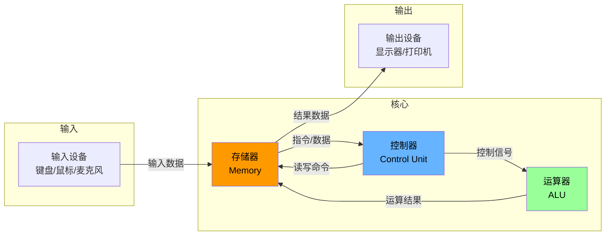
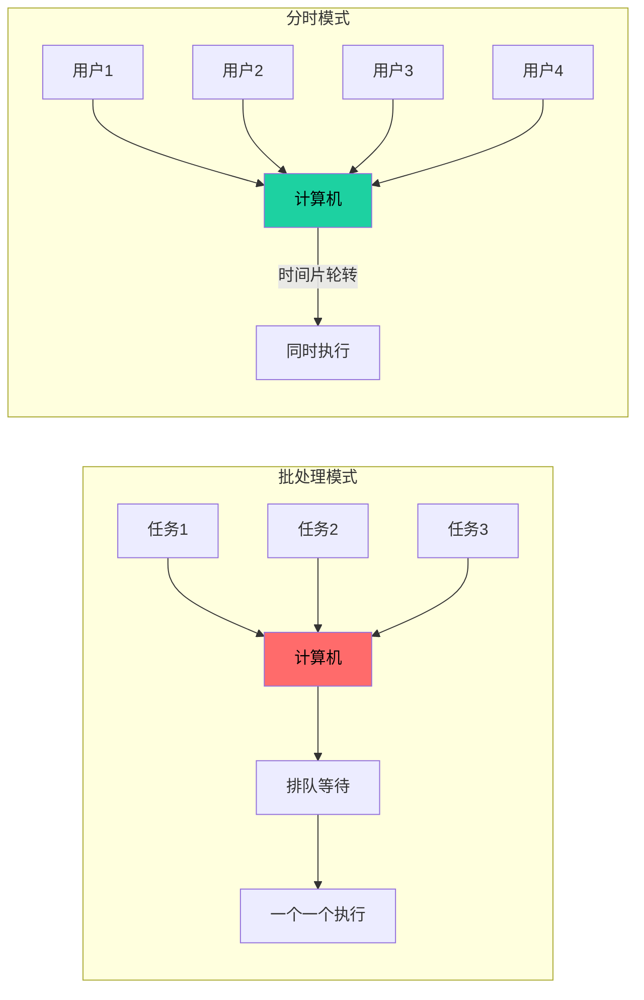
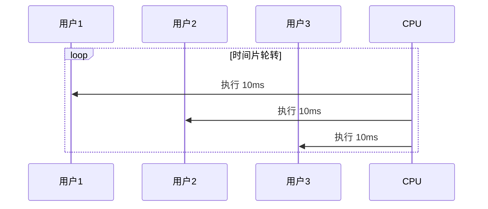
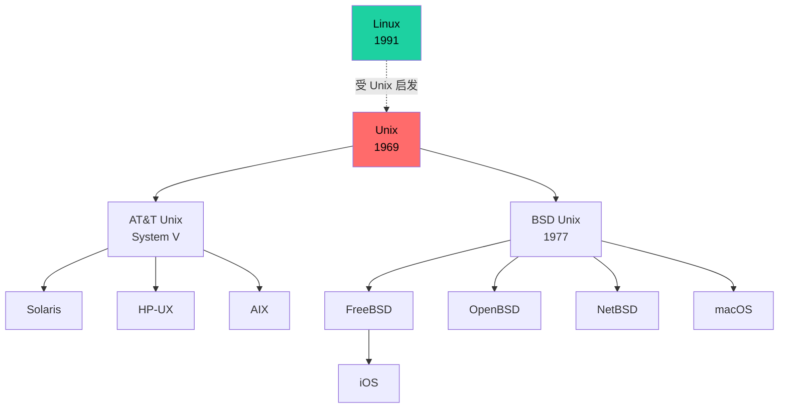
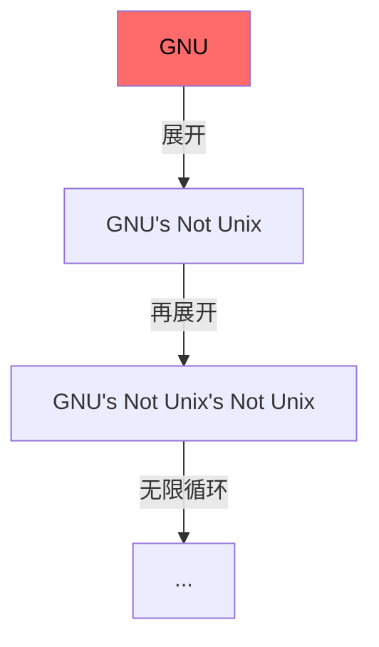
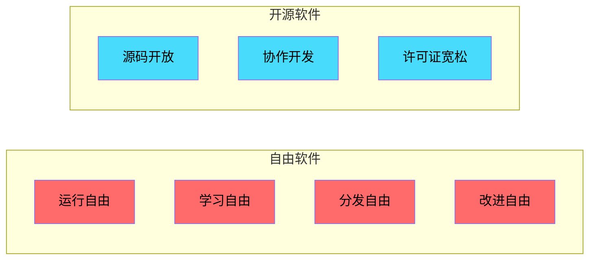
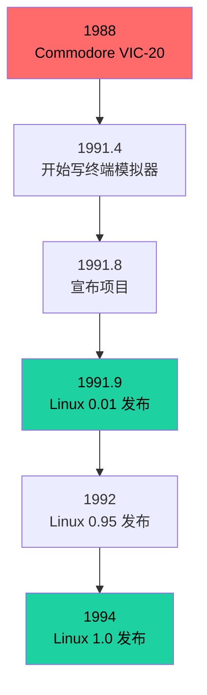
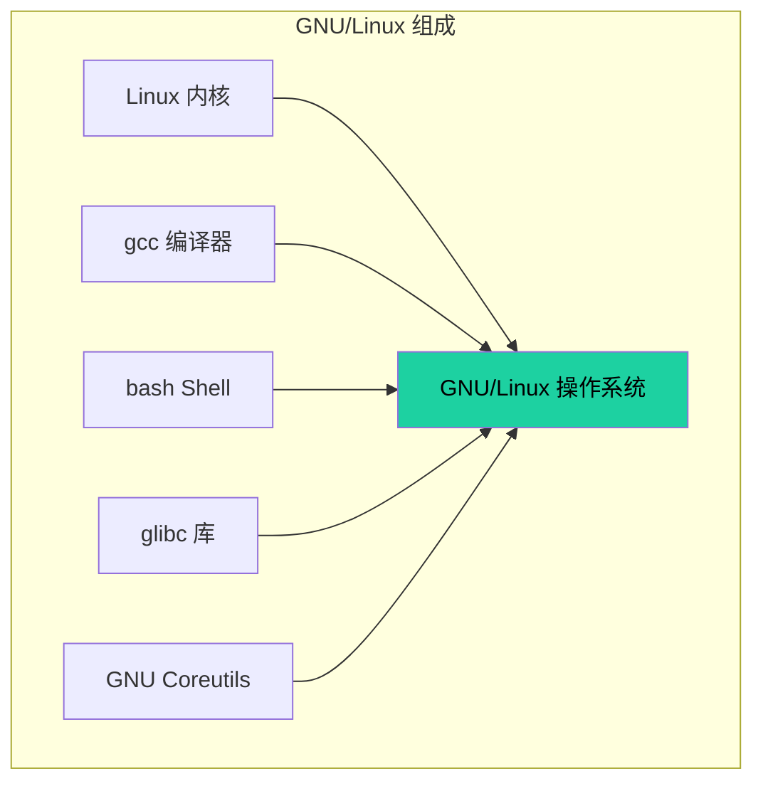

+++
title = "第1章：计算机发展简史"
weight = 10
date = "2026-03-23T08:39:00+08:00"
type = "docs"
description = ""
isCJKLanguage = true
draft = false
+++

# 第一章：计算机发展简史

## 1.1 冯·诺依曼体系结构：计算机的基本组成

各位看官，今天我们要聊的可是计算机界的"五福临门"——冯·诺依曼体系结构的五大金刚！这五位大佬分别是：**运算器**、**控制器**、**存储器**、**输入设备**和**输出设备**。别看它们名字朴实无华，它们可是计算机界的"复仇者联盟"，缺一个都不行！

### 先说说这五位神仙都是干啥的

**1. 运算器（ALU - Arithmetic Logic Unit）**
这玩意儿是计算机的大脑皮层，专门负责算账——不对，是算术和逻辑运算！加减乘除、比较大小、与或非运算，统统归它管。你可以把它想象成公司里的会计，虽然只会算账，但没了它公司就得倒闭。ALU 就是计算机里的"账房先生"，每天加班加点算个不停。

**2. 控制器（Control Unit）**
如果说运算器是会计，那控制器就是公司 CEO！它负责指挥整个计算机的运作——什么时候该读取数据、什么时候该运算、什么时候该输出结果，都得听它的。控制器就像一个严格的监工，手持鞭子（不是）指挥着其他部件有序工作。没有它，计算机就会变成一盘散沙，各部件各干各的，最后就是一团浆糊。

**3. 存储器（Memory）**
存储器就是计算机的"记忆宫殿"！分为内存和外存：

- **内存**（RAM - Random Access Memory）：相当于人的短期记忆，存取速度快，但是一断电就忘得一干二净——就像你喝断片后的记忆一样。所以重要数据赶紧存到外存！
- **外存**（硬盘、SSD等）：相当于人的长期记忆，存取速度慢，但数据不会丢。你的小电影、珍贵照片、可歌可泣的代码，都存在这里。

**4. 输入设备（Input Device）**
输入设备就是你向计算机"打招呼"的方式。键盘、鼠标、触摸屏、麦克风、扫描仪——这些都是你的"传话筒"。你告诉计算机："嘿，帮帮我把这段字打印出来！"计算机曰："收到！"然后开始干活。

**5. 输出设备（Output Device）**
输出设备是计算机"回应"你的方式。显示器、打印机、音响、耳机——这些都是计算机的"嘴"。它把运算结果呈现给你看，或者把声音播放给你听。没有输出设备，你永远不知道计算机在想什么——这就像和对牛弹琴差不多，牛不知道你在弹什么，你也不知道计算机算出了什么。

### 冯·诺依曼到底是何方神圣？

约翰·冯·诺依曼（John von Neumann，1903-1957）是一位匈牙利裔美国数学家，被誉为"计算机之父"之一。他在 1945 年提出了一种计算机架构设计，这就是著名的"冯·诺依曼体系结构"。这套设计有多牛？直到今天，我们用的绝大多数电脑——从你桌上的台式机到兜里的智能手机——都是基于这个架构！所以当你刷抖音的时候，记得感谢一下这位老爷子。

### 这套架构是怎么运作的？

让我用一张图来说明这五位是怎么配合工作的：



看到了吗？这就是计算机的"流水线"！数据从输入设备进来，存到存储器里，控制器发号施令，运算器埋头干活，最后结果通过输出设备展示给你。整个过程行云流水，一气呵成！

### 彩蛋：为什么叫"冯·诺依曼瓶颈"？

有件事你得知道——冯·诺依曼体系结构虽然牛，但有个著名的"瓶颈"问题。因为运算器和存储器是分开的两家人，数据要在它们之间来回跑，就像你要在两个城市之间来回跑一样，累！所以后来人们想了很多办法来优化这个问题，比如：

- **缓存（Cache）**：在运算器旁边放一个小仓库，减少跑存储器的次数
- **流水线（Pipeline）**：让不同部件同时干活，不要互相等待
- **多核处理器**：一家人不够，多找几口人一起干！

这就是为什么现在的 CPU 有多核、有三级缓存的原因——都是为了解决这个"冯·诺依曼瓶颈"！

---

## 1.2 早期计算机：ENIAC、UNIVAC 的诞生

各位看官，上回书说到冯·诺依曼体系结构，这回我们来聊聊计算机界的"祖师爷"——ENIAC 和 UNIVAC！这两位可是计算机界的元老，它们的故事比宫斗剧还精彩！

### ENIAC：世界上第一台"电子巨兽"

1946 年情人节那天（2月14日，不是浪漫，是美军急需！），ENIAC 在美国宾夕法尼亚大学诞生了。这台机器一出生就把所有人都震惊了——它重达 30 吨，占地面积约 170 平方米，相当于半个篮球场！这体型，放在今天绝对能吓跑一堆程序员——毕竟工位太小，放不下啊！

ENIAC 全称是"电子数值积分计算机"（Electronic Numerical Integrator and Computer），名字长到能赶上一首诗了。它的主要工作是计算火炮射程表——军方爸爸需要它来算弹道。你想想，如果没有 ENIAC，那些军官可能还在用手算脚算，炮弹可能都打偏到外太空去了。

**ENIAC 的"黑科技"：**

- 使用了约 17,468 个真空管（电子管），这些小灯泡一样的东西是当时计算机的"大脑"
- 配有 1,500 个继电器（Relay），就是那种"咔嗒咔嗒"响的电磁开关
- 运行功率高达 150 千瓦，足够同时点亮 1,500 个灯泡！当时的电费账单估计能把会计吓哭
- 每秒能进行 5,000 次加法运算——在当时简直是神速！现在你的手机一秒能算几十亿次，所以且用且珍惜吧

**ENIAC 的"坑"：**
这货虽然厉害，但有个致命缺点——**编程太难了！** 每次要改变计算任务，都得手动插拔几千根电缆和开关，相当于重新组装一遍！工程师们开玩笑说："如果你想给 ENIAC 改个程序，建议你先写好遗书。" 有一次，一个 Bug 找了整整一个周末，最后发现是一只蛾子死在真空管里——这就是历史上第一个"Bug"（臭虫）的由来！所以说，程序员和 Bug 的恩怨，从这时候就开始了。

### UNIVAC：商业计算的开山鼻祖

时间来到 1951 年，UNIVAC I（Universal Automatic Computer I）闪亮登场！这可是世界上第一台**商业化**计算机，标志着计算机从实验室走向了企业。

UNIVAC I 是由 ENIAC 的设计者莫奇利（John Mauchly）和埃克特（J. Presper Eckert）创建的 UNIVAC 公司生产的。它的第一个客户是美国人口普查局——没错，就是那个负责数人的机构！

**UNIVAC I 的里程碑意义：**

- 首次将计算机用于商业数据处理不再是军方专属
- 使用磁带机（Magnetic Tape）来存储数据，比打孔卡片高级多了
- 体型稍微"苗条"了一点，但仍重达 13 吨
- 配备了专门的控制台，看起来终于像个"电脑"的样子了

**有趣的故事：**
1952 年，UNIVAC I 成功预测了艾森豪威尔在美国总统大选中的胜利，而且比官方计票还快！当时的新闻界都炸锅了——计算机都能预测选举了，记者们表示压力很大。不过当时的预测可没现在这么准，大家别想太多。

### 这两台"远古巨兽"给我们的启示

| 特征       | ENIAC (1946)            | UNIVAC I (1951)            |
| ---------- | ----------------------- | -------------------------- |
| 体重       | 30 吨                   | 13 吨                      |
| 真空管数量 | ~17,468 个              | ~5,200 个                  |
| 功耗       | 150 千瓦                | 12.5 千瓦                  |
| 内存       | 20 个字（每个字 10 位） | 1,000 个字（每个字 12 位） |
| 主要用户   | 美军                    | 商业/政府                  |
| 编程方式   | 人工接线                | 磁带+程序                  |

看到没？计算机的发展史就是一个不断"减肥"和"提速"的过程！从 30 吨到 13 吨，从 150 千瓦到 12.5 千瓦，人类在让计算机变得更小、更快、更省电的路上，一路狂飙！

### 彩蛋：真空管是怎么工作的？

真空管（Vacuum Tube）的工作原理其实很简单——就像一个可控的灯泡。在一个真空的玻璃管里，有两个电极：阳极和阴极。当阴极被加热到一定程度时，会释放出电子（这种现象叫"热电子发射"，不要问我为什么知道这么多）。如果阳极带正电，电子就会被吸引过去，形成电流；如果阳极带负电，电子就过不去。

通过控制阴极和阳极之间的"栅极"电压，就能控制电流的通断——这就是开和关！有了开和关，就能表示二进制数据（1 和 0），进而实现计算。是不是很神奇？

不过真空管有个致命缺点：太容易坏了！平均每 7 分钟就有一个真空管烧坏。所以 ENIAC 有将近 2 万个"不定时炸弹"，工程师们不是在修管子，就是在修管子的路上。这也就是为什么后来晶体管（Transistor）取代了真空管，成为新一代"电子心脏"——晶体管更小、更省电、更耐用，简直是完美替代品！

---

## 1.3 批处理系统：IBM 卡片打孔机

各位看官，上回书说到 ENIAC 和 UNIVAC 这两位"电子巨兽"，它们虽然厉害，但操作起来简直比登天还难！每次要干新活，就得一群人忙活着重新接线、一顿操作猛如虎。这可愁坏了当时的程序员们——总不能天天给计算机"重装系统"吧？

于是，**批处理系统**（Batch Processing System）应运而生！而它的重要道具，就是传说中的**打孔卡片**（Punch Card）！

### 打孔卡片：程序的"古老存储介质"

打孔卡片这玩意儿，看起来就像一张厚纸板，上面规则地排列着一些小孔。你可别小看这些孔——它们可是程序的"二进制密码"！

每张卡片通常有 80 列，每列可以打一个孔或多个孔。不同的孔位组合代表不同的字符：

- 这一列有孔 → 可能是数字 1
- 那一列有孔 → 可能是字母 A
- 另一列有孔 → 可能是符号 @

想象一下，程序员们坐在桌子前，手里拿着一把小锤子（真的是锤子！），对着卡片一顿"叮叮当当"——这就是在"写代码"！如果你听到哪位程序员说"想当年我是用锤子写代码的"，那他绝对不是在吹牛！


### IBM：卡片界的"扛把子"

说到打孔卡片，就必须提 **IBM**（International Business Machines Corporation）！这家公司当年在打孔卡片领域那是绝对的"一哥"——江湖人称"卡片王"！

IBM 的打孔卡片有多厉害？据说 IBM 曾经生产过一种打孔卡片，上面印着"IBM"三个字母——这不仅是卡片，更是广告！IBM 的创始人托马斯·沃森（Thomas Watson）有句名言："Think"（思考）。虽然这句话是不是他原创的还有争议，但 IBM 确实让整个世界开始"思考"如何用机器来处理数据。

**打孔卡片的标准：**

- 80 列/行设计成为行业标准
- 12 行孔位（上面 3 行叫"Y区"，下面 9 行是数字区）
- 每列一个字符，这就是为什么很多编程语言的输入限制是 80 个字符——致敬经典！

### 批处理系统：计算机的"流水线"

好了，现在有了打孔卡片，程序员就可以把程序先"打"在卡片上，然后交给计算机"批量处理"。这就是**批处理系统**的基本思路：

1. **收集任务**：把一堆要运行的程序卡片按顺序排好
2. **一次性投递**：把这叠卡片一次性塞进读卡器
3. **计算机干活**：计算机自动一张一张读取、执行
4. **输出结果**：运行结果从打印机吐出来

这就像你去自助餐厅吃饭——不用一个个点菜，直接把菜单交给厨师，厨师一次性给你做好一桌子菜！当然，如果中间有一张卡片读错了，那整桌菜可能都泡汤——这就是批处理的痛点！

### 批处理系统的"喜怒哀乐"

**喜**：

- 程序员终于不用24小时守在计算机旁边了！可以喝着咖啡等结果
- 计算机利用率提高了——不用等人来操作，可以24小时连轴转

**怒**：

- 如果程序有错，得等到整批跑完才知道——有时候等了几个小时，结果出来一行字："Error at line 1"——心态爆炸！
- 调试（Debug）变得异常艰难——你得一张一张检查卡片哪里打错了

**哀**：

- 用户和计算机完全隔离——你想交互？门都没有！
- 实时性几乎为零——想查个天气？等明天吧！

**乐**：

- 至少比人工计算快多了！
- 程序员可以互相"传球"——你的卡片跑完了，我的卡片上！

### 打孔卡片的"后代"们

虽然打孔卡片已经进了博物馆，但它的"精神"延续了下来：

- **磁带**：把孔换成磁场，依然是线性存储
- **软盘**：方方正正的小卡片，承载了几代程序员的青春
- **U盘/硬盘**：再然后就是我们熟悉的 USB 和 SSD 了

而且你有没有注意到，现在很多编程语言的代码文件，行数限制有时候还是 80 字符？这就是在致敬打孔卡片的黄金时代！

### 彩蛋：世界上最后一个打孔卡片系统

你敢信？直到 2000 年以后，有些地方还在用打孔卡片系统！美国的社保局、某些银行的信用卡处理系统，都曾经是打孔卡片的"钉子户"。2007 年，美联航（United Airlines）还在用打孔卡片系统来处理航班预订——这比很多程序员的年龄都大！所以说，技术这东西，不是说淘汰就能淘汰的，能用的就是好技术！

---

## 1.4 分时操作系统：Multics 项目

各位看官，上回书说到批处理系统——虽然让程序员从"人肉操作计算机"的苦海中解放了出来，但有个致命问题：**你只能等！** 提交一个任务，得等计算机慢慢处理，这期间你只能喝着咖啡、望着天花板、数着天花板上的裂缝......

终于，有人坐不住了——凭啥我花钱用计算机，还得排队等几个月？这时候，**分时操作系统**（Time-Sharing Operating System）横空出世！而它的"带头大哥"，就是传说中的 **Multics** 项目！

### 批处理 vs 分时：排队买票 vs 同时下单

先来解释一下批处理和分时的区别：

**批处理**就像去银行办业务：

- 只有一个窗口
- 前面有 100 个人
- 你得站在后面排队
- 等前面所有人都办完，才轮到到你
- 而且办理业务的时候别人都不能打扰

**分时操作系统**就像银行开了 100 个窗口：

- 100 个人同时办理
- 每个人都能和柜员"交互"
- 感觉就像自己独占了整个银行
- 效率大大提高，心情也舒畅！



### Multics：分时系统的"老前辈"

**Multics**（Multiplexed Information and Computing Service），中文名叫"多路信息计算服务"——这名字起的，感觉像是某个政府机构的名称......

Multics 项目于 1964 年正式启动，由**麻省理工学院（MIT）**、**贝尔实验室（Bell Labs）** 和**通用电气（GE）** 联合开发。这阵容，简直就是计算机界的"复仇者联盟"！

**Multics 的"黑科技"：**

- **多用户多任务**：同时支持多个用户、多个程序运行
- **分层文件系统**：文件像目录树一样组织，清晰明了
- **内存保护**：每个用户只能访问自己的内存空间，防止"偷看"别人数据
- **动态链接**：程序运行时才加载需要的模块，省内存！

### Multics 的"爱恨情仇"

**爱**：Multics 确实是划时代的发明！它的很多设计理念直接影响了几十年后的操作系统：

- Unix 就是 Multics 的"小徒弟"
- 现代操作系统的很多概念都是从 Multics 开始的
- 甚至"云计算"的某些概念，也能追溯到 Multics

**恨**：但 Multics 也有不少问题：

- 太复杂了！代码量巨大，调试困难
- 运行速度慢——功能太多，性能受影响
- 硬件要求高，一般机构用不起
- 开发周期长，等到花儿都谢了

**情**：1969 年，贝尔实验室退出了 Multics 项目。为什么？因为贝尔实验室觉得 Multics 太"笨重"了！他们想要一个更简洁、更高效的操作系统。这直接导致了 **Unix** 的诞生——正所谓"没有 Multics，就没有 Unix"！

**仇**：虽然 Multics 最终没有成为主流，但它培养了一大批计算机人才，这些人的后代又影响了整个计算机行业。有时候，失败的英雄比成功的英雄更值得尊敬！

### 分时系统的核心：时间片轮转

分时系统之所以能让多个用户同时"感觉"自己在用计算机，核心原理就是**时间片轮转**（Time Slicing / Round-Robin）！

想象一下：

- 计算机有一个超级精确的"闹钟"
- 每隔 10 毫秒（或者其他很短的时间），闹钟就响一次
- 每响一次，计算机就从"当前用户"切换到"下一个用户"
- 因为切换速度极快，人类根本感觉不到！

这就跟放电影一样——电影其实是一张一张静止的图片，但因为切换速度快（每秒 24 帧），人类看起来就是连续的画面！计算机的分时也是这个道理！



### 彩蛋：Multics 的"后代"现在在哪？

你可能不相信，但 Multics 至今仍有后裔在运行！**加拿大航空公司**的某些预订系统，直到 2015 年还在使用基于 Multics 的系统！所以说，不是所有"老东西"都应该扔掉——有些老系统稳如老狗，跑了 50 年都没出问题！

此外，Multics 的设计思想深刻影响了：

- **Unix**：最著名的"徒子徒孙"
- **Linux**：Unix 的"精神继承者"
- **Windows NT**：微软的"亲儿子"
- **macOS**：苹果的"御用系统"

可以说，没有 Multics，就没有今天我们用的绝大多数操作系统！

---

## 1.5 Unix 的诞生：AT&T 贝尔实验室的故事，Ken Thompson 与 Dennis Ritchie

各位看官，上回书说到 Multics 项目——这位"老前辈"虽然没能成为主流，但它培养了一个"逆子"，后来这个"逆子"统治了半个计算机世界！这个"逆子"就是鼎鼎大名的 **Unix**！

### 1969：一个电话引发的"血案"

1969 年，贝尔实验室退出了 Multics 项目。这下可好，贝尔实验室的一帮工程师没事干了——项目没了，代码谁写？游戏谁打？

这时候，一位名叫 **Ken Thompson**（肯·汤普森）的工程师，正在一台破旧的 PDP-7 小型机上鼓捣一个"太空旅行"游戏。这台机器有多破？内存只有 4KB——没错，是 4KB，不是 4GB！你现在手机上的照片都比它内存大！

Ken Thompson 一边打着游戏，一边想："这破机器也太难用了！要是能有个操作系统该多好啊！"于是，他一不做二不休，决定自己写一个操作系统！

### "Unics"：一个"小打小闹"的开始

1969 年 8 月，Ken Thompson 花了大约一个月的时间，在 PDP-7 上写了一个简易的操作系统。他给这个系统起名叫 **Unics**（Uniplexed Information and Computing Service）——没错，就是 Multics 的"缩水版"！名字里都带着"多路"（Multi），我偏要"单路"（Uni）！

当时的 Unics 有多简陋？

- 只有几千行代码
- 支持几个简单的命令
- 没有文件系统，只有简单的文件存储
- 基本上就是一个"玩具"

但没关系，玩具也能玩出花！

### Dennis Ritchie：Unix 的"再生父母"

如果说 Ken Thompson 是 Unix 的"生父"，那 **Dennis Ritchie**（丹尼斯·里奇）就是 Unix 的"再生父母"！

Dennis Ritchie 是贝尔实验室的另一位牛人，专门研究编程语言。1971 年，他开始在 Ken Thompson 的 Unics 上工作，并发明了影响深远的 **C 语言**（C Programming Language）！

注意！C 语言和 Unix 是"互相成就"的关系：

- Dennis Ritchie 用 C 语言重写了 Unix
- C 语言让 Unix 变得可移植——可以在不同的计算机上运行
- Unix 让 C 语言有了用武之地——用 C 写的程序可以在 Unix 上运行

这波啊，这波叫"双向奔赴"！

### Unix 的"核心理念"

Unix 为什么能成功？因为它有几个"杀手锏"：

**1. "小而美"的设计哲学**
Unix 的设计原则是："一个程序只做一件事，并把它做好"（Do one thing and do it well）。这就像分工明确的餐厅——有专门做面的，有专门炒菜的，有专门端盘的——而不是一个厨子既做面又炒菜还当服务员！

**2. 一切皆文件**
在 Unix 里，所有的设备、目录、进程......都被抽象成"文件"！这意味着你可以用相同的命令来操作不同的东西。比如，`cat` 命令既可以查看文本文件，也可以读取键盘输入，甚至可以读取网络数据！这种统一抽象让系统变得异常简洁。

**3. 管道（Pipe）**
管道是 Unix 最伟大的发明之一！它允许你把多个程序"串"在一起，一个程序的输出直接作为另一个程序的输入。比如：

```bash
ls -l | grep "txt" | sort
```

这行命令的意思是：

1. 列出当前目录的文件（`ls -l`）
2. 筛选出包含"txt"的文件（`grep "txt"`）
3. 按名称排序（`sort`）

这就是 Unix 的"积木式"编程——每个小程序都是一块积木，你可以随意组合！

```mermaid
flowchart LR
    A[ls -l<br/>列出文件] -->|管道| B[grep "txt"<br/>筛选]
    B -->|管道| C[sort<br/>排序]
    C --> D[输出结果]
    
    style A fill:#ff6b6b,color:#000
    style B fill:#feca57,color:#000
    style C fill:#48dbfb,color:#000
    style D fill:#1dd1a1,color:#000
```

**4. 可移植性**
因为用 C 语言编写，Unix 可以轻松移植到不同的硬件平台上。从 PDP-7 到 PDP-11，从 VAX 到 IBM PC——只要有 C 编译器，Unix 就能跑！这也是 Unix 能广泛传播的重要原因。

### AT&T： Unix 的"亲妈"

这里有个有趣的历史细节：**Unix 是 AT&T（美国电话电报公司）的"私生子"**！

AT&T 因为是垄断企业，受到反垄断法的限制，不能进入计算机市场。所以 AT&T 干脆把 Unix"免费"送给大学——你帮我研究，我送你代码，天下还有这种好事？

于是，Unix 就像"病毒"一样在大学里传播开来：

- 1970 年代，Unix 进入加州大学伯克利分校（这就是 BSD 的由来！）
- 1977 年，伯克利大学发布了 BSD（Berkeley Software Distribution）
- 各大学纷纷开始研究、改进 Unix

### Ken Thompson 和 Dennis Ritchie 的"爱恨情仇"

这两位大佬的关系，某种程度上就像"父子"：

- Ken Thompson 是"父亲"，创造了最初的 Unix
- Dennis Ritchie 是"儿子"，用 C 语言重写了 Unix，让它发扬光大

但实际上，他们更像是"兄弟"：

- 一起在贝尔实验室工作
- 一起喝酒（划掉）一起写代码
- 一起获得了 1983 年的**图灵奖**！

1983 年，Ken Thompson 和 Dennis Ritchie 共同获得了计算机界的最高荣誉——**图灵奖**！颁奖词是："对通用操作系统理论，特别是 Unix 系统的贡献。"

这波啊，这波是"哥俩好"！

### 彩蛋：Unix 的"家谱"

Unix 发展到今天，形成了庞大的"家族"：



看到了吗？你现在用的 macOS、iPhone 上的 iOS，都是 Unix 的"后代"！而 Linux 虽然不是直接源自 Unix，但也是"深受 Unix 影响"！

---

## 1.6 BSD Unix：加州大学伯克利分校分支

各位看官，上回书说到 Unix 在贝尔实验室诞生，然后像"病毒"一样传遍了各大高校。这回我们要聊的，就是 Unix 在**加州大学伯克利分校**（UC Berkeley）生根发芽后结出的果实——**BSD Unix**！

### 伯克利： Unix 的"西点军校"

加州大学伯克利分校（University of California, Berkeley），简称 UC Berkeley 或伯克利，是美国最顶尖的公立大学之一。它在计算机领域的地位，就相当于少林寺在武侠世界的地位——绝对的"武林正宗"！

1970 年代初，伯克利大学开始研究 Unix。最初只是把 Unix 拿来当教学工具用用，但架不住学生们太给力，逐渐开始"魔改"起来！

### BSD：一切从"补丁"开始

BSD 的全称是 **Berkeley Software Distribution**（伯克利软件发行版）。一开始，它并不是一个独立的操作系统，而是一堆"补丁"（Patch）！

想象一下这个场景：

- 伯克利的学生们用着 AT&T 提供的 Unix 源码
- "这功能没有，不方便！"
- "这代码写得烂，我来改改！"
- "这个 Bug 必须修！"
- 于是，学生们开始给 Unix 打补丁......

打着打着，补丁越来越多，多到快要变成一个新的操作系统了！1978 年，伯克利发布了第一个 BSD 版本——**1BSD**（First Berkeley Software Distribution）！

### BSD 的"独门绝技"

伯克利的学生们可不仅仅是打打补丁，他们添加了很多当时 AT&T Unix 没有的"黑科技"：

**1. vi 编辑器**
这是 Bill Joy（比尔·乔伊）创建的经典编辑器，至今仍在使用！vi 是 Unix/Linux 系统的标配编辑器，学会它，你就是命令行界的"键盘侠"！不过 vi 的操作方式比较反人类——你得记住一堆快捷键，不然连退出都不会！

**2. C Shell（csh）**
原来的 Unix 用的是 Bourne Shell（sh），但伯克利的学生们觉得不好用，于是发明了 C Shell（csh）。C Shell 的语法类似 C 编程语言，而且支持命令历史、补全等功能。后来又发展出了 **tcsh** 和 **zsh**！

**3. TCP/IP 协议栈**
这个太重要了！伯克利把 TCP/IP 协议栈移植到了 Unix 上，让 Unix 具备了联网能力！没有伯克利的 TCP/IP 实现，就没有后来的互联网！想象一下，如果没有 BSD，今天的你可能还在用磁盘传输文件！

**4. 虚拟内存管理**
BSD 改进了 Unix 的内存管理，实现了**分页式虚拟内存**。这意味着程序可以使用的内存比实际物理内存大——因为不用的页面可以放到磁盘上！这就是现代操作系统"内存管理"的雏形！

### BSD 的"爱恨情仇"

**爱**：BSD 为 Unix 世界贡献了无数瑰宝！

- vi 编辑器、csh、TCP/IP 协议栈、虚拟内存管理......
- 没有 BSD，就没有现代 Unix 的半壁江山！

**恨**：BSD 和 AT&T 之间有漫长的法律纠纷！

- AT&T 说："你用的我的源码，得给钱！"
- 伯克利说："我们改了多少代码你知道吗？"
- 这场官司打了十多年，严重影响了 BSD 的发展！

**情**：BSD 分支众多，但都很争气！

- **FreeBSD**：最流行，性能强——Netflix、WhatsApp 都用它！
- **OpenBSD**：以安全著称——全球无数黑客都在用！
- **NetBSD**：以可移植性著称——从 PC 到游戏机，都能跑！
- **macOS/iOS**：苹果的操作系统基于 BSD！

### BSD vs AT&T Unix：谁是正统？

这个问题就像"豆腐脑应该是甜的还是咸的"一样，永远争论不休：

| 特性     | AT&T Unix     | BSD                          |
| -------- | ------------- | ---------------------------- |
| 起源     | 贝尔实验室    | 伯克利大学                   |
| 代码风格 | 商业风格      | 学术风格                     |
| 许可证   | AT&T 专有     | BSD 许可证                   |
| 影响     | System V 系列 | FreeBSD/OpenBSD/NetBSD/macOS |
| 法律状态 | 有版权纠纷    | 更开放                       |

### 彩蛋：为什么 BSD 叫"BSD"？

有人问："BSD 是不是 Berkeley System Distribution 的缩写？"

答案是：**不完全是！**

官方说法是 **Berkeley Software Distribution**。但学生们更喜欢解释为 **"Berkeley's Software Distribution"** 或者 **"Bill's Software Distribution"**（致敬 Bill Joy）！

更有甚者，戏称 BSD 是 **"Better Software than Digital"**（比 DEC 更好的软件）或者 **"Berkeley System Daemon"**（伯克利系统守护进程）！

---

## 1.7 GNU 项目：Richard Stallman 的自由软件运动

各位看官，上回书说到 BSD 在伯克利分校蓬勃发展，这回我们要聊一个"疯狂"的项目——**GNU 项目**！这个项目的发起人 Richard Stallman（理查德·斯托曼），堪称计算机界的"圣战骑士"！

### 故事要从一只"Printer"说起......

1971 年，Richard Stallman 还在麻省理工学院（MIT）读研究生。他发现实验室里新买的一台激光打印机有 Bug——当打印机卡纸时，后续的打印任务就会卡住！

Stallman 去找厂商要源代码，想自己动手修。厂商回复："抱歉，源代码是商业机密，不能给你！"

Stallman 震惊了："这明明是 Bug，我帮你修好了，大家都能受益，为什么不能给？"

这一刻，Stallman 意识到：**软件不应该是私有的！** 他要改变这个世界！

### GNU：我是递归缩写！

**GNU** 是 **"GNU's Not Unix"** 的递归缩写——没错，它自己的名字里包含了自己的名字！这种"套娃"命名方式在黑客圈很流行，因为：

1. 首先，它确实"不是 Unix"（没有使用 AT&T 的源码）
2. 其次，递归缩写显得很"极客"！
3. 最后，这是一种"反叛"——我不copy你的名字，我要自己造一个！



### GNU 项目的"宏伟蓝图"

1983 年，Stallman 正式发布了 GNU 项目，目标是创建一个**完全自由**的操作系统！这个操作系统要包含：

- **GNU Compiler Collection（GCC）**：各种语言的编译器
- **GNU Emacs**：强大的文本编辑器（Stallman 最爱！）
- **GNU Debugger（GDB）**：调试器
- **Bash Shell**：命令行解释器
- **GNU Coreutils**：各种基础工具（ls、cp、mv、cat 等）
- **GLIBC**：C 标准库

这阵容，简直就是"复仇者联盟"！

### 自由软件 vs 开源软件：到底有啥区别？

这个问题问得好！虽然现在"开源"和"自由软件"经常混用，但它们有本质区别：

**自由软件（Free Software）**：

- 强调的是"自由"（Freedom），不是"免费"（Free beer）
- 四大自由：
  1. **运行权**：可以运行程序做任何用途
  2. **学习权**：可以查看源代码，学习它是怎么工作的
  3. **分发权**：可以复制分发，帮助他人
  4. **改进权**：可以修改代码，创造更好的版本

**开源软件（Open Source Software）**：

- 更强调开发模式——"源代码公开"
- 不关心道德问题，只关心开发效率
- 许可证更宽松



### Stallman：孤独的"圣战骑士"

Richard Stallman 绝对是一个"奇葩"——他是一个理想主义者，为了自由软件事业，几乎牺牲了一切！

**Stallman 的"疯狂"事迹：**

- 1989 年，他创建了 **GNU General Public License（GPL）**
- 1990 年代，他创建了 **GNU Emacs**（至今仍是 Emacs 的主流版本）
- 2000 年代，他创立了 **Free Software Foundation（自由软件基金会，FSF）**
- 至今，他仍在为自由软件事业奔波

**Stallman 的"怪癖"：**

- 从不使用智能手机（因为隐私问题）
- 不用 Facebook、Twitter（因为数据被滥用）
- 坚持使用老旧的笔记本电脑
- 对"开源"这个词有"洁癖"——他坚持用"自由软件"！

### GNU 项目的"失落"与"希望"

**失落**：1980 年代末，GNU 项目已经开发出了绝大多数工具，但始终缺少一个最重要的东西——**操作系统内核**！

他们原本想用 **GNU Hurd** 作为内核，但 Hurd 开发进度缓慢，一直难产。就在 GNU 项目快要"凉凉"的时候，一个芬兰大学生出现了......

**希望**：1991 年，Linus Torvalds 发布了 Linux 内核！Linux + GNU 工具 = 完整的操作系统！

这波啊，这波叫"天作之合"！我们稍后会详细聊这个故事。

### 彩蛋：Emacs 和 Vi 的"世纪大战"

Unix 编辑器江湖上，有两大门派：**Emacs** 和 **Vi**！它们的粉丝互相攻击对方的编辑器是"垃圾"！

**Emacs 派**说：

- "Vi 只有两种模式，打字模式和命令模式，烦死了！"
- "Emacs 可以做任何事情——写邮件、浏览网页、玩游戏！"

**Vi 派**说：

- "Emacs 启动太慢，资源占用太高！"
- "Vi 在终端下运行飞快，远程登录首选！"

Richard Stallman 曾经戏称 Emacs 是："一个不错的操作系统，就是缺一个好用的编辑器！"（暗讽 Vi！）

这场"圣战"持续了几十年，至今仍未结束......

---

## 1.8 GPL 许可证：GNU General Public License 的意义

各位看官，上回书说到 Stallman 发起 GNU 项目，发誓要让软件获得"自由"。但光有理想不行，还得有法律保障！于是，**GPL 许可证**（GNU General Public License）横空出世！

### 为什么需要许可证？

想象一下这个场景：

- Stallman 开发了一个牛X的软件，代码开源
- 某个公司看到了："这代码不错，拿来用用！"
- 公司改了几个 Bug，加上自己的 Logo，然后闭源卖钱！
- Stallman 怒了："说好的自由呢？"

所以，GPL 就是 Stallman 的"法律武器"——它用版权法来保障自由！

### GPL 的核心思想："传染性"

GPL 有个著名的特性叫 **"Copyleft"**（故意讽刺"版权"Copyright）！

**Copyleft 的核心原则是：**

- 你可以使用 GPL 代码
- 但如果你分发修改后的版本，**必须也开源**
- 不能把 GPL 代码变成闭源商业软件！

用 Stallman 的话说："你可以吃我的蛋糕，但你做了新蛋糕，必须也分给别人吃！"


### GPL 的版本进化史

**GPLv1（1989 年）**：

- 最初版本，主要防止商业闭源
- 但有个漏洞：如果你只在本地使用不分发，就可以闭源

**GPLv2（1991 年）**：

- 补上了 v1 的漏洞
- 引入了"关键 freedoms"的保护

**GPLv3（2007 年）**：

- 更严格了！
- 增加了对"DRM"（数字版权管理）的限制
- 增加了"反Tivo化"条款——不能限制用户运行修改后的程序

### GPL 的"著名案例"

**1. Linux 内核**
Linux 内核采用 GPLv2 许可证！所以任何人都可以查看、修改 Linux 代码，但如果你发布修改后的内核，也必须开源！这也是为什么有那么多 Linux 发行版——大家都在开源的基础上"魔改"！

**2. MySQL vs MariaDB**
MySQL 最初是开源的，但后来被 Oracle 收购后，部分功能变成了闭源。MySQL 的创始人 Monty 怒了，创建了 **MariaDB**——完全兼容 MySQL，但保持开源！这就是 GPL 的力量！

**3. BusyBox**
BusyBox 是一个"瑞士军刀"般的工具集合，包含了几百个 Unix 命令，但体积只有几 MB！它采用 GPL 许可证，于是无数嵌入式设备厂商"中枪"——用了 BusyBox，就必须开源！

### GPL vs 其他许可证

| 许可证 | 类型     | 传染性         | 代表项目        |
| ------ | -------- | -------------- | --------------- |
| GPLv3  | 自由软件 | 强（必须开源） | Linux 内核、GCC |
| LGPL   | 自由软件 | 中（库可闭源） | glibc           |
| MIT    | 开源     | 无（随便用）   | jQuery、Node.js |
| BSD    | 开源     | 无（随便用）   | FreeBSD         |
| Apache | 开源     | 无（随便用）   | Android         |

### 彩蛋：GPL 的"毒丸"条款

GPL 有个著名的"传染性"，被商业公司称为"GPL 毒丸"！意思是说：只要你用了 GPL 代码，你的整个项目就会被"污染"，必须开源！

不过这个"毒丸"也有例外：

- **静态链接**：如果你是静态链接 GPL 库，可能被认为是"衍生作品"
- **动态链接**：如果你是动态链接，通常被认为是"独立程序"
- **系统库**：操作系统自带的库（如 Windows API）不算

---

## 1.9 Linux 内核的诞生：Linus Torvalds 的故事，1991 年 Helsinki 大学学生

各位看官，上回书说到 GNU 项目雄心勃勃，但缺少一个争气的内核。就在 Stallman 快急白头发的时候，大洋彼岸的芬兰，一个 21 岁的大学新生，正在宿舍里鼓捣一个"小玩具"......

这个"小玩具"，后来成了改变世界的 **Linux**！

### Linus Torvalds：芬兰小子的"逆袭"

**Linus Torvalds**（林纳斯·托瓦兹），1970 年出生于芬兰赫尔辛基。老爸是电台记者，老妈是翻译，家里没有一个人是搞计算机的！

Linus 从小就喜欢摆弄电脑。1988 年，18 岁的他买了自己的第一台电脑——一台 Commodore VIC-20！后来，他又买了 IBM PC 兼容机，开始学习编程。

1991 年，Linus 进入了**赫尔辛基大学**（University of Helsinki），攻读计算机科学专业。那一年，他 21 岁。

### 1991 年：改变世界的"一封信"

1991 年 8 月 25 日，Linus 在 comp.os.minix 新闻组（一个讨论 Minix 操作系统的论坛）上发表了一封著名的帖子：

> "大家好！我正在写一个免费的操作系统（只是一个 hobby，不会太大太专业......）。我想听听大家对这个 Minix 以外的选择有什么想法......"

注意 Linus 用的词——"hobby"（业余爱好）！谁也没想到，这个"业余爱好"，后来会统治服务器市场、半壁江山！

### Minix：Linux 的"启蒙老师"

在正式开发 Linux 之前，Linus 曾经是 **Minix** 的粉丝！

**Minix** 是荷兰教授 Andrew Tanenbaum 为了教学目的开发的简易 Unix 操作系统。Minix 最大的特点是：**代码公开，可以学习**！这可把 Linus 高兴坏了——有源码，还怕学不会？

不过 Minix 有个限制：**只允许教育使用，不能商业化**。而且 Minix 是基于古老的架构设计，很多地方让 Linus 不满意。

于是，Linus 决定：**自己写一个！**

### 从 0 到 1：Linux 的诞生

1991 年 4 月，Linus 开始编写一个简单的终端模拟器——可以在一个电脑上模拟多个终端。这其实就是现代"虚拟终端"的雏形！

后来，他觉得这个模拟器需要一个操作系统来运行，就开始写内核。

1991 年 9 月，Linus 发布了 **Linux 0.01**！这个版本只有约 10,000 行代码，运行在 386 电脑上，基本没什么大用——但它能启动！



### Linus 的"黑历史"

别看 Linus 现在是"Linux 之父"，当年他也是个"喷子"！

**1. 著名的"喷人"邮件**
1992 年，Linux 社区有人建议用 Mach 微内核（比 Linux 的宏内核更先进）。Linus 直接开喷：

> "Mach 是个糟糕的设计 choice 带来的糟糕实现！微内核 fans 是一群 sb（友善度）......"

这就是 Linus 的风格——直接、粗暴、毫不留情！

**2. 公开辱骂 Intel**
2004 年，Intel 发布了 Itanium 处理器。Linus 评价说：

> "Itanium 的问题在于它是一个完完全全的灾难——我想不出有谁会想要买这垃圾！"

**3. 道歉事件**
2018 年，Linus 在公开场合用极其难听的话辱骂 Intel 的内核开发者，引发了轩然大波。最后他公开道歉，承认"对事不对人"太过了！

不过这就是 Linus——**技术至上，喷人无数，但确实有喷的资本！**

### Linux 的"基因突变"

Linux 为什么会成功？除了 Linus 的才华，还有几个关键因素：

**1. GPL 许可证**
Linus 选择 GPLv2 许可证！这意味着：

- 任何人都可以查看、使用、修改 Linux 源码
- 但如果你发布修改后的 Linux，也必须开源
- 这吸引了全球无数开发者贡献代码！

**2. 互联网的普及**
1990 年代初，互联网开始普及！Linus 通过互联网发布代码、接收补丁、与其他开发者交流。这种**分布式协作**模式，彻底改变了软件开发！

**3. "够用"就行**
Linus 不追求"完美"，只追求"能用"！Linux 从一个小玩具起步，逐步添加功能，而不是一开始就想做一个"大而全"的系统。这种**敏捷开发**的思路，让 Linux 快速迭代！

### 彩蛋：Linus 的中国情节

Linus Torvalds 和中国很有渊源！

- Linux 在中国有大量的用户和开发者
- 阿里巴巴、腾讯等中国公司是 Linux 的重要贡献者
- 2020 年，Linus 在上海参加了 Linux 基金会峰会
- Linus 曾多次公开感谢中国开发者的贡献

所以，中国的程序员们，你们也是 Linux 发展历程中的重要力量！

---

## 1.10 Linux 0.01 版本发布：第一个可运行的 Linux 内核

各位看官，上回书说到 Linus Torvalds 在 1991 年 8 月宣布了 Linux 项目。这回我们来详细聊聊，1991 年 9 月发布的 **Linux 0.01** 到底是个什么玩意儿！

### 1991 年 9 月：历史性的时刻

1991 年 9 月，Linus 发布了 **Linux 0.01**。这是历史上第一个公开的 Linux 内核版本！

这个版本有多少行代码？**约 10,000 行**！对比一下，现在最新的 Linux 内核有 **超过 2,000 万行**代码！30 多年增长了 2000 倍！

### Linux 0.01 的"简陋"程度

如果你穿越回 1991 年，看到 Linux 0.01，可能会怀疑人生：

**硬件支持**：

- 只支持 Intel 80386 处理器
- 没有网络支持
- 没有图形界面
- 只有基本的文件系统（Minix 文件系统）

**功能**：

- 只能运行简单的命令行程序
- 没有内存保护（程序崩溃会死机）
- 没有多线程支持
- 只有最基本的系统调用

**代码质量**：

- 很多"临时方案"（Hack）
- 没有文档
- 注释都是瑞典语和芬兰语混用

但最重要的是：**它能启动！** 这就够了！

### 安装 Linux 0.01：时代的眼泪

想在 1991 年安装 Linux 0.01，你需要：

1. 一台 386 电脑
2. Minix 3.5" 软盘

- 一堆空白软盘
- 编译工具（gcc、make）
- 至少 40MB 硬盘空间
- 无限的热情和耐心

安装过程大概是这样的：

1. 下载源码（通过 FTP！）
2. 解压到 Minix 文件系统
3. 编译内核（约等 2 小时）
4. 编译工具链（约等 2 小时）
5. 配置启动参数
6. 重启电脑，热泪盈眶！

### Linus 的"处女贴"全文翻译

以下是 Linus 当年发布的经典帖子（部分）：

> "大家好！
>
> 我正在开发一个免费的操作系统（只是一个 hobby，不会太大太专业）。从 4 月开始就在酝酿，现在开始写了。它受 Minix 的启发，但实现完全不同——因为它我 386(486) 系统上开发的。
>
> 我现在已经移植了 bash(1.08) 和 gcc(1.40)，看起来可以工作。这意味着我几个月后就可完成首发版。我想知道大家想要什么建议/想法。
>
> 还有，我有没有可能在 Minix 上获得一些帮助？
>
> Linus (torvalds@kruuna.helsinki.fi)"

这封邮件的措辞极其谦虚——"只是一个 hobby，不会太大太专业"！谁也没想到，这个"小 hobby"会改变世界！

### 为什么是 0.01 而不是 1.0？

Linus 当时定的版本号规则是：

- 0.01 ~ 0.99：测试版（Alpha）
- 1.0：正式版（Stable）

所以 0.01 代表"第一个公开测试版"！

有趣的是，Linux 1.0 直到 **1994 年 3 月 14 日** 才发布！从 0.01 到 1.0，用了将近 3 年！

### Linux 0.01 的"后代"们

Linux 的版本号进化史：

| 版本 | 发布时间 | 重大事件                 |
| ---- | -------- | ------------------------ |
| 0.01 | 1991.9   | 第一个公开版本           |
| 0.02 | 1991.10  | 增加 gcc 1.40            |
| 0.10 | 1991.12  | 第一次有非 Linus 的补丁  |
| 0.11 | 1992.1   | 第一个真正的"可移植"版本 |
| 0.12 | 1992.1   | 增加数学模拟器           |
| 0.95 | 1992.3   | 第一次可以运行 X Window  |
| 1.0  | 1994.3   | 第一个稳定版！           |

### 彩蛋：Linux 0.01 源码里的"彩蛋"

Linux 0.01 的代码里有个著名的彩蛋！

在 `init/main.c` 文件中，有一段注释：

```c
/*
 *  This is VERY ugly. It needs to be made nicer.
 *  But for now, I'm happy with getting it to work.
 *  /frank
 */
```

翻译："这太丑了！需要整理一下。但现在我先让它能跑起来再说。/frank"

30 年后回看这段注释，真是让人感慨万千！

---

## 1.11 Linux 与 GNU 结合：GNU/Linux 操作系统

各位看官，上回书说到 Linux 内核诞生。但这只是一个"光杆司令"——光有内核，没有工具，也啥都干不了！

这时候，**GNU 项目**闪亮登场——它们有工具，但缺内核！于是，Linux + GNU 一拍即合，诞生了今天的 **GNU/Linux**！

### "天作之合"的开始

1992 年，Linux 社区开始把 GNU 的工具（gcc、bash、glibc 等）移植到 Linux 上。这简直是无缝衔接！

- Linux 提供内核：进程管理、内存管理、文件系统、设备驱动
- GNU 提供工具：编译器、编辑器、Shell、工具软件

两者加起来，就是一个完整的操作系统！

### 为什么叫"GNU/Linux"而不是"Linux"？

这个问题很有争议！

**Stallman 的观点**：

- "Linux 只是内核，GNU 提供了大部分软件！"
- "应该叫 GNU/Linux，以纪念 GNU 项目的贡献！"
- "不能把别人的功劳全算在 Linus 头上！"

**Linus 的观点**：

- "名字不重要，重要的是代码！"
- "GNU/Linux 太长了，我就叫 Linux！"
- "你们开心就好！"

**实际使用**：

- 大多数人习惯说"Linux"
- 很多发行版（如 Ubuntu、Fedora）也自称 Linux
- 但 Debian、FSF 等坚持叫"GNU/Linux"



### GNU/Linux 的"第一版"

1992 年早期，一些 Linux 发行版开始出现：

**1. SLS（Softlanding Linux System）**
这是最早的 Linux 发行版之一！它把 Linux 内核和 GNU 工具打包在一起。虽然很简陋，但意义重大！

**2. Slackware**
1993 年，Patrick Volkerding 创建了 Slackware。这是现存最古老的 Linux 发行版之一，至今仍在更新！

**3. Debian**
1993 年，Ian Murdock 创建了 Debian。Debian 以"自由软件"为原则，创建了 Debian Social Contract，影响深远！

### 发行版的"进化论"

GNU/Linux 发展到现在，形成了无数发行版：

**按包管理器分类**：

- **dpkg/apt**：Debian、Ubuntu、Linux Mint
- **rpm/yum/dnf**：RHEL、CentOS、Fedora
- **pacman**：Arch Linux、Manjaro
- **zypper**：openSUSE

**按使用场景分类**：

- **桌面**：Ubuntu、Linux Mint、Fedora
- **服务器**：RHEL、CentOS、Ubuntu Server
- **安全**：Kali Linux、Parrot Security
- **嵌入式**：Alpine Linux、OpenWrt

### 彩蛋："Linux"这个词的来源

你知道"Linux"这个名字是怎么来的吗？

1991 年，Linus 在给系统起名时，曾经考虑过：

- "Freax"（Free + Unix + X）
- "Linux"（Linus's Minix）

最后，"Linux"这个名字胜出了！不过 Linus 当时并没有注册商标，所以后来 Stallman 想把名字改成"GNU/Linux"时，已经来不及了......

---

## 1.12 开源运动与 Linux 社区

各位看官，Linux 之所以能成功，除了技术本身，更离不开强大的**社区**！开源社区的力量，让 Linux 成为有史以来最成功的开源项目！

### 开源运动：从"地下"到"主流"

1998 年，**开源运动**（Open Source Movement）正式浮出水面！

这一年的关键事件：

- **Netscape 公开源码**：网景浏览器开源，成为 Mozilla Firefox 的前身
- **Open Source Initiative（OSI）** 成立：Bruce Perens 和 Eric S. Raymond 推动开源理念
- **Red Hat 上市**：开源公司也能上市，引发资本关注

### Linux 社区的"超级英雄"们

Linux 的成功，离不开无数志愿者的贡献！这些"超级英雄"包括：

**1. 内核开发者**
全球有超过 1,000 名核心开发者为 Linux 内核贡献代码！其中最活跃的包括：

- Linus Torvalds（总负责人）
- Greg Kroah-Hartman（稳定版维护者）
- David Miller（网络子系统）

**2. 包维护者**
各大发行版的维护者，如：

- Ubuntu 的社区贡献者
- Arch Linux 的 Trusted Users
- Debian 的 Maintainers

**3. 文档撰写者**
Linux 的 man 手册、Wiki、教程，都离不开志愿者的贡献！

**4. 测试人员**
找 Bug 是门技术活！无数"白帽黑客"在默默付出！

### Linux 社区的工作模式

**1. Git 版本控制**
Linux 内核使用 **Git** 进行版本控制！这是 Linus 亲自开发的分布式版本控制系统，后来成为全球最流行的版本控制工具！


**2. 邮件列表**
Linux 内核开发主要通过邮件列表进行！开发者通过邮件提交补丁、讨论技术、解决冲突。这种"古老"的方式看似低效，但极其有效！

**3. 定期发布**
Linux 内核有固定的发布周期：

- 每 9-10 周发布一个主版本
- 每年发布 2-3 个稳定版
- 长期支持版（LTS）可维护 6 年以上！

### 开源许可证的"江湖规矩"

开源社区有自己的一套"规矩"：

**1. 许可证选择**

- GPL：最"传染"，必须开源
- MIT/BSD：最宽松，怎么用都行
- Apache：商业友好，专利保护

**2. 贡献者许可协议（CLA）**

- 有些项目要求贡献者签署 CLA
- 目的是确保贡献者有权提交代码
- 避免未来的法律纠纷

**3. 行为准则（Code of Conduct）**

- 越来越多的项目引入行为准则
- 禁止人身攻击、歧视行为
- 营造包容的社区氛围

### 中国 Linux 社区的崛起

近年来，中国在 Linux 社区的贡献越来越重要！

**1. 华为**

- Linux 内核代码贡献全球前三
- 投入大量工程师参与内核开发

**2. 阿里巴巴**

- Alibaba Cloud OS（Aliyun Linux）
- 龙蜥社区（OpenAnolis）

**3. 腾讯**

- TencentOS Server
- Linux 基金会高级会员

**4. 统信软件**

- 深度操作系统（Deepin）
- 国产 Linux 发行版的主力军

### 彩蛋：Linus 的"神回复"

Linux 社区最著名的是 **Linus 的神回复**！来看看他的经典语录：

> "If you want to travel around the world and be invited to speak at a lot of different places, just write a completely new OS."
> （如果你想环游世界并在各地做演讲，只需写一个全新的操作系统。）

> "Talk is cheap. Show me the code."
> （空谈廉价。给我看代码。）

> "Most good programmers do programming not because they expect to get paid or get adulation by the public, but because it is fun to program."
> （大多数好的程序员编程不是因为期望得到报酬或公众的欢呼，而是因为编程很有趣。）

---

## 本章小结

本章我们一起回顾了计算机的发展简史，从冯·诺依曼体系结构到 Linux 的诞生，跨越了半个世纪的风风雨雨！

### 重点回顾

**1. 冯·诺依曼体系结构**是现代计算机的基石，由运算器、控制器、存储器、输入/输出设备五大部件组成。这一架构影响了几乎所有的现代计算机！

**2. 从 ENIAC 到 UNIVAC**，计算机从军用走向商用，从"巨兽"走向"亲民"。批处理系统的出现让计算机可以自动运行任务，但交互性依然很差。

**3. Multics 项目**开创了分时操作系统的先河，虽然最终没有成为主流，但它培养了 Unix，间接影响了整个计算机行业！

**4. Unix 的诞生**是计算机史上的里程碑。Ken Thompson 和 Dennis Ritchie 创造了"一切皆文件"、"管道"等革命性理念，Unix 成为后世无数操作系统的"祖先"。

**5. BSD Unix** 在伯克利生根发芽，发明了 vi、C Shell、TCP/IP 协议栈等经典技术，并孕育了 macOS 和 iOS！

**6. GNU 项目**和 **Richard Stallman** 开启了自由软件运动，"四大自由"的思想影响深远。GPL 许可证成为保护开源代码的"法律武器"！

**7. Linux 内核**的诞生是一个偶然，也是一个必然。1991 年，芬兰大学生 Linus Torvalds 在宿舍里写出了 Linux 0.01，谁也没想到这会成为改变世界的操作系统！

**8. GNU/Linux** 是 Linux 内核和 GNU 工具的"天作之合"。没有 GNU，Linux 只是一个光杆司令；没有 Linux，GNU 可能还在等待 Hurd 内核！

**9. 开源社区**是 Linux 成功的关键。全球数万名开发者通过 Git、邮件列表协作，共同打造了最成功的开源项目！

### 思考题

1. 为什么冯·诺依曼体系结构能统治计算机界这么多年？
2. 如果没有 Unix，今天的操作系统会是什么样子？
3. 为什么开源模式能让 Linux 如此成功？
4. 你觉得 Linux 的未来会怎样？

### 下章预告

下一章，我们将深入了解 **Linux 简介与生态**——从内核版本号到发行版家族，从应用场景到优势分析，带你全面认识 Linux！敬请期待！

---


