+++
title = "第2章：Linux 简介与生态"
weight = 10
date = "2026-03-23T08:39:00+08:00"
type = "docs"
description = ""
isCJKLanguage = true
draft = false
+++

# 第二章：Linux 简介与生态

## 2.1 什么是 Linux？内核与发行版的区别

各位看官，经过上一章的历史熏陶，现在你应该对计算机的发展有了全面的认识。这回我们来聊聊 Linux 本身——到底什么是 Linux？它和 Windows、macOS 有什么区别？

### Linux：到底是啥？

**Linux** 是一个操作系统，但它有两个层面的含义：

**1. Linux 内核（Kernel）**
这是 Linux 的"心脏"——负责管理硬件资源、调度进程、文件系统、设备驱动等等。没有内核，电脑就是一堆废铁！

**2. Linux 操作系统（Operating System）**
这是完整的"可用系统"，包括：

- Linux 内核
- GNU 工具链（gcc、bash、glibc 等）
- 软件包管理器
- 桌面环境（可选）
- 各种应用软件

所以严格来说，应该叫 **GNU/Linux**！但就像我们习惯说"电话"而不是"手持式双向无线通信装置"一样，"Linux" 这个名字已经约定俗成了！

### 内核 vs 发行版：傻傻分不清楚？

让我用一张图来说明它们的区别：

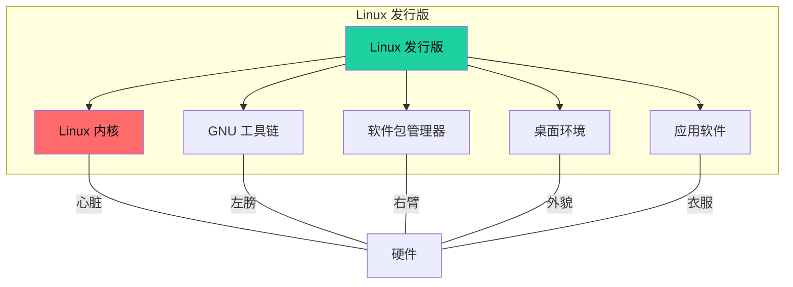

**Linux 内核** 就像汽车的发动机——没有它，车跑不起来。但光有发动机也不行，你还需要车身、轮胎、方向盘等配件。

**Linux 发行版** 就像一辆完整的汽车——由发动机、车身、轮胎等配件组装而成，可以直接上路！

### 常见的 Linux 发行版

市面上有数百种 Linux 发行版，但大多数都是由几个"主流"衍生而来的：

**1. Debian**

- 最古老的发行版之一
- 以稳定性著称
- apt 包管理器
- 衍生版本：Ubuntu、Linux Mint、Kali Linux

**2. Red Hat Enterprise Linux (RHEL)**

- 企业级发行版
- 收费，但提供技术支持
- rpm/dnf 包管理器
- 衍生版本：CentOS、Fedora、Rocky Linux

**3. Arch Linux**

- 滚动更新，永不落伍
- 高度可定制
- pacman 包管理器
- 衍生版本：Manjaro、EndeavourOS

**4. openSUSE**

- 德国血统
- 提供zypper包管理器
- 衍生版本：SUSE Linux Enterprise

### Linux 能做什么？

Linux 的应用场景极其广泛：

**1. 服务器领域**

- Web 服务器（Nginx、Apache）
- 数据库（MySQL、PostgreSQL、MongoDB）
- 容器平台（Docker、Kubernetes）
- 全球 96% 的顶级网站运行在 Linux 上！

**2. 桌面领域**

- 日常办公、开发、多媒体
- Ubuntu、Linux Mint、Fedora 都是不错的选择

**3. 嵌入式系统**

- 智能电视、路由器、物联网设备
- Android 系统就是基于 Linux 内核！

**4. 超级计算机**

- 全球 Top 500 超级计算机，100% 运行 Linux！

### 为什么选择 Linux？

**1. 免费开源**

- 完全免费，无需付费
- 源码开放，想怎么改就怎么改

**2. 安全稳定**

- Linux 的权限模型非常安全
- 服务器可以运行几年不重启！

**3. 硬件兼容性强**

- 支持从旧电脑到最新硬件
- 甚至可以在智能手表上运行！

**4. 社区活跃**

- 遇到问题，随时有人帮忙
- 丰富的文档和教程

### 彩蛋：Linux 的吉祥物

Linux 的吉祥物是一只企鹅，名字叫 **Tux**！为什么是企鹅？因为 Linus Torvalds 小时候在动物园被企鹅咬过，所以他对企鹅有"特殊感情"！

Tux 的形象是一只穿着黑色礼服的企鹅，象征着 Linux 的优雅和力量。很多发行版也会设计自己的吉祥物，比如 Ubuntu 的黑豹、Fedora 的蓝色怪物等！

---

## 2.2 Linux 内核版本号含义（主版本、次版本、修订版本、稳定版、LTS）

各位看官，如果你用过 Linux，可能会注意到内核版本号像这样：**5.15.0-42-generic**。这串数字和字母到底代表什么？让我来给你科普一下！

### 版本号的"三段论"

Linux 内核版本号通常由三部分组成：**主版本.次版本.修订版本**

```
5.15.0
│ │  │
│ │  └─ 修订版本（Patch version）
│ └──── 次版本（Minor version）
└────── 主版本（Major version）
```

**主版本（Major Version）**：大改动，可能不兼容！
**次版本（Minor Version）**：新功能，兼容旧版本
**修订版本（Patch Version）**：Bug 修复，安全补丁

### 偶数 vs 奇数：这是一个"玄学"

Linux 内核有个奇怪的传统：

- **偶数版本**（如 4.20、5.15、6.1）是**稳定版**
- **奇数版本**（如 4.19、5.14、6.0）是**开发版**

为什么这么做？据说是因为 Linus Torvalds 的"个人癖好"——他把奇数版本留给自己用，偶数版本发布给大家用！

不过从 2011 年开始，这个传统就被打破了！从 Linux 3.0 发布开始，版本号规则就变了——Linus Torvalds 觉得版本号涨得太慢，决定直接跳到 3.0，从此不再严格区分奇偶。所以现在看版本号的奇偶来判断稳定性，已经不太靠谱了！

> 💡 **历史趣闻**：Linus 在发布 Linux 3.0 时说："我本来想叫它 2.6.40，但我的手指就是不听使唤，自动打成了 3.0..." 好吧，其实是他觉得版本号数字太大了不好看！

### 内核版本的"生命周期"

Linux 内核的不同版本，有不同的"寿命"：

**1. Mainline（主线版本）**

- Linus 直接管理的版本
- 最新最潮，但可能不稳定
- 版本号如：6.x-rc（最新开发版）

> 💡 **版本号提示**：内核版本更新很快，文档中的具体版本号可能已过时。建议去 [kernel.org](https://www.kernel.org/) 查看最新版本。

**2. Stable（稳定版）**

- 经过测试的可靠版本
- Bug 修复会持续一段时间
- 版本号如：6.x.y（稳定版本）

> 💡 **版本号提示**：内核版本更新很快，文档中的具体版本号可能已过时。建议去 [kernel.org](https://www.kernel.org/) 查看最新版本。

**3. Longterm（长期支持版，LTS）**

- 维护时间特别长的版本
- 通常 2-6 年
- 适合企业和追求稳定的用户
- 版本如：5.15（LTS）、6.1（LTS）

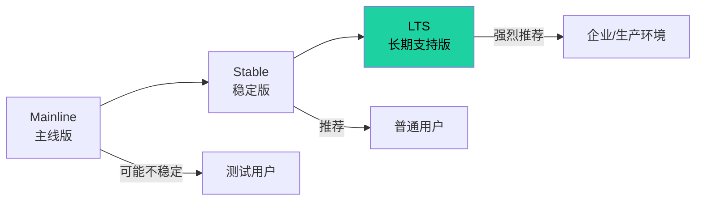

### 常见的 LTS 版本

近年来主要的 LTS 内核版本：

| 版本 | 发布时间 | 结束支持 | 维护时间 |
| ---- | -------- | -------- | -------- |
| 5.10 | 2020.12  | 2026.12  | 约 6 年  |
| 5.15 | 2021.10  | 2026.12  | 约 5 年  |
| 6.1  | 2022.12  | 2026.12  | 约 4 年  |
| 6.6  | 2023.10  | 2026.12  | 约 3 年  |

> 💡 **版本更新提示**：LTS 版本会持续更新，具体版本和支持时间请参考 [kernel.org](https://www.kernel.org/) 或 [Linux Kernel LTS 页面](https://kernel.org/category/releases.html)。
> | 6.1 | 2022.12 | 2027.12 | 约 5 年 |
> | 6.6 | 2023.10 | 2027.12 | 约 4 年 |
> | 6.12 | 2024.11 | 2028.12 | 约 4 年 |
> | 6.18 | 2025.11 | 2028.12 | 约 3 年 |

**当前最新的 LTS 版本是 6.18**，于 2025 年 11 月发布，预计支持到 2028 年 12 月！

### 版本号后面的"尾巴"是什么？

你可能见过这样的版本号：

- `5.15.0-42-generic`
- `6.1.0-50-generic`
- `5.15.0-1017-aws`

让我来拆解一下：

```
5.15.0-42-generic
│ │  │ │    │
│ │  │ │    └─ 发行版特定标识
│ │  │ └────── 修订次数
│ │  └──────── 内核修订版本
│ └─────────── 内核次版本
└───────────── 内核主版本
```

**-42** 表示这是第 42 次构建
**-generic** 表示这是通用版
**-aws** 表示这是 AWS 云优化版

### 彩蛋：Linus 是如何命名内核的？

Linus 曾经在公开演讲中解释过内核版本号的命名规则：

> "我随便起的！没有特殊含义！"

好吧，这就是程序员的"随意"——但正是这种"随意"，创造了最成功的开源项目！

---

## 2.3 Linux 发行版构成：内核 + GNU 工具 + 软件包 + 桌面环境

各位看官，上回我们说了 Linux 内核和发行版的区别。这回我们深入聊聊，一个 Linux 发行版到底由哪些"零件"组成？

### Linux 发行版的"四大金刚"

一个完整的 Linux 发行版，就像一辆汽车，由多个核心部件组成：

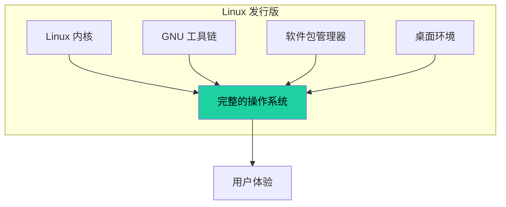

### 1. Linux 内核：汽车的发动机

内核是整个操作系统的"心脏"，负责：

- **进程管理**：哪个程序先跑、哪个后跑
- **内存管理**：内存怎么分配、怎么回收
- **文件系统**：文件怎么存、怎么读
- **设备驱动**：怎么和硬件"说话"
- **网络协议**：怎么收发数据

内核版本决定了系统的能力和限制。比如你需要 Docker，那可能需要 3.10 以上的内核；需要 WireGuard VPN，可能需要 5.6 以上。

### 2. GNU 工具链：汽车的零部件

GNU 工具链是 Linux 的"工具箱"，包括：

**Shell（命令行解释器）**

- Bash：最流行的 Shell，几乎每种发行版都自带
- Zsh：功能更强大，插件丰富（macOS 默认）
- Fish：用户友好，智能提示

**Coreutils（基础工具）**

- `ls` - 列出文件
- `cp` - 复制文件
- `mv` - 移动文件
- `rm` - 删除文件
- `cat` - 查看文件内容
- `grep` - 搜索文本
- `awk` - 处理文本
- `sed` - 编辑文本

**编译器**

- GCC：GNU C 编译器，几乎所有 Linux 程序的"妈妈"
- Clang：苹果开发的 C 家族编译器
- Go、Rust、Python 等

**C 标准库**

- glibc：GNU C Library，几乎所有 Linux 程序都依赖它
- musl：轻量级 C 库，用于 Alpine Linux 等

### 3. 软件包管理器：汽车的服务站

软件包管理器是 Linux 的"App Store"，负责安装、更新、卸载软件。

常见的包管理器：

| 发行版             | 包管理器 | 格式    | 命令示例             |
| ------------------ | -------- | ------- | -------------------- |
| Debian/Ubuntu      | APT      | .deb    | `apt install vim`    |
| RHEL/CentOS/Fedora | DNF/YUM  | .rpm    | `dnf install vim`    |
| Arch Linux         | Pacman   | .tar.xz | `pacman -S vim`      |
| openSUSE           | Zypper   | .rpm    | `zypper install vim` |
| Alpine             | APK      | .apk    | `apk add vim`        |

软件包管理器的工作流程：

1. 从"仓库"（Repository）下载软件包
2. 检查依赖——软件需要什么库
3. 自动安装依赖
4. 安装软件到指定目录
5. 更新数据库，记录已安装的软件

### 4. 桌面环境：汽车的外观

桌面环境决定了 Linux 的"颜值"！常见的桌面环境：

**GNOME**

- 现代、简洁、易用
- Ubuntu 默认桌面
- 适合新手

**KDE Plasma**

- 功能强大，高度定制
- 美观程度满分
- 适合追求个性化的用户

**Xfce**

- 轻量级，省资源
- 适合老电脑
- 速度飞快

**LXQt**

- 更轻量
- 适合嵌入式设备

**MATE**

- GNOME 2 的精神继承者
- 传统界面风格

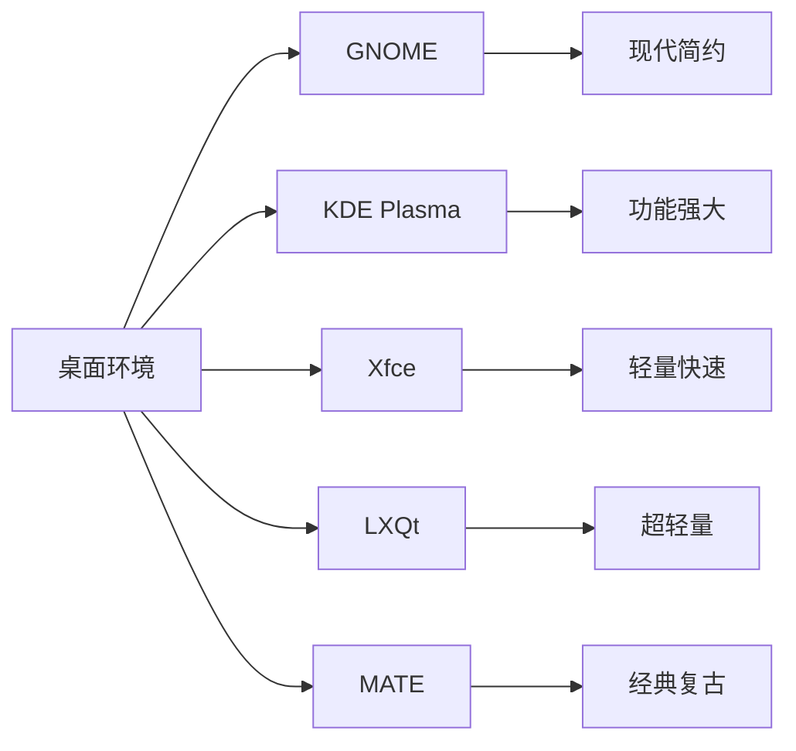

### 发行版的"组装"流程

一个发行版是怎么"组装"出来的？

**Step 1: 选择内核版本**

- 有的用最新的稳定内核
- 有的用 LTS 内核

**Step 2: 选择 GNU 工具链**

- glibc 还是 musl？
- 哪个版本的 gcc？

**Step 3: 选择包管理器**

- apt、dnf、pacman、zypper？
- 搭建自己的软件仓库

**Step 4: 选择桌面环境**

- GNOME、KDE、Xfce？
- 或者不要桌面，纯命令行（Server 版）

**Step 5: 添加默认软件**

- 浏览器、办公软件、多媒体播放器
- 系统工具、设置界面

**Step 6: 打包发布**

- 制作 ISO 镜像
- 测试、安装

### 彩蛋：Linux 发行版可以"DIY"！

如果你有兴趣，完全可以自己"定制"一个 Linux 发行版！

**从零构建**：

- Linux From Scratch（LFS）：完全从源码构建
- 适合学习操作系统原理

**定制现有发行版**：

- Ubuntu Customization Kit：定制 Ubuntu
- Fedora Spins：定制 Fedora
- Archiso：定制 Arch Linux

**云构建**：

- Packer + Vagrant：自动化构建
- Docker：容器化应用

---

## 2.4 Linux 发行版家族详解

各位看官，Linux 发行版犹如"百家争鸣"，数都数不过来！但仔细一看，它们其实都来自几个"大家族"。这回我们就来盘点一下 Linux 发行版的"族谱"！

### 发行版家族全景图

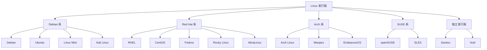

---

### 2.4.1 Debian 系：Debian（稳定性第一）、Ubuntu（桌面首选）、Linux Mint、Kali Linux（渗透测试）

**Debian** 是 Linux 发行版中的"老前辈"——1993 年诞生，至今已有 30 年历史！

**Debian 的特点**：

- **稳定性第一**：Debian Stable 是最稳定的 Linux 发行版之一
- **包管理器**：APT（Advanced Package Tool）
- **软件仓库**：超过 60,000 个软件包！（软件数量最多的发行版之一）
- **社区驱动**：完全由志愿者维护

**Debian 的三个分支**：

- **Stable（稳定版）**：Bug 少，适合服务器
- **Testing（测试版）**：新软件多，可能有 Bug
- **Unstable（不稳定版）**：最新最潮，一般人别碰

**Ubuntu** 是 Debian 的"亲儿子"，2004 年由 Canonical 公司创立！

**Ubuntu 的特点**：

- **用户友好**：安装简单，界面美观
- **定期发布**：每 6 个月发布一个新版本
- **LTS 版本**：每 2 年一个长期支持版（5 年支持）
- **Snap 支持**：支持 Snap 包格式

Ubuntu 的版本命名规则：

- 版本号 = 发布年份.月份
- 24.04 = 2024 年 4 月发布
- LTS 版本有 "LTS" 后缀

**Linux Mint** 是 Ubuntu 的"衍生版"，专为桌面用户设计！

**Linux Mint 的特点**：

- 开箱即用，无需配置
- 默认安装多媒体编解码器
- Cinnamon 桌面，界面类似 Windows
- 适合从 Windows 转过来的用户

**Kali Linux** 是 Debian 的"黑客版"，专为渗透测试设计！

**Kali Linux 的特点**：

- 预装数百种安全工具
- 支持 ARM 设备（树莓派）
- 专为安全研究人员设计
- 基于 Debian Testing

---

### 2.4.2 RedHat 系：RHEL（企业级）、CentOS（免费 RHEL）、Fedora（社区版）、Rocky Linux、AlmaLinux

**Red Hat Enterprise Linux（RHEL）** 是 Red Hat 公司的"商业版"！

**RHEL 的特点**：

- **企业级**：专为商业环境设计
- **稳定性极佳**：Bug 少，更新谨慎
- **技术支持**：提供 24/7 技术支持
- **收费**：需要订阅许可证

**CentOS** 曾经是"免费的 RHEL"！

**CentOS 的特点**：

- 100% 兼容 RHEL
- 完全免费
- 社区维护
- **注意**：2020 年 CentOS 停止维护，CentOS Stream 成为"滚动版"

**Fedora** 是 Red Hat 的"试验田"！

**Fedora 的特点**：

- 最新的开源技术
- 由 Red Hat 赞助、社区维护
- 每年发布两个版本
- 6 个月支持期
- 很多新技术先在 Fedora 上测试，再进入 RHEL


**Rocky Linux** 是 CentOS 的"接盘侠"！

**Rocky Linux 的特点**：

- 100% 兼容 RHEL
- 完全免费
- 由 CentOS 创始人发起
- 目标是成为 CentOS 的替代品

**AlmaLinux** 也是 CentOS 的"接盘侠"！

**AlmaLinux 的特点**：

- 100% 兼容 RHEL
- 完全免费
- 由 CloudLinux 公司赞助
- 提供 10 年支持

---

### 2.4.3 Arch 系：Arch Linux（滚动更新）、Manjaro（用户友好）、EndeavourOS、Garuda Linux

**Arch Linux** 是"DIY 爱好者的最爱"！

**Arch Linux 的特点**：

- **滚动更新**：永不"过时"，始终保持最新
- **高度可定制**：从零开始，按需安装
- **Pacman 包管理器**：简单高效
- **AUR**：用户贡献的软件仓库（超过 80,000 个包！）
- **Wiki 文档**：堪称 Linux 文档的标杆

Arch Linux 的安装过程：

1. 下载 ISO 镜像
2. 制作启动盘
3. 从 Live 环境启动
4. 手动分区
5. 配置网络
6. 安装基础系统
7. 配置桌面环境
8. 重启！

这个过程需要一定的 Linux 基础，但正是这种"从零构建"的过程，让无数 Arch 用户成为了 Linux 高手！

**Manjaro** 是 Arch 的"用户友好版"！

**Manjaro 的特点**：

- 基于 Arch，提供图形化安装器
- 预配置硬件驱动
- 开箱即用
- 三个桌面版本：KDE、Gnome、Xfce
- 定期发布稳定版

**EndeavourOS** 也是 Arch 的"友好版"！

**EndeavourOS 的特点**：

- 类似 Arch 的滚动更新
- 图形化安装器
- 太空主题
- 社区活跃

**Garuda Linux** 主打"开箱即用"！

**Garuda Linux 的特点**：

- 基于 Arch
- 预装大量软件
- 美观的桌面效果
- 游戏版、创意版等多个版本

---

### 2.4.4 SUSE 系：openSUSE、SLES（SUSE Linux Enterprise Server）

**SUSE** 是德国血统的 Linux 发行版！

**openSUSE** 是 SUSE 的"社区版"！

**openSUSE 的特点**：

- **稳定性好**：企业级品质
- **YaST**：强大的系统管理工具
- **Snapper**：系统快照功能
- 两个版本：Leap（稳定版）和 Tumbleweed（滚动版）

**SUSE Linux Enterprise Server（SLES）** 是商业版！

**SLES 的特点**：

- 企业级支持
- 高度稳定
- 适合关键业务
- 与 SAP、VMware 等深度集成

---

### 2.4.5 其他发行版：Pop!_OS、elementary OS、Zorin OS

除了"四大族系"，还有很多有意思的独立发行版！

**Pop!_OS** —— 专为创作者设计！

- 由 System76 公司开发
- 基于 Ubuntu
- 预装 NVIDIA 驱动
- 适合游戏和深度学习

**elementary OS** —— 颜值即正义！

- 基于 Ubuntu
- 美观的 Pantheon 桌面
- 注重用户体验
- 类似 macOS 的设计风格

**Zorin OS** —— Windows 用户的救星！

- 基于 Ubuntu
- 提供 Windows 布局选项
- 适合从 Windows 转过来的用户
- 有免费版和 Pro 版

---

## 2.5 初学者发行版推荐：为什么推荐 Ubuntu？社区支持、软件丰富、文档完善

各位看官，面对数百种 Linux 发行版，初学者往往会陷入选择困难症！这回我来告诉你，为什么 **Ubuntu** 是初学者的最佳选择！

### Ubuntu：全球最受欢迎的 Linux 发行版

根据各种调查，Ubuntu 是全球用户最多的 Linux 发行版！为什么这么火？

**1. 社区支持强大**

- 全球数百万用户
- 活跃的社区论坛
- Stack Overflow、Ask Ubuntu 等问答网站
- 遇到问题，分分钟有人帮你解决！

**2. 软件仓库丰富**

- 超过 59,000 个软件包
- apt 包管理器，一行命令安装软件
- Snap 支持，更多软件选择
- Flatpak 支持，跨发行版软件

**3. 文档完善**

- 官方 Wiki 详细全面
- 各种中文教程满天飞
- 入门指南、官方文档、社区贡献
- 不怕学不会，就怕不想学！

**4. 安装简单**

- 图形化安装器，全程中文
- 自动识别硬件
- 驱动、显卡、WiFi 不用愁
- 30 分钟从零到上手！

**5. 版本稳定**

- LTS 版本 5 年支持
- 半年一次常规更新
- Bug 少，用得放心

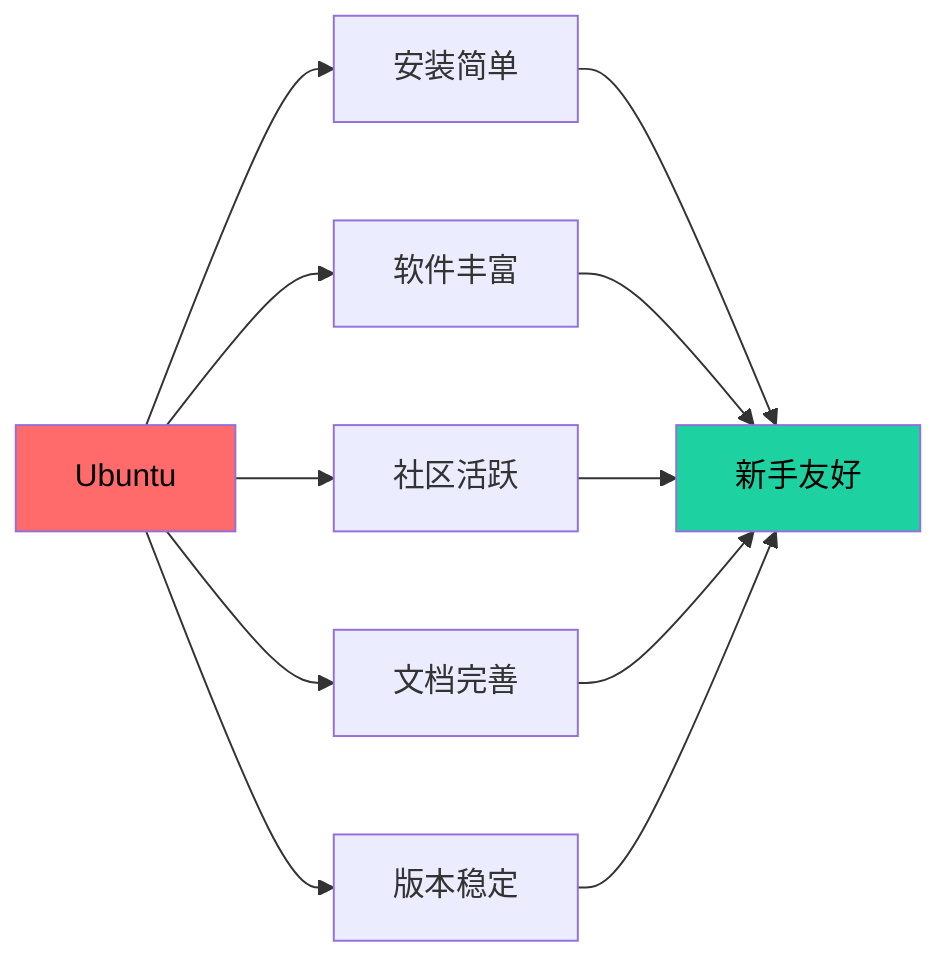

### Ubuntu 的版本选择

**Ubuntu 桌面版**：

- Ubuntu Desktop：默认桌面版
- Kubuntu：KDE 桌面
- Xubuntu：Xfce 桌面（省资源）
- Lubuntu：Lxde 桌面（更省资源）
- Ubuntu Budgie：Budge 桌面

**Ubuntu 服务器版**：

- Ubuntu Server：无图形界面，更轻量
- 支持各种服务器软件

### Ubuntu 安装后的"必做之事"

**1. 更新系统**

```bash
sudo apt update && sudo apt upgrade -y
```

**2. 安装常用软件**

```bash
# 安装 Git
sudo apt install git

# 安装 Vim
sudo apt install vim

# 安装 C/C++ 编译工具
sudo apt install build-essential
```

**3. 配置中文输入法**
Ubuntu 22.04+ 默认使用 **IBus** 输入法框架，自带中文支持。去"设置 → 键盘 → 输入源"里添加"中文（智能拼音）"即可！

> 💡 **小提示**：如果你更喜欢 Fcitx5（比如要用 Rime 输入法），可以手动安装：`sudo apt install fcitx5 fcitx5-chinese-addons`，然后在"语言支持"里切换输入法框架。不过对新手来说，IBus 够用了！

**4. 安装常用开发工具**

```bash
# VS Code
sudo apt install code

# Python（通常已预装）
python3 --version
```

### Ubuntu 的"替代品"

如果你不喜欢 Ubuntu，这些发行版也适合新手：

**Linux Mint**

- 基于 Ubuntu，更适合桌面
- 类似 Windows 的界面
- 开箱即用

**Zorin OS**

- 提供 Windows 布局
- 颜值高
- 适合从 Windows 转过来

**Pop!_OS**

- System76 开发
- 适合游戏和创意工作

### 彩蛋：Ubuntu 的命名规则

Ubuntu 的版本命名很有趣：

- 格式：发布年份.月份
- 24.04 = 2024 年 4 月发布
- 偶数月份 = LTS 版本
- 奇数月份 = 短期支持版本

另外，Ubuntu 每个版本都有一个动物代号！

- 24.04 (Noble Numbat) -  nobility + 袋熊
- 22.04 (Jammy Jellyfish) -  激动 + 水母
- 20.04 (Focal Fossa) -  焦点 + 马达加斯加 fossa

---

## 2.6 Linux 的应用场景

各位看官，Linux 可不只是极客们的玩具！它已经渗透到我们生活的方方面面！这回我们就来聊聊 Linux 的"十八般武艺"！

### 2.6.1 服务器领域：Web 服务器、数据库服务器、邮件服务器

如果说服务器领域是 Linux 的"大本营"，那真是一点儿都不夸张！全球超过 96% 的顶级网站运行在 Linux 服务器上！

**Web 服务器**

- **Nginx**：高性能 HTTP 服务器，反向代理担当！全球最流行的 Web 服务器之一
- **Apache**：老牌 Web 服务器，功能丰富，模块化设计
- **LiteSpeed**：高性能商业 Web 服务器

```bash
# 安装 Nginx（Ubuntu/Debian）
sudo apt install nginx

# 启动 Nginx
sudo systemctl start nginx

# 查看状态
sudo systemctl status nginx
```

**数据库服务器**

- **MySQL/PostgreSQL**：最流行的开源关系型数据库
- **MongoDB**：文档数据库，新时代 NoSQL 的代表
- **Redis**：内存数据库，缓存神器！

```bash
# 安装 MySQL
sudo apt install mysql-server

# 安装 PostgreSQL
sudo apt install postgresql

# 安装 MongoDB（需要添加官方仓库，Ubuntu 默认仓库可能版本较旧）
# wget -qO - https://www.mongodb.org/static/pgp/server-7.0.asc | sudo apt-key add -
# echo "deb [ arch=amd64,arm64 ] https://repo.mongodb.org/apt/ubuntu jammy/mongodb-org/7.0 multiverse" | sudo tee /etc/apt/sources.list.d/mongodb-org-7.0.list
# sudo apt update
# sudo apt install mongodb-org

# 启动服务
sudo systemctl start mysql
sudo systemctl start postgresql
sudo systemctl start mongod
```

**邮件服务器**

- **Postfix**：高效邮件发送服务器
- **Dovecot**：邮件接收服务器
- **Courier**：另一个邮件服务器选择

```bash
# 安装 Postfix
sudo apt install postfix

# 配置邮件服务器（需要更多配置）
sudo postconf -e 'myhostname = example.com'
```

**为什么服务器偏爱 Linux？**

- 免费开源，省license费用
- 稳定可靠，几年不重启
- 安全可控，不怕"后门"
- 性能优异，压榨硬件性能

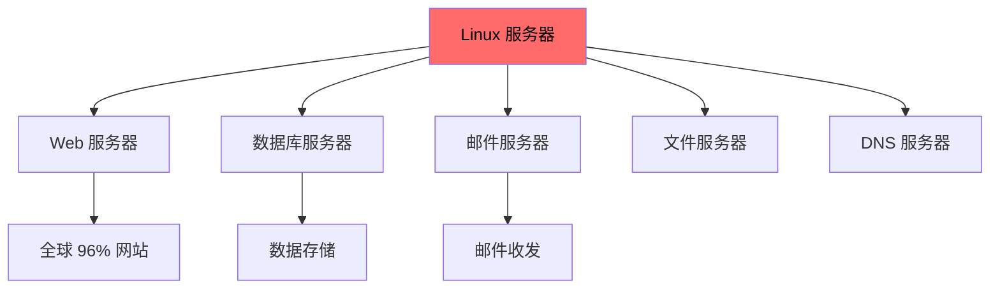

### 2.6.2 桌面领域：个人电脑、工作站

别以为 Linux 只能在服务器上跑！桌面领域也有 Linux 的一席之地！

**个人电脑**

- 日常办公、上网、娱乐
- Ubuntu、Linux Mint、Fedora 都是不错的选择
- 甚至可以刷成"Windows 风格"或"macOS 风格"！

**工作站**

- **编程开发**：Linux 是程序员的首选！
- **图形设计**：GIMP、Krita、Inkscape 了解一下？
- **视频剪辑**：Kdenlive、Blender（3D动画神器！）
- **科学计算**：MATLAB、SciPy、NumPy

```bash
# 安装开发工具
sudo apt install build-essential git vim code

# 安装 Python 数据科学环境
sudo apt install python3-numpy python3-scipy python3-matplotlib

# 安装 Blender（3D 动画）
sudo apt install blender
```

**Linux 桌面的进化**

- 早期：纯命令行，只有极客会用
- 现在：GNOME、KDE 美观大方，日常工作完全没问题

### 2.6.3 嵌入式系统：智能设备、路由器、物联网

Linux 在嵌入式领域也是"霸主"地位！

**智能电视**

- Android TV 基于 Linux 内核
- LG webOS 基于 Linux
- 三星 Tizen 基于 Linux

**路由器**

- OpenWrt：最流行的路由器固件
- DD-WRT：另一个流行的路由器固件
- 无数家庭路由器都在运行 Linux！

```bash
# OpenWrt 的一些常用命令
opkg update
opkg install luci
opkg install shadowsocks-libev
```

**物联网（IoT）**

- 树莓派（Raspberry Pi）：最流行的单板计算机，运行 Linux
- Arduino（部分高端型号如 Arduino Yun）：可以运行 Linux
- 智能家居设备：小米、阿里巴巴的 IoT 设备，很多基于 Linux

```bash
# 树莓派上安装系统（烧录 SD 卡）
# 1. 下载 Raspberry Pi Imager
# 2. 选择操作系统（Raspberry Pi OS）
# 3. 烧录到 SD 卡
# 4. 开机！
```

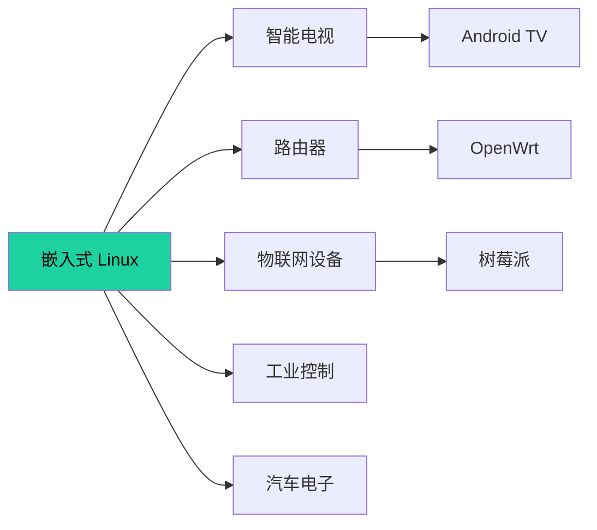

### 2.6.4 云原生：Docker、Kubernetes、云服务器

云计算时代，Linux 更是"扛把子"！

**Docker 容器**

- 轻量级虚拟化
- 应用程序打包、分发、运行
- "一次构建，到处运行"

```bash
# 安装 Docker
sudo apt install docker.io

# 启动 Docker
sudo systemctl start docker

# 运行第一个容器
sudo docker run hello-world

# 运行 Nginx 容器
sudo docker run -d -p 80:80 nginx
```

**Kubernetes（K8s）**

- 容器编排平台
- 自动部署、扩展、管理容器化应用
- 云原生时代的"操作系统"

```bash
# 安装 Minikube（本地 Kubernetes）
curl -LO https://storage.googleapis.com/minikube/releases/latest/minikube-linux-amd64
sudo install minikube-linux-amd64 /usr/local/bin/minikube

# 启动 Kubernetes 集群
minikube start

# 查看集群状态
kubectl cluster-info
```

**云服务器**

- AWS EC2：亚马逊云
- Google Cloud：谷歌云
- Azure：微软云
- 阿里云：阿里云
- 几乎所有云服务器都是 Linux！

### 2.6.5 移动端：Android 系统基于 Linux 内核

你可能天天在用 Linux，只是你自己不知道！

**Android** 是全球最流行的移动操作系统，市场份额超过 70%！而 Android 就是基于 Linux 内核！

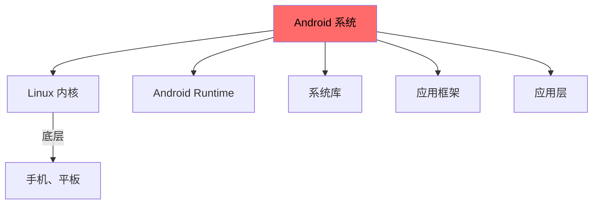

**Android 和 Linux 的关系**：

- Android 使用了 Linux 内核
- 但不完全是传统的 GNU/Linux
- 有自己的用户空间（Android Runtime、SurfaceFlinger 等）
- 不能直接运行标准的 Linux 程序

**为什么 Android 用 Linux 内核？**

- 开源免费
- 驱动支持丰富
- 电源管理功能强大
- 安全机制完善

---

## 2.7 Linux 的优势：开源免费、稳定安全、硬件兼容性强、社区活跃

各位看官，Linux 能在激烈的操作系统竞争中脱颖而出，肯定有其过人之处！这回我们就来盘点 Linux 的"核心竞争力"！

### 1. 开源免费：真香警告！

**省钱才是硬道理！**

- Linux 完全免费，无需购买许可证
- 想想 Windows Server 要花多少钱？Linux 分文不取！
- 企业省下的 license 费用，可以买更多服务器！

**源码开放，想怎么改就怎么改！**

- 可以查看系统源码
- 可以自己编译定制
- 不怕有"后门"——全世界程序员都在盯着！
- 遇到 Bug，可以自己动手修复！

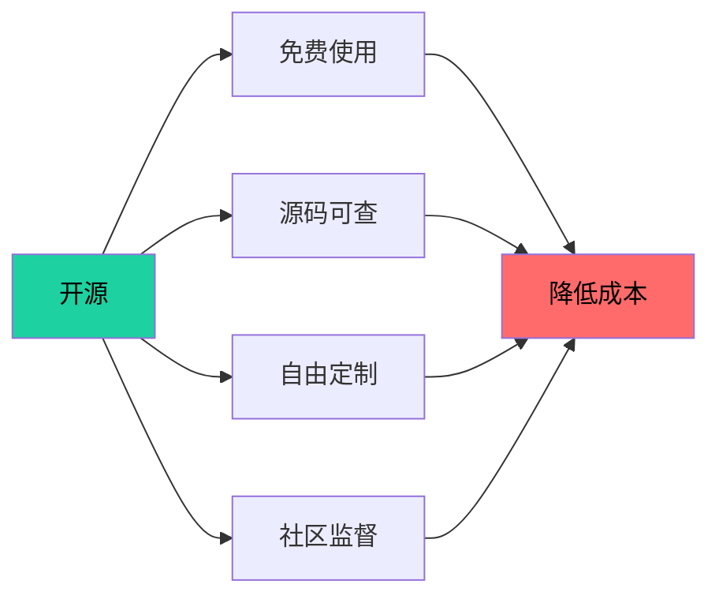

### 2. 稳定安全：稳如老狗！

**稳定性逆天！**

- Linux 服务器可以连续运行几年甚至十几年不需要重启！
- 银行、证券交易所都用 Linux，关键业务离不开它！
- 著名的 Linux 服务器 uptime（运行时间）记录：20+ 年！

```bash
# 查看系统运行时间
uptime

# 输出示例：
# 14:30:01 up 1234 days,  3:21,  2 users,  load average: 0.15, 0.10, 0.05
# 系统已经运行了 1234 天（3年多）没重启了！
```

**安全机制强大！**

- **权限模型**：普通用户无法修改系统文件
- **SELinux/AppArmor**：强制访问控制，安全加固
- **文件系统权限**：rwxr-xr-x 读、写、执行分得明明白白
- **开源审计**：全世界的安全专家都在找 Bug，发现后立即修复！

```bash
# 查看文件权限
ls -l /etc/passwd

# 输出示例：
# -rw-r--r-- 1 root root 2341 Jan 15  2024 /etc/passwd
# -rw-r--r-- = 普通文件，只有 root 可以写
```

### 3. 硬件兼容性强：从垃圾堆到超级计算机！

**旧电脑也能飞！**

- Linux 可以运行在只有 512MB 内存的旧电脑上！
- Xubuntu、Lubuntu、Antix 等发行版，专为老电脑设计！
- 不想扔掉的旧笔记本？装个 Linux 试试！

**新硬件第一时间支持！**

- 新显卡、新 CPU 内核发布后，Linux 往往第一时间支持！
- NVIDIA、AMD、Intel 都提供 Linux 驱动！
- 苹果 M1/M2 芯片也有 Linux 移植版本！

**无处不在！**

- 超级计算机：全球 Top 500 超级计算机，100% 运行 Linux！
- 服务器：96% 的网站运行在 Linux 上！
- 手机：70%+ 的手机运行 Android（Linux 内核）！
- 嵌入式：路由器、智能电视、物联网设备，几乎都有 Linux！

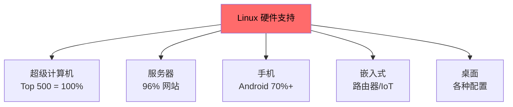

### 4. 社区活跃：有问题不用愁！

**社区力量大！**

- 全球数千万 Linux 用户
- 活跃的技术论坛、问答网站
- 中文社区也很活跃！

**文档齐全！**

- Arch Wiki：堪称 Linux 文档的标杆！
- 官方手册、教程、视频
- 各种中文教程、博客

**生态丰富！**

- 软件仓库动辄几万个软件
- 包管理器一键安装
- 几乎所有主流软件都有 Linux 版本！

### 5. 性能优异：压榨硬件性能！

**资源占用低！**

- Linux 内核只有几百 MB！
- 桌面环境可以选轻量级的（Xfce、Lxde）
- 同样的硬件，Linux 跑得比 Windows 快！

**可定制性强！**

- 可以裁剪不需要的功能
- 可以针对特定场景优化
- 服务器版本没有图形界面，资源全部给应用！

```bash
# 查看内存使用情况
free -h

# 查看磁盘使用情况
df -h

# 查看系统负载
uptime
```

### 6. 灵活性：从树莓派到超级计算机！

**多种部署方式！**

- 物理机：直接安装在服务器上
- 虚拟机：VMware、VirtualBox、KVM
- 容器：Docker、Kubernetes
- 云服务器：AWS、阿里云、腾讯云

**多种架构支持！**

- x86_64：主流桌面和服务器
- ARM：树莓派、手机、嵌入式
- RISC-V：新兴开源架构
- MIPS：某些嵌入式设备

### 彩蛋：Linux 为什么这么稳？

Linux 的稳定性来自于几个设计原则：

**1. 模块化设计**

- 内核模块化，需要什么加载什么
- 一个模块崩溃不会导致整个系统崩溃

**2. 权限最小化**

- 普通用户无法破坏系统
- 即使 root 用户也可以设置安全策略

**3. 开源即审计**

- 全世界程序员都在看代码
- Bug 很快被发现和修复

**4. 成熟的测试流程**

- 内核发布前经过严格测试
- 稳定版 LTS 支持多年

---

## 本章小结

本章我们一起探索了 Linux 的"花花世界"——从内核到发行版，从应用场景到核心优势！

### 重点回顾

**1. Linux 内核 vs 发行版**
Linux 内核是操作系统的"心脏"，负责核心功能；Linux 发行版则是"完整套餐"，包含内核、GNU 工具、包管理器、桌面环境等。选择发行版就是选择"组装方案"！

**2. 内核版本号的秘密**
Linux 版本号遵循"主版本.次版本.修订版本"的规则。偶数版本曾是稳定版，但现在版本号跳跃，稳定性主要看 LTS（长期支持版）。LTS 版本维护时间长达 2-6 年，适合生产环境！

**3. 发行版家族**

- Debian 系：稳定可靠，Ubuntu 最流行
- Red Hat 系：企业级，RHEL/CentOS/Fedora
- Arch 系：滚动更新，高度可定制
- SUSE 系：德国血统，企业应用

**4. 初学者推荐 Ubuntu**
安装简单、社区强大、软件丰富、文档完善——Ubuntu 是进入 Linux 世界的最佳入口！

**5. 应用场景全覆盖**

- 服务器领域：Web、数据库、邮件，96% 网站在 Linux 上运行！
- 桌面领域：日常办公、开发设计，完全没问题
- 嵌入式：路由器、智能电视、物联网
- 云原生：Docker、Kubernetes 容器平台
- 移动端：Android 系统基于 Linux 内核！

**6. 核心优势**

- 开源免费：省 license 费用，源码可控
- 稳定安全：服务器几年不重启，安全机制强大
- 硬件兼容：从旧电脑到超级计算机，无所不能
- 社区活跃：有问题随时有人帮
- 性能优异：资源占用低，运行效率高

### 思考题

1. 为什么 Linux 能在服务器领域占据主导地位？
2. 如果你要搭建一个 Web 服务器，你会选择哪个 Linux 发行版？为什么？
3. Linux 的 LTS 版本和普通版本有什么区别？
4. Android 和传统的 GNU/Linux 有什么区别？

### 下章预告

下一章我们将进入实战环节——**Linux 安装与环境配置**！手把手教你安装 Linux、配置环境、掌握基本命令！敬请期待！

---


