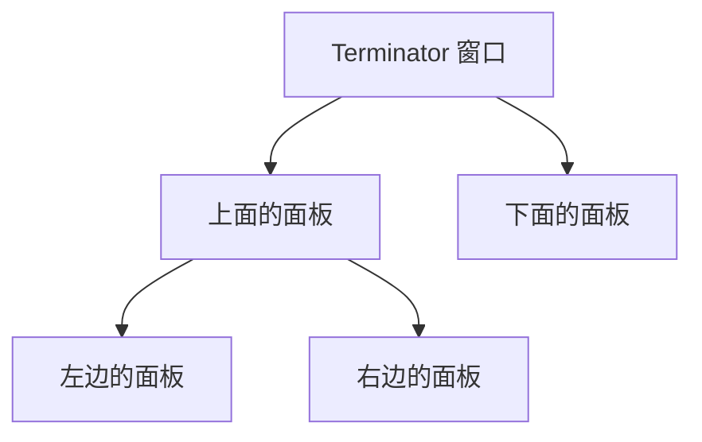
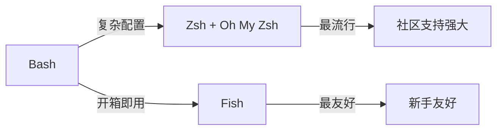
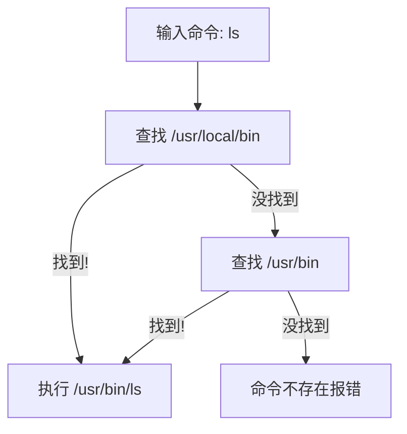
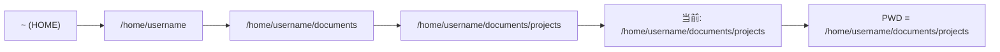
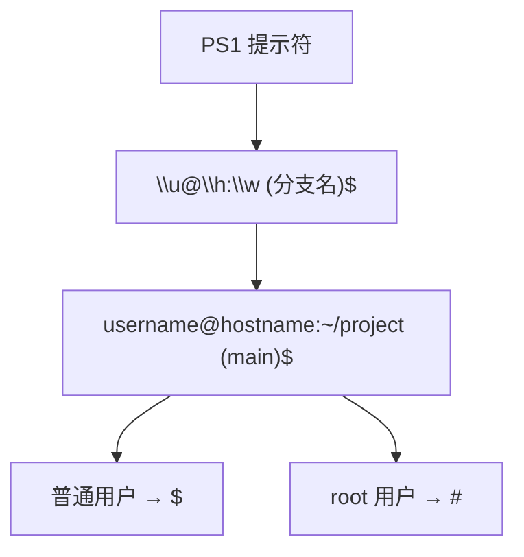
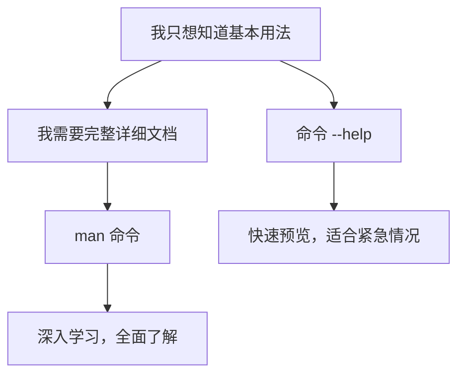
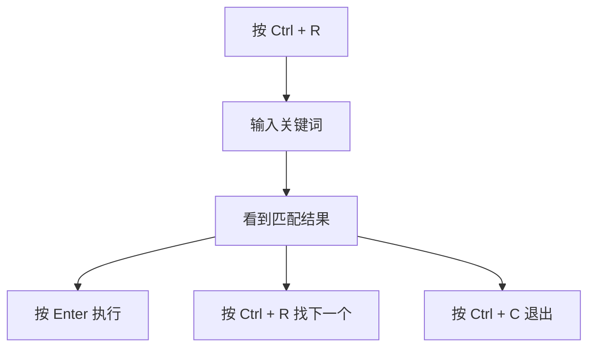
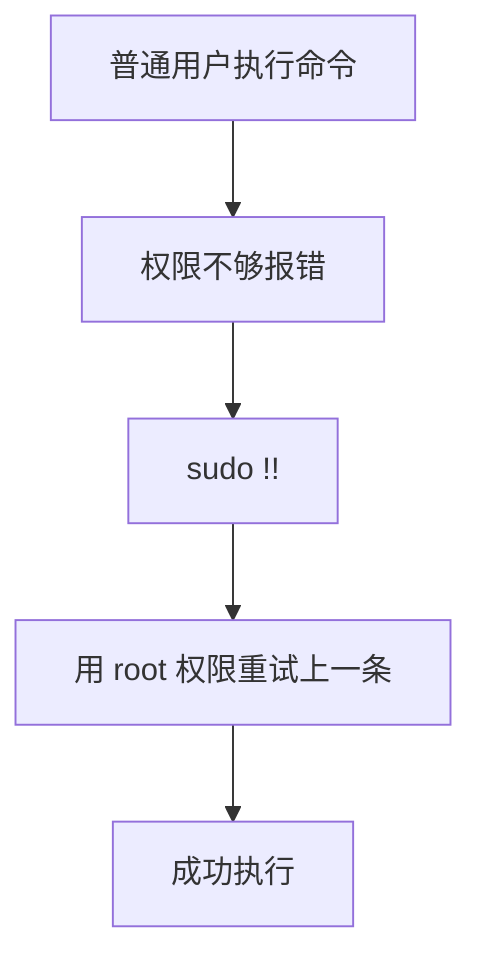

+++
title = "第5章：终端与 Shell 入门"
weight = 50
date = "2026-03-23T08:39:00+08:00"
type = "docs"
description = ""
isCJKLanguage = true
draft = false
+++


# 第五章：终端与 Shell 入门


## 5.1 什么是终端（Terminal）？为什么要用命令行？

想象一下：一个黑漆漆的窗口，里面闪烁着绿色的光标，就像黑客电影里那些天才们在键盘上疯狂敲击的神秘界面。没错，这就是终端——一个让你假装自己是超级黑客的神奇地方！

### 5.1.1 终端是文本界面

终端，英文叫 **Terminal**，听起来像是火车站的站台（其实单词本来就是"站台"的意思）。但是在计算机世界里，终端就是一个基于文本的交互界面——你输入文字，系统返回文字，没有花里胡哨的按钮和图片。

> 你可以把终端想象成一个古老的打字机：你敲下一个命令，它"哒哒哒"地打出一行结果。你再敲，它再打。只不过这个打字机可以帮你操控整个电脑！

和图形界面（**GUI**，Graphical User Interface）相比，终端就像是一个没有包装的快递——直接、粗暴、但效率极高。GUI 是自助餐，你点点鼠标拿东西；终端是直达车，你说什么它就做什么，废话少说。

**Windows 用户常见的"终端"叫命令提示符（CMD）或者 PowerShell**，而 Linux 和 macOS 用户则直接称其为"终端"或"Terminal"。它们都是文本界面的不同马甲，本质上都是同一个东西——让你用文字命令指挥电脑干活。

为什么黑客电影里总是用终端？因为**帅啊**！你见过哪个电影里的黑客用鼠标点来点去的？那多不酷！敲键盘才够味！

### 5.1.2 命令行的高效性

你可能会问："既然有图形界面可以点击，我为什么要学这个黑乎乎的东西？"

好问题！但是当你需要：

- 批量重命名 10000 个文件？（图形界面：点到手断）
- 在服务器上查看日志？（图形界面：抱歉，你得先远程桌面）
- 自动化每天重复的工作？（图形界面：...）
- 远程操控千里之外的电脑？（图形界面：emmm...）

终端的优势就体现出来了。**图形界面是自行车，命令行是火箭筒**——不是自行车不好，而是在特定场景下，火箭筒真的更给力。

举几个例子：

| 场景 | 图形界面操作 | 命令行操作 |
|------|------------|-----------|
| 批量重命名文件 | 选中→右键→重命名→改名字→确认×100次 | `rename 's/old/new/' *` 一行搞定 |
| 查看文件夹大小 | 右键→属性→等待加载 | `du -sh *` 秒出结果 |
| 查找包含某文字的文件 | Ctrl+F...等等，这文件夹有多少子文件夹来着？ | `grep -r "文字" .` |

**想象一下**：别人花10分钟在图形界面里点点点，你敲一行命令3秒钟搞定，然后悠闲地喝咖啡看别人抓耳挠腮...这画面，是不是很美？

### 5.1.3 服务器管理的必备技能

如果你以后想当 **DevOps 工程师**、**系统管理员**、或者**后端开发者**，那么命令行就是你的日常工作环境。

为什么？因为**服务器通常不装图形界面**！

服务器为什么要用命令行？原因很简单：

1. **省资源**：图形界面占内存、占CPU，这些宝贵资源应该留给业务程序
2. **远程方便**：SSH（一种远程连接协议）敲命令就像本地操作，网络卡也不怕
3. **可脚本化**：把一堆命令写成脚本，让它自动执行，实现自动化运维
4. **稳定可靠**：命令行出错的概率比图形界面低多了

> 打个比方：图形界面像是自动挡汽车，命令行像是手动挡赛车。日常代步自动挡够用，但想漂移、赛车？还得手动挡！

所以，无论你是想管理自己的博客服务器，还是将来入职当工程师，命令行都是必修课。现在学的每一个命令，都是在为未来铺路！

想象一下这个场景：凌晨3点，服务器报警，你SSH远程连接到服务器，敲几个命令定位问题，5分钟解决，然后继续睡觉。而不会命令的人只能干瞪眼，或者打车去公司...这就是差距啊！

---

## 5.2 终端模拟器

前面说的"终端"其实是一个软件，叫**终端模拟器**（Terminal Emulator）。它模拟了一个古老的物理设备——终端。在那个年代，终端是一个单独的硬件设备，屏幕和键盘是分开的，连接到主机上。现在我们用的终端软件就是模拟这个老古董的工作方式。

> 专业术语时间：**终端模拟器**（Terminal Emulator）就是那个你打开的黑窗口，它模拟了传统物理终端的行为。常见的有 GNOME Terminal、Konsole、xterm 等等。

### 5.2.1 GNOME Terminal（Ubuntu 默认）

**GNOME Terminal** 是 Ubuntu 和很多 Linux 发行版的默认终端。它是 GNOME 桌面环境的一部分，界面简洁，功能该有的都有。

如果你用的是 Ubuntu，打开它的方式超级简单：

- 按 `Ctrl + Alt + T`
- 或者点击左侧栏的"终端"图标
- 或者按 `Alt + F2`，输入 `gnome-terminal`，回车

GNOME Terminal 的特点是**稳定、简洁、不搞花哨**。它就像一个穿着朴素但很靠谱的老朋友，该干嘛干嘛，从不掉链子。

```
# Ubuntu 安装 GNOME Terminal（如果默认没有）
sudo apt update
sudo apt install gnome-terminal
```

### 5.2.2 Terminator（多终端）

**Terminator** 是一个专为喜欢分屏的人设计的终端模拟器。它最大的特点是可以**在一个窗口里分割出多个终端面板**，就像这样：



想象一下：左边看日志，右边写代码，上面跑测试，下面还能聊QQ（如果你无聊的话）。多任务并行，效率翻倍！

```bash
# Ubuntu 安装 Terminator
sudo apt update
sudo apt install terminator

# 启动
terminator
```

Terminator 支持**鼠标拖拽调整面板大小**，也支持快捷键分割。对喜欢同时盯着多个终端的人来说，简直是神器！

### 5.2.3 Konsole（KDE 默认）

**Konsole** 是 KDE 桌面环境的默认终端，和 Konsole（ KDE Plasma）配合得天衣无缝。如果你用的是 Kubuntu 或者其他 KDE 发行版，Konsole 就是你的默认伙伴。

Konsole 的特点是有**标签页功能**，可以打开多个标签，每个标签独立运行。而且它还支持**书签**功能，把常用的目录保存起来，一键跳转。

```
# Kubuntu 安装 Konsole（默认已安装）
sudo apt update
sudo apt install konsole

# 启动
konsole
```

> 小知识：KDE 是个开源桌面环境，类似于 GNOME。它们都是 Linux 上最流行的桌面环境，各有特色。KDE 更加可定制，GNOME 更加简洁。

### 5.2.4 Tilix

**Tilix** 是一个功能丰富的终端模拟器，它有一个独特的功能——**支持平铺**（Tiling）。这意味着你可以在一个窗口里并排或堆叠多个终端，而且布局可以自定义。

Tilix 还支持**终端分组**，让你可以同时向多个终端发送相同输入。这对需要同时管理多台服务器的人来说，简直是神器！

```bash
# Ubuntu 安装 Tilix
sudo apt update
sudo apt install tilix

# 启动
tilix
```

> 如果你在 Linux 上追求极致的终端体验，强烈建议你把这些终端都试试，找到最适合自己的那个。毕竟，工具选对了，干活不累！

---

## 5.3 打开终端的多种方法

好，现在你已经知道了终端是个什么玩意儿，接下来让我们学会怎么把它叫出来！

### 5.3.1 键盘快捷键：Ctrl + Alt + T

这是**通用法则**，适用于几乎所有 Linux 发行版：

- `Ctrl + Alt + T` = 打开终端

就是这个组合键，三根手指一齐按下，终端就"嗖"地一下出现了。记住了吗？没记住？那你现在按一遍，形成肌肉记忆！

> 为什么是这个组合？因为 `Ctrl` 是控制键，`Alt` 是替代键，`T` 代表 Terminal。组合起来就是"用控制键启动终端"——设计者真是用心良苦啊！

### 5.3.2 鼠标右键：Open in Terminal

在 Ubuntu（以及很多发行版）里，你可以在文件夹里**右键点击空白区域**，会看到一个选项叫 **"在终端中打开"**（Open in Terminal）。

这招特别适合当你**已经在文件管理器里浏览到某个目录**，想快速在这个位置打开终端的情况。右键→点击→搞定！

> 如果你的右键菜单里没有这个选项，可能需要安装 `nautilus-open-terminal` 插件：
> ```bash
> sudo apt install nautilus-open-terminal
> nautilus -q  # 重启文件管理器
> ```

### 5.3.3 应用菜单搜索

懒得记快捷键？没关系，图形界面最大的好处就是可以点点点！

1. 点击左下角的 **"活动"**（Activities）或者应用程序菜单
2. 输入 **"终端"** 或者 **"terminal"**
3. 看到终端图标，点击它


这个方法适合刚入门的时候，等你熟悉了，`Ctrl + Alt + T` 绝对是最快的方式！

---

## 5.4 Shell 是什么？

好了，现在你已经能打开终端了。但是你有没有想过——**当你敲命令的时候，谁在听你说话？谁在执行你的命令？**

答案就是：**Shell**！

### 5.4.1 Shell 是命令解释器

**Shell** 的字面意思是"壳"，但它可不是什么好吃的坚果壳。Shell 是 Linux/Unix 系统中的一道桥梁，连接你和内核（kernel）。

```
┌─────────────────────────────────────────┐
│              你（人类）                  │
│         "ls -la /home"                   │
└────────────────┬────────────────────────┘
                 │  输入命令
                 ▼
┌─────────────────────────────────────────┐
│           Shell（命令解释器）             │
│    接收命令 → 解释命令 → 调用内核执行      │
└────────────────┬────────────────────────┘
                 │  系统调用
                 ▼
┌─────────────────────────────────────────┐
│         Linux 内核（Kernel）             │
│         真正干活的老板                    │
└─────────────────────────────────────────┘
```

形象地说：Shell 就像一个**同声传译员**。你说人话（命令），Shell 翻译成内核能听懂的话（系统调用），内核干完活，Shell 再把结果翻译回人话告诉你。

> 专业词汇：**内核**（Kernel）是 Linux 系统的核心，它管理硬件资源、运行进程、控制文件系统和网络通信等。没有内核，你的电脑就是一堆废铁。Shell 是内核的"外壳"，所以叫 Shell 嘛！

### 5.4.2 Bash：Bourne Again Shell（最常用）

**Bash** = **B**ourne **A**gain **Sh**ell

这个名字是个文字游戏：Bourne Again = Born Again（重生），所以 Bash 其实是在玩"重生"的梗。而且 Bash 的祖先叫 Bourne Shell（由 Stephen Bourne 创建），所以"Bourne Again"既表示" Bourne 的后代"，又暗示"涅槃重生"。

> 这个名字是 GNU 项目的杰作，GNU 的人总是喜欢这种geek幽默。

Bash 是**最最最常见的 Shell**，大多数 Linux 发行版的默认 Shell 就是 Bash。为啥这么流行？因为它是 Linux 的"普通话"，几乎所有系统都支持，所有教程都用它。

```bash
# 查看当前使用的 Shell
echo $SHELL
# 输出类似：/bin/bash

# 查看系统支持的所有 Shell
cat /etc/shells
# 输出：
# /bin/sh
# /bin/bash
# /usr/bin/bash
# /bin/zsh
# ...
```

### 5.4.3 Zsh：Z Shell（Oh My Zsh）

**Zsh** 是 Bash 的增强版，功能更强大，主题更炫酷。但是它有个致命问题：**配置太复杂了**！

好在有个叫 **Oh My Zsh** 的项目拯救了世界！它是一个 Zsh 配置管理框架，让你可以一键配置出一个超美的终端环境，还自带git提示、docker提示等等。

```
# Ubuntu 安装 Zsh 和 Oh My Zsh
sudo apt install zsh
sh -c "$(curl -fsSL https://raw.github.com/ohmyzsh/ohmyzsh/master/tools/install.sh)"
```

Oh My Zsh 的特点：

- 主题系统：几百种漂亮主题任选
- 插件系统：git、docker、python、node...插件一开，应有尽有
- 自动补全：比 Bash 更智能

> 如果你想让终端变得又美又能打，Zsh + Oh My Zsh 是首选！不过配置多了启动会稍慢一些，颜值的代价啊！

### 5.4.4 Fish：Friendly Interactive Shell

**Fish** = **F**riendly **I**nteractive **Sh**ell

Fish 的设计理念就是**让 Shell 变得友好**，它的特点是：

- **开箱即用的智能补全**：不用配置，自动提示
- **语法高亮**：命令打错了会变红色
- **网页式配置**：用浏览器配置终端主题）
- **更自然的语法**：某些命令比 Bash 更好写

```bash
# Ubuntu 安装 Fish
sudo apt install fish

# 启动 Fish
fish

# 设置 Fish 为默认 Shell
chsh -s /usr/bin/fish
```



> **Shell 界的"三国杀"**：
> - **Bash**：老牌霸主，就像曹操——地盘最大，人手最多，但有点老派
> - **Zsh**：后起之秀，就像刘备——靠"Oh My Zsh"这个诸葛亮，招兵买马，粉丝众多
> - **Fish**：佛系选手，就像孙权——"友好"是座右铭，不折腾，开箱即用
>
> 选谁？小孩子才做选择，成年人当然是——**先学 Bash，再折腾 Zsh，最后发现 Fish 真香**！😏

---

## 5.5 Bash Shell 基础语法

好，现在让我们学习一下怎么和 Bash 说话！

### 5.5.1 命令格式：命令 + 选项 + 参数

Bash 命令的基本格式是这样的：

```bash
命令 选项 参数
```

- **命令**：要执行的程序，比如 `ls`、`cp`、`mkdir`
- **选项**：以 `-` 开头的标志，用来改变命令的行为，比如 `-l`、`-a`、`-r`
- **参数**：命令作用的对象，比如文件名、目录名

```bash
# ls         → ls 是命令
# -l          → -l 是选项，表示"详细列表"
# /home       → /home 是参数，表示"查看这个目录"
ls -l /home
```

选项可以合并：

```bash
# 这些是等价的：
ls -l -a -R /home
ls -laR /home
ls -alR /home
```

> 小技巧：选项的顺序一般不影响结果，但为了可读性，建议把短选项（如 `-l`、`-a`）放在前面，长选项（如 `--all`、`--help`）放在后面。也可以把多个短选项合并，如 `-la` 等价于 `-l -a`。

### 5.5.2 命令行补全：Tab 键

**Tab 键**是 Bash 最重要的快捷键，没有之一！

当你输入命令或文件名时，按 **Tab** 键：

- 如果输入是**唯一的**，自动补全
- 如果输入**不唯一**，按两下 Tab 显示所有可能选项

```bash
# 输入
ls /home/us<Tab>

# 如果 /home 下只有一个以 us 开头的用户目录，自动补全为：
ls /home/username/

# 如果有多个可能，按两下 Tab：
user1/  user2/  userc/  # 显示所有选项
```

这个功能叫**Tab补全**（Tab Completion），它能：

- 减少拼写错误
- 加快输入速度
- 让你不用记住完整的文件名

> 想象一下，你要输入一个超长的文件名： `/usr/local/share/doc/python3.9/site-packages/django/contrib/auth/models.py`
> 没有Tab补全？那你得copy-paste到崩溃！

### 5.5.3 命令历史：上下箭头

按 **上箭头**（↑）可以调出**上一条命令**，再按一次，调出更早的命令。

按 **下箭头**（↓）则相反，向更近的命令方向浏览。

```bash
# 假设你的命令历史是：
1. ls -la
2. cd /home
3. cat file.txt
4. grep "hello" file.txt

# 按一次上箭头 → 出现：grep "hello" file.txt
# 再按一次上箭头 → 出现：cat file.txt
# 按下箭头 → 出现：grep "hello" file.txt
```

这个功能叫**命令历史**（Command History）。它记住了你之前敲过的所有命令，让你快速重复执行，而不用重新打字。

> 职场小技巧：当你想重复执行一条长命令时，上箭头比Ctrl+C再Ctrl+V快多了！

---

## 5.6 环境变量初识

**环境变量**（Environment Variables）是 Linux 中超级重要的概念。它们是一些"全局设置"，影响程序运行时的行为。

你可以把环境变量想象成**餐厅的公共调料区**——厨师（程序）可以从这里拿调料（变量值），决定怎么做菜（程序行为）。

### 5.6.1 PATH：命令搜索路径

**PATH** 是最重要的环境变量，它告诉系统：**去哪些目录找可执行命令**？

```bash
# 查看 PATH 的值
echo $PATH
# 输出类似：
# /usr/local/bin:/usr/bin:/bin:/usr/local/games:/usr/games
```

PATH 里的目录用冒号 `:` 分隔。当你敲 `ls` 命令时，系统会按顺序在这些目录里找 `ls` 这个程序：



> 趣闻：如果你不小心把当前目录（`.`）加到了PATH开头，`ls` 可能被替换成你当前目录下的恶意程序！这就是为什么**永远不要把 `.` 放在 PATH 的最前面**。

### 5.6.2 HOME：用户家目录

**HOME** 变量指向当前用户的**家目录**——就像你的"家"，是存放个人文件的地方。

```bash
# 查看家目录
echo $HOME
# 输出类似：/home/username

# 在家目录下创建文件夹（~ 就是 HOME 的简写）
cd ~
# 或者更简单：
cd
```

> 专业词汇：**家目录**（Home Directory）是每个用户在系统里的"私人空间"。Linux 用户 `alice` 的家目录通常是 `/home/alice`，里面存放她的文档、下载、图片等个人文件。

### 5.6.3 USER：当前用户

**USER**（或 **USERNAME**）告诉你当前登录的是哪个用户：

```bash
echo $USER
# 输出：username

# 或者
whoami
# 输出：username
```

> 提示：有时候你需要root权限（超级用户）才能执行某些命令，这时候你会看到 `$` 变成 `#`：
> - `user@host:$` → 普通用户
> - `root@host:#` → 超级用户（root）

### 5.6.4 PWD：当前目录

**PWD** = **P**rint **W**orking **D**irectory，打印当前工作目录：

```bash
echo $PWD
# 输出当前目录路径

# 也可以用内置命令
pwd
# 输出：/home/username/documents
```



---

## 5.7 命令行提示符自定义（PS1 变量）

你有没有注意过终端里那一串显示文字？比如：

```
username@hostname:~/documents$
```

这就是**提示符**（Prompt），而它由一个叫 **PS1** 的环境变量控制。

### 5.7.1 显示用户名和主机名

默认的 PS1 包含用户名和主机名：

```bash
# 查看当前的 PS1
echo $PS1
# 输出类似：\[\e]0;\u@\h: \w\a\]${debian_chroot:+($debian_chroot)}\u@\h:\w\$

# 常见的转义字符：
# \u → 用户名 (username)
# \h → 主机名 (hostname)
# \w → 当前目录完整路径 (working directory)
# \W → 当前目录名（不含路径）
# \$ → 如果是普通用户显示 $，root 用户显示 #
```

### 5.7.2 显示当前目录

```bash
# 创建一个简洁的提示符：用户名@主机:当前目录$
export PS1="\u@\h:\w\$ "

# 生效后：
# username@hostname:~/documents$
```

### 5.7.3 显示 git 分支

如果你用 git，更想在提示符里显示当前分支（这样就知道自己在哪个分支上工作了）：

```bash
# Ubuntu 安装 git-autocomplete 和 bash-git-prompt
sudo apt install git

# 一个流行的方案是使用 Oh My Zsh，它的 git 插件自带分支显示
# 或者手动添加 git 分支到 PS1：

# 编辑 ~/.bashrc，添加：
parse_git_branch() {
    git branch 2>/dev/null | grep '*' | sed 's/* //'
}

export PS1="\u@\h:\w\$(parse_git_branch)\$ "

# 效果：
# username@hostname:~/project (main)$
```



> 小贴士：修改 PS1 只影响当前终端。要永久生效，把它加到 `~/.bashrc` 文件里。关于 .bashrc，我们后面会详细讲！

---

## 5.8 man 手册：获取命令帮助的正确方式

当你看到一个陌生命令，不知道怎么用？别慌！Linux 自带了一份"官方说明书"——**man 手册**。

### 5.8.1 man 命令用法

**man** = **man**ual，意思是"手册"。

```bash
# 查看 ls 命令的手册
man ls

# 查看效果：进入一个全屏文档，用方向键翻页，按 q 退出
```

> 就像你去图书馆查百科全书，man 就是 Linux 的百科全书。每个命令都有自己的一页"man page"。

### 5.8.2 man 页面 sections（1-9）

man 手册分为不同的**章节**（sections），数字从1到9：

| 章节 | 内容 | 示例 |
|------|------|------|
| 1 | 用户命令（可执行的命令） | `man 1 ls` 或 `man ls` |
| 2 | 系统调用（内核提供的函数） | `man 2 open` |
| 3 | C 库函数 | `man 3 printf` |
| 4 | 设备文件（/dev） | `man 4 tty` |
| 5 | 文件格式和约定 | `man 5 passwd` |
| 6 | 游戏和屏保 | `man 6 fortune` |
| 7 | 杂项 | `man 7 man` |
| 8 | 系统管理命令 | `man 8 mount` |
| 9 | 内核例程（高级） | 内核内部 API 文档 |

```bash
# 查看特定章节的 man page
man 5 passwd  # 查看 /etc/passwd 文件格式
man 8 ifconfig  # 查看网络配置命令
```

> 有时候，同一个名字可能出现在多个章节里（比如 `printf` 既是命令又是C库函数），这时你可以指定章节号来查看特定的文档。

### 5.8.3 whatis 命令

**whatis** 是个快速查看命令"一句话说明"的好工具：

```bash
# 一句话说明 ls 是什么
whatis ls
# 输出：ls (1) - list directory contents
# 说明：ls 是第1章节的命令，作用是"列出目录内容"

whatis cat
# 输出：cat (1) - concatenate files and print on the standard output
```

> 小技巧：`whatis` 就像是命令的"标题"，快速给你一个大致印象。`man` 则是完整的"用户手册"，需要深入了解时再看。

---

## 5.9 --help 参数：快速查看命令用法

如果你觉得 `man` 太隆重，只是想快速看看一个命令的基本用法，`--help` 参数就是你的好朋友！

```bash
# 大多数命令都支持 --help
ls --help
```

输出类似：

```
Usage: ls [OPTION]... [FILE]...
List information about the FILEs (the current directory by default).
Sort entries alphabetically if none of -cftuvSUX nor --sort is specified.

Mandatory arguments to long options are mandatory for short options too.
  -a, --all             不隐藏以 . 开头的文件
  -A, --almost-all      不显示 . 和 ..
  -l                    使用长列表格式
  -h, --human-readable  以人类可读的方式显示文件大小
  -r, --reverse         反序排列
  -S                    按文件大小排序
  -t                    按修改时间排序
      --help            显示此帮助信息并退出
      --version         显示版本信息并退出
```



> 小技巧：`--help` 不是 POSIX 标准，所以不是所有命令都支持（但大多数GNU工具支持）。`man` 是更通用的选择。不过，`--help` 的输出更简洁、更容易理解，适合快速查阅！

---

## 5.10 常用快捷键

在终端里，**快捷键**用得好，效率翻倍！想象一下，你正在敲命令，突然想中断它——如果你去拿鼠标点关闭按钮，那也太low了！学会快捷键，你就是键盘侠！

### 5.10.1 Ctrl + C：终止当前命令

当你正在运行一个命令，突然发现不对劲，想**立即停止**它：

```bash
# 运行一个会一直运行的命令
ping 127.0.0.1

# 按 Ctrl + C → 立即停止
```

> 这个组合键发送的是一个"中断信号"（SIGINT），告诉程序"喂，停下！"。就像你在别人说话时说"停！我有话要说！"一样。

### 5.10.2 Ctrl + Z：暂停当前命令

有时候你不想终止命令，只是想**暂时放下它**，去做点别的事：

```bash
# 正在运行 vim 编辑器
vim file.txt

# 按 Ctrl + Z → vim 暂停，退回终端
# 效果：vim 在后台挂着，你可以做其他事

# 想回来？输入 fg 即可
fg
```

> 专业术语：**前台**（Foreground）和**后台**（Background）。正在运行的程序占用终端叫"在前台"，不占用终端叫"在后台"。Ctrl+Z把程序暂停（挂起），fg（foreground）把它拉回前台。

### 5.10.3 Ctrl + L：清屏

终端上满屏都是输出，看烦了？清掉！

```bash
# 按 Ctrl + L → 屏幕清空，只剩提示符
```

> 等价于输入 `clear` 命令。但 Ctrl+L 更快，手指都不用离开键盘主区域！

### 5.10.4 Ctrl + A / Ctrl + E：光标移到行首/行尾

当你输入了一长串命令，发现开头有个错误：

```bash
# 输入了（假设光标在最后）：
echo "Hello World"

# 想改成 echo "Hello China"，把光标移到开头改
# Ctrl + A → 光标跳到行首
# Ctrl + E → 光标跳到行尾
```

| 快捷键 | 功能 | 记忆方法 |
|--------|------|----------|
| Ctrl + A | 光标移到行首 | A 是字母表第一个 |
| Ctrl + E | 光标移到行尾 | E 是 End |

### 5.10.5 Ctrl + U / Ctrl + K：删除光标前/后内容

```bash
# 假设输入了（光标在中间）：
echo "Hello World"
#           ↑ 光标在这里

# Ctrl + U → 删除光标前的所有字符
# 结果： World （Hello 没了）

# Ctrl + K → 删除光标后的所有字符
# 结果：echo "Hello （World 没了）
```

> 小技巧：这两个组合拳适合"重新开始"——删掉整行重打，比Backspace一下一下按快多了！

### 5.10.6 Ctrl + R：搜索历史命令

你之前敲过一个很长的命令，但记不清完整内容了？Ctrl + R 来救驾！

```bash
# 按 Ctrl + R，终端显示：
# (reverse-i-search)`':

# 输入关键词：
(reverse-i-search)`git`: git commit -m "fixed bug"

# 如果找到对的命令，按 Enter 执行
# 如果想继续找下一个匹配，按 Ctrl + R 继续
# 如果想退出搜索，按 Ctrl + C
```



> 职场神器！这个组合键能让你"反查"历史命令，再也不用一条一条翻了！

---

## 5.11 命令历史

Bash 会记住你敲过的每一条命令，这就是**命令历史**（Command History）。善用历史记录，效率蹭蹭往上涨！

### 5.11.1 上下箭头：浏览历史

我们之前提到过，上下箭头可以浏览之前的命令：

```bash
# 上箭头（↑）：上一条命令
# 下箭头（↓）：下一条命令
```

每按一次，就跳到上一次或下一次的命令。如果你要重复执行几个命令前的某条命令，多按几下箭头就好了！

### 5.11.2 history 命令：查看历史

`history` 命令让你看到完整的命令历史：

```bash
# 查看最近100条命令
history

# 输出示例：
#   1  ls -la
#   2  cd /home
#   3  cat file.txt
#   4  grep "hello" file.txt
#   5  man grep
```

### 5.11.3 !n：执行第 n 条命令

每个历史记录都有编号，用 `!n` 可以直接执行第 n 条命令：

```bash
# 执行编号为 5 的命令
!5

# 比如 history 显示：
#   5  cat /etc/passwd
# 那么 !5 就会再次执行 cat /etc/passwd
```

### 5.11.4 !!：执行上一条命令

```bash
# 执行上一条命令
!!

# 场景：你想用 root 权限执行上一条命令
# 上一条：cat /var/log/syslog
# 忘了加 sudo，直接：
sudo !!
```

> 神器啊！当你忘记加 sudo 执行一条需要权限的命令时，`sudo !!` 就是你的救命稻草！不用重新打字，直接复用上一条命令！

```bash
# 典型场景
cat /var/log/syslog
# 输出：Permission denied（权限不够）

# 立即用 sudo 重试
sudo !!
# 成功！
```



---

## 本章小结

本章我们揭开了 Linux 命令行世界的神秘面纱！

**核心知识点回顾：**

1. **终端（Terminal）** 是一个文本界面，让你用命令与电脑交互。它比图形界面更高效、更适合服务器环境。

2. **Shell** 是命令解释器，是你和内核之间的翻译官。最常用的是 **Bash**，还有更强大的 **Zsh** 和更友好的 **Fish**。

3. **环境变量** 是系统的"全局设置"，比如 `PATH`（命令搜索路径）、`HOME`（家目录）等。

4. **PS1 变量** 控制命令行提示符的样式，可以自定义显示用户名、主机名、当前目录、git分支等信息。

5. **man 手册** 和 **`--help`** 是获取命令帮助的两大神器，前者详细全面，后者简洁快速。

6. **快捷键** 是终端操作的加速器：`Ctrl+C` 终止、`Ctrl+Z` 暂停、`Ctrl+L` 清屏、`Ctrl+A/E` 跳转、`Ctrl+U/K` 删除、`Ctrl+R` 搜索历史。

7. **命令历史** 让你可以重用之前的命令：`↑↓` 浏览、`history` 查看、`!n` 执行第n条、`!!` 重复上一条。

**记住：命令行是 Linux 的灵魂，学会它，你就掌握了通往 Linux 世界大门的钥匙！** 多敲多练，你也能成为那个"敲几下键盘就搞定一切"的高手！

下一章我们将学习**文件与目录操作**，那是命令行最常用的场景之一。敬请期待！