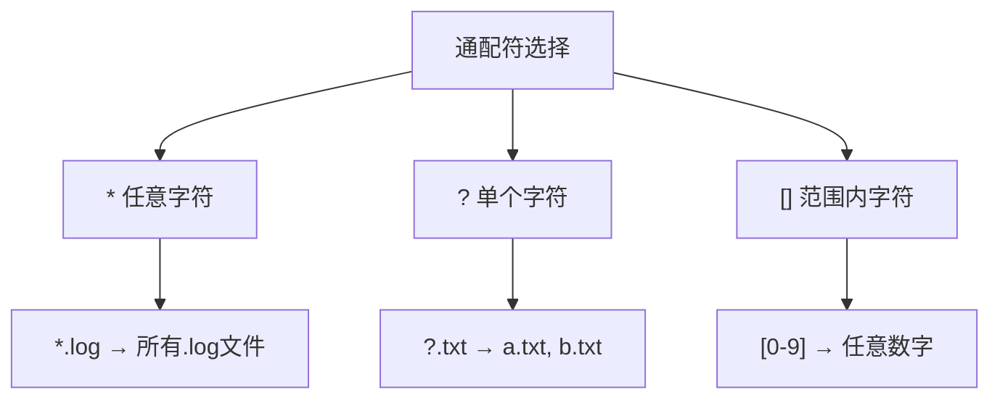
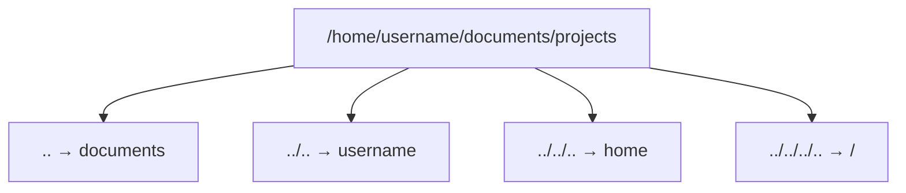
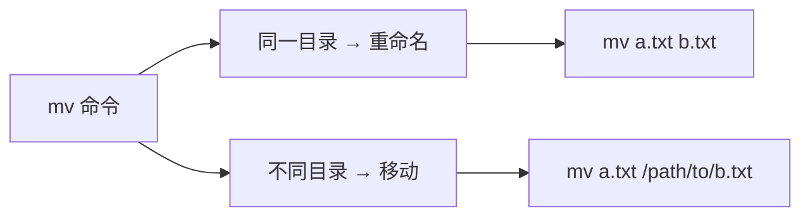
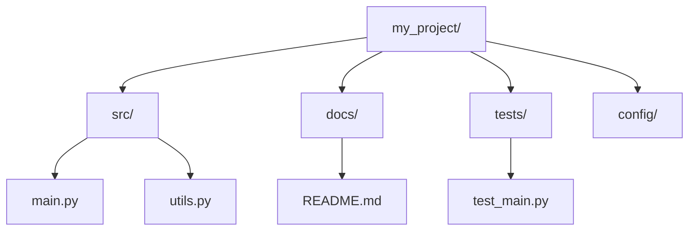

+++
title = "第6章：文件与目录操作"
weight = 60
date = "2026-03-23T08:39:00+08:00"
type = "docs"
description = ""
isCJKLanguage = true
draft = false
+++

# 第六章：文件与目录操作

## 6.1 ls 查看文件

`ls` 是 Linux 中最最最常用的命令，没有之一！它的作用是**列出目录内容**。就像 Windows 里的"打开文件夹看里面有啥"，只不过你需要敲字儿。

### 6.1.1 ls：基本用法

```bash
# 最简单的用法，不带任何选项
ls

# 效果：列出当前目录的文件和文件夹（不含隐藏文件）
# documents  downloads  music  pictures  videos
```

> 等等，为啥我的文件和Windows长得不一样？没有 `.exe` 后缀？没有文件夹图标？别慌，这就是 Linux！文件名就是文件名，后缀只是习惯，不强制。

### 6.1.2 ls -l：详细信息

```bash
# -l 表示 long format，详细列表
ls -l

# 输出示例：
# total 48
# drwxr-xr-x  2 user user 4096 Jan 15 10:30 documents
# -rw-r--r--  1 user user  8192 Jan 15 09:00 notes.txt
# drwxr-xr-x  3 user user 4096 Jan 15 10:30 pictures
# -rwxr-xr-x  1 user user 16384 Jan 15 08:00 script.sh
```

让我来解释一下每个字段（以第一行为例）：

```
drwxr-xr-x  2 user user 4096 Jan 15 10:30 documents
```

| 字段 | 含义 | 本例值 |
|------|------|--------|
| `drwxr-xr-x` | 文件类型和权限 | `d` = 目录，`rwxr-xr-x` = 所有者可读写执行，组可读执行，其他人可读执行 |
| `2` | 硬链接数 | 2 |
| `user` | 文件所有者 | user |
| `user` | 所属组 | user |
| `4096` | 文件大小（字节） | 4096（4KB） |
| `Jan 15 10:30` | 最后修改时间 | 1月15日 10:30 |
| `documents` | 文件名 | documents |

> 小技巧：看到 `-` 开头的是普通文件，看到 `d` 开头的是目录（directory）。这就像是文件的"身份证"，一眼就能区分！

### 6.1.3 ls -a：显示隐藏文件

在 Linux 里，以**点（`.`）开头**的文件是隐藏文件！就像哈利·波特的隐身斗篷，平时看不见，但它们确实存在。

```bash
# -a = all，显示所有文件（包括隐藏的）
ls -a

# 输出：
# .  ..  .bashrc  .profile  documents  downloads  notes.txt
```

> 解释一下：
> - `.` = 当前目录（current directory）
> - `..` = 上级目录（parent directory）
> - `.bashrc` = Bash 的配置文件（隐藏的）
> - `.profile` = 用户环境配置（隐藏的）

> 隐藏文件通常是用来配置的，一般不要乱动，否则系统可能抽风！

### 6.1.4 ls -lh：人性化大小

`ls -l` 显示的文件大小是字节为单位，数字看起来很别扭。`-h`（human-readable）会让你看得更舒服：

```bash
ls -lh

# 输出：
# total 48K
# drwxr-xr-x  2 user user 4.0K Jan 15 10:30 documents
# -rw-r--r--  1 user user 8.0K Jan 15 09:00 notes.txt
# drwxr-xr-x  3 user user 4.0K Jan 15 10:30 pictures
```

> 4.0K、8.0K、4.0K 是不是比 4096、8192 好看多了？这才叫人性化！

### 6.1.5 ls -R：递归显示

```bash
# -R = Recursive，递归显示所有子目录
ls -R

# 输出类似：
# .:
# documents  downloads  pictures

# ./documents:
# file1.txt  file2.txt

# ./downloads:
# music  videos

# ./downloads/music:
# song1.mp3  song2.mp3
```

> 这个命令会把你目录下的所有层级都展示出来，就像一棵树！适合在你需要了解整个项目结构时使用。

### 6.1.6 ls -S：按大小排序

想看看哪个文件最大？`-S` 按文件大小排序（从大到小）：

```bash
ls -lhS

# 假设输出：
# -rw-r--r--  1 user user 500M Jan 15 09:00 movie.mp4
# -rw-r--r--  1 user user 200M Jan 15 10:00 photo.zip
# -rw-r--r--  1 user user  50M Jan 15 11:00 document.pdf
```

> 小技巧：想从小到大排序？加个 `-r`（reverse）：
> ```bash
> ls -lhSr  # 从小到大
> ```

### 6.1.7 ls -t：按时间排序

想看最近修改的文件？`-t` 按修改时间排序（最新的在前面）：

```bash
ls -lt

# 输出（最新的在最上面）：
# drwxr-xr-x  3 user user 4096 Jan 15 14:00 downloads
# -rw-r--r--  1 user user 8192 Jan 15 13:30 notes.txt
# drwxr-xr-x  2 user user 4096 Jan 15 10:30 documents
```

> 这个命令超实用！当你忘记刚才改了什么文件时，一眼就能看到最近操作的文件。

### 6.1.8 ls -1：单列显示

```bash
# -1（数字1）单列显示，每行一个文件
ls -1

# 输出：
# documents
# downloads
# music
# notes.txt
# pictures
```

> 这个适合在脚本里处理输出时使用，parse起来更容易！

---

## 6.2 通配符

通配符（Wildcard）是 Shell 的神器！它能让你**用特殊符号匹配多个文件**，不用一个一个写文件名。想象一下，你要删除所有 `.log` 文件，难道要写一万遍 `rm file1.log file2.log ...`？不存在的！

### 6.2.1 *：匹配任意字符

**星号（`*`）** 匹配**任意长度、任意内容**的字符串。

```bash
# 列出所有 .txt 文件
ls *.txt
# 等价于 ls a.txt b.txt c.txt ...

# 列出所有以 doc 开头的文件
ls doc*
# 匹配：doc.txt, document.pdf, doc_homework.md ...

# 列出所有文件（等价于 ls）
ls *
```

> 记忆方法：`*` 就像万能钥匙，能打开任何锁！

### 6.2.2 ?：匹配单个字符

**问号（`?`）** 匹配**恰好一个字符**。

```bash
# 匹配 a.txt, b.txt, c.txt ... 但不匹配 ab.txt
ls ?.txt

# 匹配 file1.txt, file2.txt ... 不匹配 file10.txt
ls file?.txt

# 匹配 a.txt, 1.txt, x.txt（任意单字符）
ls ?.txt
```

> ⚠️ **注意**：`?.txt` 只能匹配**一个字符**的文件名，比如 `a.txt`、`1.txt`。它**不能**匹配 `12.txt` 或 `abc.txt`！想要匹配多个字符，得用 `*.txt`。

> 记忆方法：`?` 就像占位符，一个问号占一个字符的位置。

### 6.2.3 []：匹配范围内字符

**方括号（`[]`）** 匹配**方括号内的任意一个字符**。

```bash
# 匹配 a.txt, b.txt, c.txt
ls [abc].txt

# 匹配数字1-5
ls file[1-5].txt
# 等价于 ls file1.txt file2.txt file3.txt file4.txt file5.txt

# 匹配所有小写字母开头
ls [a-z]*.txt

# 匹配所有大写字母开头
ls [A-Z]*.txt
```

> 小技巧：方括号里可以用 `-` 表示范围，非常方便！



### 6.2.4 {}：生成序列

**大括号（`{}`）** 不会匹配已存在的文件，而是**生成序列**！

```bash
# 生成序列
echo {1..5}
# 输出：1 2 3 4 5

# 创建多个文件
touch file{1..3}.txt
# 创建：file1.txt, file2.txt, file3.txt

# 批量重命名（大括号扩展的经典用法）
mv document{,.bak}
# 展开为：mv document document.bak
# 原理：{,bak} 生成两个字符串 "" 和 ".bak"，拼在 document 后面
```

> 💡 **大括号扩展原理**：`{,bak}` 会生成两个值：空字符串和".bak"。所以 `document{,.bak}` 展开后变成 `document` 和 `document.bak`，正好作为 mv 的源和目标！
>
> 趣闻：`{}` 就像是"展开卡"，写进去什么就展开成什么。和 `[]` 不同，`[]` 是匹配，`{}` 是生成！

---

## 6.3 pwd 显示当前工作目录

`pwd` = **P**rint **W**orking **D**irectory，打印当前工作目录。简单说就是：**告诉我，我现在在哪？**

```bash
# 查看当前完整路径
pwd

# 输出示例：
# /home/username/documents/projects

# 在家目录执行：
pwd
# 输出：/home/username
```

> 经常有人问："我跑这个命令的时候，当前目录是哪儿啊？"——`pwd` 一敲，清晰明了！

```bash
# pwd 还有一个选项
pwd -P
# -P 显示物理路径（不显示符号链接）
# 如果当前目录是一个符号链接，pwd 会显示链接路径，pwd -P 显示真实路径
```

---

## 6.4 cd 切换目录

`cd` = **C**hange **D**irectory，切换目录。这是 Linux 里你使用频率最高的命令之一，仅次于 `ls`。

### 6.4.1 cd /：切换到根目录

```bash
# / 是 Linux 的根目录，所有文件的起点
cd /

# 查看根目录内容
ls
# 输出：bin  boot  dev  etc  home  lib  media  mnt  opt  proc  root  run  srv  sys  tmp  usr  var
```

> 根目录是 Linux 文件系统的最顶端，就像一棵大树的根。从这里出发，你可以到达任何地方！

### 6.4.2 cd ~：切换到用户家目录

```bash
# ~ 代表当前用户的家目录
cd ~

# 验证一下
pwd
# 输出：/home/username

# 也可以简写（什么都不加）
cd

# cd 和 cd ~ 效果一样，都是回家！
```

### 6.4.3 cd -：返回上次目录

```bash
# 你在 /home/username/documents
cd /var/log

# 现在在 /var/log，突然想回刚才的目录
cd -

# 瞬间回到 /home/username/documents
# 而且会显示你去了哪儿：
# /home/username/documents
```

> 后悔药！再也不怕回不去上一个目录了！这个 `-` 就像是浏览器的"后退"按钮！

### 6.4.4 cd ..：返回上级目录

```bash
# 假设你在 /home/username/documents
cd ..

# 回到 /home/username
pwd
# 输出：/home/username

# .. 永远代表上级目录
```

> 小技巧：想连续返回两级？没问题！
> ```bash
> cd ../..  # 返回上两级
> ```

### 6.4.5 cd ../..：返回上两级

```bash
# 从 /home/username/documents/projects 出发
cd ../..

# 现在在 /home/username
pwd
# 输出：/home/username
```



---

## 6.5 mkdir 创建目录

`mkdir` = **M**a**k**e **DIR**ectory，创建目录（文件夹）。

### 6.5.1 mkdir 目录名：创建单个目录

```bash
# 在当前目录下创建名为 "projects" 的目录
mkdir projects

# 验证
ls
# 可以看到 projects/ 已创建
```

### 6.5.2 mkdir -p 目录/子目录：递归创建

如果目录已经存在，`mkdir` 会报错。加 `-p`（parents）可以**递归创建**，即父目录不存在时一并创建：

```bash
# 递归创建 nested/directories/structure
mkdir -p nested/directories/structure

# 效果：
# nested/
# └── directories/
#     └── structure/

# 即使 nested 和 directories 都不存在，也会一并创建
```

> 这个 `-p` 是救命选项！想象一下你要创建 `/home/username/projects/my-awesome-app/src/components`，一层层创建得多麻烦，加个 `-p` 一步到位！

### 6.5.3 mkdir -v：显示创建过程

`-v`（verbose）会显示创建每个目录时的信息：

```bash
mkdir -v projects documents downloads

# 输出：
# mkdir: created directory 'projects'
# mkdir: created directory 'documents'
# mkdir: created directory 'downloads'
```

> 小技巧：`-v` 在脚本里特别有用，能让你知道命令到底干了什么。

---

## 6.6 touch 创建空文件

`touch` 的本意是"触碰"，但它最常用的功能是**创建空文件**。

### 6.6.1 touch 文件名：创建空文件

```bash
# 创建一个空的 README.txt
touch README.txt

# 创建多个文件
touch file1.txt file2.txt file3.txt

# 验证
ls -l README.txt
# -rw-r--r--  1 user user    0 Jan 15 12:00 README.txt
# 注意大小是 0，说明是空文件
```

> 有趣的是，如果文件已存在，`touch` 不会清空它，而是**更新文件的修改时间**！这有时候很有用，比如你想让 Makefile 重新编译某些文件。

### 6.6.2 touch -d 日期：修改时间

```bash
# 设置文件的修改时间为指定日期
touch -d "2024-01-01 00:00" file.txt

# 查看
ls -l file.txt
# -rw-r--r--  1 user user    0 Jan  1 00:00 file.txt
```

> 小技巧：`-d` 选项可以设置文件的访问时间和修改时间为指定日期，这在某些场景下很有用，比如让备份文件保持原始时间戳，或者测试脚本中模拟特定时间的文件。

---

## 6.7 cp 复制文件

`cp` = **C**o**p**y，复制文件。谁没有过"这个文件很重要，先备份一份"的时候呢？

### 6.7.1 cp 源 目标：基本复制

```bash
# 把 file.txt 复制一份，起名叫 file_backup.txt
cp file.txt file_backup.txt

# 把 /home/username/documents/file.txt 复制到当前目录
cp /home/username/documents/file.txt .
# 那个点 . 代表当前目录！
```

### 6.7.2 cp -r 目录 目标：递归复制

复制目录需要 `-r`（recursive）选项，否则会报错：

```bash
# 复制整个目录及其内容
cp -r projects/ projects_backup/

# 如果目标目录不存在，会自动创建
```

### 6.7.3 cp -i：覆盖前询问

```bash
# -i = interactive，强制询问是否覆盖
cp -i file.txt file_backup.txt

# 输出：
# cp: overwrite 'file_backup.txt'? y
# 输入 y 确认，n 取消
```

> 推荐把 `cp -i` 设成别名（alias），这样默认就会询问，避免误覆盖！

### 6.7.4 cp -v：显示过程

```bash
# -v = verbose，显示复制详情
cp -v document.pdf /tmp/

# 输出：
# 'document.pdf' -> '/tmp/document.pdf'
```

### 6.7.5 cp -p：保留属性

```bash
# -p = preserve，保留文件的属性（时间戳、权限等）
cp -p important.txt backup/important.txt

# 不加 -p：备份文件的时间会变成当前时间
# 加 -p：备份文件保持原样
```

> 小技巧：`-a`（archive）选项相当于 `-dr --preserve=all`，保留所有属性，非常适合备份！

---

## 6.8 mv 移动和重命名

`mv` = **M**o**v**e，既能**移动**文件，也能**重命名**文件（本质上是移动到新名字）。

### 6.8.1 mv 源 目标：移动

```bash
# 把 file.txt 从当前目录移动到 /tmp/
mv file.txt /tmp/

# 把 file.txt 从 /home/username 移动到 /home/username/documents/
mv /home/username/file.txt /home/username/documents/
```

### 6.8.2 mv 旧名 新名：重命名

```bash
# 重命名 oldname.txt 为 newname.txt
mv oldname.txt newname.txt

# 效果：文件还是那个文件，内容没变，就是名字变了
```

### 6.8.3 mv -i：覆盖前询问

和 `cp` 一样，`mv` 也有 `-i` 选项：

```bash
mv -i important.txt /tmp/

# 如果 /tmp/ 下已有同名文件：
# mv: overwrite '/tmp/important.txt'? y
```



---

## 6.9 rm 删除文件

`rm` = **R**e**m**ove，删除文件。这是一个**危险**的命令，因为 Linux 没有"回收站"，删了就是删了！

### 6.9.1 rm 文件：删除文件

```bash
# 删除单个文件（会询问确认）
rm file.txt

# 直接删除（如果已设置别名 rm='rm -i'）
rm file.txt
```

### 6.9.2 rm -r 目录：递归删除

```bash
# -r = recursive，递归删除目录及其所有内容
rm -r projects/

# 删除空目录也可以用 rmdir
rmdir projects/
```

### 6.9.3 rm -f：强制删除

```bash
# -f = force，强制删除，不询问
rm -f file.txt

# 组合使用：强制递归删除
rm -rf projects/
```

### 6.9.4 rm -rf /：危险命令（不要执行！）

这是一个**段子级别的危险命令**！`rm -rf /` 意味着"强制递归删除根目录下的所有文件"——相当于砸掉你的整个 Linux 系统！

```bash
# 绝对不要执行！！！
rm -rf /

# 现代 Linux 系统默认带有 --preserve-root 保护：
rm -rf /
# 输出：rm: it is dangerous to operate recursively on '/'
#       rm: you sure you want to continue? (yes/no)

# 必须加上 --no-preserve-root 才能执行（但永远不要这么做！）
rm -rf / --no-preserve-root

# 还有这些变体，也别玩：
rm -rf /*
rm -rf / --no-preserve-root
```

> 🚨 **真实案例**：某程序员在服务器上执行了 `rm -rf /tmp` 清理临时文件，结果手抖多打了一个空格变成了 `rm -rf / tmp`，系统瞬间爆炸...这个故事告诉我们：**输入命令前多看一眼，核对三遍再回车！**
>
> 😱 **另一个恐怖故事**：有新手想删除当前目录下的所有文件，于是输入 `rm -rf *`，结果键盘上的 `*` 键和 `/` 键太近了...你懂的。所以有人建议，执行危险命令前先 `pwd` 确认一下自己在哪，或者干脆先 `ls` 看看要删的是啥！
>
> 💡 **保命口诀**：
> - 删文件前，先 `ls` 看看
> - 用 `rm -rf` 时，手不要抖
> - 看到 `rm -rf /`，赶紧 Ctrl+C
> - 定期备份，以防万一

---

## 6.10 危险的 rm -rf /：如何避免致命错误

### 6.10.1 使用别名保护：alias rm='rm -i'

在 `.bashrc` 里添加别名，让 `rm` 默认带上 `-i`（询问确认）：

```bash
# 编辑 ~/.bashrc
nano ~/.bashrc

# 添加这一行：
alias rm='rm -i'

# 让别名生效
source ~/.bashrc
```

> 设置别名后，每次删除都会询问确认，多了一道安全锁！

### 6.10.2 使用 trash 替代 rm

有人开发了 `trash-cli` 工具，把文件扔进"回收站"而不是直接删除：

```bash
# Ubuntu 安装
sudo apt install trash-cli

# 使用方法
trash-put file.txt    # 删除到回收站
trash-list            # 查看回收站内容
trash-restore file.txt  # 恢复文件
trash-empty           # 清空回收站
```

> 如果你是那种经常"误删"的人，这个工具绝对是救星！

---

## 6.11 实战练习：组织你的文件结构

### 6.11.1 创建项目目录

让我们来实操一下，创建一个项目目录结构：

```bash
# 创建项目主目录
mkdir -p my_project/{src,docs,tests,config}

# 效果：
# my_project/
# ├── src/
# ├── docs/
# ├── tests/
# └── config/

# 详细解释：
# mkdir -p = 递归创建目录（父目录不存在时自动创建）
# {} = 在一次命令中创建多个子目录
```

### 6.11.2 移动和整理文件

```bash
# 创建一些测试文件
touch my_project/src/main.py
touch my_project/src/utils.py
touch my_project/docs/README.md
touch my_project/tests/test_main.py

# 查看最终结构
tree my_project
# （如果系统没有 tree，用 sudo apt install tree 安装）

# 输出：
# my_project/
# ├── config/
# ├── docs/
# │   └── README.md
# ├── src/
# │   ├── main.py
# │   └── utils.py
# └── tests/
#     └── test_main.py
```



> 小结：掌握了文件操作命令，你就能像整理房间一样整理你的数字生活！多练习，熟能生巧！

---

## 本章小结

本章我们学习了 Linux 文件系统的基础操作！

**核心命令回顾：**

| 命令 | 作用 | 常用选项 |
|------|------|----------|
| `ls` | 列出目录内容 | `-l` 详细信息, `-a` 显示隐藏, `-h` 人性化, `-R` 递归, `-S` 按大小, `-t` 按时间 |
| `pwd` | 显示当前目录 | `-P` 显示物理路径 |
| `cd` | 切换目录 | `~` 家目录, `-` 上次目录, `..` 上级目录 |
| `mkdir` | 创建目录 | `-p` 递归创建, `-v` 显示过程 |
| `touch` | 创建空文件/更新时间 | `-d` 设置日期 |
| `cp` | 复制文件/目录 | `-r` 递归, `-i` 询问, `-v` 显示, `-p` 保留属性 |
| `mv` | 移动/重命名 | `-i` 询问 |
| `rm` | 删除文件/目录 | `-r` 递归, `-f` 强制 |

**重要安全提示：**

- `rm` 没有"回收站"，删了就是删了！
- 建议把 `alias rm='rm -i'` 加到 `~/.bashrc`
- 或者使用 `trash-cli` 工具替代 `rm`

**通配符总结：**

- `*` = 匹配任意字符
- `?` = 匹配单个字符
- `[]` = 匹配范围内字符
- `{}` = 生成序列

下一章我们将学习**文件查看与编辑器**，包括 `cat`、`less`、`vim` 等查看和编辑文件的神器！敬请期待！