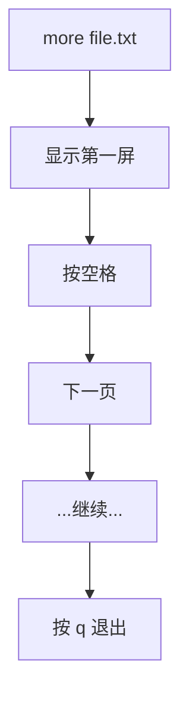
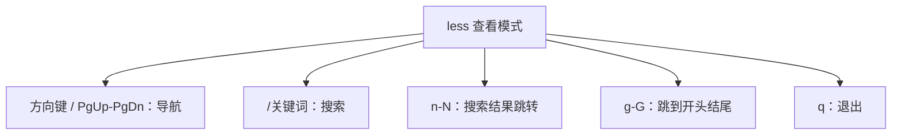
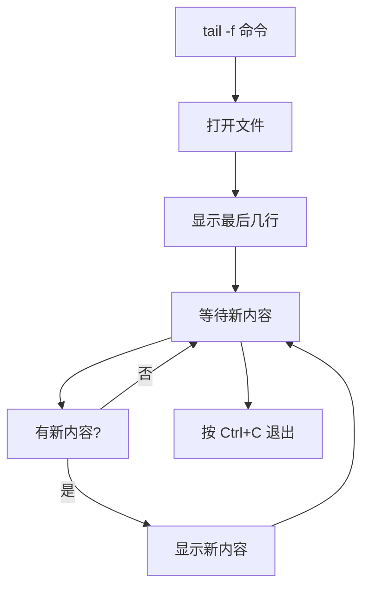
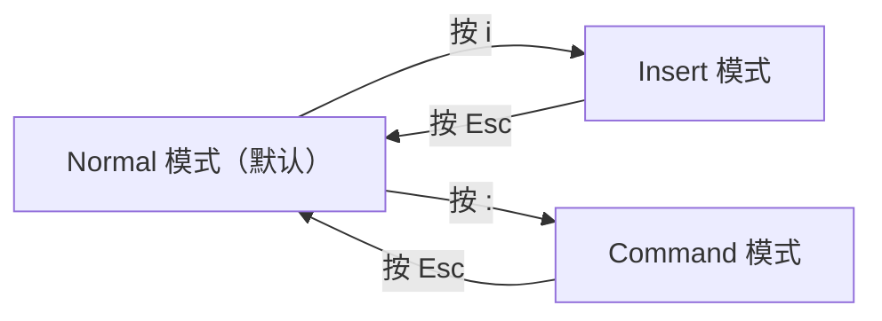
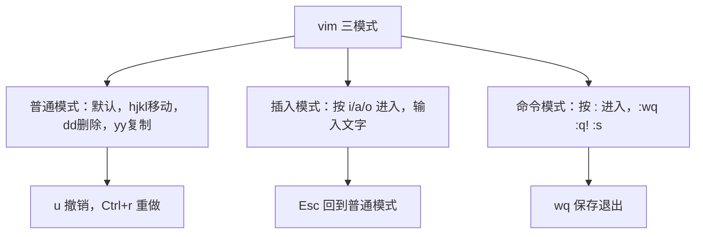

+++
title = "第7章：文件查看与编辑器"
weight = 70
date = "2026-03-23T08:39:00+08:00"
type = "docs"
description = ""
isCJKLanguage = true
draft = false
+++

# 第七章：文件查看与编辑器
## 7.1 cat 查看整个文件内容

`cat` = **C**oncate**t**ate，拼接/连接文件。不过它最常用的功能是**查看文件内容**。

### 7.1.1 cat 文件名：显示文件

```bash
# 最简单的用法，直接显示文件全部内容
cat file.txt

# 输出文件内容到屏幕
Hello, this is a test file.
Line 2 of the file.
Line 3 of the file.
```

### 7.1.2 cat -n：显示行号

```bash
# -n = number，给所有行加上行号
cat -n file.txt

# 输出：
#      1	Hello, this is a test file.
#      2	Line 2 of the file.
#      3	Line 3 of the file.
```

> 小技巧：行号对于程序员来说太有用了！找错误行号时特别方便！

### 7.1.3 cat -b：非空行编号

```bash
# -b = blank，只给非空行编号，空行忽略
cat -b file.txt

# 输出：
#      1	Hello, this is a test file.
#
#      2	Line 2 of the file.
# （中间的的空行没有行号）
```

### 7.1.4 cat -s：多行合并

```bash
# -s = squeeze-blank，把连续的空行压缩成一行
cat -s file.txt

# 效果：如果文件有多个连续空行，会显示为一个
```

### 7.1.5 cat 的高级用法：合并多个文件

```bash
# 把多个文件合并成一个
cat file1.txt file2.txt file3.txt > all.txt

# 追加内容到文件
cat file2.txt >> file1.txt

# 创建文件（使用 here document）
cat > newfile.txt << EOF
这是第一行
这是第二行
这是第三行
EOF
```

> 妙用：`cat > file.txt` 可以直接创建文件并写入内容，比 `touch` 高级多了！

---

## 7.2 more 分页查看（只能向下翻页）

`more` 是一个**古老的分页查看器**，它只能向下翻页，不能往回翻。适合查看大文件，不需要一次性显示全部内容。

### 7.2.1 more 文件名

```bash
# 分页显示 file.txt 的内容
more file.txt

# 效果：显示第一屏内容，屏幕底部显示：
# --More--(xx%)
# 表示还有 xx% 的内容没看完
```

### 7.2.2 空格键：下一页

```bash
# 按空格键向下翻一屏
# 按回车键向下翻一行
```

### 7.2.3 Enter：下一行

```bash
# 按 Enter 向下翻一行
# 适合一行一行慢慢看
```

### 7.2.4 q：退出

```bash
# 按 q 键退出 more
# 不然你就会一直卡在里面看啊看
```



> 历史趣闻：`more` 是 "more than one screen" 的缩写（或者说是"还有更多内容"的意思）。它诞生于 Unix 早期，那时候内存金贵得很，不可能一次性把所有内容加载到屏幕。

---

## 7.3 less 上下翻页查看（推荐）

`less` 是 `more` 的升级版，功能更强大！名字是一个文字游戏：**less is more**（少即是多）——Unix 设计者真的很喜欢这种幽默。

### 7.3.1 less 文件名

```bash
# 用 less 查看文件（推荐！）
less file.txt

# less 的优点：
# 1. 可以上下翻页
# 2. 可以搜索
# 3. 启动更快（不需要读取整个文件）
```

### 7.3.2 上下箭头：移动行

```bash
# 上箭头：向上一行
# 下箭头：向下一行
```

### 7.3.3 PgUp/PgDn：翻页

```bash
# PgUp：向上一页
# PgDn：向下一页
# 比上下箭头翻得更快
```

### 7.3.4 /关键词：搜索

```bash
# 在 less 界面里：
# 按 / 进入搜索模式
# 输入要搜索的关键词
# 按回车

# 示例：搜索 "error"
# 按 / 键
# 输入 error
# 按回车
# 所有匹配的关键词会高亮显示
# 按 n 跳到下一个匹配
# 按 N 跳到上一个匹配
```

> less 的搜索功能比 more 强太多了！`more` 根本不支持搜索！

### 7.3.5 g/G：跳到开头/结尾

```bash
# g = go to first，跳到文件第一行
# G = go to last，跳到文件最后一行
```



### 7.3.6 less 的额外技巧

```bash
# less 支持选项：
# -N 显示行号（相当于 cat -n 的效果）
less -N file.txt

# -M 显示更多状态信息（文件名、行数、百分比）
less -M file.txt

# 结合管道使用：
# 查看命令输出的分页结果
ls -la | less
# 比如 ls 结果很长，用 | less 可以分页看
```

> 小贴士：记住一个口诀 —— **`less is more, more is less`**！more 不能往回翻，less 可以！less 更现代！

---

## 7.4 head 查看文件开头

`head` 显示文件的**开头部分**，默认显示前10行。有时候你只需要看文件开头，不需要看全部。

### 7.4.1 head -n 20：查看前 20 行

```bash
# -n = number of lines，默认显示前10行
head -n 20 file.txt

# 或者更简洁：
head -20 file.txt

# 输出 file.txt 的前 20 行
```

### 7.4.2 head -c 100：查看前 100 字节

```bash
# -c = bytes，查看前100个字节（不是行）
head -c 100 file.txt

# 适合查看二进制文件开头（比如看图片文件头）
```

### 7.4.3 head 的实际应用

```bash
# 查看系统日志最新的几条（日志通常是最新的在最后）
# 但 /var/log/syslog 是最新的在最下面
# 用 head 只能看最早的

# 更好的方式是：
# 查看 CSV 文件的表头
head -1 data.csv
# 输出：name,age,city,email

# 查看日志格式
head -5 /var/log/nginx/access.log
```

> 小技巧：想看前几行，但不需要行号？`head file.txt` 就够了，默认前10行！

---

## 7.5 tail 查看文件结尾

`tail` 和 `head` 相反，**显示文件的结尾部分**。这个命令超级常用，尤其是看日志文件！

### 7.5.1 tail -n 20：查看后 20 行

```bash
# 默认显示最后10行
tail file.txt

# 指定行数
tail -n 20 file.txt
# 或者
tail -20 file.txt

# 查看最后 100 行
tail -100 file.txt
```

### 7.5.2 tail -c 100：查看后 100 字节

```bash
# 查看文件最后 100 字节
tail -c 100 file.txt
```

### 7.5.3 tail -f 实时监控日志文件

这是 `tail` 最强大的功能！**`-f` = follow，实时追踪文件变化**。当文件有新的内容追加时，`tail -f` 会自动显示出来！

```bash
# 实时监控日志文件
tail -f /var/log/syslog

# 效果：终端会停在这里，不断显示新增的日志行
# 当系统产生新日志时，你会立即看到
# 适合调试、监控服务器状态
```

### 7.5.4 tail -F 追踪文件（即使文件被删除重建）

```bash
# -f 追踪文件描述符，如果文件被删除或改名，追踪停止
# -F 追踪文件名，即使文件被删除重建也会继续追踪
tail -F /var/log/nginx/access.log

# 推荐用于日志轮转（log rotation）场景
```



### 7.5.5 tail 的实用场景

```bash
# 查看日志最新几条
tail -n 5 /var/log/nginx/access.log

# 监控错误日志
tail -f /var/log/nginx/error.log

# 监控多个文件
tail -f /var/log/syslog /var/log/nginx/access.log

# 结合 grep 监控特定关键词
tail -f /var/log/syslog | grep "error"
```

> 运维神器！当你的服务器出问题的时候，`tail -f` + `grep` 是定位问题的第一招！

---

## 7.6 wc 统计行数、单词数、字符数

`wc` = **W**ord **C**ount，字数统计。它可以统计文件的**行数、单词数、字符数**。

### 7.6.1 wc -l：行数

```bash
# 统计文件行数
wc -l file.txt

# 输出：
# 42 file.txt
# 42 是行数，后面是文件名

# 统计多个文件
wc -l file1.txt file2.txt

# 输出：
#   100 file1.txt
#    50 file2.txt
#   150 total
```

### 7.6.2 wc -w：单词数

```bash
# 统计单词数
wc -w file.txt

# 输出：
# 256 file.txt
```

### 7.6.3 wc -c：字符数

```bash
# 统计字符数（字节数）
wc -c file.txt

# 输出：
# 1024 file.txt
```

### 7.6.4 wc 不带选项：全部统计

```bash
# 不带选项，显示 行数 单词数 字符数
wc file.txt

# 输出：
# 42  256 1024 file.txt
# 行数 单词数 字符数
```

> 小技巧：配合管道使用，统计命令输出：
> ```bash
> # 统计当前目录有多少文件
> ls | wc -l
>
> # 统计有多少用户
> cat /etc/passwd | wc -l
> ```

---

## 7.7 nl 显示行号

`nl` = **N**umber **L**ines，和 `cat -n` 类似，显示带行号的内容，但输出格式更漂亮。

### 7.7.1 nl -ba：所有行编号

```bash
# -ba = body-all，所有行都编号（包括空行）
nl -ba file.txt

# 输出：
#      1	Hello
#      2
#      3	World
# （空行也有行号）
```

### 7.7.2 nl -n ln：左对齐

```bash
# -n ln = left numeric，左对齐行号（默认右对齐）
nl -n ln file.txt

# 输出：
# 1      Hello
# 2
# 3      World
```

---

## 7.8 nano 编辑器：最简单的编辑器

如果你觉得 `vim` 太复杂，`nano` 就是你的救星！它是**最简单、最友好的文本编辑器**，界面和 Windows 记事本差不多。

### 7.8.1 nano 文件名：打开文件

```bash
# 打开文件编辑（不存在则新建）
nano file.txt

# 如果是 root 用户，可能需要
sudo nano file.txt
```

### 7.8.2 界面说明

nano 打开后，底部有一排快捷键提示：

```
GNU nano 6.2                file.txt                       
                                                   
  这是文件内容...                                    
                                                   
                                                   
                              [ New File ]

^G Get Help    ^O WriteOut    ^R Read File   ^Y Prev Page   
^K Cut Text     ^C Cur Pos     ^X Quit        ^M Insert File
```

> 注意：^ 代表 Ctrl 键！^G 就是 Ctrl+G。

### 7.8.3 Ctrl + O：保存

```bash
# 编辑完成后，按 Ctrl+O
# 屏幕底部会问：File Name to Write: file.txt
# 直接回车确认
```

### 7.8.4 Ctrl + X：退出

```bash
# 按 Ctrl+X 退出
# 如果有未保存的更改，会问：
# Save modified buffer?  (Answering "No" will DISCARD your changes.)
# 按 Y 保存，或者 N 不保存
```

### 7.8.5 Ctrl + W：搜索

```bash
# 按 Ctrl+W 进入搜索
# 屏幕底部：Search: 
# 输入要搜索的内容，回车
# 按 Alt+W 跳到下一个匹配
```

### 7.8.6 nano 的其他常用操作

```bash
# Ctrl+K：剪切当前行
# Ctrl+U：粘贴（uncut）
# Ctrl+C：显示光标位置
# Ctrl+J：对齐当前段落
# Ctrl+W + Ctrl+W：查找并替换（先按 Ctrl+\）

# 常用选项：
nano -m    # 启用鼠标支持（可以用鼠标移动光标）
nano -i    # 自动缩进
```

> nano 小技巧：如果你是纯新手，想快速编辑配置文件，nano 是最佳选择！别担心，先从 nano 开始，以后再学 vim 也不迟！

---

## 7.9 vim 编辑器：强大的编辑器（三种模式）

`vim` = **V**i **IM**proved，是 Unix 系统经典编辑器 `vi` 的升级版。它是 Linux 中最强大的编辑器之一，但学习曲线比较陡峭。

> 传说中，全球有三种人：不会 vim 的、会 vim 的、已经在用 vim 的。而用 vim 的人分为两类：vim 入门了和 vim 还没入门。入门之后，你会发现 vim 能让你"键字如飞"！
>
> 🚨 **世纪难题：如何退出 vim？** 据说每年都有成千上万的程序员误打误撞进入 vim，然后因为不知道怎么退出而被迫重启电脑...其实答案很简单：按 `Esc` 然后输入 `:q!` 回车！（当然，如果你已经改动了文件，系统会不让你走，这时候用 `:wq` 保存退出，或者 `:q!` 强制不保存退出）
>
> 💡 **真实故事**：Stack Overflow 上"How to exit the Vim editor?"这个问题有超过 400 万的浏览量！如果你也曾被困在 vim 里出不来，恭喜你，你不是一个人！

### 7.9.1 vim 的三种模式

vim 不同于普通编辑器，它有**三种模式**：



| 模式 | 功能 | 如何进入 |
|------|------|----------|
| Normal（普通模式） | 浏览、复制、粘贴、删除等操作 | 默认模式，按 Esc |
| Insert（插入模式） | 输入文字 | 按 i, a, o 等 |
| Command（命令模式） | 保存、退出、查找、替换等 | 按 : |

### 7.9.2 普通模式：默认模式

打开 vim 后，默认就是**普通模式**。在这个模式下，**每个键都是快捷键**！

```bash
# 打开文件（如果不存在则新建）
vim file.txt

# 刚打开时就是普通模式
# 底部应该显示文件名，如果没有那就是空的
```

### 7.9.3 插入模式：i 进入

```bash
# 在普通模式下按 i，进入插入模式
i

# 底部会显示 -- INSERT --，表示现在可以输入文字
# 输入你想写的内容
Hello, vim!
This is my first vim file.
```

> 按 `a` 也可以进入插入模式，但光标位置不同：`i` 在光标前插入，`a` 在光标后插入。

### 7.9.4 命令模式：: 进入

按 `Esc` 回到普通模式，然后按 `:` 进入**命令模式**：

```bash
# 先按 Esc 回到普通模式
# 然后按 : 进入命令模式
# 底部会出现一个冒号光标
:

# 常用命令：
:w     # 保存（write）
:q     # 退出（quit）
:wq    # 保存并退出
:q!    # 不保存强制退出（! 表示强制）
```

### 7.9.5 基本操作：h/j/k/l 移动

在普通模式下，用 `h j k l` 移动光标（代替方向键）：

| 键 | 移动方向 |
|----|----------|
| `h` | 左 |
| `j` | 下 |
| `k` | 上 |
| `l` | 右 |

> 为什么要用 hjkl？因为在键盘上它们正好在右手食指附近，比方向键更快！当然，用方向键也不是不行，但 vim 高手都用 hjkl！

### 7.9.6 dd：删除行

```bash
# 在普通模式下：
dd

# 删除当前行（其实是剪切，可以粘贴）
# 删一行，光标下面的行会自动上来
```

### 7.9.7 yy：复制行

```bash
# yy = yank，复制当前行
yy

# 然后按 p 粘贴
p   # p = paste，在光标后粘贴（below）
P   # P = Paste，在光标前粘贴（above）
```

### 7.9.8 p：粘贴

```bash
# 刚才 dd 或 yy 的内容，按 p 粘贴
p
```

### 7.9.9 :wq 保存退出

```bash
# :wq = 保存并退出
:wq

# 如果想另存为：
:w newfile.txt

# 或者快速保存退出（Shift+zz）
ZZ
```

### 7.9.10 :q! 不保存退出

```bash
# 改了半天发现改错了？
:q!

# 不保存退出，! 表示强制忽略任何警告
```

### 7.9.11 vim 的其他常用操作

```bash
# 数字 + 命令 = 重复执行N次
3dd    # 删除3行
2yy    # 复制2行
5j     # 向下移动5行

# u = undo，撤销
u

# Ctrl+r = redo，重做
Ctrl+r

# / = 搜索
/keyword
# n = 下一个匹配
# N = 上一个匹配

# :set number = 显示行号
:set number

# :set hlsearch = 高亮搜索结果
:set hlsearch

# gg = 跳到文件开头
gg

# G = 跳到文件结尾
G

# :s/old/new/g = 替换当前行所有 old 为 new
:s/old/new/g

# :1,10s/old/new/g = 替换1-10行
:1,10s/old/new/g
```



### 7.9.12 vim 教程

```bash
# 打开 vim 自带的教程
vimtutor

# 30分钟入门 vim，非常推荐新手！
```

> 总结：vim 功能强大，但需要练习。建议：
> 1. 先用 `vimtutor` 入门
> 2. 日常编辑文件时尝试使用 vim
> 3. 逐渐掌握更多快捷键
> 4. 配置自己的 `.vimrc` 让 vim 更顺手

---

## 7.10 gedit 图形化文本编辑器

如果你不习惯纯命令行的编辑器，**gedit** 是 GNOME 桌面环境自带的图形化文本编辑器，和 Windows 记事本体验类似。

```bash
# 启动 gedit
gedit file.txt &

# 后台运行（加 &，不然会卡住终端）
gedit file.txt &

# Ubuntu 安装（通常已预装）
sudo apt install gedit
```

> gedit 特点：
> - 有图形界面，鼠标点点点
> - 支持语法高亮
> - 支持多标签页
> - 支持插件扩展
>
> 适合人群：刚从 Windows 转过来的新手，不想折腾 vim 的人。

---

## 本章小结

本章我们学习了 Linux 中查看和编辑文件的工具！

**文件查看命令总结：**

| 命令 | 作用 | 特点 |
|------|------|------|
| `cat` | 查看整个文件 | 一次性显示，适合小文件 |
| `more` | 分页查看 | 只能向下翻，老式命令 |
| `less` | 分页查看 | 上下翻页，推荐使用 |
| `head` | 查看文件开头 | 默认前10行 |
| `tail` | 查看文件结尾 | 默认后10行，-f 实时监控 |
| `wc` | 统计行/词/字符 | 配合管道使用 |
| `nl` | 显示行号 | 格式比 cat -n 更漂亮 |

**编辑器总结：**

| 编辑器 | 难度 | 适用人群 |
|--------|------|----------|
| `nano` | ⭐ 简单 | 新手，临时编辑 |
| `gedit` | ⭐ 简单 | 图形界面爱好者 |
| `vim` | ⭐⭐⭐⭐ 困难 | 进阶用户，服务器运维 |

**实战场景：**

```bash
# 实时监控日志
tail -f /var/log/syslog | grep error

# 统计文件行数
wc -l *.txt | sort -n

# 快速查看配置文件开头
head -20 /etc/nginx/nginx.conf
```

下一章我们将学习**文件查找与文本搜索**，掌握 `find`、`grep` 等强大的搜索工具！敬请期待！