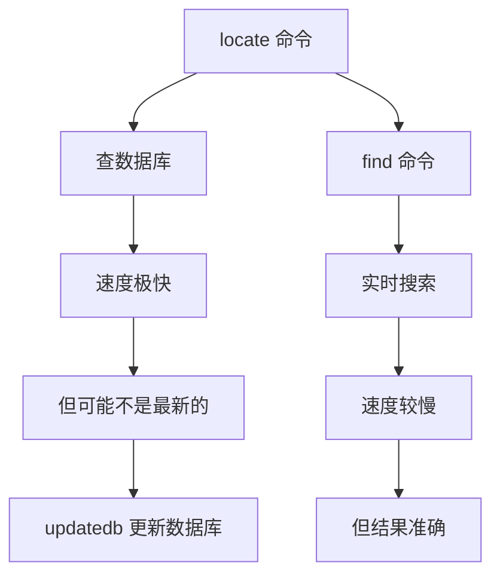

+++
title = "第8章：文件查找与文本搜索"
weight = 80
date = "2026-03-23T08:39:00+08:00"
type = "docs"
description = ""
isCJKLanguage = true
draft = false
+++


# 第八章：文件查找与文本搜索
## 8.1 find 按文件名查找文件

`find` 是 Linux 中最强大的文件查找工具！它可以根据**文件名、大小、时间、权限**等条件来查找文件。

### 8.1.1 find / -name "filename"

```bash
# 从根目录开始查找名为 filename 的文件（需要 sudo 权限）
sudo find / -name "filename"

# 示例：
sudo find / -name "python"

# 输出：
# /usr/bin/python3
# /usr/lib/python3
# ...
```

> ⚠️ **权限提示**：从根目录 `/` 开始搜索通常需要 `sudo`，因为普通用户无法访问某些系统目录。如果不想看到满屏的"Permission denied"，要么加 `sudo`，要么缩小搜索范围（如 `find /home` 或 `find /usr`）。
>
> 💡 **性能提示**：`find` 会实时遍历文件系统，从根目录开始可能很慢。日常查找建议先用 `locate`（基于数据库，秒出结果），找不到再用 `find`！

### 8.1.2 find /home -name "*.txt"

```bash
# 在 /home 目录下查找所有 .txt 文件
find /home -name "*.txt"

# 示例输出：
# /home/username/documents/notes.txt
# /home/username/downloads/readme.txt
# /home/username/backup/data.txt
```

> 小技巧：`-name` 后面可以加通配符：
> - `*` = 任意字符
> - `?` = 单个字符
> - 需要加引号，防止 Shell 展开

### 8.1.3 find / -iname：不区分大小写

```bash
# -iname = case-insensitive name，不区分大小写
find /home -iname "*.TXT"

# 匹配：file.txt, FILE.TXT, File.TXT, FiLe.TxT ...
```

---

## 8.2 find 按类型、大小、时间查找

`find` 的强大之处在于可以组合多个条件！

### 8.2.1 find -type f：文件

```bash
# 只查找普通文件（file）
find /home -type f -name "*.log"

# 查找所有普通文件
find /home -type f
```

### 8.2.2 find -type d：目录

```bash
# 只查找目录（directory）
find /home -type d -name "projects"
# 注意：-name 的参数要加引号，防止 Shell 展开

# 查找所有目录
find /home -type d
```

### 8.2.3 find -size +100M：大于 100M

```bash
# 查找大于 100MB 的文件
find / -size +100M

# 常用单位：
# c = bytes（字节）
# k = kilobytes（千字节）
# M = megabytes（兆字节）
# G = gigabytes（吉字节）

# 查找小于 10MB 的文件
find / -size -10M

# 查找正好 1GB 的文件
find / -size 1G
```

### 8.2.4 find -mtime -7：7 天内修改

```bash
# -mtime = modified time，文件修改时间
# -7 = 7天以内
find /home -mtime -7

# 查找恰好7天前修改的文件
find /home -mtime 7

# 查找7天之前修改的文件
find /home -mtime +7

# 其他时间选项：
# -atime = access time，访问时间
# -ctime = change time，状态改变时间
# -mmin = modified minutes，分钟单位
```

### 8.2.5 find 组合条件

```bash
# 组合使用：查找大于100MB且7天内修改过的 .log 文件
find /var/log -type f -name "*.log" -size +100M -mtime -7

# 使用 -o 表示"或者"（or）
find /home -type f \( -name "*.txt" -o -name "*.md" \)

# 使用 -not 或 ! 表示否定
find /home -type f -not -name ".*"
```

---

## 8.3 locate 快速查找文件（基于数据库）

`locate` 是 find 的"速查版"，因为它**不实时搜索文件系统，而是从一个数据库里查找**。速度快得惊人！

### 8.3.1 locate filename

```bash
# 快速查找文件（基于数据库）
locate filename

# 示例：
locate python

# 输出：
# /usr/bin/python3
# /usr/lib/python3
# /usr/share/doc/python3
# ...
```

### 8.3.2 updatedb：更新数据库

`locate` 的数据库**不是实时的**，默认每天自动更新一次。如果你要查找刚创建的文件，可能找不到：

```bash
# 手动更新数据库（需要root权限）
sudo updatedb

# 更新完成后，locate 就能找到新文件了
```

> 小技巧：有时候 updatedb 会跳过某些目录。你可以用 `locate -e` 检查文件是否真的存在（检查文件系统而不是数据库）。



> 推荐用法：
> - 日常快速查找：`locate filename`
> - 精确搜索：`find / -name "filename"`

---

## 8.4 which 查找命令位置

`which` 用来查找**命令的可执行文件路径**。当你敲 `python` 时，系统去哪找这个程序？就是 which 来告诉你的！

### 8.4.1 which python

```bash
# 查找 python 命令的位置
which python

# 输出：
# /usr/bin/python
```

### 8.4.2 which -a python：显示所有路径

```bash
# -a = all，显示所有找到的路径
which -a python

# 如果系统有多个 python 版本：
# /usr/bin/python
# /usr/local/bin/python
```

> 小技巧：可以用 `which` 来检查某个命令是否安装：
> ```bash
> which git
> # 如果没有安装，输出空白
> # 如果安装了，显示路径
> ```

---

## 8.5 whereis 查找命令及相关文件

`whereis` 比 `which` 更进一步，不仅查找命令位置，还查找**源代码和 man 手册**的位置！

### 8.5.1 whereis grep

```bash
# 查找 grep 的二进制、源码和 man 手册
whereis grep

# 输出：
# grep: /usr/bin/grep /usr/share/man/man1/grep.1.gz
#        ↑命令路径                ↑man手册位置
```

### 8.5.2 whereis -b：只查二进制

```bash
# -b = binary，只查找二进制文件
whereis -b python

# 输出：
# python: /usr/bin/python3
```

---

## 8.6 type 查看命令类型

`type` 告诉你一个命令是**内置命令、外部命令还是别名**。

### 8.6.1 type ls

```bash
# 查看 ls 是什么类型
type ls

# 输出：
# ls is aliased to 'ls --color=auto'
# 说明 ls 是一个别名（alias）

type cd

# 输出：
# cd is a shell builtin
# 说明 cd 是 Shell 内置命令（不是独立程序）
```

### 8.6.2 type -t ls：显示类型

```bash
# -t = type，只显示类型字符串
type -t ls
# alias

type -t cd
# builtin

type -t python
# file

type -t if
# keyword
```

> 类型含义：
> - `alias` = 别名（你自定义的命令快捷方式）
> - `builtin` = Shell 内置命令
> - `file` = 外部可执行文件
> - `keyword` = Shell 关键字（如 if、while）

---

## 8.7 grep 文本搜索

`grep` = **G**lobal **R**egular **E**xpression **P**rint，**全局正则表达式打印**。这是 Linux 文本处理的核心工具！

> grep 是"过滤"的艺术！你有一堆文本，想找出包含某个关键词的行？grep 就是你的过滤神器！

### 8.7.1 grep "关键词" 文件：基本搜索

```bash
# 在文件中搜索包含 "hello" 的行
grep "hello" file.txt

# 输出包含 "hello" 的行：
# Hello, world!
# hello there!
```

### 8.7.2 grep -i：不区分大小写

```bash
# -i = ignore case，忽略大小写
grep -i "hello" file.txt

# 匹配：Hello, HELLO, hello, HeLLo ...
```

### 8.7.3 grep -n：显示行号

```bash
# -n = number，显示匹配行的行号
grep -n "error" /var/log/syslog

# 输出：
# 123:Jan 15 10:30:01 server error: connection failed
# 456:Jan 15 10:31:05 server error: timeout
```

### 8.7.4 grep -v：反向匹配

```bash
# -v = invert，反向匹配（显示不包含关键词的行）
grep -v "debug" file.txt

# 显示所有"不是"debug的行
```

### 8.7.5 grep -r：递归搜索目录

```bash
# -r = recursive，递归搜索目录
grep -r "TODO" /home/username/project/

# 搜索多个文件：
grep -r "function" ./src/
```

### 8.7.6 grep -l：只显示文件名

```bash
# -l = files-with-matches，只显示包含匹配的文件名
grep -l "error" *.log

# 输出：
# access.log
# error.log
# system.log
```

### 8.7.7 grep -A：显示匹配行后的行

```bash
# -A = after，显示匹配行及其后面的 N 行
grep -A 3 "exception" error.log

# 显示包含 exception 的行，以及后面的3行
```

### 8.7.8 grep -B：显示匹配行前的行

```bash
# -B = before，显示匹配行及其前面的 N 行
grep -B 2 "error" log.txt

# 显示包含 error 的行，以及前面的2行
```

### 8.7.9 grep -C：显示匹配行前后的行

```bash
# -C = context，显示匹配行及其前后各 N 行
grep -C 5 "error" log.txt

# 显示包含 error 的行，以及前后各5行
```

```bash
# grep 常用选项组合示例：
# 在所有 .py 文件中递归搜索，显示文件名和行号
grep -rn "def " --include="*.py" .

# 高亮显示关键词
grep --color=auto "keyword" file.txt

# 统计匹配行数（-c = count）
grep -c "error" /var/log/syslog

# 使用 ERE（扩展正则）：
grep -E "error|warning|critical" log.txt
```

---

## 8.8 egrep 扩展正则表达式

`egrep` = grep with **E**xtended regex，支持**扩展正则表达式**，比普通 grep 更强大。

### 8.8.1 egrep "word1|word2"：多条件

```bash
# egrep 支持 | 表示"或"
egrep "error|warning|critical" log.txt

# 等价于 grep -E
grep -E "error|warning|critical" log.txt
```

### 8.8.2 egrep "[0-9]"：数字匹配

```bash
# 查找包含数字的行
egrep "[0-9]" file.txt

# 查找包含一个或多个数字的行
egrep "[0-9]+" file.txt

# 查找IP地址格式（xxx.xxx.xxx.xxx）
egrep "[0-9]{1,3}\.[0-9]{1,3}\.[0-9]{1,3}\.[0-9]{1,3}" log.txt
```

---

## 8.9 fgrep 快速 grep（不支持正则）

`fgrep` = **F**ixed-string grep，**快速字符串匹配**。它不支持正则表达式，只支持固定字符串，所以速度比普通 grep 更快。

```bash
# 查找字面量字符串（不支持正则）
fgrep "192.168.1.1" access.log

# 如果你的搜索词里有很多特殊字符（如 . * [ ），用 fgrep 最安全
fgrep "example.com (tm)" file.txt
```

> 小技巧：大多数情况下用 `grep -F` 代替 `fgrep`，效果一样。

---

## 8.10 正则表达式基础

**正则表达式**（Regular Expression）是一种强大的文本匹配模式。说白了，就是用特殊符号来表示"这个位置可以是某些字符"。

### 8.10.1 .：匹配任意字符

```bash
# . 匹配任意单个字符
grep "c.t" file.txt

# 匹配：cat, cot, cut, c4t, c@t ...
# 不匹配：ct, caat
```

### 8.10.2 *：匹配零个或多个

```bash
# * 匹配前面字符的零个或多个
grep "ab*c" file.txt

# 匹配：ac, abc, abbc, abbbc ...
```

### 8.10.3 []：字符类

```bash
# [abc] 匹配 a 或 b 或 c
grep "[aeiou]" file.txt

# 匹配所有元音字母

# [a-z] 匹配小写字母
# [A-Z] 匹配大写字母
# [0-9] 匹配数字

# [^abc] 排除 a b c
grep "[^0-9]" file.txt
# 匹配所有非数字字符
```

### 8.10.4 ^：行首

```bash
# ^ 表示行首
grep "^Hello" file.txt

# 匹配以 Hello 开头的行
```

### 8.10.5 $：行尾

```bash
# $ 表示行尾
grep "world$" file.txt

# 匹配以 world 结尾的行
```

### 8.10.6 \：转义

```bash
# 如果你要匹配特殊字符，用 \ 转义
grep "\." file.txt
# 匹配句号（. 是正则的特殊字符）

grep "\\" file.txt
# 匹配反斜杠
```

### 8.10.7 +：一个或多个

```bash
# grep 默认不支持 +，需要 grep -E 或 egrep
grep -E "ab+c" file.txt

# 匹配：abc, abbc, abbbc ...
# 不匹配：ac
```

### 8.10.8 ?：零个或一个

```bash
# ? 匹配前面字符的零个或一个
grep -E "colou?r" file.txt

# 匹配：color, colour
```


### 8.10.9 正则表达式实战

```bash
# 匹配邮箱格式（简化版，实际邮箱格式更复杂）
grep -E "[a-zA-Z0-9._%+-]+@[a-zA-Z0-9.-]+\.[a-zA-Z]{2,}" file.txt

# 匹配手机号（简化版：11位数字，以1开头）
grep -E "1[0-9]{10}" file.txt
# 注意：这只是简单的格式匹配，不会验证号码是否真实存在
# 更严格的匹配：grep -E "1[3-9][0-9]{9}" file.txt

# 匹配IP地址（简化版，不会验证数字范围）
grep -E "([0-9]{1,3}\.){3}[0-9]{1,3}" file.txt
# 注意：这个会匹配 999.999.999.999，实际IP每个段应为0-255
# 如需严格验证，需要更复杂的正则表达式

# 匹配空行
grep -E "^$" file.txt

# 匹配非空行（至少有一个字符的行）
grep -E ".+" file.txt

# 或者用 grep 的 -v 选项配合空行匹配
grep -v "^$" file.txt
```

> 💡 **正则表达式提示**：上面的示例都是简化版本，适合学习理解。实际项目中可能需要更严格、更复杂的正则表达式来精确匹配。

---

## 本章小结

本章我们学习了 Linux 中的文件查找与文本搜索工具！

**查找命令总结：**

| 命令 | 作用 | 特点 |
|------|------|------|
| `find` | 按条件查找文件 | 功能强大，可组合多种条件 |
| `locate` | 快速查找文件 | 基于数据库，速度快 |
| `which` | 查找命令位置 | 只查可执行文件 |
| `whereis` | 查找命令及文档 | 包含源码和man手册 |
| `type` | 查看命令类型 | alias/builtin/file/keyword |

**搜索命令总结：**

| 命令 | 作用 | 特点 |
|------|------|------|
| `grep` | 文本搜索 | 最常用，功能强大 |
| `egrep` | 扩展正则搜索 | 支持更多正则语法 |
| `fgrep` | 快速字符串匹配 | 不支持正则，速度快 |

**常用 grep 选项：**

```bash
-i  # 忽略大小写
-n  # 显示行号
-v  # 反向匹配
-r  # 递归搜索
-l  # 只显示文件名
-A  # 显示匹配后的行
-B  # 显示匹配前的行
-C  # 显示前后行
-c  # 统计匹配行数
```

**正则表达式速查表：**

| 符号 | 含义 |
|------|------|
| `.` | 任意单个字符 |
| `*` | 零个或多个 |
| `+` | 一个或多个 |
| `?` | 零个或一个 |
| `[]` | 字符类 |
| `[^]` | 排除字符类 |
| `^` | 行首 |
| `$` | 行尾 |
| `\` | 转义 |
| `()` | 分组 |

下一章我们将学习**管道与重定向**，掌握如何把多个命令串联起来工作！敬请期待！