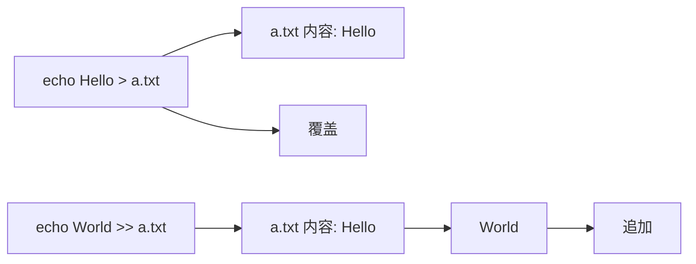
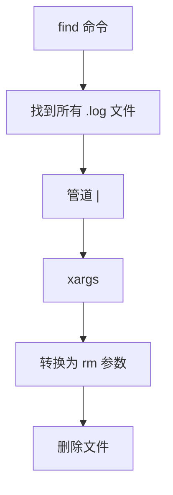

+++
title = "第9章：管道与重定向"
weight = 90
date = "2026-03-23T08:39:00+08:00"
type = "docs"
description = ""
isCJKLanguage = true
draft = false
+++

# 第九章：管道与重定向

## 9.1 什么是管道（|）？管道的作用

**管道**（Pipe）是 Linux 最强大的特性之一！它用 `|` 符号连接两个命令，让**前一个命令的输出**成为**后一个命令的输入**。

> 想象一下：你有一台果汁机，第一台机器把水果榨成汁，第二台机器把果汁过滤。管道就是这个连接两台机器的管子！
>
> 🍔 **更接地气的比喻**：想象你在快餐店点汉堡：
> - `cat` 是取餐员，把原材料（文件内容）拿出来
> - `grep` 是质检员，筛选出符合条件的（比如"牛肉汉堡"）
> - `sort` 是排序员，按价格排好序
> - `head` 是打包员，只拿前3个
> - 管道 `|` 就是传送带，把东西从一个工序传到下一个工序
>
> 没有传送带？那你得手动搬，累死人！有了管道，每个程序专注于自己的活，配合起来效率爆表！

### 9.1.1 管道连接命令

```bash
# 语法
命令1 | 命令2 | 命令3

# 示例：查看当前用户 processes，并只显示前10行
ps aux | head -n 10

# 解释：
# ps aux → 列出所有进程
# | → 把进程列表传给下一个命令
# head -n 10 → 只显示前10行
```

> `ps aux` 会列出超多进程，你根本看不完。用管道接 `head`，就只看前几条了！

### 9.1.2 管道的工作原理


> 专业术语：**标准输出**（stdout）是命令默认输出到屏幕的数据流。管道把这个数据流"重定向"到下一个命令的**标准输入**（stdin）。

### 9.1.3 管道实战

```bash
# 实战例子：

# 1. 查找进程，排除 grep 自身
ps aux | grep python | grep -v grep

# 2. 统计当前目录文件数量
ls -l | wc -l

# 3. 查看内存使用情况，按使用量排序
free -h | sort -rh | head -n 5

# 4. 查看日志最新10行，搜索 error
tail -f /var/log/syslog | grep error

# 5. 统计命令输出中有多少个"error"
dmesg | grep -i error | wc -l
```

> 管道是 Unix 哲学的体现：**一个程序只做一件事，但做好它**。多个简单程序通过管道组合，就能完成复杂任务！

---

## 9.2 输出重定向：> 和 >>

重定向让你可以**把命令的输出保存到文件**，而不是显示在屏幕上。

### 9.2.1 命令 > 文件：覆盖写入

```bash
# 把命令输出写入文件（覆盖原有内容）
echo "Hello, World!" > greeting.txt

# 查看文件内容
cat greeting.txt
# Hello, World!

# 再次写入，会覆盖！
echo "Goodbye!" > greeting.txt
cat greeting.txt
# Goodbye!  （之前的内容没了）
```

### 9.2.2 命令 >> 文件：追加写入

```bash
# 追加内容到文件末尾（不覆盖原有内容）
echo "First line" >> file.txt
echo "Second line" >> file.txt
echo "Third line" >> file.txt

cat file.txt
# First line
# Second line
# Third line
```



> 小技巧：可以用 `> /dev/null` 丢弃输出，不显示也不保存：
> ```bash
> command > /dev/null 2>&1
> # /dev/null 是一个特殊的"黑洞"设备，写进去的东西全消失
> ```

---

## 9.3 错误重定向：2> 和 2>>

命令输出有两类：**标准输出**（stdout，正常输出）和**标准错误输出**（stderr，错误信息）。

### 9.3.1 将错误输出重定向到文件

```bash
# 2> 把 stderr 重定向到文件
ls /nonexistent 2> errors.txt

# 查看错误信息
cat errors.txt
# ls: cannot access '/nonexistent': No such file or directory
```

> 数字含义：
> - `0` = 标准输入（stdin）
> - `1` = 标准输出（stdout）
> - `2` = 标准错误输出（stderr）

### 9.3.2 追加错误输出

```bash
# 2>> 追加错误到文件（不覆盖）
ls /nonexistent 2>> errors.txt
ls /another_missing 2>> errors.txt

cat errors.txt
# ls: cannot access '/nonexistent': No such file or directory
# ls: cannot access '/another_missing': No such file or directory
```

---

## 9.4 正确输出和错误输出重定向：&>

有时候你希望**把正常输出和错误输出都重定向到一个地方**。

### 9.4.1 &> 重定向所有输出

```bash
# &> 同时重定向 stdout 和 stderr（bash 特性，非 POSIX 标准）
command &> all_output.txt

# 更通用的写法（兼容所有 shell）：
command > all_output.txt 2>&1
```

> ⚠️ **兼容性注意**：`&>` 是 **bash 的语法糖**，在 `dash`、`sh` 等传统 shell 中不支持。写脚本时建议用 `> file 2>&1` 这种通用写法，兼容性更好！

### 9.4.2 &>> 追加所有输出

```bash
# &>> 追加方式重定向所有输出
command &>> log.txt
```

### 9.4.3 常见用法

```bash
# 把所有输出重定向到 /dev/null（丢弃一切）
command > /dev/null 2>&1

# 把错误重定向到标准输出，然后一起重定向
ls /home /nonexistent > output.txt 2>&1

# 查看哪些命令执行失败（查看 stderr）
make 2> errors.log
```

---

## 9.5 输入重定向：< 和 <<

输入重定向让命令从**文件**或**字符串**读取输入，而不是从键盘。

### 9.5.1 命令 < 文件

```bash
# 让 wc 从文件读取输入（而不是从键盘）
wc < file.txt

# 等价于：
wc file.txt
# （但 < 重定向更明确地表示"从文件读取"）
```

### 9.5.2 命令 << EOF

`<<` 叫做 **Here Document**，允许你在命令中直接输入多行文本：

```bash
# 用 cat 创建一个文件（here document 方式）
cat > notes.txt << EOF
这是一个多行文本
第二行内容
第三行内容
今天是 2024年1月15日
EOF

# cat 会把 << 和 EOF 之间所有内容作为输入
# EOF 只是自定义的分隔符，可以换成其他词
```

> Here Document 非常适合在脚本中嵌入多行文本！

### 9.5.3 Here String

```bash
# <<< 是 Here String，只输入一行字符串
wc <<< "hello world"

# 等价于：
echo "hello world" | wc
```

---

## 9.6 xargs 命令：将输出转为命令行参数

`xargs` 把**管道传来的数据**转换成**命令行参数**传递给其他命令。

### 9.6.1 基本用法

```bash
# ⚠️ 危险用法：文件名有空格会出错！
find . -name "*.log" | xargs rm

# ✅ 更安全的用法（处理特殊字符）：
find . -name "*.log" -exec rm {} \;
# 或者
find . -name "*.log" -print0 | xargs -0 rm

# 解释：
# find 找到所有 .log 文件
# -exec rm {} \; 逐个删除，能正确处理空格
# 或者 -print0 | xargs -0 也能安全处理空格
```

> 🚨 **安全性对比**：
> - `find | xargs rm`：**危险！**文件名有空格会出错
> - `find -exec rm {} \;`：**安全**，能正确处理空格和特殊字符
> - `find -print0 | xargs -0 rm`：**安全**，推荐用于大量文件

### 9.6.2 find . -name "*.log" | xargs rm

```bash
# 完整示例：
# 1. 先看看找到哪些文件（不删除）
find . -name "*.log"

# 2. 确认无误后，删除
find . -name "*.log" | xargs rm

# 3. 如果文件名有空格，加 -print0 和 xargs -0
find . -name "*.log" -print0 | xargs -0 rm
```

### 9.6.3 xargs 的其他选项

```bash
# -n 指定每次传递几个参数
find . -name "*.txt" | xargs -n 1 mv -t ./backup/
# 每次传1个参数，逐个移动到 backup 目录

# -I 指定占位符
find . -name "*.txt" | xargs -I {} mv {} ./backup/
# {} 是占位符，代表找到的文件名

# -p 显示将要执行的命令（interactive）
find . -name "*.txt" | xargs -p rm
# 执行前会询问：rm file1.txt file2.txt ...? y/n
```



---

## 9.7 tee 命令：同时输出到文件和屏幕

`tee` 名字来自英语的"T形管道"——就像水管的三通，一边进，两边出！

### 9.7.1 命令 | tee 文件

```bash
# tee 读取 stdin，写入文件和屏幕
echo "Hello, tee!" | tee output.txt

# 输出到屏幕：Hello, tee!
# 同时保存到 output.txt
```

### 9.7.2 tee -a 追加

```bash
# -a = append，追加模式
echo "First" | tee file.txt
echo "Second" | tee -a file.txt

cat file.txt
# First
# Second
```

### 9.7.3 tee 的实际应用

```bash
# 场景1：安装软件时同时记录日志
sudo apt install nginx | tee install_log.txt

# 场景2：管道链中使用 tee
echo "Starting process" | tee -a log.txt && \
    long_running_command | tee -a log.txt && \
    echo "Process completed" | tee -a log.txt

# 场景3：tee 到多个文件
echo "data" | tee file1.txt file2.txt file3.txt
```

> tee 和重定向的区别：
> - `command > file.txt` → 只保存到文件，屏幕看不到
> - `command | tee file.txt` → 既保存到文件，又显示到屏幕

---

## 9.8 实战：管道组合命令分析日志

让我们来一个综合实战，用管道组合命令分析日志！

### 9.8.1 统计错误数量

```bash
# 统计日志中 error 的数量
grep -i "error" /var/log/syslog | wc -l

# 如果有多个日志文件：
cat /var/log/*.log | grep -i error | wc -l
```

### 9.8.2 实时监控错误

```bash
# 实时显示最新的 error 日志
tail -f /var/log/syslog | grep -i error

# 或者只显示最近的50条错误
tail -n 100 /var/log/syslog | grep -i error
```

### 9.8.3 统计访问量最高的 IP

```bash
# 分析 nginx 访问日志，统计 IP 访问量
cat /var/log/nginx/access.log | \
    awk '{print $1}' | \
    sort | \
    uniq -c | \
    sort -rn | \
    head -n 10

# 解释：
# awk '{print $1}' → 提取第一列（IP）
# sort → 排序
# uniq -c → 去重并统计数量
# sort -rn → 按数量倒序排序
# head -n 10 → 只显示前10
```

### 9.8.4 分析网站流量

```bash
# 统计最常用的请求路径
cat /var/log/nginx/access.log | \
    awk '{print $7}' | \
    sort | \
    uniq -c | \
    sort -rn | \
    head -n 10

# 统计 HTTP 状态码
cat /var/log/nginx/access.log | \
    awk '{print $9}' | \
    sort | \
    uniq -c | \
    sort -rn
```

### 9.8.5 清理旧日志

```bash
# ⚠️ 危险写法：文件名有空格会出错！
find /var/log -name "*.log" -mtime +7 | xargs rm

# ✅ 安全写法1：使用 -delete（推荐）
find /var/log -name "*.log" -mtime +7 -delete

# ✅ 安全写法2：使用 -exec
find /var/log -name "*.log" -mtime +7 -exec rm {} \;

# ✅ 安全写法3：使用 -print0 | xargs -0
find /var/log -name "*.log" -mtime +7 -print0 | xargs -0 rm

# 先确认要删除哪些文件（不删除，只显示）
find /var/log -name "*.log" -mtime +7 -ls
```


---

## 本章小结

本章我们学习了 Linux 中的管道与重定向！

**管道（|）总结：**

```bash
# 管道把前一个命令的输出传给后一个命令
命令1 | 命令2 | 命令3
```

**输出重定向总结：**

| 符号 | 作用 |
|------|------|
| `>` | 覆盖重定向 stdout |
| `>>` | 追加重定向 stdout |
| `2>` | 重定向 stderr |
| `2>>` | 追加重定向 stderr |
| `&>` | 重定向所有输出 |
| `&>>` | 追加重定向所有输出 |

**输入重定向总结：**

| 符号 | 作用 |
|------|------|
| `<` | 从文件读取输入 |
| `<< EOF` | Here Document，多行输入 |
| `<<<` | Here String，单行输入 |

**xargs 和 tee：**

| 命令 | 作用 |
|------|------|
| `xargs` | 把输出转成命令行参数 |
| `tee` | 同时输出到文件和屏幕 |

**常用管道组合：**

```bash
# 统计
ls | wc -l              # 统计文件数
grep -c "error" log.txt # 统计匹配行数

# 过滤
ps aux | grep python    # 查找进程
history | grep apt      # 查找历史命令

# 分析
cat log | awk '{print $1}' | sort | uniq -c | sort -rn | head
```

**重定向到 /dev/null：**

```bash
command > /dev/null 2>&1  # 丢弃所有输出
```

下一章我们将学习**压缩与归档**，掌握 `tar`、`gzip`、`zip` 等工具！敬请期待！