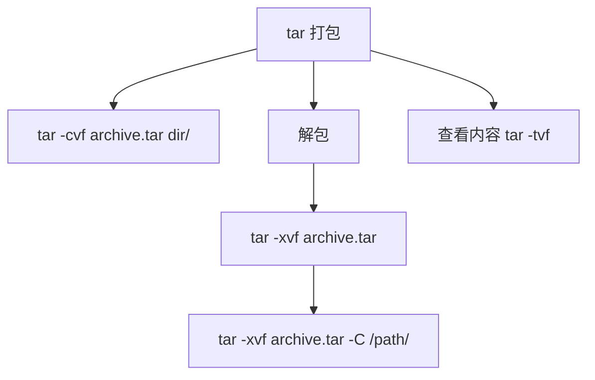
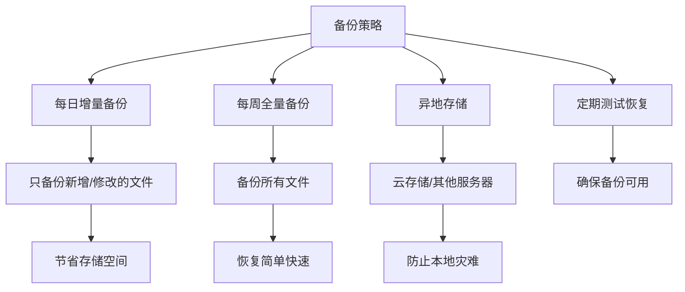

+++
title = "第10章：压缩与归档"
weight = 100
date = "2026-03-23T08:39:00+08:00"
type = "docs"
description = ""
isCJKLanguage = true
draft = false

+++

# 第十章：压缩与归档
## 10.1 tar 打包命令

**tar** = **T**ape **AR**chive，磁带归档。这是 Linux 中最经典的归档工具，诞生于磁带机时代。虽然现在没人用磁带了，但 tar 依然是最常用的打包工具！

### 10.1.1 tar -cvf archive.tar 目录：打包

```bash
# 语法：tar -cvf 归档文件名 要归档的目录
# -c = create，创建归档
# -v = verbose，显示过程
# -f = file，指定归档文件名

# 示例：把 documents 目录打包成 archive.tar
tar -cvf archive.tar documents/

# 输出：
# documents/
# documents/file1.txt
# documents/file2.txt
# documents/subdir/
# documents/subdir/file3.txt
```

> 小技巧：归档文件名的后缀建议用 `.tar`，这是一个约定俗成的命名习惯！

### 10.1.2 tar -tvf archive.tar：查看内容

```bash
# -t = list，列出归档内容（不解压）
tar -tvf archive.tar

# 输出：
# drwxr-xr-x  2 user user 4096 Jan 15 10:30 documents/
# -rw-r--r--  1 user user  123 Jan 15 10:30 documents/file1.txt
# -rw-r--r--  1 user user  456 Jan 15 10:30 documents/file2.txt
```

> 用 `-tvf` 可以预览归档包里有什么，还不用解压，非常方便！

### 10.1.3 tar -xvf archive.tar：解包

```bash
# -x = extract，解包
tar -xvf archive.tar

# 解压到指定目录 -C
tar -xvf archive.tar -C /tmp/

# 输出：
# documents/
# documents/file1.txt
# documents/file2.txt
# ...
```



---

## 10.2 tar 解包

### 10.2.1 tar -xvf archive.tar -C 目录

```bash
# -C = change to directory，切换到指定目录再解压
tar -xvf archive.tar -C /tmp/

# 解压后的内容会在 /tmp/documents/ 下
```

### 10.2.2 解压时的一些选项

```bash
# 解压单个文件（从归档中提取特定文件）
tar -xvf archive.tar documents/file1.txt

# 解压多个文件（通配符）
tar -xvf archive.tar --wildcards "*.txt"

# 只更新已存在的文件（保持原有时区）
tar -xvpf archive.tar

# 注意：-p（小写）保留文件权限，-P（大写P）保留绝对路径
```

---

## 10.3 tar 打包同时压缩

tar 本身只是"打包"，不压缩。但它可以调用压缩工具，实现**一步到位打包+压缩**！

### 10.3.1 tar -czvf archive.tar.gz 目录：gzip 压缩

**gzip** 是最常用的压缩格式，压缩比和速度都不错：

```bash
# -z = gzip，使用 gzip 压缩/解压
tar -czvf archive.tar.gz documents/

# 输出：
# documents/
# documents/file1.txt
# ...
# 文件名建议加 .gz 后缀
```

### 10.3.2 tar -cjvf archive.tar.bz2 目录：bzip2 压缩

**bzip2** 压缩比更高，但速度稍慢：

```bash
# -j = bzip2，使用 bzip2 压缩
tar -cjvf archive.tar.bz2 documents/

# 文件名建议加 .bz2 后缀
```

### 10.3.3 tar -cJvf archive.tar.xz 目录：xz 压缩

**xz** 压缩比最高，但速度最慢：

```bash
# -J = xz，使用 xz 压缩
tar -cJvf archive.tar.xz documents/

# 文件名建议加 .xz 后缀
```

### 10.3.4 tar -xzvf archive.tar.gz：解压 gz

```bash
# 解压 .tar.gz
tar -xzvf archive.tar.gz

# 解压 .tar.bz2
tar -xjvf archive.tar.bz2

# 解压 .tar.xz
tar -xJvf archive.tar.xz
```

### 10.3.5 压缩格式对比

| 格式 | 选项 | 后缀 | 压缩速度 | 压缩比 |
|------|------|------|----------|--------|
| gzip | `-z` | `.gz` | 快 | 适中 |
| bzip2 | `-j` | `.bz2` | 中等 | 较高 |
| xz | `-J` | `.xz` | 慢 | 最高 |

```bash
# 实战建议：
# 日常使用：gzip（速度快，兼容性好）
tar -czvf backup.tar.gz /home/user

# 需要极致压缩：xz（文件很大，不急着完成）
tar -cJvf backup.tar.xz /home/user

# 时间紧迫：gzip -1（最快压缩）
tar -czvf -1 backup.tar.gz /home/user
```

---

## 10.4 gzip 压缩

**gzip** 是 GNUzip 的缩写，是 Linux 最流行的压缩工具。

### 10.4.1 gzip 文件：压缩

```bash
# 压缩 file.txt，生成 file.txt.gz（原始文件被删除）
gzip file.txt

# 压缩多个文件
gzip file1.txt file2.txt file3.txt

# 压缩目录下所有 .txt 文件（递归）
gzip -r documents/
```

### 10.4.2 gunzip 文件.gz：解压

```bash
# 解压 file.txt.gz，生成 file.txt（压缩文件被删除）
gunzip file.txt.gz

# 解压所有 .gz 文件
gunzip *.gz

# 解压并保留压缩文件
gunzip -k file.txt.gz
```

### 10.4.3 gzip -k 保留原文件

```bash
# -k = keep，保留原始文件
gzip -k largefile.iso

# 查看结果
ls -lh largefile*
# largefile.iso   4.0G
# largefile.iso.gz  1.5G
```

### 10.4.4 gzip -9 最高压缩

```bash
# -1 到 -9，压缩级别
# -1 = 最快（压缩比低）
# -9 = 最慢（压缩比最高）
# 默认是 -6

# 最高压缩比
gzip -9 bigfile.txt

# 最快压缩
gzip -1 bigfile.txt
```

### 10.4.5 查看压缩文件内容

```bash
# zcat = gzip + cat，不需要解压直接查看 .gz 文件内容
zcat file.txt.gz

# zless = gzip + less
zless file.txt.gz

# zgrep = gzip + grep
zgrep "keyword" file.txt.gz
```

---

## 10.5 bzip2 压缩

**bzip2** 是另一种压缩工具，压缩比通常比 gzip 高。

### 10.5.1 bzip2 文件

```bash
# 压缩 file.txt，生成 file.txt.bz2
bzip2 file.txt

# -k 保留原文件
bzip2 -k file.txt

# -d 解压
bzip2 -d file.txt.bz2
```

### 10.5.2 bunzip2 文件.bz2

```bash
# bunzip2 是 bzip2 -d 的别名
bunzip2 file.txt.bz2

# 解压并保留原文件
bunzip2 -k file.txt.bz2
```

---

## 10.6 xz 压缩

**xz** 是最新的压缩格式，压缩比最高。

### 10.6.1 xz 文件

```bash
# 压缩 file.txt，生成 file.txt.xz
xz file.txt

# -k 保留原文件
xz -k file.txt

# -d 解压
xz -d file.txt.xz
```

### 10.6.2 unxz 文件.xz

```bash
# unxz 是 xz -d 的别名
unxz file.txt.xz
```

### 10.6.3 xz 的特殊功能

```bash
# -l 列出压缩文件信息（不解压）
xz -l archive.tar.xz

# 输出：
# Strms  Blocks   Compressed  Uncompressed  Ratio  Check
#     1       1     1,234 KB     5,678 KB  21.7%  CRC64

# -T 线程数（多线程压缩，速度更快）
xz -T 4 bigfile.tar
```

---

## 10.7 zip/unzip 压缩

**zip** 和 **unzip** 是 Windows 和 Linux 之间交换数据时的常用格式，因为 Windows 原生支持 .zip 文件。

### 10.7.1 zip -r archive.zip 目录

```bash
# 安装 zip/unzip（Ubuntu）
sudo apt install zip unzip

# 创建压缩包
zip -r backup.zip documents/

# 排除某些文件
zip -r backup.zip documents/ --exclude "*.tmp"

# 设置压缩级别（0-9）
zip -9 -r backup.zip documents/
```

### 10.7.2 unzip archive.zip

```bash
# 解压到当前目录
unzip backup.zip

# 解压到指定目录
unzip backup.zip -d /tmp/extract/

# 解压单个文件
unzip backup.zip documents/file.txt

# 查看压缩包内容（不解压）
unzip -l backup.zip

# 查看文件信息
unzip -v backup.zip
```

### 10.7.3 加密压缩

```bash
# -e = encrypt，加密压缩
zip -e secure.zip sensitive.txt
# 会提示输入密码

# 解密解压
unzip secure.zip
# 会提示输入密码
```

---

## 10.8 7z 格式

**7z** 是一种高压缩比的格式，但需要安装 `p7zip` 包。

### 10.8.1 7z a archive.7z 文件

```bash
# Ubuntu 安装
sudo apt install p7zip-full

# 创建 7z 压缩包
# a = add，添加文件到压缩包
7z a archive.7z documents/

# 压缩多个文件
7z a archive.7z file1.txt file2.txt file3.txt
```

### 10.8.2 7z x archive.7z

```bash
# 解压 7z 文件
# x = extract，解压到当前目录
7z x archive.7z

# 解压到指定目录
7z x archive.7z -o/tmp/extract/

# 查看压缩包内容
7z l archive.7z

# 测试压缩包完整性
7z t archive.7z
```

### 10.8.3 7z 其他选项

```bash
# 设置压缩级别（0-9）
7z a -mx=9 archive.7z bigfile/

# 分卷压缩（将大文件分割成多个小文件）
7z a -v100m backup.tar.gz
# 生成 backup.tar.gz.001, backup.tar.gz.002 ...

# 解压分卷
7z x backup.tar.gz.001
```

---

## 10.9 压缩级别选择：-1 到 -9

大多数压缩工具都支持 1-9 的压缩级别：

```bash
# gzip 压缩级别示例
gzip -1 file.txt   # 最快，压缩比低
gzip -6 file.txt   # 默认，平衡
gzip -9 file.txt   # 最慢，压缩比高

# 时间 vs 空间 权衡
# 场景1：一次性备份，愿意等 → -9
# 场景2：实时压缩日志，讲究速度 → -1
# 场景3：日常使用 → 默认（-6）
```

| 级别 | 速度 | 压缩比 | 适用场景 |
|------|------|--------|----------|
| -1 / --fast | 最快 | 最低 | 实时压缩、大量文件 |
| -6 / --default | 中等 | 适中 | 日常使用 |
| -9 / --best | 最慢 | 最高 | 一次性备份、空间有限 |

---

## 10.10 实战：定期备份网站文件

让我们来一个综合实战，用脚本实现定期备份！

### 10.10.1 备份脚本

```bash
#!/bin/bash
# backup.sh - 网站文件备份脚本

# 定义变量
DATE=$(date +%Y%m%d_%H%M%S)               # 当前日期时间
BACKUP_DIR="/tmp/backups"                  # 备份存储目录
WEB_ROOT="/var/www/html"                   # 网站根目录
DB_NAME="mywebsite"                        # 数据库名
DB_USER="dbuser"                           # 数据库用户
DB_PASS="yourpassword"                     # 数据库密码（实际使用时请用更安全的方式）

# 创建备份目录
mkdir -p $BACKUP_DIR

# 备份网站文件（tar.gz 格式）
tar -czvf $BACKUP_DIR/www_backup_$DATE.tar.gz $WEB_ROOT

# 备份数据库（mysqldump）
# 方法1：交互式输入密码（更安全，密码不会出现在命令历史中）
mysqldump -u$DB_USER -p $DB_NAME | gzip > $BACKUP_DIR/db_backup_$DATE.sql.gz
# 执行后会提示输入密码

# 方法2：使用配置文件（~/.my.cnf）存储密码（适合自动化脚本）
# 在 ~/.my.cnf 中添加：
# [mysqldump]
# user=dbuser
# password=yourpassword
# 然后直接运行：
# mysqldump $DB_NAME | gzip > $BACKUP_DIR/db_backup_$DATE.sql.gz

# ⚠️ 方法3：命令行直接带密码（不推荐，密码会留在命令历史中！）
# mysqldump -u$DB_USER -p$DB_PASS $DB_NAME | gzip > $BACKUP_DIR/db_backup_$DATE.sql.gz

# 输出备份完成信息
echo "Backup completed at $DATE"
echo "Files:"
echo "  - $BACKUP_DIR/www_backup_$DATE.tar.gz"
echo "  - $BACKUP_DIR/db_backup_$DATE.sql.gz"

# 备份日志
echo "[$DATE] Backup completed successfully" >> /var/log/backup.log
```

> 说明：
> - `$(date +%Y%m%d_%H%M%S)` 生成带时间戳的文件名，避免覆盖
> - `tar -czvf` 一步完成打包+压缩
> - `mysqldump` 导出数据库，`gzip` 压缩 SQL 文件
> - 使用绝对路径确保脚本在任何目录执行都能正常工作

### 10.10.2 设置定时任务

```bash
# 给脚本添加执行权限
chmod +x backup.sh

# 编辑 crontab（定时任务）
crontab -e

# 添加以下行（每天凌晨3点执行备份）：
0 3 * * * /path/to/backup.sh

# crontab 格式说明：
# ┌───────────── 分钟 (0-59)
# │ ┌─────────── 小时 (0-23)
# │ │ ┌───────── 日 (1-31)
# │ │ │ ┌─────── 月 (1-12)
# │ │ │ │ ┌───── 星期 (0-7, 0和7都是周日)
# │ │ │ │ │
0 3 * * * /path/to/backup.sh
```

### 10.10.3 备份策略建议



**备份原则：**

1. **3-2-1 原则**：3份副本，2种介质，1份异地
2. **定期测试**：每季度至少测试一次恢复流程
3. **加密敏感数据**：使用 `gpg` 或 `zip -e` 加密备份
4. **监控备份**：检查 cron 日志，确保备份成功

### 10.10.4 清理旧备份

```bash
# 只保留最近7天的备份（添加到 crontab）
0 4 * * * find /tmp/backups -mtime +7 -delete

# 或者在脚本中加入清理逻辑
# backup.sh 中添加：
# 删除7天前的备份（安全写法）
find $BACKUP_DIR -name "*.tar.gz" -mtime +7 -delete
find $BACKUP_DIR -name "*.sql.gz" -mtime +7 -delete
echo "Cleaned up backups older than 7 days"
```

> ⚠️ **安全提示**：删除文件时建议使用 `-delete` 或 `-exec rm {} \;`，避免使用 `| xargs rm`（文件名有空格会出错）。

---

## 本章小结

本章我们学习了 Linux 中的压缩与归档工具！

**tar 打包工具：**

| 选项 | 作用 |
|------|------|
| `-c` | 创建归档 |
| `-x` | 解包归档 |
| `-t` | 查看归档内容 |
| `-v` | 显示过程 |
| `-f` | 指定文件名 |
| `-z` | gzip 压缩/解压 |
| `-j` | bzip2 压缩/解压 |
| `-J` | xz 压缩/解压 |
| `-C` | 解压到指定目录 |

**压缩工具对比：**

| 工具 | 格式 | 特点 |
|------|------|------|
| gzip | .gz | 最流行，速度快 |
| bzip2 | .bz2 | 压缩比较高 |
| xz | .xz | 压缩比最高 |
| zip | .zip | Windows 兼容 |
| 7z | .7z | 压缩比很高 |

**zip/unzip 命令：**

| 命令 | 作用 |
|------|------|
| `zip -r archive.zip dir/` | 打包压缩 |
| `unzip archive.zip` | 解压 |
| `unzip -l archive.zip` | 查看内容 |

**7z 命令：**

| 命令 | 作用 |
|------|------|
| `7z a archive.7z files` | 创建压缩包 |
| `7z x archive.7z` | 解压 |
| `7z l archive.7z` | 查看内容 |

**压缩级别：**

```bash
gzip -1  # 最快
gzip -6  # 默认
gzip -9  # 最高压缩
```

**实战命令：**

```bash
# 打包压缩
tar -czvf backup.tar.gz /path/to/dir

# 查看内容
tar -tzf backup.tar.gz

# 解压
tar -xzvf backup.tar.gz

# 跨格式解压（tar 自动识别格式）
tar -xf backup.tar.xz
```

恭喜你完成了 Linux 基础教程的十章内容！🎉

你已经学会了：
- 终端与 Shell 基础
- 文件与目录操作
- 文件查看与编辑器
- 文件查找与文本搜索
- 管道与重定向
- 压缩与归档

继续加油，Linux 大神之路，从这里开始！🚀