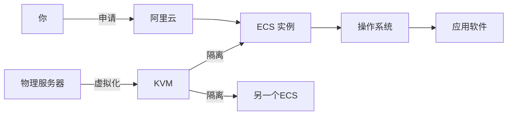
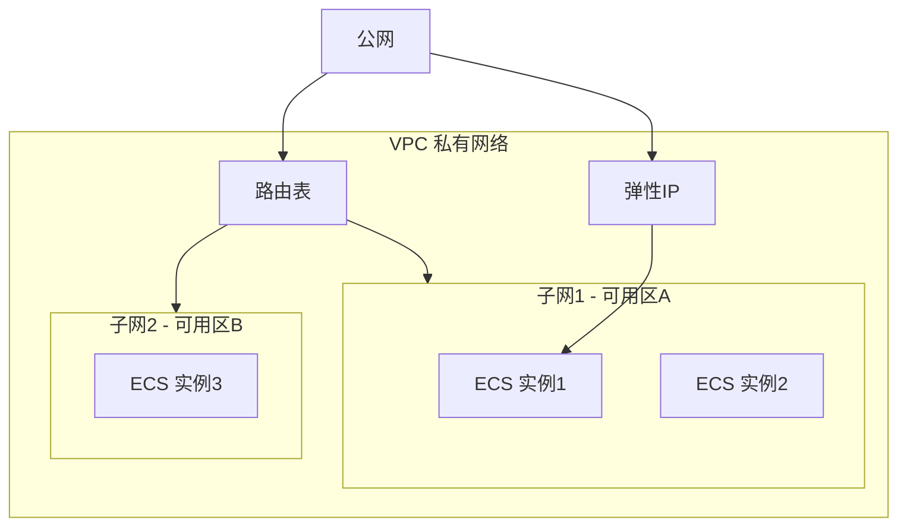
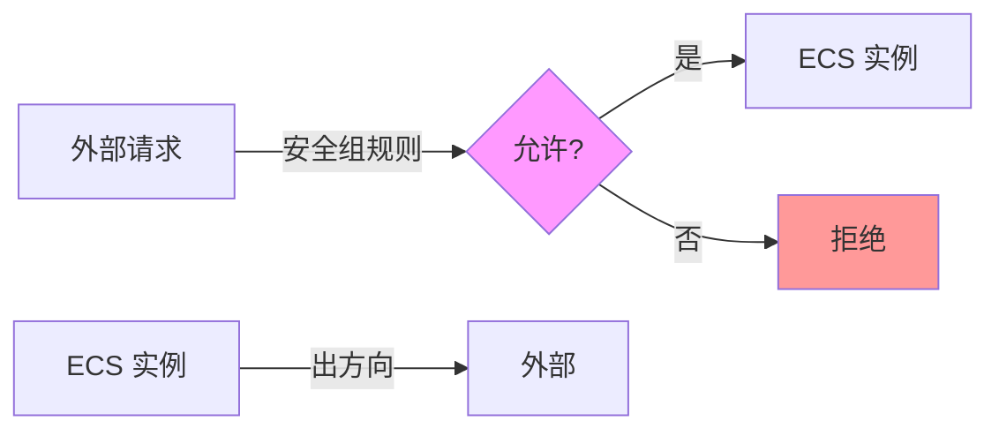
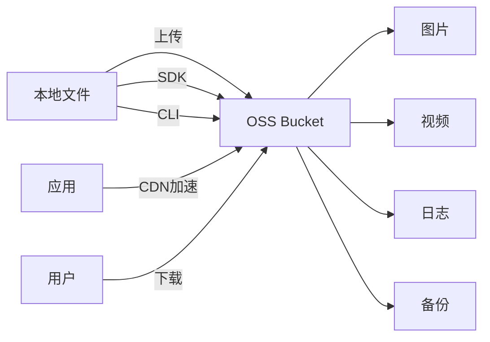
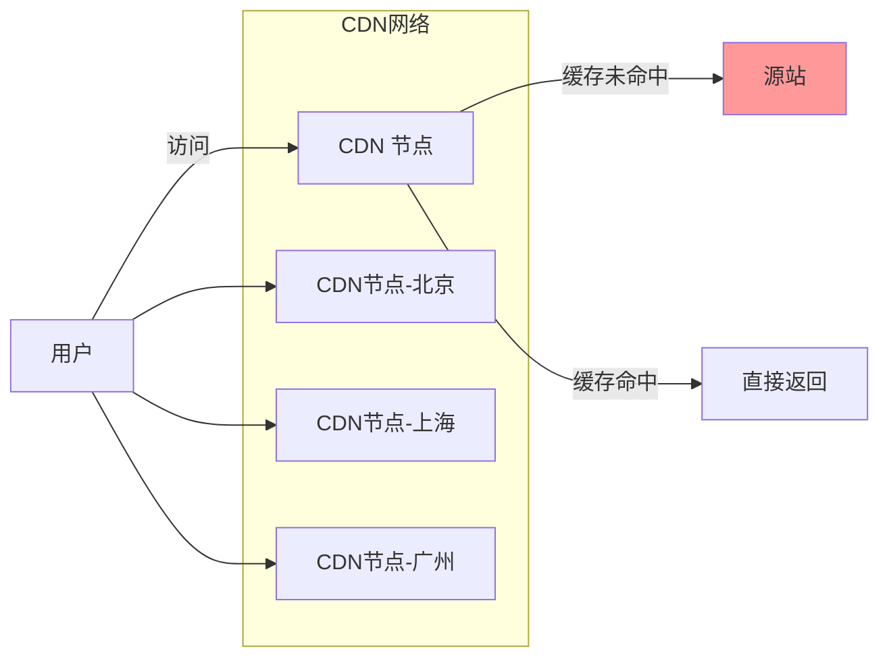
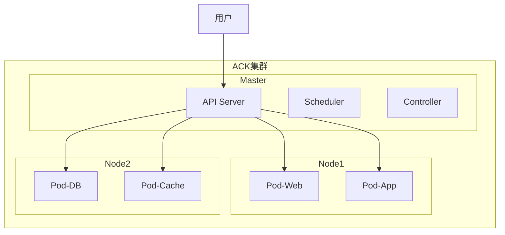

+++
title = "第65章：阿里云"
weight = 650
date = "2026-03-24T13:18:28+08:00"
type = "docs"
description = ""
isCJKLanguage = true
draft = false
+++


# 第六十五章：阿里云

## 65.1 ECS 实例

### 什么是 ECS？

ECS（Elastic Compute Service）是阿里云的弹性计算服务，说白了就是"云服务器"——你不用买服务器，直接在云上租一台来用。

> 💡 **类比理解**：
> - 传统服务器 = 买房：首付贵、装修累、坏了还得自己修
> - 云服务器 ECS = 租房：拎包入住、想换就换、房东管维修
> 
> 选择哪个？看你是想"安家落户"还是"灵活漂泊"！



### ECS 的优势

| 特性 | 说明 | 类比 |
|------|------|------|
| 即开即用 | 几分钟就能用 | 扫码即骑的共享单车 |
| 弹性伸缩 | 想大就大，想小就小 | 橡皮筋 |
| 按量付费 | 用多少付多少 | 吃多少打多少饭 |
| 高可用 | 多副本自动备份 | 狡兔三窟 |
| 免维护 | 不用管硬件 | 住酒店不用修电梯 |

### 创建 ECS 实例

```bash
# 1. 登录阿里云控制台
# https://www.aliyun.com

# 2. 选择地域和可用区
# 地域：华北2（北京）、华东1（杭州）、华南1（深圳）等

# 3. 选择实例规格
# 入门：ecs.t5-lc1m2.small（1核1G）
# 进阶：ecs.c5.large（2核4G）
# 高性能：ecs.g5.xlarge（4核16G）

# 4. 选择操作系统
# 公共镜像：CentOS、Ubuntu、Windows
# 自定义镜像：从快照创建
```

### ECS 实例类型

| 类型 | 特点 | 适用场景 |
|------|------|---------|
| 共享型 | 性价比高 | 个人网站、测试环境 |
| 计算型 | 高 CPU 性能 | Web 服务器 |
| 内存型 | 大内存 | 数据库、缓存 |
| GPU 型 | 图形处理 | AI、深度学习 |
| 弹性裸金属 | 物理机性能 | 核心数据库 |

### 连接 ECS 实例

```bash
# Linux 实例 - 使用 SSH
ssh root@你的公网IP

# 首次连接会要求输入密码（在控制台重置密码后）
# 如果使用密钥对
ssh -i ~/.ssh/your_key.pem root@你的公网IP

# Windows 实例 - 使用 MSTSC 或 PowerShell
# PowerShell 连接
ssh administrator@你的公网IP

# 使用阿里云 CLI 管理实例
# 安装阿里云 CLI
# 注意：下载地址可能更新，建议访问官方文档获取最新地址：https://help.aliyun.com/document_detail/121541.html
curl -sL https://aliyuncli.alibaba.com/download/aliyun-cli-linux-latest-amd64.tgz | tar -xz -C /usr/local/bin/

# 或者使用官方推荐方式（更稳定）
# curl -fsSL https://raw.githubusercontent.com/aliyun/aliyun-cli/master/install.sh | bash

# 配置凭证（交互式）
aliyun configure
# 会提示输入 AccessKey ID、AccessKey Secret、region 等信息

# 或者直接指定
aliyun configure set \
    --access-key-id 你的AccessKeyID \
    --access-key-secret 你的AccessKeySecret \
    --region cn-hangzhou

# 查看实例
aliyun ecs DescribeInstances
```

### ECS 日常管理

```bash
# 启动实例
aliyun ecs StartInstance --InstanceId i-xxxxxxxxx

# 停止实例
aliyun ecs StopInstance --InstanceId i-xxxxxxxxx

# 重启实例
aliyun ecs RebootInstance --InstanceId i-xxxxxxxxx

# 更换操作系统
aliyun ecs ReplaceSystemDisk --InstanceId i-xxxxxxxxx --ImageId ubuntu_22_04

# 调整实例规格
aliyun ecs ModifyInstanceSpec --InstanceId i-xxxxxxxxx --InstanceType ecs.c5.xlarge

# 创建快照
aliyun ecs CreateSnapshot --DiskId d-xxxxxxxxx --SnapshotName "backup-$(date +%Y%m%d)"
```

## 65.2 VPC 网络

### 什么是 VPC？

VPC（Virtual Private Cloud）是阿里云的私有网络，相当于在云上给你划了一块"私人领地"，你可以自己定义 IP 地址范围、创建子网、配置路由表。



### VPC 的核心概念

| 概念 | 说明 |
|------|------|
| VPC | 私有网络，逻辑隔离的网络空间 |
| vSwitch | 虚拟交换机，连接 VPC 内的资源 |
| 路由表 | 控制网络流量的走向 |
| 安全组 | 实例级别的防火墙 |
| 网络ACL | 子网级别的防火墙 |

### 创建 VPC

```bash
# 1. 创建 VPC
aliyun vpc CreateVpc --CidrBlock 10.0.0.0/8 --VpcName my-vpc

# 2. 创建交换机（子网）
aliyun vpc CreateVSwitch --VpcId vpc-xxxxxxxxx --CidrBlock 10.0.1.0/24 --ZoneId cn-hangzhou-f --VSwitchName my-subnet

# 3. 创建路由表并添加路由
aliyun vpc CreateRouteTable --VpcId vpc-xxxxxxxxx --RouteTableName my-route-table

# 4. 添加路由条目
aliyun vpc CreateRouteEntry --RouteTableId vtb-xxxxxxxxx --DestinationCidrBlock 0.0.0.0/0 --NextHopType Internet
```

### VPC 网络规划

```bash
# 常用 VPC 网段规划
# 小型项目：10.0.0.0/16
# 中型项目：172.16.0.0/12
# 大型项目：192.168.0.0/16

# 子网规划示例
VPC: 10.0.0.0/8

# Web 层
子网: 10.0.1.0/24  (可用区A)
子网: 10.0.2.0/24  (可用区B)

# 应用层
子网: 10.0.11.0/24 (可用区A)
子网: 10.0.12.0/24 (可用区B)

# 数据层
子网: 10.0.21.0/24 (可用区A)
子网: 10.0.22.0/24 (可用区B)
```

### 经典网络 vs VPC

| 特性 | 经典网络 | VPC |
|------|---------|-----|
| 网络隔离 | 共享网络 | 完全隔离 |
| IP 地址 | 自动分配 | 可自定义 |
| 安全控制 | 安全组 | 安全组 + 网络ACL |
| 灵活扩展 | 一般 | 强 |
| 费用 | 较低 | 略高 |

## 65.3 安全组

### 安全组是什么？

安全组是 ECS 实例的"门卫"，决定哪些流量能进、哪些流量能出。你可以把它理解为云服务器自带的功能强大的防火墙。



### 安全组规则

```bash
# 授权对象格式
# 单个 IP：192.168.1.1/32
# IP 段：10.0.0.0/8
# 安全组：sg-xxxxxxxxx（引用其他安全组）

# 入方向规则示例
# 允许 SSH 访问（Linux）
aliyun ecs AuthorizeSecurityGroup \
    --RegionId cn-hangzhou \
    --SecurityGroupId sg-xxxxxxxxx \
    --IpProtocol tcp \
    --PortRange 22/22 \
    --SourceCidrIp 0.0.0.0/0 \
    --Policy accept

# 允许 RDP 访问（Windows）
aliyun ecs AuthorizeSecurityGroup \
    --RegionId cn-hangzhou \
    --SecurityGroupId sg-xxxxxxxxx \
    --IpProtocol tcp \
    --PortRange 3389/3389 \
    --SourceCidrIp 0.0.0.0/0

# 允许 HTTP/HTTPS
aliyun ecs AuthorizeSecurityGroup \
    --RegionId cn-hangzhou \
    --SecurityGroupId sg-xxxxxxxxx \
    --IpProtocol tcp \
    --PortRange 80/80,443/443 \
    --SourceCidrIp 0.0.0.0/0

# 允许 MySQL 远程访问（限制 IP）
aliyun ecs AuthorizeSecurityGroup \
    --RegionId cn-hangzhou \
    --SecurityGroupId sg-xxxxxxxxx \
    --IpProtocol tcp \
    --PortRange 3306/3306 \
    --SourceCidrIp 10.0.1.0/24

# 拒绝特定 IP
aliyun ecs AuthorizeSecurityGroup \
    --RegionId cn-hangzhou \
    --SecurityGroupId sg-xxxxxxxxx \
    --IpProtocol tcp \
    --PortRange 80/80 \
    --SourceCidrIp 1.2.3.4/32 \
    --Policy drop
```

### 出方向规则

```bash
# 允许所有出站
aliyun ecs AuthorizeSecurityGroup \
    --RegionId cn-hangzhou \
    --SecurityGroupId sg-xxxxxxxxx \
    --IpProtocol all \
    --PortRange -1/-1 \
    --DestCidrIp 0.0.0.0/0

# 限制只访问特定地址
aliyun ecs AuthorizeSecurityGroup \
    --RegionId cn-hangzhou \
    --SecurityGroupId sg-xxxxxxxxx \
    --IpProtocol tcp \
    --PortRange 80/80,443/443 \
    --DestCidrIp 10.0.0.0/8

# 禁止访问特定端口（如禁止下载）
aliyun ecs AuthorizeSecurityGroup \
    --RegionId cn-hangzhou \
    --SecurityGroupId sg-xxxxxxxxx \
    --IpProtocol tcp \
    --PortRange 445/445 \
    --DestCidrIp 0.0.0.0/0 \
    --Policy drop
```

### 安全组最佳实践

```bash
# 1. 最小权限原则
# ✓ 只开放需要的端口
# ✗ 0.0.0.0/0 开放所有端口

# 2. 分类管理
# 安全组1：Web 服务器（80, 443）
# 安全组2：数据库服务器（3306，仅允许应用服务器访问）
# 安全组3：Redis 服务器（6379，仅允许应用服务器访问）

# 3. 使用标签管理
aliyun ecs AddTags --ResourceType securitygroup \
    --ResourceId sg-xxxxxxxxx \
    --Tag.1.Key Env --Tag.1.Value Production

# 4. 定期审计
# 查看安全组规则
aliyun ecs DescribeSecurityGroupPolicy --SecurityGroupId sg-xxxxxxxxx --RegionId cn-hangzhou
```

### 常用端口参考

| 端口 | 服务 | 说明 |
|------|------|------|
| 22 | SSH | Linux 远程管理 |
| 3389 | RDP | Windows 远程桌面 |
| 80 | HTTP | Web 服务 |
| 443 | HTTPS | 安全 Web |
| 3306 | MySQL | 数据库 |
| 5432 | PostgreSQL | 数据库 |
| 6379 | Redis | 缓存 |
| 27017 | MongoDB | 数据库 |
| 8080 | Tomcat | Java Web |
| 9200 | Elasticsearch | 搜索引擎 |

## 65.4 OSS

### 什么是 OSS？

OSS（Object Storage Service）是阿里云的对象存储服务，专门存储"文件"——图片、视频、日志、静态资源，统统可以往里扔。



### OSS vs 自建存储

| 对比项 | OSS | 自建存储 |
|--------|-----|---------|
| 成本 | 按量付费 | 买服务器、带宽、电费 |
| 可靠性 | 99.999999999% | 看硬盘心情 |
| 扩展性 | 无限 | 受限于服务器容量 |
| 全球加速 | 内置 CDN | 需额外配置 |
| 维护 | 免维护 | 要 RAID、要备份 |

### 使用 OSS

```bash
# 1. 创建 Bucket（存储桶）
aliyun oss mb oss://my-bucket-name --region cn-hangzhou

# 2. 上传文件
aliyun oss cp /path/to/file.txt oss://my-bucket-name/

# 3. 下载文件
aliyun oss cp oss://my-bucket-name/file.txt /path/to/

# 4. 列出文件
aliyun oss ls oss://my-bucket-name/

# 5. 删除文件
aliyun oss rm oss://my-bucket-name/file.txt

# 6. 设置存储类型
# 标准存储（频繁访问）
# 低频访问存储（30天访问一次）
# 归档存储（90天访问一次，便宜）
aliyun oss set-class oss://my-bucket-name/file.txt --class IA

# 7. 设置生命周期
aliyun oss lifecycle set oss://my-bucket-name \
    --expiry-days 30 \
    --file-suffix .log
```

### OSS SDK 使用

```bash
# 安装 Python SDK
pip install oss2

# Python 上传示例
cat > upload.py << 'EOF'
import oss2

# 初始化
auth = oss2.Auth('你的AccessKeyId', '你的AccessKeySecret')
bucket = oss2.Bucket(auth, 'oss-cn-hangzhou.aliyuncs.com', 'my-bucket')

# 上传文件
bucket.put_object('hello.txt', 'Hello OSS!')

# 上传图片
with open('image.jpg', 'rb') as f:
    bucket.put_object('images/image.jpg', f)

# 生成下载链接（带签名，临时访问）
url = bucket.sign_url('hello.txt', expires=3600)
print(f"下载链接：{url}")

# 下载文件
bucket.get_object_to_file('hello.txt', 'downloaded.txt')
EOF

python3 upload.py
```

### OSS 权限控制

```bash
# 1. 设置 Bucket 访问权限
# private：私有（需要签名）
# public-read：公共读
# public-read-write：公共读写
aliyun oss set-acl oss://my-bucket --acl public-read

# 2. RAM 授权（细粒度控制）
# 创建 RAM 用户 → 授予 OSS 权限 → 使用 RAM 凭证访问

# 3. Bucket Policy（JSON 策略）
aliyun oss policy oss://my-bucket << 'EOF'
{
  "Statement": [
    {
      "Effect": "Allow",
      "Action": ["oss:GetObject"],
      "Resource": ["acs:oss:*:*:my-bucket/*"],
      "Condition": {
        "IpAddress": {
          "acs:SourceIp": ["10.0.0.0/8"]
        }
      }
    }
  ]
}
EOF
```

## 65.5 CDN

### 什么是 CDN？

CDN（Content Delivery Network）是内容分发网络，让用户从最近的节点获取资源，加速网站访问。



### CDN 工作原理

| 流程 | 说明 |
|------|------|
| 1. 用户请求 | 用户访问 cdn.example.com |
| 2. DNS 解析 | 调度到最近节点 |
| 3. 节点检查 | 看缓存有没有 |
| 4. 缓存命中 | 直接返回（快！） |
| 5. 缓存未命中 | 回源获取（慢一次） |
| 6. 返回内容 | 并缓存到节点 |

### 配置 CDN

```bash
# 1. 添加加速域名
aliyun cdn AddCdnDomain \
    --DomainName cdn.example.com \
    --SourceType oss \
    --SourceDomain my-bucket.oss-cn-hangzhou.aliyuncs.com \
    --CdnType web

# 2. 配置缓存规则
aliyun cdn SetCacheConfig \
    --DomainName cdn.example.com \
    --CacheType 0 \
    --CacheContent /static/*.js,/static/*.css \
    --TTL 3600

# 3. 配置 HTTP -> HTTPS 跳转
aliyun cdn SetDomainServerCertificate \
    --DomainName cdn.example.com \
    --ServerCertificate your-certificate \
    --PrivateKey your-private-key \
    --CertType upload

# 4. 刷新缓存
aliyun cdn PushObjectCache \
    --ObjectPath cdn.example.com/static/* \
    --ObjectType File
```

### CDN 优化配置

```bash
# 1. 开启 Gzip 压缩
aliyun cdn SetReqHeaderConfig \
    --DomainName cdn.example.com \
    --Key "Accept-Encoding" \
    --Value "gzip, deflate, br"

# 2. 配置防盗链（Referer 白名单）
aliyun cdn SetRefererConfig \
    --DomainName cdn.example.com \
    --RefererType blacklist \
    --Referers "https://example.com,https://www.example.com"

# 3. 设置 IP 黑名单
aliyun cdn SetIpBlackListConfig \
    --DomainName cdn.example.com \
    --IpList "1.2.3.4,5.6.7.8"

# 4. 配置访问日志分析
aliyun cdn DescribeCdnDomainLogs \
    --DomainName cdn.example.com \
    --LogDay 2024-01-15
```

## 65.6 ACK

### 什么是 ACK？

ACK（Alibaba Cloud Container Service for Kubernetes）是阿里云的 Kubernetes 服务，让你不用自己搭 K8s 集群，直接用现成的。



### ACK vs 自建 K8s

| 对比 | ACK | 自建 K8s |
|------|-----|---------|
| 运维 | 托管 Master | 全部自己来 |
| 成本 | 略高 | 机器成本 |
| 可用性 | 多可用区容灾 | 看技术 |
| 升级 | 一键升级 | 手动升级 |
| 网络 | Terway/VPC CNI | 自己配 |

### 使用 ACK

```bash
# 1. 安装 kubectl
curl -LO "https://dl.k8s.io/release/$(curl -L -s https://dl.k8s.io/release/stable.txt)/bin/linux/amd64/kubectl"
chmod +x kubectl
sudo mv kubectl /usr/local/bin/

# 2. 配置集群凭证
aliyun cs GET /clusters/集群ID/config > ~/.kube/config

# 3. 验证连接
kubectl get nodes

# 4. 部署应用
kubectl create deployment web --image=nginx:latest --replicas=3

# 5. 暴露服务
kubectl expose deployment web --port=80 --type=LoadBalancer

# 6. 查看服务
kubectl get svc
```

### ACK 常用操作

```bash
# 创建集群
aliyun cs POST /clusters \
    --region cn-hangzhou \
    --name my-cluster \
    --vpcid vpc-xxxxxxxxx \
    --vswitchid vsw-xxxxxxxxx

# 扩容节点池
aliyun cs POST /clusters/集群ID/scalinggroups \
    --count 5

# 查看集群信息
aliyun cs GET /clusters/集群ID

# 升级集群
aliyun cs POST /clusters/集群ID/upgrade \
    --component kubernetes

# 删除集群
aliyun cs DELETE /clusters/集群ID
```

### ACK 网络插件

```bash
# Terway（阿里自研，高性能）
# 特点：Pod 直接获取 VPC IP，性能好
# 配置：
# - Terway.trunk Network：支持 IPVLAN

# Flannel（经典方案）
# 特点：VXLAN 封装，简单易用
# 配置：
# - Network：Pod CIDR
# - Service CIDR：Service 网段
```

### ACK 存储插件

```bash
# 安装 CSI 组件
aliyun cs POST /clusters/集群ID/components \
    --name csi-plugin \
    --version latest

# 创建 PV
cat > pv.yaml << 'EOF'
apiVersion: v1
kind: PersistentVolume
metadata:
  name: my-pv
spec:
  capacity:
    storage: 20Gi
  accessModes:
    - ReadWriteOnce
  storageClassName: alicloud-disk-topo
  flexVolume:
    driver: alicloud/disk
    fsType: ext4
    options:
      volumeId: d-xxxxxxxxx
EOF

kubectl apply -f pv.yaml
```

## 本章小结

本章我们学习了阿里云的核心服务：

| 服务 | 说明 |
|------|------|
| ECS | 云服务器，弹性计算 |
| VPC | 私有网络，网络隔离 |
| 安全组 | 实例级防火墙 |
| OSS | 对象存储，海量文件 |
| CDN | 内容分发网络，加速访问 |
| ACK | 容器服务 Kubernetes |

阿里云就像一个"云端大礼包"，从计算到网络到存储，应有尽有！

---

> 💡 **温馨提示**：
> 阿里云产品众多，但核心思想都是"按需使用，按量付费"。善用阿里云的免费额度和新用户优惠，小成本玩转大云服务！

---

**第六十五章：阿里云 — 完结！** 🎉

下一章我们将学习"AWS"，掌握亚马逊云服务的核心服务。敬请期待！ 🚀
