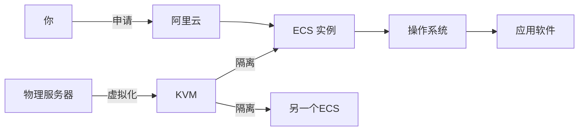
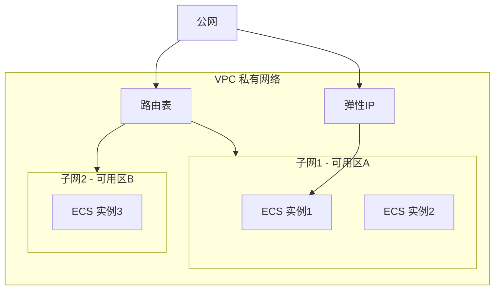
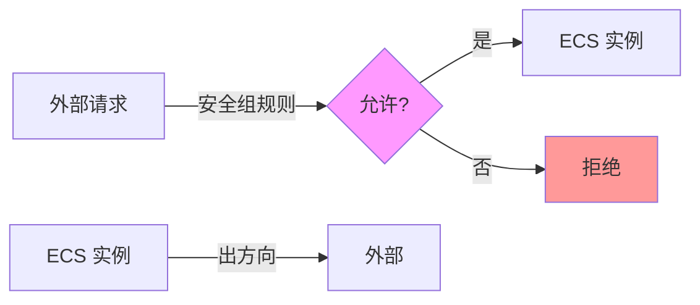
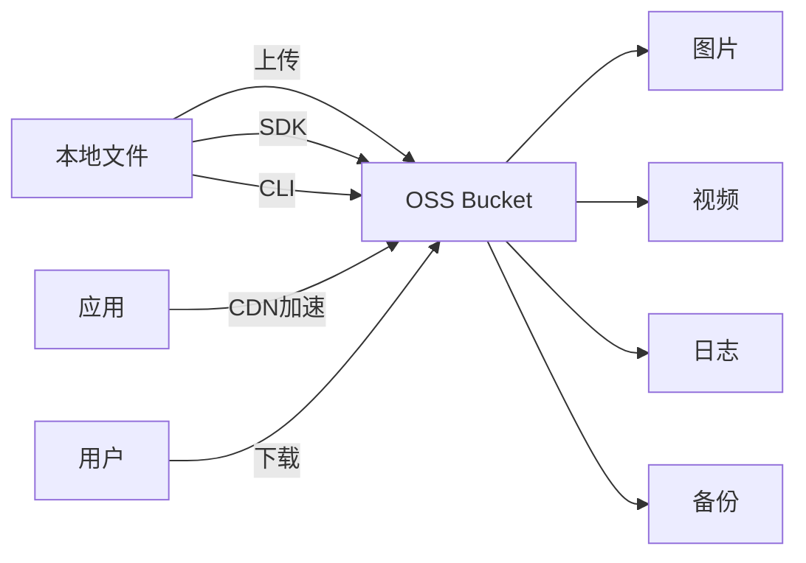
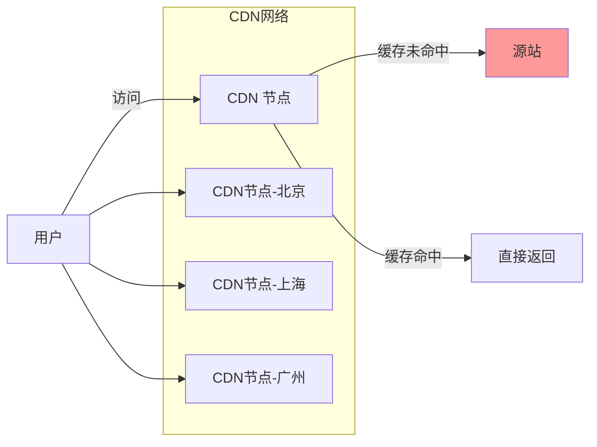
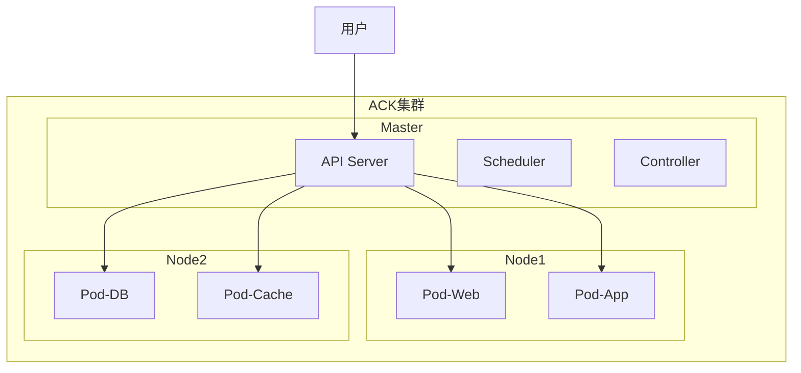

+++
title = "第65章：阿里云"
weight = 650
date = "2026-03-24T13:18:28+08:00"
type = "docs"
description = ""
isCJKLanguage = true
draft = false
+++


# 第六十五章：阿里云

## 65.1 ECS 实例

### 什么是 ECS？

ECS（Elastic Compute Service）是阿里云的弹性计算服务，说白了就是"云服务器"——你不用买服务器，直接在云上租一台来用。

> 💡 **类比理解**：
> - 传统服务器 = 买房：首付贵、装修累、坏了还得自己修
> - 云服务器 ECS = 租房：拎包入住、想换就换、房东管维修
> 
> 选择哪个？看你是想"安家落户"还是"灵活漂泊"！


```mermaid
graph LR
    A[你] -->|申请| B[阿里云]
    B --> C[ECS 实例]
    C --> D[操作系统]
    D --> E[应用软件]
    
    F[物理服务器] -->|虚拟化| G[KVM]
    G -->|隔离| C
    G -->|隔离| H[另一个ECS]
```

### ECS 的优势

| 特性 | 说明 | 类比 |
|------|------|------|
| 即开即用 | 几分钟就能用 | 扫码即骑的共享单车 |
| 弹性伸缩 | 想大就大，想小就小 | 橡皮筋 |
| 按量付费 | 用多少付多少 | 吃多少打多少饭 |
| 高可用 | 多副本自动备份 | 狡兔三窟 |
| 免维护 | 不用管硬件 | 住酒店不用修电梯 |

### 创建 ECS 实例

```bash
# 1. 登录阿里云控制台
# https://www.aliyun.com

# 2. 选择地域和可用区
# 地域：华北2（北京）、华东1（杭州）、华南1（深圳）等

# 3. 选择实例规格
# 入门：ecs.e-c1m2.large（2核4G，新一代通用型，命名规则是 c=CPU, m=内存倍数）
# 进阶：ecs.c7.large（2核4G，计算型）
# 高性能：ecs.g7.xlarge（4核16G，通用型）
# 说明：ecs.t5 是早期的突发性能实例（CPU 有积分限制，积分耗尽会被限速），
# 适合个人测试，不建议用在正式业务上

# 4. 选择操作系统
# 公共镜像：Alibaba Cloud Linux、Ubuntu、Windows Server 等
# ⚠️ 注意：CentOS 7 已于 2024 年 6 月停止维护，CentOS 8 更早已停止；
#    新购实例请选择 **Alibaba Cloud Linux 3**（兼容 RHEL/CentOS 生态，官方长期维护）
#    或 Ubuntu LTS，不要再用 CentOS 图标建新机器
# 自定义镜像：从快照创建
```

### ECS 实例类型

| 类型 | 特点 | 适用场景 |
|------|------|---------|
| 突发性能型（t 系列） | 便宜，但 CPU 有积分限制，积分用完会被限速 | 个人网站、测试环境 |
| 通用型（g 系列） | CPU 与内存较均衡 | Web 应用、普通后端服务 |
| 计算型（c 系列） | CPU 占比高 | 高并发 Web、计算密集任务 |
| 内存型（r 系列） | 内存占比高 | 数据库、缓存、大数据处理 |
| GPU 型（gn/ga 系列） | 带 GPU | AI 训练/推理、图形渲染 |
| 弹性裸金属（ebm 系列） | 物理机性能 + 云盘弹性 | 核心数据库、对虚拟化开销敏感的场景 |

### 连接 ECS 实例

```bash
# Linux 实例 - 使用 SSH
ssh root@你的公网IP

# 登录用户名取决于所选镜像：阿里云自有的 Alibaba Cloud Linux / CentOS 类镜像默认是 root；
# 部分第三方镜像（如某些 Ubuntu/Debian 镜像）默认用户可能是 ubuntu 等，请看镜像说明

# 首次连接会要求输入密码（在控制台"重置实例密码"并重启后生效）
# 如果使用密钥对（更推荐，安全性高于密码）
chmod 600 ~/.ssh/your_key.pem        # 私钥权限过宽时 SSH 会直接拒绝使用
ssh -i ~/.ssh/your_key.pem root@你的公网IP

# Windows 实例 - 使用远程桌面（RDP）
# 在本地 Windows 上运行 mstsc，地址填 公网IP:3389，用户名 Administrator，
# 密码在控制台"重置实例密码"时设置（注意 IP 后要带 :3389）
# 如果用 macOS/Linux，可用 Remmina 或 Microsoft Remote Desktop 客户端连接
# 只有手动在 Windows 里装了 OpenSSH 服务之后，才谈得上用 ssh 连接

# 【安全提醒】不要在公网直接暴露 3389 和 22
# 更稳妥的做法是：安全组只放行你自己的办公 IP，或先连 VPN / 用堡垒机（跳板机）再访问

# 使用阿里云 CLI 管理实例
# 安装阿里云 CLI
# 注意：下载地址可能更新，建议访问官方文档获取最新地址：https://help.aliyun.com/document_detail/121541.html
curl -sL https://aliyuncli.alibaba.com/download/aliyun-cli-linux-latest-amd64.tgz | tar -xz -C /usr/local/bin/

# 或者使用官方推荐方式（更稳定）
# curl -fsSL https://raw.githubusercontent.com/aliyun/aliyun-cli/master/install.sh | bash

# 配置凭证（交互式）
aliyun configure
# 会提示输入 AccessKey ID、AccessKey Secret、region 等信息

# 或者直接指定
aliyun configure set \
    --access-key-id 你的AccessKeyID \
    --access-key-secret 你的AccessKeySecret \
    --region cn-hangzhou

# 查看实例
aliyun ecs DescribeInstances
```

> **凭证安全是云端第一课**：`aliyun configure` 里配置的 AccessKey 拥有账号权限，
> 一旦泄露等于把整个云账号交出去（历史上绝大多数"云上被挖矿"事件都是 AccessKey 泄露导致的）。
>
> - **不要用主账号的 AccessKey**。正确做法是创建 **RAM 子账号**，只授予它需要的权限。
> - 能用临时凭证（STS）就别用长期 AccessKey，例如给 ECS 绑定 RAM 角色、
>   在 CI/CD 里用 OIDC 换取临时凭证。
> - 配置文件 `~/.aliyun/config.json` 权限设为 `600`，不要提交进 Git。
> - 开启**操作审计（ActionTrail）**，万一泄露还能查到被用来做了什么。
>
> 多账号/多环境时可以配置多个 profile，避免互相干扰：
>
> ```bash
> aliyun configure --profile prod      # 交互式创建一个名为 prod 的凭证
> aliyun ecs DescribeInstances --profile prod
> ```

### 计费方式与省钱思路

| 计费方式 | 特点 | 适用场景 |
|----------|------|----------|
| 包年包月 | 一次付费，单价最低，但不能随时释放 | 长期稳定的业务 |
| 按量付费 | 按秒/小时计费，随时释放 | 临时测试、流量波动大的业务 |
| 抢占式实例 | 价格很低（可低至按量的 10%），但可能被随时回收 | 可中断的批处理、大数据计算、CI 构建 |
| 节省计划 / 预留实例券 | 承诺用量换折扣 | 用量稳定的长期业务 |

> **几个常见的"账单刺客"**：忘记释放的按量实例和云盘（尤其是额外挂载的数据盘）、
> 没有配自动快照策略导致快照无限累积、公网带宽按流量计费却在跑大流量下载、
> 对象存储里的版本控制把每个旧版本都留着。
> 建议开通**费用预警**（预算告警），并养成"用完就释放 + 定期盘点"的习惯。

### 快照与自动快照策略

```bash
# 手动创建快照（注意：快照是按容量计费的，用久了记得清理）
aliyun ecs CreateSnapshot --DiskId d-xxxxxxxxx --SnapshotName "manual-backup"

# 查看快照
aliyun ecs DescribeSnapshots --RegionId cn-hangzhou

# 更推荐：创建"自动快照策略"，绑定到云盘，每天定时备份并自动滚动删除
aliyun ecs CreateAutoSnapshotPolicy \
    --regionId cn-hangzhou \
    --autoSnapshotPolicyName daily-backup \
    --repeatWeekdays '["1","2","3","4","5","6","7"]' \
    --timePoints '["3"]' \
    --retentionDays 7
```

> **快照的正确用法**：它是"云盘在某个时间点的拷贝"，可以用来做**数据恢复**，
> 也可以基于它**创建自定义镜像**批量部署。
> 但要记住两点：快照**默认存在同地域**，地域级故障时不一定可用；
> 而且**没有开启"快照一致性组"时，多块盘之间的一致性无法保证**。
> 真正的容灾还需要把备份复制到**其他地域**（快照跨地域复制）。

### ECS 日常管理

```bash
# 启动实例
aliyun ecs StartInstance --InstanceId i-xxxxxxxxx

# 停止实例
aliyun ecs StopInstance --InstanceId i-xxxxxxxxx

# 重启实例
aliyun ecs RebootInstance --InstanceId i-xxxxxxxxx

# 更换操作系统
aliyun ecs ReplaceSystemDisk --InstanceId i-xxxxxxxxx --ImageId ubuntu_22_04

# 调整实例规格
aliyun ecs ModifyInstanceSpec --InstanceId i-xxxxxxxxx --InstanceType ecs.c5.xlarge

# 创建快照
aliyun ecs CreateSnapshot --DiskId d-xxxxxxxxx --SnapshotName "backup-$(date +%Y%m%d)"
```

## 65.2 VPC 网络

### 什么是 VPC？

VPC（Virtual Private Cloud）是阿里云的私有网络，相当于在云上给你划了一块"私人领地"，你可以自己定义 IP 地址范围、创建子网、配置路由表。


```mermaid
graph TB
    subgraph VPC[ VPC 私有网络 ]
        subgraph 子网1[子网1 - 可用区A]
            S1[ECS 实例1]
            S2[ECS 实例2]
        end
        
        subgraph 子网2[子网2 - 可用区B]
            S3[ECS 实例3]
        end
        
        R[路由表] --> 子网1
        R --> 子网2
        
        E[弹性IP] --> S1
    end
    
    I[公网] --> R
    I --> E
```

### VPC 的核心概念

| 概念 | 说明 |
|------|------|
| VPC | 私有网络，逻辑隔离的网络空间 |
| vSwitch | 虚拟交换机，连接 VPC 内的资源 |
| 路由表 | 控制网络流量的走向 |
| 安全组 | 实例级别的防火墙 |
| 网络ACL | 子网级别的防火墙 |

### 创建 VPC

```bash
# 1. 创建 VPC
aliyun vpc CreateVpc --CidrBlock 10.0.0.0/8 --VpcName my-vpc

# 2. 创建交换机（子网）
aliyun vpc CreateVSwitch --VpcId vpc-xxxxxxxxx --CidrBlock 10.0.1.0/24 --ZoneId cn-hangzhou-f --VSwitchName my-subnet

# 3. 创建路由表并添加路由
aliyun vpc CreateRouteTable --VpcId vpc-xxxxxxxxx --RouteTableName my-route-table

# 4. 添加路由条目
aliyun vpc CreateRouteEntry --RouteTableId vtb-xxxxxxxxx --DestinationCidrBlock 0.0.0.0/0 --NextHopType Internet
```

### VPC 网络规划

```bash
# 常用 VPC 网段规划
# 小型项目：10.0.0.0/16
# 中型项目：172.16.0.0/12
# 大型项目：192.168.0.0/16

# 子网规划示例
VPC: 10.0.0.0/8

# Web 层
子网: 10.0.1.0/24  (可用区A)
子网: 10.0.2.0/24  (可用区B)

# 应用层
子网: 10.0.11.0/24 (可用区A)
子网: 10.0.12.0/24 (可用区B)

# 数据层
子网: 10.0.21.0/24 (可用区A)
子网: 10.0.22.0/24 (可用区B)
```

### 经典网络 vs VPC

| 特性 | 经典网络 | VPC |
|------|---------|-----|
| 网络隔离 | 共享网络，隔离性弱 | 各 VPC 之间完全隔离 |
| IP 地址 | 由阿里云统一分配 | 可自定义网段与子网划分 |
| 安全控制 | 仅安全组 | 安全组 + 网络 ACL（子网级） |
| 灵活扩展 | 一般 | 强，可按业务划分多个 VPC |
| 费用 | 免费 | 免费（VPC 本身不收费） |

> **经典网络已经淘汰**：阿里云早在 2017 年前后就不再支持新建经典网络实例，
> 目前只保留了存量实例的迁移能力。所以学习时**只需要掌握 VPC**，
> 上面这张表的意义在于"看懂老资料"和"理解为什么要迁移到 VPC"。
>
> **VPC 网段规划的三条经验**
>
> 1. **不要用 `10.0.0.0/8` 这种超大网段**：一旦以后要和公司 IDC 打通专线（VBR/高速通道），
>    网段冲突会非常难处理，建议按业务用 `/16` 甚至更小。
> 2. **预留扩容空间**：子网掩码留够（比如 `/24` 够 250 台，`/22` 够 1000 台），
>    以后加机器不用重新规划。
> 3. **不同环境用不同网段**：生产、预发、测试各用一段，
>    避免"测试环境误连生产数据库"这类事故。

## 65.3 安全组

### 安全组是什么？

安全组是 ECS 实例的"门卫"，决定哪些流量能进、哪些流量能出。你可以把它理解为云服务器自带的功能强大的防火墙。


```mermaid
graph LR
    A[外部请求] -->|安全组规则| B{允许?}
    B -->|是| C[ECS 实例]
    B -->|否| D[拒绝]
    
    E[ECS 实例] -->|出方向| F[外部]
    
    style B fill:#f9f
    style D fill:#f99
```

### 安全组规则

```bash
# 授权对象格式
# 单个 IP：192.168.1.1/32
# IP 段：10.0.0.0/8
# 安全组：sg-xxxxxxxxx（引用其他安全组）

# 入方向规则示例
# 允许 SSH 访问（Linux）
aliyun ecs AuthorizeSecurityGroup \
    --RegionId cn-hangzhou \
    --SecurityGroupId sg-xxxxxxxxx \
    --IpProtocol tcp \
    --PortRange 22/22 \
    --SourceCidrIp 0.0.0.0/0 \
    --Policy accept

# 允许 RDP 访问（Windows）
aliyun ecs AuthorizeSecurityGroup \
    --RegionId cn-hangzhou \
    --SecurityGroupId sg-xxxxxxxxx \
    --IpProtocol tcp \
    --PortRange 3389/3389 \
    --SourceCidrIp 0.0.0.0/0

# 允许 HTTP/HTTPS
aliyun ecs AuthorizeSecurityGroup \
    --RegionId cn-hangzhou \
    --SecurityGroupId sg-xxxxxxxxx \
    --IpProtocol tcp \
    --PortRange 80/80 \
    --SourceCidrIp 0.0.0.0/0

# 443 要单独再授权一条（PortRange 一次只写一个范围）
aliyun ecs AuthorizeSecurityGroup \
    --RegionId cn-hangzhou \
    --SecurityGroupId sg-xxxxxxxxx \
    --IpProtocol tcp \
    --PortRange 443/443 \
    --SourceCidrIp 0.0.0.0/0

# 允许 MySQL 远程访问（限制 IP）
aliyun ecs AuthorizeSecurityGroup \
    --RegionId cn-hangzhou \
    --SecurityGroupId sg-xxxxxxxxx \
    --IpProtocol tcp \
    --PortRange 3306/3306 \
    --SourceCidrIp 10.0.1.0/24
```

> **⚠️ 阿里云安全组只有"允许"，没有"拒绝"**
>
> 这是初学者最容易误解的一点：阿里云 ECS 安全组是**白名单模型**，
> `--Policy` 只接受 `accept`（默认值），**不支持写 `drop` 去拒绝某个 IP**。
> 网上不少教程写"用 `--Policy drop` 拒绝某 IP"，照着敲会直接报错。
>
> 想要"拒绝某个 IP 访问"的效果，正确做法是**不把它加进允许列表**，
> 或者用更细的规则收窄允许来源。
> 如果确实需要"显式黑名单"，可以用 **云防火墙 / WAF**，或者在服务器上用 `iptables`/`firewalld` 实现。

### 出方向规则

```bash
# 允许所有出站
aliyun ecs AuthorizeSecurityGroup \
    --RegionId cn-hangzhou \
    --SecurityGroupId sg-xxxxxxxxx \
    --IpProtocol all \
    --PortRange -1/-1 \
    --DestCidrIp 0.0.0.0/0

# 限制出站只能访问内网的 443（一次只写一个端口范围，多个端口要拆成多条规则）
aliyun ecs AuthorizeSecurityGroup \
    --RegionId cn-hangzhou \
    --SecurityGroupId sg-xxxxxxxxx \
    --IpProtocol tcp \
    --PortRange 443/443 \
    --DestCidrIp 10.0.0.0/8
```

> **出方向默认是"全允许"**：安全组在创建时会自带一条"允许所有出站"的规则，
> 方便机器联网装包。但从安全角度，**收窄出方向很有价值**——
> 万一服务器被入侵，木马想外连 C2 服务器就会被挡住（这也是挖矿类攻击最常见的阻断手段）。
> 建议生产环境逐步把出方向限制为"只允许访问必需的地址和端口"。

> **安全组的几个关键特性**（和自建防火墙不太一样，容易踩坑）
>
> - **有状态**：只要你允许了入方向 80，那么这条连接的回包会自动放行，不用再单独配出方向规则。
> - **白名单且无优先级**：多条规则之间没有先后顺序，命中"允许"即通过。
> - **一个实例可以绑定多个安全组**，多个安全组的规则是**并集**（任何一个放行即通），
>   这既是灵活性也是风险——排查"端口为什么开着"时要检查所有绑定的安全组。
> - **改规则立即生效**，不需要重启实例，这对正在跑的故障排查很友好。

### 安全组最佳实践

```bash
# 1. 最小权限原则
# ✓ 只开放需要的端口
# ✗ 0.0.0.0/0 开放所有端口

# 2. 分类管理
# 安全组1：Web 服务器（80, 443）
# 安全组2：数据库服务器（3306，仅允许应用服务器访问）
# 安全组3：Redis 服务器（6379，仅允许应用服务器访问）

# 3. 使用标签管理
aliyun ecs AddTags --ResourceType securitygroup \
    --ResourceId sg-xxxxxxxxx \
    --Tag.1.Key Env --Tag.1.Value Production

# 4. 定期审计
# 查看安全组规则
aliyun ecs DescribeSecurityGroupAttribute --SecurityGroupId sg-xxxxxxxxx --RegionId cn-hangzhou

# 查看有哪些安全组
aliyun ecs DescribeSecurityGroups --RegionId cn-hangzhou

# 找出"对全网开放 22/3389/3306"这类高风险规则（建议定期跑一遍）
aliyun ecs DescribeSecurityGroupAttribute --SecurityGroupId sg-xxxxxxxxx \
    --RegionId cn-hangzhou | grep -E '0\.0\.0\.0/0|22/22|3389/3389|3306/3306'
```

> **顺手核对一下常用的命令名**：查询安全组详情是
> `DescribeSecurityGroupAttribute`；很多教程里写的 `DescribeSecurityGroupPolicy`
> **并不存在这个 API**，照着敲会报 "unknown command"。
> 记不准时可以用 `aliyun ecs --help` 查看当前 CLI 支持的全部动作名。

### 常用端口参考

| 端口 | 服务 | 说明 |
|------|------|------|
| 22 | SSH | Linux 远程管理 |
| 3389 | RDP | Windows 远程桌面 |
| 80 | HTTP | Web 服务 |
| 443 | HTTPS | 安全 Web |
| 3306 | MySQL | 数据库 |
| 5432 | PostgreSQL | 数据库 |
| 6379 | Redis | 缓存 |
| 27017 | MongoDB | 数据库 |
| 8080 | Tomcat | Java Web |
| 9200 | Elasticsearch | 搜索引擎 |

## 65.4 OSS

### 什么是 OSS？

OSS（Object Storage Service）是阿里云的对象存储服务，专门存储"文件"——图片、视频、日志、静态资源，统统可以往里扔。


```mermaid
graph LR
    A[本地文件] -->|上传| B[OSS Bucket]
    A -->|SDK| B
    A -->|CLI| B
    
    B --> C[图片]
    B --> D[视频]
    B --> E[日志]
    B --> F[备份]
    
    G[应用] -->|CDN加速| B
    H[用户] -->|下载| B
```

### OSS vs 自建存储

| 对比项 | OSS | 自建存储 |
|--------|-----|---------|
| 成本 | 按量付费 | 买服务器、带宽、电费 |
| 可靠性 | 数据持久性 99.9999999999%（12 个 9，靠多副本/纠删码实现） | 取决于 RAID 与备份策略 |
| 可用性 | 服务可用性 SLA 约 99.995% | 取决于架构与运维水平 |
| 扩展性 | 容量近乎无限，按量付费 | 受限于磁盘与服务器容量，扩容要停机迁移 |
| 全球加速 | 可搭配 CDN、跨区域复制 | 需自行搭建同步方案 |
| 维护 | 免运维，自带多副本 | 要自己做 RAID、巡检、备份与故障更换 |

> **别把"持久性"和"可用性"混为一谈**：持久性说的是"数据会不会丢"（12 个 9 ≈ 一万亿分之一），
> 可用性说的是"服务能不能访问"（99.995% ≈ 一年约 26 分钟不可用）。
> 更要警惕的是：**云存储再可靠，也挡不住"你自己误删"**——
> 对象存储几乎没有回收站（有版本控制才另说），
> 曾经有公司因为脚本误删了整个 Bucket 而造成严重事故。
> 因此重要数据依然要"多一层保险"：开启版本控制、配置跨区域复制、关键数据定期另存一份。

### 使用 OSS

```bash
# 1. 创建 Bucket（存储桶）
aliyun oss mb oss://my-bucket-name --region cn-hangzhou

# 2. 上传文件
aliyun oss cp /path/to/file.txt oss://my-bucket-name/

# 3. 下载文件
aliyun oss cp oss://my-bucket-name/file.txt /path/to/

# 4. 列出文件
aliyun oss ls oss://my-bucket-name/

# 5. 删除文件
aliyun oss rm oss://my-bucket-name/file.txt

# 6. 设置存储类型
# 标准存储（频繁访问）
# 低频访问存储（30天访问一次）
# 归档存储（90天访问一次，便宜）
aliyun oss set-class oss://my-bucket-name/file.txt --class IA

# 7. 设置生命周期
aliyun oss lifecycle set oss://my-bucket-name \
    --expiry-days 30 \
    --file-suffix .log
```

> **关于命令行工具的选择**：上面用的是 `aliyun oss` 子命令（由 aliyun-cli 的 OSS 插件提供）。
> 如果经常做文件上传/同步/批量管理，**更推荐官方专门的 ossutil**，
> 它的命令更接近 `rsync`/`cp` 的直觉，且支持断点续传、增量同步：
>
> ```bash
> # 配置（只需要一次，密钥同样建议用 RAM 子账号的）
> ossutil config
>
> # 上传目录（--update 只上传有变化的文件，适合做增量备份）
> ossutil cp -r /var/log/web/ oss://my-bucket/logs/ --update
>
> # 查看 Bucket 占用情况
> ossutil du oss://my-bucket/
> ```

### OSS SDK 使用

```bash
# 安装 Python SDK
pip install oss2

# Python 上传示例
cat > upload.py << 'EOF'
import oss2

# 初始化
auth = oss2.Auth('你的AccessKeyId', '你的AccessKeySecret')
bucket = oss2.Bucket(auth, 'oss-cn-hangzhou.aliyuncs.com', 'my-bucket')

# 上传文件
bucket.put_object('hello.txt', 'Hello OSS!')

# 上传图片
with open('image.jpg', 'rb') as f:
    bucket.put_object('images/image.jpg', f)

# 生成下载链接（带签名，临时访问）
url = bucket.sign_url('hello.txt', expires=3600)
print(f"下载链接：{url}")

# 下载文件
bucket.get_object_to_file('hello.txt', 'downloaded.txt')
EOF

python3 upload.py
```

> **不要把 AccessKey 写死在代码里**：上面示例为了简短直接写在代码中，
> 这在实践中是**严重的安全隐患**（密钥一旦提交到 Git 就等于泄露）。
> 正确做法是：优先使用**实例元数据 / RAM 角色**（代码里不需要任何密钥），
> 或者在运行时从环境变量、密钥管理服务（KMS/Secrets Manager）读取。
>
> 另外，给程序用的 RAM 用户应当**只授予这一个 Bucket 的读写权限**，
> 而不是 `AliyunOSSFullAccess` 这类全量权限。

### OSS 权限控制

```bash
# 1. 设置 Bucket 访问权限
# private：私有（需要签名）
# public-read：公共读
# public-read-write：公共读写
aliyun oss set-acl oss://my-bucket --acl public-read

# 2. RAM 授权（细粒度控制）
# 创建 RAM 用户 → 授予 OSS 权限 → 使用 RAM 凭证访问

# 3. Bucket Policy（JSON 策略）
aliyun oss policy oss://my-bucket << 'EOF'
{
  "Statement": [
    {
      "Effect": "Allow",
      "Action": ["oss:GetObject"],
      "Resource": ["acs:oss:*:*:my-bucket/*"],
      "Condition": {
        "IpAddress": {
          "acs:SourceIp": ["10.0.0.0/8"]
        }
      }
    }
  ]
}
EOF
```

> **⚠️ 不要随便把 Bucket 设成公共读**：这是**数据泄露事故的头号原因**。
> 一旦设为 `public-read`，任何人都能通过 URL 遍历下载其中的文件，
> 包括本不该公开的备份、日志、用户上传的身份证照片等。
> `public-read-write` 更危险（任何人都能上传和删除），**除临时测试外绝对不要使用**。
>
> 推荐的做法：
>
> 1. **保持默认的 `private`**，需要外部访问时用**带签名的临时 URL**（`sign_url`）；
> 2. 需要对外提供静态资源时，通过 **CDN 回源 + 私有 Bucket 授权**的方式暴露；
> 3. 开启 **Bucket 阻止公共访问（Block Public Access）**，从机制上防止误操作；
> 4. 程序访问一律使用 RAM 子账号 + 最小权限策略。

## 65.5 CDN

### 什么是 CDN？

CDN（Content Delivery Network）是内容分发网络，让用户从最近的节点获取资源，加速网站访问。


```mermaid
graph LR
    A[用户] -->|访问| B[CDN 节点]
    B -->|缓存未命中| C[源站]
    B -->|缓存命中| D[直接返回]
    
    subgraph CDN网络
        B
        E[CDN节点-北京]
        F[CDN节点-上海]
        G[CDN节点-广州]
    end
    
    A --> E
    A --> F
    A --> G
    
    style C fill:#f99
```

### CDN 工作原理

| 流程 | 说明 |
|------|------|
| 1. 用户请求 | 用户访问 cdn.example.com |
| 2. DNS 解析 | 调度到最近节点 |
| 3. 节点检查 | 看缓存有没有 |
| 4. 缓存命中 | 直接返回（快！） |
| 5. 缓存未命中 | 回源获取（慢一次） |
| 6. 返回内容 | 并缓存到节点 |

### 配置 CDN

```bash
# 1. 添加加速域名
aliyun cdn AddCdnDomain \
    --DomainName cdn.example.com \
    --SourceType oss \
    --SourceDomain my-bucket.oss-cn-hangzhou.aliyuncs.com \
    --CdnType web

# 2. 【关键一步，很多教程会漏】添加域名后，阿里云会分配一个 CDN 域名，
#    你需要到 DNS 服务商那里把 cdn.example.com 用 CNAME 指向它，加速才会真正生效
#    例如： cdn.example.com  CNAME  cdn.example.com.w.kunlunsl.com
#    验证是否生效：dig cdn.example.com +short   # 返回的应该是 CDN 节点的 IP
#    另外需要在 CDN 控制台完成"域名归属权验证"（一般加一条 TXT 记录）

# 3. 配置缓存规则
aliyun cdn SetCacheConfig \
    --DomainName cdn.example.com \
    --CacheType 0 \
    --CacheContent /static/*.js,/static/*.css \
    --TTL 3600

# 4. 上传证书（用于 HTTPS 加速）
aliyun cdn SetDomainServerCertificate \
    --DomainName cdn.example.com \
    --ServerCertificate your-certificate \
    --PrivateKey your-private-key \
    --CertType upload

# 5. 刷新缓存（改了静态文件之后要手动刷新，用户才能马上看到新版本）
aliyun cdn PushObjectCache \
    --ObjectPath cdn.example.com/static/* \
    --ObjectType File
```

> **缓存策略怎么定**：这是 CDN 使用中最需要想清楚的一件事，核心思路是"**变的东西不缓存，不变的东西长缓存**"。
>
> | 内容类型 | 建议 TTL | 原因 |
> |----------|----------|------|
> | HTML 页面 | 不缓存或很短（0~60 秒） | 页面内容经常变，缓存久了用户看到旧版本 |
> | 带哈希名的静态资源（`app.3f2a1b.js`） | 一年（31536000 秒） | 文件名变了就是新文件，可以放心长缓存 |
> | 不带哈希的 JS/CSS | 几小时到一天 | 内容会变，但靠"刷新缓存"也能救回来 |
> | 图片/视频 | 数天到数月 | 基本不变，长缓存收益最大 |
>
> 实践中更稳的做法是给静态资源加**内容哈希文件名**，配合长缓存 + 刷新机制，
> 这样发版时既不用刷 CDN，用户也不用等缓存过期。

### CDN 优化配置

```bash
# 1. 开启压缩（Gzip/Brotli）与 HTTPS 强制跳转等边缘功能
#    注意：SetReqHeaderConfig 只是"改写回源请求头"，并不能开启压缩，
#    功能开关要用 BatchSetCdnDomainConfig 的 Functions 参数来配
aliyun cdn BatchSetCdnDomainConfig \
    --DomainNames '["cdn.example.com"]' \
    --Functions '[{"functionName":"gzip","functionArgs":[{"argName":"enable","argValue":"on"}]}]'

# 强制 HTTPS 跳转
aliyun cdn BatchSetCdnDomainConfig \
    --DomainNames '["cdn.example.com"]' \
    --Functions '[{"functionName":"https_force","functionArgs":[{"argName":"enable","argValue":"on"}]}]'

# 2. 配置防盗链（Referer 白名单）
aliyun cdn SetRefererConfig \
    --DomainName cdn.example.com \
    --RefererType blacklist \
    --Referers "https://example.com,https://www.example.com"

# 3. 设置 IP 黑名单
aliyun cdn SetIpBlackListConfig \
    --DomainName cdn.example.com \
    --IpList "1.2.3.4,5.6.7.8"

# 4. 配置访问日志分析
aliyun cdn DescribeCdnDomainLogs \
    --DomainName cdn.example.com \
    --LogDay 2024-01-15
```

> **防盗链配反了会很尴尬**：上面用的是 `--RefererType blacklist`（黑名单），
> 表示"列表里的来源被禁止访问"。
> 如果你想要的是"**只有自家站点能引用我的资源**"，应该用 **whitelist（白名单）**
> 并把自家域名放进去，同时记得允许空 Referer（否则用户直接在地址栏打开图片会被拦）：
>
> ```bash
> aliyun cdn SetRefererConfig \
>     --DomainName cdn.example.com \
>     --RefererType whitelist \
>     --Referers "example.com,*.example.com" \
>     --AllowEmpty true
> ```
>
> 顺带提醒：Referer 防盗链**只能防君子**（请求头可以伪造），
> 真正要防止盗刷流量，还得靠 **URL 签名鉴权（鉴权 URL）** 或 Token 校验。

## 65.6 ACK

### 什么是 ACK？

ACK（Alibaba Cloud Container Service for Kubernetes）是阿里云的 Kubernetes 服务，让你不用自己搭 K8s 集群，直接用现成的。


```mermaid
graph TB
    subgraph ACK集群
        subgraph Master
            M1[API Server]
            M2[Scheduler]
            M3[Controller]
        end
        
        subgraph Node1
            N1[Pod-Web]
            N2[Pod-App]
        end
        
        subgraph Node2
            N3[Pod-DB]
            N4[Pod-Cache]
        end
    end
    
    U[用户] --> M1
    M1 --> N1
    M1 --> N2
    M1 --> N3
    M1 --> N4
```

### ACK vs 自建 K8s

| 对比 | ACK | 自建 K8s |
|------|-----|---------|
| 运维 | 托管 Master | 全部自己来 |
| 成本 | 略高 | 机器成本 |
| 可用性 | 多可用区容灾 | 看技术 |
| 升级 | 一键升级 | 手动升级 |
| 网络 | Terway/VPC CNI | 自己配 |

### 使用 ACK

```bash
# 1. 安装 kubectl
curl -LO "https://dl.k8s.io/release/$(curl -L -s https://dl.k8s.io/release/stable.txt)/bin/linux/amd64/kubectl"
chmod +x kubectl
sudo mv kubectl /usr/local/bin/

# 2. 获取集群凭证（写入 kubectl 的配置文件）
# 推荐直接下载 kubeconfig；注意其中的 server 地址可能是集群内网地址，
# 从公网使用需要在 ACK 控制台开启"公网访问"，或改用公网端点
aliyun cs GET /k8s/集群ID/user_config > ~/.kube/config

# 也可以直接查看返回内容，确认 server 地址是否可达
aliyun cs DescribeClusterUserKubeconfig --ClusterId 集群ID

# 3. 验证连接
kubectl get nodes

# 4. 部署应用
kubectl create deployment web --image=nginx:latest --replicas=3

# 5. 暴露服务
kubectl expose deployment web --port=80 --type=LoadBalancer

# 6. 查看服务
kubectl get svc
```

### ACK 常用操作

```bash
# 创建集群
aliyun cs POST /clusters \
    --region cn-hangzhou \
    --name my-cluster \
    --vpcid vpc-xxxxxxxxx \
    --vswitchid vsw-xxxxxxxxx

> **提醒**：ACK 集群的创建参数非常多（集群规格、节点池、网络插件、运行时、
> 可观测组件、是否使用托管节点池……），用命令行手拼容易漏项。
> 实际使用中更推荐：**第一次用控制台向导创建**，看清每一项的含义；
> 需要重复创建时改用 **Terraform 的 alicloud provider**（见第 68 章 IaC），
> 而不是照着文档逐条敲 REST 接口。

# 扩容节点池
aliyun cs POST /clusters/集群ID/scalinggroups \
    --count 5

# 查看集群信息
aliyun cs GET /clusters/集群ID

# 升级集群
aliyun cs POST /clusters/集群ID/upgrade \
    --component kubernetes

# 删除集群
aliyun cs DELETE /clusters/集群ID
```

### ACK 网络插件

```bash
# Terway（阿里自研，高性能）
# 特点：Pod 直接使用 VPC 内的 IP（ENI 模式），不需要叠加网络，性能与可观测性更好
# 两种工作模式：
# - ENI 独占模式：每个 Pod 独占一个弹性网卡，IP 数量受实例规格限制
# - ENI 中继（Trunk）模式：多个 Pod 共享一个 Trunk ENI，用 IPVLAN 在其上再分 IP，
#   能支撑的 Pod 数量大幅提升（这也是 Terway 的默认推荐模式）

# Flannel
# 特点：基于 VXLAN 的叠加网络，配置简单，但多一层封装、性能略低，
#       Pod IP 与 VPC IP 分离，排查链路更长
# ⚠️ 重要变化：ACK 新集群已不再支持 Flannel，官方统一推荐 Terway
#    只在阅读早期文档或迁移老集群时才会遇到 Flannel
```

> **选网络插件看两个数**：**节点上最多能跑多少个 Pod**、**Pod IP 从哪里来**。
> Terway 让 Pod 直接用 VPC IP（好处是 VPC 内其他资源能直连 Pod，排查方便），
> 代价是**占用 VPC 的 IP 资源**——因此规划 VPC 网段时必须把"Pod 数量"算进去，
> 否则会出现"机器够用但 IP 不够、Pod 起不来"的尴尬局面。

### ACK 存储插件

```bash
# 安装 CSI 组件
aliyun cs POST /clusters/集群ID/components \
    --name csi-plugin \
    --version latest

# 创建 PV（使用 CSI 驱动的现代写法）
# 说明：早期 ACK 用 flexVolume（alicloud/disk），该方案已被废弃，
# 现在统一使用 CSI 插件（disk.csi.alibabacloud.com）
cat > pv.yaml << 'EOF'
apiVersion: v1
kind: PersistentVolume
metadata:
  name: my-pv
spec:
  capacity:
    storage: 20Gi
  accessModes:
    - ReadWriteOnce
  storageClassName: alicloud-disk-essd
  csi:
    driver: disk.csi.alibabacloud.com
    volumeHandle: d-xxxxxxxxx
    fsType: ext4
EOF

kubectl apply -f pv.yaml
```

> **实际使用时更推荐"动态供给"**：手写 PV 需要先手动买云盘、再填 `volumeHandle`，很麻烦。
> 更常见的做法是声明一个 **StorageClass + PVC**，由 CSI 自动创建云盘：
>
> ```yaml
> # 1) 声明要多大、什么类型（ACK 里通常已有 alicloud-disk-essd 等默认 StorageClass）
> apiVersion: v1
> kind: PersistentVolumeClaim
> metadata:
>   name: app-data
> spec:
>   accessModes: ["ReadWriteOnce"]
>   storageClassName: alicloud-disk-essd
>   resources:
>     requests:
>       storage: 20Gi
> ```
>
> ```bash
> kubectl get storageclass                 # 先看集群里有哪些可用的存储类
> kubectl apply -f pvc.yaml
> kubectl get pvc                          # STATUS 变成 Bound 就说明云盘创建好了
> ```
>
> 还要注意**云盘与节点必须在同一可用区**：如果 Pod 被调度到另一个可用区的节点上，
> 数据盘挂不上，Pod 会一直处于 `ContainerCreating`。
> 用 `alicloud-disk-topology` 这类带拓扑约束的 StorageClass，或把节点池限制在同一可用区，
> 都能规避这个坑。

## 本章小结

本章我们学习了阿里云的核心服务：

| 服务 | 说明 |
|------|------|
| ECS | 云服务器，弹性计算；实例规格、镜像、计费方式是三个关键选择 |
| VPC | 私有网络，网络隔离；vSwitch 划分可用区、路由表控制流向 |
| 安全组 | 实例级**白名单**防火墙；只有允许、没有拒绝，有状态、多组取并集 |
| 快照 | 云盘的时间点副本，用于恢复或制作镜像；不等于跨地域容灾 |
| OSS | 对象存储；注意"持久性 12 个 9"不等于"不会误删" |
| CDN | 内容分发网络；关键是 CNAME 接入与缓存策略 |
| ACK | 托管 Kubernetes；网络用 Terway、存储用 CSI |

阿里云就像一个"云端大礼包"，从计算到网络到存储，应有尽有！

这一章最重要的不是记住多少命令，而是三条观念：

1. **云上的一切都是"配置"**：网络通不通、端口开不开，先看安全组和路由，再看服务器内部。
2. **按量付费不等于不花钱**：忘记释放的资源、公网流量、快照累积都会产生账单，做好预算告警。
3. **AccessKey 就是账号**：用 RAM 子账号和最小权限，绝不用主账号密钥，也绝不写进代码。

---

> 💡 **温馨提示**：
> 阿里云产品众多，但核心思想都是"按需使用，按量付费"。善用阿里云的免费额度和新用户优惠，小成本玩转大云服务！

---

**第六十五章：阿里云 — 完结！** 🎉

下一章我们将学习"AWS"，掌握亚马逊云服务的核心服务。敬请期待！ 🚀
