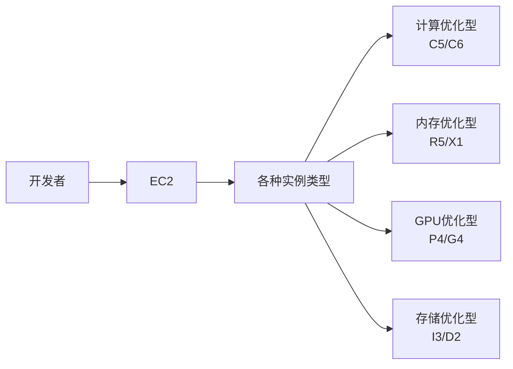
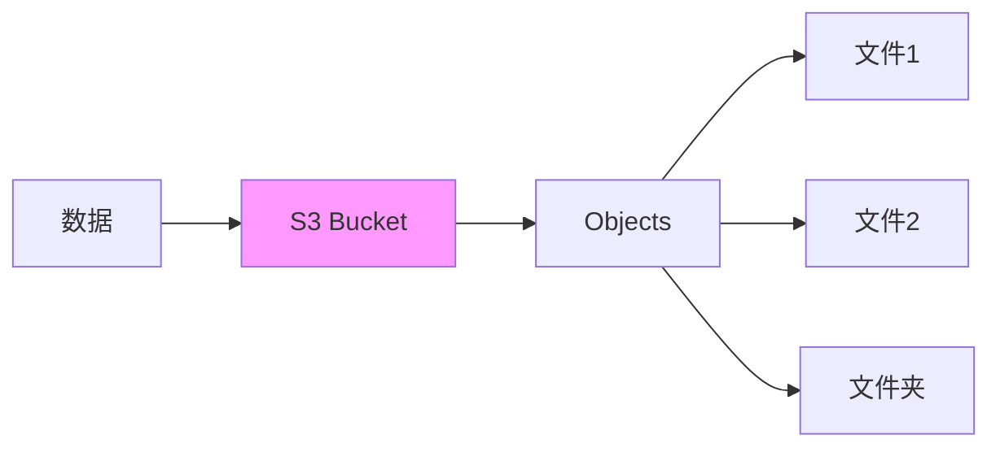
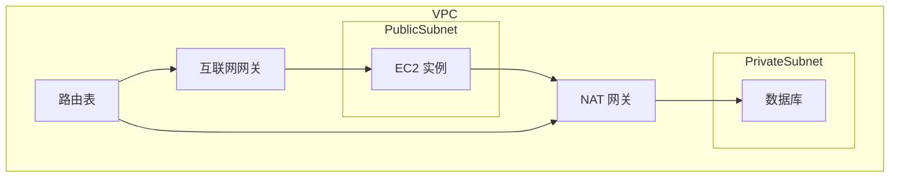
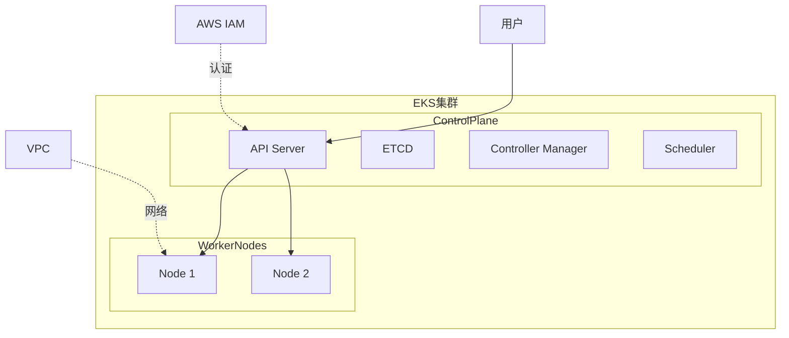

+++
title = "第66章：AWS"
weight = 660
date = "2026-03-24T13:18:28+08:00"
type = "docs"
description = ""
isCJKLanguage = true
draft = false
+++


# 第六十六章：AWS

## 66.1 EC2

### 什么是 AWS EC2？

EC2（Elastic Compute Cloud）是 AWS 的弹性计算服务，亚马逊云的"扛把子"。2006年 AWS 刚推出时，EC2 就是第一个正式商用的公有云服务，开创了整个云计算时代。



### EC2 实例类型

| 系列 | 特点 | 适用场景 |
|------|------|---------|
| A | AMD CPU | 通用场景，性价比 |
| T | 突发性能 | 开发测试、小网站 |
| C | 计算优化 | 高性能计算、HPC |
| M | 通用 | Web 应用、中等负载 |
| R | 内存优化 | 数据库、缓存 |
| X | 超大内存 | SAP HANA、内存数据库 |
| P | GPU | 深度学习、AI |
| G | GPU | 图形加速、游戏 |

### 创建 EC2 实例

```bash
# 1. 安装 AWS CLI
pip install awscli

# 2. 配置凭证
aws configure
# AWS Access Key ID: xxx
# AWS Secret Access Key: xxx
# Default region: us-east-1
# Default output format: json

# 3. 创建密钥对
aws ec2 create-key-pair \
    --key-name my-key \
    --query 'KeyMaterial' \
    --output text > ~/.ssh/my-key.pem

chmod 400 ~/.ssh/my-key.pem

# 4. 创建安全组
aws ec2 create-security-group \
    --group-name my-sg \
    --description "My security group"

# 5. 添加安全组规则
aws ec2 authorize-security-group-ingress \
    --group-name my-sg \
    --protocol tcp \
    --port 22 \
    --cidr 0.0.0.0/0

aws ec2 authorize-security-group-ingress \
    --group-name my-sg \
    --protocol tcp \
    --port 80 \
    --cidr 0.0.0.0/0

# 6. 创建实例
aws ec2 run-instances \
    --image-id ami-0c55b159cbfafe1f0 \
    --instance-type t3.micro \
    --key-name my-key \
    --security-groups my-sg \
    --count 1
```

### 连接 EC2

```bash
# Linux/Mac
ssh -i ~/.ssh/my-key.pem ec2-user@你的公网IP

# 如果是 Amazon Linux
ssh -i ~/.ssh/my-key.pem ec2-user@你的公网IP

# 如果是 Ubuntu
ssh -i ~/.ssh/my-key.pem ubuntu@你的公网IP

# 如果是 RHEL
ssh -i ~/.ssh/my-key.pem ec2-user@你的公网IP

# Windows 使用 PowerShell
ssh -i .\my-key.pem ec2-user@你的公网IP
```

### EC2 日常管理

```bash
# 查看实例
aws ec2 describe-instances

# 启动实例
aws ec2 start-instances --instance-ids i-xxxxxxxxx

# 停止实例
aws ec2 stop-instances --instance-ids i-xxxxxxxxx

# 重启实例
aws ec2 reboot-instances --instance-ids i-xxxxxxxxx

# 终止实例
aws ec2 terminate-instances --instance-ids i-xxxxxxxxx

# 创建 AMI
aws ec2 create-image \
    --instance-id i-xxxxxxxxx \
    --name "my-image-$(date +%Y%m%d)" \
    --description "My custom AMI"
```

### 实例元数据

```bash
# 在实例内部访问元数据服务
# 获取实例 ID
curl http://169.254.169.254/latest/meta-data/instance-id

# 获取实例类型
curl http://169.254.169.254/latest/meta-data/instance-type

# 获取公网 IP
curl http://169.254.169.254/latest/meta-data/public-ipv4

# 获取本地区域
curl http://169.254.169.254/latest/meta-data/availability-zone

# 获取 IAM 角色（如果配置了）
curl http://169.254.169.254/latest/meta-data/iam/info

# 获取用户数据（启动脚本）
curl http://169.254.169.254/latest/user-data/
```

### EC2 高级功能

#### 弹性 IP

```bash
# 分配弹性 IP
aws ec2 allocate-address

# 关联到实例
aws ec2 associate-address \
    --instance-id i-xxxxxxxxx \
    --allocation-id eipalloc-xxxxxxxxx

# 解除关联
aws ec2 disassociate-address \
    --association-id eipassoc-xxxxxxxxx

# 释放弹性 IP（注意：不再需要时要释放，否则收费）
aws ec2 release-address \
    --allocation-id eipalloc-xxxxxxxxx
```

#### 负载均衡器

```bash
# 创建应用负载均衡器
aws elbv2 create-load-balancer \
    --name my-alb \
    --subnets subnet-xxxx subnet-yyyy \
    --security-groups sg-xxxx

# 创建目标组
aws elbv2 create-target-group \
    --name my-targets \
    --protocol HTTP \
    --port 80 \
    --vpc-id vpc-xxxx

# 注册目标
aws elbv2 register-targets \
    --target-group-arn arn:aws:elasticloadbalancing:... \
    --targets Id=i-xxxx

# 创建监听器
aws elbv2 create-listener \
    --load-balancer-arn arn:aws:... \
    --protocol HTTP \
    --port 80 \
    --default-actions Type=forward,TargetGroupArn=arn:aws:...
```

## 66.2 S3

### 什么是 S3？

S3（Simple Storage Service）是 AWS 的对象存储服务，2006年与 EC2 一起发布，是 AWS 的另一个"开山之作"。



### S3 存储类

| 存储类 | 说明 | 适用场景 |
|--------|------|---------|
| S3 Standard | 标准存储 | 频繁访问 |
| S3 IA | 低频访问 | 每月访问1-2次 |
| S3 Glacier | 归档存储 | 长期存档 |
| S3 Glacier Deep Archive | 深度归档 | 7-10年存档 |
| S3 Intelligent-Tiering | 智能分层 | 自动优化 |

### S3 基本操作

```bash
# 1. 创建 Bucket
aws s3 mb s3://my-unique-bucket-name

# 2. 上传文件
aws s3 cp myfile.txt s3://my-bucket/

# 3. 上传整个目录
aws s3 cp ./my-folder s3://my-bucket/my-folder/ --recursive

# 4. 下载文件
aws s3 cp s3://my-bucket/myfile.txt ./

# 5. 列出文件
aws s3 ls s3://my-bucket/

# 6. 同步目录（增量上传）
aws s3 sync ./my-folder s3://my-bucket/my-folder/

# 7. 删除文件
aws s3 rm s3://my-bucket/myfile.txt

# 8. 删除整个 Bucket（先清空）
aws s3 rb s3://my-bucket --force
```

### S3 权限控制

```bash
# 1. 设置公有读（不推荐！）
aws s3api put-bucket-acl \
    --bucket my-bucket \
    --acl public-read

# 2. 设置 Bucket Policy
aws s3api put-bucket-policy \
    --bucket my-bucket \
    --policy file://policy.json

# policy.json 内容
cat > policy.json << 'EOF'
{
  "Version": "2012-10-17",
  "Statement": [
    {
      "Effect": "Allow",
      "Principal": "*",
      "Action": "s3:GetObject",
      "Resource": "arn:aws:s3:::my-bucket/*"
    }
  ]
}
EOF

# 3. 使用预签名 URL（临时访问）
aws s3 presign s3://my-bucket/private-file.txt --expires-in 3600
```

### S3 生命周期规则

```bash
# 创建生命周期规则
aws s3api put-bucket-lifecycle-configuration \
    --bucket my-bucket \
    --lifecycle-configuration file://lifecycle.json

# lifecycle.json
cat > lifecycle.json << 'EOF'
{
  "Rules": [
    {
      "ID": "Move to Glacier after 30 days",
      "Status": "Enabled",
      "Filter": {
        "Prefix": "logs/"
      },
      "Transitions": [
        {
          "Days": 30,
          "StorageClass": "GLACIER"
        },
        {
          "Days": 365,
          "StorageClass": "DEEP_ARCHIVE"
        }
      ]
    }
  ]
}
EOF
```

### CloudFront CDN

```bash
# 创建 CloudFront 分配
aws cloudfront create-distribution \
    --origin-domain-name my-bucket.s3.amazonaws.com

# 查看分配
aws cloudfront list-distributions

# 创建失效（清除缓存）
aws cloudfront create-invalidation \
    --distribution-id EXXXX \
    --paths "/*"
```

## 66.3 VPC

### AWS VPC 简介

VPC（Virtual Private Cloud）在 AWS 上创建一个虚拟私有网络，让你可以在 AWS 上拥有自己的"私有数据中心"。



### 创建 VPC

```bash
# 1. 创建 VPC
aws ec2 create-vpc \
    --cidr-block 10.0.0.0/16 \
    --tag-specifications 'ResourceType=vpc,Tags=[{Key=Name,Value=my-vpc}]'

# 2. 创建子网
aws ec2 create-subnet \
    --vpc-id vpc-xxxx \
    --cidr-block 10.0.1.0/24 \
    --availability-zone us-east-1a \
    --tag-specifications 'ResourceType=subnet,Tags=[{Key=Name,Value=public-subnet}]'

aws ec2 create-subnet \
    --vpc-id vpc-xxxx \
    --cidr-block 10.0.2.0/24 \
    --availability-zone us-east-1b \
    --tag-specifications 'ResourceType=subnet,Tags=[{Key=Name,Value=private-subnet}]'

# 3. 创建互联网网关
aws ec2 create-internet-gateway \
    --tag-specifications 'ResourceType=internet-gateway,Tags=[{Key=Name,Value=my-igw}]'

# 4. 挂载互联网网关到 VPC
aws ec2 attach-internet-gateway \
    --vpc-id vpc-xxxx \
    --internet-gateway-id igw-xxxx

# 5. 创建路由表
aws ec2 create-route-table \
    --vpc-id vpc-xxxx

# 6. 添加路由规则
aws ec2 create-route \
    --route-table-id rtb-xxxx \
    --destination-cidr-block 0.0.0.0/0 \
    --gateway-id igw-xxxx

# 7. 关联子网到路由表
aws ec2 associate-route-table \
    --subnet-id subnet-xxxx \
    --route-table-id rtb-xxxx
```

### 安全组 vs NACL

| 对比 | 安全组 | 网络 ACL |
|------|--------|---------|
| 层级 | 实例级别 | 子网级别 |
| 状态 | 有状态（自动返回） | 无状态（手动放行） |
| 规则 | 仅允许 | 允许+拒绝 |
| 评估 | 所有规则 | 按顺序 |

### VPC 对等连接

```bash
# 创建 VPC 对等连接
aws ec2 create-vpc-peering-connection \
    --vpc-id vpc-xxxx \
    --peer-vpc-id vpc-yyyy

# 接受对等连接（对方账户）
aws ec2 accept-vpc-peering-connection \
    --vpc-peering-connection-id pcx-xxxx

# 配置路由表（双方都需要）
aws ec2 create-route \
    --route-table-id rtb-xxxx \
    --destination-cidr-block 10.1.0.0/16 \
    --vpc-peering-connection-id pcx-xxxx
```

### NAT 网关

```bash
# 1. 创建弹性 IP
aws ec2 allocate-address --domain vpc

# 2. 创建 NAT 网关
aws ec2 create-nat-gateway \
    --subnet-id subnet-public \
    --allocation-id eip-xxxx

# 3. 在私有子网的路由表中添加路由
aws ec2 create-route \
    --route-table-id rtb-private \
    --destination-cidr-block 0.0.0.0/0 \
    --nat-gateway-id nat-xxxx
```

## 66.4 EKS

### 什么是 EKS？

EKS（Elastic Kubernetes Service）是 AWS 的托管 Kubernetes 服务，让你在 AWS 上运行 K8s 集群，不用自己管理控制面。



### 创建 EKS 集群

```bash
# 1. 创建 EKS 集群
aws eks create-cluster \
    --name my-cluster \
    --role-arn arn:aws:iam::123456789:role/EKSRole \
    --resources-vpc-config subnetIds=subnet-xxxx,subnet-yyyy,securityGroupIds=sg-xxxx \
    --kubernetes-version 1.28

# 2. 创建节点 IAM 角色
aws iam create-role \
    --role-name EKSNodeRole \
    --assume-role-policy-document file://trust-policy.json

# 3. 创建节点组
aws eks create-nodegroup \
    --cluster-name my-cluster \
    --nodegroup-name my-nodes \
    --subnets subnet-xxxx subnet-yyyy \
    --instance-types t3.medium \
    --ami-type AL2_x86_64 \
    --node-role arn:aws:iam::123456789:role/EKSNodeRole \
    --scaling-config minSize=1,maxSize=3,desiredSize=2

# 4. 配置 kubectl
aws eks update-kubeconfig --name my-cluster

# 5. 验证
kubectl get nodes
```

### EKS 存储

```bash
# 安装 AWS EBS CSI 驱动
aws eks create-addon \
    --cluster-name my-cluster \
    --addon-name aws-ebs-csi-driver

# 创建 StorageClass
cat > storageclass.yaml << 'EOF'
apiVersion: storage.k8s.io/v1
kind: StorageClass
metadata:
  name: ebs-sc
provisioner: ebs.csi.aws.com
parameters:
  type: gp3
  csi.storage.k8s.io/fstype: ext4
volumeBindingMode: WaitForFirstConsumer
EOF

kubectl apply -f storageclass.yaml
```

### EKS 网络

```bash
# 安装 VPC CNI 插件
aws eks create-addon \
    --cluster-name my-cluster \
    --addon-name vpc-cni

# 使用 Load Balancer Controller
aws eks create-addon \
    --cluster-name my-cluster \
    --addon-name aws-load-balancer-controller

# 部署应用并暴露服务
kubectl apply -f deployment.yaml
kubectl apply -f service.yaml
```

### Fargate（无服务器 Kubernetes）

```bash
# 创建 Fargate 配置文件
cat > fargate-profile.yaml << 'EOF'
apiVersion: eks.aws.io/v1alpha1
kind: FargateProfile
metadata:
  name: my-fargate-profile
  clusterName: my-cluster
spec:
  selectors:
  - namespace: production
    labels:
      env: production
  subnets:
  - subnet-xxxx
  - subnet-yyyy
EOF

kubectl apply -f fargate-profile.yaml
```

## 本章小结

本章我们学习了 AWS 的核心服务：

| 服务 | 说明 |
|------|------|
| EC2 | 云服务器，弹性计算 |
| S3 | 对象存储，海量文件 |
| VPC | 私有网络，网络隔离 |
| EKS | 托管 Kubernetes |
| CloudFront | CDN 内容分发 |

AWS 是云计算的开创者，产品线极其完善，是你通往云端的不二之选！

---

> 💡 **温馨提示**：
> AWS 产品众多，计费复杂。新手建议先用 AWS Free Tier 练手，注意设置预算警报，别让账单"惊喜"到你！

---

**第六十六章：AWS — 完结！** 🎉

下一章我们将学习"腾讯云"，掌握国内第三大云服务商的核心服务。敬请期待！ 🚀
