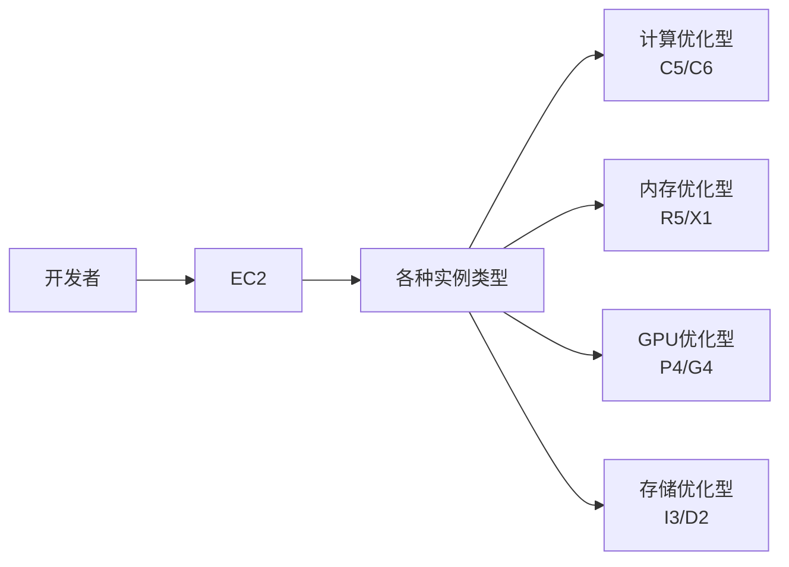
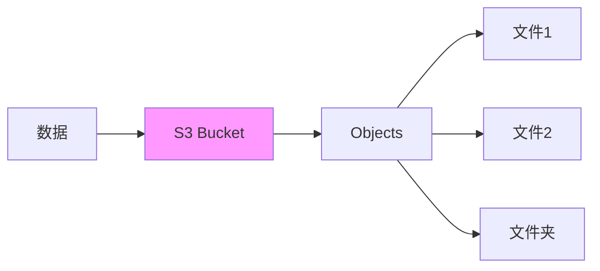
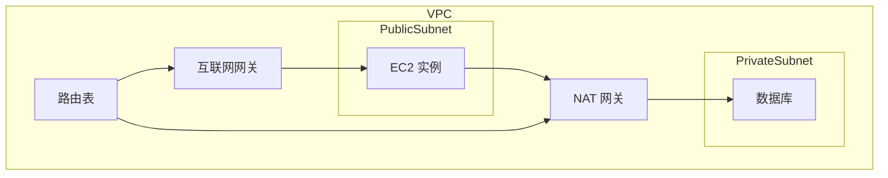
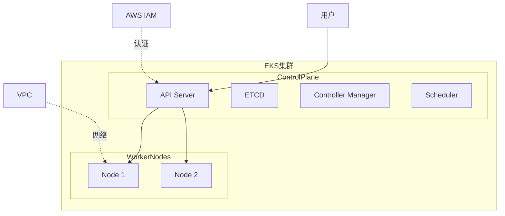

+++
title = "第66章：AWS"
weight = 660
date = "2026-03-24T13:18:28+08:00"
type = "docs"
description = ""
isCJKLanguage = true
draft = false
+++


# 第六十六章：AWS

## 66.1 EC2

### 什么是 AWS EC2？

EC2（Elastic Compute Cloud）是 AWS 的弹性计算服务，亚马逊云的"扛把子"。2006年 AWS 刚推出时，EC2 就是第一个正式商用的公有云服务，开创了整个云计算时代。


```mermaid
graph LR
    A[开发者] --> B[EC2]
    B --> C[各种实例类型]
    C --> D[计算优化型<br/>C5/C6]
    C --> E[内存优化型<br/>R5/X1]
    C --> F[GPU优化型<br/>P4/G4]
    C --> G[存储优化型<br/>I3/D2]
```

### EC2 实例类型

| 系列 | 特点 | 适用场景 |
|------|------|---------|
| A | AMD CPU | 通用场景，性价比 |
| T | 突发性能 | 开发测试、小网站 |
| C | 计算优化 | 高性能计算、HPC |
| M | 通用 | Web 应用、中等负载 |
| R | 内存优化 | 数据库、缓存 |
| X | 超大内存 | SAP HANA、内存数据库 |
| P | GPU | 深度学习、AI |
| G | GPU | 图形加速、游戏 |

### 创建 EC2 实例

```bash
# 1. 安装 AWS CLI v2（推荐）
# Linux x86_64
curl "https://awscli.amazonaws.com/awscli-exe-linux-x86_64.zip" -o "awscliv2.zip"
unzip awscliv2.zip && sudo ./aws/install

# macOS
brew install awscli

# 说明：老教程里的 pip install awscli 装的是 **v1**，目前只做少量维护，
# 新环境请用上面的 v2 安装方式；v2 自带打包的 Python，不受系统 Python 版本影响
aws --version

# 2. 配置凭证
# ⚠️ 不要用 root 账号的密钥。正确做法是创建 IAM 用户（并开启 MFA），
# 或更好：在 EC2/EKS 上用 IAM 角色，让程序完全不需要密钥
aws configure
# AWS Access Key ID: 你的 IAM 用户密钥
# AWS Secret Access Key: 你的 IAM 用户私钥
# Default region: us-east-1
# Default output format: json

# 也可以为不同环境配置多个 profile（生产/测试分开），避免误操作
aws configure --profile prod

# 3. 创建密钥对
aws ec2 create-key-pair \
    --key-name my-key \
    --query 'KeyMaterial' \
    --output text > ~/.ssh/my-key.pem

chmod 400 ~/.ssh/my-key.pem
# 注意：私钥只在创建时返回一次，丢了只能重新创建密钥对

# 4. 创建安全组
aws ec2 create-security-group \
    --group-name my-sg \
    --description "My security group" \
    --vpc-id vpc-xxxxxxxxx

# 5. 添加安全组规则
# ⚠️ 把 22 端口开放给 0.0.0.0/0 意味着全世界都能尝试暴力破解你的 SSH，
# 强烈建议改成你自己的出口 IP（如 203.0.113.5/32），或只允许通过跳板机访问
aws ec2 authorize-security-group-ingress \
    --group-id sg-xxxxxxxxx \
    --protocol tcp \
    --port 22 \
    --cidr 203.0.113.5/32

aws ec2 authorize-security-group-ingress \
    --group-id sg-xxxxxxxxx \
    --protocol tcp \
    --port 80 \
    --cidr 0.0.0.0/0

# 6. 查询"当前区域最新的 Amazon Linux 2023 AMI"
# AMI ID 是"每个区域一份"的，网上抄来的 ami-xxx 往往在你的区域根本不存在，
# 用 SSM 公共参数动态查询才是可靠做法
AMI_ID=$(aws ssm get-parameter \
    --name /aws/service/ami-amazon-linux-latest/al2023-ami-kernel-default-x86_64 \
    --query 'Parameter.Value' --output text)
echo "$AMI_ID"

# 7. 创建实例
aws ec2 run-instances \
    --image-id "$AMI_ID" \
    --instance-type t3.micro \
    --key-name my-key \
    --security-group-ids sg-xxxxxxxxx \
    --subnet-id subnet-xxxxxxxxx \
    --count 1 \
    --tag-specifications 'ResourceType=instance,Tags=[{Key=Name,Value=my-first-ec2}]'
```

> **`--security-groups` 和 `--security-group-ids` 别用错**：前者按**安全组名称**引用，
> 只在默认 VPC 里能正常工作，且容易因为重名而出错；
> 后者按 **ID** 引用，任何 VPC 里都可靠。新脚本请统一使用 `--security-group-ids`。
>
> 另外，`--key-name` 只是把公钥注入实例，**私钥要自己保管好**；
> 生产环境更推荐用 **SSM Session Manager** 登录（不需要开 22 端口、不需要密钥，
> 所有会话都有审计记录，是 AWS 官方推荐的运维方式）。

### 连接 EC2

```bash
# Linux/Mac，默认用户名取决于所用镜像：
# Amazon Linux / RHEL / CentOS 系 → ec2-user
ssh -i ~/.ssh/my-key.pem ec2-user@你的公网IP

# Ubuntu → ubuntu
ssh -i ~/.ssh/my-key.pem ubuntu@你的公网IP

# Debian → admin
ssh -i ~/.ssh/my-key.pem admin@你的公网IP

# Windows 实例用远程桌面（RDP），不是 SSH：
# 1) 先用私钥解密管理员密码（在本地执行，会返回明文密码）
aws ec2 get-password-data \
    --instance-id i-xxxxxxxxx \
    --priv-launch-key ~/.ssh/my-key.pem \
    --query 'PasswordData' --output text

# 2) 用返回的密码，通过 mstsc（远程桌面）连接 公网IP:3389
```

> **用户名搞不清怎么办**：`aws ec2 describe-instances` 输出里没有"登录用户名"这一项，
> 它由 AMI 的 `AuthorizedKeysFile`/默认用户决定。拿不准时看 AMI 的说明页，
> 或者直接用 **SSM Session Manager**（`aws ssm start-session --target i-xxxx`）绕开这个问题。

### EC2 日常管理

```bash
# 查看实例
aws ec2 describe-instances

# 启动实例
aws ec2 start-instances --instance-ids i-xxxxxxxxx

# 停止实例
aws ec2 stop-instances --instance-ids i-xxxxxxxxx

# 重启实例
aws ec2 reboot-instances --instance-ids i-xxxxxxxxx

# 终止实例
aws ec2 terminate-instances --instance-ids i-xxxxxxxxx

# 创建 AMI
aws ec2 create-image \
    --instance-id i-xxxxxxxxx \
    --name "my-image-$(date +%Y%m%d)" \
    --description "My custom AMI"
```

### 实例元数据

```bash
# 在实例内部访问元数据服务（169.254.169.254 是链路本地地址，从公网不可达）
# 获取实例 ID
curl http://169.254.169.254/latest/meta-data/instance-id

# 获取实例类型
curl http://169.254.169.254/latest/meta-data/instance-type

# 获取公网 IP
curl http://169.254.169.254/latest/meta-data/public-ipv4

# 获取本地区域
curl http://169.254.169.254/latest/meta-data/availability-zone

# 获取 IAM 角色（如果配置了）
curl http://169.254.169.254/latest/meta-data/iam/info

# 获取用户数据（启动脚本）
curl http://169.254.169.254/latest/user-data/
```

> **⚠️ 元数据服务必须升级到 IMDSv2**
>
> 老式的元数据接口（IMDSv1）**不需要任何认证**，只要服务器上存在 SSRF 漏洞，
> 攻击者就能通过它拿到实例绑定的 IAM 临时凭证，进而接管云资源
> （2019 年 Capital One 的大规模数据泄露正是这个原因）。
>
> IMDSv2 增加了一步"先申请 token"的机制，能有效阻断大多数 SSRF：
>
> ```bash
> # IMDSv2 的正确调用方式：先取 token，再带着 token 访问
> TOKEN=$(curl -sX PUT "http://169.254.169.254/latest/api/token" \
>     -H "X-aws-ec2-metadata-token-ttl-seconds: 21600")
> curl -s -H "X-aws-ec2-metadata-token: $TOKEN" \
>     http://169.254.169.254/latest/meta-data/instance-id
>
> # 要求实例"只能使用 IMDSv2"（强烈建议开）
> aws ec2 modify-instance-metadata-options \
>     --instance-id i-xxxxxxxxx \
>     --http-tokens required \
>     --http-endpoint enabled
> ```
>
> 更彻底的做法是**限制跳数**（`--http-put-response-hop-limit 1`），
> 防止容器或嵌套虚拟化环境里的进程访问到宿主的元数据。

### EC2 高级功能

#### 弹性 IP

```bash
# 分配弹性 IP（VPC 里的 EIP 要指定 --domain vpc）
aws ec2 allocate-address --domain vpc

# 关联到实例
aws ec2 associate-address \
    --instance-id i-xxxxxxxxx \
    --allocation-id eipalloc-xxxxxxxxx

# 解除关联（--association-id 可从 describe-addresses 查到）
aws ec2 disassociate-address \
    --association-id eipassoc-xxxxxxxxx

# 释放弹性 IP
# ⚠️ 计费提醒：AWS 自 2024 年 2 月起对"所有公网 IPv4 地址"收费
# （不管是否挂载在实例上，每小时约 $0.005），所以不用的 EIP 一定要释放
aws ec2 release-address \
    --allocation-id eipalloc-xxxxxxxxx

# 查看当前账号下有哪些 EIP 及其关联情况
aws ec2 describe-addresses \
    --query 'Addresses[].{IP:PublicIp,Instance:InstanceId,Alloc:AllocationId}' \
    --output table
```

#### 负载均衡器

```bash
# 创建应用负载均衡器
aws elbv2 create-load-balancer \
    --name my-alb \
    --subnets subnet-xxxx subnet-yyyy \
    --security-groups sg-xxxx

# 创建目标组
aws elbv2 create-target-group \
    --name my-targets \
    --protocol HTTP \
    --port 80 \
    --vpc-id vpc-xxxx

# 注册目标
aws elbv2 register-targets \
    --target-group-arn arn:aws:elasticloadbalancing:... \
    --targets Id=i-xxxx

# 创建监听器
aws elbv2 create-listener \
    --load-balancer-arn arn:aws:... \
    --protocol HTTP \
    --port 80 \
    --default-actions Type=forward,TargetGroupArn=arn:aws:...
```

## 66.2 S3

### 什么是 S3？

S3（Simple Storage Service）是 AWS 的对象存储服务，2006年与 EC2 一起发布，是 AWS 的另一个"开山之作"。


```mermaid
graph LR
    A[数据] --> B[S3 Bucket]
    B --> C[Objects]
    C --> D[文件1]
    C --> E[文件2]
    C --> F[文件夹]
    
    style B fill:#f9f
```

### S3 存储类

| 存储类 | 说明 | 适用场景 |
|--------|------|---------|
| `STANDARD` | 标准存储，毫秒级访问 | 频繁访问的热数据 |
| `STANDARD_IA` | 标准低频访问，取回即时但收取取回费 | 每月访问 1~2 次的数据 |
| `ONEZONE_IA` | 单可用区低频，便宜但不抗整个可用区故障 | 可再生的、不重要的低频数据 |
| `INTELLIGENT_TIERING` | 智能分层，自动在访问层之间迁移 | 访问模式不固定、懒得手工调的数据 |
| `GLACIER_IR` | 归档**即时**取回（毫秒级） | 归档但偶尔需要马上读 |
| `GLACIER`（Flexible Retrieval） | 归档，取回需几分钟到几小时 | 长期备份 |
| `DEEP_ARCHIVE` | 深度归档，最便宜，取回需 12 小时以上 | 合规留存、7~10 年存档 |

> **选存储类先问三个问题**：多久访问一次？需要多快取回？能不能容忍重新生成？
> 需要注意**归档类存储都有"取回时间"和"取回费用"**，
> 如果偶尔要紧急恢复一大堆数据，账单可能比省下的存储费还高。
> 另外 `INTELLIGENT_TIERING` 虽然会自动分层，但它对小于 128KB 的对象不做分层优化，
> 而且会收取少量的监控费用，海量小文件场景要算清楚。

### S3 基本操作

```bash
# 1. 创建 Bucket
aws s3 mb s3://my-unique-bucket-name

# 2. 上传文件
aws s3 cp myfile.txt s3://my-bucket/

# 3. 上传整个目录
aws s3 cp ./my-folder s3://my-bucket/my-folder/ --recursive

# 4. 下载文件
aws s3 cp s3://my-bucket/myfile.txt ./

# 5. 列出文件
aws s3 ls s3://my-bucket/

# 6. 同步目录（增量上传）
aws s3 sync ./my-folder s3://my-bucket/my-folder/

# 7. 删除文件
aws s3 rm s3://my-bucket/myfile.txt

# 8. 删除整个 Bucket（先清空）
aws s3 rb s3://my-bucket --force
```

> **⚠️ `rb --force` 会先删光桶里的所有对象再删桶**，而且**默认不可恢复**
> （没开版本控制的话，删了就是真的没了）。
> 执行这类命令前建议先用 `aws s3 ls s3://my-bucket --recursive --summarize` 确认要删的是什么；
> 重要数据还可以开启**版本控制 + MFA Delete**，避免一行命令酿成事故。
>
> **`sync --delete` 同样危险**：`aws s3 sync ./local s3://bucket --delete`
> 会把"本地不存在、桶里存在"的文件全部删除，源与目标写反时就等于清空线上数据。
> 动手前先加 `--dryrun` 看一眼将要发生的改动：
>
> ```bash
> aws s3 sync ./local s3://my-bucket/ --delete --dryrun    # 只显示，不执行
> ```

### S3 权限控制

```bash
# 1. 设置公有读（不推荐！）
aws s3api put-bucket-acl \
    --bucket my-bucket \
    --acl public-read

# 2. 设置 Bucket Policy
aws s3api put-bucket-policy \
    --bucket my-bucket \
    --policy file://policy.json

# policy.json 内容
cat > policy.json << 'EOF'
{
  "Version": "2012-10-17",
  "Statement": [
    {
      "Effect": "Allow",
      "Principal": "*",
      "Action": "s3:GetObject",
      "Resource": "arn:aws:s3:::my-bucket/*"
    }
  ]
}
EOF

# 3. 使用预签名 URL（临时访问）
aws s3 presign s3://my-bucket/private-file.txt --expires-in 3600
```

> **S3 权限的两条重要变化，老教程基本都没写**
>
> **1. 新桶默认 ACL 已禁用。** 2023 年 4 月起，AWS 新建的 Bucket 默认启用
> "**Bucket owner enforced**"（即 ACL 被禁用），此时执行 `put-bucket-acl` 会直接报
> `AccessControlListNotSupported`。也就是说"用 ACL 开公共读"这条路在新桶上已经走不通了，
> 要公开访问必须用 **Bucket Policy**，而且得先关掉"**阻止公共访问**"设置。
>
> **2. 默认有四道"阻止公共访问"的开关。**
> 账号级与桶级各有一套（Block Public Access），只要有一层开着，
> 无论 ACL 还是 Bucket Policy 都无法把桶变成公开。
> 这是 AWS 为了防止误配置泄露数据加上的保护，**建议保持开启**，
> 需要公开的静态资源通过 **CloudFront + OAC（源访问控制）** 暴露，而不是直接公开桶。
>
> 因此，上面那个 `Principal: "*"` 的 Bucket Policy 示例**请只在实验环境尝试**，
> 并清楚它意味着"全世界都可以读取这些对象"。

### S3 生命周期规则

```bash
# 创建生命周期规则
aws s3api put-bucket-lifecycle-configuration \
    --bucket my-bucket \
    --lifecycle-configuration file://lifecycle.json

# lifecycle.json
cat > lifecycle.json << 'EOF'
{
  "Rules": [
    {
      "ID": "Move to Glacier after 30 days",
      "Status": "Enabled",
      "Filter": {
        "Prefix": "logs/"
      },
      "Transitions": [
        {
          "Days": 30,
          "StorageClass": "GLACIER"
        },
        {
          "Days": 365,
          "StorageClass": "DEEP_ARCHIVE"
        }
      ]
    }
  ]
}
EOF
```

### CloudFront CDN

```bash
# 创建 CloudFront 分配
aws cloudfront create-distribution \
    --origin-domain-name my-bucket.s3.amazonaws.com

# 查看分配
aws cloudfront list-distributions

# 创建失效（清除缓存）
aws cloudfront create-invalidation \
    --distribution-id EXXXX \
    --paths "/*"
```

> **CloudFront 的几个要点**
>
> - 上面用 `--origin-domain-name` 是 AWS CLI 提供的**简化写法**，适合快速实验；
>   实际项目里通常需要完整配置（自定义域名、ACM 证书、缓存策略、压缩、
>   WAF 等），这些要写 `--distribution-config` 的 JSON，很难手工维护，
>   建议用 **Terraform / CDK / CloudFormation** 管理（见第 68 章）。
> - **清除缓存（invalidation）是要收费的**（每月前 1000 条路径免费，
>   之后按路径计费），所以别把它当成日常操作。
>   正确思路是给文件名加内容哈希，靠"换名字"而非"刷缓存"来更新。
> - 如果源站是 S3，**不要用公开桶**做源，而是给 CloudFront 配
>   **OAC（Origin Access Control）**，让它以受信身份回源，桶保持私有。

## 66.3 VPC

### AWS VPC 简介

VPC（Virtual Private Cloud）在 AWS 上创建一个虚拟私有网络，让你可以在 AWS 上拥有自己的"私有数据中心"。


```mermaid
graph TB
    subgraph VPC
        subgraph PublicSubnet
            EC2[EC2 实例]
        end
        
        subgraph PrivateSubnet
            RDS[数据库]
        end
        
        IGW[互联网网关]
        NAT[NAT 网关]
        RT[路由表]
    end
    
    IGW --> EC2
    EC2 --> NAT
    NAT --> RDS
    RT --> IGW
    RT --> NAT
```

### 创建 VPC

```bash
# 1. 创建 VPC
aws ec2 create-vpc \
    --cidr-block 10.0.0.0/16 \
    --tag-specifications 'ResourceType=vpc,Tags=[{Key=Name,Value=my-vpc}]'

# 2. 创建子网
aws ec2 create-subnet \
    --vpc-id vpc-xxxx \
    --cidr-block 10.0.1.0/24 \
    --availability-zone us-east-1a \
    --tag-specifications 'ResourceType=subnet,Tags=[{Key=Name,Value=public-subnet}]'

aws ec2 create-subnet \
    --vpc-id vpc-xxxx \
    --cidr-block 10.0.2.0/24 \
    --availability-zone us-east-1b \
    --tag-specifications 'ResourceType=subnet,Tags=[{Key=Name,Value=private-subnet}]'

# 3. 创建互联网网关
aws ec2 create-internet-gateway \
    --tag-specifications 'ResourceType=internet-gateway,Tags=[{Key=Name,Value=my-igw}]'

# 4. 挂载互联网网关到 VPC
aws ec2 attach-internet-gateway \
    --vpc-id vpc-xxxx \
    --internet-gateway-id igw-xxxx

# 5. 创建路由表
aws ec2 create-route-table \
    --vpc-id vpc-xxxx

# 6. 添加路由规则
aws ec2 create-route \
    --route-table-id rtb-xxxx \
    --destination-cidr-block 0.0.0.0/0 \
    --gateway-id igw-xxxx

# 7. 关联子网到路由表
aws ec2 associate-route-table \
    --subnet-id subnet-xxxx \
    --route-table-id rtb-xxxx
```

### 安全组 vs NACL

| 对比 | 安全组 | 网络 ACL |
|------|--------|---------|
| 层级 | 实例级别 | 子网级别 |
| 状态 | 有状态（自动返回） | 无状态（手动放行） |
| 规则 | 仅允许 | 允许+拒绝 |
| 评估 | 所有规则 | 按顺序 |

### VPC 对等连接

```bash
# 创建 VPC 对等连接
aws ec2 create-vpc-peering-connection \
    --vpc-id vpc-xxxx \
    --peer-vpc-id vpc-yyyy

# 接受对等连接（对方账户）
aws ec2 accept-vpc-peering-connection \
    --vpc-peering-connection-id pcx-xxxx

# 配置路由表（双方都需要）
aws ec2 create-route \
    --route-table-id rtb-xxxx \
    --destination-cidr-block 10.1.0.0/16 \
    --vpc-peering-connection-id pcx-xxxx
```

> **对等连接有三个"反直觉"的限制**：网段不能重叠；**不具备传递性**
> （A 连 B、B 连 C，并不代表 A 能访问 C，需要额外配置或改用 Transit Gateway）；
> 跨账号/跨区域时要指定 `--peer-region` 并分别接受请求。
> VPC 数量一多，对等连接会变成"网状噩梦"，这时应该改用 **Transit Gateway** 做中心辐射式互联。

### NAT 网关

```bash
# 1. 创建弹性 IP
aws ec2 allocate-address --domain vpc

# 2. 创建 NAT 网关
aws ec2 create-nat-gateway \
    --subnet-id subnet-public \
    --allocation-id eip-xxxx

# 3. 在私有子网的路由表中添加路由
aws ec2 create-route \
    --route-table-id rtb-private \
    --destination-cidr-block 0.0.0.0/0 \
    --nat-gateway-id nat-xxxx
```

> **NAT 网关是最容易被低估的"账单刺客"**：它同时收取**按小时**的费用和
> **按处理数据量**（每 GB）的费用，尤其是从 S3 拉大量数据或做容器镜像拉取时，
> 费用会涨得很快。两个常用优化：
>
> 1. **给 S3 / DynamoDB 配 VPC 端点（Gateway Endpoint）**：
>    流量走内网、不经过 NAT，既省钱又快，这是"必做项"。
> 2. **给 EC2 配实例元数据/接口端点（Interface Endpoint）** 访问 SSM、
>    ECR 等服务，避免所有流量都从 NAT 出去。
>
> 另外记住 NAT 网关必须建在**公有子网**里，并占用一个弹性 IP；
> 多个可用区建议各建一个（而不是共用），否则该可用区故障时会连带断网。

## 66.4 EKS

### 什么是 EKS？

EKS（Elastic Kubernetes Service）是 AWS 的托管 Kubernetes 服务，让你在 AWS 上运行 K8s 集群，不用自己管理控制面。


```mermaid
graph TB
    subgraph EKS集群
        subgraph ControlPlane
            API[API Server]
            ETCD[ETCD]
            CM[Controller Manager]
            SCHED[Scheduler]
        end
        
        subgraph WorkerNodes
            Node1[Node 1]
            Node2[Node 2]
        end
    end
    
    U[用户] --> API
    API --> Node1
    API --> Node2
    
    AWS[AWS IAM] -.->|认证| API
    VPC -.->|网络| Node1
```

### 创建 EKS 集群

```bash
# 1. 创建 EKS 集群
aws eks create-cluster \
    --name my-cluster \
    --role-arn arn:aws:iam::123456789:role/EKSRole \
    --resources-vpc-config subnetIds=subnet-xxxx,subnet-yyyy,securityGroupIds=sg-xxxx \
    --kubernetes-version 1.28

# 2. 创建节点 IAM 角色（节点要能拉镜像、上报指标、挂载 EBS，所以必须有这个角色）
aws iam create-role \
    --role-name EKSNodeRole \
    --assume-role-policy-document file://trust-policy.json

# 并把必要的托管策略挂上去（示例）
aws iam attach-role-policy --role-name EKSNodeRole \
    --policy-arn arn:aws:iam::aws:policy/AmazonEKSWorkerNodePolicy
aws iam attach-role-policy --role-name EKSNodeRole \
    --policy-arn arn:aws:iam::aws:policy/AmazonEC2ContainerRegistryReadOnly
aws iam attach-role-policy --role-name EKSNodeRole \
    --policy-arn arn:aws:iam::aws:policy/AmazonEKS_CNI_Policy

# 3. 创建节点组
aws eks create-nodegroup \
    --cluster-name my-cluster \
    --nodegroup-name my-nodes \
    --subnets subnet-xxxx subnet-yyyy \
    --instance-types t3.medium \
    --ami-type AL2023_x86_64_STANDARD \
    --node-role arn:aws:iam::123456789:role/EKSNodeRole \
    --scaling-config minSize=1,maxSize=3,desiredSize=2

# 说明：AL2（Amazon Linux 2）正在进入维护期末尾，新集群建议用 AL2023，
# 或使用 Bottlerocket 这类专为容器优化的镜像

# 4. 配置 kubectl
aws eks update-kubeconfig --name my-cluster

# 5. 验证
kubectl get nodes
```

> **创建 EKS 集群时要注意的三件事**
>
> 1. **控制面是收费的**：EKS 对每个集群按小时收取费用（与节点无关），
>    所以"开着不用"也在烧钱，测试完记得删除。
> 2. **Kubernetes 版本有支持窗口**：每个版本的支持期大约 14 个月，
>    到期后会进入延长支持并**额外收费**。上面示例里的 1.28 早已过期，
>    请用 `aws eks describe-cluster-versions` 或文档确认当前推荐版本。
> 3. **控制面与节点是分开管理的**：`create-cluster` 只是创建控制面，
>    节点要靠托管节点组（Managed Node Group）、自管节点组或 Fargate 提供，且都要放在**私有子网**里。
>
> 另外，用 CLI 手搭一个 EKS 集群涉及十几步（IAM 角色、VPC 子网打标签、
> 安全组、addon、kubeconfig……），**强烈建议用 `eksctl` 或 Terraform**，
> 一条命令就能建出可用的集群：
>
> ```bash
> eksctl create cluster --name my-cluster --region us-east-1 \
>     --nodegroup-name standard --nodes 2 --node-type t3.medium
> ```

### EKS 存储

```bash
# 安装 AWS EBS CSI 驱动
aws eks create-addon \
    --cluster-name my-cluster \
    --addon-name aws-ebs-csi-driver

# 创建 StorageClass
cat > storageclass.yaml << 'EOF'
apiVersion: storage.k8s.io/v1
kind: StorageClass
metadata:
  name: ebs-sc
provisioner: ebs.csi.aws.com
parameters:
  type: gp3
  csi.storage.k8s.io/fstype: ext4
volumeBindingMode: WaitForFirstConsumer
EOF

kubectl apply -f storageclass.yaml
```

### EKS 网络

```bash
# 安装 VPC CNI 插件
aws eks create-addon \
    --cluster-name my-cluster \
    --addon-name vpc-cni

# 使用 Load Balancer Controller
# 注意：AWS Load Balancer Controller 不是一个"托管 addon"，需要两步：
# 1) 先创建 IAM 角色并绑定官方提供的策略（通过 IRSA 授予权限）
#    参考官方仓库的 iam-policy.json
# 2) 用 Helm 安装 Controller
helm repo add eks https://aws.github.io/eks-charts
helm install aws-load-balancer-controller eks/aws-load-balancer-controller \
    -n kube-system \
    --set clusterName=my-cluster \
    --set serviceAccount.create=false \
    --set serviceAccount.name=aws-load-balancer-controller
# 装好之后，创建 type=LoadBalancer 的 Service 或 Ingress 才会自动生成 ALB/NLB

# 部署应用并暴露服务
kubectl apply -f deployment.yaml
kubectl apply -f service.yaml
```

### Fargate（无服务器 Kubernetes）

```bash
# 创建 Fargate 配置文件
# ⚠️ 重要更正：Fargate Profile 是 **EKS 的资源，不是 Kubernetes 的 CRD**，
# 用 kubectl apply 一个 FargateProfile 清单是无效的（会报找不到该类型）。
# 正确做法是用 AWS CLI 或 eksctl 创建：
aws eks create-fargate-profile \
    --cluster-name my-cluster \
    --fargate-profile-name my-fargate-profile \
    --pod-execution-role-arn arn:aws:iam::123456789:role/EKSFargatePodExecutionRole \
    --selectors namespace=production,labels={env=production} \
    --subnets subnet-xxxx subnet-yyyy

# 查看创建结果
aws eks list-fargate-profiles --cluster-name my-cluster
aws eks describe-fargate-profile \
    --cluster-name my-cluster --fargate-profile-name my-fargate-profile
```

> **Fargate 的取舍**：它让你不用管节点（没有 EC2 实例要打补丁、没有节点容量规划），
> 但代价是——**计费更贵**（按 vCPU/内存秒计费）、**不支持 DaemonSet**（
> 所以日志采集、监控代理这类"每节点一个"的组件要用别的方式实现）、
> **不支持特权容器和 hostNetwork**、且必须显式指定哪些 Pod 走 Fargate。
> 常用于"流量波动大的无状态服务"或"不想运维节点的中小团队"。

## 66.5 IAM：AWS 里最该先学的东西

AWS 的一切操作背后都是 IAM 在判定"谁能在什么条件下对什么资源做什么"。
不理解 IAM，就很容易写出"看起来能跑、其实权限过宽"的危险配置。

| 概念 | 说明 |
|------|------|
| IAM 用户（User） | 长期身份，有固定的密钥；**建议只用于人类登录，且必须开 MFA** |
| IAM 角色（Role） | 没有固定密钥，靠"担任角色"临时获得凭证；**给程序和服务用这个** |
| 策略（Policy） | 一段 JSON，描述允许/拒绝哪些 Action 作用于哪些 Resource |
| IRSA | 把 IAM 角色映射给 K8s 里的 ServiceAccount，让 Pod 无需密钥即可访问 AWS |

```bash
# 创建一个只读用户（注意：创建后要立刻开启 MFA，不要给它编程访问密钥）
aws iam create-user --user-name auditor

# 把"只读"策略挂上（示例，实际应更细化到具体资源）
aws iam attach-user-policy --user-name auditor \
    --policy-arn arn:aws:iam::aws:policy/ReadOnlyAccess

# 查看某用户当前挂了哪些权限（排查"权限为什么这么大"）
aws iam list-attached-user-policies --user-name auditor
```

> **AWS 账号安全的几条硬性做法**
>
> 1. **root 账号只用来做两件事**：开通账号和设置账单。
>    给它开启 MFA，删掉它的所有访问密钥，日常操作全部走 IAM 用户/角色。
> 2. **禁止在代码、脚本、镜像里硬编码 AccessKey**。
>    EC2 用实例角色，Lambda 用执行角色，K8s 用 IRSA，CI/CD 用 OIDC 换取临时凭证。
> 3. **最小权限**：不要图省事直接挂 `AdministratorAccess`；
>    用 IAM Access Analyzer 和 CloudTrail 观察实际使用了哪些权限，再逐步收窄。
> 4. **开启 CloudTrail 全区域审计**，并把它写到独立的 S3 桶（最好另一个账号，防篡改）。
> 5. **开启账单预算告警**，给"金额超过预期"和"出现异常服务用量"都设一条。

## 66.6 成本与运维要点

| 话题 | 关键点 |
|------|--------|
| 计费模式 | 按需（On-Demand）最贵；Savings Plans / 预留实例可省 30%~70%；Spot 实例可省 70%~90% 但会被回收 |
| 存储成本 | EBS 只要"存在"就计费（不管实例是否运行）；未挂载的 EBS、旧快照、S3 多版本旧版本都会持续产生费用 |
| 网络成本 | **跨可用区流量收费、出公网流量收费**；同区域内网互访免费，所以架构设计时"尽量同可用区"能省不少钱 |
| 无服务器 | Lambda 按调用次数与执行时间计费，适合突发流量；但长期高负载场景未必比 EC2 便宜 |
| 可观测性 | CloudWatch 日志与指标的存储费用容易失控，务必设置日志保留期（默认是"永不过期"） |

```bash
# 快速看看最近有没有"异常的日消费"（需要开启 Cost Explorer 权限）
aws ce get-cost-and-usage \
    --time-period Start=2026-09-01,End=2026-09-14 \
    --granularity DAILY \
    --metrics BlendedCost \
    --group-by Type=DIMENSION,Key=SERVICE
```

> **三条最值钱的经验**：给账号设**预算告警**；给日志设**保留期**；
> 定期检查**未挂载的 EBS、空闲的 EIP、闲置的负载均衡器**——
> 这三类资源最容易被遗忘，也最容易在月底制造"惊喜"。

## 本章小结

本章我们学习了 AWS 的核心服务：

| 服务 | 说明 |
|------|------|
| EC2 | 云服务器；实例类型、AMI、安全组、密钥是四个关键点 |
| S3 | 对象存储；注意存储类选择与"默认阻止公共访问" |
| VPC | 私有网络；公有/私有子网 + NAT 网关 + 安全组/NACL |
| EKS | 托管 Kubernetes；节点、addon、Fargate、存储都要单独规划 |
| CloudFront | CDN；配合 OAC 让源站保持私有 |
| IAM | 权限体系，是所有服务安全的基础；程序一律用角色而非密钥 |
| CloudWatch / Cost Explorer | 可观测性与账单分析，云上运维的两只眼睛 |

AWS 是云计算的开创者，产品线极其完善，是你通往云端的不二之选！

最后归纳成本章最该带走的三条观念：

1. **先管好身份，再管好资源**：IAM 角色 > 长期密钥，root 账号只用来开账号和设账单。
2. **默认私有，按需开放**：安全组只放行必要来源，S3 保持私有并用 CloudFront 暴露，
   IMDSv2 强制开启——这三件事能挡掉绝大多数常见事故。
3. **云上"没删"就等于"还在花钱"**：EBS、EIP、快照、日志、NAT 流量都是长期成本，
   预算告警和定期盘点比任何省钱技巧都有效。

---

> 💡 **温馨提示**：
> AWS 产品众多，计费复杂。新手建议先用 AWS Free Tier 练手，注意设置预算警报，别让账单"惊喜"到你！

---

**第六十六章：AWS — 完结！** 🎉

下一章我们将学习"腾讯云"，掌握国内第三大云服务商的核心服务。敬请期待！ 🚀
