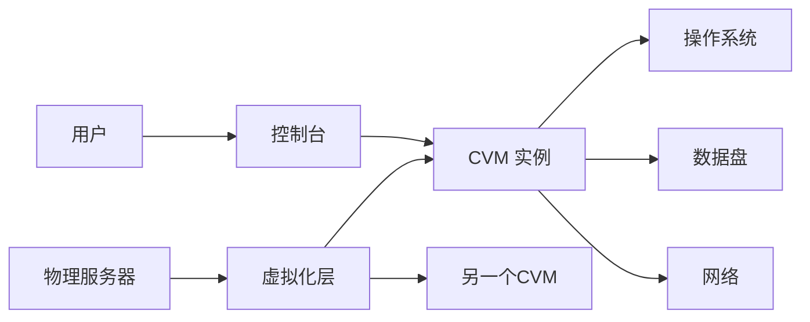
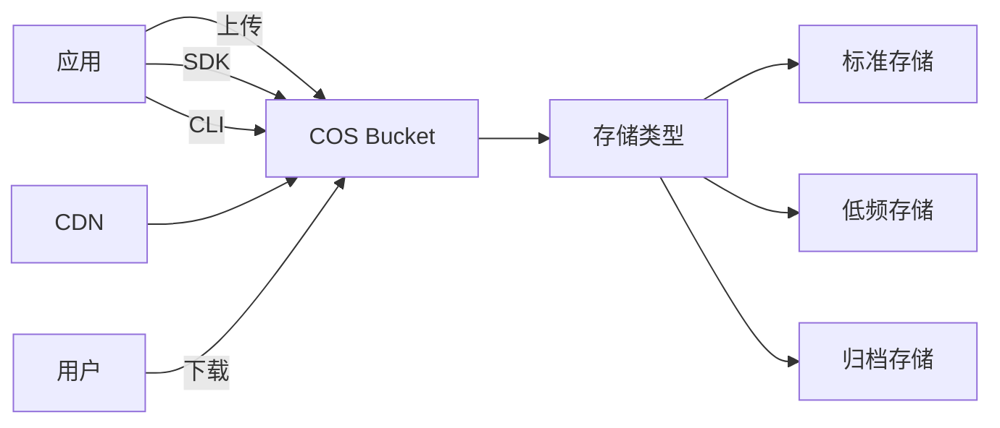
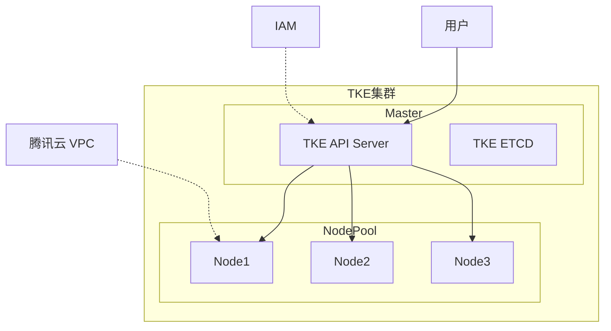

+++
title = "第67章：腾讯云"
weight = 670
date = "2026-03-24T13:18:28+08:00"
type = "docs"
description = ""
isCJKLanguage = true
draft = false
+++


# 第六十七章：腾讯云

## 67.1 CVM

### 什么是腾讯云 CVM？

CVM（Cloud Virtual Machine）是腾讯云的云服务器，和阿里云 ECS、AWS EC2 本质上是一样的——都是云端租服务器。



### 腾讯云 vs 阿里云 vs AWS

| 对比项 | 腾讯云 | 阿里云 | AWS |
|--------|--------|--------|-----|
| 云服务器 | CVM | ECS | EC2 |
| 对象存储 | COS | OSS | S3 |
| VPC | VPC | VPC | VPC |
| 容器服务 | TKE | ACK | EKS |
| 计费模式 | 按量/包年包月 | 同 | 同 |
| 地域 | 国内+海外 | 国内+海外 | 全球 |

### 创建 CVM 实例

```bash
# 1. 安装腾讯云 CLI
pip install tccli

# 2. 配置
tccli configure

# 3. 创建 VPC（如果没有）
tccli vpc CreateVpc \
    --VpcName my-vpc \
    --CidrBlock 10.0.0.0/16

# 4. 创建子网
tccli vpc CreateSubnet \
    --VpcId vpc-xxxx \
    --SubnetName my-subnet \
    --CidrBlock 10.0.1.0/24 \
    --Zone ap-guangzhou-3

# 5. 创建安全组
tccli cvm CreateSecurityGroup \
    --SecurityGroupName my-sg \
    --ProjectId 0

# 6. 添加安全组规则
tccli cvm AuthorizeSecurityGroupPolicy \
    --SecurityGroupId sg-xxxx \
    --Direction ingress \
    --Policy index:0,Protocol:tcp,Port:22,CidrBlock:0.0.0.0/0,Action:accept

# 7. 创建密钥对
tccli cvm CreateKeyPair \
    --KeyName my-key

# 下载私钥到本地
# 保存到 ~/.ssh/tc_key.pem
chmod 400 ~/.ssh/tc_key.pem

# 8. 创建 CVM 实例
tccli cvm RunInstances \
    --InstanceChargeType POSTPAID_BY_HOUR \
    --InstanceType S5.MEDIUM2 \
    --ImageId img-xxxxxxxx \
    --InstanceCount 1 \
    --SubnetId subnet-xxxx \
    --SecurityGroupIds '["sg-xxxx"]' \
    --KeyIds '["key-xxxx"]' \
    --InstanceName my-cvm
```

### 连接 CVM

```bash
# Linux 实例
ssh -i ~/.ssh/tc_key.pem ubuntu@你的公网IP

# 如果是 Linux 轻量应用服务器
ssh -i ~/.ssh/tc_key.pem lighthouse@你的公网IP

# Windows 实例使用 MSTSC 远程桌面
# 或者使用 Python 脚本远程执行
```

### CVM 日常管理

```bash
# 查看实例
tccli cvm DescribeInstances

# 启动实例
tccli cvm StartInstances \
    --InstanceIds '["ins-xxxx"]'

# 停止实例
tccli cvm StopInstances \
    --InstanceIds '["ins-xxxx"]'

# 重启实例
tccli cvm RebootInstances \
    --InstanceIds '["ins-xxxx"]'

# 重装系统
tccli cvm ResetInstance \
    --InstanceId ins-xxxx \
    --ImageId img-yyyyy \
    --LoginSettings Password:你的密码

# 调整配置
tccli cvm ResizeInstance \
    --InstanceId ins-xxxx \
    --InstanceType S5.LARGE8
```

### 腾讯云特色服务

```bash
# 轻量应用服务器（入门首选，便宜！）
tccli lighthouse CreateInstances \
    --BundleId lb-xxxxxxxx \
    --InstanceName my-lighthouse \
    --LoginSettings Password:密码

# 黑石物理服务器（裸金属，物理机性能）
tccli bmc CreatePhysicalBindings \
    --InstanceType PM4.Large
```

## 67.2 COS

### 什么是 COS？

COS（Cloud Object Storage）是腾讯云的对象存储，和阿里云 OSS、AWS S3 是同类产品。



### COS 存储类型

| 类型 | 说明 | 最低存储时间 |
|------|------|-------------|
| 标准存储 | 频繁访问 | 无 |
| 低频存储 | 每月访问1次 | 30天 |
| 归档存储 | 长期存档 | 90天 |
| 深度归档 | 超长期存档 | 360天 |

### 使用 COS

```bash
# 1. 安装 COS CLI
pip install cos-python-sdk-v5

# 2. 配置
coscli config

# 3. 创建 Bucket
coscli mb cos://my-bucket-1234567890

# 4. 上传文件
coscli cp myfile.txt cos://my-bucket/

# 5. 列出文件
coscli ls cos://my-bucket/

# 6. 下载文件
coscli cp cos://my-bucket/myfile.txt ./

# 7. 删除文件
coscli rm cos://my-bucket/myfile.txt

# 8. 同步上传
coscli sync ./folder cos://my-bucket/folder/
```

### COS SDK 使用

```python
# Python SDK 示例
from qcloud_cos import CosConfig
from qcloud_cos import CosS3Client

# 配置
config = CosConfig(
    Region='ap-guangzhou',
    SecretId='你的SecretId',
    SecretKey='你的SecretKey'
)
client = CosS3Client(config)

# 上传文件
response = client.put_object(
    Bucket='my-bucket-1234567890',
    Body=open('myfile.txt', 'rb'),
    Key='myfile.txt'
)

# 下载文件
response = client.get_object(
    Bucket='my-bucket-1234567890',
    Key='myfile.txt'
)

# 生成预签名 URL
url = client.generate_download_url(
    Bucket='my-bucket-1234567890',
    Key='myfile.txt',
    Expired=3600
)
print(f"下载链接: {url}")
```

### COS 权限控制

```bash
# 1. 设置 Bucket 权限
# 公共读
coscli put-bucket-acl --bucket my-bucket --acl public-read

# 私有读写
coscli put-bucket-acl --bucket my-bucket --acl private

# 2. 设置 Policy
coscli put-bucket-policy --bucket my-bucket --policy-file policy.json

# policy.json
cat > policy.json << 'EOF'
{
  "Statement": [
    {
      "Effect": "Allow",
      "Principal": {
        "qcs": ["qcs::cam::uin/123456789:uin/123456789"]
      },
      "Action": ["cos:GetObject"],
      "Resource": ["qcs::cos:ap-guangzhou:uid/123456789:my-bucket/*"]
    }
  ]
}
EOF
```

### COS 防盗链和 CDN

```bash
# 开启防盗链
coscli put-bucket-referer --bucket my-bucket --referer-config "https://example.com,https://www.example.com"

# 设置静态网站
coscli put-bucket-website --bucket my-bucket --website-config-file website.json

# website.json
cat > website.json << 'EOF'
{
  "IndexDocument": {
    "Suffix": "index.html"
  },
  "ErrorDocument": {
    "Key": "error.html"
  }
}
EOF
```

## 67.3 TKE

### 什么是 TKE？

TKE（Tencent Kubernetes Engine）是腾讯云的托管 Kubernetes 服务，和阿里云 ACK、AWS EKS 是同类产品。



### 创建 TKE 集群

```bash
# 1. 使用控制台创建（推荐）

# 2. 或者使用 CLI
tccli tke CreateCluster \
    --ClusterVersion 1.24 \
    --ClusterName my-cluster \
    --VpcId vpc-xxxx \
    --SubnetIds '["subnet-xxxx"]' \
    --ClusterType managed \
    --NodePool

# 3. 配置 kubectl
tccli configure set secretId 你的SecretId
tccli configure set secretKey 你的SecretKey
tccli configure set region ap-guangzhou

# 获取集群凭证
tccli tke DescribeClusterKubeconfig \
    --ClusterId cls-xxxx \
    --File kubecfg

export KUBECONFIG=./kubecfg

# 4. 验证
kubectl get nodes
```

### TKE 节点池

```bash
# 创建节点池
tccli tke CreateNodePool \
    --ClusterId cls-xxxx \
    --NodePoolName my-pool \
    --AutoScalingGroupDesiredSize 2 \
    --AutoScalingGroupMaxSize 5 \
    --AutoScalingGroupMinSize 1

# 手动添加节点
tccli tke AddExistedInstances \
    --ClusterId cls-xxxx \
    --InstanceIds '["ins-xxxx"]' \
    --NodePoolId np-xxxx

# 节点池伸缩
tccli tke ModifyNodePoolDesiredSize \
    --ClusterId cls-xxxx \
    --NodePoolId np-xxxx \
    --DesiredSize 3
```

### TKE 网络

```bash
# Global Router 模式（默认）
# VPC-CNI 模式（性能更好，Pod 有独立 IP）
tccli tke CreateCluster \
    --ClusterVersion 1.24 \
    --NetworkMode VPC_CNI \
    --VpcId vpc-xxxx \
    --CniTypeeni \
    --SubnetIds '["subnet-xxxx"]'
```

### TKE 存储

```bash
# 安装 CBS CSI 插件
tccli tke CreateCluster \
    --ClusterId cls-xxxx \
    --Addon.imageRegistry=CBS

# 创建 StorageClass
cat > cbs-sc.yaml << 'EOF'
apiVersion: storage.k8s.io/v1
kind: StorageClass
metadata:
  name: cbs-sc
provisioner: cloud.tencent.com/qcloudCBS
parameters:
  type: cloud SSD
  diskType: SSD
  throughput: 300
volumeBindingMode: WaitForFirstConsumer
EOF

kubectl apply -f cbs-sc.yaml
```

### TKE 运维

```bash
# 集群升级
tccli tke UpgradeClusterInstance \
    --ClusterId cls-xxxx \
    --UpgradeType major

# 节点排水
kubectl drain node_name --ignore-daemonsets --delete-emptydir-data

# 查看集群事件
kubectl get events --sort-by='.lastTimestamp'

# 日志查看
kubectl logs -n kube-system deployment/tke-eni-ipamd -f
```

### Serverless Kubernetes（ASK）

```bash
# 创建 Serverless 集群
tccli tke CreateCluster \
    --ClusterType SKIP \
    --ClusterName my-serverless-cluster \
    --VpcId vpc-xxxx

# 直接部署 Pod（无需管理节点）
cat > pod.yaml << 'EOF'
apiVersion: v1
kind: Pod
metadata:
  name: my-pod
spec:
  containers:
  - name: nginx
    image: nginx:latest
    resources:
      requests:
        cpu: "0.25"
        memory: "256Mi"
      limits:
        cpu: "0.5"
        memory: "512Mi"
EOF

kubectl apply -f pod.yaml
```

## 本章小结

本章我们学习了腾讯云的核心服务：

| 服务 | 说明 |
|------|------|
| CVM | 云服务器，弹性计算 |
| COS | 对象存储，海量文件 |
| VPC | 私有网络，网络隔离 |
| TKE | 容器服务 Kubernetes |
| 轻量应用服务器 | 入门级云服务器 |

腾讯云的特色：
- 游戏领域沉淀深厚
- 微信生态集成好
- 轻量应用服务器性价比高
- 音视频能力强大

---

> 💡 **温馨提示**：
> 腾讯云和微信小程序、云开发等腾讯系产品集成紧密，如果你要做微信相关开发，腾讯云是不错的选择！

---

**第六十七章：腾讯云 — 完结！** 🎉

下一章我们将学习"IaC 基础设施即代码"，掌握 Terraform 的使用方法。敬请期待！ 🚀
