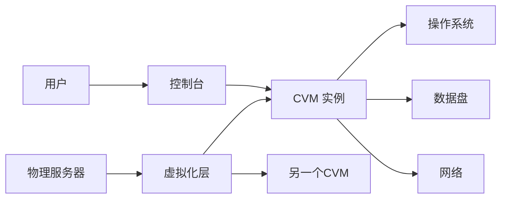
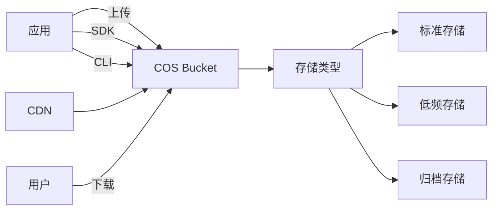
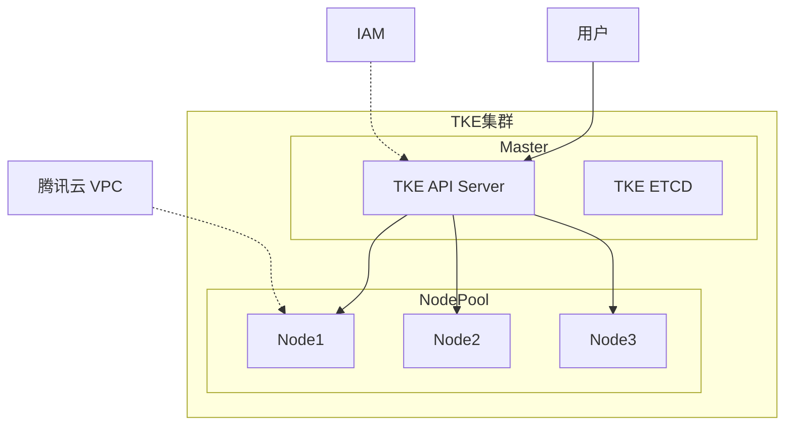

+++
title = "第67章：腾讯云"
weight = 670
date = "2026-03-24T13:18:28+08:00"
type = "docs"
description = ""
isCJKLanguage = true
draft = false
+++


# 第六十七章：腾讯云

## 67.1 CVM

### 什么是腾讯云 CVM？

CVM（Cloud Virtual Machine）是腾讯云的云服务器，和阿里云 ECS、AWS EC2 本质上是一样的——都是云端租服务器。


```mermaid
graph LR
    A[用户] --> B[控制台]
    B --> C[CVM 实例]
    C --> D[操作系统]
    C --> E[数据盘]
    C --> F[网络]
    
    G[物理服务器] --> H[虚拟化层]
    H --> C
    H --> I[另一个CVM]
```

### 腾讯云 vs 阿里云 vs AWS

| 对比项 | 腾讯云 | 阿里云 | AWS |
|--------|--------|--------|-----|
| 云服务器 | CVM | ECS | EC2 |
| 对象存储 | COS | OSS | S3 |
| VPC | VPC | VPC | VPC |
| 容器服务 | TKE | ACK | EKS |
| 计费模式 | 按量/包年包月 | 同 | 同 |
| 地域 | 国内+海外 | 国内+海外 | 全球 |

### 创建 CVM 实例

```bash
# 1. 安装腾讯云 CLI
pip install tccli

# 2. 配置
tccli configure

# 3. 创建 VPC（如果没有）
tccli vpc CreateVpc \
    --VpcName my-vpc \
    --CidrBlock 10.0.0.0/16

# 4. 创建子网
tccli vpc CreateSubnet \
    --VpcId vpc-xxxx \
    --SubnetName my-subnet \
    --CidrBlock 10.0.1.0/24 \
    --Zone ap-guangzhou-3

# 5. 创建安全组
tccli cvm CreateSecurityGroup \
    --SecurityGroupName my-sg \
    --ProjectId 0

# 6. 添加安全组规则
tccli cvm AuthorizeSecurityGroupPolicy \
    --SecurityGroupId sg-xxxx \
    --Version 2017-03-12 \
    --Policy '[{"Protocol":"tcp","Port":"22","CidrIp":"203.0.113.5/32","Action":"accept"}]'
# 注意两点：
# 1) 别把 22 端口开给 0.0.0.0/0，改成你自己的出口 IP（或用跳板机/VPN）
# 2) 腾讯云安全组同样是"只允许、不拒绝"的白名单模型，
#    Policy 描述的是"放行哪些规则"，没有 deny；
#    需要"封禁某个 IP"要靠云防火墙或在主机上用 iptables/firewalld
# 3) 参数的具体写法随 tccli 版本略有差异，拿不准时先看：
#    tccli cvm AuthorizeSecurityGroupPolicy help

# 7. 创建密钥对
tccli cvm CreateKeyPair \
    --KeyName my-key

# 下载私钥到本地
# 保存到 ~/.ssh/tc_key.pem
chmod 400 ~/.ssh/tc_key.pem

# 8. 创建 CVM 实例
tccli cvm RunInstances \
    --InstanceChargeType POSTPAID_BY_HOUR \
    --InstanceType S5.MEDIUM2 \
    --ImageId img-xxxxxxxx \
    --InstanceCount 1 \
    --SubnetId subnet-xxxx \
    --SecurityGroupIds '["sg-xxxx"]' \
    --KeyIds '["key-xxxx"]' \
    --InstanceName my-cvm
```

> **规格名的读法**：腾讯云的实例规格形如 `S5.MEDIUM2`、`S5.LARGE8`，
> 前面的字母数字是**机型族与代数**（S=标准型、C=计算型、M=内存型、GN=GPU 等），
> **后面的数字表示内存大小（GB）**。所以 `S5.LARGE8` 是"2 核 8G"，
> 而 `S5.MEDIUM2` 是"1 核 2G"。选型前建议先看官方规格表，别只看名字猜。
>
> **`img-xxxxxxxx` 从哪来**：用 `tccli cvm DescribeImages` 查询当前地域可用的镜像 ID。
> 和 AWS 一样，**镜像 ID 是按地域划分的**，从别的文档抄来的 ID 在你的地域可能不存在。
> 另外腾讯云已不再提供新的 CentOS 公共镜像（CentOS 已停止维护），
> 新机器建议选 **TencentOS Server** 或 Ubuntu LTS。

### 连接 CVM

```bash
# Linux 实例
ssh -i ~/.ssh/tc_key.pem ubuntu@你的公网IP

# 如果是 Linux 轻量应用服务器
ssh -i ~/.ssh/tc_key.pem lighthouse@你的公网IP

# 用户名同样取决于镜像：
#   Ubuntu 镜像 → ubuntu（轻量应用服务器的 Ubuntu 镜像默认是 lighthouse）
#   CentOS / TencentOS 镜像 → root
#   Debian 镜像 → debian
# 拿不准时在控制台"重置密码"页面会直接告诉你默认用户名

# Windows 实例请用远程桌面（mstsc）连接 公网IP:3389，
# 密码在控制台"重置密码"里设置（不是 Linux 那种密钥对方式）
```

### CVM 日常管理

```bash
# 查看实例
tccli cvm DescribeInstances

# 启动实例
tccli cvm StartInstances \
    --InstanceIds '["ins-xxxx"]'

# 停止实例
tccli cvm StopInstances \
    --InstanceIds '["ins-xxxx"]'

# 重启实例
tccli cvm RebootInstances \
    --InstanceIds '["ins-xxxx"]'

# 重装系统
tccli cvm ResetInstance \
    --InstanceId ins-xxxx \
    --ImageId img-yyyyy \
    --LoginSettings '{"Password":"YourStrongP@ssw0rd"}'

# ⚠️ 重装系统会清空系统盘数据，属于不可逆操作；
#    执行前请确认重要数据已备份或已制作快照

# 调整配置
tccli cvm ResizeInstance \
    --InstanceId ins-xxxx \
    --InstanceType S5.LARGE8
```

### 腾讯云特色服务

```bash
# 轻量应用服务器（入门首选，便宜！）
tccli lighthouse CreateInstances \
    --BundleId lb-xxxxxxxx \
    --InstanceName my-lighthouse \
    --LoginSettings '{"Password":"YourStrongP@ssw0rd"}'

# 黑石物理服务器（裸金属，物理机性能）
tccli bmc CreatePhysicalBindings \
    --InstanceType PM4.Large
```

> **轻量应用服务器（Lighthouse）和 CVM 怎么选**
>
> | 维度 | 轻量应用服务器 | CVM |
> |------|----------------|-----|
> | 定位 | 建站、博客、小程序后端、学习 | 通用云服务器，可搭建任意架构 |
> | 计费 | 固定套餐（含带宽与流量），价格便宜透明 | 按配置单独计费，组合灵活 |
> | 网络 | 套餐内带宽较高，但**不能加入自定义 VPC 的复杂组网** | 完全在 VPC 内，可做负载均衡、专线、多可用区 |
> | 扩展 | 升配有限、不能挂太多云盘 | 可随时升配、挂多块云盘、加入弹性伸缩 |
> | 适用 | 个人项目、小网站 | 生产系统、企业架构 |
>
> 一句话：**练手和个人站点用轻量，正经业务用 CVM**。

## 67.2 COS

### 什么是 COS？

COS（Cloud Object Storage）是腾讯云的对象存储，和阿里云 OSS、AWS S3 是同类产品。


```mermaid
graph LR
    A[应用] -->|上传| B[COS Bucket]
    A -->|SDK| B
    A -->|CLI| B
    
    B --> C[存储类型]
    C --> D[标准存储]
    C --> E[低频存储]
    C --> F[归档存储]
    
    G[CDN] --> B
    H[用户] -->|下载| B
```

### COS 存储类型

| 类型 | 说明 | 最低存储时间 |
|------|------|-------------|
| 标准存储 | 频繁访问，毫秒级读取 | 无 |
| 低频存储 | 每月访问 1~2 次 | 30 天 |
| 智能分层存储 | 访问模式不固定，系统自动在标准/低频之间迁移 | 30 天 |
| 归档存储 | 长期存档，**读取前需先解冻**（一般几分钟） | 90 天 |
| 深度归档存储 | 超长期合规存档，解冻需要**数小时** | 180 天 |

> **"最低存储时间"的意思是：存不满这个时长就删除，仍按最低时长计费。**
> 比如归档存储要求 90 天，你只存了 10 天就删，依然按 90 天收费。
> 所以低频/归档类适合"确定长期不动"的数据，
> 拿它存"随时会变、随时会删"的文件反而更贵。
>
> 另外别忘了**解冻（取回）有费用也有等待时间**：
> 归档类对象想读取必须先发起解冻请求，等数据可用后才能下载。
> 所以"把备份放归档"没问题，但**别把归档当在线存储用**。

### 使用 COS

```bash
# 1. 安装 COS 命令行工具
# ⚠️ 先分清两个工具，它们的命令完全不同：
#    coscli —— Go 编写的独立二进制，命令风格像 aws s3 / rclone（本节示例都用它）
#    coscmd —— Python 编写的（pip install coscmd），命令是 upload/download/list/delete
# pip install cos-python-sdk-v5 装的是 **Python SDK**（在代码里调用），
# 它并不会提供 coscli 命令——这是本节早期版本的一个错误
#
# 安装 coscli（Linux x86_64 示例，其他平台见官方文档）
wget https://github.com/tencentyun/coscli/releases/download/v0.14.0/coscli-linux
chmod +x coscli-linux && sudo mv coscli-linux /usr/local/bin/coscli

# 2. 配置
coscli config

# 3. 创建 Bucket
coscli mb cos://my-bucket-1234567890

# 4. 上传文件
coscli cp myfile.txt cos://my-bucket/

# 5. 列出文件
coscli ls cos://my-bucket/

# 6. 下载文件
coscli cp cos://my-bucket/myfile.txt ./

# 7. 删除文件
coscli rm cos://my-bucket/myfile.txt

# 8. 同步上传
coscli sync ./folder cos://my-bucket/folder/
```

> **如果更习惯 Python 版工具（coscmd）**，命令对应关系如下，
> 注意两者**不能混用**（coscmd 没有 `cp`/`mb` 这些子命令）：
>
> | 目的 | coscli 写法 | coscmd 写法 |
> |------|-------------|-------------|
> | 配置 | `coscli config` | `coscmd config -a <SecretId> -s <SecretKey> -b <bucket> -r <region>` |
> | 上传 | `coscli cp a.txt cos://b/` | `coscmd upload a.txt /` |
> | 下载 | `coscli cp cos://b/a.txt ./` | `coscmd download /a.txt ./` |
> | 列举 | `coscli ls cos://b/` | `coscmd list` |
> | 同步目录 | `coscli sync ./d cos://b/d/` | `coscmd sync ./d /d/` |

### COS SDK 使用

```python
# Python SDK 示例
from qcloud_cos import CosConfig
from qcloud_cos import CosS3Client

# 配置
config = CosConfig(
    Region='ap-guangzhou',
    SecretId='你的SecretId',
    SecretKey='你的SecretKey'
)
client = CosS3Client(config)

# 也可以不把密钥写死在代码里，改用环境变量读取：
#   import os
#   config = CosConfig(Region='ap-guangzhou',
#                      SecretId=os.environ['COS_SECRET_ID'],
#                      SecretKey=os.environ['COS_SECRET_KEY'])

# 上传文件
response = client.put_object(
    Bucket='my-bucket-1234567890',
    Body=open('myfile.txt', 'rb'),
    Key='myfile.txt'
)

# 下载文件
response = client.get_object(
    Bucket='my-bucket-1234567890',
    Key='myfile.txt'
)

# 生成预签名 URL
url = client.generate_download_url(
    Bucket='my-bucket-1234567890',
    Key='myfile.txt',
    Expired=3600
)
print(f"下载链接: {url}")
```

### COS 权限控制

```bash
# 1. 设置 Bucket 权限
# 公共读
coscli put-bucket-acl --bucket my-bucket --acl public-read

# 私有读写
coscli put-bucket-acl --bucket my-bucket --acl private

# 2. 设置 Policy
coscli put-bucket-policy --bucket my-bucket --policy-file policy.json

# policy.json
cat > policy.json << 'EOF'
{
  "Statement": [
    {
      "Effect": "Allow",
      "Principal": {
        "qcs": ["qcs::cam::uin/123456789:uin/123456789"]
      },
      "Action": ["cos:GetObject"],
      "Resource": ["qcs::cos:ap-guangzhou:uid/123456789:my-bucket/*"]
    }
  ]
}
EOF
```

> **不要把 SecretId / SecretKey 硬编码在代码里**：这两个值等同于账号权限，
> 一旦提交到 Git 就等于泄露。更稳妥的做法是放在环境变量中，
> 或者给程序单独创建一个 **CAM 子账号并只授予所需权限**；
> 在 CVM 内部还可以使用实例角色/临时密钥（STS）。
>
> **⚠️ 也不要把生产 Bucket 设成公共读。** 这是数据泄露事故的头号原因：
> 一旦设为公共读，任何人拿到 URL 就能下载桶里的文件，
> 包括本不该公开的备份、日志、用户上传的证件照片等。
> 需要对外提供静态资源时，推荐做法是**桶保持私有，通过 CDN 回源 + 私有桶授权**，
> 再叠加**防盗链与 URL 签名**来控制访问范围与时效。
>
> 另外，COS 的 ACL / Policy / 防盗链 / 静态网站这些"桶级配置"，
> 在 coscli 里对应 `bucket-acl`、`bucket-policy`、`bucket-referer`、`bucket-website` 等子命令，
> **具体参数请以 `coscli <子命令> --help` 的输出为准**（不同版本参数名有差异）。
> 拿不准时直接在控制台配置更稳妥，也更容易留下操作记录。

### COS 防盗链和 CDN

```bash
# 开启防盗链
coscli put-bucket-referer --bucket my-bucket --referer-config "https://example.com,https://www.example.com"

# 设置静态网站
coscli put-bucket-website --bucket my-bucket --website-config-file website.json

# website.json
cat > website.json << 'EOF'
{
  "IndexDocument": {
    "Suffix": "index.html"
  },
  "ErrorDocument": {
    "Key": "error.html"
  }
}
EOF
```

## 67.3 TKE

### 什么是 TKE？

TKE（Tencent Kubernetes Engine）是腾讯云的托管 Kubernetes 服务，和阿里云 ACK、AWS EKS 是同类产品。


```mermaid
graph TB
    subgraph TKE集群
        subgraph Master
            API[TKE API Server]
            ETCD[TKE ETCD]
        end
        
        subgraph NodePool
            NP1[Node1]
            NP2[Node2]
            NP3[Node3]
        end
    end
    
    U[用户] --> API
    API --> NP1
    API --> NP2
    API --> NP3
    
    V[腾讯云 VPC] -.-> NP1
    I[IAM] -.-> API
```

### 创建 TKE 集群

```bash
# 1. 使用控制台创建（推荐）

# 2. 或者使用 CLI
tccli tke CreateCluster \
    --ClusterVersion 1.30 \
    --ClusterName my-cluster \
    --VpcId vpc-xxxx \
    --SubnetIds '["subnet-xxxx"]' \
    --ClusterType managed

# 注意：集群创建完还只是"控制面"，节点要另外创建（见下面的"节点池"一节）。
# --NodePool 是必填的复杂结构参数，写成光秃秃的 --NodePool 会直接报参数错误
# （CLI 里形如 --NodePool '{"NodePoolName":...}' 或写成 --cli-unfold-argument 的展开形式）
# 所以这里故意不写它，避免给出一个跑不通的命令

# 3. 配置 kubectl
tccli configure set secretId 你的SecretId
tccli configure set secretKey 你的SecretKey
tccli configure set region ap-guangzhou

# 获取集群凭证
# 注意：DescribeClusterKubeconfig 没有 --File 参数（老写法是错的），
# 它返回 JSON，kubeconfig 只是其中的一个字段，需要取出来写入文件
tccli tke DescribeClusterKubeconfig \
    --ClusterId cls-xxxx \
    --IsExtranet true > kubeconfig.json

# 从 JSON 中取出 kubeconfig 内容（字段名以实际输出为准）
python3 -c "import json;print(json.load(open('kubeconfig.json'))['Kubeconfig'])" > kubecfg

# 更省事：在 TKE 控制台"集群 → 基本信息 → 连接信息"里直接下载 kubeconfig

export KUBECONFIG=./kubecfg

# 4. 验证
kubectl get nodes
```

> **`IsExtranet` 选 true 还是 false**：`--IsExtranet true` 得到的是**公网端点**的 kubeconfig，
> 适合在自己的电脑上操作；如果只在 VPC 内使用（跳板机、CI 机器），
> 用内网端点更安全也更稳定。
> **安全提醒**：开启公网访问的集群，一定要在 API Server 访问白名单里只放行自己的出口 IP，
> 否则等于把集群控制面暴露给全网的扫描器。

### TKE 节点池

```bash
# 创建节点池
tccli tke CreateNodePool \
    --ClusterId cls-xxxx \
    --NodePoolName my-pool \
    --AutoScalingGroupDesiredSize 2 \
    --AutoScalingGroupMaxSize 5 \
    --AutoScalingGroupMinSize 1

# 手动添加节点
tccli tke AddExistedInstances \
    --ClusterId cls-xxxx \
    --InstanceIds '["ins-xxxx"]' \
    --NodePoolId np-xxxx

# 节点池伸缩
tccli tke ModifyNodePoolDesiredSize \
    --ClusterId cls-xxxx \
    --NodePoolId np-xxxx \
    --DesiredSize 3
```

> **上面"创建节点池"的命令在真实环境跑不通**，因为它缺少了必要的参数：
> 至少还要有节点类型 `--NodePoolType`、实例规格 `--InstanceType`、
> 所在子网 `--SubnetIds`、安全组 `--SecurityGroupIds` 等。
> 实际使用时，建议照抄控制台的"命令行示例"（TKE 创建节点池页面里有），
> 或用 Terraform 管理，比手拼参数可靠得多。

### TKE 网络

```bash
# Global Router 模式（默认）
# VPC-CNI 模式（性能更好，Pod 有独立 IP）
tccli tke CreateCluster \
    --ClusterVersion 1.30 \
    --NetworkMode VPC_CNI \
    --VpcId vpc-xxxx \
    --CniType eni \
    --SubnetIds '["subnet-xxxx"]'
```

> **两个网络模式的差别，决定了 Pod IP 长什么样**
>
> | 模式 | Pod IP 从哪来 | 特点 |
> |------|---------------|------|
> | Global Router（全局路由，旧集群默认） | 集群自管的一段地址，与 VPC 不同网段 | 靠路由转发，Pod IP 在 VPC 外，排查链路更长 |
> | VPC-CNI | **直接分配 VPC 子网里的 IP** | 性能好、Pod 可直接被 VPC 内其他资源访问；但占用 VPC IP 资源 |
>
> 新集群建议用 **VPC-CNI**（其中还分共享网卡与独立网卡等子模式），
> 但要提前算好 **VPC 子网的 IP 容量**：Pod 数量多的时候，
> 很容易出现"节点够用但 IP 不够、Pod 起不来"的情况。
>
> 另外上面的 `--CniTypeeni` 是老版本里的笔误，正确写法是 `--CniType eni`
> （参数名与取值请以 `tccli tke CreateCluster help` 为准）。

### TKE 存储

```bash
# 安装 CBS CSI 插件
# ⚠️ 老写法 `tccli tke CreateCluster --ClusterId cls-xxxx ...` 是错的：
# CreateCluster 是"创建集群"的接口，不会接受已存在的集群 ID。
# 给已有集群装组件应该用 InstallAddon（或直接在控制台的组件管理里安装）
tccli tke InstallAddon \
    --ClusterId cls-xxxx \
    --AddonName cbs-csi

# 创建 StorageClass
cat > cbs-sc.yaml << 'EOF'
apiVersion: storage.k8s.io/v1
kind: StorageClass
metadata:
  name: cbs-sc
provisioner: com.tencent.cloud.csi.cbs
parameters:
  type: CLOUD_SSD
  throughput: 300
volumeBindingMode: WaitForFirstConsumer
EOF

kubectl apply -f cbs-sc.yaml
```

> **注意两个容易过时的点**
>
> - **驱动名**：老集群里的 `cloud.tencent.com/qcloudCBS` 属于早期的 in-tree/flexVolume 方案，
>   现在统一用 **CSI**，provisioner 是 `com.tencent.cloud.csi.cbs`
>   （云硬盘类参数常见取值有 `CLOUD_SSD`、`CLOUD_PREMIUM`、`CLOUD_HSSD` 等）。
> - **`volumeBindingMode: WaitForFirstConsumer` 很重要**：云硬盘与可用区绑定，
>   这个设置让"先调度 Pod、再创建盘"，避免盘建在 A 区、Pod 却被调度到 B 区而挂载失败。
>
> 装完 CSI 后记得先 `kubectl get storageclass` 看是否已有默认存储类，
> 大多数场景直接用默认类 + PVC 即可，不必手写 StorageClass。

### TKE 运维

```bash
# 集群升级
# 注意：升级集群/节点的接口名与参数随 TKE 版本变化较大，
# 这里给出的是最常见的做法（以 tccli tke --help 的输出为准）
tccli tke UpdateClusterVersion \
    --ClusterId cls-xxxx \
    --ClusterVersion 1.30

# 升级前务必：先看"版本发布说明"确认兼容性 → 在测试集群验证 → 备份 etcd/配置

# 节点排水
kubectl drain node_name --ignore-daemonsets --delete-emptydir-data

# 查看集群事件
kubectl get events --sort-by='.lastTimestamp'

# 日志查看
kubectl logs -n kube-system deployment/tke-eni-ipamd -f
```

> **Kubernetes 版本是有"保质期"的**：各大云厂商通常只维护最近几个小版本，
> 停维之后不仅拿不到安全补丁，还可能被强制要求升级（甚至额外收费）。
> 所以不要"建好就不管"——把 **K8s 版本升级**纳入日常运维计划，
> 每次只升一个小版本，并提前阅读发布说明里的"不兼容变更"。

### Serverless Kubernetes（ASK）

```bash
# 创建 Serverless 集群
tccli tke CreateCluster \
    --ClusterType serverless \
    --ClusterName my-serverless-cluster \
    --VpcId vpc-xxxx

# 直接部署 Pod（无需管理节点）
cat > pod.yaml << 'EOF'
apiVersion: v1
kind: Pod
metadata:
  name: my-pod
spec:
  containers:
  - name: nginx
    image: nginx:latest
    resources:
      requests:
        cpu: "0.25"
        memory: "256Mi"
      limits:
        cpu: "0.5"
        memory: "512Mi"
EOF

kubectl apply -f pod.yaml
```

> **弹性集群（Serverless）的取值与计费**：集群类型的具体取值随 CLI 版本变化
> （历史上叫过 `EKS`、`serverless` 等），请以 `tccli tke CreateCluster help` 为准。
> 计费上看两件事：**Pod 申请的 CPU/内存规格**（按秒计费，最小 0.25 核）
> 和**是否使用了预留资源**。好处是"不用管节点"，
> 代价是单价高于自建节点，而且 **DaemonSet、特权容器、hostNetwork 都不支持**，
> 日志与监控的采集方式也要相应调整。

## 67.4 CAM 与账号安全

腾讯云的权限体系叫 **CAM（Cloud Access Management）**，和阿里云 RAM、AWS IAM 角色相同。
云上绝大多数安全事故的起点都是"密钥泄露"，所以这一节比记住任何命令都重要。

| 概念 | 说明 |
|------|------|
| 主账号（根账号） | 拥有全部权限，只用于开通账号、设置账单、创建子账号 |
| 子账号（子用户） | 日常操作使用，按需授予策略 |
| 协作者 | 把其他主账号拉进来协作，权限由策略控制 |
| 角色（Role） | 给服务或跨账号使用，**没有长期密钥**，靠临时凭证 |
| 临时密钥（STS） | 有效期短，适合程序、CI/CD、前端直传 |

```bash
# 查看当前账号的 AppId（确认自己在用哪个账号）
tccli cam GetUserAppId

# 查看子账号列表
tccli cam ListUsers

# 查看某个子账号挂了哪些策略（排查"权限为什么这么大"）
tccli cam ListAttachedUserPolicies --TargetUin 123456789
```

> **必须做到的五件事**
>
> 1. **主账号开启 MFA**，并且不给主账号创建 API 密钥。
> 2. 程序一律使用**子账号 + 最小权限策略**；前端直传用**临时密钥（STS）**，
>    绝不把长期密钥发到浏览器。
> 3. 密钥**不要写进代码/镜像/配置文件**，改用环境变量或密钥管理系统，并定期轮换。
> 4. 开启**操作审计（CloudAudit）**，对敏感操作（创建密钥、修改安全组）配置告警。
> 5. 配置**费用告警**，避免被恶意挖矿刷出天价账单。

## 67.5 三朵云横向对照

看完第 65、66 章后，这张表能帮你把知识"串成一根线"——**概念是共通的，只是名字不同**：

| 能力 | 腾讯云 | 阿里云 | AWS |
|------|--------|--------|-----|
| 云服务器 | CVM / Lighthouse | ECS / 轻量应用服务器 | EC2 / Lightsail |
| 对象存储 | COS | OSS | S3 |
| 块存储 | CBS | ESSD 云盘 | EBS |
| 私有网络 | VPC | VPC | VPC |
| 防火墙 | 安全组（仅允许） | 安全组（仅允许） | 安全组（仅允许）+ NACL（**可拒绝**） |
| 负载均衡 | CLB | SLB | ELB（ALB/NLB） |
| 容器服务 | TKE / ASK | ACK | EKS / Fargate |
| 权限体系 | CAM | RAM | IAM |
| CDN | CDN | CDN | CloudFront |

> **跨云迁移时最需要注意的差异**：AWS 的网络 ACL 可以显式拒绝，
> 而腾讯云/阿里云的安全组都是**只允许**；AWS 对**所有**公网 IPv4 地址收费，
> 国内云的公网 IP 通常绑定在带宽套餐里；对象存储的存储类名称、
> 最低存储时长、解冻时间也各不相同。迁移前务必把网络与计费模型重新核对一遍。

## 本章小结

本章我们学习了腾讯云的核心服务：

| 服务 | 说明 |
|------|------|
| CVM | 云服务器；规格名后缀数字代表内存 GB，镜像 ID 按地域划分 |
| COS | 对象存储；注意存储类的最低存储时间与解冻时间 |
| VPC | 私有网络，安全组同样是"只允许"白名单 |
| TKE / ASK | 托管与弹性 Kubernetes；网络模式影响 Pod IP 与容量规划 |
| Lighthouse | 轻量应用服务器，套餐固定、便宜，适合个人项目 |
| CAM | 权限体系，账号安全的基础 |

腾讯云的特色：
- 游戏领域沉淀深厚
- 微信生态集成好
- 轻量应用服务器性价比高
- 音视频能力强大

最后归纳成三条：

1. **命令要"核对"而不是"照抄"**：云厂商 CLI 的接口名与参数在版本间会变，
   拿不准时先跑 `tccli <产品> <接口> help`，比照抄博客安全得多。
2. **默认私有、按需开放**：安全组只放行必要来源，COS 桶保持私有并用 CDN 暴露。
3. **先管身份，再管资源**：主账号只用来开账号和设账单，程序一律使用子账号/角色与临时密钥。

---

> 💡 **温馨提示**：
> 腾讯云和微信小程序、云开发等腾讯系产品集成紧密，如果你要做微信相关开发，腾讯云是不错的选择！

---

**第六十七章：腾讯云 — 完结！** 🎉

下一章我们将学习"IaC 基础设施即代码"，掌握 Terraform 的使用方法。敬请期待！ 🚀
