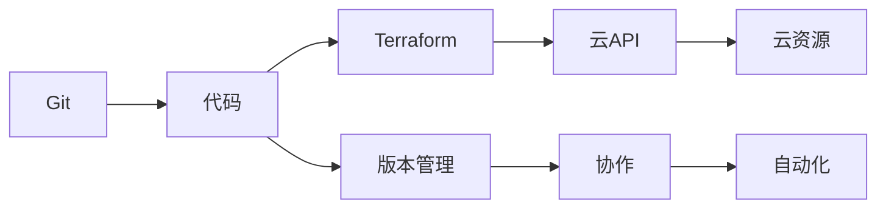
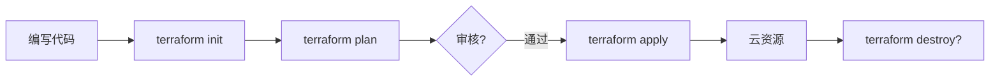

+++
title = "第68章：IaC（基础设施即代码）"
weight = 680
date = "2026-03-24T13:18:28+08:00"
type = "docs"
description = ""
isCJKLanguage = true
draft = false
+++


# 第六十八章：IaC（基础设施即代码）

## 68.1 Terraform 基础

### 什么是 IaC？

IaC（Infrastructure as Code）就是"用代码管理基础设施"。以前我们管理服务器，要手动点击控制台或者敲命令；现在把基础设施写成代码，版本化管理，一键部署！



### Terraform vs 手动操作

| 对比 | Terraform | 手动操作 |
|------|-----------|---------|
| 速度 | 几分钟搞定 | 几小时 |
| 一致性 | 每次都一样 | 人为失误 |
| 可重复 | 想部署多少部署多少 | 重复操作烦死人 |
| 版本控制 | 代码在 Git 里 | 配置在脑子里 |
| 审计 | 谁改了什么一清二楚 | 不知道谁改的 |

### 安装 Terraform

```bash
# macOS
brew install terraform

# Linux
wget https://releases.hashicorp.com/terraform/1.6.0/terraform_1.6.0_linux_amd64.zip
unzip terraform_1.6.0_linux_amd64.zip
sudo mv terraform /usr/local/bin/
chmod +x /usr/local/bin/terraform

# Windows (使用 Chocolatey)
choco install terraform

# 验证
terraform --version
# Terraform v1.6.0（版本号可能不同，建议查看最新版本）

# 查看最新版本：https://github.com/hashicorp/terraform/releases
```

### Terraform 基本概念

| 概念 | 说明 |
|------|------|
| Provider | 云服务提供商插件 |
| Resource | 云资源 |
| Data Source | 数据源 |
| Variable | 变量 |
| Output | 输出 |
| State | 状态文件 |

### 第一个 Terraform 项目

```bash
# 创建项目目录
mkdir my-terraform-project
cd my-terraform-project

# 创建配置文件
cat > main.tf << 'EOF'
# 指定 Provider
provider "aws" {
  region = "us-east-1"
}

# 创建资源
resource "aws_instance" "web" {
  # 注意：AMI ID 会因地区和时间变化，请根据实际查询
  # 查询命令：aws ec2 describe-images --owners amazon --filters "Name=name,Values=amzn2-ami-hvm-*-x86_64-gp2"
  ami           = "ami-0c55b159cbfafe1f0"  # 示例 AMI ID，请替换为实际可用的 ID
  instance_type = "t3.micro"
  
  tags = {
    Name        = "my-web-server"
    Environment = "production"
  }
}

# 定义输出
output "instance_ip" {
  value = aws_instance.web.public_ip
}
EOF
```

### Terraform 工作流程

```bash
# 1. 初始化（下载 Provider）
terraform init

# 2. 格式化代码
terraform fmt

# 3. 验证配置
terraform validate

# 4. 预览执行计划
terraform plan

# 5. 应用配置（创建资源）
terraform apply

# 6. 销毁资源
terraform destroy
```

### Terraform 变量

```hcl
# variables.tf
variable "instance_type" {
  description = "EC2 实例类型"
  type        = string
  default     = "t3.micro"
}

variable "ami_id" {
  description = "AMI ID"
  type        = string
}

variable "environment" {
  description = "环境名称"
  type        = string
  default     = "production"
}

variable "tags" {
  description = "资源标签"
  type        = map(string)
  default     = {
    Project = "myapp"
  }
}
```

### Terraform 输出

```hcl
# outputs.tf
output "instance_id" {
  description = "EC2 实例 ID"
  value       = aws_instance.web.id
}

output "public_ip" {
  description = "公网 IP"
  value       = aws_instance.web.public_ip
}

output "private_ip" {
  description = "私网 IP"
  value       = aws_instance.web.private_ip
}

output "security_group" {
  description = "安全组 ID"
  value       = aws_security_group.web.id
  sensitive   = true  # 敏感输出
}
```

## 68.2 云 Provider

### AWS Provider

```hcl
# AWS Provider 配置
provider "aws" {
  region     = "us-east-1"
  access_key = "你的AccessKey"
  secret_key = "你的SecretKey"
  
  # 或者使用环境变量
  # AWS_ACCESS_KEY_ID
  # AWS_SECRET_ACCESS_KEY
}

# 使用别名（多地区配置）
provider "aws" {
  alias  = "west"
  region = "us-west-2"
}

# 在资源中引用
resource "aws_instance" "web_west" {
  provider = aws.west
  ami      = "ami-xxxx"
  # ...
}
```

### 阿里云 Provider

```hcl
# 安装阿里云 Provider
terraform {
  required_providers {
    alicloud = {
      source  = "aliyun/alicloud"
      version = "1.200.0"
    }
  }
}

provider "alicloud" {
  region     = "cn-hangzhou"
  access_key = "你的AccessKey"
  secret_key = "你的SecretKey"
}

# 创建 ECS 实例
resource "alicloud_instance" "web" {
  instance_name        = "my-web-server"
  instance_type        = "ecs.t5-lc1m2.small"
  image_id            = "ubuntu_22_04_x64_20G_alibase_2023xxxx.vhd"
  vswitch_id          = "vsw-xxxx"
  security_groups      = ["sg-xxxx"]
  
  internet_max_bandwidth_out = 1
}

# 创建 VPC
resource "alicloud_vpc" "main" {
  vpc_name       = "my-vpc"
  cidr_block     = "10.0.0.0/16"
}

# 创建安全组
resource "alicloud_security_group" "web" {
  name   = "my-security-group"
  vpc_id = alicloud_vpc.main.id
}

# 添加安全组规则
resource "alicloud_security_group_rule" "ssh" {
  type              = "ingress"
  ip_protocol       = "tcp"
  nic_type          = "intranet"
  policy            = "accept"
  port_range        = "22/22"
  cidr_ip          = "0.0.0.0/0"
  security_group_id = alicloud_security_group.web.id
}
```

### 腾讯云 Provider

```hcl
# 腾讯云 Provider
terraform {
  required_providers {
    tencentcloud = {
      source  = "tencentcloudstack/tencentcloud"
      version = "~> 1.60"
    }
  }
}

provider "tencentcloud" {
  region = "ap-guangzhou"
  secret_id  = "你的SecretId"
  secret_key = "你的SecretKey"
}

# 创建 VPC
resource "tencentcloud_vpc" "main" {
  name         = "my-vpc"
  cidr_block   = "10.0.0.0/16"
}

# 创建子网
resource "tencentcloud_subnet" "my_subnet" {
  name              = "my-subnet"
  vpc_id            = tencentcloud_vpc.main.id
  cidr_block        = "10.0.1.0/24"
  availability_zone = "ap-guangzhou-3"
}

# 创建 CVM
resource "tencentcloud_instance" "web" {
  instance_name = "my-web-server"
  instance_type = "S5.MEDIUM2"
  image_id      = "img-xxxxxxxx"
  subnet_id     = tencentcloud_subnet.my_subnet.id
  security_groups = [tencentcloud_security_group.my_sg.id]
}
```

### Azure Provider

```hcl
# Azure Provider
provider "azurerm" {
  features {}
  subscription_id = "你的订阅ID"
  tenant_id      = "你的租户ID"
  client_id      = "你的客户端ID"
  client_secret  = "你的客户端密钥"
}

# 创建资源组
resource "azurerm_resource_group" "main" {
  name     = "my-resource-group"
  location = "eastus"
}

# 创建虚拟网络
resource "azurerm_virtual_network" "main" {
  name                = "my-vnet"
  address_space       = ["10.0.0.0/16"]
  location            = azurerm_resource_group.main.location
  resource_group_name = azurerm_resource_group.main.name
}

# 创建虚拟机
resource "azurerm_virtual_machine" "web" {
  name                  = "my-web-server"
  location              = azurerm_resource_group.main.location
  resource_group_name   = azurerm_resource_group.main.name
  network_interface_ids = [azurerm_network_interface.main.id]
  vm_size              = "Standard_DS1_v2"
  
  os_profile_linux_config {
    disable_password_authentication = true
    ssh_keys {
      key_data = file("~/.ssh/id_rsa.pub")
      path     = "/home/azureuser/.ssh/authorized_keys"
    }
  }
}
```

### Google Cloud Provider

```hcl
# GCP Provider
provider "google" {
  project = "my-project"
  region  = "us-central1"
  zone    = "us-central1-a"
}

# 创建实例
resource "google_compute_instance" "web" {
  name         = "my-web-server"
  machine_type = "e2-micro"
  zone         = "us-central1-a"
  
  boot_disk {
    initialize_params {
      image = "debian-cloud/debian-11"
    }
  }
  
  network_interface {
    network = "default"
    access_config {
      // 临时公网 IP
    }
  }
}
```

### 多 Provider 组合

```hcl
# 同时使用 AWS 和阿里云
terraform {
  required_providers {
    aws = {
      source = "hashicorp/aws"
    }
    alicloud = {
      source = "aliyun/alicloud"
    }
  }
}

provider "aws" {
  region = "us-east-1"
}

provider "alicloud" {
  region = "cn-hangzhou"
}

# AWS 上的 Web 服务器
resource "aws_instance" "web_us" {
  ami           = "ami-xxxx"
  instance_type = "t3.micro"
}

# 阿里云上的数据库
resource "alicloud_db_instance" "db" {
  engine               = "MySQL"
  engine_version       = "8.0"
  instance_type        = "mysql.n2.serverless.1c2g"
  instance_storage     = 200
  vswitch_id          = "vsw-xxxx"
}
```

## 68.3 Terraform 进阶

### 数据源

```hcl
# 获取 AMI 信息
data "aws_ami" "ubuntu" {
  most_recent = true
  owners      = ["099720109477"]  # Canonical
  
  filter {
    name   = "name"
    values = ["ubuntu/images/hvm-ssd/ubuntu-jammy-22.04-amd64-server-*"]
  }
}

# 使用数据源
resource "aws_instance" "web" {
  ami           = data.aws_ami.ubuntu.id
  instance_type = "t3.micro"
}

# 获取可用区
data "aws_availability_zones" "available" {
  state = "available"
}

# 获取 VPC 信息
data "aws_vpc" "existing" {
  filter {
    name   = "tag:Name"
    values = ["my-vpc"]
  }
}
```

### 资源依赖

```hcl
# 隐式依赖（Terraform 自动推断）
resource "aws_security_group" "web" {
  name = "web-sg"
}

resource "aws_instance" "web" {
  ami               = "ami-xxxx"
  instance_type     = "t3.micro"
  security_groups  = [aws_security_group.web.id]  # 依赖 web-sg
}

# 显式依赖（手动指定）
resource "aws_instance" "app" {
  ami           = "ami-xxxx"
  instance_type = "t3.micro"
  
  # 依赖另一个资源，但不直接引用
  depends_on = [
    aws_security_group.web
  ]
}
```

### 条件表达式

```hcl
# 条件创建资源
resource "aws_instance" "web" {
  count         = var.enable_web ? 1 : 0
  ami           = "ami-xxxx"
  instance_type = var.instance_type
  
  tags = {
    Name = "web-server"
  }
}

# 条件赋值
locals {
  environment = var.is_production ? "prod" : "dev"
  instance_name = var.environment == "prod" ? "web-prod" : "web-dev"
}
```

### 循环

```hcl
# count 循环
resource "aws_instance" "web" {
  count = 3
  
  ami           = "ami-xxxx"
  instance_type = "t3.micro"
  
  tags = {
    Name = "web-server-${count.index}"
  }
}

# for_each 循环
resource "aws_security_group_rule" "http" {
  for_each = toset(["80", "443"])
  
  type              = "ingress"
  from_port         = each.value
  to_port           = each.value
  protocol          = "tcp"
  cidr_blocks      = ["0.0.0.0/0"]
  security_group_id = aws_security_group.web.id
}
```

### 模块化

```hcl
# 目录结构
# my-module/
# ├── main.tf
# ├── variables.tf
# └── outputs.tf

# my-module/main.tf
variable "instance_type" {}
variable "ami" {}

resource "aws_instance" "web" {
  ami           = var.ami
  instance_type = var.instance_type
}

# my-module/outputs.tf
output "instance_ip" {
  value = aws_instance.web.public_ip
}

# 使用模块
module "web_cluster" {
  source = "./my-module"
  
  instance_type = "t3.micro"
  ami          = "ami-xxxx"
}
```

### 远程状态

```hcl
# S3 作为状态后端
terraform {
  backend "s3" {
    bucket         = "my-terraform-state"
    key            = "prod/terraform.tfstate"
    region         = "us-east-1"
    encrypt        = true
    dynamodb_table = "terraform-locks"
  }
}

# 阿里云 OSS 作为后端
terraform {
  backend "oss" {
    bucket          = "my-terraform-state"
    key             = "prod/terraform.tfstate"
    region          = "cn-hangzhou"
    tablestore_table = "terraform-locks"
  }
}
```

### 工作空间

```bash
# 创建工作空间
terraform workspace new prod
terraform workspace new dev

# 切换工作空间
terraform workspace select prod

# 查看当前工作空间
terraform workspace show

# 使用工作空间
resource "aws_instance" "web" {
  count = terraform.workspace == "prod" ? 3 : 1
  # ...
}
```

## 68.4 Terraform 最佳实践

### 团队协作

```bash
# 1. 代码审查
git add .
git commit -m "添加 Web 服务器"
git push

# 2. 在 PR 中运行 plan
# GitHub Actions / GitLab CI
terraform plan -out=tfplan

# 3. 合并后 apply
terraform apply tfplan
```

### CI/CD 集成

```yaml
# GitHub Actions 示例
# .github/workflows/terraform.yml
name: Terraform

on:
  push:
    branches: [main]
  pull_request:

jobs:
  terraform:
    runs-on: ubuntu-latest
    steps:
      - uses: actions/checkout@v3
      
      - name: Setup Terraform
        uses: hashicorp/setup-terraform@v2
        with:
          terraform_version: 1.6.0
          
      - name: Terraform Init
        run: terraform init
        
      - name: Terraform Format
        run: terraform fmt -check
        
      - name: Terraform Plan
        run: terraform plan -out=tfplan
        
      - name: Terraform Apply
        if: github.ref == 'refs/heads/main'
        run: terraform apply -auto-approve tfplan
```

### 敏感信息管理

```hcl
# 使用 sops 加密敏感文件
# 1. 安装 sops
# 2. 创建 .sops.yaml
# creation_rules:
#   - path_regex: secrets.enc.yaml
#     age: age1xxxxxx

# 3. 创建加密文件
# secrets.yaml
db_password: "super-secret"
api_key: "super-api-key"

# 4. 加密
# sops -i --encrypt secrets.yaml > secrets.enc.yaml

# 5. 在 Terraform 中使用
data "sops_file" "secrets" {
  source_file = "secrets.enc.yaml"
}

resource "aws_db_instance" "main" {
  password = data.sops_file.secrets.data.db_password
}
```

## 本章小结

本章我们学习了 IaC（基础设施即代码）的核心知识：

| 概念 | 说明 |
|------|------|
| Terraform | 最流行的 IaC 工具 |
| Provider | 云服务提供商插件 |
| Resource | 云资源定义 |
| Variable | 输入变量 |
| Output | 输出值 |
| State | 状态管理 |
| Module | 模块化复用 |

Terraform 工作流程：



---

> 💡 **温馨提示**：
> Terraform 的核心思想是"声明式"——你描述最终状态，Terraform 负责实现。记住：状态文件很重要，务必用远程后端存储并开启版本控制！

---

**第六十八章：IaC — 完结！** 🎉

下一章我们将学习"KVM/QEMU 虚拟化技术"，掌握 Linux 原生的虚拟化方案。敬请期待！ 🚀
