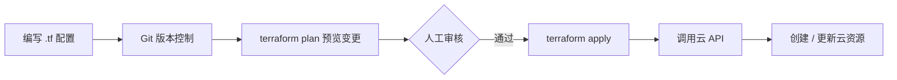
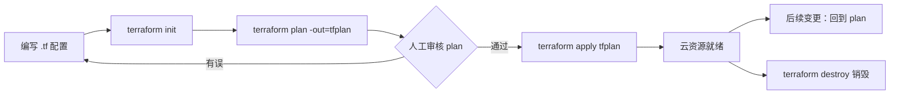

+++
title = "第68章：IaC（基础设施即代码）"
weight = 680
date = "2026-03-24T13:18:28+08:00"
type = "docs"
description = ""
isCJKLanguage = true
draft = false
+++


# 第六十八章：IaC（基础设施即代码）

## 68.1 Terraform 基础

### 什么是 IaC？

IaC（Infrastructure as Code）就是"用代码管理基础设施"。以前我们管理服务器，要手动点击控制台或者敲命令；现在把基础设施写成代码，版本化管理，一键部署！


```mermaid
graph LR
    A[编写 .tf 配置] --> B[Git 版本控制]
    B --> C[terraform plan 预览变更]
    C --> D{人工审核}
    D -->|通过| E[terraform apply]
    E --> F[调用云 API]
    F --> G[创建 / 更新云资源]
```

与"手动点控制台"相比，IaC 最大的价值不是"快"，而是**可复现**：同一份代码，谁来执行、在哪执行，结果都一致；改了什么、谁改的，Git 里都有记录，还能一键回滚。

### Terraform vs 手动操作

| 对比 | Terraform | 手动操作 |
|------|-----------|---------|
| 速度 | 几分钟搞定 | 几小时 |
| 一致性 | 每次都一样 | 人为失误 |
| 可重复 | 想部署多少部署多少 | 重复操作烦死人 |
| 版本控制 | 代码在 Git 里 | 配置在脑子里 |
| 审计 | 谁改了什么一清二楚 | 不知道谁改的 |

### 安装 Terraform

```bash
# macOS
brew install terraform
# 或用版本管理器（推荐，便于在不同项目间切换版本）
brew install tfenv
tfenv install latest
tfenv use latest

# Linux（Ubuntu/Debian，使用 HashiCorp 官方软件源，方便随之更新）
wget -O - https://apt.releases.hashicorp.com/gpg | sudo gpg --dearmor -o /usr/share/keyrings/hashicorp-archive-keyring.gpg
echo "deb [signed-by=/usr/share/keyrings/hashicorp-archive-keyring.gpg] https://apt.releases.hashicorp.com $(lsb_release -cs) main" | sudo tee /etc/apt/sources.list.d/hashicorp.list
sudo apt update && sudo apt install -y terraform

# 通用方式：先查询当前最新版本号再下载（不要长期固定某个旧版本）
LATEST=$(curl -s https://checkpoint-api.hashicorp.com/v1/check/terraform | grep -o '"current_version":"[^"]*"' | cut -d'"' -f4)
curl -LO "https://releases.hashicorp.com/terraform/${LATEST}/terraform_${LATEST}_linux_amd64.zip"
unzip "terraform_${LATEST}_linux_amd64.zip"
sudo install -m 0755 terraform /usr/local/bin/terraform

# Windows (使用 Chocolatey)
choco install terraform

# 验证
terraform version

# 查看最新版本：https://github.com/hashicorp/terraform/releases
```

> ⚠️ **版本约定很重要**：团队里每个人用的 Terraform 版本尽量一致，否则可能出现"我这能 plan、你那报错"的情况。在配置里用 `required_version` 把版本要求写清楚，比较新的配置应至少要求 `>= 1.5`。

### Terraform 基本概念

| 概念 | 说明 |
|------|------|
| Provider | 云服务提供商插件 |
| Resource | 云资源 |
| Data Source | 数据源 |
| Variable | 变量 |
| Output | 输出 |
| State | 状态文件 |

### 第一个 Terraform 项目

```bash
# 创建项目目录
mkdir my-terraform-project
cd my-terraform-project

# 创建配置文件
cat > main.tf << 'EOF'
# 指定 Provider 与版本约束
terraform {
  required_version = ">= 1.5"
  required_providers {
    aws = {
      source  = "hashicorp/aws"
      version = "~> 5.0"
    }
  }
}

provider "aws" {
  region = "us-east-1"
  # 凭证不要写在这里，用环境变量 / aws configure / SSO
}

# 动态查询最新的 Amazon Linux 2023 镜像
# 写死 AMI ID 是新手最常见的坑之一：AMI 会随地域、时间变化，换个人或换个月执行就报错
data "aws_ami" "al2023" {
  most_recent = true
  owners      = ["amazon"]

  filter {
    name   = "name"
    values = ["al2023-ami-*-x86_64"]
  }
}

# 创建资源
resource "aws_instance" "web" {
  ami           = data.aws_ami.al2023.id
  instance_type = "t3.micro"
  
  tags = {
    Name        = "my-web-server"
    Environment = "production"
  }
}

# 定义输出
output "instance_ip" {
  value = aws_instance.web.public_ip
}
EOF
```

写完就能跑起来了：`terraform init` 会下载 AWS Provider，`terraform plan` 会告诉你"准备创建 1 个 EC2 实例"，确认无误再 `terraform apply`。

### Terraform 工作流程

```bash
# 1. 初始化（下载 Provider）
terraform init

# 2. 格式化代码
terraform fmt

# 3. 验证配置
terraform validate

# 4. 预览执行计划
terraform plan

# 5. 应用配置（创建资源）
terraform apply

# 6. 销毁资源
terraform destroy
```

### Terraform 变量

```hcl
# variables.tf
variable "instance_type" {
  description = "EC2 实例类型"
  type        = string
  default     = "t3.micro"
}

variable "ami_id" {
  description = "AMI ID"
  type        = string
}

variable "environment" {
  description = "环境名称"
  type        = string
  default     = "production"
}

variable "tags" {
  description = "资源标签"
  type        = map(string)
  default     = {
    Project = "myapp"
  }
}
```

### Terraform 输出

```hcl
# outputs.tf
output "instance_id" {
  description = "EC2 实例 ID"
  value       = aws_instance.web.id
}

output "public_ip" {
  description = "公网 IP"
  value       = aws_instance.web.public_ip
}

output "private_ip" {
  description = "私网 IP"
  value       = aws_instance.web.private_ip
}

output "security_group" {
  description = "安全组 ID"
  value       = aws_security_group.web.id
  sensitive   = true  # 敏感输出
}
```

## 68.2 云 Provider

### AWS Provider

```hcl
# AWS Provider 配置
provider "aws" {
  region = "us-east-1"

  # ❌ 不要写 access_key / secret_key！
  # 写在 .tf 里意味着密钥会进 Git、进 plan 输出、进 tfstate，
  # 一旦仓库泄露或被他人 clone，等于把账号交出去。
  #
  # ✅ 凭证的推荐来源（按常见程度排序）：
  #   1. 本地开发：aws configure（写入 ~/.aws/credentials，已被 .gitignore 排除）
  #   2. 多环境：aws configure --profile prod，然后 AWS_PROFILE=prod terraform plan
  #   3. CI/CD：OIDC 联邦凭证（GitHub Actions 可免密钥拿到临时凭证）
  #   4. 云上运行：EC2 实例角色 / ECS 任务角色
}

# 使用别名（多地区配置）
provider "aws" {
  alias  = "west"
  region = "us-west-2"
}

# 在资源中引用
resource "aws_instance" "web_west" {
  provider = aws.west
  ami      = "ami-xxxx"
  # ...
}
```

> 注意：Provider 里显式写的 `access_key` **优先级高于**环境变量和配置文件。所以"明明配了 profile 却不生效"的时候，先检查代码里是不是把密钥写死了。

### 阿里云 Provider

```hcl
# 安装阿里云 Provider
terraform {
  required_providers {
    alicloud = {
      source  = "aliyun/alicloud"
      version = "1.200.0"
    }
  }
}

provider "alicloud" {
  region = "cn-hangzhou"
  # 凭证同样不要写死，推荐用环境变量或 RAM 角色：
  #   export ALICLOUD_ACCESS_KEY=...  ALICLOUD_SECRET_KEY=...
  # 本地也可用 `aliyun configure`（写入 ~/.aliyun/config.json），
  # 生产环境建议用 RAM 子账号 + 最小权限策略，绝不用主账号 AccessKey。
}

# 创建 VPC
resource "alicloud_vpc" "main" {
  vpc_name   = "my-vpc"
  cidr_block = "10.0.0.0/16"
}

# 创建交换机（ECS 必须放在某个交换机里）
resource "alicloud_vswitch" "main" {
  vpc_id       = alicloud_vpc.main.id
  cidr_block   = "10.0.1.0/24"
  zone_id      = "cn-hangzhou-i"
  vswitch_name = "my-vswitch"
}

# 创建安全组
resource "alicloud_security_group" "web" {
  security_group_name = "my-security-group"
  vpc_id              = alicloud_vpc.main.id
}

# 添加安全组规则
resource "alicloud_security_group_rule" "ssh" {
  type              = "ingress"
  ip_protocol       = "tcp"
  nic_type          = "intranet"
  policy            = "accept"
  port_range        = "22/22"
  cidr_ip           = "203.0.113.10/32"   # ⚠️ 换成你自己的公网 IP，不要写 0.0.0.0/0
  security_group_id = alicloud_security_group.web.id
}

# 动态查询最新的 Ubuntu 22.04 公共镜像，避免写死会过期的 image_id
data "alicloud_images" "ubuntu" {
  name_regex  = "^ubuntu_22_04_x64"
  most_recent = true
  owners      = "system"
}

# 创建 ECS 实例（放在最后，因为它依赖 VPC、交换机、安全组、镜像）
resource "alicloud_instance" "web" {
  instance_name = "my-web-server"
  # 通用型 g7；不要用 t5 这类突发性能型跑持续负载（有 CPU 积分限制）
  instance_type = "ecs.g7.large"
  image_id      = data.alicloud_images.ubuntu.images[0].id
  vswitch_id    = alicloud_vswitch.main.id

  security_groups = [alicloud_security_group.web.id]

  internet_max_bandwidth_out = 1   # 大于 0 才会分配公网 IP
}
```

> 💡 Terraform 会自动按引用关系排出创建顺序：VPC → 交换机 → 安全组 → ECS。你不需要手工写"先建哪个"。

### 腾讯云 Provider

```hcl
# 腾讯云 Provider
terraform {
  required_providers {
    tencentcloud = {
      source  = "tencentcloudstack/tencentcloud"
      version = "~> 1.60"
    }
  }
}

provider "tencentcloud" {
  region = "ap-guangzhou"
  # 凭证不要写死，用环境变量或子账号密钥：
  #   export TENCENTCLOUD_SECRET_ID=...  TENCENTCLOUD_SECRET_KEY=...
  # 建议用 CAM 子账号 + 最小权限，主账号密钥只用于应急。
}

# 创建 VPC
resource "tencentcloud_vpc" "main" {
  name         = "my-vpc"
  cidr_block   = "10.0.0.0/16"
}

# 创建子网
resource "tencentcloud_subnet" "my_subnet" {
  name              = "my-subnet"
  vpc_id            = tencentcloud_vpc.main.id
  cidr_block        = "10.0.1.0/24"
  availability_zone = "ap-guangzhou-3"
}

# 创建安全组（原示例引用了未定义的 my_sg，这里补全）
resource "tencentcloud_security_group" "my_sg" {
  name        = "my-security-group"
  description = "web server security group"
}

# 只放行自己的 IP 访问 22 端口（腾讯云安全组默认拒绝所有入方向）
resource "tencentcloud_security_group_rule_set" "web" {
  security_group_id = tencentcloud_security_group.my_sg.id

  ingress {
    action      = "ACCEPT"
    cidr_block  = "203.0.113.10/32"
    protocol    = "TCP"
    port        = "22"
    description = "ssh from my ip"
  }
}

# 动态查询 Ubuntu 22.04 公共镜像，避免写死 img-xxxxxxxx
data "tencentcloud_images" "ubuntu" {
  image_type = ["PUBLIC_IMAGE"]
  image_name = "^ubuntu_22.04"
}

# 创建 CVM
resource "tencentcloud_instance" "web" {
  instance_name     = "my-web-server"
  instance_type     = "S5.MEDIUM2"   # 规格名后缀数字是内存 GB 数
  image_id          = data.tencentcloud_images.ubuntu.images[0].image_id
  availability_zone = "ap-guangzhou-3"
  subnet_id         = tencentcloud_subnet.my_subnet.id
  security_groups   = [tencentcloud_security_group.my_sg.id]
}
```

### Azure Provider

```hcl
# Azure Provider
provider "azurerm" {
  features {}
  subscription_id = "你的订阅ID"   # 也可用环境变量 ARM_SUBSCRIPTION_ID

  # 凭证不要写死。最省事的本地方式是先用 Azure CLI 登录：
  #   az login
  #   az account set --subscription <你的订阅ID>
  # 登录后 Terraform 会直接复用 CLI 的登录态，无需任何 client_secret。
  # CI/CD 推荐用 OIDC 联邦凭证，或 ARM_CLIENT_ID / ARM_CLIENT_SECRET 等环境变量。
}

# 创建资源组
resource "azurerm_resource_group" "main" {
  name     = "my-resource-group"
  location = "eastus"
}

# 创建虚拟网络
resource "azurerm_virtual_network" "main" {
  name                = "my-vnet"
  address_space       = ["10.0.0.0/16"]
  location            = azurerm_resource_group.main.location
  resource_group_name = azurerm_resource_group.main.name
}

# 创建子网
resource "azurerm_subnet" "main" {
  name                 = "my-subnet"
  resource_group_name  = azurerm_resource_group.main.name
  virtual_network_name = azurerm_virtual_network.main.name
  address_prefixes     = ["10.0.1.0/24"]
}

# 公网 IP（可选，仅内网访问可省略）
resource "azurerm_public_ip" "web" {
  name                = "my-web-pip"
  location            = azurerm_resource_group.main.location
  resource_group_name = azurerm_resource_group.main.name
  allocation_method   = "Static"
  sku                 = "Standard"
}

# 网卡：虚拟机必须先有网卡，原示例缺了这一步
resource "azurerm_network_interface" "main" {
  name                = "my-web-nic"
  location            = azurerm_resource_group.main.location
  resource_group_name = azurerm_resource_group.main.name

  ip_configuration {
    name                          = "internal"
    subnet_id                     = azurerm_subnet.main.id
    private_ip_address_allocation = "Dynamic"
    public_ip_address_id          = azurerm_public_ip.web.id
  }
}

# 创建虚拟机
# ⚠️ azurerm_virtual_machine 是废弃资源，新代码请用 azurerm_linux_virtual_machine
resource "azurerm_linux_virtual_machine" "web" {
  name                  = "my-web-server"
  location              = azurerm_resource_group.main.location
  resource_group_name   = azurerm_resource_group.main.name
  network_interface_ids = [azurerm_network_interface.main.id]
  size                  = "Standard_DS1_v2"
  admin_username        = "azureuser"

  disable_password_authentication = true
  admin_ssh_key {
    username   = "azureuser"
    public_key = file("~/.ssh/id_ed25519.pub")   # 推荐 ed25519，比 rsa 更短更安全
  }

  os_disk {
    caching              = "ReadWrite"
    storage_account_type = "StandardSSD_LRS"
  }

  source_image_reference {
    publisher = "Canonical"
    offer     = "0001-com-ubuntu-server-jammy"
    sku       = "22_04-lts-gen2"
    version   = "latest"
  }
}
```

### Google Cloud Provider

```hcl
# GCP Provider
provider "google" {
  project = "my-project"
  region  = "us-central1"
  zone    = "us-central1-a"
}

# 创建实例
resource "google_compute_instance" "web" {
  name         = "my-web-server"
  machine_type = "e2-micro"
  zone         = "us-central1-a"
  
  boot_disk {
    initialize_params {
      # 用 image family 自动取该系列最新版本，避免写死具体版本号
      image = "debian-cloud/debian-12"
      # 其他常用：ubuntu-os-cloud/ubuntu-2204-lts、cos-cloud/cos-stable
    }
  }
  
  network_interface {
    network = "default"
    access_config {
      // 临时公网 IP
    }
  }
}
```

### 多 Provider 组合

```hcl
# 同时使用 AWS 和阿里云
terraform {
  required_providers {
    aws = {
      source = "hashicorp/aws"
    }
    alicloud = {
      source = "aliyun/alicloud"
    }
  }
}

provider "aws" {
  region = "us-east-1"
}

provider "alicloud" {
  region = "cn-hangzhou"
}

# AWS 上的 Web 服务器
resource "aws_instance" "web_us" {
  ami           = "ami-xxxx"
  instance_type = "t3.micro"
}

# 阿里云上的数据库
resource "alicloud_db_instance" "db" {
  engine               = "MySQL"
  engine_version       = "8.0"
  instance_type        = "mysql.n2.serverless.1c2g"
  instance_storage     = 200
  vswitch_id           = "vsw-xxxx"   # 实际项目里应引用 alicloud_vswitch.main.id
}
```

> Azure 与 GCP 的实例都不需要 `ami`，而是用镜像标识（`source_image_reference` / `initialize_params.image`）；GCP 的 `access_config {}` 为空块即表示"分配临时公网 IP"，删掉这个块就只有内网 IP。

## 68.3 Terraform 进阶

### 数据源

```hcl
# 获取 AMI 信息
data "aws_ami" "ubuntu" {
  most_recent = true
  owners      = ["099720109477"]  # Canonical
  
  filter {
    name   = "name"
    values = ["ubuntu/images/hvm-ssd/ubuntu-jammy-22.04-amd64-server-*"]
  }
}

# 使用数据源
resource "aws_instance" "web" {
  ami           = data.aws_ami.ubuntu.id
  instance_type = "t3.micro"
}

# 获取可用区
data "aws_availability_zones" "available" {
  state = "available"
}

# 获取 VPC 信息
data "aws_vpc" "existing" {
  filter {
    name   = "tag:Name"
    values = ["my-vpc"]
  }
}
```

### 资源依赖

```hcl
# 隐式依赖（Terraform 自动推断）
resource "aws_security_group" "web" {
  name = "web-sg"
}

resource "aws_instance" "web" {
  ami                    = "ami-xxxx"
  instance_type          = "t3.micro"
  # 只要引用了另一个资源的属性，Terraform 就知道"必须先建安全组"
  vpc_security_group_ids = [aws_security_group.web.id]
}

# 显式依赖（手动指定）
resource "aws_instance" "app" {
  ami           = "ami-xxxx"
  instance_type = "t3.micro"
  
  # 依赖另一个资源，但不直接引用
  depends_on = [
    aws_security_group.web
  ]
}
```

> ⚠️ 注意 `aws_instance` 里不要再用 `security_groups = [...]`。那是古代 EC2-Classic 的写法，AWS Provider 5.x 里已废弃并会给出警告；VPC 环境一律用 `vpc_security_group_ids = [...]`。

**什么时候才需要 `depends_on`？** 只有当"依赖关系不体现在属性引用上"时。比如先建好 IAM 策略、等待存储桶策略生效之后再启动实例——这种顺序 Terraform 看不出来，才需要手工声明。能用隐式依赖就别写 `depends_on`，写多了会降低并行度、拖慢 apply。

### 条件表达式

```hcl
# 条件创建资源
resource "aws_instance" "web" {
  count         = var.enable_web ? 1 : 0
  ami           = "ami-xxxx"
  instance_type = var.instance_type
  
  tags = {
    Name = "web-server"
  }
}

# 条件赋值
locals {
  environment = var.is_production ? "prod" : "dev"
  instance_name = var.environment == "prod" ? "web-prod" : "web-dev"
}
```

### 循环

```hcl
# count 循环
resource "aws_instance" "web" {
  count = 3
  
  ami           = "ami-xxxx"
  instance_type = "t3.micro"
  
  tags = {
    Name = "web-server-${count.index}"
  }
}

# for_each 循环
resource "aws_security_group_rule" "http" {
  for_each = toset(["80", "443"])
  
  type              = "ingress"
  from_port         = each.value
  to_port           = each.value
  protocol          = "tcp"
  cidr_blocks       = ["0.0.0.0/0"]   # 80/443 面向公网是合理的；22 端口请改成自己的 IP
  security_group_id = aws_security_group.web.id
}
```

`count` 和 `for_each` 怎么选？

| 用法 | 适用场景 | 注意 |
|------|----------|------|
| `count = N` | 创建 N 个几乎相同的资源 | 中间删一个会导致后面所有资源"重新编号"，容易误删重建 |
| `for_each = toset([...])` | 按集合创建，每个有唯一 key | 增删元素只影响对应的那一个，**更推荐** |
| `for_each` + `map` | 每个资源参数不同 | 用 `each.key` / `each.value` 取值 |

> 💡 用 `count` 时资源地址是 `aws_instance.web[0]`、`[1]`；用 `for_each` 时是 `aws_instance.web["a"]`。后者在后期维护时更稳定。

### 模块化

```hcl
# 目录结构
# my-module/
# ├── main.tf
# ├── variables.tf
# └── outputs.tf

# my-module/main.tf
variable "instance_type" {}
variable "ami" {}

resource "aws_instance" "web" {
  ami           = var.ami
  instance_type = var.instance_type
}

# my-module/outputs.tf
output "instance_ip" {
  value = aws_instance.web.public_ip
}

# 使用模块
module "web_cluster" {
  source = "./my-module"
  
  instance_type = "t3.micro"
  ami           = data.aws_ami.al2023.id
}
```

模块是 Terraform 复用的核心。几点实践经验：

- `source` 可以是本地路径（`./modules/network`）、官方注册表（`terraform-aws-modules/vpc/aws`）或 Git 仓库（`git::https://...`）。
- 模块应该有清晰的 `variables.tf`（带 `description` 和 `type`）和 `outputs.tf`，否则调用方只能靠猜。
- 模块里**不要写死 `provider` 配置**，让根配置决定用哪个账号和地域，这样同一个模块可以在多套环境复用。
- 上生产前，模块要么固定 `version`，要么锁定 Git tag；直接用 `main` 分支等于把生产环境交给别人的下一次提交。

### 远程状态

```hcl
# S3 作为状态后端
terraform {
  backend "s3" {
    bucket         = "my-terraform-state"
    key            = "prod/terraform.tfstate"
    region         = "us-east-1"
    encrypt        = true
    dynamodb_table = "terraform-locks"
  }
}

# 阿里云 OSS 作为后端
terraform {
  backend "oss" {
    bucket          = "my-terraform-state"
    key             = "prod/terraform.tfstate"
    region          = "cn-hangzhou"
    tablestore_table = "terraform-locks"
  }
}
```

**为什么必须用远程后端？** 本地 `terraform.tfstate` 有三个致命问题：只存在于你一台机器上（换电脑就瞎了）、多人同时 apply 会互相覆盖、文件里明文存着数据库密码之类的敏感值。远程后端把状态集中存起来，还能加锁。

配置远程后端的三个要点：

1. **开版本控制**：S3 开启 Bucket Versioning、OSS 开启版本控制。状态文件被误删或写坏时，可以回到上一个版本。
2. **开加密**：S3 后端加 `encrypt = true`（或直接用 KMS 密钥）；OSS 后端用 `encrypt = true`。状态文件相当于基础设施的"账本+密码本"。
3. **配置状态锁**：S3 用 DynamoDB 表（`dynamodb_table`），OSS 用 TableStore（`tablestore_table`），防止两个人同时 apply 把状态写乱。

> ⚠️ **千万不要把 `terraform.tfstate` 提交到 Git**。在 `.gitignore` 里加上 `*.tfstate`、`*.tfstate.*`、`.terraform/`、`*.tfplan`、`crash.log`。这是新手最常踩的坑之一。

修改后端配置后，需要执行：

```bash
# 后端配置变了，需要重新初始化；-migrate-state 会把本地状态搬到新后端
terraform init -migrate-state

# 换到新环境时，确认当前用的是哪个后端
terraform init -reconfigure
```

### 状态管理（state）

状态文件不是"能不动就不动"，但有时候又必须动——比如把一个已存在的资源纳管进来，或者重命名资源避免被销毁重建。

```bash
# 查看状态里有哪些资源
terraform state list

# 查看某个资源的详细信息
terraform state show aws_instance.web

# 把本地已有的资源"纳管"到 Terraform（不重新创建）
terraform import aws_instance.web i-1234567890abcdef0

# 重命名（改了资源名或搬进模块后，用 mv 保住已有资源，避免被删了重建）
terraform state mv aws_instance.web aws_instance.web_new
terraform state mv aws_instance.web module.web.aws_instance.web

# 从状态中移除（只是不再管理，并不会真正删除云上资源）
terraform state rm aws_instance.web

# 拉取远端状态到本地查看（只读，不影响远端）
terraform state pull > state-backup.json
```

> 🚨 **顺序很重要**：先用 `state mv` / `state rm` 调整状态，**再**改代码。如果先改代码再 plan，Terraform 会以为你要删掉旧资源、创建新资源，一不小心就把生产机器销毁了。

从 Terraform 1.1 起，也可以在代码里用 `moved` 块声明"改名"，比命令行更安全、可审计：

```hcl
moved {
  from = aws_instance.web
  to   = aws_instance.app
}
```

**状态文件损坏了怎么办？** 如果启用了远程后端 + 版本控制，直接从对象存储的历史版本恢复即可。如果只能靠本地，可以用 `terraform state push` 把之前的备份推回去。所以定期备份（保存 `state pull` 的结果）是值得的。

### 工作空间

```bash
# 创建工作空间
terraform workspace new prod
terraform workspace new dev

# 切换工作空间
terraform workspace select prod

# 查看当前工作空间
terraform workspace show
```

在工作空间里，同一个后端会把状态按工作空间名分开存（如 `env:/prod/terraform.tfstate`）：

```hcl
# 按工作空间决定实例数量
resource "aws_instance" "web" {
  count = terraform.workspace == "prod" ? 3 : 1
  # ...
}
```

> ⚠️ 工作空间容易用错。它适合"同一套代码、多个几乎相同的环境"（如临时预览环境），**不适合做强隔离的 prod / staging**——因为所有环境共用一份代码和同一个后端，一次 `terraform apply` 选错了工作空间，后果很严重。生产与测试更推荐用**不同目录 + 不同后端**（例如 `envs/prod/`、`envs/dev/`），用目录把边界划清楚。

## 68.4 Terraform 最佳实践

### 团队协作

```bash
# 1. 代码审查
git add .
git commit -m "添加 Web 服务器"
git push

# 2. 在 PR 中运行 plan
# GitHub Actions / GitLab CI
terraform plan -out=tfplan

# 3. 合并后 apply
terraform apply tfplan
```

### CI/CD 集成

```yaml
# GitHub Actions 示例
# .github/workflows/terraform.yml
name: Terraform

on:
  push:
    branches: [main]
  pull_request:

jobs:
  terraform:
    runs-on: ubuntu-latest
    # 通过 OIDC 拿临时云凭证，仓库里不存任何长期密钥
    permissions:
      id-token: write
      contents: read
    steps:
      - uses: actions/checkout@v4
      
      - name: Setup Terraform
        uses: hashicorp/setup-terraform@v3
        with:
          # 不要写死大版本；这里跟随官方最新稳定版
          terraform_version: latest
          
      - name: Terraform Init
        run: terraform init
        
      - name: Terraform Format
        run: terraform fmt -check
        
      - name: Terraform Plan
        run: terraform plan -out=tfplan -lock-timeout=5m
        
      - name: Terraform Apply
        if: github.ref == 'refs/heads/main'
        # 传的是已保存的 plan 文件，执行的就是刚刚审核过的那份变更
        run: terraform apply tfplan
```

这条流水线的关键点：

- **plan 和 apply 必须基于同一份 plan 文件**。如果 apply 时重新 plan，审核过的内容和实际执行的内容可能已经不一样了。
- **apply 只在合并到 main 之后触发**，PR 阶段只跑 plan，把变更贴在评论里供人审核。
- **凭证用 OIDC**，把云厂商的角色信任配置到 GitHub 仓库，避免把长期 AccessKey 塞进 Secrets（Secrets 一旦泄露就是永久有效）。
- 加 `-lock-timeout=5m`：CI 并发触发时不会因为状态被锁而立刻失败。

### 敏感信息管理

密码、密钥这类东西**永远不要写进 `.tf` 文件**。变量也好、`locals` 也好，写在代码里就等于提交进了 Git，而且会明文出现在 `terraform plan` 输出和 tfstate 里。

推荐的几种做法：

1. **能用角色就别用密钥**：云上实例用实例角色、CI 用 OIDC，本地用 SSO 登录。
2. **敏感变量用环境变量注入**：`export TF_VAR_db_password=...`，配置里只声明变量、不写默认值。
3. **加密后再入库**：用 SOPS / Vault / 云厂商的密钥管理服务（KMS、Secrets Manager）保存，运行时解密。
4. **标记为敏感**：变量和输出加 `sensitive = true`，避免出现在日志里。

```bash
# 1. 安装 sops（macOS）
brew install sops age

# 2. 生成加密用的 age 密钥对（公钥进仓库的 .sops.yaml，私钥自己保管）
age-keygen -o key.txt

# 3. 写 .sops.yaml，声明哪些文件用哪个公钥加密
cat > .sops.yaml << 'EOF'
creation_rules:
  - path_regex: secrets\.enc\.yaml$
    age: age1xxxxxxxxxxxxxxxxxxxxxxxxxxxxxxxxxxxxxx
EOF

# 4. 创建明文 secrets.yaml（注意：必须在 .gitignore 里排除）
cat > secrets.yaml << 'EOF'
db_password: "super-secret"
api_key: "super-api-key"
EOF

# 5. 加密成 secrets.enc.yaml（加密后的文件可以安全提交进 Git）
sops --encrypt secrets.yaml > secrets.enc.yaml
# 之后想改内容：sops secrets.enc.yaml 会直接打开解密后的编辑器

# 6. 确认没把明文提交进去
grep -q '^secrets\.yaml$' .gitignore || echo 'secrets.yaml' >> .gitignore
```

在 Terraform 中读取解密后的内容：

```hcl
# 需要 terraform-provider-sops（carlpett/sops）
data "sops_file" "secrets" {
  source_file = "secrets.enc.yaml"
}

resource "aws_db_instance" "main" {
  # 敏感值读取后仍会进 tfstate，所以远程后端必须开加密
  password = data.sops_file.secrets.data["db_password"]
}
```

> ⚠️ 一个容易被忽视的事实：**tfstate 里保存的是资源的完整属性，包括明文密码**。加密了源码不等于加密了状态文件，远程后端的加密和访问控制同样重要（S3 开 SSE + 桶策略只允许 CI 角色读写）。

### 常见坑与最佳实践清单

新手写 Terraform 最容易踩的坑，这里集中列一下：

| 问题 | 症状 | 正确做法 |
|------|------|----------|
| 写死 AMI / 镜像 ID | 换个人执行就报 "image not found" | 用 `data` 源动态查询，如 `aws_ami`、`alicloud_images` |
| 密钥写进 `.tf` | 密钥进 Git、进 plan 输出 | 环境变量 / SSO / OIDC / 角色 |
| 把 tfstate 提交 Git | 泄露账号凭证和资源清单 | `.gitignore` 排除，改用远程后端 |
| 直接 `terraform apply` 不看 plan | 误删生产资源 | 永远先 `plan`，甚至 `plan -out` 再 `apply` |
| 不锁 Provider 版本 | 某天 Provider 升级后大量资源"要重建" | 用 `version = "~> 5.0"` 约束大版本 |
| 生产/测试共用 state | 一次 apply 波及两个环境 | 分目录 + 分后端 |
| 资源命名随意 | 无法一眼看出归属，账单难分摊 | 统一命名规范 + 打标签（`Project`/`Env`/`Owner`） |
| 手工在控制台改资源 | 下次 apply 被改回去，产生"漂移" | 所有变更走代码；已经漂移的用 `terraform plan` 查看并修正 |

> 💡 **关于"漂移"（drift）**：如果有人直接在控制台改了安全组，Terraform 并不知道，直到下次 `plan` 才会显示"要把配置改回来"。生产环境应定期（如每天）跑一次 `terraform plan` 检查是否有非预期差异。

**推荐的目录结构**：

```text
infra/
├── modules/              # 可复用的模块
│   └── web-server/
├── envs/
│   ├── prod/             # 生产：独立的 state、独立的凭证
│   │   ├── main.tf
│   │   ├── backend.tf
│   │   └── terraform.tfvars
│   └── dev/
└── .gitignore            # 排除 *.tfstate / .terraform / *.tfplan
```

```hcl
# 变量定义与取值分离：variables.tf 描述"有什么"，terraform.tfvars 描述"这次用什么"
# variables.tf
variable "db_password" {
  description = "数据库密码，通过 TF_VAR_db_password 环境变量注入"
  type        = string
  sensitive   = true   # 不允许出现在日志/输出中
}
```

## 本章小结

本章我们学习了 IaC（基础设施即代码）的核心知识：

| 概念 | 说明 |
|------|------|
| Terraform | 最流行的 IaC 工具 |
| Provider | 云服务提供商插件（AWS / 阿里云 / 腾讯云 / Azure / GCP） |
| Resource | 云资源定义 |
| Data Source | 只读查询已有资源（如动态查镜像、可用区） |
| Variable | 输入变量，`sensitive = true` 保护敏感值 |
| Output | 输出值 |
| State | 状态文件，必须放远程后端 + 开加密 + 开锁 |
| Module | 模块化复用 |
| Workspace | 同一后端下的多份状态，适合临时环境 |

最常用的几条命令：

| 命令 | 作用 |
|------|------|
| `terraform init` | 下载 Provider、初始化后端 |
| `terraform fmt` / `validate` | 格式化 / 语法校验 |
| `terraform plan -out=tfplan` | 预览变更并存成计划文件 |
| `terraform apply tfplan` | 执行已审核的计划 |
| `terraform destroy` | 销毁本配置管理的全部资源（危险） |
| `terraform state list` / `mv` / `rm` | 查看、重命名、移出状态 |
| `terraform import` | 把已有资源纳管进来 |

Terraform 工作流程：


```mermaid
graph LR
    A[编写 .tf 配置] --> B[terraform init]
    B --> C[terraform plan -out=tfplan]
    C --> D{人工审核 plan}
    D -->|有误| A
    D -->|通过| E[terraform apply tfplan]
    E --> F[云资源就绪]
    F --> G[后续变更：回到 plan]
    F --> H[terraform destroy 销毁]
```

---

> 💡 **温馨提示**：
> Terraform 的核心思想是"声明式"——你描述最终状态，Terraform 负责实现。
>
> 记住三件事：**凭证不要写进代码**、**状态文件一定要用远程后端并开启加密和版本控制**、**每次 apply 前都先看 plan**。

---

**第六十八章：IaC — 完结！** 🎉

下一章我们将学习"KVM/QEMU 虚拟化技术"，掌握 Linux 原生的虚拟化方案。敬请期待！ 🚀
