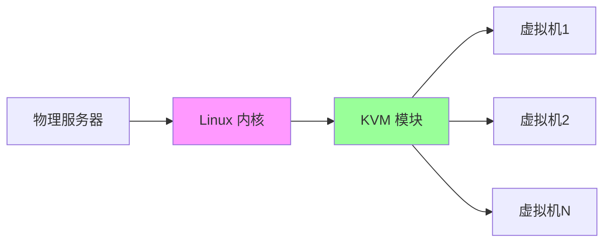
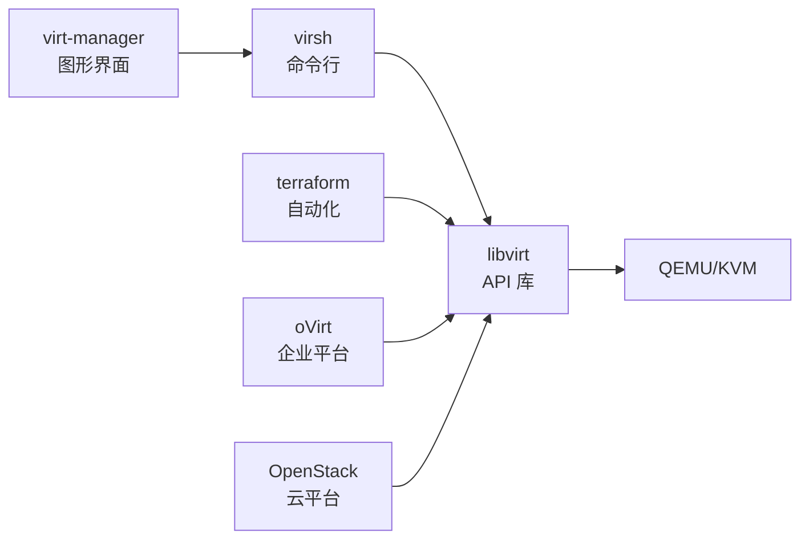

+++
title = "第69章：KVM/QEMU 虚拟化"
weight = 690
date = "2026-03-24T13:18:28+08:00"
type = "docs"
description = ""
isCJKLanguage = true
draft = false
+++


# 第六十九章：KVM/QEMU 虚拟化

## 69.1 KVM 简介

### 什么是 KVM？

KVM（Kernel-based Virtual Machine）是 Linux 内核原生虚拟化技术，让你的 Linux 变成"虚拟机管理员"。



### KVM vs 其他虚拟化

| 对比 | KVM | VMware | VirtualBox |
|------|-----|--------|-----------|
| 平台 | Linux 原生 | 跨平台 | 跨平台 |
| 性能 | 极高（内核级） | 高 | 中等 |
| 复杂度 | 较高 | 简单 | 简单 |
| 费用 | 免费开源 | 商业 | 免费 |
| 适用 | 服务器 | 桌面/服务器 | 桌面 |

### KVM 原理

```mermaid
graph TB
    subgraph 物理硬件
        CPU[CPU 虚拟化扩展]
        MEM[内存]
        DISK[磁盘]
        NET[网卡]
    end
    
    subgraph KVM
        KVM[KVM.ko 内核模块]
        QEMU[QEMU 模拟器]
    end
    
    subgraph 虚拟机
        V1[VM1] --> G1[Guest]
        V2[VM2] --> G2[Guest]
    end
    
    CPU --> KVM
    MEM --> KVM
    DISK --> QEMU
    NET --> QEMU
    
    KVM --> V1
    QEMU --> V2
```

### KVM 需要什么？

```bash
# 1. 检查 CPU 支持虚拟化
grep -E '(vmx|svm)' /proc/cpuinfo

# 如果有 vmx（Intel）或 svm（AMD）输出，说明支持

# 2. 检查 KVM 模块是否加载
lsmod | grep kvm

# 如果没有加载，手动加载
sudo modprobe kvm
sudo modprobe kvm_intel    # Intel CPU
# 或
sudo modprobe kvm_amd      # AMD CPU
```

## 69.2 KVM 安装

### Ubuntu/Debian 安装

```bash
# 更新系统
sudo apt update
sudo apt upgrade -y

# 安装 KVM 和相关工具
sudo apt install qemu-kvm libvirt-daemon libvirt-daemon-system \
    bridge-utils virt-manager virt-viewer \
    libosinfo-bin cloud-image-utils \
    genisoimage acpica-tools

# 启动 libvirt 服务
sudo systemctl enable libvirtd
sudo systemctl start libvirtd

# 添加当前用户到 libvirt 组（免 sudo）
sudo usermod -aG libvirt $USER
sudo usermod -aG kvm $USER

# 重新登录使配置生效
```

### CentOS/RHEL 安装

```bash
# 安装 KVM
sudo yum install -y qemu-kvm libvirt virt-install \
    bridge-utils libvirt-client virt-manager

# 启动服务
sudo systemctl enable libvirtd
sudo systemctl start libvirtd

# 添加用户到组
sudo usermod -aG libvirt $USER
sudo usermod -aG kvm $USER
```

### 验证安装

```bash
# 检查 libvirt 连接
virsh list --all

# 查看 KVM 状态
virsh nodeinfo

# 预期输出示例：
# CPU model:           x86_64
# CPU(s):              8
# CPU frequency:       3200 MHz
# CPU(s):              8
# Memory size:         32768 MiB
```

## 69.3 virsh 命令行管理

virsh 是管理 KVM 虚拟机的命令行工具。

### virsh list

```bash
# 列出正在运行的虚拟机
virsh list

# 列出所有虚拟机（包括关闭的）
virsh list --all

# 预期输出：
#  Id    Name                           State
# ----------------------------------------------------
#  1     web-server                    running
#  2     db-server                    running
#  -     centos7-vm                   shut off
```

### virsh start/stop

```bash
# 启动虚拟机
virsh start web-server

# 关闭虚拟机（优雅关机）
virsh shutdown web-server

# 强制关闭（拔电源）
virsh destroy web-server

# 重启虚拟机
virsh reboot web-server

# 暂停（挂起）
virsh suspend web-server

# 恢复运行
virsh resume web-server

# 设置自动启动
virsh autostart web-server

# 取消自动启动
virsh autostart --disable web-server
```

### virsh console

```bash
# 连接虚拟机控制台
virsh console web-server

# 退出控制台
# 按 Ctrl + ]

# 如果需要在虚拟机内部配置 console
# CentOS/RHEL:
sudo systemctl enable serial-getty@ttyS0
sudo systemctl start serial-getty@ttyS0

# Ubuntu:
sudo systemctl enable serial-getty@ttyS0
sudo systemctl start serial-getty@ttyS0
```

### virsh edit

```bash
# 编辑虚拟机配置（XML 格式）
virsh edit web-server

# 常用配置修改示例：
# - 调整内存、CPU
# - 修改网络配置
# - 添加磁盘
# - 修改启动顺序

# 查看完整配置
virsh dumpxml web-server > web-server.xml

# 从 XML 文件定义虚拟机
virsh define web-server.xml
```

### 更多 virsh 命令

```bash
# 查看虚拟机信息
virsh dominfo web-server

# 查看虚拟机 vCPU 使用
virsh vcpuinfo web-server

# 设置 vCPU 亲和性
virsh vcpupin web-server --vcpu 0 --cpulist 0-3

# 查看虚拟机磁盘
virsh domblklist web-server

# 查看虚拟机网络
virsh domiflist web-service
```

## 69.4 libvirt 库

libvirt 是 KVM 的管理 API，提供统一的虚拟化管理接口。

### libvirt 架构



### libvirt 网络

```bash
# 查看网络
virsh net-list --all

# 默认网络（NAT）
# 10.0.3.0/24

# 创建桥接网络
cat > bridge-network.xml << 'EOF'
<network>
  <name>bridge-net</name>
  <forward mode="bridge"/>
  <bridge name="br0"/>
</network>
EOF

# 定义网络
virsh net-define bridge-network.xml

# 启动网络
virsh net-start bridge-net

# 设置自启动
virsh net-autostart bridge-net
```

### 存储池管理

```bash
# 查看存储池
virsh pool-list --all

# 创建目录存储池
virsh pool-define-as default-pool --type dir --target /var/lib/libvirt/images
virsh pool-build default-pool
virsh pool-start default-pool
virsh pool-autostart default-pool

# 创建 LVM 存储池
virsh pool-define-as lvm-pool --type lvm \
    --source-dev /dev/vg_kvm \
    --source-name vg_kvm \
    --target /dev/vg_kvm
virsh pool-start lvm-pool

# 删除存储池
virsh pool-destroy default-pool
virsh pool-undefine default-pool
```

## 69.5 virt-manager 图形化管理

virt-manager 是 KVM 的图形化管理工具，适合新手。

### 安装

```bash
# Ubuntu/Debian
sudo apt install virt-manager

# CentOS/RHEL
sudo yum install virt-manager

# 启动
virt-manager
```

### 图形界面功能

```bash
# virt-manager 主要功能：
# 1. 创建虚拟机（图形向导）
# 2. 查看虚拟机状态
# 3. 打开虚拟机控制台
# 4. 编辑虚拟机配置
# 5. 管理存储池
# 6. 管理网络
# 7. 克隆虚拟机
# 8. 快照管理
```

### 创建虚拟机流程

```bash
# 1. 点击"新建"按钮
# 2. 选择安装方式：
#    - 本地安装介质（ISO）
#    - 网络安装（URL）
#    - 导入已有磁盘
# 3. 分配 CPU、内存
# 4. 配置存储
# 5. 配置网络
# 6. 完成安装
```

## 69.6 虚拟机创建

### 使用 virt-install

```bash
# 1. 创建虚拟机（最小化安装 CentOS）
sudo virt-install \
    --name centos7-vm \
    --ram 2048 \
    --vcpus 2 \
    --disk path=/var/lib/libvirt/images/centos7.qcow2,size=20 \
    --cdrom /path/to/CentOS-7-x86_64-DVD.iso \
    --network network=default \
    --graphics vnc \
    --os-variant rhel7

# 2. 创建虚拟机（Ubuntu Server）
sudo virt-install \
    --name ubuntu-vm \
    --ram 4096 \
    --vcpus 4 \
    --disk path=/var/lib/libvirt/images/ubuntu.qcow2,size=40 \
    --cdrom /path/to/ubuntu-22.04-live-server-amd64.iso \
    --network network=default \
    --graphics vnc \
    --os-variant ubuntu22.04

# 3. 从网络安装（不需要 ISO）
sudo virt-install \
    --name fedora-vm \
    --ram 2048 \
    --vcpus 2 \
    --disk path=/var/lib/libvirt/images/fedora.qcow2,size=20 \
    --location https://mirror.example.com/fedora/38/Server/x86_64/ \
    --network network=default \
    --graphics vnc \
    --os-variant fedora38
```

### 常用选项

| 选项 | 说明 | 示例 |
|------|------|------|
| --name | 虚拟机名称 | --name web-server |
| --ram | 内存（MB） | --ram 4096 |
| --vcpus | CPU 数量 | --vcpus 4 |
| --disk | 磁盘路径和大小 | --disk path=...,size=20 |
| --cdrom | ISO 路径 | --cdrom /path/to.iso |
| --network | 网络类型 | --network network=default |
| --graphics | 图形配置 | --graphics vnc |
| --os-variant | 操作系统类型 | --os-variant ubuntu22.04 |

### 创建 Windows 虚拟机

```bash
# 1. 需要添加 VirtIO 驱动
wget https://fedorapeople.org/groups/virt/virtio-win/direct-downloads/stable-virtio/virtio-win.iso

# 2. 创建 Windows VM
sudo virt-install \
    --name windows-vm \
    --ram 4096 \
    --vcpus 4 \
    --disk path=/var/lib/libvirt/images/win.qcow2,size=60,bus=virtio \
    --cdrom /path/to/windows.iso \
    --disk path=/var/lib/libvirt/images/virtio-win.iso,device=cdrom \
    --network network=default,model=virtio \
    --graphics vnc \
    --os-variant win10
```

## 69.7 虚拟机快照

快照是虚拟机的"存档"，可以随时恢复。

### 创建快照

```bash
# 1. 查看快照
virsh snapshot-list web-server

# 2. 创建快照（虚拟机需要运行）
virsh snapshot-create-as web-server \
    --name "before-update" \
    --description "Update 前的快照"

# 3. 创建离线快照（虚拟机关闭状态）
virsh snapshot-create-as centos7-vm \
    --name "clean-install" \
    --disk-only

# 4. 查看快照 XML
virsh snapshot-dumpxml web-server --snapshotname "before-update"
```

### 恢复快照

```bash
# 1. 恢复到指定快照
virsh snapshot-revert web-server --snapshotname "before-update"

# 2. 查看当前快照
virsh snapshot-current web-server
```

### 删除快照

```bash
# 删除快照
virsh snapshot-delete web-server --snapshotname "before-update"

# 删除快照链中的所有
virsh snapshot-delete web-server --current
```

### 快照管理脚本

```bash
#!/bin/bash
# backup_vm.sh - 虚拟机快照备份

VM_NAME=$1
SNAPSHOT_NAME="backup-$(date +%Y%m%d_%H%M%S)"

if [ -z "$VM_NAME" ]; then
    echo "用法: $0 <虚拟机名称>"
    exit 1
fi

echo "为 $VM_NAME 创建快照: $SNAPSHOT_NAME"

# 创建快照
virsh snapshot-create-as "$VM_NAME" \
    --name "$SNAPSHOT_NAME" \
    --description "自动备份快照"

# 列出所有快照
echo "当前快照列表："
virsh snapshot-list "$VM_NAME"

# 保留最近5个快照
SNAPSHOT_COUNT=$(virsh snapshot-list "$VM_NAME" | wc -l)
if [ $SNAPSHOT_COUNT -gt 6 ]; then
    OLDEST=$(virsh snapshot-list "$VM_NAME" | head -3 | tail -1 | awk '{print $1}')
    echo "删除旧快照: $OLDEST"
    virsh snapshot-delete "$VM_NAME" --snapshotname "$OLDEST"
fi

echo "备份完成！"
```

## 69.8 存储池管理

### 存储池类型

| 类型 | 说明 | 适用场景 |
|------|------|---------|
| dir | 目录 | 简单文件存储 |
| fs | 文件系统 | 挂载的 NFS |
| logical | LVM | 高性能 |
| rbd | Ceph RBD | 生产环境 |
| glusterfs | GlusterFS | 分布式存储 |

### 创建存储池

```bash
# 1. 创建目录存储池
virsh pool-define-as default-pool dir \
    --target /var/lib/libvirt/images
virsh pool-build default-pool
virsh pool-start default-pool

# 2. 创建 LVM 存储池
virsh pool-define-as lvm-pool logical \
    --source-dev /dev/sdb \
    --source-name vg_libvirt \
    --target /dev/vg_libvirt
virsh pool-build lvm-pool
virsh pool-start lvm-pool

# 3. 创建 Ceph RBD 存储池
virsh pool-define-as ceph-pool rbd \
    --source-name libvirt_pool \
    --source-host ceph-mon \
    --auth-username admin \
    --secret-usage libvirt_ceph
virsh pool-start ceph-pool
```

### 存储卷管理

```bash
# 在存储池中创建卷
virsh vol-create-as default-pool ubuntu22.04.qcow2 40G --format qcow2

# 查看卷
virsh vol-list default-pool

# 克隆卷
virsh vol-clone original.qcow2 new-clone.qcow2 --pool default-pool

# 调整卷大小
virsh vol-resize ubuntu22.04.qcow2 80G --pool default-pool --capacity 80G

# 删除卷
virsh vol-delete ubuntu22.04.qcow2 --pool default-pool
```

## 69.9 网络配置

### 网络模式

| 模式 | 说明 | 特点 |
|------|------|------|
| NAT | 网络地址转换 | 虚拟机可访问主机，外部访问需端口映射 |
| 桥接 | 虚拟机像真实机器 | 虚拟机占用真实 IP |
| 隔离 | 虚拟机之间互通 | 与外部隔绝 |
| 路由 | 虚拟机通过主机路由 | 需要路由配置 |

### 配置桥接网络

```bash
# 1. 查看物理网卡
ip link show

# 2. 创建桥接网卡 br0
sudo nano /etc/network/interfaces

# auto lo
# iface lo inet loopback

# 桥接配置
auto br0
iface br0 inet static
    address 192.168.1.100
    netmask 255.255.255.0
    gateway 192.168.1.1
    bridge_ports enp0s3
    bridge_stp off
    bridge_fd 0
    bridge_maxwait 0

# 3. 重启网络
sudo systemctl restart networking

# 4. 验证桥接
brctl show
```

### virsh 网络配置

```bash
# 创建 NAT 网络（默认）
cat > nat-network.xml << 'EOF'
<network>
  <name>nat-net</name>
  <forward mode='nat'/>
  <bridge name='virbr1' stp='on' delay='0'/>
  <ip address='192.168.100.1' netmask='255.255.255.0'>
    <dhcp>
      <range start='192.168.100.128' end='192.168.100.254'/>
    </dhcp>
  </ip>
</network>
EOF

virsh net-define nat-network.xml
virsh net-start nat-net
virsh net-autostart nat-net
```

### 连接到桥接网络

```bash
# 方式一：修改虚拟机配置
virsh edit web-server

# 将：
# <interface type='network'>
#   <source network='default'/>
# </interface>
# 改为：
# <interface type='bridge'>
#   <source bridge='br0'/>
# </interface>

# 方式二：命令行修改
virsh detach-interface web-server bridge --current
virsh attach-interface web-server bridge br0 --current
```

## 本章小结

本章我们学习了 KVM/QEMU 虚拟化技术：

| 组件 | 说明 |
|------|------|
| KVM | Linux 内核虚拟化模块 |
| QEMU | 硬件模拟器 |
| libvirt | 虚拟化管理 API |
| virsh | 命令行管理工具 |
| virt-manager | 图形化管理工具 |

KVM 工作流程：


---

> 💡 **温馨提示**：
> KVM 是 Linux 服务器虚拟化的首选方案，性能接近物理机。生产环境建议配合 Ceph 分布式存储和 OpenStack 云平台使用！

---

**第六十九章：KVM/QEMU — 完结！** 🎉

下一章我们将学习"其他虚拟化技术"，包括 Proxmox、Podman、Docker Desktop、Hyper-V。敬请期待！ 🚀
