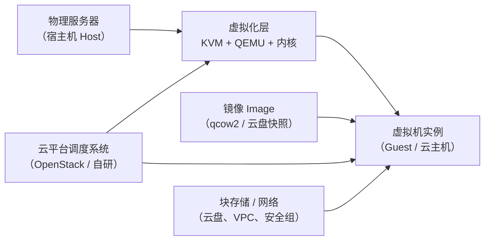
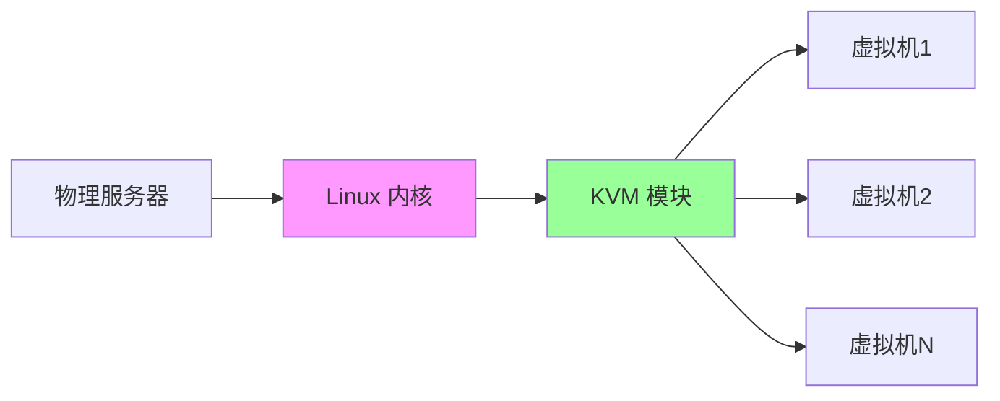
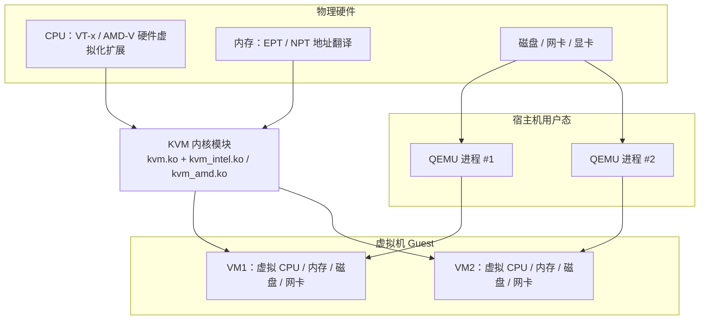
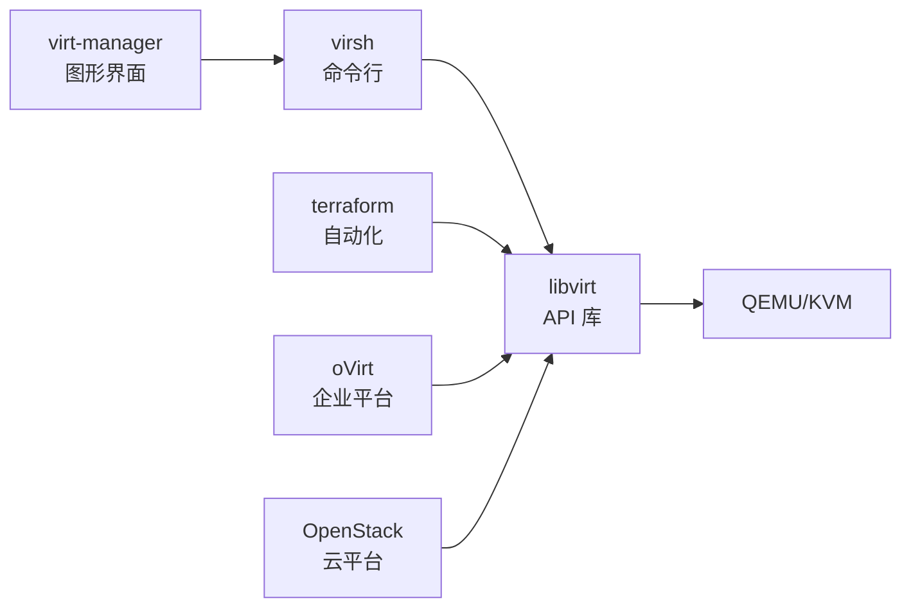
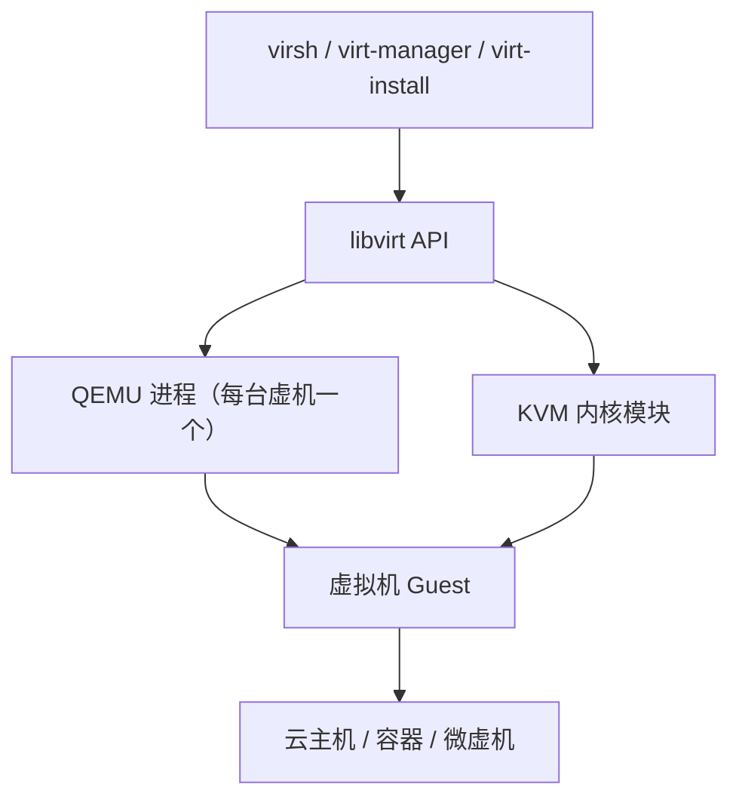

+++
title = "第69章：云上虚拟化——从 KVM/QEMU 到云主机"
weight = 690
date = "2026-03-24T13:18:28+08:00"
type = "docs"
description = ""
isCJKLanguage = true
draft = false
+++


# 第六十九章：云上虚拟化——从 KVM/QEMU 到云主机

> 📌 **本章与"虚拟化"卷的关系**：本站的《虚拟化》卷里有一章**同样叫 KVM/QEMU**，讲的是"在一台自己的机器上把 Linux 变成虚拟机管理员"。本章是它的**云计算视角版本**——同样的 KVM/QEMU 底座，但讨论的是"云厂商卖给你的那台云主机，到底是怎么虚拟出来的"，以及它和本地虚拟化有哪些不一样。
>
> 如果你只想学本地建虚拟机的操作步骤（安装、桥接网络、virt-manager 怎么用），请直接去读《虚拟化》卷的对应章节；本章会把重点放在**云主机、镜像、快照、弹性伸缩**这些云上概念上。

## 69.0 云主机到底是怎么"虚拟"出来的

你在控制台上点一下"创建实例"，几十秒后就拿到一台能 SSH 登录的服务器。这背后其实是**三级抽象**在配合：


```mermaid
flowchart LR
    A["物理服务器<br/>（宿主机 Host）"] --> B["虚拟化层<br/>KVM + QEMU + 内核"]
    B --> C["虚拟机实例<br/>（Guest / 云主机）"]
    D["镜像 Image<br/>（qcow2 / 云盘快照）"] --> C
    E["云平台调度系统<br/>（OpenStack / 自研）"] --> B
    E --> C
    F["块存储 / 网络<br/>（云盘、VPC、安全组）"] --> C
```

- **KVM**：Linux 内核里的虚拟化模块，负责 CPU 和内存的硬件辅助虚拟化。
- **QEMU**：负责模拟主板、磁盘、网卡等设备，让虚拟机看起来像一台"真电脑"。
- **云平台**：真正让虚拟化变成"产品"的那一层。它决定把哪个虚拟机放到哪台物理机上、挂哪块云盘、连哪个 VPC，以及这台机器欠费后怎么自动回收。

换句话说：**KVM/QEMU 是发动机，云平台是整车厂**。下面这些"云上特有"的概念，都是云平台在裸虚拟化之上补出来的。

| 云上概念 | 它解决什么问题 | 本地虚拟化里的对应物 |
|----------|----------------|----------------------|
| 镜像（Image） | 快速批量创建出一模一样的机器 | 安装 ISO / 手工装的虚拟机模板 |
| 云盘（块存储） | 数据与实例解耦，实例删了盘还能留 | 磁盘镜像文件（qcow2/raw） |
| 快照（Snapshot） | 出故障时秒级回滚 | `qemu-img snapshot` |
| 安全组 | 在实例外部的"虚拟防火墙" | 宿主机上的 iptables/nftables |
| 弹性伸缩（Auto Scaling） | 流量涨了自动加机器，跌了自动回收 | 没有对应物，只能手工加机器 |
| 计费与配额 | 资源是"租"的，要能计量 | 没有对应物 |

> ⚠️ **最重要的一条认知**：云主机和本地虚拟机**没有本质区别**，都是 KVM 上的 Guest。云上多出来的那层"魔法"，是**调度 + 存储 + 网络 + 计费**的组合。理解了这一点，再看那些云厂商的专有名词（ECS、CVM、EC2、实例规格族、抢占式实例）就不会发懵了。

## 69.1 KVM 简介

### 什么是 KVM？

KVM（Kernel-based Virtual Machine）是 Linux 内核原生虚拟化技术，让你的 Linux 变成"虚拟机管理员"。


```mermaid
graph LR
    A[物理服务器] --> B[Linux 内核]
    B --> C[KVM 模块]
    C --> D[虚拟机1]
    C --> E[虚拟机2]
    C --> F[虚拟机N]
    
    style B fill:#f9f
    style C fill:#9f9
```

### KVM vs 其他虚拟化

| 对比 | KVM | VMware | VirtualBox |
|------|-----|--------|-----------|
| 平台 | Linux 原生 | 跨平台 | 跨平台 |
| 性能 | 极高（内核级） | 高 | 中等 |
| 复杂度 | 较高 | 简单 | 简单 |
| 费用 | 免费开源 | 商业 | 免费 |
| 适用 | 服务器 | 桌面/服务器 | 桌面 |

### KVM 原理


```mermaid
flowchart TB
    subgraph HW["物理硬件"]
        CPU["CPU：VT-x / AMD-V 硬件虚拟化扩展"]
        MEM["内存：EPT / NPT 地址翻译"]
        DEV["磁盘 / 网卡 / 显卡"]
    end

    subgraph HOST["宿主机用户态"]
        Q1["QEMU 进程 #1"]
        Q2["QEMU 进程 #2"]
    end

    KVM["KVM 内核模块<br/>kvm.ko + kvm_intel.ko / kvm_amd.ko"]

    subgraph GS["虚拟机 Guest"]
        V1["VM1：虚拟 CPU / 内存 / 磁盘 / 网卡"]
        V2["VM2：虚拟 CPU / 内存 / 磁盘 / 网卡"]
    end

    CPU --> KVM
    MEM --> KVM
    KVM --> V1
    KVM --> V2
    Q1 --> V1
    Q2 --> V2
    DEV --> Q1
    DEV --> Q2
```

看图记住两条分工：**CPU 和内存的虚拟化由 KVM 内核模块负责**（Guest 的指令直接在物理 CPU 上跑，遇到敏感指令才陷入内核）；**磁盘、网卡等设备的模拟由 QEMU 负责**（每个虚拟机对应一个 QEMU 进程）。这也解释了为什么查看进程时能看到一排 `qemu-system-x86_64`。

### KVM 需要什么？

```bash
# 1. 检查 CPU 支持虚拟化
grep -E '(vmx|svm)' /proc/cpuinfo

# 如果有 vmx（Intel）或 svm（AMD）输出，说明支持
# 更省事的判断方式（需要 cpu-checker 包）：
sudo apt install cpu-checker && kvm-ok
# 输出 "KVM acceleration can be used" 就说明能跑

# 特别提醒：在云主机里 virt 通常是 kvm，说明你正跑在别人的虚拟机上
systemd-detect-virt
# 输出 kvm/xen/none；输出 none 才是真正的物理机

# 2. 检查 KVM 模块是否加载
lsmod | grep kvm

# 如果没有加载，手动加载
sudo modprobe kvm
sudo modprobe kvm_intel    # Intel CPU
# 或
sudo modprobe kvm_amd      # AMD CPU
```

> ⚠️ **在云主机里装 KVM 通常跑不起来**。普通云主机（AWS EC2、阿里云 ECS 等）默认**不开启嵌套虚拟化**，`modprobe kvm_intel` 会直接失败或创建虚拟机时报 "KVM is not available"。想在云上跑 KVM，需要买**裸金属实例**（如 AWS `.metal`、阿里云 `ebmg7`）或在支持嵌套虚拟化的实例上打开该功能。原因很简单：云主机本身就是别人 KVM 里的一个 Guest，要再套一层，硬件虚拟化能力得从外层"透传"进来。

## 69.2 KVM 安装

### Ubuntu/Debian 安装

```bash
# 更新系统
sudo apt update
sudo apt upgrade -y

# 安装 KVM 和相关工具
sudo apt install qemu-system-x86 libvirt-daemon-system libvirt-clients \
    virtinst virt-manager virt-viewer \
    libosinfo-bin cloud-image-utils \
    genisoimage acpica-tools

# 说明：
#   qemu-system-x86  —— 真正的模拟器（老的 qemu-kvm 包已废弃）
#   virtinst         —— 提供 virt-install / virt-clone 等命令
#   libvirt-clients  —— 提供 virsh
#   bridge-utils     —— 不用装！brctl 已废弃，改用 iproute2 的 bridge 命令

# 启动 libvirt 服务
sudo systemctl enable libvirtd
sudo systemctl start libvirtd

# 添加当前用户到 libvirt 组（免 sudo）
sudo usermod -aG libvirt $USER
sudo usermod -aG kvm $USER

# 重新登录使配置生效
```

### CentOS/RHEL 安装

```bash
# CentOS 7 已于 2024-06 停止维护，新环境请用 Rocky Linux / AlmaLinux / Anolis
# 安装 KVM（现代 RHEL 系用 dnf）
sudo dnf install -y qemu-kvm libvirt virt-install \
    libvirt-client iproute-tc

# 启动服务
sudo systemctl enable libvirtd
sudo systemctl start libvirtd

# 部分发行版（RHEL 9 系）服务名是 libvirtd 的模块化版本（virtqemud 等），
# 若 libvirtd 不存在，用：
#   sudo systemctl enable --now virtqemud.socket

# 添加用户到组
sudo usermod -aG libvirt $USER
sudo usermod -aG kvm $USER
```

### 验证安装

```bash
# 检查 libvirt 连接
virsh list --all

# 查看 KVM 状态
virsh nodeinfo

# 预期输出示例：
# CPU model:           x86_64
# CPU(s):              8
# CPU frequency:       3200 MHz
# Memory size:         32768 MiB

# 确认 KVM 加速是否真的启用（关键！输出里有 kvm 才对）
virsh version
# Compiled against library: libvirt 8.0.0
# Using library: libvirt 8.0.0
# Running hypervisor: QEMU 6.2.0

virsh capabilities | grep -A2 '<domain type'
# <domain type='kvm'> 说明用的是硬件加速
# <domain type='qemu'> 说明退化成纯软件模拟，慢十倍以上
```

## 69.3 virsh 命令行管理

virsh 是管理 KVM 虚拟机的命令行工具。

### virsh list

```bash
# 列出正在运行的虚拟机
virsh list

# 列出所有虚拟机（包括关闭的）
virsh list --all

# 预期输出：
#  Id    Name                           State
# ----------------------------------------------------
#  1     web-server                    running
#  2     db-server                    running
#  -     centos7-vm                   shut off
```

### virsh start/stop

```bash
# 启动虚拟机
virsh start web-server

# 关闭虚拟机（优雅关机）
virsh shutdown web-server

# 强制关闭（拔电源）
virsh destroy web-server

# 重启虚拟机
virsh reboot web-server

# 暂停（挂起）
virsh suspend web-server

# 恢复运行
virsh resume web-server

# 设置自动启动
virsh autostart web-server

# 取消自动启动
virsh autostart --disable web-server
```

### virsh console

```bash
# 连接虚拟机控制台
virsh console web-server

# 退出控制台
# 按 Ctrl + ]

# 如果需要在虚拟机内部配置 console
# CentOS/RHEL:
sudo systemctl enable serial-getty@ttyS0
sudo systemctl start serial-getty@ttyS0

# Ubuntu:
sudo systemctl enable serial-getty@ttyS0
sudo systemctl start serial-getty@ttyS0
```

### virsh edit

```bash
# 编辑虚拟机配置（XML 格式）
virsh edit web-server

# 常用配置修改示例：
# - 调整内存、CPU
# - 修改网络配置
# - 添加磁盘
# - 修改启动顺序

# 查看完整配置
virsh dumpxml web-server > web-server.xml

# 从 XML 文件定义虚拟机
virsh define web-server.xml
```

### 更多 virsh 命令

```bash
# 查看虚拟机信息
virsh dominfo web-server

# 查看虚拟机 vCPU 使用
virsh vcpuinfo web-server

# 设置 vCPU 亲和性
virsh vcpupin web-server --vcpu 0 --cpulist 0-3

# 查看虚拟机磁盘
virsh domblklist web-server

# 查看虚拟机网络
virsh domiflist web-server

# 查看虚拟机 IP（需要虚拟机内安装 qemu-guest-agent）
virsh domifaddr web-server --source agent

# 查看实时资源占用（类似 top）
virsh domstats web-server

# 查看当前状态（running / shut off / paused）
virsh domstate web-server

# 彻底删除虚拟机（先 destroy 再 undefine，加 --remove-all-storage 会连磁盘一起删）
virsh destroy web-server
virsh undefine web-server --remove-all-storage   # ⚠️ 磁盘数据不可恢复
```

> ⚠️ `undefine` 只是从 libvirt 的"账本"里删掉定义，磁盘文件还在；加上 `--remove-all-storage` 才是真删数据。生产环境执行前务必确认 `virsh domblklist` 里的盘确实不要了。

## 69.4 libvirt 库

libvirt 是 KVM 的管理 API，提供统一的虚拟化管理接口。

### libvirt 架构


```mermaid
graph LR
    A[ virt-manager<br/>图形界面 ] --> B[ virsh<br/>命令行 ]
    B --> C[ libvirt<br/>API 库 ]
    C --> D[ QEMU/KVM ]
    
    E[ terraform<br/>自动化 ] --> C
    F[ oVirt<br/>企业平台 ] --> C
    G[ OpenStack<br/>云平台 ] --> C
```

### libvirt 网络

```bash
# 查看网络
virsh net-list --all

# 默认网络 default 是 NAT 模式，网段是 192.168.122.0/24
# （虚拟机在宿主机上会看到一个 virbr0 网桥，用 ip addr show virbr0 可以看到）

# 创建桥接网络
cat > bridge-network.xml << 'EOF'
<network>
  <name>bridge-net</name>
  <forward mode="bridge"/>
  <bridge name="br0"/>
</network>
EOF

# 定义网络
virsh net-define bridge-network.xml

# 启动网络
virsh net-start bridge-net

# 设置自启动
virsh net-autostart bridge-net
```

> ⚠️ **libvirt 不会替你创建物理网桥**。上面这种 `<forward mode="bridge"/>` 的网络只是"声明这个网桥存在"，`br0` 必须你自己先用 netplan / NetworkManager / ifupdown 建好（见 69.9），否则 `net-start` 会报错。

日常用得最多的其实是默认的 NAT 网络：虚拟机可以访问外网，外网访问虚拟机需要做端口转发（`virsh net-edit default` 里加 `<forward>` 的 `<port>` 段，或在宿主机上用 iptables/nftables DNAT）。

### 存储池管理

```bash
# 查看存储池
virsh pool-list --all

# 创建目录存储池
virsh pool-define-as default-pool --type dir --target /var/lib/libvirt/images
virsh pool-build default-pool
virsh pool-start default-pool
virsh pool-autostart default-pool

# 创建 LVM 存储池
virsh pool-define-as lvm-pool logical \
    --source-name vg_kvm \
    --target /dev/vg_kvm
# 注意：类型名是 logical 而不是 lvm；
# --source-name 填卷组名（VG），--source-dev 填物理卷设备（PV），两者别填反
virsh pool-start lvm-pool

# 删除存储池
virsh pool-destroy default-pool
virsh pool-undefine default-pool
```

## 69.5 virt-manager 图形化管理

virt-manager 是 KVM 的图形化管理工具，适合新手。

### 安装

```bash
# Ubuntu/Debian
sudo apt install virt-manager

# CentOS/RHEL
sudo dnf install virt-manager

# 注意：virt-manager 是图形程序，需要图形界面（本地桌面或 SSH X11 转发）。
# 纯命令行服务器上通常不装它，直接用 virsh + virt-install 就够了。
# 如果在服务器上装了，可以让它连本机 libvirt：
#   virt-manager --connect qemu:///system

# 启动
virt-manager
```

### 图形界面功能

```bash
# virt-manager 主要功能：
# 1. 创建虚拟机（图形向导）
# 2. 查看虚拟机状态
# 3. 打开虚拟机控制台
# 4. 编辑虚拟机配置
# 5. 管理存储池
# 6. 管理网络
# 7. 克隆虚拟机
# 8. 快照管理
```

### 创建虚拟机流程

```bash
# 1. 点击"新建"按钮
# 2. 选择安装方式：
#    - 本地安装介质（ISO）
#    - 网络安装（URL）
#    - 导入已有磁盘
# 3. 分配 CPU、内存
# 4. 配置存储
# 5. 配置网络
# 6. 完成安装
```

## 69.6 虚拟机创建

### 使用 virt-install

```bash
# 1. 创建虚拟机（安装 Rocky Linux，CentOS 7 已 EOL，不再作为新项目选择）
sudo virt-install \
    --name rocky9-vm \
    --ram 2048 \
    --vcpus 2 \
    --disk path=/var/lib/libvirt/images/rocky9.qcow2,size=20 \
    --cdrom /path/to/Rocky-9-x86_64-dvd.iso \
    --network network=default \
    --graphics vnc \
    --os-variant rocky9
# 提示：不确定 os-variant 写什么时，先执行 `osinfo-query os | grep -i rocky`
# 或者让 virt-install 自己检测：--os-variant detect=on

# 2. 创建虚拟机（Ubuntu Server）
sudo virt-install \
    --name ubuntu-vm \
    --ram 4096 \
    --vcpus 4 \
    --disk path=/var/lib/libvirt/images/ubuntu.qcow2,size=40 \
    --cdrom /path/to/ubuntu-22.04-live-server-amd64.iso \
    --network network=default \
    --graphics vnc \
    --os-variant ubuntu22.04

# 3. 从网络安装（不需要 ISO）
sudo virt-install \
    --name fedora-vm \
    --ram 2048 \
    --vcpus 2 \
    --disk path=/var/lib/libvirt/images/fedora.qcow2,size=20 \
    --location https://download.fedoraproject.org/pub/fedora/linux/releases/40/Server/x86_64/os/ \
    --network network=default \
    --graphics vnc \
    --os-variant fedora40
```

**无图形界面的服务器怎么装？** 用 `--graphics none --console pty,target_type=serial`，virt-install 会直接把串口控制台接到你的终端上，安装过程在命令行里走完。

**更省事的做法是直接用"云镜像 + cloud-init"**，不需要走安装程序——这也是云厂商创建实例的底层做法：

```bash
# 1. 下载官方云镜像（已装好 cloud-init，开机自动配置网络/用户/密钥）
wget https://cloud-images.ubuntu.com/jammy/current/jammy-server-cloudimg-amd64.img

# 2. 准备 cloud-init 配置：设置用户、SSH 公钥、主机名
cat > user-data << 'EOF'
#cloud-config
hostname: demo-vm
users:
  - name: ubuntu
    sudo: ALL=(ALL) NOPASSWD:ALL
    ssh_authorized_keys:
      - ssh-ed25519 AAAA... 你的公钥
EOF

# 3. 打成 seed ISO
cloud-localds seed.img user-data

# 4. 一条命令拉起一台"开箱即用"的虚拟机（约 10 秒）
sudo virt-install \
    --name demo-vm \
    --memory 2048 --vcpus 2 \
    --disk jammy-server-cloudimg-amd64.img,bus=virtio \
    --disk seed.img,device=cdrom \
    --network network=default,model=virtio \
    --os-variant ubuntu22.04 \
    --import --noautoconsole

# 5. 查它的 IP 并登录
virsh domifaddr demo-vm --source agent
```

> 云主机"几十秒创建一台"的秘密就在这里：**镜像里预装了 cloud-init（或云厂商自己的 agent），开机时从元数据服务读取配置**——把你的 SSH 公钥、主机名、初始化脚本塞进去。整个过程没有任何"安装步骤"，只是复制镜像 + 启动 + 注入配置。

### 常用选项

| 选项 | 说明 | 示例 |
|------|------|------|
| --name | 虚拟机名称 | --name web-server |
| --ram | 内存（MB） | --ram 4096 |
| --vcpus | CPU 数量 | --vcpus 4 |
| --disk | 磁盘路径和大小 | --disk path=...,size=20 |
| --cdrom | ISO 路径 | --cdrom /path/to.iso |
| --network | 网络类型 | --network network=default |
| --graphics | 图形配置 | --graphics vnc |
| --os-variant | 操作系统类型 | --os-variant ubuntu22.04 |

### 创建 Windows 虚拟机

```bash
# 1. 需要添加 VirtIO 驱动
wget https://fedorapeople.org/groups/virt/virtio-win/direct-downloads/stable-virtio/virtio-win.iso

# 2. 创建 Windows VM
sudo virt-install \
    --name windows-vm \
    --ram 4096 \
    --vcpus 4 \
    --disk path=/var/lib/libvirt/images/win.qcow2,size=60,bus=virtio \
    --cdrom /path/to/windows.iso \
    --disk path=/var/lib/libvirt/images/virtio-win.iso,device=cdrom \
    --network network=default,model=virtio \
    --graphics vnc \
    --os-variant win10
```

## 69.7 虚拟机快照

快照是虚拟机的"存档"，可以随时恢复。先厘清两个概念：

| 类型 | 存了什么 | 命令 | 特点 |
|------|----------|------|------|
| 内存快照（内部快照） | 磁盘 + 内存状态 | `virsh snapshot-create-as` | 恢复后"接着运行"，但只支持 qcow2，且 libvirt 之外的工具不认识 |
| 磁盘快照（外部快照） | 只保存磁盘 | `virsh snapshot-create-as --disk-only` | 恢复后相当于"断电重启"，兼容性更好 |

> ⚠️ **`--disk-only` 不是"离线快照"**，它是指"不保存内存状态"。运行中的虚拟机同样可以做磁盘快照，恢复时系统会像掉电重启一样启动。

> ⚠️ **快照不是备份**！快照文件默认和虚拟磁盘放在同一个存储池、同一块物理盘上，磁盘一坏快照和原盘一起没。真正的备份要把数据复制到**另一套介质**（另一块盘、对象存储、异地机房）。云厂商的"快照"和"备份"也是两个不同产品，别混为一谈。

### 创建快照

```bash
# 1. 查看快照
virsh snapshot-list web-server

# 2. 创建快照（磁盘 + 内存状态；运行中也能做）
virsh snapshot-create-as web-server \
    --name "before-update" \
    --description "Update 前的快照"

# 3. 只做磁盘快照（不保存内存状态，恢复后相当于断电重启）
virsh snapshot-create-as rocky9-vm \
    --name "clean-install" \
    --disk-only

# 4. 查看快照 XML
virsh snapshot-dumpxml web-server --snapshotname "before-update"

# 5. 关机状态下创建（最保险，磁盘内容完全一致）
virsh shutdown web-server
virsh snapshot-create-as web-server --name "offline-clean" --description "关机快照"
virsh start web-server
```

### 恢复快照

```bash
# 1. 恢复到指定快照
virsh snapshot-revert web-server --snapshotname "before-update"

# 2. 查看当前快照
virsh snapshot-current web-server
```

### 删除快照

```bash
# 删除快照
virsh snapshot-delete web-server --snapshotname "before-update"

# 删除"当前所指向的那个快照"
virsh snapshot-delete web-server --current
```

> ⚠️ 删除快照时要注意"快照链"：外部快照会形成 `base ← snap1 ← snap2` 的链。删掉中间某个快照时，libvirt 会把它的数据合并到相邻快照里，这个过程需要足够的磁盘空间和一定时间；链太长还会显著拖慢磁盘 I/O。建议定期把链合并掉（`virsh blockcommit`），不要在一个虚拟机上堆几十个快照。

### 快照管理脚本

```bash
#!/bin/bash
# backup_vm.sh - 虚拟机快照备份
set -euo pipefail

VM_NAME=${1:?用法: $0 <虚拟机名称>}
SNAPSHOT_NAME="backup-$(date +%Y%m%d_%H%M%S)"
KEEP=5   # 保留最近几个快照

echo "为 $VM_NAME 创建快照: $SNAPSHOT_NAME"

# 创建快照
virsh snapshot-create-as "$VM_NAME" \
    --name "$SNAPSHOT_NAME" \
    --description "自动备份快照" \
    --disk-only --atomic

# 列出所有快照
echo "当前快照列表："
virsh snapshot-list "$VM_NAME"

# 只保留最近 $KEEP 个快照
# 注意：--name 只输出快照名，避免了手工数表头行的坑；
#       snapshot-list 默认按创建时间从早到晚排列，所以取"除了最后 KEEP 个"的全部删掉
mapfile -t OLD < <(virsh snapshot-list --name "$VM_NAME" | head -n "-$KEEP")
for snap in "${OLD[@]:-}"; do
    [ -n "$snap" ] || continue
    echo "删除旧快照: $snap"
    virsh snapshot-delete "$VM_NAME" --snapshotname "$snap"
done

echo "快照完成！注意：这是快照，不是异地备份。"
```

## 69.8 存储池管理

### 存储池类型

| 类型 | 说明 | 适用场景 |
|------|------|---------|
| dir | 目录 | 简单文件存储 |
| fs | 文件系统 | 挂载的 NFS |
| logical | LVM | 高性能 |
| rbd | Ceph RBD | 生产环境 |
| glusterfs | GlusterFS | 分布式存储 |

### 创建存储池

```bash
# 1. 创建目录存储池
virsh pool-define-as default-pool dir \
    --target /var/lib/libvirt/images
virsh pool-build default-pool
virsh pool-start default-pool

# 2. 创建 LVM 存储池
virsh pool-define-as lvm-pool logical \
    --source-dev /dev/sdb \
    --source-name vg_libvirt \
    --target /dev/vg_libvirt
virsh pool-build lvm-pool
virsh pool-start lvm-pool

# 3. 创建 Ceph RBD 存储池
virsh pool-define-as ceph-pool rbd \
    --source-name libvirt_pool \
    --source-host ceph-mon \
    --auth-username admin \
    --secret-usage libvirt_ceph
virsh pool-start ceph-pool
```

### 存储卷管理

```bash
# 在存储池中创建卷
virsh vol-create-as default-pool ubuntu22.04.qcow2 40G --format qcow2

# 查看卷
virsh vol-list default-pool

# 克隆卷
virsh vol-clone original.qcow2 new-clone.qcow2 --pool default-pool

# 调整卷大小（正确语法：vol-resize <卷名> <新容量> --pool <池名>）
virsh vol-resize --pool default-pool ubuntu22.04.qcow2 80G

# 删除卷
virsh vol-delete ubuntu22.04.qcow2 --pool default-pool
```

> ⚠️ 关于 `vol-resize` 的三个坑：
> 1. 只能**扩**不能缩（缩容有丢数据的风险，libvirt 直接拒绝）。
> 2. 扩容只是把"虚拟磁盘"变大，**客户机里的分区和文件系统还得自己再扩一次**（`growpart` + `resize2fs` / `xfs_growfs`）。
> 3. 卷正在被运行中的虚拟机使用时，必须加 `--live`。

```bash
# 客户机内部配合操作（以 /dev/vda1 为例）
sudo growpart /dev/vda 1
sudo resize2fs /dev/vda1        # ext4
# 或
sudo xfs_growfs /               # xfs
```

## 69.9 网络配置

### 网络模式

| 模式 | 说明 | 特点 |
|------|------|------|
| NAT | 网络地址转换 | 虚拟机可访问主机，外部访问需端口映射 |
| 桥接 | 虚拟机像真实机器 | 虚拟机占用真实 IP |
| 隔离 | 虚拟机之间互通 | 与外部隔绝 |
| 路由 | 虚拟机通过主机路由 | 需要路由配置 |

### 配置桥接网络

```bash
# 1. 查看物理网卡
ip link show

# 2. 创建桥接网卡 br0（Debian/Ubuntu 传统 ifupdown 写法）
sudo nano /etc/network/interfaces

# auto br0
# iface br0 inet static
#     address 192.168.1.100
#     netmask 255.255.255.0
#     gateway 192.168.1.1
#     bridge_ports enp0s3
#     bridge_stp off
#     bridge_fd 0
#     bridge_maxwait 0

# 3. 重启网络
sudo systemctl restart networking

# 4. 验证桥接（brctl 已废弃，用 iproute2 的 bridge 命令）
bridge link
bridge -c link          # 加颜色，可读性更好
ip addr show br0
```

> ⚠️ **Ubuntu 18.04 之后默认用 netplan，`/etc/network/interfaces` 常常不生效**（22.04 起默认连 `networking.service` 都没有）。netplan 里桥接要这样写，放在 `/etc/netplan/01-netcfg.yaml`：

```yaml
# /etc/netplan/01-netcfg.yaml （缩进必须是空格，不能用 Tab）
network:
  version: 2
  renderer: networkd
  ethernets:
    enp0s3:
      dhcp4: false          # 物理口不再配 IP，交给网桥
  bridges:
    br0:
      interfaces: [enp0s3]
      addresses: [192.168.1.100/24]
      routes:
        - to: default
          via: 192.168.1.1
      parameters:
        stp: false
        forward-delay: 0
```

```bash
# netplan 生效前先试跑，确认语法和结果
sudo netplan try      # 120 秒内可用，不确认会自动回滚
sudo netplan apply
```

> 🚨 **改宿主机网络有断网风险**。如果你是通过 SSH 连到这台机器的，把物理网卡移进网桥的瞬间连接就会断。生产环境的正确顺序是：先在本地控制台（IPMI / 云厂商 VNC）操作，或使用 netplan 的 `try` 命令留好回滚窗口；也可以改完先 `sudo netplan generate && sudo netplan apply` 并用另一条连接验证。

### virsh 网络配置

```bash
# 创建 NAT 网络（默认）
cat > nat-network.xml << 'EOF'
<network>
  <name>nat-net</name>
  <forward mode='nat'/>
  <bridge name='virbr1' stp='on' delay='0'/>
  <ip address='192.168.100.1' netmask='255.255.255.0'>
    <dhcp>
      <range start='192.168.100.128' end='192.168.100.254'/>
    </dhcp>
  </ip>
</network>
EOF

virsh net-define nat-network.xml
virsh net-start nat-net
virsh net-autostart nat-net
```

### 连接到桥接网络

```bash
# 方式一：修改虚拟机配置
virsh edit web-server

# 将：
# <interface type='network'>
#   <source network='default'/>
# </interface>
# 改为：
# <interface type='bridge'>
#   <source bridge='br0'/>
# </interface>

# 方式二：命令行热插拔（不中断虚拟机）
# 先看清现有网卡的 MAC，删网卡时用它定位
virsh domiflist web-server

# 断开原网卡（type 要写对；bridge/network/direct 含义不同）
virsh detach-interface web-server --type network --mac 52:54:00:xx:xx:xx --live

# 挂到 br0
virsh attach-interface web-server --type bridge --source br0 --model virtio --live
```

> ⚠️ `--live` 只改"当前运行的状态"，**重启后会还原**；`--config` 只改"下次启动的配置"，**当前不生效**。两个都想要就同时写 `--live --config`。

> 💡 **桥接 vs macvtap**：把物理网卡塞进网桥后，宿主机自己也要走这个网桥，配置不当会断网。另一种更省事的做法是 macvtap（`--type direct --source enp0s3 --mode bridge`），每个虚拟机直接从物理网卡"分摊"一个 MAC，不碰宿主机网络配置。代价是**宿主机和虚拟机之间不能直接通信**，需要走外部网络绕一圈。云环境里更常用的是 Open vSwitch（OVS）或 VXLAN 隧道，那是 OpenStack 这类平台的领域。

## 69.10 云上的"虚拟化词汇表"

掌握了 KVM 的门道之后，再回头看云控制台上的那些名词，就能一一对应上了。

### 镜像（Image）

云主机的镜像就是"一块预装好系统的磁盘模板"。你创建实例时，云平台做的是：**把镜像复制成你的系统盘，挂上去，开机，注入配置**。

| 镜像类型 | 来源 | 典型用途 |
|----------|------|----------|
| 公共镜像 | 云厂商官方维护 | 全新部署（Ubuntu / Rocky / Alibaba Cloud Linux / Windows） |
| 自定义镜像 | 从你的实例或磁盘创建 | 保存"装好环境的底座"，批量复制 |
| 共享镜像 | 其他账号共享给你 | 跨账号统一环境 |
| 镜像市场 | 第三方商业镜像 | 开箱即用的应用（谨慎选，注意授权与安全） |

自定义镜像的两种做法：

```bash
# 做法一：手工准备一台实例 → 清理痕迹 → 在控制台创建镜像
# （清理典型动作：清空 /var/log、删掉 /etc/machine-id、清 history 与临时文件、
#   卸载与实例绑定的配置，否则新实例会出现主机名/IP 冲突）

# 做法二（更推荐）：用 Packer 把"做镜像"变成代码，每次环境升级都重新构建
# packer build ubuntu.pkr.hcl
```

> 💡 云主机的"第一次开机配置"靠的是 **cloud-init** 或云厂商自研 agent：它们从元数据服务（`169.254.169.254`）读取你设置的主机名、SSH 公钥、用户数据脚本并执行。这也是为什么云主机不需要"安装过程"。

### 实例规格族怎么读

规格名看得懂，选型就不会抓瞎：

| 云 | 示例 | 读法 |
|----|------|------|
| 阿里云 | `ecs.g7.large` | g=通用型、7=第七代、large=规格大小（通常 2 vCPU） |
| AWS | `m7i.large` | m=通用型、7=第七代、i=Intel 处理器、large=规格大小 |
| 腾讯云 | `S5.MEDIUM2` | S5=标准型第五代，后缀数字≈内存 GB 数 |

常见规格族前缀的含义：

| 前缀 | 类型 | 内存/CPU 比例 | 典型场景 |
|------|------|---------------|----------|
| g / m / S | 通用型 | 约 1:4 | Web、后端服务、中小数据库 |
| c | 计算型 | 约 1:2 | 高并发、视频编解码、批处理 |
| r / m（内存型） | 内存型 | 约 1:8 或更高 | Redis、内存数据库、大数据 |
| t | 突发性能型 | — | 低负载、开发测试（有 CPU 积分限制！） |
| gn / p | GPU 型 | — | 训练、推理、渲染 |
| 裸金属（.metal / ebmg） | 无虚拟化开销 | — | 嵌套虚拟化、极致性能、特定授权场景 |

> ⚠️ **`t` 系列（突发性能型）不要用来跑持续负载**。它的基准 CPU 性能很低，靠"攒积分"来短时爆发；积分花完就被限速到基准性能，表现为"白天好好的，晚上突然卡成 PPT"。它只适合开发测试、低负载小站。

### 云盘、快照、镜像、备份，到底谁是谁

这四个概念特别容易混，用一张表钉死：

| 概念 | 是什么 | 恢复粒度 | 关键点 |
|------|--------|----------|--------|
| 云盘 | 一块可挂载的块设备 | — | 与实例解耦，实例删了盘还能保留 |
| 快照 | 云盘在某个时刻的副本 | 单块盘 | 存在云厂商的对象存储里，秒级创建 |
| 镜像 | 可直接创建实例的模板 | 整机 | 通常由系统盘快照制作 |
| 备份 | 周期性、可长期保留的副本 | 整机/单盘 | 有保留策略、可跨地域，用于容灾 |

云盘类型与适用场景（以阿里云 ESSD 系列为代表）：

| 类型 | 性能量级 | 适用 |
|------|----------|------|
| 高效云盘 / gp3 | 数千 IOPS | 开发测试、低负载 |
| SSD 云盘 / gp2 | 约 1 万 IOPS | 中小数据库、一般业务 |
| ESSD（PL1~PL3） | 数万到百万 IOPS | 高并发数据库、核心业务 |
| 本地 NVMe SSD | 极低延迟 | 缓存、临时数据（**实例释放即丢失**） |

> ⚠️ 两个高频踩坑：**云盘只能挂载到同一个可用区的实例上**（跨区迁移要先做快照再复制）；**本地盘数据不持久**，别放数据库数据。

### 弹性伸缩（Auto Scaling）

本地虚拟化没有对应物，这是纯云上能力：根据负载自动增减实例，用最小的钱扛住高峰。


```mermaid
flowchart LR
    A["伸缩组<br/>最小 2 / 期望 3 / 最大 10"] --> B["伸缩规则"]
    B --> C["触发条件<br/>CPU > 70% 持续 5 分钟"]
    C --> D["自动创建实例<br/>（用指定镜像 + 规格）"]
    D --> E["自动挂载到负载均衡"]
    C2["负载下降"] --> F["自动移出实例"]
    F --> E
```

三个必须记住的参数：

- **期望实例数**：平时维持几台。
- **冷却时间（cooldown）**：扩容后等几分钟再评估，避免"刚加完又触发再加"导致雪崩式扩容。
- **健康检查**：发现实例不健康就替换掉——但要注意伸缩组**默认会直接终止**不健康的实例，如果你的应用是新部署还没稳定的，建议先用"仅告警"模式。

> 💡 弹性伸缩适合**无状态**服务。有状态的数据库、需要本地缓存的中间件，硬拉进伸缩组只会让数据更难管理。

## 69.11 云上虚拟化的成本与选型

### 计费模式

| 计费方式 | 折扣 | 风险 | 适用 |
|----------|------|------|------|
| 按量付费 | 基准价 | 无 | 临时测试、弹性伸缩、短期项目 |
| 包年包月 | 约 5~7 折 | 一次性付多 | 长期稳定的核心业务 |
| 抢占式 / Spot | 低至 1~2 折 | **随时可能被回收** | 无状态批处理、CI 构建、渲染 |
| 预留实例 / 节省计划 | 3~6 折 | 承诺用量 | 长期稳定但不想买机器 |

> ⚠️ 抢占式实例（Spot）被回收时云厂商一般只提前几十秒到几分钟通知。用它跑任务，应用必须**可中断、可重试**，并且把结果及时写回对象存储或数据库。

### 省钱的三条硬道理

1. **先关再删**：只想临时停用，很多云支持"停机不收费"（不含云盘和公网 IP）——但注意，AWS 的 EBS 卷、弹性 IP、快照都照常收费，停机前先看清楚。
2. **按需选规格**：把 t5 换成同价位的通用型，或者把 8C16G 拆成两台 4C8G，往往更划算。
3. **盯住这些"隐形账单"**：公网出流量、NAT 网关处理费、EIP 闲置费、快照存储费、跨可用区流量。它们不体现在实例价格里，却经常是账单暴涨的主因。

## 69.12 云上的三种"跑法"：虚拟机、容器、微虚机

| 方案 | 隔离级别 | 启动速度 | 一台宿主机能跑多少 | 典型产品 |
|------|----------|----------|--------------------|----------|
| 虚拟机 | 硬件级（各自一个内核） | 秒~分钟 | 几十台 | EC2 / ECS / CVM、KVM |
| 容器 | 进程级（共享内核） | 毫秒~秒 | 几百到上千 | Docker、containerd、K8s |
| 微虚机 | 硬件级但极轻量 | 毫秒级 | 上千 | Firecracker、Kata Containers |
| 沙箱/用户态内核 | 系统调用级 | 毫秒级 | 上千 | gVisor |

几个容易搞混的点：

- 在云主机上**跑容器没问题**，容器共享宿主机的 Linux 内核，不需要嵌套虚拟化。
- 在云主机上**再跑 KVM 需要嵌套虚拟化**，普通实例通常不支持（见 69.1 的提醒）。
- **无服务器（Serverless）的"秒级/毫秒级冷启动"**，底层就靠微虚机：Firecracker 用 KVM 但砍掉了绝大部分设备模拟，一台微虚机的内存开销只有几 MB，启动在 100 毫秒级。AWS Lambda、Fargate 都建立在这个思路上。

选型的一句话原则：**要强隔离和完整操作系统就选虚机，要密度和速度就选容器，要"强隔离 + 极快启动"就选微虚机**。

## 69.13 常见问题排查

| 现象 | 常见原因 | 排查方向 |
|------|----------|----------|
| `virsh start` 报 "KVM is not available" | 云主机不支持嵌套虚拟化 / 未加载 kvm 模块 | `lsmod \| grep kvm`、`systemd-detect-virt`、换裸金属实例 |
| 虚拟机装好了但连不上网 | 网桥没建好 / 安全组没放行 / 网卡型号不对 | `ip addr show br0`、`virsh domiflist`、检查 `--model virtio` |
| `virsh console` 一片空白 | 客户机没启用串口终端 | 客户机内 `systemctl enable --now serial-getty@ttyS0` |
| 虚拟机特别慢 | 退化成软件模拟 / 磁盘是 IDE 而非 virtio | `virsh capabilities \| grep '<domain type'`、`virsh domblklist` 看 bus |
| 磁盘越用越满（宿主） | 快照链太长 / qcow2 只增不减 | `virsh snapshot-list`、`qemu-img info`、`virsh blockcommit` 合并 |
| `pool-start` 报找不到源 | LVM 类型名写错（`lvm` ≠ `logical`）或 VG 不存在 | `virsh pool-dumpxml`、`vgs` |
| `usermod -aG libvirt` 后仍要 sudo | 没重新登录 | 注销重登，或 `newgrp libvirt` 验证 |
| 云主机到期被回收，数据没了 | 用了本地盘 / 没做快照 | 数据放云盘 + 定期快照 + 关键数据异地备份 |

## 本章小结

本章我们学习了 KVM/QEMU 虚拟化技术：

| 组件 | 说明 |
|------|------|
| KVM | Linux 内核虚拟化模块 |
| QEMU | 硬件模拟器 |
| libvirt | 虚拟化管理 API |
| virsh | 命令行管理工具 |
| virt-manager | 图形化管理工具 |

KVM 工作流程：


```mermaid
graph TB
    G["virsh / virt-manager / virt-install"] --> F["libvirt API"]
    F --> E["QEMU 进程（每台虚机一个）"]
    F --> C["KVM 内核模块"]
    E --> D["虚拟机 Guest"]
    C --> D
    D --> H["云主机 / 容器 / 微虚机"]
```

云视角的三个结论：

1. **云主机就是 KVM 的 Guest**。多出来的"魔法"是调度、存储、网络、计费四件事的组合。
2. **云上创建实例 = 复制镜像 + 挂载云盘 + 开机注入配置（cloud-init）**，所以才能几十秒交付。
3. **云主机里跑不了 KVM**（除非裸金属或开启嵌套虚拟化），但跑容器完全没问题——这决定了云上的技术选型边界。

---

> 💡 **温馨提示**：
> 学 KVM 不只是为了"自己搭一台虚拟机"。理解了虚拟化的分层，你才能看懂云厂商的镜像、快照、规格族、弹性伸缩在做什么，也才能判断"这个问题该找云平台解决，还是在我自己的虚拟机里解决"。

---

**第六十九章：云上虚拟化 — 完结！** 🎉

《虚拟化》卷里还有"其他虚拟化技术"一章，介绍 Proxmox、Podman、Docker Desktop、Hyper-V 等方案，可以和本章对照着看。 🚀
