+++
title = "第48章：容器基础概念"
weight = 480
date = "2026-03-24T13:18:28+08:00"
type = "docs"
description = ""
isCJKLanguage = true
draft = false
+++


# 第四十八章：容器基础概念

## 48.1 什么是容器？

### 容器？就是个"带锁的集装箱"！

想象一下这个场景：

你是个搬家公司的员工，每天要帮客户搬各种东西：
- 有的客户要搬冰箱（很重）
- 有的客户要搬电脑（很娇气）
- 有的客户要搬热带鱼（需要特定水温）

以前你会怎么做？每次搬东西都要重新打包、重新准备工具？

现在有了**集装箱**！你把东西往集装箱里一放，上锁，拉走，到地方了直接卸货。

**容器（Container）** 就是软件的"集装箱"！

它把应用程序和它需要的所有东西——代码、运行时、系统工具、系统库——全部打包在一起，形成一个独立的"盒子"。这个盒子可以在任何支持容器技术的Linux系统上运行，就像集装箱一样，"一次打包，到处运行"！

### 容器 vs 传统部署

**传统部署（裸机部署）** 的问题：

```
你在自己的电脑上开发了一个程序：
"在我电脑上能跑啊！"

部署到服务器上：
"为什么报错？"
"服务器环境和本地不一样！"
"哦，要装这个依赖...诶？版本不对！"
"算了，重装系统吧..."
```

这就是著名的 **"在我电脑上能跑"综合征**（Works On My Machine Syndrome）！

**容器部署** 的解决方案：

```
开发环境 = 生产环境
↓              ↓
容器A         容器A
（完全一样）（完全一样）
```

你的程序在容器里开发、测试、部署——容器里有什么，生产环境就有什么，一模一样！

### 容器技术的"祖师爷"：LXC

Linux Container（LXC）是容器技术的先驱，2008年就出现了。但它比较底层，普通程序员用起来有点麻烦。

后来，大神们觉得"这不够友好"，于是：
- **Docker** 横空出世，把容器变得简单易用
- 从此，容器技术开始普及

### 容器解决的问题

| 问题 | 传统方案 | 容器方案 |
|------|----------|----------|
| 环境不一致 | "在我电脑上能跑！" | "容器里能跑，到处都能跑" |
| 部署麻烦 | 手动配环境 | 一键部署 |
| 资源浪费 | 每个服务一台虚拟机 | 共享操作系统，密度更高 |
| 隔离性差 | 服务之间互相影响 | 完全隔离，互不干扰 |
| 扩缩容慢 | 启动虚拟机要几分钟 | 启动容器只要几秒 |

### 容器的工作原理

容器之所以能工作，依赖于Linux内核的三大"神器"：

**1. Namespace（命名空间）—— 隔离看不见**

想象一下：一个大楼里有100个房间，每个房间都有"卧室"这个词。但张三的"卧室"和李四的"卧室"是完全独立的空间！

Namespace就是干这个的——让每个容器都以为自己是"独生子"：
- PID Namespace：每个容器有自己的进程ID
- Network Namespace：每个容器有自己的网络
- Mount Namespace：每个容器有自己的文件系统
- User Namespace：每个容器有自己的用户列表

**2. Cgroup（控制组）—— 限制用多少**

想象一下：一个自助餐厅，厨师需要控制每个顾客最多拿多少食物，不然很快就吃光了！

Cgroup就是干这个的——限制每个容器能使用多少CPU、内存、磁盘IO：
- `cpu` 子系统：限制CPU使用
- `memory` 子系统：限制内存使用
- `blkio` 子系统：限制磁盘IO

**3. UnionFS（联合文件系统）—— 层叠快照**

想象一下：你有100个俄罗斯套娃，每个娃娃里还有小娃娃。

UnionFS就是干这个的——让多个文件系统"叠加"在一起，形成一个统一的视图：

```
Container层（可写）← 最上层
        ↓
Image层1（只读）
        ↓
Image层2（只读）
        ↓
Base层（只读）
```

### 一图理解容器原理

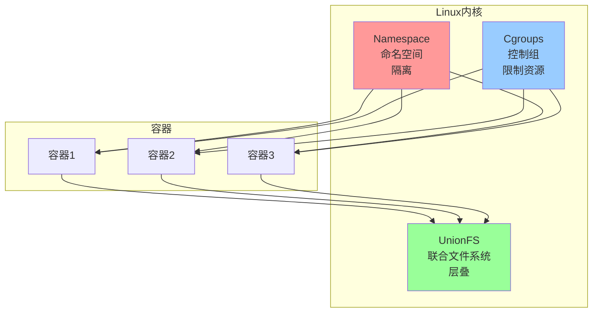

### 容器的生命周期

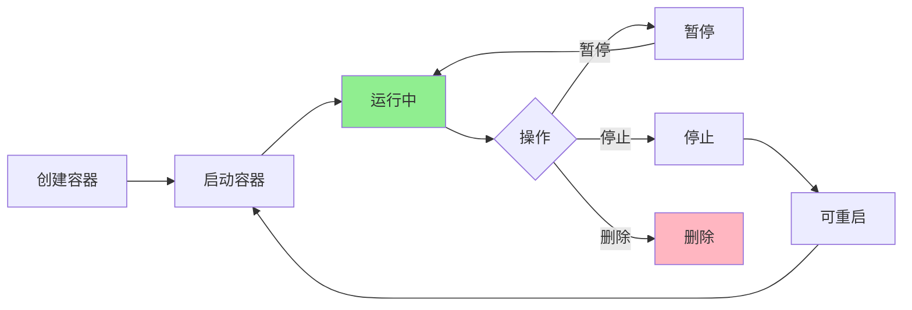

### 容器vs虚拟机——到底有啥区别？

| 对比项 | 容器 | 虚拟机 |
|--------|------|--------|
| 启动速度 | 秒级（1-2秒） | 分钟级（1-5分钟） |
| 资源占用 | 小（MB级别） | 大（GB级别） |
| 隔离性 | 操作系统级隔离 | 完全硬件级隔离 |
| 数量 | 单机可跑上千个 | 单机一般几十个 |
| 性能 | 原生性能，几乎无损耗 | 有虚拟化损耗 |
| 安全性 | 共享内核，安全性稍低 | 完全隔离，更安全 |

### 容器是谁的"杰作"？

提到容器，不得不提 **Docker**！

2013年，DotCloud公司（后改名Docker Inc.）把容器技术变得简单易用，从此掀起了容器革命。

Docker的logo是一只**鲸鱼背着好多集装箱**——是不是很形象？鲸鱼就是Linux系统，集装箱就是容器！

### 一图总结容器的"人设"

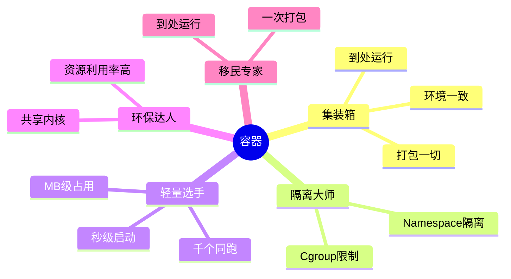

### 小结

容器是什么？
- **软件的集装箱**：把代码和运行环境打包在一起
- **隔离的盒子**：每个容器都有自己的"房间"
- **轻量的虚拟机**：比虚拟机启动更快、占用更少

容器解决了什么问题？
- 环境不一致问题
- 部署麻烦问题
- 资源浪费问题

下一节我们将详细对比**容器 vs 虚拟机**，看看它们各自的优缺点！

## 48.2 容器 vs 虚拟机

### 先聊聊虚拟机

在说容器之前，我们得先聊聊虚拟机（Virtual Machine，简称VM）。

虚拟机是什么？打个比方：

**虚拟机 = 买了一套房子**

- 你有自己的"操作系统"（Windows/Linux）
- 你有自己的"厨房"（系统资源）
- 你有自己的"卫生间"（完全隔离）
- 但代价是——**贵！慢！占地方！**

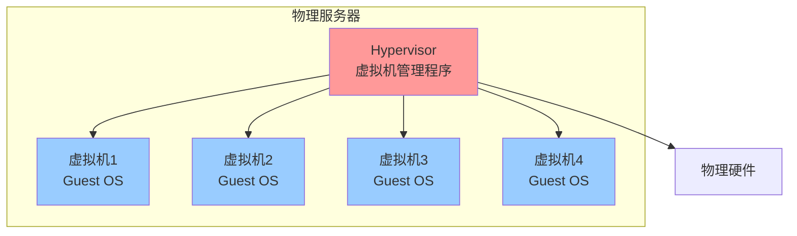

虚拟机需要什么？
- **Hypervisor（虚拟机管理程序）**：VMware、VirtualBox、KVM、Xen...
- **Guest OS（客户操作系统）**：每个虚拟机都要装一个完整的操作系统！
- **虚拟硬件**：虚拟CPU、虚拟内存、虚拟硬盘...

### 容器 vs 虚拟机对比图

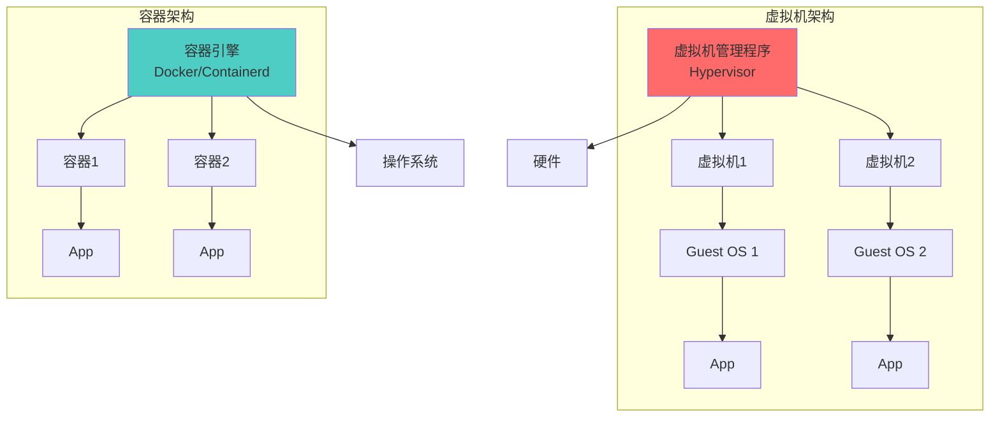

### 48.2.1 资源共享

#### 虚拟机的资源分配

虚拟机是**"独栋别墅"**：

```
物理服务器 (32核CPU, 128GB内存)

├── 虚拟机1 (4核CPU, 16GB内存) ← 独享，谁也动不了
├── 虚拟机2 (4核CPU, 16GB内存) ← 独享，谁也动不了
├── 虚拟机3 (4核CPU, 16GB内存) ← 独享，谁也动不了
└── 虚拟机4 (4核CPU, 16GB内存) ← 独享，谁也动不了

问题：虚拟机1只用了1核，剩下的3核浪费了！给别人用？不行的，说好的是4核！
```

#### 容器的资源共享

容器是**"合租公寓"**：

```
物理服务器 (32核CPU, 128GB内存)

├── 容器1 ← 用多少拿多少
├── 容器2 ← 用多少拿多少
├── 容器3 ← 用多少拿多少
├── 容器4 ← 用多少拿多少
├── 容器5 ← 用多少拿多少
...  ← 还能跑更多！

优点：资源利用率高！用不完的大家一起分！
```

**资源隔离 vs 资源共享：**

| 特性 | 虚拟机 | 容器 |
|------|---------|------|
| 资源分配 | 固定分配 | 动态共享 |
| 隔离级别 | 硬件级 | 操作系统级 |
| 资源利用率 | 低 | 高 |
| 灵活性 | 差 | 好 |

### 48.2.2 启动速度

#### 虚拟机的启动——像搬家

启动一个虚拟机，就像搬一次家：

```
1. 打开行李箱... (加载BIOS/UEFI)
2. 启动操作系统... (Windows/Linux启动要1-3分钟)
3. 安装厨房... (部署运行环境)
4. 装修... (安装依赖)
5. 搬家具... (部署应用程序)
6. 终于可以住了！ (应用启动)

总耗时：3-10分钟
```

#### 容器的启动——像开灯

启动一个容器，就像开灯：

```
1. 拉开关 (启动容器)
2. 灯亮了 (应用启动)

总耗时：1-5秒
```

#### 对比数据

| 操作 | 虚拟机 | 容器 |
|------|--------|------|
| 启动时间 | 30秒-5分钟 | 0.5秒-5秒 |
| 创建速度 | 慢 | 快 |
| 停止时间 | 10-60秒 | 0.1秒-1秒 |
| 扩缩容 | 分钟级 | 秒级 |

#### 为什么容器这么快？

1. **不需要启动操作系统**
   - 虚拟机要启动完整的Guest OS
   - 容器共享宿主机的内核，不需要启动OS

2. **不需要虚拟硬件**
   - 虚拟机要模拟CPU、内存、硬盘
   - 容器直接用真实硬件

3. **镜像更轻量**
   - 虚拟机镜像通常几GB
   - 容器镜像通常几十到几百MB

### 48.2.3 资源占用

#### 虚拟机的资源占用——"买房要公摊"

```
物理服务器: 32核CPU, 128GB内存

每个虚拟机都要有：
├── Guest OS (操作系统) → 10-20GB磁盘, 512MB-2GB内存
├── 虚拟硬件开销 → 额外10-20%资源
└── 应用程序

实际可用资源 ≈ 标称资源的70-80%
```

#### 容器的资源占用——"租房只算套内面积"

```
物理服务器: 32核CPU, 128GB内存

所有容器共享宿主机的OS，只占用应用程序本身的开销
├── 应用程序
└── 运行时依赖（通常几十到几百MB）

实际可用资源 ≈ 标称资源的95%+
```

#### 具体对比

| 资源类型 | 虚拟机 | 容器 |
|----------|--------|------|
| 磁盘占用 | 10-50GB/个 | 几十-几百MB/个 |
| 内存占用 | 512MB-4GB/个 | 几十-几百MB/个 |
| CPU开销 | 5-15% | <1% |
| 单机密度 | 10-50个 | 100-1000个 |

#### 实际案例对比

想象你要部署一个Web服务：

**用虚拟机部署：**
```
需要的虚拟机：2个（应用服务器 + 数据库服务器）
每个虚拟机：4核CPU, 8GB内存, 50GB磁盘

总计占用：
- CPU: 8核 (你买的是32核服务器，8/32 = 25% 利用率)
- 内存: 16GB (你买的是128GB，16/128 = 12.5% 利用率)
- 磁盘: 100GB (你买的是500GB，100/500 = 20% 利用率)

浪费的资源：70-80%！
```

**用容器部署：**
```
需要的容器：2个（应用容器 + 数据库容器）
每个容器：1核CPU, 512MB内存, 1GB磁盘

总计占用：
- CPU: 2核 (你买的是32核服务器，2/32 = 6.25% 利用率)
- 内存: 1GB (你买的是128GB，1/128 = 0.8% 利用率)
- 磁盘: 2GB (你买的是500GB，2/500 = 0.4% 利用率)

剩余资源：还能跑更多容器！
```

### 容器 vs 虚拟机：选择指南

| 场景 | 推荐 | 原因 |
|------|------|------|
| 需要完整操作系统 | 虚拟机 | 容器共享内核 |
| 需要最高安全性 | 虚拟机 | 完全硬件隔离 |
| 追求极致性能 | 容器 | 无虚拟化开销 |
| 微服务架构 | 容器 | 启动快、密度高 |
| CI/CD流水线 | 容器 | 快速构建、测试 |
| Windows应用 | 虚拟机 | 容器只支持Linux |
| 一次性测试环境 | 容器 | 秒级创建销毁 |

### 一图总结

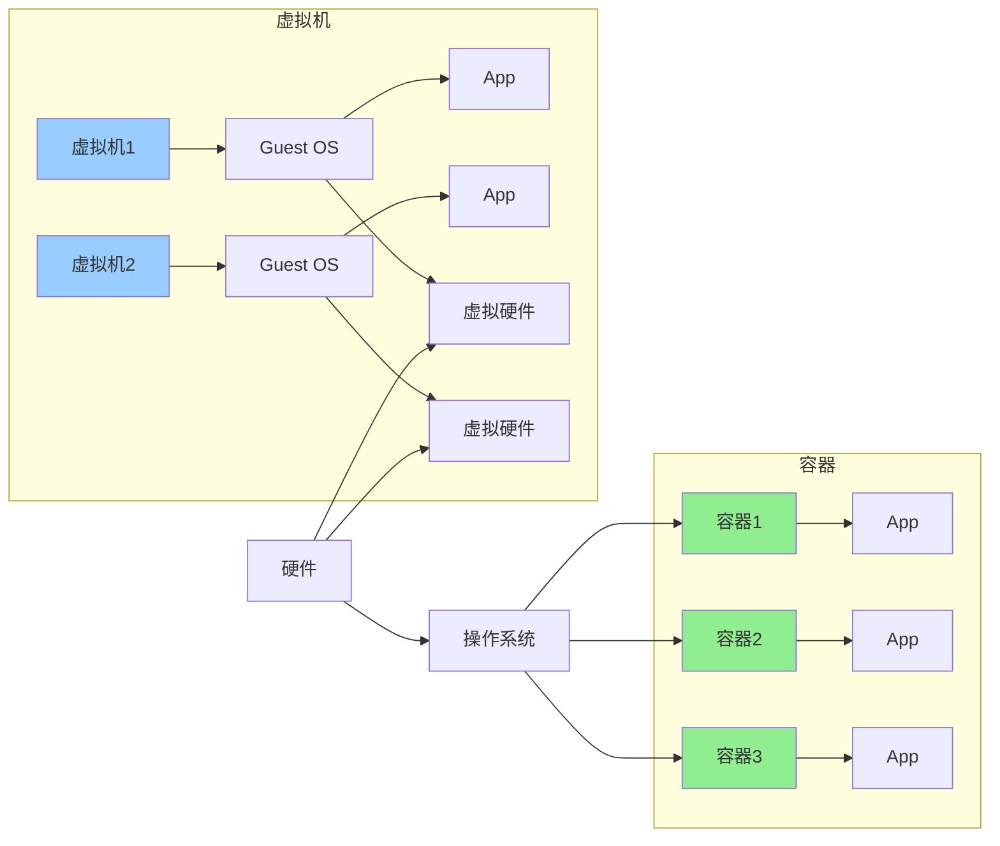

### 小结

容器 vs 虚拟机：

| 对比项 | 虚拟机 | 容器 |
|--------|--------|------|
| 启动速度 | 分钟级 | 秒级 |
| 资源占用 | GB级别 | MB级别 |
| 单机密度 | 低 | 高 |
| 隔离性 | 完全隔离 | 操作系统级 |
| 性能 | 有损耗 | 原生性能 |
| 适用场景 | 传统应用、安全要求高 | 微服务、CI/CD |

下一节我们将学习 **Docker**，这是容器技术的代言人！

## 48.3 Docker 简介

### Docker——容器技术的"代言人"

如果说容器是一辆**汽车**，那么Docker就是**Toyota**——让汽车走进千家万户的那个品牌！

Docker不是容器技术本身，而是**最流行的容器管理平台**。它让"容器"这个概念变得简单易用。

### Docker的诞生故事

2013年，DotCloud公司（后改名Docker Inc.）的创始人Solomon Hykes在PyCon大会上做了一个演示：

> "看看这个，我们可以在3秒钟内启动一个Redis实例！"

全场震惊！从此，Docker开始了它的"封神之路"。

```mermaid
flowchart Timeline
    A[2013年<br/>Docker诞生] --> B[2014年<br/>Docker 1.0发布]
    B --> C[2015年<br/>成立CNCF基金会]
    C --> D[2017年<br/>Docker开源containerd]
    D --> E[2019年<br/>Docker桌面版发布]
    E --> F[2020年至今<br/>Docker成为容器标准]
```

### Docker的核心概念

Docker有三个核心概念：**镜像（Image）**、**容器（Container）**、**仓库（Registry）**。

它们的的关系是这样的：

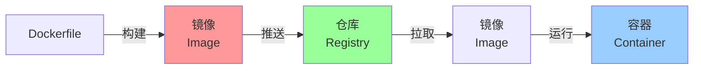

**类比理解：**

| Docker概念 | 类比 | 说明 |
|------------|------|------|
| **镜像** | **ISO镜像/菜谱** | 模板，只读的Blueprint |
| **容器** | **运行的程序/做好的菜** | 镜像的实例，可读写 |
| **仓库** | **App Store/菜市场** | 存储和分发镜像的地方 |
| **Dockerfile** | **配方/制作指南** | 构建镜像的配方 |

### 镜像（Image）

**镜像**就是一个只读的模板，里面包含了你程序运行所需的一切：
- 代码
- 运行时
- 系统工具
- 系统库
- 环境变量

**镜像的特点：**
- 分层结构：每个镜像由多个层组成，层可以复用
- 只读：镜像创建后不能修改
- 可共享：通过仓库分享给其他人

**常用镜像示例：**

```bash
# 拉取一个Ubuntu镜像
docker pull ubuntu:22.04

# 拉取一个Node.js镜像
docker pull node:18-alpine

# 拉取一个MySQL镜像
docker pull mysql:8.0

# 拉取一个Nginx镜像
docker pull nginx:latest
```

### 容器（Container）

**容器**就是镜像的实例——把镜像"运行"起来，就是一个容器。

**容器的特点：**
- 可读写：容器可以创建、启动、停止、删除
- 隔离：每个容器都有自己独立的空间
- 临时：容器停止后，修改会丢失（除非用数据卷持久化）

**容器的生命周期：**

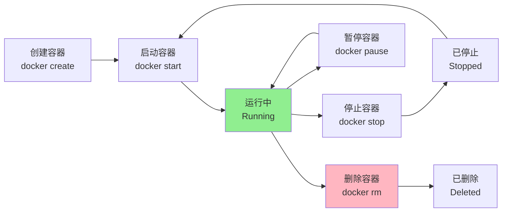

### 仓库（Registry）

**仓库**就是存储和分发镜像的地方。

最大的公共仓库是 **Docker Hub**：https://hub.docker.com/

```bash
# 从Docker Hub拉取镜像（默认行为）
docker pull ubuntu:22.04

# 从私有仓库拉取镜像
docker pull my-registry.com/my-app:v1.0

# 推送到仓库
docker push my-registry.com/my-app:v1.0
```

### Docker的组成

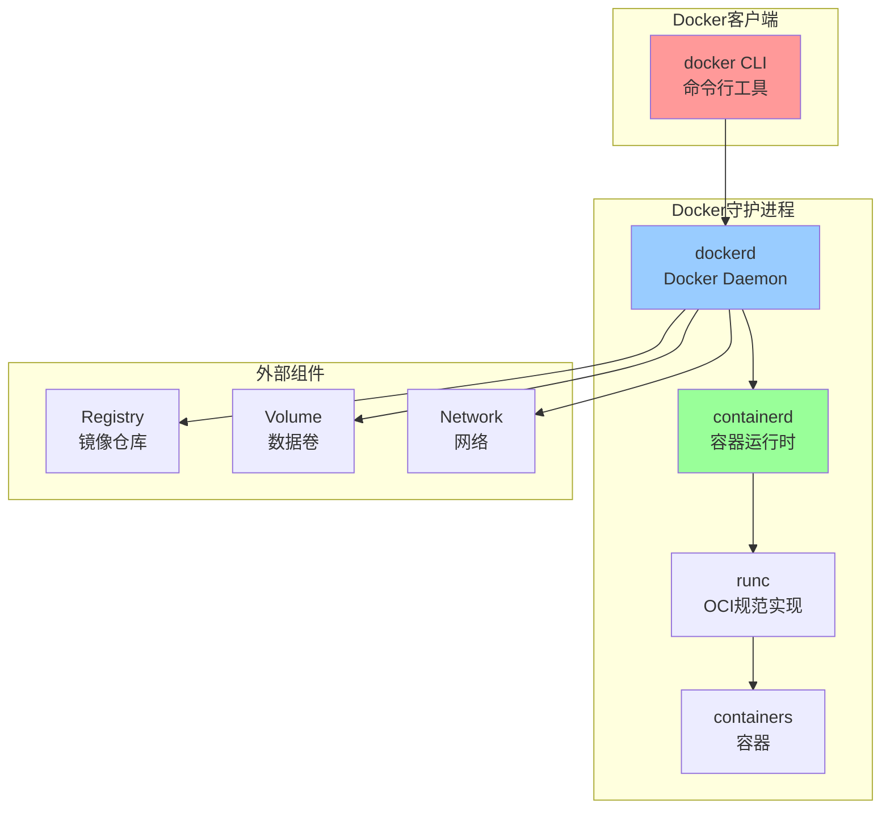

**各组件说明：**

| 组件 | 说明 |
|------|------|
| **Docker Client** | 命令行工具，你和Docker交互的入口 |
| **Docker Daemon** | 后台服务，管理镜像、容器等 |
| **containerd** | 容器运行时，负责容器生命周期管理 |
| **runc** | OCI规范实现，真正创建容器的工具 |
| **Registry** | 镜像仓库，存储和分发镜像 |
| **Volume** | 数据卷，持久化存储 |
| **Network** | 网络，容器间通信 |

### Docker vs 传统虚拟化

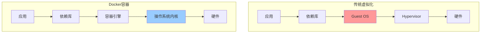

**对比总结：**

| 特性 | 传统虚拟化 | Docker容器 |
|------|-----------|------------|
| 启动速度 | 分钟级 | 秒级 |
| 资源占用 | 大 | 小 |
| 隔离性 | 完全隔离 | 操作系统级 |
| 可移植性 | 一般 | 极好 |
| 密度 | 低 | 高 |

### Docker的适用场景

| 场景 | 说明 | 优势 |
|------|------|------|
| **微服务架构** | 每个服务独立部署 | 快速部署、易于管理 |
| **CI/CD** | 持续集成/持续部署 | 构建快、测试一致 |
| **多环境部署** | 开发、测试、生产环境一致 | 减少"环境问题" |
| **弹性伸缩** | 根据负载动态扩缩容 | 秒级扩容 |
| **混合云** | 一次构建，到处运行 | 跨云平台部署 |
| **本地开发** | 模拟生产环境 | "在我电脑上能跑" |

### 一图总结Docker生态系统

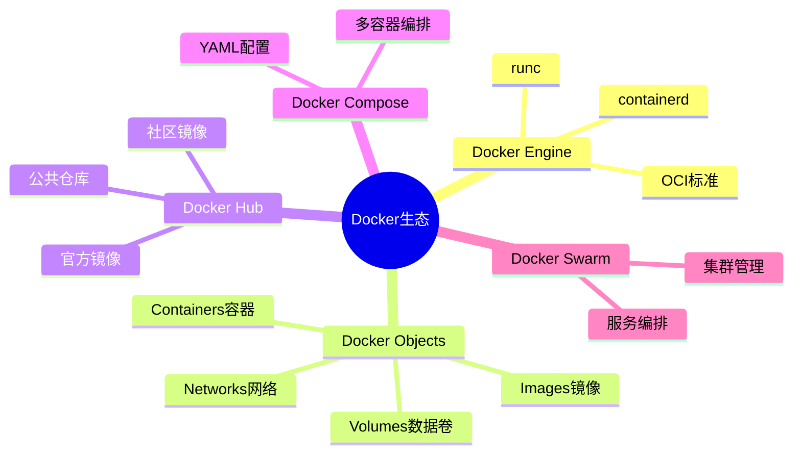

### 小结

Docker是什么？
- **容器管理平台**：让容器技术变得简单易用
- **镜像 + 容器 + 仓库**：三位一体的容器解决方案

Docker解决了什么问题？
- 环境不一致问题
- 部署麻烦问题
- 资源利用率低问题

Docker三剑客：
- **镜像（Image）**：只读模板
- **容器（Container）**：运行实例
- **仓库（Registry）**：分发中心

下一节我们将学习 **镜像**，深入了解这个"只读模板"！

## 48.4 镜像

### 镜像——容器的"蓝图"

**镜像（Image）** 是Docker中最核心的概念之一。你可以把它理解为：
- **Java中的Class** → 对象是类的实例
- **镜像中的Container** → 容器是镜像的实例

每个容器都是从镜像创建出来的，镜像就像**乐高积木的说明书**，告诉你应该怎么拼，但说明书本身不是积木。

### 镜像的分层结构

镜像采用**分层（Layer）**结构，这是Docker最精妙的设计之一！

**为什么用分层？**

想象一下，你要装修100套房子：
- 每套房子都要刷墙
- 每套房子都要铺地板
- 每套房子都要装灯具

**传统方式（每套房子独立装修）：**
```
房子1：刷墙 + 铺地板 + 装灯具 = 3份材料
房子2：刷墙 + 铺地板 + 装灯具 = 3份材料
房子100：刷墙 + 铺地板 + 装灯具 = 3份材料

总计：300份材料！
```

**分层方式（共享基础层）：**
```
基础层：地基、水电（所有房子共享）
    ↓
第一层：刷墙（所有房子一样）
    ↓
第二层：铺地板（所有房子一样）
    ↓
第三层：装灯具（每套房子可以不一样）

每套房子：基础层 + 前两层 + 第三层

如果第三层不一样，才需要额外材料！
```

#### Docker镜像的分层

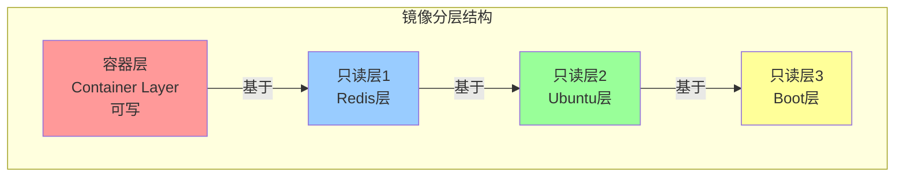

**分层的好处：**

| 好处 | 说明 |
|------|------|
| **共享基础层** | 多个镜像可以共享同一个基础层，节省磁盘空间 |
| **增量更新** | 只需要传输变化的层，加快传输速度 |
| **构建缓存** | 复用已有层，加快构建速度 |
| **可复用** | 你可以在别人的镜像基础上构建自己的镜像 |

### 镜像的存储位置

本地镜像存储在哪里？

```bash
# 查看Docker镜像存储位置
docker info | grep "Docker Root Dir"

# 输出类似：
# Docker Root Dir: /var/lib/docker
```

镜像存储在 `/var/lib/docker/overlay2/` 目录下（默认使用overlay2存储驱动）。

### 常用镜像操作命令

#### 查看本地镜像

```bash
# 列出所有本地镜像
docker images

# 输出示例：
# REPOSITORY   TAG      IMAGE ID       CREATED        SIZE
# ubuntu       22.04    8a3cdc4d2f3a   2 weeks ago    77.8MB
# nginx        latest   2b8e23d1c6f8   3 weeks ago    142MB
# redis        7.0      a3d4f2e5c8b1   1 week ago     117MB
# python       3.11     7f4b5e9a2c1d   5 days ago     1.01GB
```

#### 镜像标签（Tag）

镜像的完整名称格式是：`registry/repository:tag`

```bash
# 镜像标签说明
# nginx:latest    → repository: nginx, tag: latest
# nginx:1.23     → repository: nginx, tag: 1.23
# redis:7.0-alpine → repository: redis, tag: 7.0-alpine
# my-registry.com/myapp:v1 → registry: my-registry.com, repository: myapp, tag: v1

# 如果不指定tag，默认使用 latest
docker pull nginx  # 等价于 docker pull nginx:latest
```

**Tag的命名规范：**
- `latest`：最新版本（不一定稳定）
- `x.y.z`：语义化版本号
- `x.y.z-alpine`：基于Alpine Linux的轻量版

#### 拉取镜像

```bash
# 从Docker Hub拉取镜像
docker pull ubuntu:22.04

# 拉取特定版本
docker pull python:3.11-slim

# 拉取所有标签（不推荐，浪费时间）
docker pull -a ubuntu

# 拉取时指定平台（跨平台构建）
docker pull --platform linux/arm64 ubuntu:22.04
```

#### 删除镜像

```bash
# 删除单个镜像
docker rmi nginx:latest

# 删除未使用的镜像
docker image prune

# 删除所有未使用的镜像
docker image prune -a

# 强制删除正在使用的镜像（不推荐）
docker rmi -f ubuntu:22.04
```

#### 镜像构建

**方式1：使用Dockerfile构建（推荐）**

```bash
# 从当前目录的Dockerfile构建镜像
docker build -t myapp:v1 .

# 指定Dockerfile路径
docker build -t myapp:v1 -f /path/to/Dockerfile .

# 不带缓存重新构建
docker build --no-cache -t myapp:v1 .
```

**方式2：从容器创建镜像**

```bash
# 1. 启动一个容器并做修改
docker run -it ubuntu:22.04 /bin/bash
# 在容器内执行操作
apt update && apt install -y vim
exit

# 2. 提交修改创建新镜像
docker commit <container_id> my-ubuntu:v1

# 查看新创建的镜像
docker images | grep my-ubuntu
```

### 镜像的内部结构

使用 `docker history` 可以看到镜像的每一层：

```bash
# 查看nginx镜像的分层结构
docker history nginx:latest

# 输出示例：
# IMAGE          CREATED        CREATED BY                          SIZE      COMMENT
# 8e3a217a82b7   2 weeks ago   /bin/sh -c #(nop)  CMD ["nginx"...]    0B        nginx命令
# a6bd71f48f88   2 weeks ago   /bin/sh -c #(nop) EXPOSE 80            0B        暴露80端口
# <missing>      2 weeks ago   /bin/sh -c #(nop) COPY file:...         1.46kB    复制配置文件
# <missing>      2 weeks ago   /bin/sh -c apt-get update...           77.8MB    安装依赖
# <missing>      3 weeks ago   /bin/sh -c #(nop) ADD file:...         77.8MB    添加基础文件
# <missing>      4 weeks ago   /bin/sh -c #(nop) CMD ["/bin/bash"]    0B        基础命令
```

### 镜像优化策略

镜像太大会导致：
- 拉取时间长
- 占用磁盘多
- 构建缓存效率低

**优化策略：**

| 策略 | 说明 |
|------|------|
| **使用轻量基础镜像** | 如 `alpine`、`slim` 版本 |
| **减少层数** | 合并多个RUN指令 |
| **删除缓存和临时文件** | 如 `apt clean`、`rm -rf /var/cache/*` |
| **使用多阶段构建** | 最终镜像只包含运行时需要的内容 |
| **.dockerignore** | 排除不需要的文件 |

**示例：对比镜像大小**

```bash
# Ubuntu镜像
docker pull ubuntu:22.04
# 大小：77.8MB

# Alpine镜像（专为容器设计的轻量Linux）
docker pull ubuntu:22.04
# 大小：77.8MB

# 使用Alpine版本
docker pull python:3.11-alpine
# 大小：约150MB

# 对比完整版
docker pull python:3.11
# 大小：约1GB
```

### 一图总结镜像操作

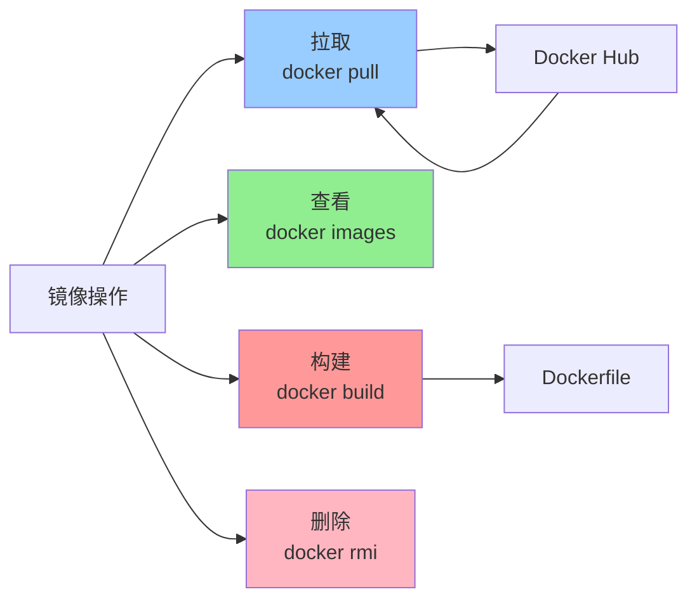

### 小结

镜像是什么？
- **只读的模板**：包含应用程序和其运行环境
- **分层结构**：共享基础层，高效利用资源

镜像操作：
- `docker pull` 拉取镜像
- `docker images` 查看镜像
- `docker build` 构建镜像
- `docker rmi` 删除镜像

下一节我们将学习 **容器**，看看镜像如何变成可运行的容器！

## 48.5 容器

### 容器——镜像的"实例"

如果说**镜像**是一个**菜谱**，那么**容器**就是按照菜谱**做出来的菜**！

- 镜像：只读的模板，告诉你怎么构建
- 容器：可写的实例，实际运行的程序

**一个镜像可以创建多个容器**，就像一个菜谱可以做出多份菜一样！

### 容器的基本操作

#### 创建容器

```bash
# 创建容器（但不启动）
docker create --name my-container nginx:latest

# 创建并启动容器
docker run --name my-container -d nginx:latest
# -d: 后台运行（detached）
```

#### 启动容器

```bash
# 启动已创建的容器
docker start my-container

# 重启容器
docker restart my-container
```

#### 停止容器

```bash
# 停止运行中的容器
docker stop my-container

# 强制停止（发送SIGKILL信号）
docker kill my-container
```

#### 进入容器

```bash
# 方法1：使用docker exec进入容器
docker exec -it my-container /bin/bash

# 方法2：使用docker attach（不太推荐，会共享终端）
docker attach my-container
```

#### 查看容器

```bash
# 查看运行中的容器
docker ps

# 查看所有容器（包括已停止的）
docker ps -a

# 查看容器详细信息
docker inspect my-container

# 查看容器日志
docker logs -f my-container
```

### 容器的生命周期

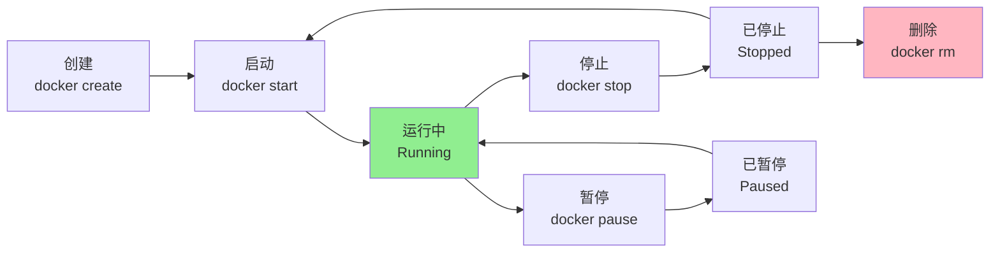

### 容器的状态

| 状态 | 说明 |
|------|------|
| **created** | 已创建但未启动 |
| **running** | 正在运行 |
| **paused** | 已暂停（进程挂起） |
| **restarting** | 正在重启 |
| **exited** | 已停止 |
| **dead** | 已死亡（通常是错误状态） |

### 容器的高级操作

#### 后台运行与端口映射

```bash
# 后台运行容器
docker run -d --name web-server nginx:latest

# 端口映射（将宿主机的8080端口映射到容器的80端口）
docker run -d --name web-server -p 8080:80 nginx:latest

# 访问测试
curl http://localhost:8080

# 常用端口映射格式：
# -p 8080:80     → 宿主机8080 → 容器80
# -p 127.0.0.1:8080:80  → 只有本机可以访问
# -p 8080:80/udp  → 映射UDP端口
```

#### 环境变量

```bash
# 设置环境变量
docker run -d --name app -e APP_ENV=production -e DB_HOST=localhost myapp:latest

# 查看容器的环境变量
docker exec my-container env
```

#### 挂载数据卷

```bash
# 将宿主机的目录挂载到容器
docker run -d --name web -v /host/path:/container/path nginx:latest

# 使用Docker管理的卷
docker volume create my-volume
docker run -d --name web -v my-volume:/data nginx:latest

# 查看卷
docker volume ls
docker volume inspect my-volume
```

### 容器的网络

容器如何与外部通信？Docker提供了多种网络模式：

```bash
# 查看Docker网络
docker network ls

# 网络模式说明：
# bridge  → 桥接模式（默认），容器在虚拟网络中
# host    → 主机模式，容器直接使用宿主机网络
# none    → 无网络，容器完全隔离
# overlay → 覆盖网络，用于Docker Swarm集群

# 创建自定义网络
docker network create my-network

# 让容器加入自定义网络
docker run -d --name app --network my-network myapp:latest
```

### 容器的资源限制

容器虽然共享宿主机资源，但我们可以限制它能使用的资源量：

```bash
# 限制内存
docker run -d --name app --memory="512m" myapp:latest

# 限制CPU
docker run -d --name app --cpus="1.0" myapp:latest

# 限制CPU核心数
docker run -d --name app --cpuset-cpus="0,1" myapp:latest

# 限制内存和CPU
docker run -d --name app \
    --memory="1g" \
    --memory-swap="1g" \
    --cpus="2" \
    myapp:latest
```

### 容器的日志

```bash
# 查看容器日志
docker logs my-container

# 实时查看日志
docker logs -f my-container

# 查看最近100行日志
docker logs --tail 100 my-container

# 查看指定时间范围的日志
docker logs --since "2024-01-01" my-container
docker logs --since 1h my-container

# 日志驱动配置（JSON文件方式）
docker run -d --log-driver=json-file --log-opt max-size=10m --log-opt max-file=3 myapp:latest
```

### 容器的清理

```bash
# 删除已停止的容器
docker rm my-container

# 强制删除运行中的容器
docker rm -f my-container

# 删除所有已停止的容器
docker container prune

# 删除所有容器（包括运行中的）
docker rm -f $(docker ps -aq)
```

### 容器实战案例

#### 案例1：运行一个Web服务器

```bash
# 1. 拉取Nginx镜像
docker pull nginx:latest

# 2. 运行Nginx容器
docker run -d \
    --name my-nginx \
    -p 80:80 \
    -v /host/html:/usr/share/nginx/html \
    nginx:latest

# 3. 测试访问
curl http://localhost

# 4. 查看日志
docker logs -f my-nginx

# 5. 停止并删除
docker stop my-nginx
docker rm my-nginx
```

#### 案例2：运行一个数据库

```bash
# 1. 运行MySQL容器
docker run -d \
    --name mysql-db \
    -p 3306:3306 \
    -e MYSQL_ROOT_PASSWORD=secret123 \
    -e MYSQL_DATABASE=myapp \
    -e MYSQL_USER=app \
    -e MYSQL_PASSWORD=app123 \
    -v mysql-data:/var/lib/mysql \
    mysql:8.0

# 2. 查看容器状态
docker ps | grep mysql

# 3. 连接MySQL
docker exec -it mysql-db mysql -u root -p

# 4. 查看数据库
SHOW DATABASES;
```

### 一图总结容器操作

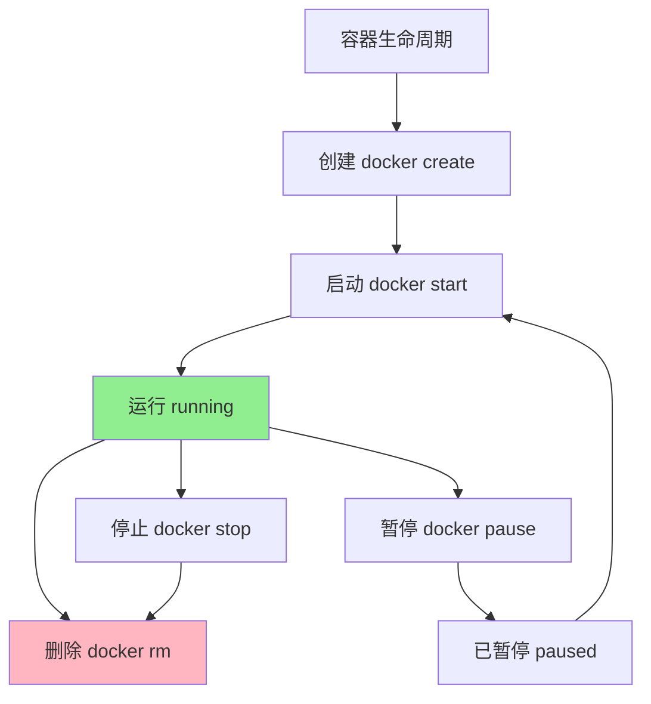

### 小结

容器是什么？
- **镜像的实例**：运行中的程序
- **可写的层**：可以在上面做修改
- **隔离的环境**：与宿主机和其他容器隔离

容器操作：
- `docker run` 创建并启动
- `docker ps` 查看容器
- `docker start/stop/restart` 启停控制
- `docker exec` 进入容器
- `docker logs` 查看日志
- `docker rm` 删除容器

下一节我们将学习 **仓库**，了解如何存储和分发镜像！

## 48.6 仓库

### 仓库——镜像的"App Store"

如果说**镜像**是**应用程序**，那么**仓库**就是**应用商店**！

你可以在仓库里：
- **上传**自己的镜像（推送）
- **下载**别人的镜像（拉取）
- **搜索**感兴趣的镜像

### Docker Hub——最大的镜像仓库

**Docker Hub** 是Docker官方提供的公共仓库，里面有海量的官方镜像和社区镜像。

官网：https://hub.docker.com/

```bash
# 搜索镜像
docker search ubuntu

# 输出示例：
# NAME      DESCRIPTION                     STARS    OFFICIAL    AUTOMATED
# ubuntu    Ubuntu is ...                   12345    [OK]
# dorowu/ubuntu-desktop-lxde-vnc    ...    1234
# traguilar/ubuntu-gui-...                89

# 搜索包含关键词的镜像
docker search --filter=stars=100 nginx
```

### 仓库、镜像、标签的关系

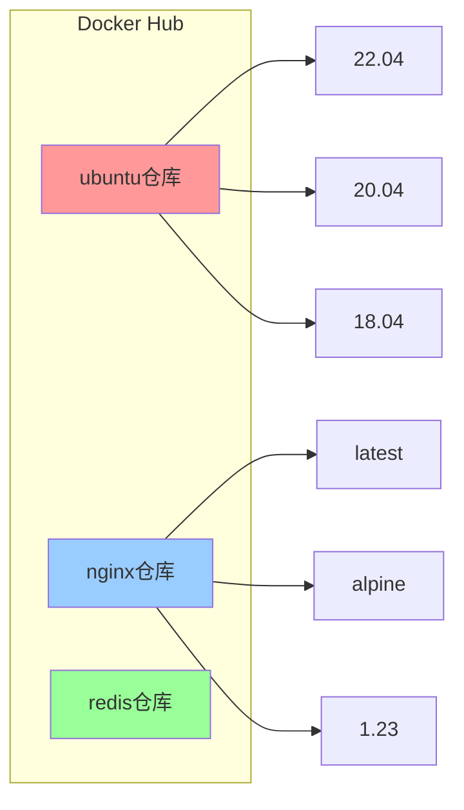

**命名规范：**
```
registry/namespace/repository:tag

示例：
docker.io/library/ubuntu:22.04
  │      │      │       │
  │      │      │       └── Tag（标签）
  │      │      └─────────── Repository（仓库）
  │      └────────────────── Namespace（命名空间）
  └─────────────────────────── Registry（仓库服务器）
```

### 常用仓库操作

#### 拉取镜像

```bash
# 从Docker Hub拉取（默认行为）
docker pull ubuntu:22.04

# 完整写法
docker pull docker.io/library/ubuntu:22.04

# 拉取特定平台的镜像
docker pull --platform linux/arm64 ubuntu:22.04
```

#### 推送镜像

```bash
# 1. 登录Docker Hub
docker login

# 2. 给镜像打标签
docker tag myapp:latest myusername/myapp:v1.0

# 3. 推送到仓库
docker push myusername/myapp:v1.0

# 4. 以后就可以用这个命令拉取了
docker pull myusername/myapp:v1.0
```

#### 私有仓库

很多公司会搭建自己的私有仓库：

**Harbor（最流行的私有仓库）：**
```bash
# 登录私有仓库
docker login my-registry.com

# 推送镜像到私有仓库
docker tag myapp:latest my-registry.com/myapp:v1.0
docker push my-registry.com/myapp:v1.0

# 从私有仓库拉取
docker pull my-registry.com/myapp:v1.0
```

### 搭建私有仓库

#### 使用Docker Registry（简易版）

```bash
# 1. 运行Registry容器
docker run -d \
    --name registry \
    -p 5000:5000 \
    -v registry-data:/var/lib/registry \
    registry:2

# 2. 给镜像打标签（使用localhost）
docker tag myapp:latest localhost:5000/myapp:v1.0

# 3. 推送到本地仓库
docker push localhost:5000/myapp:v1.0

# 4. 从本地仓库拉取
docker pull localhost:5000/myapp:v1.0
```

#### 查看仓库中的镜像

```bash
# 查看仓库中的镜像列表
curl http://localhost:5000/v2/_catalog

# 查看某个镜像的所有标签
curl http://localhost:5000/v2/myapp/tags/list
```

### Docker Hub的官方镜像

Docker Hub上有大量官方维护的优质镜像：

| 类别 | 镜像 | 说明 |
|------|------|------|
| **操作系统** | ubuntu, debian, alpine, centos | 基础操作系统 |
| **编程语言** | python, node, golang, ruby, java | 开发环境 |
| **数据库** | mysql, postgres, redis, mongodb | 数据存储 |
| **Web服务** | nginx, apache, tomcat | Web服务器 |
| **DevOps** | jenkins, gitlab, drone | 持续集成 |
| **监控** | prometheus, grafana | 监控系统 |

### 镜像加速器

在中国，拉取Docker Hub镜像可能很慢，可以使用镜像加速器：

```bash
# 配置镜像加速器（修改daemon.json）
sudo nano /etc/docker/daemon.json

# 添加加速器地址
{
    "registry-mirrors": [
        "https://docker.mirrors.ustc.edu.cn",
        "https://hub-mirror.c.163.com"
    ]
}

# 重启Docker服务
sudo systemctl restart docker

# 验证加速器是否生效
docker info | grep "Registry Mirrors"
```

### 一图总结仓库操作

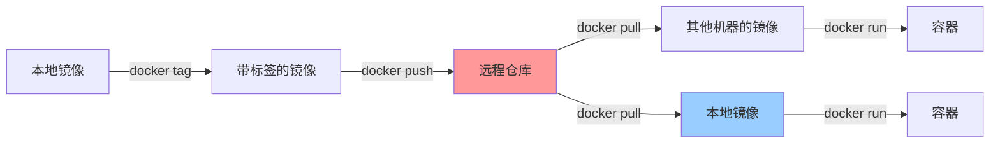

### 小结

仓库是什么？
- **镜像的存储和分发中心**
- **类似App Store的概念**

仓库操作：
- `docker pull` 拉取镜像
- `docker push` 推送镜像
- `docker search` 搜索镜像

常用仓库：
- Docker Hub（公共仓库）
- 私有Registry
- Harbor（企业级私有仓库）

---

## 本章小结

本章我们学习了容器技术的基础知识：

### 容器是什么？
- **软件的集装箱**：打包代码和运行环境
- **隔离的盒子**：每个容器独立运行
- **轻量的虚拟机**：秒级启动，MB级占用

### 容器 vs 虚拟机

| 对比项 | 容器 | 虚拟机 |
|--------|------|--------|
| 启动速度 | 秒级 | 分钟级 |
| 资源占用 | MB级别 | GB级别 |
| 隔离性 | 操作系统级 | 硬件级 |
| 密度 | 高（千个/机） | 低（几十个/机） |

### Docker三剑客

| 概念 | 说明 | 类比 |
|------|------|------|
| **镜像** | 只读模板 | 菜谱 |
| **容器** | 运行实例 | 做好的菜 |
| **仓库** | 存储分发 | 菜市场 |

### Docker核心操作

```bash
# 镜像操作
docker pull nginx        # 拉取镜像
docker images           # 查看本地镜像
docker build -t myapp . # 构建镜像
docker rmi nginx         # 删除镜像

# 容器操作
docker run -d nginx      # 创建并启动容器
docker ps               # 查看容器
docker exec -it app bash # 进入容器
docker logs -f app      # 查看日志
docker stop/rm app       # 停止/删除容器

# 仓库操作
docker push myapp:v1    # 推送镜像
docker search nginx      # 搜索镜像
```

### 下章预告

下一章我们将深入学习 **Docker 入门**，从安装到实战，手把手教你玩转Docker！

> **趣味彩蛋**：Docker的鲸鱼背着集装箱的logo，寓意是"让集装箱（容器）像鲸鱼一样承载万物。
>
> 但程序员们更喜欢把它理解为："看，这只鲸鱼背着这么多集装箱，迟早要沉！" 😂
>
> 记住：**容器虽好，可不要贪多哦！不然鲸鱼真的会沉的！** 🐋


