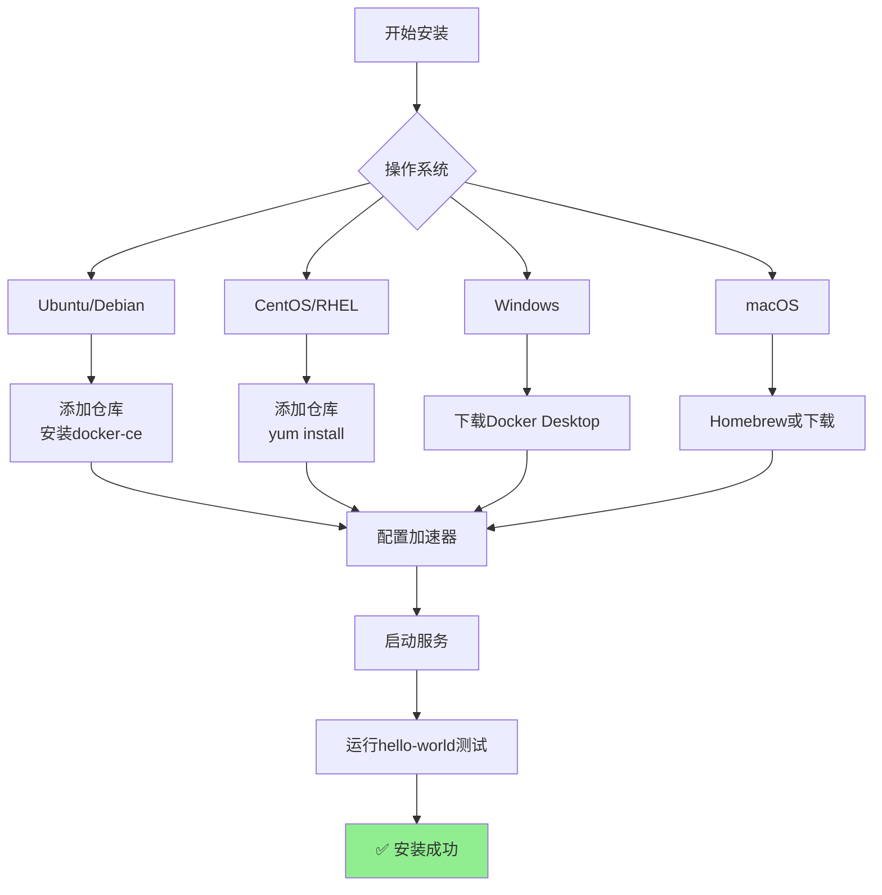
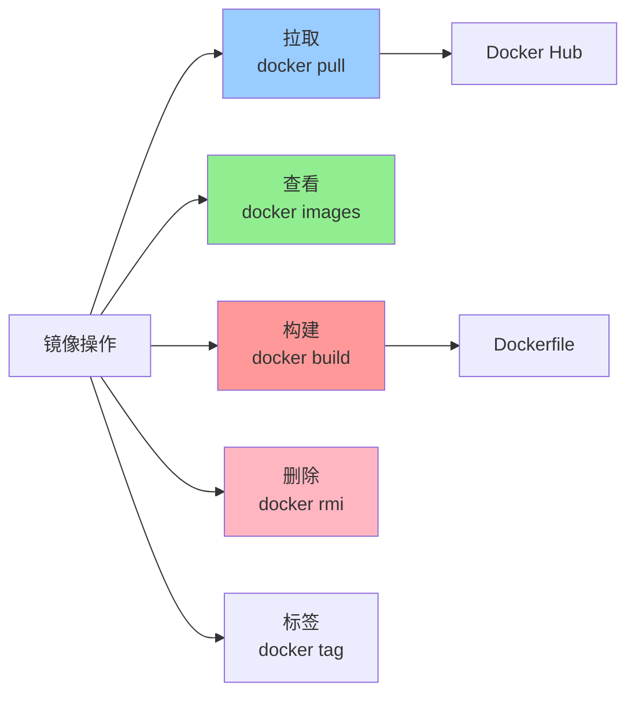
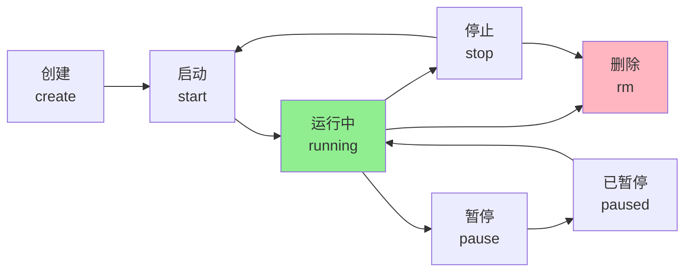
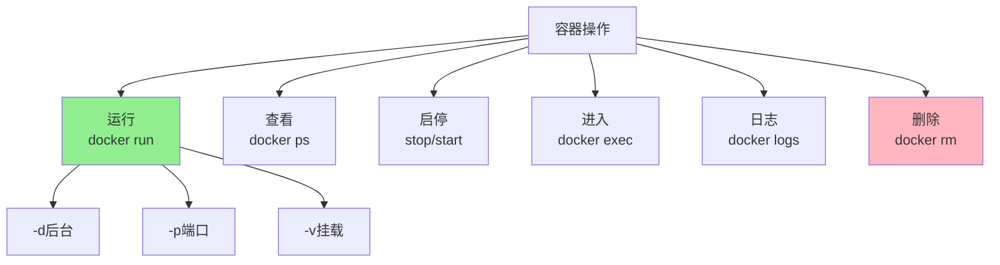
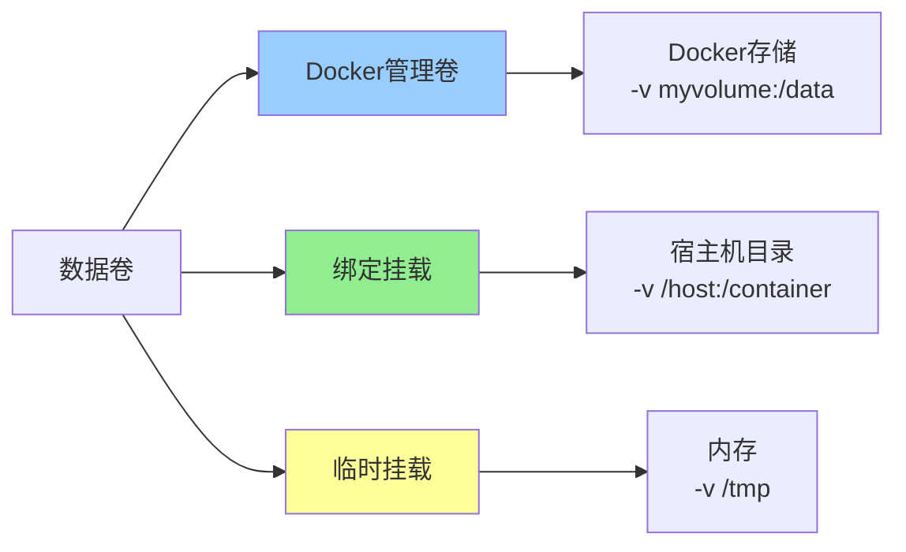
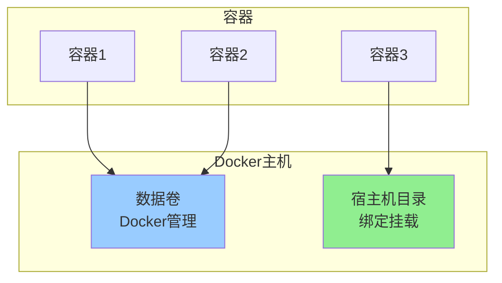
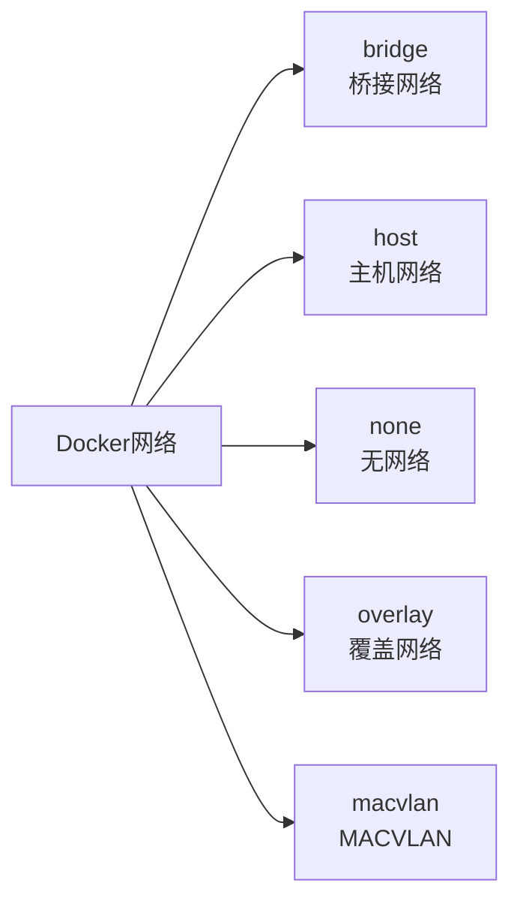
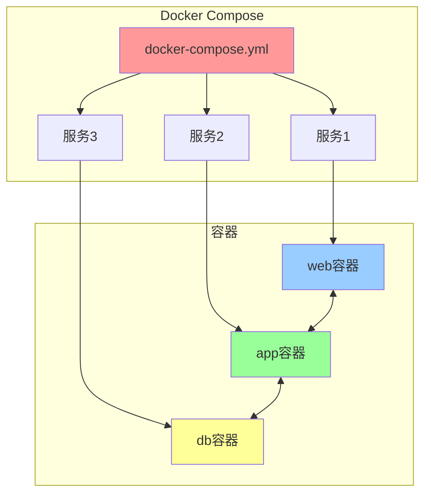

+++
title = "第49章：Docker 入门"
weight = 490
date = "2026-03-24T13:18:28+08:00"
type = "docs"
description = ""
isCJKLanguage = true
draft = false
+++


# 第四十九章：Docker 入门

## 49.1 Docker 安装

### Docker安装前的准备

在安装Docker之前，我们先了解一下Docker的版本：

**Docker有两个版本：**
- **Docker CE（Community Edition）**：社区版，免费开源
- **Docker EE（Enterprise Edition）**：企业版，付费功能

我们学习用社区版就够了！

### 在Ubuntu上安装Docker

#### 方法一：使用apt安装（推荐新手）

```bash
# 1. 更新软件包索引
sudo apt update

# 2. 安装依赖包
sudo apt install -y \
    apt-transport-https \
    ca-certificates \
    curl \
    gnupg \
    lsb-release

# 3. 添加Docker官方GPG密钥
curl -fsSL https://download.docker.com/linux/ubuntu/gpg | sudo gpg --dearmor -o /usr/share/keyrings/docker-archive-keyring.gpg

# 4. 添加Docker仓库
echo \
    "deb [arch=$(dpkg --print-architecture) signed-by=/usr/share/keyrings/docker-archive-keyring.gpg] https://download.docker.com/linux/ubuntu \
    $(lsb_release -cs) stable" | sudo tee /etc/apt/sources.list.d/docker.list > /dev/null

# 5. 再次更新软件包索引
sudo apt update

# 6. 安装Docker
sudo apt install -y docker-ce docker-ce-cli containerd.io

# 7. 验证安装
docker --version
# Docker version 24.0.7, build afdd53b
```

#### 方法二：使用脚本一键安装（懒人专用）

```bash
# 官方提供的一键安装脚本
curl -fsSL https://get.docker.com | sh

# 安装完成后会自动启动Docker服务
```

### 在CentOS/RHEL上安装Docker

```bash
# 1. 安装依赖
sudo yum install -y yum-utils

# 2. 添加Docker仓库
sudo yum-config-manager --add-repo https://download.docker.com/linux/centos/docker-ce.repo

# 3. 安装Docker
sudo yum install -y docker-ce docker-ce-cli containerd.io

# 4. 启动Docker
sudo systemctl start docker

# 5. 设置开机自启
sudo systemctl enable docker

# 6. 验证安装
docker --version
```

### 在Windows上安装Docker

Windows用户需要使用 **Docker Desktop**：

```powershell
# 1. 下载Docker Desktop
# 访问 https://www.docker.com/products/docker-desktop/

# 2. 运行安装程序，一路Next即可

# 3. 安装完成后，启动Docker Desktop

# 4. 打开PowerShell验证
docker --version
docker-compose --version
```

**Docker Desktop的系统要求：**
- Windows 10/11 专业版/企业版/家庭版（需要WSL2）
- 注意：家庭版通过 WSL2 后端运行，无需 Hyper-V
- 至少4GB内存
- 至少4GB内存
- 至少64GB磁盘空间

### 在macOS上安装Docker

```bash
# 方法1：使用Homebrew
brew install --cask docker

# 方法2：下载Docker Desktop
# 访问 https://www.docker.com/products/docker-desktop/
```

### Docker安装后配置

#### 1. 以非root用户运行Docker（推荐）

```bash
# 创建docker用户组（通常已存在）
sudo groupadd docker

# 将当前用户添加到docker组
sudo usermod -aG docker $USER

# 重新登录或重启系统使更改生效
# 或者使用newgrp命令立即生效
newgrp docker

# 验证（不需要sudo）
docker run hello-world
```

#### 2. 配置Docker镜像加速

在中国，Docker Hub访问较慢，建议配置镜像加速器：

```bash
# 编辑Docker配置
sudo nano /etc/docker/daemon.json

# 添加镜像加速器
{
    "registry-mirrors": [
        "https://docker.mirrors.ustc.edu.cn",
        "https://hub-mirror.c.163.com",
        "https://mirror.baidubce.com"
    ]
}

# 重启Docker服务
sudo systemctl restart docker

# 验证配置
docker info | grep -A 10 "Registry Mirrors"
```

#### 3. 配置Docker开机启动

```bash
# Ubuntu/Debian
sudo systemctl enable docker

# CentOS/RHEL
sudo systemctl enable docker
```

### 卸载Docker

如果需要卸载Docker：

```bash
# Ubuntu/Debian
sudo apt purge docker-ce docker-ce-cli containerd.io
sudo rm -rf /var/lib/docker
sudo rm -rf /var/lib/containerd

# CentOS/RHEL
sudo yum remove docker-ce docker-ce-cli containerd.io
sudo rm -rf /var/lib/docker
sudo rm -rf /var/lib/containerd
```

### Docker服务管理

```bash
# 查看Docker服务状态
sudo systemctl status docker

# 启动Docker
sudo systemctl start docker

# 停止Docker
sudo systemctl stop docker

# 重启Docker
sudo systemctl restart docker

# 开机自启
sudo systemctl enable docker

# 取消开机自启
sudo systemctl disable docker
```

### 验证Docker安装

安装完成后，运行官方测试镜像验证：

```bash
# 运行hello-world镜像
docker run hello-world

# 应该看到以下输出：
# 
# Hello from Docker!
# This message shows that your installation appears to be working correctly.
# 
# To generate this message, Docker took the following steps:
#  1. The Docker client contacted the Docker daemon.
#  2. The Docker daemon pulled the "hello-world" image from the Docker Hub.
#     (most likely you haven't pulled it before)
#  3. The Docker daemon created a new container from that image which runs the
#     executable that produces the output you are currently reading.
#  4. The Docker daemon streamed that output to the Docker client, which sent it
#     to your terminal.
```

### 一图总结Docker安装流程



### 常见安装问题

| 问题 | 解决方案 |
|------|----------|
| 权限被拒绝 | 使用 `sudo` 或将用户加入 `docker` 组 |
| 拉取镜像慢 | 配置Docker镜像加速器 |
| WSL2未安装 | Windows需要启用WSL2功能 |
| 虚拟机未启用 | BIOS中启用虚拟化技术 |

### 小结

Docker安装要点：
- **Ubuntu**：`apt install docker-ce`
- **CentOS**：`yum install docker-ce`
- **Windows/Mac**：下载Docker Desktop
- 安装后运行 `docker run hello-world` 测试

下一节我们将学习 **镜像操作**，看看如何管理Docker镜像！

## 49.2 镜像操作

### 镜像的基础知识

在开始操作之前，先了解一下Docker镜像的基本概念：

**镜像的命名格式：**
```
registry/repository:tag
```

示例：
- `nginx:latest` → latest标签的nginx镜像
- `ubuntu:22.04` → 22.04标签的ubuntu镜像
- `registry.example.com/myapp:v1.0` → 私有仓库的镜像

### 49.2.1 docker pull——拉取镜像

#### 基本用法

```bash
# 拉取镜像（默认从Docker Hub）
docker pull nginx:latest

# 拉取特定版本
docker pull python:3.11-slim

# 拉取所有标签（不推荐，浪费带宽）
docker pull -a ubuntu
```

#### 拉取镜像的过程

```bash
# 拉取镜像并观察过程
docker pull ubuntu:22.04

# 输出示例：
# 22.04: Pulling from library/ubuntu
# 8a3cdc4d2f3a: Pulling fs layer   ← 开始拉取层1
# 5e37b8d1c8b9: Pulling fs layer   ← 开始拉取层2
# 8a3cdc4d2f3a: Verifying Checksum   ← 校验层1
# 8a3cdc4d2f3a: Download complete  ← 层1完成
# 5e37b8d1c8b9: Verifying Checksum   ← 校验层2
# 5e37b8d1c8b9: Pull complete      ← 层2完成
# Digest: sha256:abc123...
# Status: Downloaded newer image for ubuntu:22.04
```

#### 从私有仓库拉取

```bash
# 从私有仓库拉取
docker pull my-registry.com/myapp:v1.0

# 从其他仓库拉取
docker pull gcr.io/google-containers/pause:3.0
```

#### 拉取指定平台镜像

```bash
# 拉取ARM64架构的镜像（Apple Silicon Mac）
docker pull --platform linux/arm64 ubuntu:22.04

# 拉取AMD64架构的镜像
docker pull --platform linux/amd64 ubuntu:22.04
```

### 49.2.2 docker images——查看本地镜像

#### 基本用法

```bash
# 查看所有本地镜像
docker images

# 输出示例：
# REPOSITORY   TAG       IMAGE ID       CREATED        SIZE
# nginx        latest    8a3b4e8c2d1f   2 weeks ago    142MB
# ubuntu       22.04     5a8d2f8c3d1e   3 weeks ago    77.8MB
# python       3.11      a7b8c9d0e1f2   1 week ago     1.01GB
# hello-world  latest    fce289e99eb2   2 months ago   13.3kB
```

#### 查看详细信息

```bash
# 查看镜像详细信息
docker image inspect nginx:latest

# 查看镜像的层信息
docker history nginx:latest

# 只显示镜像ID
docker images -q

# 只显示镜像ID（所有，包括中间层）
docker images -qa
```

#### 格式化输出

```bash
# 只显示仓库名和标签
docker images --format "{{.Repository}}:{{.Tag}}"

# 显示更友好的格式
docker images --format "table {{.Repository}}\t{{.Tag}}\t{{.Size}}"

# 只显示大于指定大小的镜像
docker images --format "{{.Repository}}:{{.Tag}} - {{.Size}}" | grep -E "GB|MB" | sort -h
```

### 49.2.3 docker rmi——删除镜像

#### 基本用法

```bash
# 删除单个镜像
docker rmi nginx:latest

# 通过镜像ID删除
docker rmi 8a3b4e8c2d1f

# 强制删除（即使有容器在使用）
docker rmi -f nginx:latest
```

#### 清理未使用的镜像

```bash
# 删除所有未使用的镜像（ dangling：未被标签的）
docker image prune

# 删除所有未使用的镜像
docker image prune -a

# 删除所有镜像（危险！）
docker rmi $(docker images -q)

# 删除所有未使用的卷
docker volume prune
```

### 49.2.4 docker build——构建镜像

#### Dockerfile基础

Dockerfile是构建镜像的"配方"，里面包含了一系列指令：

```dockerfile
# Dockerfile示例
FROM ubuntu:22.04              # 基础镜像
LABEL maintainer="you@email.com" # 元数据
RUN apt-get update && apt-get install -y nginx  # 构建时命令
EXPOSE 80                      # 暴露端口
CMD ["nginx", "-g", "daemon off;"]  # 启动命令
```

#### 构建镜像

```bash
# 基本构建（从当前目录的Dockerfile）
docker build -t myapp:v1 .

# 指定Dockerfile路径
docker build -t myapp:v1 -f /path/to/Dockerfile .

# 不使用缓存强制重新构建
docker build --no-cache -t myapp:v1 .

# 构建时传入变量
docker build --build-arg VERSION=1.0 -t myapp:1.0 .
```

#### 构建过程

```bash
# 构建镜像并显示过程
docker build -t myapp:v1 .

# 输出示例：
# [+] Building 15.2s (8/8) FINISHED
# => [internal] load build definition from Dockerfile
# => [internal] load .dockerignore
# => [1/4] FROM ubuntu:22.04
# => [2/4] RUN apt-get update && apt-get install -y nginx
# => [3/4] COPY . /app
# => [4/4] CMD ["python", "app.py"]
# => naming to docker.io/library/myapp:v1
```

#### .dockerignore文件

类似于 `.gitignore`，`.dockerignore` 可以排除不需要的文件：

```bash
# .dockerignore示例
# 注释
.git
*.log
node_modules
.env
*.md
tests/
```

### 镜像的标签管理

```bash
# 给镜像打标签
docker tag nginx:latest mynginx:v1.0

# 给镜像打多个标签
docker tag nginx:latest mynginx:v1.0
docker tag nginx:latest mynginx:latest
docker tag nginx:latest my-registry.com/mynginx:v1.0

# 推送标签后，原镜像和标签会被一起推送
docker push my-registry.com/mynginx:v1.0
```

### 镜像操作完整示例

```bash
# 1. 拉取基础镜像
docker pull ubuntu:22.04

# 2. 查看本地镜像
docker images

# 3. 给镜像打标签
docker tag ubuntu:22.04 myubuntu:v1

# 4. 构建自定义镜像
docker build -t myapp:v1 .

# 5. 查看镜像详情
docker image inspect myapp:v1

# 6. 查看镜像层
docker history myapp:v1

# 7. 清理未使用镜像
docker image prune -f
```

### 一图总结镜像操作



### 小结

镜像操作命令：

| 命令 | 说明 |
|------|------|
| `docker pull` | 拉取镜像 |
| `docker images` | 查看本地镜像 |
| `docker rmi` | 删除镜像 |
| `docker build` | 构建镜像 |
| `docker tag` | 给镜像打标签 |

下一节我们将学习 **容器操作**，看看如何管理Docker容器！

## 49.3 容器操作

### 容器的生命周期

容器是镜像的实例，一个镜像可以创建多个容器。容器的生命周期如下：



### 49.3.1 docker run——创建并启动容器

#### 基本用法

```bash
# 运行一个交互式容器（会进入容器内部）
docker run -it ubuntu:22.04 /bin/bash

# 运行一个后台容器
docker run -d nginx:latest

# 运行并指定容器名称
docker run -d --name my-nginx nginx:latest

# 运行并端口映射
docker run -d -p 8080:80 --name web-server nginx:latest
```

#### docker run 参数说明

```bash
# 常用参数
docker run [OPTIONS] IMAGE [COMMAND] [ARG...]

# 参数详解：
# -i: 交互模式（保持STDIN打开）
# -t: 分配伪终端
# -d: 后台运行（detached）
# --name: 指定容器名称
# -p: 端口映射（宿主机:容器）
# -e: 设置环境变量
# -v: 挂载数据卷
# --rm: 容器退出后自动删除
# --network: 指定网络
# --memory: 限制内存
# --cpus: 限制CPU
```

#### docker run 实战

```bash
# 1. 交互式运行Ubuntu
docker run -it ubuntu:22.04 /bin/bash
# 进入容器后可以执行命令
# root@container_id:/# apt update
# root@container_id:/# exit

# 2. 后台运行Nginx
docker run -d --name my-nginx -p 8080:80 nginx:latest

# 3. 带环境变量运行
docker run -d --name myapp -e APP_ENV=production -e DB_HOST=localhost myapp:latest

# 4. 挂载数据卷
docker run -d --name mydb -v /host/data:/container/data mysql:latest

# 5. 运行一次性容器（退出即删除）
docker run --rm --name temp-nginx nginx:latest
# 容器停止后自动删除

# 6. 限制资源运行
docker run -d --name limited-app \
    --memory="512m" \
    --cpus="1.0" \
    myapp:latest
```

### 49.3.2 docker ps——查看容器

#### 基本用法

```bash
# 查看运行中的容器
docker ps

# 输出示例：
# CONTAINER ID   IMAGE          COMMAND                  CREATED        STATUS        PORTS                  NAMES
# a1b2c3d4e5f6   nginx:latest  "/docker-entrypoint.…"   5 minutes ago  Up 5 minutes  0.0.0.0:80->80/tcp   my-nginx
# b2c3d4e5f6a7   redis:7       "docker-entrypoint.s…"   10 minutes ago Up 10 minutes 6379/tcp              my-redis
```

#### 查看所有容器

```bash
# 查看所有容器（包括已停止的）
docker ps -a

# 只显示容器ID
docker ps -q

# 显示所有容器ID（包括已停止的）
docker ps -aq

# 格式化输出
docker ps --format "table {{.ID}}\t{{.Names}}\t{{.Status}}"
```

#### 查看容器详细信息

```bash
# 查看容器详细信息
docker inspect my-nginx

# 查看容器IP地址
docker inspect -f '{{range .NetworkSettings.Networks}}{{.IPAddress}}{{end}}' my-nginx

# 查看容器日志位置
docker inspect -f '{{.LogPath}}' my-nginx
```

### 49.3.3 docker stop/start/restart——启停容器

#### 基本用法

```bash
# 停止容器
docker stop my-nginx

# 启动已停止的容器
docker start my-nginx

# 重启容器
docker restart my-nginx

# 停止多个容器
docker stop my-nginx my-redis my-app

# 停止所有运行中的容器
docker stop $(docker ps -q)

# 强制停止（发送SIGKILL）
docker kill my-nginx
```

#### 优雅停止 vs 强制停止

```bash
# docker stop：发送SIGTERM信号，容器有时间清理资源
docker stop my-nginx
# 等10秒后，如果还没停，再发送SIGKILL

# docker kill：直接发送SIGKILL，立即停止
docker kill my-nginx
```

### 49.3.4 docker exec——进入容器

#### 基本用法

```bash
# 在容器中执行命令
docker exec my-nginx ls /usr/share/nginx/html

# 进入容器的bash终端
docker exec -it my-nginx /bin/bash

# 使用sh（有些容器没有bash）
docker exec -it my-nginx /bin/sh

# 以root用户进入
docker exec -it --user root my-nginx /bin/bash

# 在容器中执行单个命令后退出
docker exec my-nginx rm -rf /tmp/cache
```

#### 实战示例

```bash
# 1. 查看容器文件系统
docker exec -it my-nginx ls -la /

# 2. 查看容器进程
docker exec -it my-nginx ps aux

# 3. 查看容器网络配置
docker exec -it my-nginx netstat -tulpn

# 4. 在容器中安装软件
docker exec -it my-nginx apt update
docker exec -it my-nginx apt install -y vim

# 5. 复制文件到容器
docker cp /host/file.txt my-nginx:/container/path/

# 6. 从容器复制文件
docker cp my-nginx:/container/file.txt /host/path/
```

### 49.3.5 docker logs——查看日志

#### 基本用法

```bash
# 查看容器日志
docker logs my-nginx

# 实时查看日志
docker logs -f my-nginx

# 查看最近100行日志
docker logs --tail 100 my-nginx

# 查看指定时间之后的日志
docker logs --since "2024-01-01" my-nginx
docker logs --since 1h my-nginx

# 查看最近5分钟的日志
docker logs --since 5m my-nginx
```

#### 日志格式

```bash
# 日志格式说明
docker logs my-nginx

# 输出示例：
# /docker-entrypoint.sh: /docker-entrypoint.d/ is not empty, will execute files in it
# /docker-entrypoint.sh: Running zero-config command line arguments
# nginx: [notice] 2024/01/01 12:00:00 [notice] 1#1: nginx/1.24.0 is started
# nginx: [notice] 2024/01/01 12:00:00 [notice] 1#1: start worker processes
```

#### 日志配置

Docker默认使用json-file日志驱动，可以配置日志轮转：

```bash
# 查看日志驱动
docker info | grep "Logging Driver"

# 启动容器时配置日志大小
docker run -d \
    --log-driver=json-file \
    --log-opt max-size=10m \
    --log-opt max-file=3 \
    --name my-nginx \
    nginx:latest
```

### 49.3.6 docker rm——删除容器

#### 基本用法

```bash
# 删除已停止的容器
docker rm my-nginx

# 强制删除运行中的容器
docker rm -f my-nginx

# 删除多个容器
docker rm my-nginx my-redis my-app

# 删除所有已停止的容器
docker container prune

# 删除所有容器（包括运行中的）
docker rm -f $(docker ps -aq)

# 清理所有已停止的容器（带确认）
docker container prune -f
```

#### 容器清理完整示例

```bash
# 1. 查看所有容器
docker ps -a

# 2. 停止所有运行中的容器
docker stop $(docker ps -q)

# 3. 删除所有已停止的容器
docker container prune -f

# 4. 验证清理结果
docker ps -a
```

### 容器操作完整流程

```bash
# 完整流程示例：运行一个Web服务

# 1. 拉取镜像
docker pull nginx:latest

# 2. 运行容器
docker run -d \
    --name my-website \
    -p 80:80 \
    -v /var/www/html:/usr/share/nginx/html \
    --restart unless-stopped \
    nginx:latest

# 3. 查看容器状态
docker ps | grep my-website

# 4. 查看容器日志
docker logs -f my-website

# 5. 进入容器修改配置
docker exec -it my-website /bin/bash

# 6. 停止容器
docker stop my-website

# 7. 删除容器
docker rm my-website
```

### 一图总结容器操作



### 小结

容器操作命令：

| 命令 | 说明 |
|------|------|
| `docker run` | 创建并启动容器 |
| `docker ps` | 查看容器 |
| `docker start/stop` | 启动/停止容器 |
| `docker exec` | 进入容器执行命令 |
| `docker logs` | 查看容器日志 |
| `docker rm` | 删除容器 |

下一节我们将学习 **数据卷**，了解如何持久化容器数据！

## 49.4 数据卷

### 为什么需要数据卷？

容器中的数据有生命周期：
- 容器删除 → 数据丢失
- 容器重启 → 数据可能丢失

**数据卷（Volume）** 就是来解决这个问题的！

数据卷的特点：
- 数据持久化，容器删除后数据仍然存在
- 可以在多个容器间共享数据
- 性能接近原生磁盘

### 数据卷的类型



### Docker管理卷

#### 基本操作

```bash
# 创建数据卷
docker volume create my-volume

# 查看数据卷
docker volume ls

# 查看数据卷详情
docker volume inspect my-volume

# 删除数据卷
docker volume rm my-volume

# 删除所有未使用的卷
docker volume prune
```

#### 使用数据卷

```bash
# 启动容器时使用数据卷
docker run -d \
    --name mysql-db \
    -v my-volume:/var/lib/mysql \
    -e MYSQL_ROOT_PASSWORD=secret \
    mysql:8.0

# 创建容器后挂载已有卷
docker create -v my-volume:/data --name container1 busybox

# 查看容器使用的数据卷
docker inspect -f '{{.Mounts}}' container1
```

### 绑定挂载

绑定挂载将宿主机的目录直接挂载到容器：

```bash
# 挂载宿主目录到容器
docker run -d \
    --name web \
    -p 80:80 \
    -v /var/www/html:/usr/share/nginx/html \
    nginx:latest

# 挂载当前目录
docker run -d \
    --name myapp \
    -v $(pwd):/app \
    myapp:latest

# 只读挂载
docker run -d \
    --name static-site \
    -v /host/content:/usr/share/nginx/html:ro \
    nginx:latest
```

### 临时文件系统（tmpfs）

内存文件系统，速度最快但容器删除后数据丢失：

```bash
# 使用tmpfs挂载
docker run -d \
    --name fast-app \
    --tmpfs /app \
    myapp:latest

# 带选项的tmpfs
docker run -d \
    --name temp-app \
    --tmpfs /app:rw,noexec,nosuid,size=100m \
    myapp:latest
```

### 数据卷实战

#### 案例1：MySQL数据持久化

```bash
# 1. 创建数据卷
docker volume create mysql-data

# 2. 启动MySQL并使用数据卷
docker run -d \
    --name mysql \
    -v mysql-data:/var/lib/mysql \
    -e MYSQL_ROOT_PASSWORD=secret123 \
    -p 3306:3306 \
    mysql:8.0

# 3. 创建数据库和表
docker exec -it mysql mysql -u root -psecret123
# 执行SQL（去掉注释符号）
# CREATE DATABASE myapp;
# USE myapp;
# CREATE TABLE users (id INT PRIMARY KEY, name VARCHAR(50));
# INSERT INTO users (id, name) VALUES (1, 'xiaoming');
# SELECT * FROM users;

# 4. 删除容器
docker rm -f mysql

# 5. 重新启动容器，数据仍然存在
docker run -d \
    --name mysql \
    -v mysql-data:/var/lib/mysql \
    -e MYSQL_ROOT_PASSWORD=secret123 \
    -p 3306:3306 \
    mysql:8.0

# 6. 验证数据
docker exec -it mysql mysql -u root -psecret123
# SHOW DATABASES; -- myapp还在！
# USE myapp;
# SELECT * FROM users; -- xiaoming还在！
```

#### 案例2：多容器共享数据

```bash
# 1. 创建数据卷
docker volume create shared-data

# 2. 启动容器A，写入数据
docker run -d \
    --name writer \
    -v shared-data:/data \
    busybox \
    sh -c "echo 'Hello from container A' > /data/file.txt"

# 3. 启动容器B，读取数据
docker run -d \
    --name reader \
    -v shared-data:/data \
    busybox

# 4. 验证数据共享
docker exec reader cat /data/file.txt
# 输出：Hello from container A
```

### 一图总结数据卷



### 小结

数据卷类型：

| 类型 | 命令 | 特点 |
|------|------|------|
| Docker管理卷 | `-v myvolume:/data` | Docker自动管理 |
| 绑定挂载 | `-v /host:/container` | 共享宿主机目录 |
| tmpfs | `--tmpfs /data` | 内存存储，速度最快 |

下一节我们将学习 **网络配置**，了解容器间的网络通信！

## 49.5 网络配置

### Docker网络概述

Docker提供了强大的网络功能，支持多种网络模式：



### 网络模式详解

#### 1. bridge（桥接模式）- 默认

这是Docker的默认网络模式，容器连接到虚拟网桥上：

```bash
# 查看默认bridge网络
docker network ls

# 查看bridge网络详情
docker network inspect bridge

# 创建自定义bridge网络
docker network create --driver bridge my-bridge

# 启动容器使用自定义网络
docker run -d --name app1 --network my-bridge nginx:latest
docker run -d --name app2 --network my-bridge nginx:latest

# 验证网络互通
docker exec app1 ping -c 3 app2
```

#### 2. host（主机模式）

容器直接使用宿主机的网络栈：

```bash
# 使用host网络
docker run -d --name web --network host nginx:latest

# 特点：
# - 无网络隔离，容器和宿主机共享网络
# - 端口直接暴露，无需映射
# - 性能最好（无NAT开销）
```

#### 3. none（无网络）

容器没有网络接口：

```bash
# 使用none网络
docker run -d --name isolated --network none nginx:latest

# 验证：无网络接口
docker exec isolated ip addr
# 只有loopback接口
```

#### 4. overlay（覆盖网络）

用于Docker Swarm集群，跨主机容器通信：

```bash
# 创建overlay网络（需要Swarm模式）
docker network create --driver overlay my-overlay

# 查看网络
docker network ls
```

### 容器间通信

#### 通过容器名通信

```bash
# 1. 创建自定义网络
docker network create my-net

# 2. 启动多个容器
docker run -d --name web --network my-net nginx:latest
docker run -d --name app --network my-net myapp:latest

# 3. 容器间通过名称访问
# app容器可以ping通web
docker exec app ping -c 3 web
```

#### 通过link通信（已废弃）

```bash
# 旧方式，不推荐
docker run -d --name web --link app nginx:latest
```

### 端口映射

将宿主机的端口映射到容器端口：

```bash
# 基本端口映射
docker run -d -p 80:80 nginx:latest

# 多个端口映射
docker run -d -p 80:80 -p 443:443 nginx:latest

# 指定协议
docker run -d -p 8080:80/tcp -p 53:53/udp nginx:latest

# 只绑定特定IP
docker run -d -p 127.0.0.1:80:80 nginx:latest

# UDP端口
docker run -d -p 53:53/udp --name dns dns-server:latest
```

### 网络命令

```bash
# 查看所有网络
docker network ls

# 查看网络详情
docker network inspect bridge

# 创建网络
docker network create --driver bridge my-network

# 删除网络
docker network rm my-network

# 清理未使用的网络
docker network prune

# 将容器连接到网络
docker network connect my-network container-name

# 将容器从网络断开
docker network disconnect my-network container-name
```

### 网络实战：搭建LNMP环境

```bash
# 1. 创建网络
docker network create lnmp-net

# 2. 启动MySQL
docker run -d \
    --name mysql \
    --network lnmp-net \
    -v mysql-data:/var/lib/mysql \
    -e MYSQL_ROOT_PASSWORD=secret123 \
    mysql:8.0

# 3. 启动PHP
docker run -d \
    --name php \
    --network lnmp-net \
    php:8-fpm

# 4. 启动Nginx
docker run -d \
    --name nginx \
    --network lnmp-net \
    -p 80:80 \
    nginx:latest

# 5. 配置Nginx连接PHP
docker exec nginx sh -c "echo 'server {
    listen 80;
    index index.php;
    location ~ \\.php$ {
        fastcgi_pass php:9000;
        fastcgi_param SCRIPT_FILENAME /var/www/html/$fastcgi_script_name;
        include fastcgi_params;
    }
}' > /etc/nginx/conf.d/default.conf"

# 6. 测试
curl http://localhost/index.php
```

### 小结

Docker网络模式：

| 模式 | 说明 | 适用场景 |
|------|------|----------|
| bridge | 默认，虚拟网桥 | 单主机容器通信 |
| host | 共享宿主机网络 | 性能敏感场景 |
| none | 无网络 | 隔离环境 |
| overlay | 跨主机通信 | Swarm集群 |

下一节我们将学习 **Dockerfile**，了解如何构建自定义镜像！

## 49.6 Dockerfile

### Dockerfile是什么？

Dockerfile是一个文本文件，包含构建镜像所需的指令。就像烹饪的菜谱一样，Dockerfile告诉你：
- 用什么食材（FROM）
- 怎么处理食材（RUN）
- 怎么装盘（CMD）

### Dockerfile基本结构

```dockerfile
# Dockerfile示例
FROM ubuntu:22.04              # 基础镜像

LABEL maintainer="you@email.com"  # 元数据（可选）
LABEL version="1.0"

RUN apt-get update && apt-get install -y nginx  # 构建命令

EXPOSE 80                      # 暴露端口

COPY ./app /var/www/html       # 复制文件

ENV APP_ENV=production         # 环境变量

WORKDIR /var/www/html          # 工作目录

CMD ["nginx", "-g", "daemon off;"]  # 启动命令
```

### Dockerfile指令详解

### 49.6.1 FROM——指定基础镜像

```dockerfile
# 使用官方镜像
FROM ubuntu:22.04
FROM python:3.11-slim
FROM node:18-alpine

# 使用私有仓库镜像
FROM registry.example.com/myimage:v1.0

# 多阶段构建的基础镜像
FROM golang:1.21 AS builder

# Scratch（空镜像，用于构建超轻量镜像）
FROM scratch
```

#### 常见基础镜像选择

| 镜像 | 大小 | 适用场景 |
|------|------|----------|
| `ubuntu:22.04` | 77MB | 通用 |
| `alpine:3.18` | 7MB | 追求小巧 |
| `debian:bookworm-slim` | 50MB | 平衡选择 |
| `amazonlinux:2023` | 140MB | AWS环境 |

### 49.6.2 RUN——执行命令

```dockerfile
# Shell形式（会调用/bin/sh）
RUN apt-get update && apt-get install -y nginx

# Exec形式（直接执行）
RUN ["apt-get", "update"]
RUN ["apt-get", "install", "-y", "nginx"]

# 多个命令合并，减少层数
RUN apt-get update && \
    apt-get install -y nginx curl && \
    apt-get clean && \
    rm -rf /var/lib/apt/lists/*

# 设置工作目录后执行
WORKDIR /app
RUN npm install
```

#### RUN命令优化技巧

```dockerfile
# ❌ 错误：创建多个层
RUN apt-get update
RUN apt-get install -y nginx
RUN apt-get install -y curl
RUN apt-get clean

# ✅ 正确：合并命令，减少层数
RUN apt-get update && \
    apt-get install -y nginx curl && \
    apt-get clean && \
    rm -rf /var/lib/apt/lists/*
```

### 49.6.3 COPY/ADD——复制文件

```dockerfile
# 复制构建上下文中的文件
COPY index.html /var/www/html/

# 复制整个目录
COPY ./src /var/www/html/src

# 复制并解压（ADD支持）
ADD archive.tar.gz /app/

# 复制时设置权限
COPY --chown=www-data:www-data ./src /var/www/html

# 复制多个文件
COPY package.json package-lock.json /app/
```

#### COPY vs ADD

| 指令 | 复制文件 | 解压远程URL | 解压tar |
|------|----------|-------------|---------|
| `COPY` | ✅ | ❌ | ❌ |
| `ADD` | ✅ | ✅ | ✅ |

**推荐使用COPY**，ADD只在需要解压时才用。

### 49.6.4 EXPOSE——声明端口

```dockerfile
# 声明容器监听的端口
EXPOSE 80
EXPOSE 443
EXPOSE 8080

# 声明UDP端口
EXPOSE 53/udp
EXPOSE 80/tcp

# 注意：只是声明，实际端口映射用 -p 参数
```

### 49.6.5 CMD/ENTRYPOINT——启动命令

```dockerfile
# CMD的三种形式
CMD ["executable", "param1", "param2"]  # Exec形式（推荐）
CMD command param1 param2                  # Shell形式
CMD ["param1", "param2"]                  # 作为ENTRYPOINT参数

# ENTRYPOINT的两种形式
ENTRYPOINT ["executable", "param1", "param2"]  # Exec形式
ENTRYPOINT command param1                            # Shell形式

# 示例：设置默认命令
CMD ["python", "app.py"]
ENTRYPOINT ["nginx", "-g", "daemon off;"]
```

#### CMD vs ENTRYPOINT

```dockerfile
# CMD可以被docker run参数覆盖
FROM ubuntu:22.04
CMD ["echo", "Hello CMD"]

# 运行结果
# docker run image           → Hello CMD
# docker run image echo Hi   → Hi

# ENTRYPOINT不能被轻易覆盖
FROM ubuntu:22.04
ENTRYPOINT ["echo", "Hello"]

# 运行结果
# docker run image Entry → Hello Entry
# docker run image CMD    → Hello CMD
```

### Dockerfile实战

#### 示例1：构建Python应用镜像

```dockerfile
# 使用Python官方镜像作为基础
FROM python:3.11-slim

# 设置工作目录
WORKDIR /app

# 复制依赖文件
COPY requirements.txt .

# 安装依赖（利用缓存）
RUN pip install --no-cache-dir -r requirements.txt

# 复制应用代码
COPY . .

# 暴露端口
EXPOSE 8000

# 运行应用
CMD ["python", "app.py"]
```

#### 示例2：构建Node.js应用镜像

```dockerfile
# 使用Node官方镜像
FROM node:18-alpine

# 创建应用目录
WORKDIR /app

# 复制package文件
COPY package*.json ./

# 安装依赖
RUN npm ci --only=production

# 复制源代码
COPY . .

# 暴露端口
EXPOSE 3000

# 启动命令
CMD ["node", "server.js"]
```

#### 示例3：构建Go应用镜像（多阶段构建）

```dockerfile
# 第一阶段：构建
FROM golang:1.21 AS builder

WORKDIR /build
COPY . .
RUN CGO_ENABLED=0 GOOS=linux go build -o myapp

# 第二阶段：运行
FROM alpine:latest

WORKDIR /app
COPY --from=builder /build/myapp .

# 暴露端口
EXPOSE 8080

# 启动
CMD ["./myapp"]
```

### .dockerignore文件

```bash
# .dockerignore示例
# 版本控制
.git
.gitignore

# 依赖
node_modules
__pycache__
*.pyc

# 日志
*.log
logs/

# 测试
test/
tests/
coverage/

# 文档
*.md
docs/

# IDE配置
.vscode/
.idea/

# Docker文件
Dockerfile
docker-compose.yml
```

### 构建镜像最佳实践

| 最佳实践 | 说明 |
|----------|------|
| 使用合适的基础镜像 | alpine镜像更小 |
| 减少层数 | 合并RUN命令 |
| 利用构建缓存 | 将不常变化的放在前面 |
| 不要安装不必要的包 | 减少镜像体积 |
| 使用.dockerignore | 排除无关文件 |
| 多阶段构建 | 最终镜像只包含运行时需要的内容 |
| 以非root用户运行 | 提高安全性 |
| 使用特定版本标签 | 不用latest |

### 小结

Dockerfile常用指令：

| 指令 | 说明 |
|------|------|
| `FROM` | 指定基础镜像 |
| `RUN` | 执行命令 |
| `COPY/ADD` | 复制文件 |
| `EXPOSE` | 声明端口 |
| `CMD/ENTRYPOINT` | 启动命令 |
| `ENV` | 设置环境变量 |
| `WORKDIR` | 设置工作目录 |

下一节我们将学习 **Docker Compose**，了解如何编排多容器应用！

## 49.7 Docker Compose

### Docker Compose是什么？

Docker Compose是用于**定义和运行多容器Docker应用**的工具。

通过一个YAML文件，你可以：
- 定义多个服务（容器）
- 配置它们之间的依赖关系
- 一键启动所有服务

### docker-compose.yml基本结构

```yaml
version: "3.8"  # Compose文件版本

services:  # 服务定义
  web:       # 服务1：Nginx Web服务器
    image: nginx:latest
    ports:
      - "80:80"
    volumes:
      - ./html:/usr/share/nginx/html
    depends_on:
      - app  # 依赖app服务

  app:       # 服务2：应用服务器
    build: ./app  # 从./app目录的Dockerfile构建
    environment:
      - APP_ENV=production
    volumes:
      - ./app:/app
    depends_on:
      - db    # 依赖db服务

  db:         # 服务3：数据库
    image: mysql:8.0
    environment:
      MYSQL_ROOT_PASSWORD: secret123
      MYSQL_DATABASE: myapp
    volumes:
      - db-data:/var/lib/mysql

volumes:  # 数据卷定义
  db-data:

networks:  # 网络定义
  default:
    driver: bridge
```

### Docker Compose安装

```bash
# Ubuntu/Debian
sudo apt install docker-compose-plugin

# 或者独立安装
sudo curl -L "https://github.com/docker/compose/releases/download/v2.23.0/docker-compose-$(uname -s)-$(uname -m)" -o /usr/local/bin/docker-compose
sudo chmod +x /usr/local/bin/docker-compose

# 验证安装
docker compose version
# Docker Compose version v2.23.0
```

### Docker Compose常用命令

```bash
# 启动所有服务（后台运行）
docker compose up -d

# 启动并重新构建镜像
docker compose up -d --build

# 停止所有服务
docker compose down

# 停止并删除数据卷
docker compose down -v

# 查看服务状态
docker compose ps

# 查看服务日志
docker compose logs -f web

# 查看所有服务日志
docker compose logs -f

# 执行命令
docker compose exec app python manage.py migrate

# 进入容器
docker compose exec app /bin/bash

# 重新构建服务
docker compose build web

# 重新启动服务
docker compose restart web

# 暂停服务
docker compose pause web

# 恢复服务
docker compose unpause web

# 扩展服务（增加容器副本）
docker compose up -d --scale web=3
```

### Docker Compose实战：搭建WordPress

```yaml
# docker-compose.yml
version: "3.8"

services:
  db:
    image: mysql:8.0
    restart: always
    environment:
      MYSQL_ROOT_PASSWORD: secret123
      MYSQL_DATABASE: wordpress
      MYSQL_USER: wordpress
      MYSQL_PASSWORD: wordpress123
    volumes:
      - db-data:/var/lib/mysql
    networks:
      - wp-network

  wordpress:
    image: wordpress:latest
    restart: always
    ports:
      - "80:80"
    environment:
      WORDPRESS_DB_HOST: db
      WORDPRESS_DB_USER: wordpress
      WORDPRESS_DB_PASSWORD: wordpress123
      WORDPRESS_DB_NAME: wordpress
    volumes:
      - wordpress-data:/var/www/html
    depends_on:
      - db
    networks:
      - wp-network

volumes:
  db-data:
  wordpress-data:

networks:
  wp-network:
    driver: bridge
```

启动WordPress：

```bash
# 启动服务
docker compose up -d

# 查看状态
docker compose ps

# 访问WordPress
# 浏览器打开 http://localhost
```

### Docker Compose进阶

#### 环境变量

```yaml
# 使用环境变量
services:
  app:
    image: myapp:${APP_VERSION:-latest}
    environment:
      - DB_HOST=${DB_HOST}
      - DEBUG=${DEBUG:-false}
```

#### 服务依赖

```yaml
services:
  web:
    depends_on:
      db:
        condition: service_healthy  # 等待db服务健康
      cache:
        condition: service_started

  db:
    image: mysql:8.0
    healthcheck:
      test: ["CMD", "mysqladmin", "ping"]
      interval: 10s
      timeout: 5s
      retries: 5
```

#### 资源限制

```yaml
services:
  app:
    image: myapp
    deploy:
      resources:
        limits:
          cpus: "0.5"
          memory: 512M
        reservations:
          cpus: "0.25"
          memory: 256M
```

### 一图总结Docker Compose



### 小结

Docker Compose常用命令：

| 命令 | 说明 |
|------|------|
| `docker compose up -d` | 启动所有服务 |
| `docker compose down` | 停止并删除服务 |
| `docker compose ps` | 查看服务状态 |
| `docker compose logs -f` | 查看日志 |
| `docker compose exec` | 在服务中执行命令 |
| `docker compose build` | 重新构建服务 |

---

## 本章小结

本章我们学习了Docker入门知识：

### Docker安装
- Ubuntu: `apt install docker-ce`
- CentOS: `yum install docker-ce`
- Windows/Mac: Docker Desktop

### 镜像操作
```bash
docker pull nginx        # 拉取镜像
docker images          # 查看镜像
docker rmi nginx       # 删除镜像
docker build -t myapp . # 构建镜像
```

### 容器操作
```bash
docker run -d -p 80:80 nginx  # 运行容器
docker ps                      # 查看容器
docker stop/start nginx         # 启停容器
docker exec -it nginx bash      # 进入容器
docker logs -f nginx           # 查看日志
docker rm nginx                # 删除容器
```

### 数据卷
```bash
docker volume create mydata     # 创建卷
docker run -v mydata:/data nginx # 使用卷
```

### 网络
```bash
docker network create mynet    # 创建网络
docker run --network mynet nginx # 加入网络
```

### Dockerfile
```dockerfile
FROM ubuntu:22.04
RUN apt update && apt install -y nginx
COPY . /app
CMD ["nginx"]
```

### Docker Compose
```yaml
services:
  web:
    image: nginx
    ports:
      - "80:80"
```

### 下章预告

下一章我们将学习 **Docker 进阶**，包括镜像优化、多阶段构建、资源限制、安全加固等高级内容！

> **趣味彩蛋**：Docker和Docker Compose的关系，就像单人和合唱团的区别。
>
> Docker（单容器）："我一个人也能唱！"
> Docker Compose（多容器）："我们一起唱更精彩！"
>
> 记住：**一个人能走得更快，一群人能走得更远！** 🎵


