+++
title = "第50章：Docker 进阶"
weight = 500
date = "2026-03-24T13:18:28+08:00"
type = "docs"
description = ""
isCJKLanguage = true
draft = false
+++


# 第五十章：Docker 进阶

## 50.1 镜像优化

### 为什么要优化镜像？

镜像太大会有这些问题：
- **拉取慢**：大镜像传输时间长
- **占用磁盘**：服务器磁盘空间有限
- **构建缓存效率低**：大镜像占用更多缓存
- **启动慢**：镜像大，加载时间长

**优化原则：能省则省，但不能省核心功能！**

### 镜像大小的罪魁祸首

| 原因 | 说明 | 占比 |
|------|------|------|
| 基础镜像过大 | 用ubuntu而非alpine | 60-80% |
| 构建工具残留 | 编译器、构建依赖 | 10-20% |
| 缓存文件 | apt/yum/pip缓存 | 5-10% |
| 多余文件 | 日志、文档、测试文件 | 5-10% |

### 选择合适的基础镜像

#### 镜像大小对比

```bash
# Ubuntu镜像
docker pull ubuntu:22.04
# 大小：77.8MB

# Debian镜像
docker pull debian:bookworm-slim
# 大小：50MB

# Alpine镜像（专为容器设计）
docker pull alpine:3.18
# 大小：7.5MB
```

#### 基础镜像选择指南

| 场景 | 推荐镜像 | 大小 | 说明 |
|------|----------|------|------|
| Python应用 | `python:3.11-alpine` | ~50MB | 轻量Python环境 |
| Node.js应用 | `node:18-alpine` | ~50MB | 轻量Node环境 |
| Go应用 | `golang:1.21-alpine` | ~60MB | 轻量Go环境 |
| Java应用 | `eclipse-temurin:21-jre-alpine` | ~80MB | JDK替代品，更小 |
| 通用场景 | `alpine:3.18` | ~7.5MB | 最小，只包含必需 |

### 优化策略一：使用多阶段构建

多阶段构建是优化镜像的**终极武器**！

```dockerfile
# 第一阶段：构建
FROM golang:1.21 AS builder

WORKDIR /build
COPY . .
RUN CGO_ENABLED=0 GOOS=linux go build -o myapp

# 第二阶段：运行
FROM alpine:latest

WORKDIR /app
# 只复制构建产物，不复制源码和构建工具！
COPY --from=builder /build/myapp .

EXPOSE 8080
CMD ["./myapp"]
```

**效果对比：**
- 普通构建：Go镜像 + 源码 + 编译工具 = **800MB+**
- 多阶段构建：Alpine + 可执行文件 = **15MB**

### 优化策略二：减少层数

**问题：每个RUN指令都会创建一层**

```dockerfile
# ❌ 错误：创建多个层
RUN apt-get update
RUN apt-get install -y nginx
RUN apt-get install -y curl
RUN apt-get clean

# 镜像大小：142MB（有4层，且有缓存文件）
```

```dockerfile
# ✅ 正确：合并命令，减少层数
RUN apt-get update && \
    apt-get install -y --no-install-recommends nginx curl && \
    apt-get clean && \
    rm -rf /var/lib/apt/lists/*

# 镜像大小：120MB（只有1层，无缓存）
```

**注意：`--no-install-recommends` 只安装必需依赖！**

### 优化策略三：清理缓存和临时文件

```dockerfile
# 清理包管理器缓存
RUN apt-get update && \
    apt-get install -y --no-install-recommends mypackage && \
    apt-get clean && \
    rm -rf /var/lib/apt/lists/* /tmp/* /var/tmp/*

# 清理pip缓存
RUN pip install --no-cache-dir mypackage

# 清理npm缓存
RUN npm ci --only=production && \
    npm cache clean --force

# 清理yum缓存
RUN yum install -y mypackage && \
    yum clean all
```

### 优化策略四：使用.dockerignore

```bash
# .dockerignore
# 排除构建不需要的文件
.git
.vscode
.idea
*.md
docs/
tests/
*.log
node_modules/   # 如果不是构建需要
```

### 优化策略五：合并镜像层

使用 `squash` 插件合并所有层：

```bash
# 安装squash插件
docker plugin install docker/squash:latest

# 构建后合并层
docker build -t myapp .
docker squash myapp -t myapp:squashed
```

### 优化策略六：使用压缩的基础镜像

```dockerfile
# ❌ 不推荐：完整镜像
FROM ubuntu:22.04

# ✅ 推荐：slim镜像
FROM ubuntu:22.04-slim

# ✅ 更推荐：alpine镜像
FROM alpine:3.18
```

### 镜像优化实战：Python应用

**优化前：**

```dockerfile
FROM python:3.11

WORKDIR /app
COPY . .
RUN pip install -r requirements.txt

CMD ["python", "app.py"]
```

**问题：**
- 镜像大小：1GB+
- 包含完整的Python开发环境
- 包含pip缓存

**优化后：**

```dockerfile
# 使用轻量基础镜像
FROM python:3.11-slim

WORKDIR /app

# 先复制依赖文件
COPY requirements.txt .

# 安装依赖（利用缓存）
RUN pip install --no-cache-dir -r requirements.txt

# 再复制代码
COPY . .

# 使用非root用户运行
USER 1000

CMD ["python", "app.py"]
```

**效果：** 镜像从1GB+降到**150MB**

### 镜像优化检查清单

| 检查项 | 说明 |
|--------|------|
| ☐ 使用轻量基础镜像 | 优先alpine/slim版本 |
| ☐ 多阶段构建 | 最终镜像不包含构建工具 |
| ☐ 减少RUN指令 | 合并多个RUN |
| ☐ 清理缓存 | apt-get clean, pip install --no-cache-dir |
| ☐ .dockerignore | 排除不需要的文件 |
| ☐ --no-install-recommends | 只安装必需依赖 |
| ☐ 非root用户 | 安全最佳实践 |

### 一图总结镜像优化

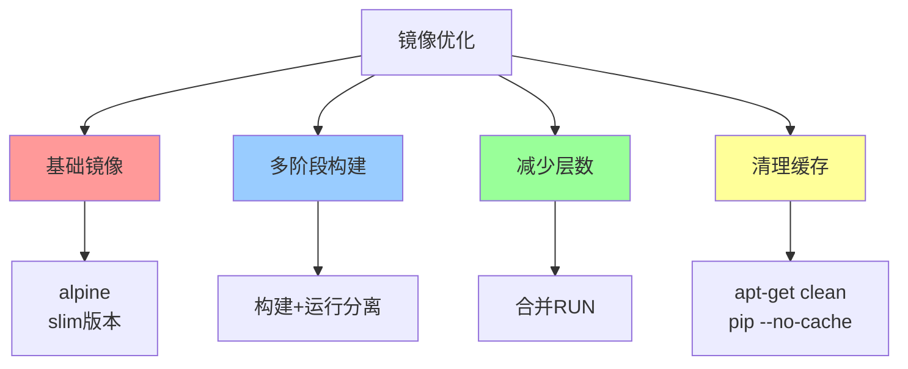

### 小结

镜像优化技巧：
- **选择轻量镜像**：alpine/slim版本
- **多阶段构建**：分离构建和运行环境
- **减少层数**：合并RUN命令
- **清理缓存**：删除不必要的文件
- **使用.dockerignore**：排除无关文件

下一节我们将学习 **多阶段构建**，这是构建高效镜像的必备技能！

## 50.2 多阶段构建

### 什么是多阶段构建？

多阶段构建就像**烹饪和装盘分离**：

```
传统方式：
厨师 + 厨房设备 + 食材 → 端上桌（全部端上去）

多阶段构建：
第一阶段：厨师 + 厨房设备 + 食材 → 做菜
第二阶段：服务员 + 盘子 → 装盘上桌
（厨房设备不需要端上桌）
```

### 多阶段构建的原理

```dockerfile
# 第一阶段：构建阶段
FROM golang:1.21 AS builder

WORKDIR /build
COPY . .
RUN CGO_ENABLED=0 go build -o myapp

# 第二阶段：运行阶段
FROM alpine:latest

WORKDIR /app
# 从第一阶段复制构建产物
COPY --from=builder /build/myapp .

CMD ["./myapp"]
```

### 多阶段构建的优势

| 优势 | 说明 |
|------|------|
| 镜像更小 | 最终镜像只包含运行时需要的文件 |
| 安全性更高 | 不包含构建工具，减少攻击面 |
| 构建更快 | 利用构建缓存 |
| 清洁分离 | 构建环境和运行环境分离 |

### 多阶段构建实战

#### 案例1：Go应用

```dockerfile
# ========== 第一阶段：构建 ==========
FROM golang:1.21 AS builder

WORKDIR /app

# 复制依赖文件（利用缓存）
COPY go.mod go.sum ./
RUN go mod download

# 复制源代码
COPY . .

# 构建二进制文件
RUN CGO_ENABLED=0 GOOS=linux go build -ldflags="-w -s" -o myapp
# -ldflags="-w -s" 去掉调试信息和符号表，进一步减小体积

# ========== 第二阶段：运行 ==========
FROM alpine:3.18

WORKDIR /app

# 安装CA证书（Go程序需要）
RUN apk add --no-cache ca-certificates

# 复制构建产物
COPY --from=builder /app/myapp .

EXPOSE 8080

CMD ["./myapp"]
```

#### 案例2：Node.js应用

```dockerfile
# ========== 第一阶段：构建 ==========
FROM node:18-alpine AS builder

WORKDIR /app

# 复制依赖文件（利用npm缓存）
COPY package*.json ./
RUN npm ci --only=production

# 复制源代码
COPY . .

# 构建应用（如有构建步骤）
RUN npm run build

# ========== 第二阶段：运行 ==========
FROM node:18-alpine

WORKDIR /app

# 创建非root用户
RUN addgroup -g 1001 -S nodejs && \
    adduser -S nodeuser -u 1001

# 复制构建产物
COPY --from=builder --chown=nodeuser:nodejs /app/dist ./dist
COPY --from=builder --chown=nodeuser:nodejs /app/node_modules ./node_modules
COPY --from=builder --chown=nodeuser:nodejs /app/package*.json ./

USER nodeuser

EXPOSE 3000

CMD ["node", "dist/main.js"]
```

#### 案例3：Java应用（Maven）

```dockerfile
# ========== 第一阶段：构建 ==========
FROM maven:3.9-eclipse-temurin-21 AS builder

WORKDIR /app

# 复制pom.xml（利用缓存）
COPY pom.xml .
RUN mvn dependency:go-offline -B

# 复制源代码
COPY src ./src

# 构建
RUN mvn package -DskipTests

# ========== 第二阶段：运行 ==========
FROM eclipse-temurin:21-jre-alpine

WORKDIR /app

# 创建非root用户
RUN addgroup -g 1001 -S javauser && \
    adduser -S javauser -u 1001

# 复制构建产物
COPY --from=builder /app/target/myapp.jar .

RUN chown -R javauser:javauser /app

USER javauser

EXPOSE 8080

ENTRYPOINT ["java", "-jar", "myapp.jar"]
```

### 跨阶段复制文件

```dockerfile
# 从指定阶段复制
COPY --from=builder /app/dist ./public

# 从特定阶段编号复制（从0开始）
COPY --from=0 /app/dist ./public
COPY --from=1 /app/node_modules ./node_modules

# 从外部镜像复制
COPY --from=nginx:alpine /etc/nginx/nginx.conf ./nginx.conf
```

### 条件构建

只构建特定阶段：

```bash
# 只构建第一阶段
docker build --target builder -t myapp-builder .

# 构建最终阶段
docker build -t myapp .
```

```dockerfile
# 使用条件构建
FROM golang:1.21 AS builder

WORKDIR /build
COPY . .
RUN go build -o myapp

# 只有在指定--target时才执行
FROM alpine AS production
COPY --from=builder /build/myapp .
CMD ["./myapp"]
```

### 多阶段构建最佳实践

| 实践 | 说明 |
|------|------|
| 利用构建缓存 | 先复制依赖文件，再复制源代码 |
| 使用轻量运行镜像 | alpine/slim版本 |
| 删除调试符号 | `go build -ldflags="-w -s"` |
| 非root用户 | 提高安全性 |
| 合并层 | 减少镜像层数 |

### 一图总结多阶段构建

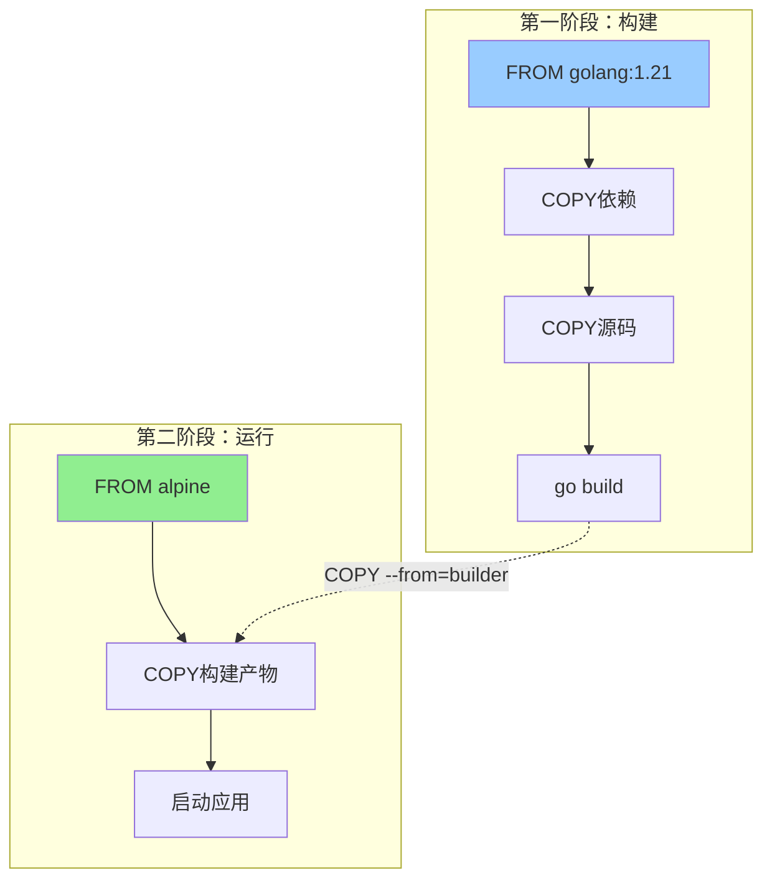

### 小结

多阶段构建要点：
- **分离构建和运行**：构建阶段安装所有工具，运行阶段只保留运行时需要的
- **使用 `AS` 命名阶段**：便于引用
- **使用 `COPY --from=builder`**：从构建阶段复制产物
- **最终镜像最小化**：可能从1GB降到10MB！

下一节我们将学习 **网络模式**，了解Docker的多种网络模式！

## 50.3 网络模式

### Docker网络模式总览

Docker提供了5种网络模式：

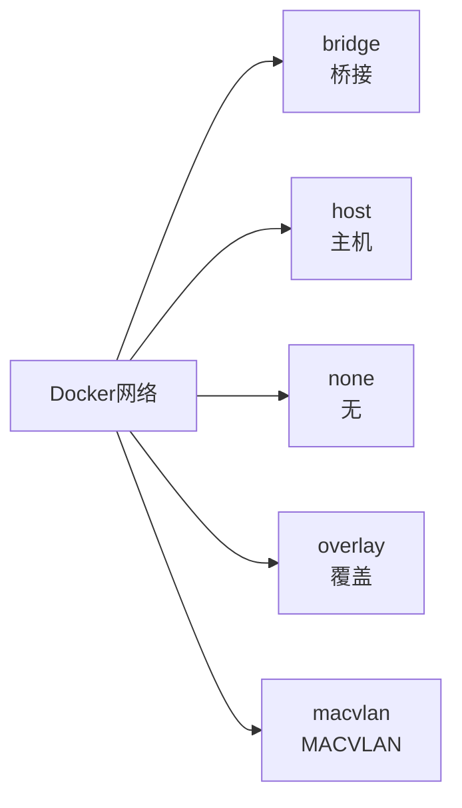

### 1. bridge（桥接模式）- 默认

容器连接到Docker的虚拟网桥：

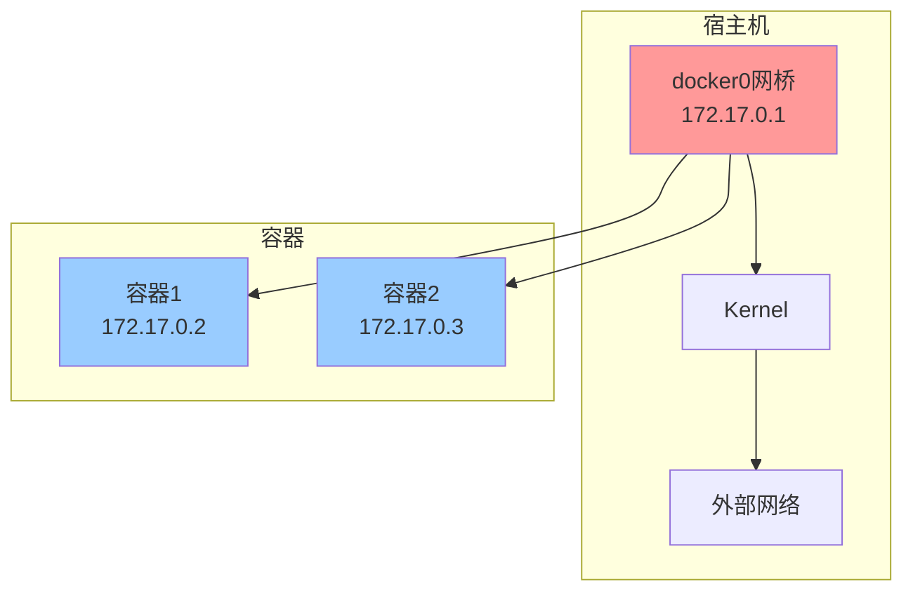

**特点：**
- 默认网络模式
- 容器有独立的网络命名空间
- 容器间可以通信
- 需要端口映射访问外部

```bash
# 使用默认bridge网络
docker run -d --name web nginx:latest

# 使用自定义bridge网络
docker network create --driver bridge my-bridge
docker run -d --name web --network my-bridge nginx:latest
```

### 2. host（主机模式）

容器直接使用宿主机的网络栈：

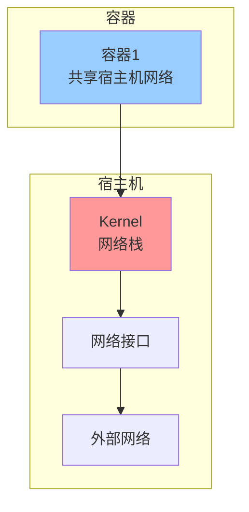

**特点：**
- 无网络隔离，容器和宿主机共享网络
- 性能最好（无NAT开销）
- 端口直接暴露，无需映射
- 端口可能冲突

```bash
# 使用host网络
docker run -d --name web --network host nginx:latest

# 容器直接监听80端口，无需-p参数
```

### 3. none（无网络）

容器没有网络接口，只有loopback：

```bash
# 使用none网络
docker run -d --name isolated --network none nginx:latest

# 验证：只有lo接口
docker exec isolated ip addr
# 1: lo: <LOOPBACK,UP,LOWER_UP> mtu 65536 qdisc noqueue state UNKNOWN qlen 1000
#     link/loopback 00:00:00:00:00:00 brd 00:00:00:00:00:00
```

### 4. overlay（覆盖网络）

跨Docker主机通信，用于Swarm集群：

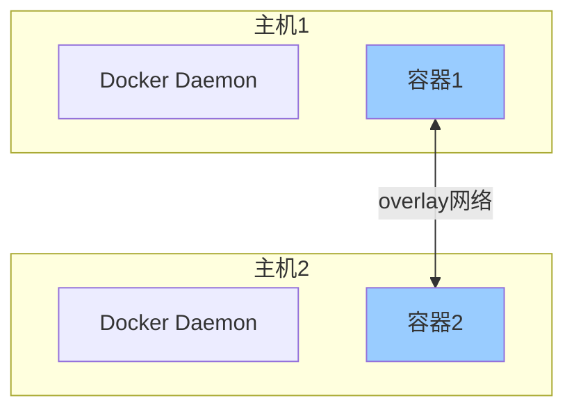

```bash
# 创建overlay网络（需要Swarm模式）
docker network create --driver overlay my-overlay

# 或者初始化Swarm
docker swarm init
docker network create --driver overlay my-net

# 在Swarm服务中使用
docker service create --network my-net --name web nginx:latest
```

### 5. macvlan（MACVLAN）

容器直接拥有独立的MAC地址，像物理机一样：

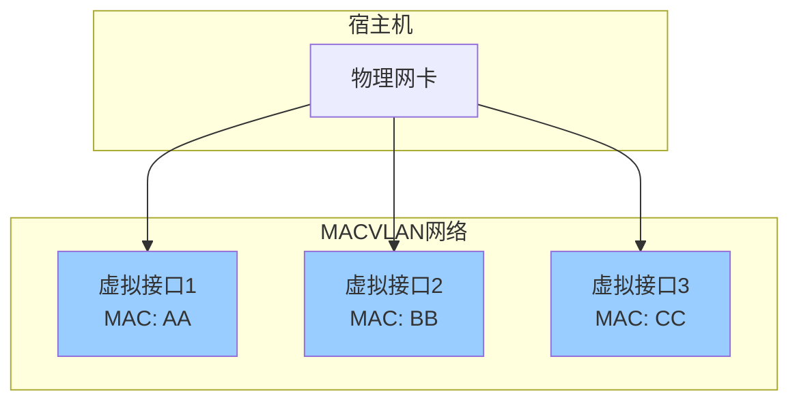

```bash
# 创建macvlan网络
docker network create \
    --driver macvlan \
    --subnet=192.168.1.0/24 \
    --gateway=192.168.1.1 \
    -o parent=eth0 \
    my-macvlan

# 使用macvlan
docker run -d --name web --network my-macvlan nginx:latest
```

### 网络选择指南

| 模式 | 适用场景 | 性能 | 隔离性 |
|------|----------|------|--------|
| bridge | 默认，大多数场景 | 中等 | 好 |
| host | 性能敏感、无端口冲突 | 最好 | 无 |
| none | 完全隔离 | 无网络 | 极好 |
| overlay | 多主机通信、Swarm | 中等 | 好 |
| macvlan | 需要独立IP | 最好 | 完全 |

### 网络命令

```bash
# 列出网络
docker network ls

# 查看网络详情
docker network inspect bridge

# 创建网络
docker network create --driver bridge my-net

# 删除网络
docker network rm my-net

# 连接容器到网络
docker network connect my-net container1

# 断开容器与网络的连接
docker network disconnect my-net container1

# 清理未使用的网络
docker network prune
```

### 网络通信实战

#### 同一网络内的容器通信

```bash
# 1. 创建网络
docker network create my-net

# 2. 启动两个容器
docker run -d --name web --network my-net nginx:latest
docker run -d --name app --network my-net myapp:latest

# 3. 测试通信（使用容器名访问）
docker exec app ping -c 3 web

# 4. 查看容器IP
docker inspect -f '{{range .NetworkSettings.Networks}}{{.IPAddress}}{{end}}' web
```

#### 容器访问外部网络

默认情况下，容器可以通过NAT访问外部网络：

```bash
# 容器内访问外部
docker exec web curl https://api.github.com

# 宿主机端口映射
docker run -d -p 8080:80 --name web nginx:latest
# 访问 http://宿主机IP:8080 即可访问容器80端口
```

### 小结

Docker网络模式：

| 模式 | 说明 | 适用场景 |
|------|------|----------|
| bridge | 默认，虚拟网桥 | 大多数场景 |
| host | 共享宿主机网络 | 性能敏感 |
| none | 无网络 | 完全隔离 |
| overlay | 跨主机通信 | Swarm集群 |
| macvlan | 独立MAC地址 | 特殊网络需求 |

下一节我们将学习 **存储驱动**，了解Docker如何存储镜像和容器数据！

## 50.4 存储驱动

### 什么是存储驱动？

存储驱动（Storage Driver）是Docker用来管理镜像层和容器文件系统的组件。

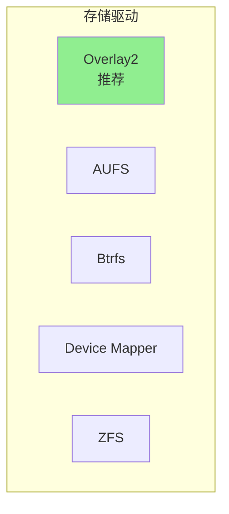

### 常见存储驱动

| 驱动 | 特性 | 适用场景 |
|------|------|----------|
| **overlay2** | 性能好，推荐 | 大多数Linux发行版 |
| aufs | 历史悠久 | Ubuntu旧版 |
| btrfs | 功能丰富 | 需要高级特性 |
| devicemapper | 块设备 | RHEL/CentOS旧版 |
| zfs | 企业级特性 | 需要高级存储 |

### overlay2驱动原理

overlay2是当前**最推荐**的存储驱动，几乎所有现代Linux都支持：

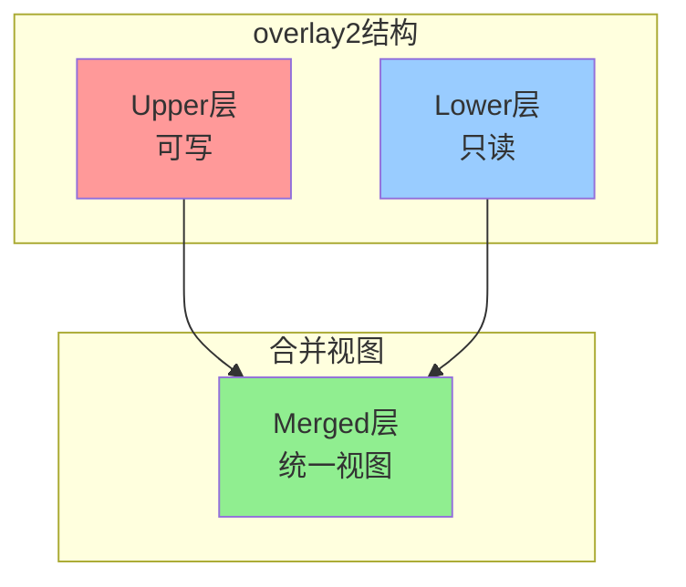

**层的作用：**
- **Lower层**：镜像的各个只读层
- **Upper层**：容器的可写层
- **Merged层**：用户看到的统一视图

### 查看当前存储驱动

```bash
# 查看Docker使用的存储驱动
docker info | grep "Storage Driver"

# 输出示例：
# Storage Driver: overlay2
```

### 选择存储驱动

```bash
# 配置文件位置
sudo nano /etc/docker/daemon.json

# 设置存储驱动
{
    "storage-driver": "overlay2"
}

# 重启Docker生效
sudo systemctl restart docker
```

### 不同存储驱动的选择

| 发行版 | 推荐驱动 |
|--------|----------|
| Ubuntu | overlay2 |
| Debian | overlay2 |
| CentOS 7+ | overlay2 |
| RHEL 7+ | overlay2 |
| Fedora | overlay2 |

### 存储驱动与镜像层

```bash
# 查看镜像的层
docker history nginx:latest

# 输出示例：
# IMAGE          CREATED        SIZE
# 8e3a217a82b7   2 weeks ago   0B
# a6bd71f48f88   2 weeks ago   0B
# <missing>      2 weeks ago   1.46kB
# <missing>      2 weeks ago   77.8MB
# <missing>      3 weeks ago   77.8MB
```

### 存储驱动对比

| 驱动 | 镜像层限制 | 性能 | 稳定性 |
|------|------------|------|--------|
| overlay2 | 128层 | 最好 | 最好 |
| aufs | 127层 | 好 | 好 |
| btrfs | 无限制 | 好 | 中等 |
| devicemapper | 无限制 | 中等 | 好 |

### 小结

存储驱动要点：
- **overlay2是推荐选择**：性能好，稳定性高
- **存储驱动影响镜像层管理**：决定了镜像如何存储和共享
- **不要轻易更换驱动**：会导致现有镜像不可用

下一节我们将学习 **资源限制**，了解如何控制容器的资源使用！

## 50.5 资源限制

### 为什么要限制资源？

容器默认可以使用宿主机**所有资源**！

不加限制的话：
- 某个容器占满CPU → 其他容器都卡死
- 某个容器占满内存 → 宿主机OOM
- 某个容器疯狂写磁盘 → 磁盘爆满

**资源限制 = 保障服务质量的手段！**

### 内存限制

```bash
# 限制容器最大内存
docker run -d --name app --memory="512m" myapp:latest

# 限制内存和swap
docker run -d --name app \
    --memory="256m" \
    --memory-swap="512m" \
    myapp:latest
# 说明：内存256m，swap 256m（总共可用512m）

# 限制内存和保留内存
docker run -d --name app \
    --memory="512m" \
    --memory-reservation="256m" \
    myapp:latest
# 说明：软限制，内存紧张时降到256m
```

#### 内存限制参数

| 参数 | 说明 |
|------|------|
| `--memory` | 容器最大可用内存 |
| `--memory-swap` | 容器最大可用swap（包含内存） |
| `--memory-reservation` | 软限制，内存紧张时生效 |
| `--memory-swappiness` | 容器使用swap的倾向（0-100） |
| `--oom-kill-disable` | 禁用OOM杀进程 |

### CPU限制

```bash
# 限制容器使用的CPU核心数
docker run -d --name app --cpus="1.0" myapp:latest

# 限制使用特定CPU核心
docker run -d --name app --cpuset-cpus="0,1" myapp:latest

# 限制CPU配额（相对权重）
docker run -d --name app --cpu-shares="1024" myapp:latest

# 限制CPU核数和配额
docker run -d --name app \
    --cpus="2" \
    --cpu-quota="200000" \
    myapp:latest
```

#### CPU限制参数

| 参数 | 说明 |
|------|------|
| `--cpus` | 容器可使用的CPU核心数（小数） |
| `--cpuset-cpus` | 指定可用的CPU核心 |
| `--cpu-shares` | CPU相对权重（默认值1024） |
| `--cpu-period` | CPU调度周期（默认100000微秒） |
| `--cpu-quota` | 周期内可用时间（微秒） |

### 磁盘IO限制

```bash
# 限制写入速度（MB/s）
docker run -d --name app \
    --device-write-iops /dev/sda:100 \
    --device-read-iops /dev/sda:200 \
    myapp:latest

# 限制写入带宽（MB/s）
docker run -d --name app \
    --device-write-bps /dev/sda:10mb \
    --device-read-bps /dev/sda:20mb \
    myapp:latest
```

### 进程数限制

```bash
# 限制容器内最大进程数
docker run -d --name app --pids-limit=100 myapp:latest
```

### 查看资源限制

```bash
# 查看容器资源限制
docker stats

# 查看特定容器
docker stats app

# 查看容器详细信息（包含资源限制）
docker inspect app | grep -A 20 "HostConfig"

# 输出示例：
# "Memory": 536870912,
# "MemoryReservation": 268435456,
# "NanoCpus": 1000000000,
```

### 资源限制实战：WordPress + MySQL

```bash
# 启动MySQL，限制资源
docker run -d \
    --name mysql \
    --memory="512m" \
    --cpus="1.0" \
    -e MYSQL_ROOT_PASSWORD=secret \
    mysql:8.0

# 启动WordPress，限制资源
docker run -d \
    --name wordpress \
    --memory="256m" \
    --cpus="0.5" \
    --link mysql \
    -p 80:80 \
    wordpress:latest
```

### 资源限制最佳实践

| 资源 | 推荐限制 | 说明 |
|------|----------|------|
| 内存 | 设置 | 防止OOM |
| CPU | 根据负载设置 | 防止抢资源 |
| 磁盘IO | 敏感应用设置 | 防止IO争抢 |
| 进程数 | 设置 | 防止fork炸弹 |

### 一图总结资源限制

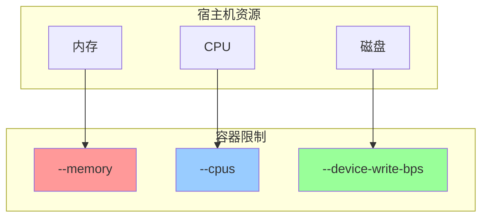

### 小结

资源限制参数：

| 参数 | 说明 |
|------|------|
| `--memory` | 内存限制 |
| `--cpus` | CPU限制 |
| `--cpuset-cpus` | 绑定CPU核心 |
| `--device-write-bps` | 磁盘写入限制 |

下一节我们将学习 **日志管理**，了解如何管理容器日志！

## 50.6 日志管理

### Docker日志机制

Docker容器日志由**日志驱动（Logging Driver）**处理：

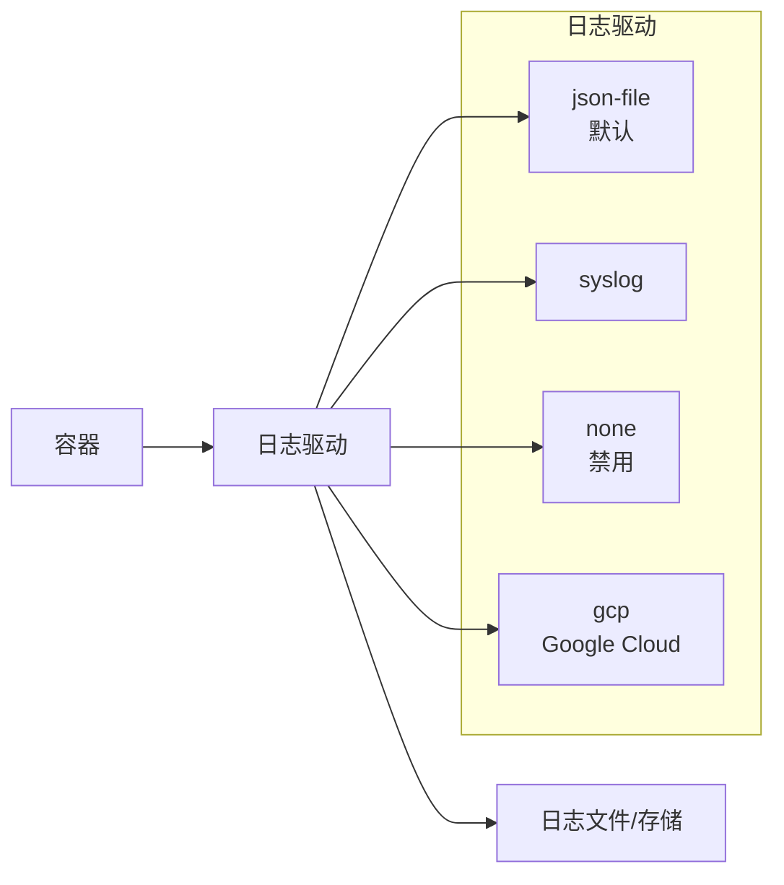

### 查看容器日志

```bash
# 查看日志
docker logs my-container

# 实时跟踪日志
docker logs -f my-container

# 查看最近100行
docker logs --tail 100 my-container

# 查看特定时间之后
docker logs --since "2024-01-01" my-container
docker logs --since 1h my-container

# 带时间戳
docker logs -t my-container
```

### 日志驱动配置

```bash
# 查看当前日志驱动
docker info | grep "Logging Driver"

# 配置日志驱动（编辑daemon.json）
sudo nano /etc/docker/daemon.json

{
    "log-driver": "json-file",
    "log-opts": {
        "max-size": "10m",
        "max-file": "3"
    }
}

# 重启Docker
sudo systemctl restart docker
```

### 日志选项

| 选项 | 说明 | 示例 |
|------|------|------|
| `max-size` | 单个日志文件最大大小 | `10m` |
| `max-file` | 最多保留几个日志文件 | `3` |
| `compress` | 压缩旧日志 | `true` |

### 日志清理

```bash
# 手动清理容器日志
truncate -s 0 /var/lib/docker/containers/*/*-json.log

# 使用docker system prune清理
docker system prune --volumes

# 清理未使用的资源
docker system prune -a
```

### 日志轮转配置

```bash
# 为单个容器配置日志
docker run -d \
    --name myapp \
    --log-driver=json-file \
    --log-opt max-size=10m \
    --log-opt max-file=3 \
    myapp:latest
```

### 小结

日志管理要点：
- **默认日志驱动**：`json-file`
- **配置日志轮转**：防止日志爆满
- **定期清理**：保持磁盘健康

下一节我们将学习 **健康检查**，了解如何检测容器健康状态！

## 50.7 健康检查

### 什么是健康检查？

健康检查（Health Check）让Docker知道容器是否正常运行：

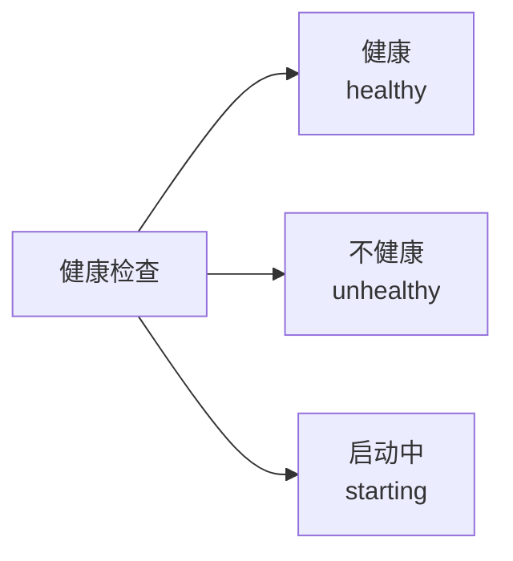

### 在Dockerfile中定义健康检查

```dockerfile
# 定义健康检查
HEALTHCHECK --interval=30s --timeout=10s --retries=3 --start-period=5s \
    CMD curl -f http://localhost:8080/health || exit 1

FROM node:18-alpine

WORKDIR /app
COPY . .
EXPOSE 8080

# 健康检查脚本
HEALTHCHECK --interval=30s --timeout=3s --retries=3 \
    CMD wget --no-verbose --tries=1 --spider http://localhost:8080/health || exit 1

CMD ["node", "server.js"]
```

### 健康检查参数

| 参数 | 说明 | 示例 |
|------|------|------|
| `--interval` | 检查间隔 | `30s` |
| `--timeout` | 超时时间 | `10s` |
| `--retries` | 失败重试次数 | `3` |
| `--start-period` | 启动等待时间 | `5s` |

### docker run时指定健康检查

```bash
docker run -d \
    --name myapp \
    --health-cmd="curl -f http://localhost:8080/health || exit 1" \
    --health-interval=30s \
    --health-timeout=10s \
    --health-retries=3 \
    myapp:latest
```

### 查看健康状态

```bash
# 查看容器健康状态
docker ps

# 查看详细信息
docker inspect --format='{{.State.Health}}' my-container

# 查看健康检查日志
docker inspect --format='{{json .State.Health.Log}}' my-container | jq
```

### 健康检查示例

#### Nginx健康检查

```dockerfile
FROM nginx:latest

# Nginx本身会响应请求，所以用curl检查
HEALTHCHECK --interval=30s --timeout=3s --retries=3 \
    CMD curl -f http://localhost/ || exit 1
```

#### MySQL健康检查

```bash
docker run -d \
    --name mysql \
    --health-cmd="mysqladmin ping -h localhost" \
    --health-interval=10s \
    --health-timeout=5s \
    --health-retries=3 \
    mysql:8.0
```

### 健康检查与Swarm

在Swarm服务中，健康检查失败的容器会被**自动重启**：

```bash
# 创建带健康检查的服务
docker service create \
    --name myapp \
    --health-cmd="curl -f http://localhost:8080/health || exit 1" \
    --health-interval=30s \
    --health-retries=3 \
    --health-start-period=10s \
    myapp:latest
```

### 小结

健康检查要点：
- **使用 `HEALTHCHECK` 指令**：在Dockerfile中定义
- **返回0表示健康**：返回其他值表示不健康
- **与Swarm配合**：自动重启不健康的容器

下一节我们将学习 **安全加固**，了解如何提高Docker安全性！

## 50.8 安全加固

### Docker安全的重要性

容器安全就像**住酒店的安全**：
- 门锁好不好（用户权限）
- 监控有没有（审计日志）
- 陌生人能不能进（资源隔离）

### 1. 使用非root用户

```dockerfile
# 创建非root用户
RUN addgroup -g 1001 -S appuser && \
    adduser -S appuser -u 1001

USER appuser

CMD ["node", "app.js"]
```

```bash
# 运行容器时指定用户
docker run -d --name myapp --user 1001 myapp:latest
```

### 2. 限制容器能力

```bash
# 丢弃所有能力，只保留最小权限
docker run -d --name myapp \
    --cap-drop=ALL \
    myapp:latest

# 只保留NET_BIND_SERVICE能力
docker run -d --name myapp \
    --cap-drop=ALL \
    --cap-add=NET_BIND_SERVICE \
    myapp:latest
```

### 3. 安全加固的Dockerfile

```dockerfile
# 使用轻量基础镜像
FROM python:3.11-slim

# 设置只读文件系统
USER root
RUN chmod 444 /etc/passwd

# 不使用root用户
RUN addgroup -g 1001 -S appuser && \
    adduser -S appuser -u 1001

WORKDIR /app
COPY --chown=appuser:appuser . .

USER appuser

# 禁止执行shell
RUN chmod 000 /bin/sh

# 设置只读文件系统
USER root
CMD ["node", "app.js"]
```

### 4. 资源限制（安全）

```bash
# 限制内存，防止内存耗尽攻击
docker run -d --name myapp \
    --memory="256m" \
    --memory-swap="256m" \
    --pids-limit=50 \
    myapp:latest
```

### 5. 安全扫描

```bash
# 安装Trivy漏洞扫描工具
docker run --rm -v /var/run/docker.sock:/var/run/docker.sock \
    aquasec/trivy image myapp:latest

# 扫描已知漏洞
docker scan myapp:latest
```

### 6. Docker安全最佳实践清单

| 检查项 | 说明 |
|--------|------|
| ☐ 使用非root用户 | 安全最佳实践 |
| ☐ 设置资源限制 | 防止资源耗尽 |
| ☐ 丢弃不需要的能力 | 最小权限原则 |
| ☐ 使用只读文件系统 | 防止写入恶意文件 |
| ☐ 定期扫描漏洞 | 发现安全问题 |
| ☐ 定期更新基础镜像 | 修复已知漏洞 |
| ☐ 使用私有仓库 | 确保镜像来源可信 |

### 小结

Docker安全加固要点：
- **非root用户**：避免权限过大
- **限制能力**：最小权限原则
- **资源限制**：防止DoS攻击
- **定期扫描**：发现漏洞

下一节我们将学习 **Docker Swarm**，了解Docker原生的集群管理！

## 50.9 Docker Swarm

### Docker Swarm是什么？

Docker Swarm是Docker原生的**集群管理和编排工具**。

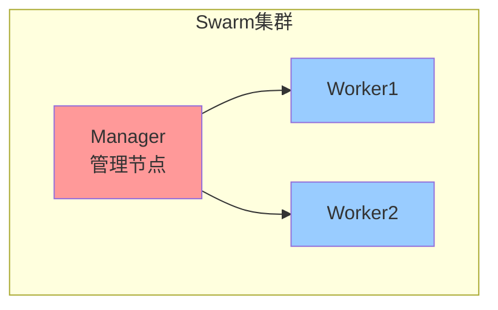

### Swarm vs Kubernetes

| 特性 | Swarm | Kubernetes |
|------|-------|------------|
| 学习曲线 | 低 | 高 |
| 功能丰富度 | 一般 | 丰富 |
| 社区生态 | 一般 | 庞大 |
| 适用场景 | 小型集群 | 中大型集群 |

### 初始化Swarm

```bash
# 初始化Swarm（成为Manager节点）
docker swarm init

# 输出示例：
# Swarm initialized: current node (xxx) is now a manager.
# 
# To add a worker to this swarm, run the following command:
# docker swarm join --token SWMTKN-xxx 192.168.1.100:2377

# 添加Manager节点
docker swarm join-token manager

# 添加Worker节点
docker swarm join-token worker
```

### 创建Swarm服务

```bash
# 创建服务
docker service create --name web --replicas 3 -p 80:80 nginx:latest

# 查看服务
docker service ls

# 查看服务详情
docker service ps web

# 扩展服务
docker service scale web=5

# 更新服务镜像
docker service update --image nginx:1.25 web
```

### 服务管理

```bash
# 查看服务日志
docker service logs web

# 滚动更新
docker service update --image nginx:1.25 web

# 回滚
docker service rollback web

# 删除服务
docker service rm web
```

###  Swarm网络

```bash
# 创建overlay网络
docker network create --driver overlay my-overlay

# 创建服务使用overlay网络
docker service create --name web \
    --network my-overlay \
    --replicas 3 \
    -p 80:80 \
    nginx:latest
```

### 小结

Docker Swarm要点：
- **初始化Swarm**：`docker swarm init`
- **创建服务**：`docker service create`
- **扩展服务**：`docker service scale`

下一节我们将学习 **Docker Registry**，了解如何搭建私有镜像仓库！

## 50.10 Docker Registry

### 什么是Registry？

Registry是存储和分发Docker镜像的服务器：


### 搭建私有Registry

```bash
# 1. 启动Registry容器
docker run -d \
    --name registry \
    -p 5000:5000 \
    -v registry-data:/var/lib/registry \
    registry:2

# 2. 给镜像打标签
docker tag myapp:latest localhost:5000/myapp:v1.0

# 3. 推送到私有Registry
docker push localhost:5000/myapp:v1.0

# 4. 拉取镜像
docker pull localhost:5000/myapp:v1.0

# 5. 查看Registry中的镜像
curl http://localhost:5000/v2/_catalog
```

### 小结

Docker Registry要点：
- **启动Registry**：`docker run -d -p 5000:5000 registry:2`
- **推送镜像**：`docker push registry:5000/myapp:v1.0`
- **拉取镜像**：`docker pull registry:5000/myapp:v1.0`

下一节我们将学习 **Harbor**，了解企业级镜像仓库！

## 50.11 Harbor

### Harbor是什么？

Harbor是VMware开源的企业级**Docker Registry**，提供：
- Web界面
- 镜像安全扫描
- 访问控制
- 镜像复制
- LDAP/AD集成

### Harbor安装

```bash
# 下载Harbor
wget https://github.com/goharbor/harbor/releases/download/v2.9.0/harbor-online-installer-v2.9.0.tgz

# 解压
tar xzf harbor-online-installer-v2.9.0.tgz

# 配置
cd harbor
cp harbor.yml.tmpl harbor.yml
nano harbor.yml

# 安装
sudo ./install.sh
```

### Harbor配置

```yaml
# harbor.yml 关键配置
hostname: harbor.example.com
http:
  port: 80
https:
  port: 443
  certificate: /path/to/cert.pem
  private_key: /path/to/key.pem
harbor_admin_password: Harbor12345

database:
  password: root123

volume:
  location: /data
```

### Harbor功能

| 功能 | 说明 |
|------|------|
| Web界面 | 图形化管理镜像 |
| 镜像扫描 | Trivy扫描漏洞 |
| 访问控制 | 基于项目的权限管理 |
| 镜像复制 | 主从同步 |
| LDAP集成 | 企业用户认证 |

### 小结

Harbor要点：
- **企业级功能**：比Registry更强大
- **Web界面**：便于管理
- **安全扫描**：保障镜像安全

---

## 本章小结

本章我们学习了Docker进阶知识：

### 镜像优化
- **选择轻量镜像**：alpine/slim
- **多阶段构建**：分离构建和运行环境
- **清理缓存**：减小镜像体积

### 多阶段构建
```dockerfile
FROM golang:1.21 AS builder
RUN go build -o myapp
FROM alpine:latest
COPY --from=builder /app/myapp .
```

### 网络模式
| 模式 | 适用场景 |
|------|----------|
| bridge | 默认 |
| host | 性能敏感 |
| overlay | 多主机通信 |

### 资源限制
| 参数 | 说明 |
|------|------|
| `--memory` | 内存限制 |
| `--cpus` | CPU限制 |

### Docker Swarm
- **初始化**：`docker swarm init`
- **创建服务**：`docker service create`

### Harbor
- 企业级镜像仓库
- Web界面和漏洞扫描

### 下章预告

下一章我们将学习 **Containerd与Podman**，了解Docker的替代方案！

> **趣味彩蛋**：Docker曾经说："我一个人就是一个团队！"
>
> Kubernetes来了，说："你太天真了，还是我来吧！"
>
> 记住：**容器生态里，没有最好的工具，只有最适合的工具！** 🐋


