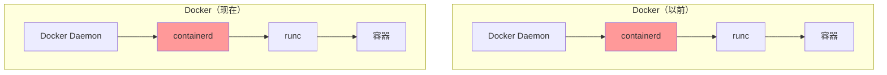
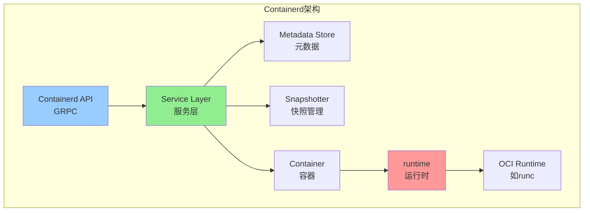
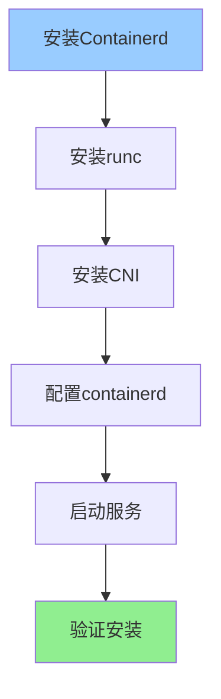
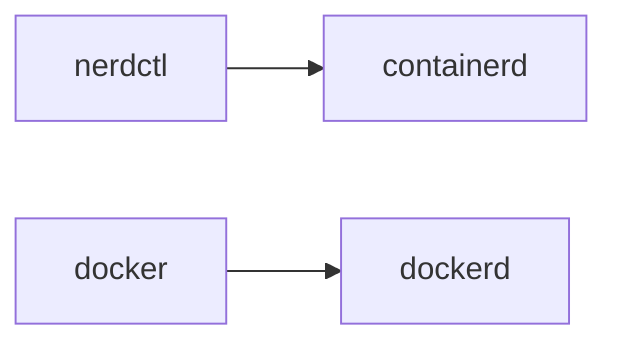
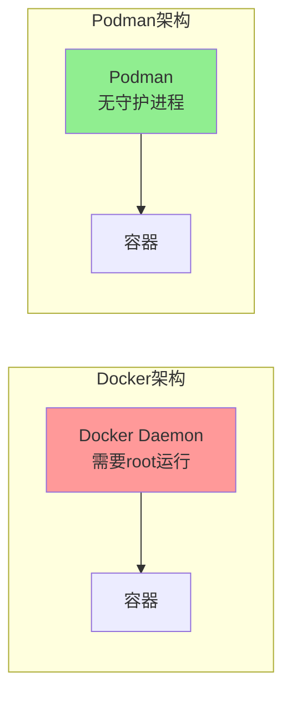
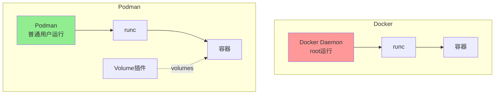

+++
title = "第51章：Containerd 与 Podman"
weight = 510
date = "2026-03-24T13:18:28+08:00"
type = "docs"
description = ""
isCJKLanguage = true
draft = false
+++


# 第五十一章：Containerd 与 Podman

## 51.1 Containerd 简介

### Containerd是什么？

如果说Docker是一个"全能管家"，那**Containerd**就是管家的"专业部门"——专门负责容器生命周期的管理。

Containerd是CNCF（云原生计算基金会）的毕业项目，它是从Docker中**剥离出来的容器运行时**。



### Containerd的历史

```
2013年：Docker诞生，containerd是Docker的一部分
    ↓
2015年：Docker将containerd贡献给CNCF
    ↓
2017年：Docker 1.11开始使用containerd
    ↓
2019年：containerd成为CNCF毕业项目
    ↓
2022年：containerd 1.6发布，成为Kubernetes默认运行时
```

### Containerd vs Docker

| 对比项 | Containerd | Docker |
|--------|-----------|--------|
| **定位** | 容器运行时 | 容器平台 |
| **功能** | 容器生命周期管理 | 构建、运行、网络、存储... |
| **复杂性** | 简单 | 复杂 |
| **使用场景** | Kubernetes节点 | 开发、测试 |

### Containerd的架构



**Containerd的核心功能：**
- **镜像管理**：拉取、推送镜像
- **容器管理**：创建、启动、停止容器
- **快照管理**：管理容器的文件系统快照
- **网络管理**：管理容器网络

### 为什么要用Containerd？

**理由1：Kubernetes默认运行时**
- Kubernetes从1.24开始默认使用containerd
- 更轻量，更稳定

**理由2：简单直接**
- 没有Docker那么复杂
- 只需要容器运行时

**理由3：减少依赖**
- 不需要完整的Docker
- 减少维护成本

### Containerd适用场景

| 场景 | 适合使用Containerd |
|------|-------------------|
| Kubernetes节点 | ✅ 最常见 |
| 边缘计算 | ✅ 资源受限 |
| 嵌入式系统 | ✅ 轻量 |

### 小结

Containerd是什么？
- **容器运行时**：管理容器生命周期
- **Docker的组件**：从Docker剥离出来
- **CNCF项目**：云原生标准

Containerd vs Docker：
- 更轻量
- 更专注
- K8s默认支持

下一节我们将学习如何安装Containerd！

## 51.2 Containerd 安装

### 安装前准备

Containerd需要以下组件：
- **containerd**：主程序
- **runc**：OCI运行时
- **cni**：网络插件（可选）

### 在Ubuntu上安装

#### 方法一：使用apt安装

```bash
# 1. 更新软件包
sudo apt update

# 2. 安装containerd
sudo apt install -y containerd

# 3. 生成默认配置
sudo mkdir -p /etc/containerd
containerd config default | sudo tee /etc/containerd/config.toml

# 4. 修改配置，开启SystemdCgroup
sudo sed -i 's/SystemdCgroup = false/SystemdCgroup = true/' /etc/containerd/config.toml

# 5. 重启服务
sudo systemctl restart containerd

# 6. 验证安装
containerd --version
# containerd version 1.6.24

# 7. 设置开机自启
sudo systemctl enable containerd
```

### 在CentOS上安装

```bash
# 1. 添加Docker仓库
sudo yum install -y yum-utils
sudo yum-config-manager --add-repo https://download.docker.com/linux/centos/docker-ce.repo

# 2. 安装containerd
sudo yum install -y containerd.io

# 3. 生成配置
sudo mkdir -p /etc/containerd
containerd config default | sudo tee /etc/containerd/config.toml

# 4. 修改配置
sudo sed -i 's/SystemdCgroup = false/SystemdCgroup = true/' /etc/containerd/config.toml

# 5. 重启服务
sudo systemctl restart containerd
sudo systemctl enable containerd
```

### 配置文件说明

```bash
# 查看配置文件
cat /etc/containerd/config.toml

# 关键配置项说明：

# SystemdCgroup - 使用systemd管理cgroup
[plugins."io.containerd.grpc.v1.cri"]
  SystemdCgroup = true

# 镜像加速器配置
[plugins."io.containerd.grpc.v1.cri"]
  sandbox_image = "registry.k8s.io/pause:3.9"
  
# 日志配置
[plugins."io.containerd.grpc.v1.cri".containerd]
  default_runtime_name = "runc"

# 存储驱动配置
[plugins."io.containerd.snapshotter.v1.overlayfs"]
  root_path = "/var/lib/containerd/io.containerd.snapshotter.v1.overlayfs"
```

### 安装runc

Containerd需要runc作为OCI运行时：

```bash
# 下载runc
curl -LO https://github.com/opencontainers/runc/releases/download/v1.1.10/runc.amd64

# 安装runc
sudo mv runc.amd64 /usr/local/bin/runc
sudo chmod +x /usr/local/bin/runc

# 验证
runc --version
# runc version 1.1.10
```

### 安装CNI网络插件

```bash
# 下载CNI插件
curl -LO https://github.com/containernetworking/plugins/releases/download/v1.3.0/cni-plugins-linux-amd64-v1.3.0.tgz

# 解压到指定目录
sudo mkdir -p /opt/cni/bin
sudo tar -C /opt/cni/bin -xzf cni-plugins-linux-amd64-v1.3.0.tgz

# 验证
ls /opt/cni/bin/
# bridge dhcp dummy flannel host-device host-local ipvlan loopback macvlan portmap ptp sample static vlan
```

### Containerd作为Kubernetes运行时

如果要将Containerd配置为Kubelet的运行时：

```bash
# 1. 编辑kubelet配置
sudo nano /var/lib/kubelet/config.yaml

# 2. 添加/修改runtime配置
runtimeEndpoint: unix:///run/containerd/containerd.sock
imagePullProgressDeadline: 10m

# 3. 重启kubelet
sudo systemctl restart kubelet
```

### 一图总结安装流程



### 小结

Containerd安装要点：
- `apt install containerd` 或 `yum install containerd.io`
- 生成配置文件：`containerd config default`
- 开启 `SystemdCgroup = true`
- 安装runc和CNI插件

下一节我们将学习 **nerdctl命令**，这是containerd的命令行工具！

## 51.3 nerdctl 命令

### nerdctl是什么？

**nerdctl** 是containerd的官方命令行工具，类似于Docker CLI。



### 安装nerdctl

```bash
# 下载nerdctl
curl -LO https://github.com/containerd/nerdctl/releases/download/v1.5.1/nerdctl-1.5.1-linux-amd64.tar.gz

# 解压
sudo tar -C /usr/local/bin -xzf nerdctl-1.5.1-linux-amd64.tar.gz

# 验证
nerdctl --version
# nerdctl version 1.5.1
```

### nerdctl vs docker 命令对比

nerdctl的很多命令和Docker类似：

| Docker命令 | nerdctl命令 | 说明 |
|-----------|-------------|------|
| `docker pull` | `nerdctl pull` | 拉取镜像 |
| `docker images` | `nerdctl images` | 查看镜像 |
| `docker run` | `nerdctl run` | 运行容器 |
| `docker ps` | `nerdctl ps` | 查看容器 |
| `docker exec` | `nerdctl exec` | 进入容器 |
| `docker logs` | `nerdctl logs` | 查看日志 |
| `docker build` | `nerdctl build` | 构建镜像 |

### 镜像操作

```bash
# 拉取镜像
nerdctl pull nginx:latest

# 查看本地镜像
nerdctl images

# 删除镜像
nerdctl rmi nginx:latest

# 清理未使用的镜像
nerdctl image prune
```

### 容器操作

```bash
# 运行容器
nerdctl run -d --name nginx nginx:latest

# 查看容器
nerdctl ps

# 查看所有容器（包括已停止）
nerdctl ps -a

# 停止容器
nerdctl stop nginx

# 启动容器
nerdctl start nginx

# 删除容器
nerdctl rm nginx

# 进入容器
nerdctl exec -it nginx /bin/bash

# 查看日志
nerdctl logs -f nginx
```

### 构建镜像

```bash
# 构建镜像（支持Dockerfile）
nerdctl build -t myapp:v1 .

# 带参数构建
nerdctl build --build-arg VERSION=1.0 -t myapp:v1 .
```

### nerdctl特有功能

```bash
# 查看compose（nerdctl支持compose）
nerdctl compose up -d

# 登录镜像仓库
nerdctl login -u username registry.example.com

# 推送镜像
nerdctl push registry.example.com/myapp:v1

# 镜像加密（nerdctl特有）
nerdctl image encrypt --recipient jwe:mykey.pem myapp:v1 myapp:v1.enc

# 镜像解密
nerdctl image decrypt --key mykey.pem myapp:v1.enc myapp:v1
```

### 使用nerdctl作为Docker替代

```bash
# 创建别名（可选）
echo "alias docker=nerdctl" >> ~/.bashrc
source ~/.bashrc

# 现在可以像使用docker一样使用nerdctl
docker pull nginx:latest
docker run -d -p 80:80 nginx:latest
```

### 小结

nerdctl命令：
- nerdctl是containerd的CLI工具
- 命令与Docker类似
- 支持镜像加密等特有功能

下一节我们将学习 **Podman**，这是Docker的无守护进程替代品！

## 51.4 Podman 简介

### Podman是什么？

**Podman** 是Docker的**无守护进程**替代品，由Red Hat开发。

最大的特点：**不需要Docker守护进程（daemon）！**



### Podman vs Docker

| 对比项 | Podman | Docker |
|--------|--------|--------|
| **守护进程** | 无 | 需要 |
| **运行用户** | 普通用户 | 需要root |
| **Pod支持** | 原生支持 | 需要额外工具 |
| **兼容性** | 兼容Docker | - |
| **开发公司** | Red Hat | Docker Inc. |

### Podman的优势

**1. 无守护进程**
- 不需要运行Docker daemon
- 减少资源占用
- 减少攻击面

**2. 可以非root运行**
- 普通用户可以运行容器
- 更安全

**3. 原生支持Pod**
- Pod是Kubernetes的概念
- Podman直接支持

**4. 兼容Docker**
- 可以直接替换Docker
- 零成本迁移

### Podman的核心概念

**Pod（容器组）：**
```
┌─────────────────────────────────┐
│           Pod                    │
│  ┌───────────┐  ┌───────────┐   │
│  │ Container1│  │ Container2│   │
│  └───────────┘  └───────────┘   │
│         共享网络和存储            │
└─────────────────────────────────┘
```

### Podman的适用场景

| 场景 | 说明 |
|------|------|
| 开发环境 | 无需root，更安全 |
| 替代Docker | 零成本迁移 |
| 学习K8s | 原生Pod支持 |
| 桌面环境 | 减少资源占用 |

### 小结

Podman是什么？
- **Docker替代品**：无守护进程
- **Red Hat开发**：企业级
- **兼容Docker**：命令几乎一样

Podman vs Docker：
- 无需守护进程
- 可非root运行
- 原生Pod支持

下一节我们将详细对比Podman和Docker！

## 51.5 Podman vs Docker

### 命令对比

Podman的命令与Docker几乎完全兼容：

| Docker命令 | Podman命令 | 区别 |
|-----------|-----------|------|
| `docker pull` | `podman pull` | 相同 |
| `docker push` | `podman push` | 相同 |
| `docker images` | `podman images` | 相同 |
| `docker run` | `podman run` | 相同 |
| `docker build` | `podman build` | 相同 |
| `docker-compose` | `podman-compose` | 需要安装 |

### 架构对比



### 安全对比

| 特性 | Docker | Podman |
|------|--------|--------|
| root运行 | 需要 | 不需要 |
| 容器root映射 | 可能需要 | 可选 |
| 攻击面 | 较大（daemon） | 较小 |
| SELinux支持 | 有限 | 完整 |

### Podman的高级功能

**1. 无根容器（Rootless）**
```bash
# 普通用户直接运行容器
podman run -d nginx:latest

# 不需要sudo，不需要daemon
```

**2. 原生Pod支持**
```bash
# 创建Pod
podman pod create --name mypod

# 在Pod中添加容器
podman run -d --pod mypod nginx:latest
podman run -d --pod mypod redis:latest
```

### 迁移到Podman

```bash
# 1. 安装Podman
# Ubuntu
sudo apt install podman

# CentOS
sudo yum install podman

# macOS
brew install podman

# 2. 创建别名（平滑过渡）
echo "alias docker=podman" >> ~/.bashrc
source ~/.bashrc

# 3. 验证
docker --version
# podman version 4.6.2
```

### 小结

Podman vs Docker：
- 命令兼容，可以无缝切换
- 无守护进程，更安全
- 原生支持Pod

下一节我们将学习Podman的实际使用！

## 51.6 Podman 使用

### Podman安装

```bash
# Ubuntu/Debian
sudo apt update
sudo apt install podman -y

# CentOS/RHEL
sudo yum install podman -y

# macOS
brew install podman

# 验证安装
podman --version
```

### 镜像操作

```bash
# 拉取镜像
podman pull nginx:latest

# 查看镜像
podman images

# 删除镜像
podman rmi nginx:latest

# 清理未使用的镜像
podman image prune
```

### 容器操作

```bash
# 运行容器
podman run -d --name nginx nginx:latest

# 查看容器
podman ps
podman ps -a  # 包括已停止的

# 停止容器
podman stop nginx

# 启动容器
podman start nginx

# 删除容器
podman rm nginx

# 进入容器
podman exec -it nginx /bin/bash

# 查看日志
podman logs -f nginx
```

### Pod操作

Podman原生支持Kubernetes Pod：

```bash
# 创建Pod
podman pod create --name mypod

# 查看Pod
podman pod ls

# 在Pod中运行容器
podman run -d --pod mypod nginx:latest
podman run -d --pod mypod redis:latest

# 查看Pod中的容器
podman ps --pod

# 停止/删除Pod（会删除所有容器）
podman pod stop mypod
podman pod rm mypod
```

### Pod + 多容器示例

```bash
# 1. 创建Pod
podman pod create --name webapp

# 2. 运行应用容器
podman run -d --pod webapp --name app myapp:latest

# 3. 运行Nginx反向代理
podman run -d --pod webapp --name nginx -p 8080:80 nginx:latest

# 4. 查看Pod状态
podman pod inspect webapp

# 5. 停止整个Pod
podman pod stop webapp

# 6. 删除Pod
podman pod rm -f webapp
```

### 构建镜像

```bash
# 使用Podman Buildah（内置）
podman build -t myapp:v1 .

# 使用Dockerfile
podman build -f Dockerfile -t myapp:v1 .
```

### 与Docker无缝切换

```bash
# 1. 查看Podman信息
podman info

# 2. 登录镜像仓库
podman login docker.io

# 3. 推送镜像
podman push myapp:v1 docker.io/myuser/myapp:v1

# 4. Docker Compose（需要安装podman-compose）
pip install podman-compose
podman-compose up -d
```

### Podman生成Kubernetes YAML

```bash
# 从Pod生成K8s YAML
podman generate kube mypod > mypod.yaml

# 创建Pod from K8s YAML
podman play kube mypod.yaml
```

### 常用配置

```bash
# 配置镜像仓库（/etc/containers/registries.conf）
[registries.search]
registries = ['docker.io', 'quay.io']

# 配置存储（/etc/containers/storage.conf）
[storage]
driver = "overlay"
```

### 小结

Podman使用要点：
- 安装：`apt install podman` 或 `brew install podman`
- 命令与Docker几乎相同
- 原生支持Pod
- 支持无根运行

---

## 本章小结

本章我们学习了Containerd和Podman：

### Containerd
| 命令 | 说明 |
|------|------|
| `containerd --version` | 查看版本 |
| 配置文件 | `/etc/containerd/config.toml` |

### nerdctl
- containerd的CLI工具
- 命令与Docker类似
- 支持镜像加密等特有功能

### Podman
| 特性 | 说明 |
|------|------|
| 无守护进程 | 更安全 |
| 可非root运行 | 更灵活 |
| 兼容Docker | 零成本迁移 |
| 原生Pod支持 | K8s友好 |

### 命令对比

| 功能 | Docker | Podman | nerdctl |
|------|--------|--------|---------|
| 拉取镜像 | `docker pull` | `podman pull` | `nerdctl pull` |
| 运行容器 | `docker run` | `podman run` | `nerdctl run` |
| 构建镜像 | `docker build` | `podman build` | `nerdctl build` |

### 下章预告

下一章我们将学习 **Kubernetes**，这是容器编排的王者，敬请期待！

> **趣味彩蛋**：Containerd和Podman在一起喝茶，讨论谁是Docker的最佳替代品。
>
> Containerd说："我是Docker的亲儿子，K8s都用我！"
> Podman说："我是无守护进程，安全性碾压你！"
>
> Docker在旁边默默喝着咖啡，心想："你们都是我生的..." 😏
>
> 记住：**没有最好的工具，只有最适合你场景的工具！** 🛠️


