+++
title = "第52章：Kubernetes"
weight = 520
date = "2026-03-24T13:18:28+08:00"
type = "docs"
description = ""
isCJKLanguage = true
draft = false
+++


# 第五十二章：Kubernetes

## 52.1 Kubernetes 简介

### Kubernetes是什么？

如果说Docker是**集装箱**，那Kubernetes就是**超级港口管理系统**！

一个集装箱好管理，但如果有一万个集装箱呢？

- 谁来处理这些集装箱？
- 如果某个机器坏了，集装箱怎么办？
- 怎么让集装箱均匀分布？
- 怎么升级集装箱里的应用？

**Kubernetes** 就是来解决这些问题的！

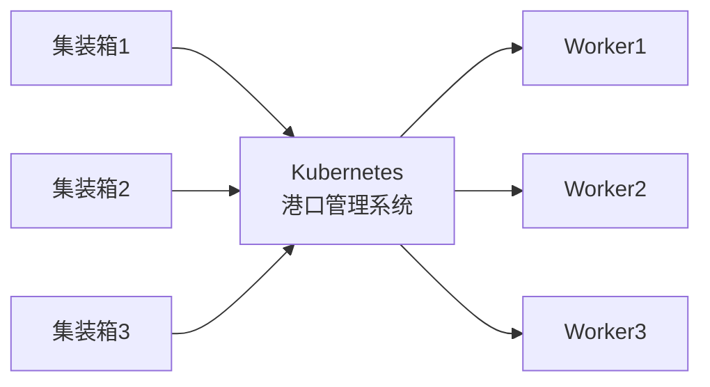

### Kubernetes的名字来源

**Kubernetes** = **K8s**（读作"Kubernetes"或"K8s"）

- K-u-b-e-r-n-e-t-e-s = K8s
- 8个字母被替换成数字8
- 类似的还有：i18n（internationalization）

**为什么叫这个名字？**
- 希腊语 "κυβερνήτης"（舵手、飞行员）
- 寓意：掌控容器，像船长掌控方向一样

### Kubernetes的发展历史

```
2003-2013年：Google 内部使用 Borg 系统（未开源，管理数十亿容器）
    ↓
2014年：Google 基于 Borg 的设计理念和经验，发布 Kubernetes（全新开源项目）
    ↓
2015年：Kubernetes 1.0发布
         CNCF成立，Kubernetes成为旗舰项目
    ↓
2017年：Kubernetes 1.6 稳定版发布
         Docker Swarm市场份额下降
    ↓
2018年：Kubernetes 1.10 成熟稳定
         成为容器编排标准
    ↓
至今：Kubernetes 1.28+ 持续更新
```

### Kubernetes能做什么？

| 功能 | 说明 | 类比 |
|------|------|------|
| **自动部署** | 一键部署应用 | 自动化码头 |
| **自动扩缩容** | 根据负载自动增减容器 | 弹性港口 |
| **负载均衡** | 自动分配流量 | 智能调度 |
| **故障恢复** | 自动重启失败的容器 | 自动维修 |
| **滚动更新** | 平滑升级应用版本 | 无痛升级 |
| **存储编排** | 自动挂载存储 | 智能仓库 |

### Kubernetes vs Docker Swarm

| 对比项 | Kubernetes | Docker Swarm |
|--------|-----------|---------------|
| **复杂度** | 高 | 低 |
| **学习曲线** | 陡峭 | 平缓 |
| **功能** | 极其丰富 | 基础功能 |
| **社区** | 庞大 | 较小 |
| **生态** | 完善 | 一般 |
| **适用场景** | 生产级 | 开发测试 |

### Kubernetes的核心概念

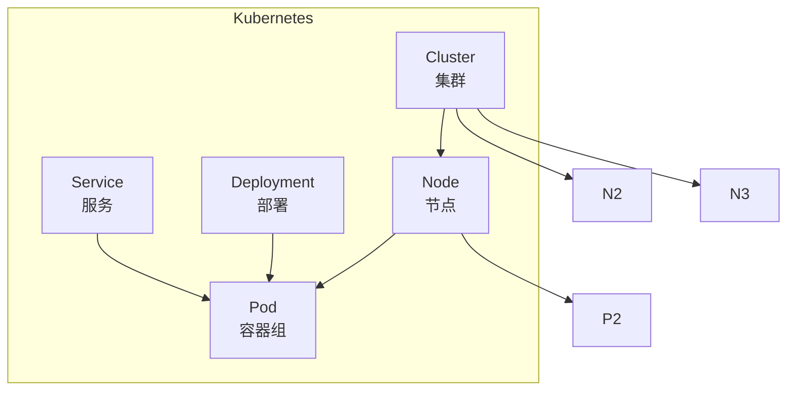

**核心概念（用人话解释）：**
- **Cluster（集群）**：整个"港口"，包含所有码头和集装箱
- **Node（节点）**："码头工人"，实际干活的服务器
- **Pod（容器组）**：最小的"集装箱单元"，里面可以装一个或多个容器（就像把几个小盒子捆在一起）
- **Deployment（部署）**："集装箱调度员"，负责决定要有多少个 Pod，以及怎么更新它们
- **Service（服务）**："港口信息台"，告诉外界怎么找到你的集装箱（提供稳定的访问入口）

> 💡 **记忆口诀**：Cluster 是港口，Node 是工人，Pod 是集装箱，Deployment 是调度员，Service 是信息台！

### 一图总结Kubernetes架构

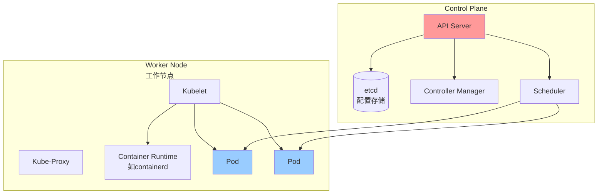

### Kubernetes的应用场景

| 场景 | 说明 |
|------|------|
| 微服务架构 | 服务多，需要服务发现、负载均衡 |
| 持续部署 | 频繁发布，需要滚动更新 |
| 弹性伸缩 | 流量波动大，需要自动扩缩容 |
| 多环境一致 | 开发、测试、生产环境统一 |
| 混合云 | 跨云平台部署 |

### 小结

Kubernetes是什么？
- **容器编排平台**：管理海量容器
- **Google开源**：基于Borg经验
- **CNCF旗舰项目**：云原生标准

Kubernetes能做什么？
- 自动部署、扩缩容
- 负载均衡、故障恢复
- 滚动更新、存储编排

下一节我们将深入学习 **K8s架构**！

## 52.2 K8s 架构

### Kubernetes整体架构

Kubernetes采用**主从架构**：

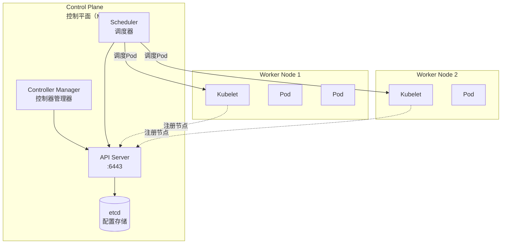

### 控制平面组件

#### 1. API Server

**API Server** 是Kubernetes的**入口**，所有操作都通过它：

```bash
# 通过kubectl发送请求
kubectl get pods

# 请求流程：
# kubectl --> API Server --> etcd --> 响应
```

**特点：**
- 提供RESTful API
- 认证/授权/准入控制
- 是唯一一个连接etcd的组件

#### 2. etcd

**etcd** 是分布式键值存储，保存集群所有数据：

```bash
# 查看etcd数据
etcdctl get /registry/pods/default/nginx-pod

# etcd特点：
# - 高可用（3节点以上）
# - 强一致性
# - Raft共识算法
```

#### 3. Controller Manager

**Controller Manager** 运行各种控制器：

| 控制器 | 作用 |
|--------|------|
| Node Controller | 监控节点状态 |
| Replication Controller | 维护Pod副本数 |
| Deployment Controller | 管理Deployment |
| Service Controller | 管理Service |
| Endpoint Controller | 管理Endpoints |

#### 4. Scheduler

**Scheduler** 负责Pod调度：

```
收到新Pod --> 检查节点资源 --> 选择最优节点 --> 绑定Pod到节点
```

调度考虑因素：
- 资源需求（CPU、内存）
- 亲和性/反亲和性
- Taints和Tolerations
- 节点标签

### 工作节点组件

#### 1. Kubelet

**Kubelet** 是节点的代理，负责：

- 向API Server注册节点
- 监听Pod分配
- 启动/停止容器
- 汇报节点状态

#### 2. Kube-Proxy

**Kube-Proxy** 负责网络代理和负载均衡：

```bash
# kube-proxy维护iptables规则
iptables -t nat -L KUBE-SERVICES
```

#### 3. Container Runtime

**容器运行时** 执行容器：

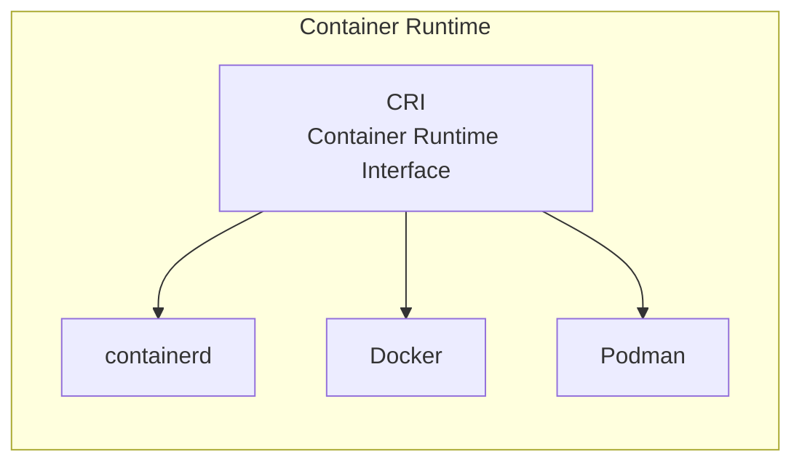

### 一图总结架构

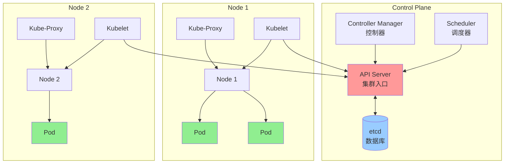

### 组件通信

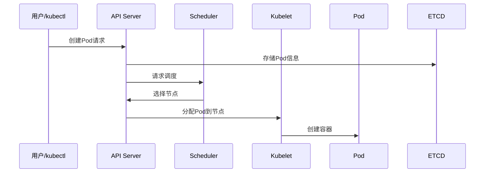

### 小结

Kubernetes架构：
- **控制平面**：API Server、Scheduler、Controller Manager、etcd
- **工作节点**：Kubelet、Kube-Proxy、Container Runtime

下一节我们将学习 **Pod**，这是Kubernetes的最小调度单位！

## 52.3 Pod

### Pod是什么？

**Pod** 是Kubernetes的**最小调度单位**。

你可以把Pod理解为一个"容器盒子"：
- 一个Pod可以包含**一个或多个容器**
- 同一个Pod内的容器**共享网络和存储**
- Pod内的容器像在同一个机器上运行

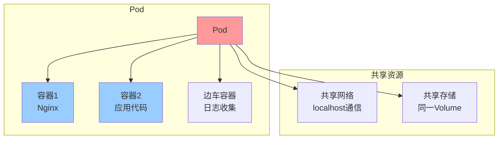

### Pod的使用场景

| 场景 | 说明 |
|------|------|
| 单容器Pod | 最常见，一个容器一个Pod |
| 边车模式 | 主容器 + 边车容器（如日志收集） |
| 初始化容器 | Pod启动前执行初始化任务 |

### 创建Pod

```yaml
# nginx-pod.yaml
apiVersion: v1
kind: Pod
metadata:
  name: nginx-pod
  labels:
    app: nginx
spec:
  containers:
    - name: nginx
      image: nginx:latest
      ports:
        - containerPort: 80
```

```bash
# 应用Pod配置
kubectl apply -f nginx-pod.yaml

# 查看Pod
kubectl get pods

# 查看Pod详情
kubectl describe pod nginx-pod

# 查看Pod日志
kubectl logs nginx-pod

# 进入Pod（如果容器支持）
kubectl exec -it nginx-pod -- /bin/bash

# 删除Pod
kubectl delete pod nginx-pod
```

### Pod的生命周期

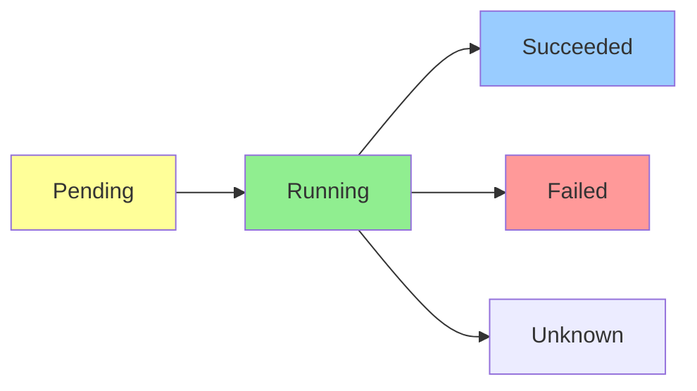

| 状态 | 说明 |
|------|------|
| Pending | Pod正在被调度或下载镜像 |
| Running | Pod已绑定到节点，容器正在运行 |
| Succeeded | 所有容器正常退出 |
| Failed | 容器异常退出 |
| Unknown | 无法获取Pod状态 |

### Pod的探针

Kubernetes提供两种探针检查容器健康：

| 探针 | 说明 |
|------|------|
| **Liveness Probe** | 存活探针，失败会重启容器 |
| **Readiness Probe** | 就绪探针，失败会移除Service |

```yaml
apiVersion: v1
kind: Pod
metadata:
  name: nginx-pod
spec:
  containers:
    - name: nginx
      image: nginx:latest
      livenessProbe:
        httpGet:
          path: /healthz
          port: 80
        initialDelaySeconds: 3
        periodSeconds: 10
      readinessProbe:
        httpGet:
          path: /ready
          port: 80
        initialDelaySeconds: 5
        periodSeconds: 5
```

### 小结

Pod要点：
- **最小调度单位**：包含一个或多个容器
- **共享网络和存储**：容器间localhost通信
- **生命周期状态**：Pending → Running → Succeeded/Failed

下一节我们将学习 **Deployment**，管理Pod副本的工具！

## 52.4 Deployment

### Deployment是什么？

**Deployment** 是管理Pod副本的控制器，让你：
- 部署应用
- 扩缩容
- 滚动更新
- 回滚

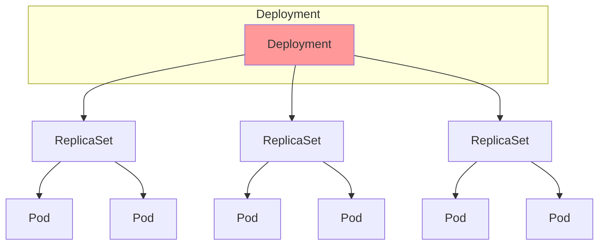

### 创建Deployment

```yaml
# nginx-deployment.yaml
apiVersion: apps/v1
kind: Deployment
metadata:
  name: nginx-deployment
spec:
  replicas: 3
  selector:
    matchLabels:
      app: nginx
  template:
    metadata:
      labels:
        app: nginx
    spec:
      containers:
        - name: nginx
          image: nginx:latest
          ports:
            - containerPort: 80
```

```bash
# 应用Deployment
kubectl apply -f nginx-deployment.yaml

# 查看Deployment
kubectl get deployments

# 查看ReplicaSet
kubectl get rs

# 查看Pod
kubectl get pods -l app=nginx

# 查看Deployment详情
kubectl describe deployment nginx-deployment
```

### 扩缩容

```bash
# 命令行扩缩容
kubectl scale deployment nginx-deployment --replicas=5

# 编辑配置扩缩容
kubectl edit deployment nginx-deployment
# 修改 replicas: 5

# 自动扩缩容（HPA）
kubectl autoscale deployment nginx-deployment --min=3 --max=10 --cpu-percent=80
```

### 滚动更新

```bash
# 更新镜像
kubectl set image deployment/nginx-deployment nginx=nginx:1.25

# 查看滚动更新状态
kubectl rollout status deployment/nginx-deployment

# 查看历史版本
kubectl rollout history deployment/nginx-deployment
```

### 回滚

```bash
# 回滚到上一个版本
kubectl rollout undo deployment/nginx-deployment

# 回滚到指定版本
kubectl rollout undo deployment/nginx-deployment --to-revision=2

# 查看历史版本
kubectl rollout history deployment/nginx-deployment
```

### 更新策略

```yaml
spec:
  strategy:
    type: RollingUpdate
    rollingUpdate:
      maxSurge: 1        # 最多超出期望副本数
      maxUnavailable: 0   # 最多不可用副本数
```

### 小结

Deployment要点：
- 管理Pod副本
- 支持扩缩容
- 滚动更新
- 版本回滚

下一节我们将学习 **Service**，服务发现和负载均衡！

## 52.5 Service

### Service是什么？

**Service** 为Pod提供稳定的访问入口：

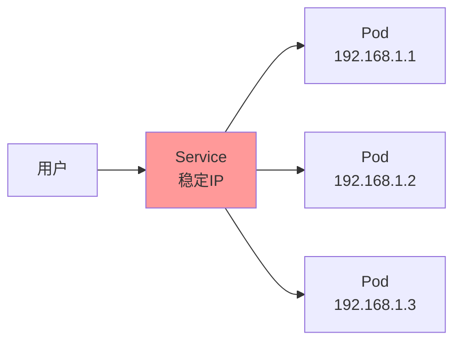

### Service类型

| 类型 | 说明 | 适用场景 |
|------|------|----------|
| **ClusterIP** | 内部访问 | 内部服务 |
| **NodePort** | 节点端口 | 开发测试 |
| **LoadBalancer** | 云负载均衡 | 生产环境 |
| **ExternalName** | CNAME映射 | 外部服务 |

### ClusterIP Service

```yaml
apiVersion: v1
kind: Service
metadata:
  name: nginx-service
spec:
  type: ClusterIP
  selector:
    app: nginx
  ports:
    - port: 80        # Service端口
      targetPort: 80  # Pod端口
```

### NodePort Service

```yaml
apiVersion: v1
kind: Service
metadata:
  name: nginx-service
spec:
  type: NodePort
  selector:
    app: nginx
  ports:
    - port: 80
      targetPort: 80
      nodePort: 30080  # 节点端口
```

### LoadBalancer Service

```yaml
apiVersion: v1
kind: Service
metadata:
  name: nginx-service
spec:
  type: LoadBalancer
  selector:
    app: nginx
  ports:
    - port: 80
      targetPort: 80
```

### Service发现

```bash
# 通过环境变量发现
# 每个Pod启动时会有SERVICE_NAME环境变量

# 通过DNS发现
# nginx-service.default.svc.cluster.local
# 简写：nginx-service
```

### 小结

Service要点：
- 提供稳定访问入口
- 负载均衡
- 服务发现

下一节我们将学习 **Ingress**，HTTP/HTTPS路由！

## 52.6 Ingress

### Ingress是什么？

**Ingress** 提供HTTP/HTTPS路由到Service：

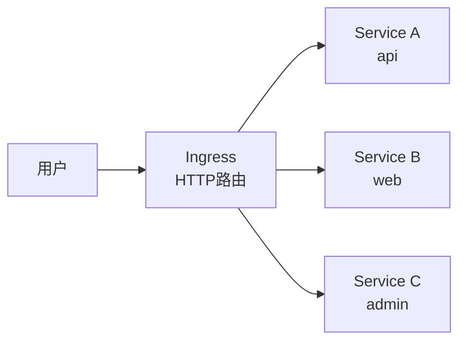

### 创建Ingress

```yaml
apiVersion: networking.k8s.io/v1
kind: Ingress
metadata:
  name: my-ingress
spec:
  rules:
    - host: myapp.example.com
      http:
        paths:
          - path: /api
            pathType: Prefix
            backend:
              service:
                name: api-service
                port:
                  number: 80
          - path: /
            pathType: Prefix
            backend:
              service:
                name: web-service
                port:
                  number: 80
```

### Ingress Controller

Ingress需要Ingress Controller才能工作：

```bash
# 安装Nginx Ingress Controller
kubectl apply -f https://raw.githubusercontent.com/kubernetes/ingress-nginx/controller-v1.8.0/deploy/static/provider/cloud/deploy.yaml
```

### 小结

Ingress要点：
- HTTP/HTTPS路由
- 基于域名/路径分发
- 需要Ingress Controller

下一节我们将学习 **ConfigMap**，配置管理！

## 52.7 ConfigMap

### ConfigMap是什么？

**ConfigMap** 存储应用配置：

```yaml
apiVersion: v1
kind: ConfigMap
metadata:
  name: my-config
data:
  DATABASE_HOST: "localhost"
  DATABASE_PORT: "3306"
  APP_ENV: "production"
```

### 使用ConfigMap

```bash
# 创建ConfigMap
kubectl create configmap my-config --from-literal=key=value
kubectl create configmap my-config --from-file=config.properties

# 应用YAML
kubectl apply -f configmap.yaml

# 查看ConfigMap
kubectl get configmap
kubectl describe configmap my-config
```

### Pod中使用ConfigMap

```yaml
spec:
  containers:
    - name: app
      image: myapp
      env:
        - name: DB_HOST
          valueFrom:
            configMapKeyRef:
              name: my-config
              key: DATABASE_HOST
      envFrom:
        - configMapRef:
            name: my-config
```

### 小结

ConfigMap要点：
- 存储配置数据
- 环境变量或文件挂载

下一节我们将学习 **Secret**，敏感信息管理！

## 52.8 Secret

### Secret是什么？

**Secret** 存储敏感数据，如密码、密钥：

```yaml
apiVersion: v1
kind: Secret
metadata:
  name: my-secret
type: Opaque
data:
  password: c3VwZXJzZWNyZXQ=  # base64编码
```

```bash
# 创建Secret
kubectl create secret generic my-secret --from-literal=password=secret123
kubectl create secret tls my-tls --cert=tls.crt --key=tls.key

# 查看Secret
kubectl get secret
kubectl describe secret my-secret
```

### Secret类型

| 类型 | 说明 |
|------|------|
| Opaque | 通用类型 |
| kubernetes.io/tls | TLS证书 |
| kubernetes.io/dockerconfigjson | Docker镜像仓库认证 |

### 小结

Secret要点：
- 存储敏感数据
- Base64编码（非加密）
- 生产环境建议配合加密方案

下一节我们将学习 **PV/PVC**，持久化存储！

## 52.9 PV/PVC

### 存储管理架构

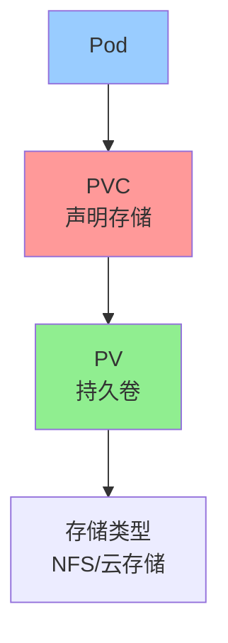

### PersistentVolume (PV)

```yaml
apiVersion: v1
kind: PersistentVolume
metadata:
  name: my-pv
spec:
  capacity:
    storage: 10Gi
  accessModes:
    - ReadWriteOnce
  persistentVolumeReclaimPolicy: Retain
  nfs:
    server: nfs-server
    path: /data
```

### PersistentVolumeClaim (PVC)

```yaml
apiVersion: v1
kind: PersistentVolumeClaim
metadata:
  name: my-pvc
spec:
  accessModes:
    - ReadWriteOnce
  resources:
    requests:
      storage: 5Gi
```

### Pod使用PVC

```yaml
spec:
  containers:
    - name: app
      image: myapp
      volumeMounts:
        - name: data
          mountPath: /data
  volumes:
    - name: data
      persistentVolumeClaim:
        claimName: my-pvc
```

### 小结

PV/PVC要点：
- PV：集群级别的存储资源
- PVC：Pod对存储的请求
- 动态供给：StorageClass自动创建PV

下一节我们将学习 **kubectl**，K8s命令行工具！

## 52.10 kubectl

### kubectl简介

**kubectl** 是Kubernetes的命令行工具：

```bash
# 集群操作
kubectl cluster-info          # 查看集群信息
kubectl get nodes             # 查看节点
kubectl describe node node1    # 节点详情

# Pod操作
kubectl get pods              # 查看Pod
kubectl describe pod nginx     # Pod详情
kubectl logs nginx             # 查看日志
kubectl exec -it nginx -- /bin/bash  # 进入容器
kubectl delete pod nginx       # 删除Pod

# Deployment操作
kubectl get deployments        # 查看Deployment
kubectl apply -f app.yaml      # 应用配置
kubectl rollout status deploy/app  # 滚动更新状态
kubectl scale deploy app --replicas=3  # 扩缩容

# Service操作
kubectl get services          # 查看Service
kubectl expose deploy nginx --port=80 --type=LoadBalancer  # 暴露服务

# 调试
kubectl get events             # 查看事件
kubectl top nodes              # 节点资源使用
kubectl top pods               # Pod资源使用
```

### kubectl配置

```bash
# 查看配置
cat ~/.kube/config

# 切换集群
kubectl config use-context context-name

# 查看上下文
kubectl config get-contexts
```

### 小结

kubectl要点：
- 集群管理核心工具
- 资源CRUD操作
- 调试和问题排查

下一节我们将学习 **Helm**，K8s包管理器！

## 52.11 Helm

### Helm是什么？

**Helm** 是Kubernetes的包管理器：

```bash
# 添加仓库
helm repo add bitnami https://charts.bitnami.com/bitnami

# 更新仓库
helm repo update

# 搜索Chart
helm search repo nginx

# 安装Chart
helm install my-nginx bitnami/nginx

# 查看Release
helm list

# 升级
helm upgrade my-nginx bitnami/nginx --set image.tag=1.25

# 回滚
helm rollback my-nginx 1

# 卸载
helm uninstall my-nginx
```

### Helm Chart结构

```
mychart/
├── Chart.yaml          # Chart信息
├── values.yaml         # 默认配置
├── charts/            # 依赖的Chart
└── templates/         # K8s资源模板
```

### 小结

Helm要点：
- K8s包管理器
- Chart复用配置
- 简化部署

下一节我们将学习 **K8s网络**，容器网络！

## 52.12 K8s 网络

### K8s网络原则

1. Pod有唯一IP
2. 容器间可以直接通信
3. Node可以与所有Pod通信

### 网络模型

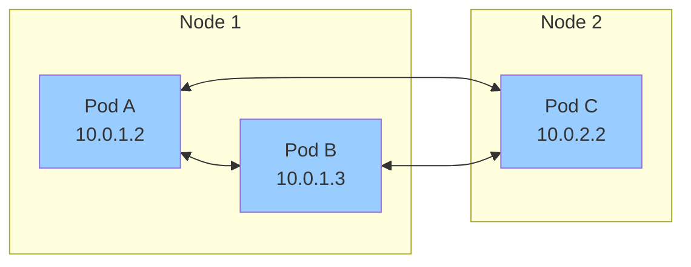

### 网络方案

| 方案 | 说明 |
|------|------|
| Flannel | 简单Overlay网络 |
| Calico | 支持网络策略 |
| Cilium | eBPF驱动，高性能 |

### NetworkPolicy

```yaml
apiVersion: networking.k8s.io/v1
kind: NetworkPolicy
metadata:
  name: api-network-policy
spec:
  podSelector:
    matchLabels:
      app: api
  policyTypes:
    - Ingress
    - Egress
  ingress:
    - from:
        - podSelector:
            matchLabels:
              role: frontend
```

### 小结

K8s网络要点：
- Pod间直接通信
- CNI插件实现网络
- NetworkPolicy控制流量

下一节我们将学习 **RBAC**，权限管理！

## 52.13 RBAC

### RBAC是什么？

**RBAC**（基于角色的访问控制）管理权限：

```yaml
# 创建ServiceAccount
apiVersion: v1
kind: ServiceAccount
metadata:
  name: my-app

# 创建Role
apiVersion: rbac.authorization.k8s.io/v1
kind: Role
metadata:
  name: pod-reader
rules:
  - apiGroups: [""]
    resources: ["pods"]
    verbs: ["get", "list", "watch"]

# 创建RoleBinding
apiVersion: rbac.authorization.k8s.io/v1
kind: RoleBinding
metadata:
  name: read-pods
subjects:
  - kind: ServiceAccount
    name: my-app
roleRef:
  kind: Role
  name: pod-reader
```

### 权限级别

| 级别 | 说明 |
|------|------|
| verbs | get, list, watch, create, update, patch, delete |
| resources | pods, deployments, services... |
| apiGroups | "", apps, networking.k8s.io... |

### 小结

RBAC要点：
- Role定义权限
- RoleBinding绑定权限到主体
- ClusterRole/ClusterRoleBinding集群级别

下一节我们将学习 **GitOps**，现代化部署方式！

## 52.14 GitOps

### GitOps是什么？

**GitOps** 是一种部署方式：

```
Git仓库（声明式配置） --> 自动同步 --> Kubernetes集群
```

### 核心流程

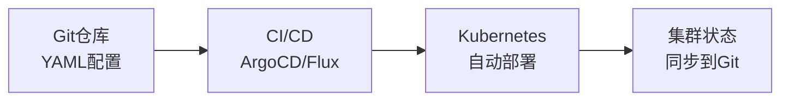

### ArgoCD示例

```bash
# 安装ArgoCD
kubectl create namespace argocd
kubectl apply -n argocd -f https://raw.githubusercontent.com/argoproj/argo-cd/stable/manifests/install.yaml

# 访问ArgoCD UI
kubectl port-forward svc/argocd-server -n argocd 8080:443
```

### 小结

GitOps要点：
- Git作为唯一真相来源
- 自动同步配置到集群
- ArgoCD/Flux工具

下一节我们将学习 **服务网格**，微服务通信层！

## 52.15 服务网格

### 服务网格是什么？

**服务网格** 是微服务间通信的基础设施层：

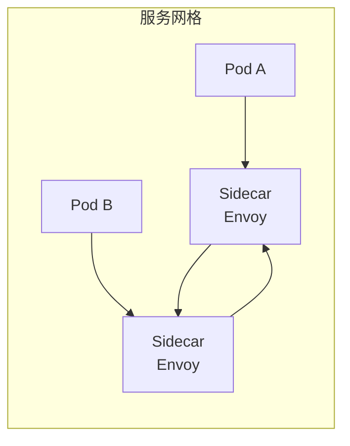

### Istio架构

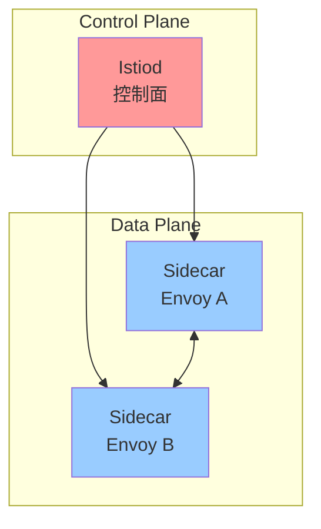

### Istio功能

| 功能 | 说明 |
|------|------|
| 流量管理 | 路由、负载均衡 |
| 可观测性 | 指标、日志、追踪 |
| 安全 | mTLS加密 |
| 策略执行 | 限流、黑白名单 |

### 小结

服务网格要点：
- Sidecar代理
- 统一通信层
- 流量管理、安全、可观测性

---

## 本章小结

本章我们学习了Kubernetes核心知识：

### 核心概念

| 概念 | 说明 |
|------|------|
| **Pod** | 最小调度单位 |
| **Deployment** | 管理Pod副本和更新 |
| **Service** | 服务发现和负载均衡 |
| **Ingress** | HTTP路由 |
| **ConfigMap/Secret** | 配置和敏感数据 |
| **PV/PVC** | 持久化存储 |
| **RBAC** | 权限控制 |

### kubectl常用命令

```bash
kubectl get pods                    # 查看Pod
kubectl apply -f app.yaml          # 应用配置
kubectl scale deploy app --replicas=3  # 扩缩容
kubectl rollout status deploy/app   # 滚动更新
kubectl logs app-xxx               # 查看日志
kubectl exec -it app-xxx -- /bin/bash  # 进入容器
```

### 部署流程

```bash
# 1. 创建Deployment
kubectl apply -f deployment.yaml

# 2. 创建Service
kubectl apply -f service.yaml

# 3. 暴露服务
kubectl expose deployment nginx --port=80 --type=LoadBalancer

# 4. 检查状态
kubectl get all
kubectl get pods -l app=nginx
```

### Helm使用

```bash
helm repo add bitnami https://charts.bitnami.com/bitnami
helm install my-app bitnami/nginx
helm upgrade my-app bitnami/nginx
helm rollback my-app
```

### 下章预告

恭喜你完成了Linux教程的全部52章！

从Linux基础、网络、防火墙、到数据库、Docker容器、再到Kubernetes，你已经掌握了现代后端开发的核心技术！

> **趣味彩蛋**：Kubernetes的logo是一个七轴舵轮。
>
> 寓意是：掌控容器，就像船长掌控方向一样！
>
> 但程序员们更喜欢把它理解成："又一个要学的东西！" 😂
>
> 记住：**Kubernetes不是银弹，但它是你通向云原生的必经之路！** 🚢


