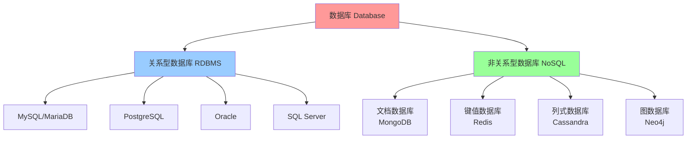
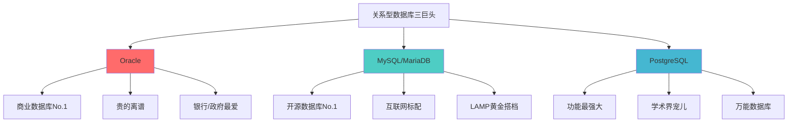
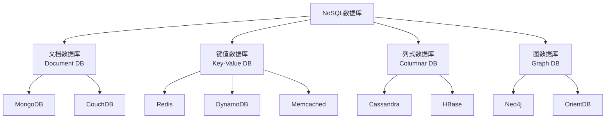
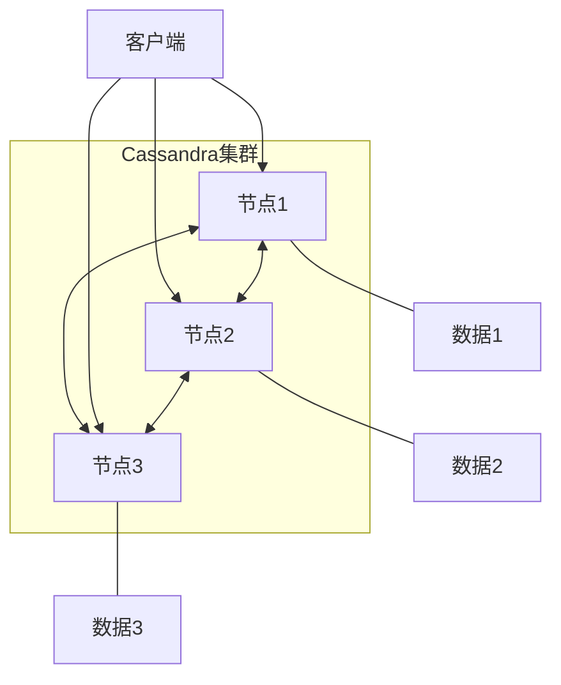
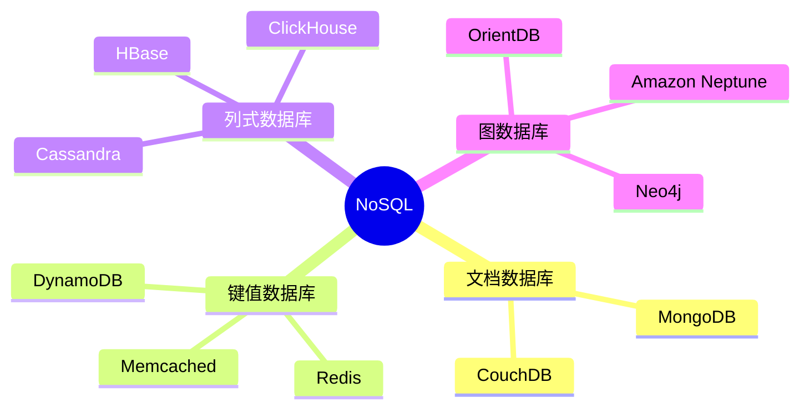
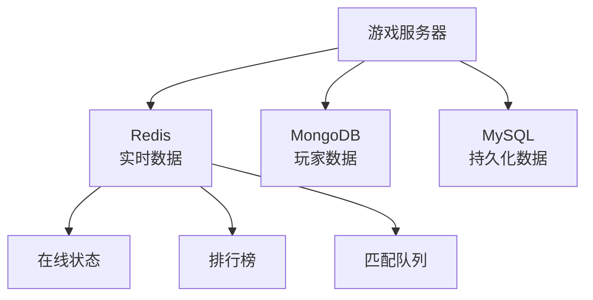
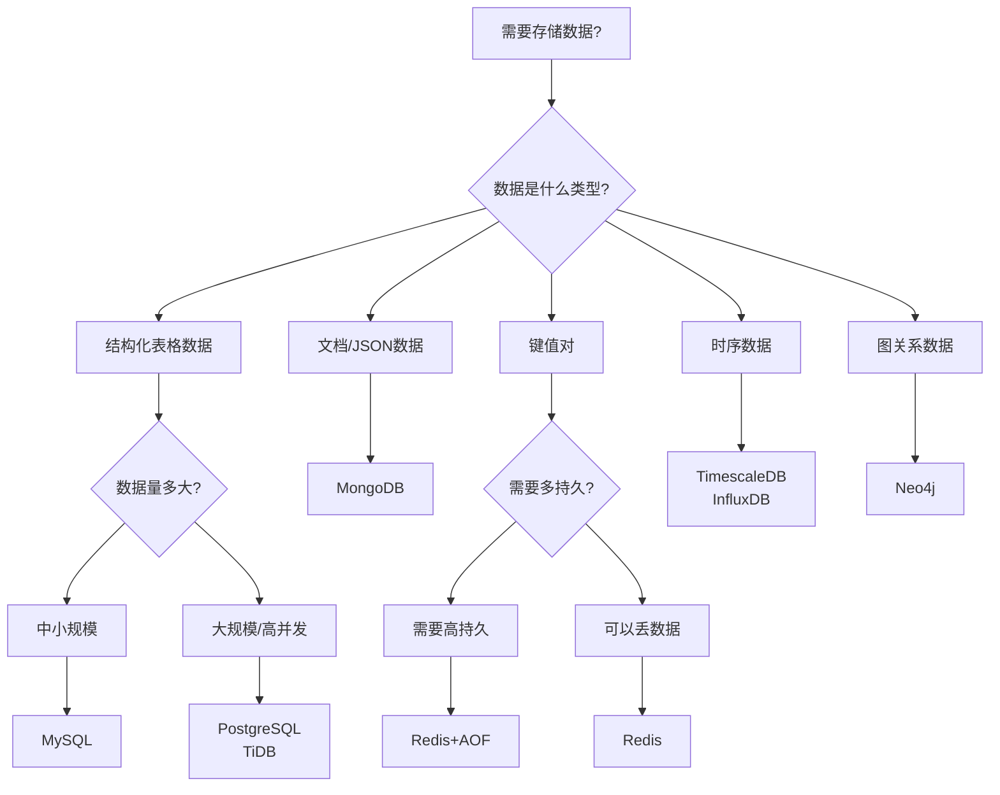

+++
title = "第43章：数据库基础"
weight = 430
date = "2026-03-24T13:18:28+08:00"
type = "docs"
description = ""
isCJKLanguage = true
draft = false
+++


# 第四十三章：数据库基础

## 43.1 什么是数据库？

想象一下，你有一个超级大的仓库，里面整整齐齐地摆放着无数个小盒子。每个盒子里都装着特定的东西——有的装衣服，有的装零食，有的装你的重要文件。然后，你有一个超级智能的机器人，它知道你把东西放在哪个盒子里，你一问它就能立刻帮你找到。

恭喜你！你刚刚理解了数据库的基本概念！

### 数据库？就是个超级管家！

**数据库（Database）**，简单来说，就是按照特定规则组织的、长期存储在计算机内的、相互关联的数据集合。听起来很学术对不对？没关系，我们来翻译成人话：

> 数据库就是：**数据的图书馆 + 超级管理员 + 永不疲倦的整理大师**

### 没有数据库的世界？那是灾难片！

想象一下，没有数据库的世界会怎样：

- **某宝**：买家："我昨天买的拖鞋呢？" 系统："等一下我翻翻这堆纸箱...大概在火星吧..."
- **某信**：你想找去年春节发的红包记录？好的，请准备好三生三世的时间。
- **学校教务系统**：查成绩？先把1999年的纸质档案从地下室搬出来...
- **银行**：取钱？柜员正在用算盘计算你的余额，请稍等...

是的，没有数据库的世界，就是这么刺激又混乱！

### 数据库的工作原理——比你的大脑靠谱多了！

数据库的核心工作可以用四个字概括：**增删改查**

| 操作 | 英文 | 功能 | 类比 |
|------|------|------|------|
| 增加 | Create/Insert | 添加新数据 | 往书架上放新书 |
| 查询 | Read/Select | 读取数据 | 找书 |
| 修改 | Update | 更新数据 | 把书换到更好的位置 |
| 删除 | Delete | 删除数据 | 扔掉不再需要的书 |

这四个操作简称 **CRUD**，是数据库的"四项基本原则"。记住它，走遍天下都不怕！

### 数据库的"户型分类"

根据存储方式和使用场景，数据库可以分为两大门派：

**1. 关系型数据库（RDBMS）—— 传统老大哥**
- 数据存储在表格中，行列分明，像Excel表格的超级升级版
- 使用 **SQL（结构化查询语言）** 来操作数据
- 代表人物：MySQL、PostgreSQL、Oracle、SQL Server
- 适合场景：需要严格数据一致性、复杂查询、事务处理的业务

**2. 非关系型数据库（NoSQL）—— 新晋网红**
- 不拘一格，数据想怎么存就怎么存（文档、键值、列族、图）
- 性能爆表，扩展性强
- 代表人物：MongoDB、Redis、Cassandra、ElasticSearch
- 适合场景：高并发、灵活 schema、海量数据、缓存场景

### 数据库管理系统（DBMS）—— 数据库的CEO

很多人把"数据库"和"数据库管理系统"混为一谈，其实它们是：

```
数据库 = 仓库里的货物
数据库管理系统（DBMS） = 仓库管理员 + 货架系统 + 进出货流程
```

常见的DBMS有：
- **MySQL/MariaDB**：开源界的常青树，中小企业的最爱
- **PostgreSQL**：功能最强大的开源数据库，学术界的宠儿
- **Oracle**：企业级大佬，银行和政府的心头好（贵是真贵，强是真强）
- **MongoDB**：文档数据库的代言人，JSON爱好者的归宿
- **Redis**：内存数据库的速度之王，缓存界的扛把子

### 一图总结数据库家族



### 数据库的历史——从纸带到大数据

数据库的发展史，简直就是一部人类"数据焦虑"的进化史：

1. **1950年代-纸带时代**：数据打在纸带上，读取一次就少一次
2. **1960年代-层次/网状数据库**：数据像树枝一样层层叠叠，复杂得像迷宫
3. **1970年代-关系型数据库诞生**：IBM研究员Edgar Codd提出了关系模型，这是数据库领域的"工业革命"！
4. **1980年代-SQL语言标准化**：终于有了一种统一的数据操作语言
5. **1990年代-数据库商业化**：Oracle、IBM、Microsoft三足鼎立
6. **2000年代-NoSQL兴起**：互联网爆发，传统数据库扛不住了
7. **2010年代-NewSQL/云数据库**：既要NoSQL的扩展性，又要关系型的强一致性
8. **2020年代-多模数据库**：一个数据库，多种玩法，随心所欲

### 小结

数据库，就是计算机世界的"数据仓库"。它是：
- 数据的"图书馆"，帮你 organized 地存储和查找数据
- 程序的"记忆中枢"，没有它，软件就是个失忆症患者
- 业务的"数据中心"，支撑着你每天刷的每一个App

下一节我们将详细介绍**关系型数据库**，看看这些"表格控"们是如何统治数据世界的！

## 43.2 关系型数据库

**关系型数据库（Relational Database Management System，简称RDBMS）** 是什么？

想象一下Excel表格，但这个表格不是给你手工填的，而是程序自动操作的；不是只有一张，而是无数张表格可以互相"聊天"、互相引用；不是存个几十MB就卡死，而是能存几十TB数据还游刃有余；不是你关掉就丢了，而是24小时运行、永不宕机。

这就是关系型数据库！

### 关系型数据库的核心思想

关系型数据库的"关系"，不是指"和谁搞关系"的意思，而是指**表和表之间的关联关系**。

举个例子：

```
┌─────────────┐         ┌─────────────┐
│   用户表    │         │   订单表    │
├─────────────┤         ├─────────────┤
│ id: 1       │────┐    │ id: 1001    │
│ name: 小明  │    └───→│ user_id: 1  │
│ email: ...  │         │ amount: 999 │
└─────────────┘         └─────────────┘
       ↓                        ↓
   用户信息                 属于哪个用户
```

小明（id=1）的订单，通过 `user_id` 这个"红线"，和小明本人连在了一起。这就是**关系**！

### 关系型数据库的三大神器

| 神器 | 作用 | 类比 |
|------|------|------|
| **表（Table）** | 存储同类型数据 | Excel 表格 |
| **行（Row）** | 一条具体的数据记录 | 表格中的一行 |
| **列（Column）** | 数据的属性/字段 | 表格中的一列 |

### SQL——数据库的"普通话"

**SQL（Structured Query Language）**，中文名"结构化查询语言"，是操作关系型数据库的标准语言。无论你用的是MySQL、PostgreSQL还是Oracle，只要会SQL，走遍天下都不怕！

SQL能干的事儿，用一句话概括就是：**对表进行各种"增删改查"操作**

- **INSERT**：插入数据（CREATE）
- **SELECT**：查询数据（READ）
- **UPDATE**：更新数据（UPDATE）
- **DELETE**：删除数据（DELETE）

加上数据定义（创建表、修改表结构）和权限管理，就构成了完整的SQL家族！

### 关系型数据库的特点

**优点：**
- **数据一致性**：ACID属性保证数据准确无误（后面会详细介绍）
- **成熟稳定**：发展了几十年，踩过的坑都填好了
- **功能强大**：支持复杂查询、事务、子查询...
- **生态完善**：工具、文档、社区，要啥有啥

**缺点：**
- **扩展性差**：数据量大了，想分布到多台服务器？有点麻烦
- **灵活性差**：schema是固定的，改结构像改户型
- **性能瓶颈**：海量数据+高并发时，可能扛不住

### 关系型数据库的ACID——数据界的"四项基本原则"

提到关系型数据库，就不能不提 **ACID**，这是数据库事务的"四项基本原则"：

- **A - Atomicity（原子性）**：事务就像原子一样，不可分割。要么全部成功，要么全部失败回滚。
- **C - Consistency（一致性）**：事务前后，数据库状态必须是一致的。比如转账，张三少100，李四就必须多100。
- **I - Isolation（隔离性）**：多个事务同时执行时，互不干扰。你查你的数据，我删我的记录，别打架！
- **D - Durability（持久性）**：事务一旦提交，数据就必须永久保存。服务器宕机了？重启后数据还在！

### 43.2.1 MySQL/MariaDB——开源数据库界的"双胞胎"

**MySQL** 和 **MariaDB** 的关系，就像... 一对被迫分家的兄弟。

故事是这样的：
- MySQL 最初是瑞典的 MySQL AB 公司开发的开源数据库
- 2008年被Sun收购（Sun是Java的亲爹）
- 2009年Oracle收购了Sun，MySQL就落到了Oracle手里
- 开源社区不放心："Oracle这货会不会把MySQL往死里整？"
- 于是，MySQL的创始人Michael Widenius（大名鼎鼎的Monty）一怒之下，fork了MySQL，创造了**MariaDB**

所以现在的关系是：
```
MySQL（Oracle家的亲儿子）
    ↓ fork
MariaDB（社区维护的"替身"）
```

**MySQL的特点：**
- 体积小、速度快、成本低（开源免费）
- 社区活跃，文档丰富
- 是"LAMP黄金搭档"的成员之一（Linux + Apache + MySQL + PHP）
- 互联网公司的心头好

**MariaDB的特点：**
- 完全兼容MySQL，换过去零成本
- 性能更好，功能更多
- 没有Oracle的"商业污染"
- 很多Linux发行版默认用MariaDB替代MySQL（比如Ubuntu）

**MySQL/MariaDB的适用场景：**
- 网站和应用的后端数据库
- 中小型企业的业务系统
- 电子商务平台
- 内容管理系统（CMS）

> 🐬 **趣味知识**：MySQL 的 Logo 是一只海豚（其实是叫 Sakila），MariaDB 的 Logo 是一只海狮（叫 Maria）—— 看来数据库界很喜欢海洋生物！

### 43.2.2 PostgreSQL——"功能最强"的开源数据库

如果说MySQL是个"实用主义者"，那**PostgreSQL**就是个"功能狂魔"。

PostgreSQL，简称**PG**，是一个功能强大的开源对象关系型数据库。它的口号是：

> *"The world's most advanced open source relational database"*
> （世界上最先进的开源关系型数据库）

这话还真不是吹的！PostgreSQL支持：
- JSON/JSONB数据类型（半结构化数据）
- 自定义数据类型和函数
- 全文检索
- 地理信息系统（GIS）
- 复杂的触发器和存储过程
- MVCC（多版本并发控制）
- 外部表（访问其他数据库的数据）
- 异步消息通知
- ...还有一大堆你想得到的和想不到的功能

**PostgreSQL vs MySQL：**

| 对比项 | PostgreSQL | MySQL |
|--------|-----------|-------|
| 开发历史 | 1996年至今 | 1995年至今 |
| 协议 | PostgreSQL协议 | MySQL协议 |
| SQL标准支持 | 几乎完美支持 | 部分支持 |
| 事务支持 | 完整ACID | 支持，但InnoDB引擎更强 |
| 性能 | 复杂查询更强 | 简单查询更快 |
| 扩展性 | 自定义类型、函数 | 插件系统 |
| 适用场景 | 复杂业务、数据分析 | 互联网应用 |

**选MySQL还是PostgreSQL？**
- 如果你做**互联网应用**、追求**性能**、社区**生态成熟**：选MySQL
- 如果你做**企业级应用**、需要**复杂功能**、数据**一致性要求高**：选PostgreSQL

### 43.2.3 Oracle——数据库界的"老大哥"和"奢侈品"

**Oracle Database**，江湖人称"甲骨文"，是整个数据库行业的**祖师爷**和**武林盟主**。

为什么这么说？
- 1979年，Oracle推出了世界上第一个商业关系型数据库
- 多年来一直是全球最大的数据库软件公司
- 无数银行、证券、政府机关的核心系统都在用它
- 一句话：**贵是真贵，强是真强**

**Oracle的特点：**
- **功能最全面**：没有之一，只有你想不到，没有它做不到
- **性能最稳定**：企业级品质，7×24小时不间断运行
- **安全性最高**：各种安全认证，政府和金融行业的标配
- **价格也最高**：License费用贵到令人窒息，还需要额外的硬件投入

**Oracle的"钞能力"代价：**
```
Oracle标准版：47,000美元/处理器
Oracle企业版：350,000美元/处理器
```

对，你没看错，是**每处理器**，不是每用户。如果你的服务器有32核...（算了，不敢算）

所以江湖上有个传说：
> "如果你嫌Oracle贵，那就用PostgreSQL吧，反正功能差不多。"
> "如果你嫌PostgreSQL不够强，那就...继续攒钱买Oracle吧。"

**Oracle vs 其他开源数据库：**

| 对比项 | Oracle | MySQL | PostgreSQL |
|--------|--------|-------|------------|
| 成本 | 贵的离谱 | 免费/便宜 | 免费 |
| 功能 | 最全面 | 够用 | 很全面 |
| 性能 | 一骑绝尘 | 不错 | 很好 |
| 生态 | 封闭但完善 | 开放活跃 | 开放活跃 |

### 关系型数据库三巨头对比



### 一句话总结

- **MySQL/MariaDB**：互联网创业公司的首选，性价比之王
- **PostgreSQL**：技术宅的最爱，功能强到没朋友
- **Oracle**：土豪企业和政府机关的专属，"钱"途无量

下一节我们将看看非关系型数据库是如何"不拘一格"地存储数据的！

## 43.3 非关系型数据库

**非关系型数据库（NoSQL = Not Only SQL）**，江湖人称"打破规矩的叛逆者"。

如果说关系型数据库是个**西装革履、一板一眼的老绅士**，那非关系型数据库就是个**穿着潮牌、随时蹦迪的叛逆少年**。

### 打破"表格"的束缚

关系型数据库的核心是**表**，每个表都有固定的列（字段），每行数据都必须遵守这个格式。就像这样：

```sql
-- 关系型数据库：用户表
CREATE TABLE users (
    id INT PRIMARY KEY,
    name VARCHAR(50),      -- 姓名，必须是字符串，最多50字符
    age INT,               -- 年龄，必须是整数
    email VARCHAR(100)     -- 邮箱，必须是字符串
);
-- 插入数据：所有字段都得按规矩来
INSERT INTO users VALUES (1, '小明', 25, 'xiaoming@example.com');
```

但如果有个用户比较特殊，他有多个邮箱怎么办？或者他想存一张照片？

关系型数据库会说："加列！加表！做关联！"

非关系型数据库会说："谁管你！想怎么存就怎么存！"

### NoSQL的四大流派

非关系型数据库根据存储方式，可以分为四大流派：



### NoSQL的"必杀技"

| 必杀技 | 说明 | 适用场景 |
|--------|------|----------|
| **高扩展性** | 轻松扩展到N台服务器 | 海量数据存储 |
| **高性能** | 读写速度飞起 | 高并发场景 |
| **灵活Schema** | 数据结构随意变化 | 需求多变的开发 |
| **高可用** | 一台挂了，其他继续服务 | 7×24服务 |

### NoSQL的"软肋"

| 软肋 | 说明 | 解决方案 |
|------|------|----------|
| **不支持SQL** | 得学新的查询语言 | 客户端API |
| **不支持事务** | 无法保证ACID | 最终一致性 |
| **不保证数据一致性** | 可能读到旧数据 | BASE理论 |
| **生态不够成熟** | 工具和文档较少 | 社区发展 |

### 43.3.1 MongoDB——文档数据库的扛把子

**MongoDB** 是非关系型数据库中最像"正常数据库"的一个，因为它：

- 有数据库（database）的概念
- 有集合（collection，相当于表）的概念
- 有文档（document，相当于行）的概念
- 还支持简单的索引和查询

但它最厉害的地方在于：**文档是JSON格式的！**

想象一下，在关系型数据库里，你想存储一个用户的社交关系：
- 朋友圈列表
- 关注列表
- 收藏列表
- 最近登录设备

你需要：
- 建用户表
- 建朋友圈表（多对多关联）
- 建关注表（多对多关联）
- 建收藏表（多对多关联）
- 建设备表（一对多关联）
- 然后写一堆 JOIN 查询

在MongoDB里：
```javascript
// 一个文档搞定！
{
    _id: ObjectId("..."),
    name: "小明",
    friends: ["小红", "小刚", "小丽"],
    following: ["马化腾", "马云"],
    favorites: ["奶茶", "代码", "BUG"],
    devices: [
        { type: "iPhone", lastLogin: "2024-01-01" },
        { type: "MacBook", lastLogin: "2024-01-02" }
    ]
}
```

**MongoDB的特点：**
- **Schema灵活**：字段随时加随时删，不用 ALTER TABLE
- **查询强大**：支持嵌套查询、范围查询、正则匹配
- **性能优秀**：基于内存映射文件，读取速度飞快
- **横向扩展**：分片集群，数据自动分散到多台机器

**MongoDB的口号是：**
> *"让数据库变得像写代码一样自然！"*

### 43.3.2 Redis——键值数据库的速度之王

如果说数据库是仓库，那 **Redis** 就是**超级VIP保鲜柜**。

为什么这么说？因为Redis的数据都存在**内存**里！

普通数据库：硬盘 → 读取 → 内存 → 处理 → 写入硬盘
Redis：内存 → 读取 → 处理 → 写入内存

少了两步，速度能不快吗？！

**Redis的独门绝技：**
- **内存存储**：快到没朋友，QPS轻松上10万+
- **持久化**：虽然快，但数据不会丢（AOF + RDB）
- **多种数据结构**：String、Hash、List、Set、ZSet...
- **主从复制**：读写分离，分担压力
- **哨兵和集群**：高可用，永不宕机

**Redis的日常：**
```bash
# 存一个字符串
SET name "小明"
# 取出来
GET name
# "小明"

# 存一个哈希（对象）
HSET user:1 name "小明" age 25
HGET user:1 name
# "小明"

# 存一个列表（队列）
LPUSH tasks "任务1" "任务2" "任务3"
LRANGE tasks 0 -1
# ["任务3", "任务2", "任务1"]
```

**Redis的适用场景：**
- **缓存层**：热点数据放Redis，减轻数据库压力
- **会话存储**：用户登录状态、购物车内容
- **实时排行榜**：游戏积分、点击量排行
- **消息队列**：轻量级队列、实时通知
- **分布式锁**：多进程协调工作

Redis的口号：
> *"天下武功，唯快不破！"*

### 43.3.3 Cassandra——列式数据库的性能怪兽

**Cassandra** 是Facebook开源的列式分布式数据库，现在属于Apache基金会。

**列式数据库 vs 行式数据库：**

| 存储方式 | 读取方式 | 优势 | 劣势 |
|----------|----------|------|------|
| **行式存储**（MySQL、Oracle） | 按行读取 | 写入快、事务强 | 列聚合查询慢 |
| **列式存储**（Cassandra、HBase） | 按列读取 | 列聚合查询快、压缩率高 | 写入相对慢 |

**什么时候用Cassandra？**
- 数据量超级大（PB级别）
- 需要高可用（Facebook级别）
- 写入比读取更频繁
- 不想被单点故障困扰

Cassandra的核心特点是：**没有单点故障！**

它采用**去中心化架构**，每个节点都是平等的，数据分布在多个节点上，一个节点挂了，其他节点继续服务。



**Cassandra vs 其他NoSQL：**

| 对比项 | Cassandra | MongoDB | Redis |
|--------|-----------|---------|-------|
| 数据模型 | 列族 | 文档 | 键值 |
| 一致性 | 可调一致性 | 强一致性 | 弱一致性 |
| 扩展性 | 线性扩展 | 中等 | 受限于内存 |
| 写入性能 | 极高 | 高 | 极高 |
| 查询复杂度 | 有限 | 丰富 | 简单 |

### NoSQL的"BASE"理论

关系型数据库讲ACID，NoSQL讲**BASE**：

- **Basically Available**：基本可用，允许偶尔故障——就像你的WiFi，偶尔断一下，忍忍就过去了
- **Soft state**：软状态，数据状态可以变化——你看到的可能是"中间态"，不是最终结果
- **Eventually consistent**：最终一致性，允许短暂不一致，但最终会一致——就像微信消息，你发了我没看到，但迟早会看到的

这听起来很佛系对不对？但在大规模分布式系统中，这是性能和一致性的权衡艺术。

**一句话总结**：ACID是"强迫症患者"，BASE是"佛系青年"，各有各的好！

### 一图总结NoSQL大家族



### 小结

NoSQL数据库的出现，不是为了"干掉"关系型数据库，而是为了解决**特定场景下**的特定问题。

- **MongoDB**：当你需要灵活的文档结构时
- **Redis**：当你需要极致的速度时
- **Cassandra**：当你需要处理海量数据时

下一节我们将总结数据库的应用场景，让你知道什么情况该选什么数据库！

## 43.4 数据库应用场景

### 场景一：电商系统

**场景描述：**
双十一来了，用户疯狂下单，订单量暴涨！

**数据库选型：**


- **Redis**：存储用户会话、商品缓存、秒杀库存
- **MySQL**：存储用户信息、订单详情、交易记录
- **ElasticSearch**：商品搜索、关键词匹配

### 场景二：社交网络

**场景描述：**
你的好友、粉丝、朋友圈、评论、私信...数据量爆炸！

**数据库选型：**
- **MongoDB**：存储用户动态、评论、朋友圈
- **Redis**：存储好友关系、实时消息推送
- **Neo4j**：社交图谱，好友推荐算法
- **Cassandra**：私信历史、海量日志

### 场景三：游戏系统

**场景描述：**
玩家登录、充值、战斗、排行榜...

**数据库选型：**
- **Redis**：实时排行榜、玩家状态、道具缓存
- **MongoDB**：玩家背包、任务进度、公会信息
- **MySQL**：充值记录、交易流水



### 场景四：大数据分析

**场景描述：**
老板想知道这季度卖得最好的产品是什么？用户画像是什么？

**数据库选型：**
- **ClickHouse**：OLAP分析，秒级查询海量数据
- **HBase**：非结构化日志存储
- **Hive**：SQL风格查询Hadoop数据

### 场景五：物联网（IoT）

**场景描述：**
千万个传感器，每秒上报N条数据...

**数据库选型：**
- **TimescaleDB**：时序数据优化
- **InfluxDB**：专门处理时序数据
- **Cassandra**：海量传感器数据

### 数据库选型决策树



### 一句话总结各场景

| 场景 | 推荐数据库 | 理由 |
|------|-----------|------|
| 网站后台 | MySQL + Redis | 经典组合，稳如老狗 |
| 内容管理系统 | MongoDB | 灵活文档，随心所欲 |
| 缓存层 | Redis | 速度为王 |
| 日志分析 | Elasticsearch | 全文检索一把好手 |
| 社交网络 | MongoDB + Neo4j | 图谱+内容，全方位覆盖 |
| 物联网 | Cassandra + InfluxDB | 海量时序数据专业户 |
| 大数据分析 | ClickHouse | OLAP性能怪兽 |

### 多数据库共存是常态

**重要提醒：** 现代系统几乎不会只用一种数据库！

一个典型互联网公司的数据库架构可能是这样的：

```
┌─────────────────────────────────────────────────────────┐
│                      应用程序                             │
└─────────────────────────────────────────────────────────┘
                           │
           ┌───────────────┼───────────────┐
           ↓               ↓               ↓
      ┌─────────┐    ┌─────────┐    ┌─────────┐
      │  Redis  │    │  MongoDB│    │   MySQL │
      │  缓存   │    │  内容库  │    │  业务库  │
      └─────────┘    └─────────┘    └─────────┘
           │               │               │
           ↓               ↓               ↓
      ┌─────────┐    ┌─────────┐    ┌─────────┐
      │  ES集群  │    │ HBase   │    │TiDB集群 │
      │ 搜索分析 │    │ 日志库  │    │ 分布式库 │
      └─────────┘    └─────────┘    └─────────┘
```

每个数据库各司其职，协同工作。这就是**Polyglot Persistence（多语言持久化）**的精髓！

---

## 本章小结

本章我们一起踏入了数据库的奇妙世界，来回顾一下都学到了什么：

### 1. 数据库的定义
数据库是按照特定规则组织的、长期存储在计算机内的、相互关联的数据集合。它就像一个超级管家，帮你有条不紊地管理各种数据。

### 2. 关系型数据库（RDBMS）
- **核心概念**：表、行、列，通过外键建立表间关系
- **SQL语言**：增删改查的统一标准
- **ACID特性**：原子性、一致性、隔离性、持久性
- **代表产品**：
  - **MySQL/MariaDB**：开源数据库的半壁江山，LAMP黄金搭档
  - **PostgreSQL**：功能最强大的开源数据库，学术界的宠儿
  - **Oracle**：企业级数据库的老大哥，土豪专属

### 3. 非关系型数据库（NoSQL）
- **设计理念**：打破表格的束缚，灵活、高效、可扩展
- **四大流派**：
  - **文档数据库（MongoDB）**：JSON文档，随心所欲存储
  - **键值数据库（Redis）**：内存存储，速度为王
  - **列式数据库（Cassandra）**：海量数据，高可用扛把子
  - **图数据库（Neo4j）**：社交关系，一图了然
- **BASE理论**：基本可用、软状态、最终一致性

### 4. 数据库应用场景
- **电商系统**：MySQL + Redis 缓存
- **社交网络**：MongoDB + Neo4j + Redis
- **游戏系统**：Redis 实时 + MongoDB 玩家数据
- **物联网**：Cassandra + InfluxDB
- **大数据分析**：ClickHouse

### 关键术语回顾

| 术语 | 解释 |
|------|------|
| DB | Database，数据库 |
| DBMS | Database Management System，数据库管理系统 |
| RDBMS | Relational DBMS，关系型数据库管理系统 |
| SQL | Structured Query Language，结构化查询语言 |
| CRUD | Create/Read/Update/Delete，增删改查 |
| ACID | Atomicity/Consistency/Isolation/Durability，事务四要素 |
| BASE | Basically Available/Soft state/Eventually consistent |
| NoSQL | Not Only SQL，非关系型数据库 |

### 下章预告

下一章我们将深入学习 **MySQL/MariaDB**，这是开源世界最流行的关系型数据库。我们会从安装、配置开始，一步步学习用户权限管理、SQL基础、索引优化、备份恢复、主从复制...内容丰富，干货满满，敬请期待！

> **趣味彩蛋**：据说每个DBA（数据库管理员）都有三个共同点：
> 1. 备份做得比谁都勤
> 2. 删库跑路的玩笑说得比谁都多
> 3. 被问"数据库怎么这么慢"时，表情比谁都精彩
> 
> 记住：**备份重于一切！删库一时爽，全家火葬场！** 🔥


