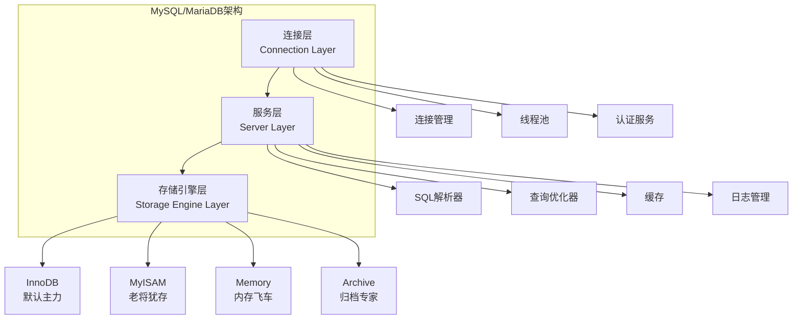
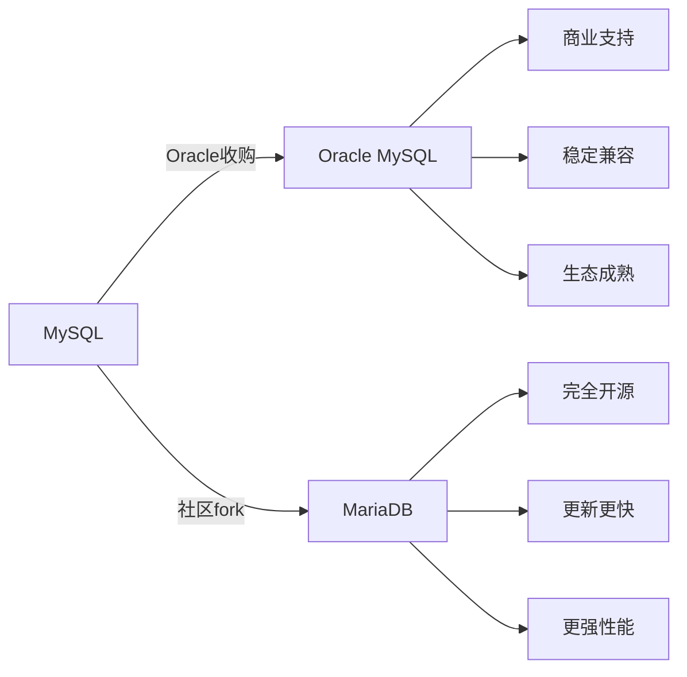
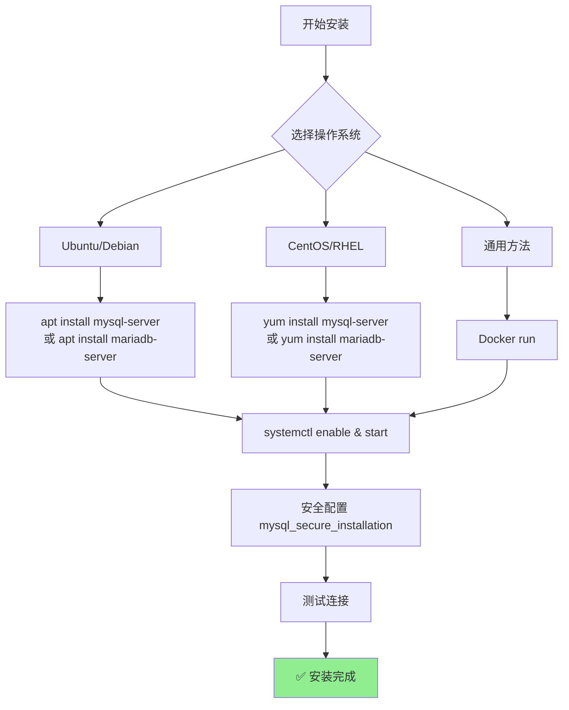
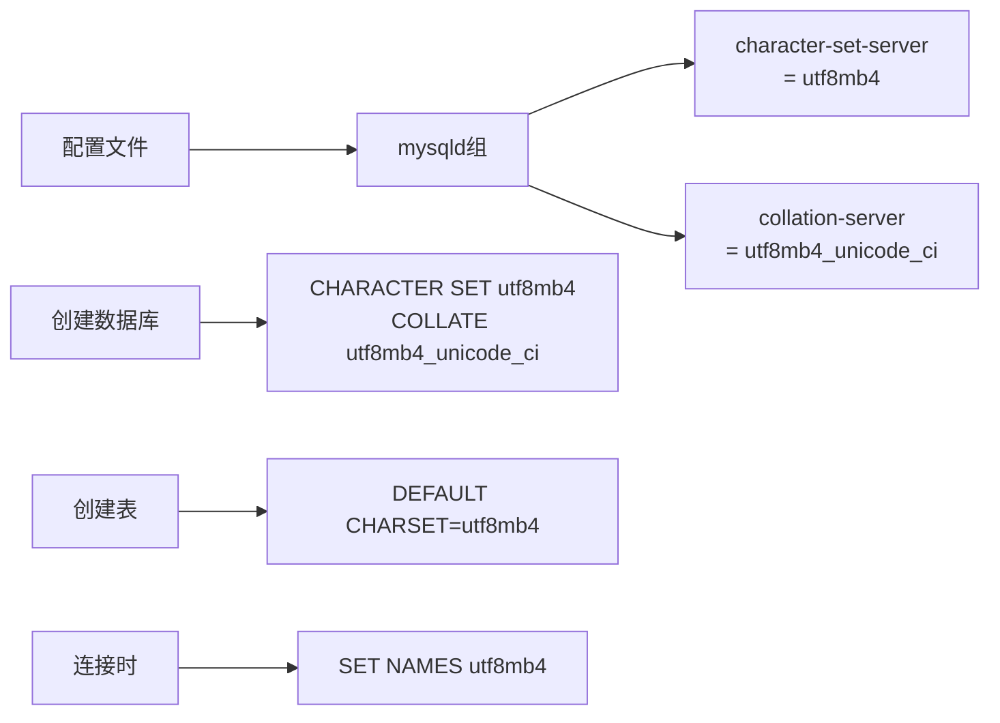
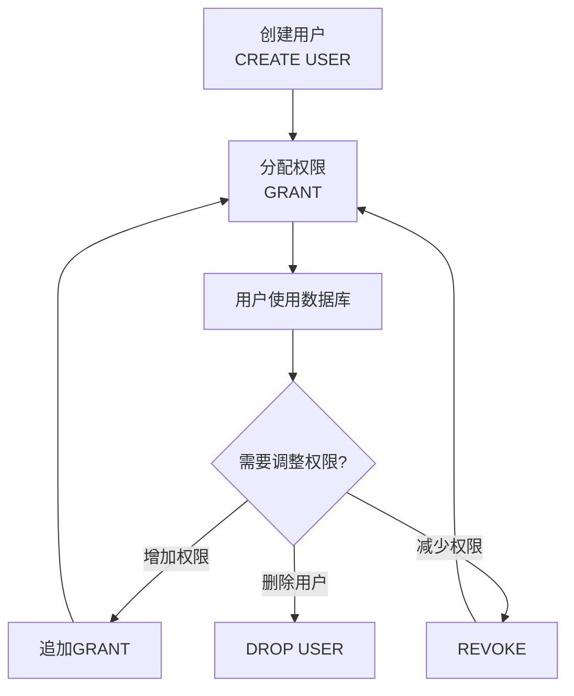
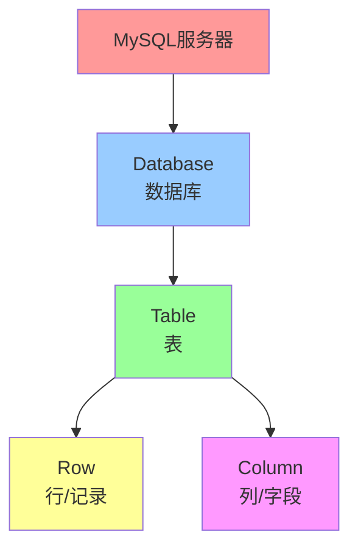
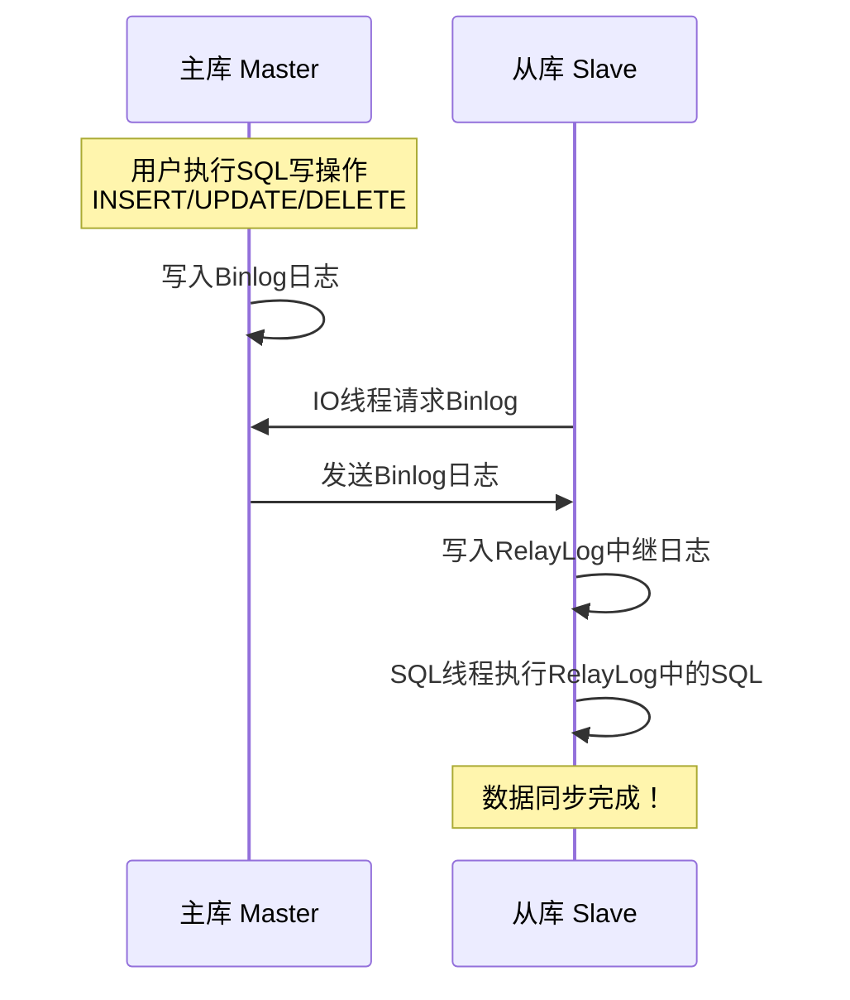

+++
title = "第44章：MySQL/MariaDB"
weight = 440
date = "2026-03-24T13:18:28+08:00"
type = "docs"
description = ""
isCJKLanguage = true
draft = false
+++


# 第四十四章：MySQL/MariaDB

## 44.1 MySQL/MariaDB 简介

### MySQL——开源数据库的"扛把子"

**MySQL**，江湖人称"闷声发大财"的典型代表。

它有多厉害？
- 全球使用量排名第一的开源数据库
- Facebook、Twitter、YouTube、阿里巴巴、微信...全在用
- "LAMP黄金搭档"的C位成员（Linux + Apache + MySQL + PHP）
- 无数创业公司的第一选择

MySQL的故事，要从1995年说起...

### MySQL的诞生史

1995年，瑞典的两个大神——Michael "Monty" Widenius 和 David Axmark，创建了MySQL。

Monty是个传奇人物，他在芬兰长大，后来跑到瑞典创业。他创建的MySQL AB公司，最初只有一个目标：**做一个又快又小的SQL数据库**。

当时的商业数据库（比如Oracle、DB2）都贵得要命，动辄几十万美金。MySQL的出现，就像数据库界的"价格屠夫"，瞬间引爆市场！

### MySQL的"变形记"

MySQL的发展历程，堪称一部"变形记"：

```
1995年：MySQL 1.0诞生
    ↓
2001年：MySQL 3.23，性能大幅提升，开始火起来
    ↓
2004年：MySQL 4.1，引入子查询和R-tree空间索引
    ↓
2005年：MySQL 5.0，存储过程、触发器、视图全来了
    ↓
2008年：Sun公司10亿美元收购MySQL AB
    ↓
2010年：Oracle收购Sun，MySQL落入Oracle手中
    ↓
社区分裂：MariaDB正式诞生！
```

### MariaDB——MySQL的"完美替身"

2010年，Oracle收购Sun之后，开源社区慌了：

> "Oracle会不会把MySQL往死里整？"
> "会不会突然收费？"
> "代码会不会闭源？"

Monty一咬牙，脚一跺，决定：
> **"老子自己干！"**

于是，Monty fork了MySQL 5.5的代码，创造了**MariaDB**。为什么叫MariaDB？因为Monty的小女儿叫Maria（这是程序员给女儿最好的礼物啊！）

**MariaDB和MySQL的关系：**
- MariaDB是MySQL的**分支**（fork）
- 代码高度兼容，API几乎一模一样
- MariaDB是**100%开源**的
- 很多Linux发行版默认使用MariaDB（比如Ubuntu 16.04+）

### MySQL/MariaDB的核心架构



### 存储引擎——MySQL的"变速箱"

MySQL最厉害的地方，就是支持**多种存储引擎**。你可以把它想象成汽车的不同档位——同样是开车，但可以选择省油的、提速快的、还是爬坡强的。

不同的引擎，适合不同的场景：

| 引擎 | 特点 | 适用场景 | 支持事务 |
|------|------|----------|----------|
| **InnoDB** | 默认主力，支持行锁、外键、MVCC | 高并发、事务需求 | ✅ |
| **MyISAM** | 老将，查询快，不支持事务 | 只读场景、表数据 | ❌ |
| **Memory** | 数据存内存，速度飞快 | 临时表、缓存 | ❌ |
| **Archive** | 压缩存储，占用空间小 | 日志归档 | ❌ |
| **NDB** | 集群专用 | 高可用集群 | ✅ |

**InnoDB vs MyISAM** 就像 **自动挡 vs 手动挡**：
- InnoDB（自动挡）：新手友好，功能齐全，出了问题还能自动恢复
- MyISAM（手动挡）：老司机专属，速度快，但一旦出事（断电）可能丢数据

**InnoDB vs MyISAM：**

| 对比项 | InnoDB | MyISAM |
|--------|--------|--------|
| 事务支持 | ✅ | ❌ |
| 外键支持 | ✅ | ❌ |
| 行锁 | ✅ | ❌ |
| 全文索引 | 5.6+支持 | ✅ |
| 崩溃恢复 | 自动恢复 | 需要手动 |
| 存储空间 | 较大 | 较小 |

### MySQL vs MariaDB——该选谁？

**选MySQL的场景：**
- 公司技术栈偏向Oracle/商业方案
- 需要官方企业级支持
- 依赖某些MySQL特有功能
- Docker镜像生态更成熟

**选MariaDB的场景：**
- 追求100%开源
- 需要更快的性能和新特性
- Ubuntu/Debian用户（系统自带）
- 不想被Oracle"卡脖子"

**好消息是**：两者基本可以无缝切换，语法兼容度超过99%！

### 一图总结



### 小结

MySQL/MariaDB是开源世界最流行的关系型数据库，它们：
- 体积小、速度快、成本低
- 支持多种存储引擎，InnoDB是主流
- 生态成熟，文档丰富
- 互联网公司的标配

下一节我们将学习如何安装MySQL/MariaDB，开始动手实践！

## 44.2 MySQL/MariaDB 安装

### 44.2.1 apt install mysql-server

#### Ubuntu/Debian 安装 MySQL

**第一步：更新软件源**

```bash
# 先更新一下软件包列表
sudo apt update

# 看看能不能找到mysql-server
apt search mysql-server
```

**第二步：一键安装**

```bash
# 安装MySQL服务器和客户端
sudo apt install mysql-server -y

# 安装完成后，MySQL服务应该已经自动启动了
# 检查一下状态
sudo systemctl status mysql
```

执行后应该看到类似输出：
```
● mysql.service - MySQL Community Server
     Loaded: loaded (/lib/systemd/system/mysql.service; enabled; vendor preset: enabled)
     Active: active (running) since Tue 2024-01-01 00:00:00 CST; 1min 30s ago
       Docs: man:mysqld(8)
       http://dev.mysql.com/doc/refman/en/index.html
   Main PID: 1234 (mysqld)
     Status: "Server is operational"
```

**第三步：安全配置**

```bash
# 运行安全加固脚本
sudo mysql_secure_installation
```

这个脚本会问你几个问题：

```
# 是否启用密码验证插件？（生产环境建议启用）
VALIDATE PASSWORD component? [Y/n] n

# 设置root密码（生产环境一定要设强密码！）
New password: 
Confirm password: 

# 是否删除匿名用户？建议删除
Remove anonymous users? [Y/n] Y

# 是否禁止root远程登录？建议禁止
Disallow root login remotely? [Y/n] Y

# 是否删除test数据库？建议删除
Remove test database and access to it? [Y/n] Y

# 是否重新加载权限表？必须选Y
Reload privilege tables now? [Y/n] Y
```

**第四步：登录测试**

```bash
# 本地登录（会提示输入密码）
mysql -u root -p

# 登录成功后，应该看到MySQL的欢迎界面：
# Welcome to the MySQL monitor.  Commands end with ; or \g.
# Your MySQL connection id is 8
# Server version: 8.0.35 MySQL Community Server - GPL
```

退出MySQL：
```sql
exit
-- 或者
\q
```

#### CentOS/RHEL 安装 MySQL

```bash
# 添加MySQL Yum仓库
sudo yum install https://dev.mysql.com/get/mysql80-community-release-el8-7.noarch.rpm

# 安装MySQL
sudo dnf install mysql-community-server -y

# 启动服务
sudo systemctl start mysqld
sudo systemctl enable mysqld

# MySQL 8.0安装时会生成临时密码，在日志里找
sudo grep 'temporary password' /var/log/mysqld.log
```

### 44.2.2 apt install mariadb-server

#### Ubuntu/Debian 安装 MariaDB

MariaDB在Ubuntu和Debian上是MySQL的**默认替代品**，安装更简单！

**第一步：安装**

```bash
# 更新软件源
sudo apt update

# 安装MariaDB服务器和客户端
sudo apt install mariadb-server mariadb-client -y
```

**第二步：检查服务状态**

```bash
# 查看MariaDB服务状态
sudo systemctl status mariadb
```

输出类似：
```
● mariadb.service - MariaDB 10.6.12 database server
     Loaded: loaded (/lib/systemd/system/mariadb.service; enabled; vendor preset: enabled)
     Active: active (running) since Tue 2024-01-01 00:00:00 CST; 5s ago
       Docs: man:mariadbd(1)
   Main PID: 5678 (mariadbd)
       Status: "Taking your SQL requests..."
```

**第三步：安全配置**

```bash
# 运行安全脚本（MariaDB的安全配置比MySQL更简洁）
sudo mysql_secure_installation
```

交互式问答：

```
# 设置root密码（如果是全新安装，这一步会跳过，直接回车即可）
Switch to unix_socket authentication [Y/n] n

# 设置MySQL root密码
New password: 
Confirm new password: 

# 其他安全设置一路Y
Remove anonymous users? [Y] Y
Disallow root login remotely? [Y] Y
Remove test database and access to it? [Y] Y
Reload privilege tables now? [Y] Y
```

**第四步：登录测试**

```bash
# 在Ubuntu上，MariaDB默认可以使用unix_socket认证
# 也就是直接用系统账号登录，不需要密码
sudo mysql

# 或者用密码登录（如果设置了的话）
mysql -u root -p
```

#### CentOS/RHEL 安装 MariaDB

```bash
# CentOS 7/8 默认源里有MariaDB
sudo yum install mariadb-server mariadb -y

# 启动并设置开机启动
sudo systemctl start mariadb
sudo systemctl enable mariadb

# 安全配置
sudo mysql_secure_installation
```

#### Docker 安装 MySQL/MariaDB（通用方法）

不想在主机上装来装去？Docker让你5分钟搞定！

**安装Docker（如果还没装）**

```bash
# Ubuntu
curl -fsSL https://get.docker.com | sh
sudo usermod -aG docker $USER

# 启动Docker
sudo systemctl start docker
sudo systemctl enable docker
```

**用Docker运行MySQL**

```bash
# 拉取MySQL镜像
docker pull mysql:8.0

# 运行MySQL容器
docker run -d \
    --name mysql-server \
    -p 3306:3306 \
    -e MYSQL_ROOT_PASSWORD=MySecurePassword123 \
    -v mysql-data:/var/lib/mysql \
    mysql:8.0

# 查看运行状态
docker ps
```

**用Docker运行MariaDB**

```bash
# 拉取MariaDB镜像
docker pull mariadb:10.11

# 运行MariaDB容器
docker run -d \
    --name mariadb-server \
    -p 3307:3306 \
    -e MARIADB_ROOT_PASSWORD=MySecurePassword123 \
    -v mariadb-data:/var/lib/mysql \
    mariadb:10.11

# 查看运行状态
docker ps
```

**连接MySQL容器**

```bash
# 进入容器
docker exec -it mysql-server mysql -u root -p

# 或者用docker exec直接执行SQL
docker exec -it mysql-server mysql -u root -pMySecurePassword123 -e "SHOW DATABASES;"
```

### 安装后必做清单

无论你用哪种方式安装，以下几步必须做：

```bash
# 1. 检查版本
mysql --version
# mysql  Ver 8.0.35 for Linux on x86_64 (MySQL Community Server - GPL)

mariadb --version
# mariadb  Ver 15.1 Distrib 10.6.12-MariaDB, for debian-linux-gnu (x86_64)

# 2. 检查服务是否运行
sudo systemctl status mysql  # 或 mariadb

# 3. 检查端口是否监听
sudo ss -tlnp | grep 3306
# LISTEN  0  151  127.0.0.1:3306  0.0.0.0:*  users:(("mysqld",pid=1234,fd=21))

# 4. 测试连接
mysql -u root -p
```

### 一图总结安装流程



### 常见问题排查

| 问题 | 原因 | 解决方法 |
|------|------|----------|
| 连接被拒绝 | 端口没开/防火墙 | `sudo ufw allow 3306` |
| 密码错误 | 忘了密码 | 重置密码或重新安装 |
| 服务启动失败 | 端口被占用 | `lsof -i:3306` 查看 |
| 无法远程连接 | bind-address配置 | 修改为 `0.0.0.0` |
| Docker容器退出了 | 配置错误 | `docker logs mysql-server` |

### 小结

安装MySQL/MariaDB的方法：
- **Ubuntu/Debian**：`apt install mysql-server` 或 `apt install mariadb-server`
- **CentOS/RHEL**：`yum install mysql-community-server` 或 `yum install mariadb-server`
- **Docker**：一行命令搞定，随用随删

下一节我们将学习MySQL/MariaDB的基础配置，让数据库更安全、更高效！

## 44.3 基础配置

### 44.3.1 /etc/mysql/mariadb.conf.d/

#### 配置文件在哪儿？

MySQL和MariaDB的配置文件位置不同，但思路一致：

**MySQL 8.0 配置文件位置：**
```bash
# 主配置文件
/etc/mysql/mysql.conf.d/mysqld.cnf

# 额外配置目录（放自定义配置）
/etc/mysql/conf.d/
```

**MariaDB 配置文件位置：**
```bash
# 主配置文件
/etc/mysql/mariadb.conf.d/50-server.cnf

# 额外配置目录
/etc/mysql/mariadb.conf.d/
```

#### 认识主配置文件

> **注意**：配置文件路径因发行版而异！
> - Ubuntu/Debian: `/etc/mysql/mysql.conf.d/mysqld.cnf`
> - CentOS/RHEL: `/etc/my.cnf` 或 `/etc/mysql/my.cnf`

用 `cat` 或 `less` 查看配置文件内容：

```bash
# Ubuntu/Debian 系统查看 MySQL 主配置
sudo cat /etc/mysql/mysql.conf.d/mysqld.cnf

# CentOS/RHEL 系统查看 MySQL 主配置
sudo cat /etc/my.cnf
```

典型配置内容：

```bash
# MySQL服务进程配置
[mysqld]
#
# 基础设置
#
pid-file    = /var/run/mysqld/mysqld.pid
socket      = /var/run/mysqld/mysqld.sock
# 数据目录，重要！记录你的数据存在哪儿
datadir     = /var/lib/mysql
# 日志文件目录
log-error   = /var/log/mysql/error.log
# PID文件目录
!includedir /etc/mysql/conf.d/
```

```bash
# 查看MariaDB主配置
sudo cat /etc/mysql/mariadb.conf.d/50-server.cnf
```

典型配置：

```bash
# MariaDB服务进程配置
[mysqld]
#
# 基础设置
#
pid-file    = /var/run/mysqld/mysqld.pid
socket      = /var/run/mysqld/mysqld.sock
# 数据目录
datadir     = /var/lib/mysql
# 字符集设置
character-set-server = utf8mb4
collation-server = utf8mb4_unicode_ci
```

#### 配置文件的结构

MySQL/MariaDB的配置文件使用 **INI格式**，方括号 `[]` 里面的是**组名**：

```bash
[client]           # 客户端配置
port        = 3306
socket      = /var/run/mysqld/mysqld.sock

[mysqld]           # 服务器端配置
port        = 3306
datadir     = /var/lib/mysql
max_connections = 151

[mysql]            # mysql命令行客户端配置
default-character-set = utf8mb4
```

#### 常用配置项详解

```bash
# 服务端配置
[mysqld]

# 端口号，默认3306（生产环境建议改成别的）
port = 3306

# 数据存放目录（重要！磁盘空间要够大）
datadir = /var/lib/mysql

# PID文件位置
pid-file = /var/run/mysqld/mysqld.pid

# Socket文件位置（本地连接用）
socket = /var/run/mysqld/mysqld.sock

# 最大连接数（根据服务器配置调整）
# 小水管服务器：100-200
# 中等服务器：200-500
# 大型服务器：500-1000+
max_connections = 200

# 查询缓存大小（MySQL 8.0已移除，MariaDB还在用）
# query_cache_size = 128M

# 线程池大小（通常设为CPU核心数的2-4倍）
thread_cache_size = 8

# 表缓存大小
table_open_cache = 2000

# 日志文件路径
log_error = /var/log/mysql/error.log

# 慢查询日志（超过这个时间的SQL会被记录）
slow_query_log = 1
slow_query_log_file = /var/log/mysql/slow.log
long_query_time = 2  # 超过2秒算慢查询

# 二进制日志（用于主从复制和数据恢复）
log_bin = /var/log/mysql/mysql-bin.log
expire_logs_days = 7  # 日志保留7天
max_binlog_size = 100M
```

#### 为什么要修改配置？

**默认配置是"万金油"**，什么场景都能跑，但什么都不极致。

生产环境调优主要是：
- 增加 `max_connections`：连接数不够会报 "Too many connections"
- 调整 `table_open_cache`：表多的话要加大
- 开启 `slow_query_log`：找出慢SQL优化性能
- 设置 `log_bin`：开启主从复制和数据恢复

#### 修改配置的正确姿势

```bash
# 1. 先备份原配置
sudo cp /etc/mysql/mariadb.conf.d/50-server.cnf /etc/mysql/mariadb.conf.d/50-server.cnf.bak

# 2. 用nano或vim编辑
sudo nano /etc/mysql/mariadb.conf.d/50-server.cnf

# 3. 修改后，检查语法
sudo mysqld --validate-config
# 如果输出 "Safely checked" 就没有语法错误

# 4. 重启服务使配置生效
sudo systemctl restart mariadb  # 或 mysql
```

### 44.3.2 字符集配置

#### 字符集是什么？

**字符集（Character Set）** 就是一套编码规则，告诉计算机"abc"和"你好"应该怎么存储。

如果字符集配置不对：
- 中文会变成乱码："你好" → "浣犲ソ"
- Emoji直接消失："😂" → ""
- 数据库迁移时数据丢失

**MySQL/MariaDB支持的字符集：**

| 字符集 | 说明 | 存储一个字符需要 |
|--------|------|------------------|
| `latin1` | 拉丁语系，不支持中文 | 1字节 |
| `utf8` | MySQL老版本，只支持3字节UTF-8 | 3字节 |
| `utf8mb4` | **推荐！**完整UTF-8，支持Emoji和所有Unicode | 4字节 |
| `utf16` | UTF-16编码 | 2或4字节 |

#### 为什么推荐 utf8mb4？

- `utf8` 在MySQL里是"伪UTF-8"，不支持 `😂` 这种4字节的字符
- `utf8mb4` 才是真正的UTF-8，支持所有Unicode字符，包括 Emoji、生僻字
- 现代应用（微信、微博、抖音）到处都是Emoji，不用 `utf8mb4` 你就等着被用户投诉吧！

#### 配置字符集

**方法一：修改服务器配置（推荐）**

```bash
sudo nano /etc/mysql/mariadb.conf.d/50-server.cnf
```

在 `[mysqld]` 部分添加：

```bash
[mysqld]
#
# 字符集配置 - 强烈建议使用utf8mb4
#
# 服务器默认字符集
character-set-server = utf8mb4
collation-server = utf8mb4_unicode_ci

# 连接字符集
init_connect = 'SET NAMES utf8mb4'

# 跳过-name解析加速（可选）
# skip-name-resolve
```

**方法二：在MySQL会话中设置**

```sql
-- 查看当前字符集配置
SHOW VARIABLES LIKE 'character%';
SHOW VARIABLES LIKE 'collation%';

-- 设置会话字符集
SET NAMES utf8mb4;

-- 设置全局字符集（需要权限）
SET GLOBAL character_set_server = utf8mb4;
SET GLOBAL collation_server = utf8mb4_unicode_ci;
```

#### 验证字符集配置

```sql
-- 创建测试数据库，验证字符集
CREATE DATABASE test_db CHARACTER SET utf8mb4 COLLATE utf8mb4_unicode_ci;

-- 查看数据库字符集
SHOW CREATE DATABASE test_db;

-- 创建测试表
USE test_db;
CREATE TABLE users (
    id INT AUTO_INCREMENT PRIMARY KEY,
    name VARCHAR(50),
    bio TEXT
) ENGINE=InnoDB DEFAULT CHARSET=utf8mb4;

-- 插入带Emoji的数据测试
INSERT INTO users (name, bio) VALUES 
    ('小明', '今天心情😄，终于写完代码了！'),
    ('小红', '收到老板的消息📧，又要加班了💔'),
    ('前端小哥', '修复了一个🪲，测试说还有3个🪲');

-- 查询验证
SELECT * FROM users;

-- 查看建表语句，确认字符集
SHOW CREATE TABLE users;
```

执行结果应该看到正常的Emoji，而不是乱码！

#### 字符集配置检查清单

```bash
# 1. 检查配置文件
grep -E "(character|collation)" /etc/mysql/mariadb.conf.d/50-server.cnf

# 2. 检查MySQL服务配置
mysql -u root -p -e "SHOW VARIABLES LIKE 'character_set%';"

# 3. 检查数据库默认字符集
mysql -u root -p -e "SHOW VARIABLES LIKE 'collation%';"

# 4. 测试中文存储
mysql -u root -p -e "CREATE DATABASE IF NOT EXISTS test_charset; USE test_charset; CREATE TABLE t (c VARCHAR(100)); INSERT INTO t VALUES ('测试中文和Emoji🎉'); SELECT * FROM t;"
```

#### 一图总结字符集配置



### 小结

配置MySQL/MariaDB要注意：
- 配置文件在 `/etc/mysql/mariadb.conf.d/` 或 `/etc/mysql/mysql.conf.d/`
- 常用配置项：`max_connections`、`character-set-server`、`slow_query_log`、`log_bin`
- **强烈推荐使用 `utf8mb4` 字符集**，支持Emoji和所有Unicode字符
- 修改配置后要验证语法，重启服务

下一节我们将学习用户与权限管理，这是数据库安全的重中之重！

## 44.4 用户与权限管理

> "权力越大，责任越大。" —— 蜘蛛侠
> 
> "权限越多，危险越大。" —— 数据库管理员

### 用户与权限的核心概念

MySQL/MariaDB的权限系统有三层结构：

```mermaid
flowchart TB
    A[MySQL权限系统] --> B[用户账户<br/>who are you?]
    A --> C[权限<br/>what can you do?]
    A --> D[数据库对象<br/>on what?]
    
    B --> B1[用户名@主机名]
    C --> C1[SELECT]
    C --> C2[INSERT]
    C --> C3[UPDATE]
    C --> C4[DELETE]
    C --> C5[ALL PRIVILEGES]
    
    D --> D1[数据库.表]
```

**用户名的格式：** `用户名@主机`

- `'root'@'localhost'` - 只能从本机连接
- `'app'@'192.168.1.%'` - 从IP段连接
- `'app'@'%'` - 从任意主机连接（不推荐！）

### 44.4.1 CREATE USER - 创建用户

#### 基本语法

```sql
CREATE USER '用户名'@'主机' IDENTIFIED BY '密码';
```

#### 创建用户的各种场景

**场景1：创建普通应用用户**

```sql
-- 创建一个只能从本地连接的应用用户
CREATE USER 'app_user'@'localhost' IDENTIFIED BY 'AppPass2024!';
```

**场景2：创建远程连接用户**

```sql
-- 创建一个可以从局域网任何机器连接的用户
CREATE USER 'app_user'@'192.168.1.%' IDENTIFIED BY 'AppPass2024!';

-- 或者允许从任何主机连接（生产环境慎用！）
CREATE USER 'app_user'@'%' IDENTIFIED BY 'AppPass2024!';
```

**场景3：创建密码永不过期用户（MySQL 8.0+）**

```sql
-- 创建用户，密码永不过期
CREATE USER 'dev_user'@'localhost' IDENTIFIED BY 'DevPass2024!';
ALTER USER 'dev_user'@'localhost' PASSWORD EXPIRE NEVER;
```

**场景4：创建带限制的用户**

```sql
-- 创建用户，限制最大连接数为10
CREATE USER 'limited_user'@'localhost' IDENTIFIED BY 'LimitPass2024!'
WITH MAX_CONNECTIONS_PER_HOUR 10;
```

**场景5：创建只读用户**

```sql
-- 创建只读用户（后续会讲如何授权）
CREATE USER 'readonly_user'@'%' IDENTIFIED BY 'ReadOnly2024!';
```

#### 查看用户

```sql
-- 查看所有用户（MySQL用户信息在mysql.user表）
SELECT user, host, plugin FROM mysql.user;

-- 查看更详细的信息
SELECT 
    user, 
    host, 
    authentication_string, 
    plugin,
    account_locked,
    password_expired
FROM mysql.user;
```

执行结果类似：

```
+---------------+-----------+-----------------------+-------------+---------------+------------------+
| user          | host      | authentication_string | plugin      | account_locked | password_expired |
+---------------+-----------+-----------------------+-------------+---------------+------------------+
| root          | localhost |                       | unix_socket | N             | N                |
| mysql.session | localhost | *THISISNOTAVALIDPASS..| mysql_native | Y             | N                |
| mysql.sys     | localhost | *THISISNOTAVALIDPASS..| mysql_native | Y             | N                |
| app_user      | localhost | *XXXXXXXXXXXXXXXXXXXX | mysql_native | N             | N                |
+---------------+-----------+-----------------------+-------------+---------------+------------------+
```

### 44.4.2 GRANT - 授权

#### 基本语法

```sql
GRANT 权限 ON 数据库.表 TO '用户名'@'主机';
```

#### 常用权限一览

| 权限 | 说明 | 适用场景 |
|------|------|----------|
| `ALL PRIVILEGES` | 所有权限（除了GRANT OPTION） | DBA |
| `SELECT` | 查询数据 | 报表用户、只读用户 |
| `INSERT` | 插入数据 | 数据录入账号 |
| `UPDATE` | 更新数据 | 数据修改账号 |
| `DELETE` | 删除数据 | 慎用！单独授权 |
| `CREATE` | 创建表/数据库 | 应用账号 |
| `DROP` | 删除表/数据库 | 极少授权 |
| `ALTER` | 修改表结构 | 应用账号 |
| `INDEX` | 创建/删除索引 | 应用账号 |
| `REFERENCES` | 外键权限 | 一般不给 |
| `CREATE TEMPORARY TABLES` | 创建临时表 | 导出报表 |
| `LOCK TABLES` | 锁表权限 | 备份账号 |
| `EXECUTE` | 执行存储过程 | 应用账号 |
| `REPLICATION SLAVE` | 主从复制 | 从服务器 |
| `RELOAD` | 执行FLUSH操作 | DBA |

#### 授权场景实战

**场景1：给应用最小权限**

```sql
-- 应用需要连接数据库，查询、插入、更新、删除表数据
-- 但不能修改表结构、不能删除表
GRANT SELECT, INSERT, UPDATE, DELETE 
ON myapp.* 
TO 'app_user'@'localhost';
```

**场景2：给开发人员读写权限**

```sql
-- 开发人员需要读写所有业务数据库，但不能管理用户
GRANT SELECT, INSERT, UPDATE, DELETE, CREATE, ALTER, INDEX
ON myapp.* 
TO 'dev_user'@'192.168.1.%';
```

**场景3：给DBA全部权限**

```sql
-- DBA需要管理一切，但不能给其他DBA授权（安全考虑）
GRANT ALL PRIVILEGES 
ON *.* 
TO 'dba_admin'@'localhost'
WITH GRANT OPTION;
```

**场景4：给报表用户只读权限**

```sql
-- 报表系统只能读取，不能写入
GRANT SELECT 
ON analytics_db.* 
TO 'report_user'@'%';
```

**场景5：给备份账号特殊权限**

```sql
-- 备份账号需要锁表、查看定义，但不能读数据内容
GRANT SELECT, LOCK TABLES, SHOW VIEW, EVENT, TRIGGER
ON myapp.* 
TO 'backup_user'@'localhost';
```

**场景6：跨库授权（需要分别授权）**

```sql
-- MySQL不支持一次授权多个数据库，需要分别执行
GRANT SELECT, INSERT, UPDATE, DELETE ON db1.* TO 'multi_db_user'@'%';
GRANT SELECT, INSERT, UPDATE, DELETE ON db2.* TO 'multi_db_user'@'%';
GRANT SELECT, INSERT, UPDATE, DELETE ON db3.* TO 'multi_db_user'@'%';
```

#### 创建用户+授权一条搞定

```sql
-- 如果用户不存在，可以直接用GRANT创建（MySQL特性）
-- 同时创建用户并授权
GRANT SELECT, INSERT, UPDATE, DELETE 
ON myapp.* 
TO 'new_app_user'@'%' 
IDENTIFIED BY 'NewUserPass2024!';
```

### 44.4.3 REVOKE - 回收权限

#### 基本语法

```sql
REVOKE 权限 ON 数据库.表 FROM '用户名'@'主机';
```

#### 回收权限实战

**场景1：收回用户的DELETE权限**

```sql
-- 发现DELETE权限被滥用，先收回来
REVOKE DELETE 
ON myapp.* 
FROM 'app_user'@'localhost';
```

**场景2：收回用户的所有权限**

```sql
-- 用户要离职了，回收所有权限
REVOKE ALL PRIVILEGES, GRANT OPTION 
FROM 'leaving_employee'@'%';
```

**场景3：只保留SELECT权限（降级为只读）**

```sql
-- 用户滥用权限，先降级为只读
REVOKE SELECT, INSERT, UPDATE, DELETE 
ON myapp.* 
FROM 'troublesome_user'@'%';

GRANT SELECT 
ON myapp.* 
TO 'troublesome_user'@'%';
```

### 44.4.4 DROP USER - 删除用户

#### 基本语法

```sql
DROP USER '用户名'@'主机';
```

#### 删除用户实战

**场景1：删除一个用户**

```sql
-- 用户已离职，删除账号
DROP USER 'former_employee'@'%';
```

**场景2：删除多个用户**

```sql
-- 批量删除测试账号
DROP USER 'test_user1'@'localhost', 
           'test_user2'@'localhost', 
           'temp_user'@'%';
```

**场景3：删除后检查**

```sql
-- 确认用户已删除
SELECT user, host FROM mysql.user WHERE user = 'former_employee';
-- 结果应该是空集
```

### 权限管理完整流程



### 重要安全建议

> **安全第一！最小权限原则！**

```sql
-- ❌ 错误示范：root用户给外部应用使用
GRANT ALL PRIVILEGES ON *.* TO 'root'@'%' IDENTIFIED BY 'password';

-- ❌ 错误示范：密码太简单
CREATE USER 'app'@'%' IDENTIFIED BY '123456';

-- ❌ 错误示范：允许任意主机连接
CREATE USER 'app'@'%' IDENTIFIED BY 'password';

-- ✅ 正确示范：最小权限 + 强密码 + 指定主机
CREATE USER 'app'@'192.168.1.100' IDENTIFIED BY 'AppStr0ngP@ssw0rd!';
GRANT SELECT, INSERT, UPDATE, DELETE ON myapp.* TO 'app'@'192.168.1.100';
```

### 修改用户密码

```sql
-- 方法1：用ALTER USER改自己的密码
ALTER USER 'username'@'host' IDENTIFIED BY 'NewPassword123!';

-- 方法2：用SET改密码
SET PASSWORD FOR 'username'@'host' = 'NewPassword123!';

-- 方法3：用UPDATE直接修改（需要FLUSH PRIVILEGES）
UPDATE mysql.user SET authentication_string = PASSWORD('NewPassword123!') 
WHERE user = 'username' AND host = 'host';
FLUSH PRIVILEGES;
```

### 查看用户权限

```sql
-- 查看当前用户权限
SHOW GRANTS;

-- 查看指定用户权限
SHOW GRANTS FOR 'username'@'host';

-- 查看权限的另一种方式（MySQL 8.0+）
SHOW PRIVILEGES;
```

### 刷新权限

```sql
-- 修改用户表后需要刷新权限
FLUSH PRIVILEGES;

-- 这两个命令也可以reload权限
FLUSH TABLES;
FLUSH STATUS;
```

### 小结

用户权限管理的核心命令：

| 命令 | 作用 |
|------|------|
| `CREATE USER` | 创建用户 |
| `GRANT` | 授予权限 |
| `REVOKE` | 回收权限 |
| `DROP USER` | 删除用户 |
| `ALTER USER` | 修改用户 |
| `FLUSH PRIVILEGES` | 刷新权限 |

**安全原则：**
- 最小权限原则：只给必要的权限
- 强密码策略：包含大小写字母、数字、特殊字符
- 限制来源：尽量用具体IP，不用 `%`
- 定期审计：检查有哪些用户和权限

下一节我们将学习数据库的基本操作，创建和管理数据库！

## 44.5 数据库操作

### 数据库基础概念

在MySQL的世界里，数据的层次结构是这样的：



简单理解：
- **数据库** = 文件夹（用来组织表）
- **表** = Excel表格（用来存储数据）
- **行** = 表格中的一行记录
- **列** = 表格中的一列属性

### 44.5.1 CREATE DATABASE - 创建数据库

#### 基本语法

```sql
CREATE DATABASE 数据库名;
```

#### 创建数据库实战

**场景1：创建最基本的数据库**

```sql
-- 创建一个叫 myapp 的数据库
CREATE DATABASE myapp;
```

**场景2：创建时指定字符集（强烈推荐！）**

```sql
-- 指定utf8mb4字符集
CREATE DATABASE myapp CHARACTER SET utf8mb4 COLLATE utf8mb4_unicode_ci;
```

**场景3：创建数据库（如果不存在才创建）**

```sql
-- 防止重复创建报错
CREATE DATABASE IF NOT EXISTS myapp;
```

**场景4：创建指定位置的数据库（高级）**

```sql
-- 在指定路径创建数据库（需要先创建目录）
CREATE DATABASE myapp 
DATA DIRECTORY '/mnt/fast-disk/myapp/';
```

#### 创建数据库时的参数说明

| 参数 | 说明 | 推荐值 |
|------|------|--------|
| `CHARACTER SET` | 字符集 | `utf8mb4` |
| `COLLATE` | 排序规则 | `utf8mb4_unicode_ci` |
| `DATA DIRECTORY` | 数据存放路径 | 自定义 |

**排序规则（COLLATE）的作用：**
- `utf8mb4_unicode_ci`：基于Unicode标准排序，支持多语言
- `utf8mb4_general_ci`：通用排序，速度快（MySQL 5.7默认）
- `utf8mb4_0900_ai_ci`：MySQL 8.0新增，更好的Unicode支持

### 44.5.2 SHOW DATABASES - 查看数据库

#### 基本语法

```sql
SHOW DATABASES;
```

#### 查看数据库实战

```sql
-- 查看所有数据库
SHOW DATABASES;
```

执行结果：

```
+--------------------+
| Database           |
+--------------------+
| information_schema |  -- MySQL内部系统数据库
| mysql              |  -- MySQL用户和权限信息
| performance_schema |  -- 性能监控数据
| sys                |  -- 系统库，用于诊断
| myapp              |  -- 我们刚创建的库
+--------------------+
```

**系统数据库说明：**

| 数据库 | 用途 | 能否删除 |
|--------|------|----------|
| `information_schema` | 存储MySQL元数据（表信息、列信息等） | ❌ 系统必需 |
| `mysql` | 存储用户账号、权限等 | ❌ 系统必需 |
| `performance_schema` | 性能监控和诊断 | ❌ 系统必需 |
| `sys` | 系统库，提供诊断视图 | ❌ 系统必需 |
| 自定义数据库 | 你的业务数据 | ✅ 可以 |

#### 条件查询数据库

```sql
-- 模糊匹配查找数据库
SHOW DATABASES LIKE '%app%';

-- 查找以 my 开头的数据库
SHOW DATABASES LIKE 'my%';
```

### 44.5.3 USE 数据库 - 选择数据库

#### 基本语法

```sql
USE 数据库名;
```

#### 使用数据库实战

```sql
-- 选择要操作的数据库
USE myapp;

-- 选择后，后续所有操作都在这个数据库中进行
-- 直到执行 USE 切换到其他数据库
```

#### 查看当前使用的数据库

```sql
-- 方法1：SELECT查询
SELECT DATABASE();

-- 方法2：查看连接状态
STATUS;

-- 方法3：查看当前数据库
SELECT @current_db;
```

执行结果：

```
+------------+
| DATABASE() |
+------------+
| myapp      |
+------------+
```

### 数据库操作的完整流程


### 完整的数据库管理示例

```sql
-- 1. 查看当前有哪些数据库
SHOW DATABASES;

-- 2. 创建一个新数据库（指定字符集）
CREATE DATABASE IF NOT EXISTS shop 
CHARACTER SET utf8mb4 
COLLATE utf8mb4_unicode_ci;

-- 3. 选择这个数据库
USE shop;

-- 4. 在数据库中创建表（下一节会详细讲）
CREATE TABLE products (
    id INT AUTO_INCREMENT PRIMARY KEY,
    name VARCHAR(100) NOT NULL,
    price DECIMAL(10, 2) NOT NULL
);

-- 5. 查看当前数据库中的表
SHOW TABLES;

-- 6. 查看建表语句
SHOW CREATE TABLE products;

-- 7. 切换回myapp数据库
USE myapp;

-- 8. 确认当前数据库
SELECT DATABASE();
```

### 删除数据库

```sql
-- 删除数据库（危险操作！会删除所有表和数据！）
DROP DATABASE myapp;

-- 安全删除（只删除已存在的数据库）
DROP DATABASE IF EXISTS myapp;
```

> **警告！** 删除数据库会删除所有表和数据，**不可恢复**！删除前请务必三思而后行，最好先备份！

### 修改数据库

```sql
-- 修改数据库的字符集
ALTER DATABASE shop CHARACTER SET utf8mb4 COLLATE utf8mb4_unicode_ci;

-- 注意：MySQL不允许直接修改数据库名
-- 如果要改名，需要导出数据，重建数据库，再导入
```

### 小结

数据库操作三板斧：

| 命令 | 说明 |
|------|------|
| `CREATE DATABASE` | 创建数据库，记得加 `utf8mb4` |
| `SHOW DATABASES` | 查看所有数据库 |
| `USE database` | 选择要操作的数据库 |
| `DROP DATABASE` | 删除数据库（危险！别乱用！） |

**创建数据库的标准写法：**

```sql
CREATE DATABASE IF NOT EXISTS 数据库名 
CHARACTER SET utf8mb4 
COLLATE utf8mb4_unicode_ci;
```

下一节我们将学习表操作，这是数据库最核心的部分！

## 44.6 表操作

表（Table）是关系型数据库的核心概念。你可以把它想象成一个Excel表格：

| 列1（ID） | 列2（姓名） | 列3（年龄） |
|-----------|-------------|-------------|
| 1 | 小明 | 25 |
| 2 | 小红 | 23 |
| 3 | 小刚 | 28 |

### 44.6.1 CREATE TABLE - 创建表

#### 基本语法

```sql
CREATE TABLE 表名 (
    列名1 数据类型 [约束],
    列名2 数据类型 [约束],
    ...
    [表级约束]
);
```

#### 数据类型一览

| 类型 | 说明 | 示例 |
|------|------|------|
| `INT` | 整数 | 1, 100, -5 |
| `BIGINT` | 大整数 | 9223372036854775807 |
| `FLOAT` | 单精度浮点 | 3.14 |
| `DOUBLE` | 双精度浮点 | 3.1415926535 |
| `DECIMAL(p,s)` | 定点数（精确） | DECIMAL(10,2) |
| `VARCHAR(n)` | 可变字符串 | 'Hello' |
| `CHAR(n)` | 固定长度字符串 | 'Hi  ' (补空格) |
| `TEXT` | 长文本 | 文章内容 |
| `DATE` | 日期 | '2024-01-01' |
| `DATETIME` | 日期时间 | '2024-01-01 12:30:00' |
| `TIMESTAMP` | 时间戳 | 1704067200 |
| `BOOLEAN` | 布尔值 | TRUE/FALSE |
| `JSON` | JSON数据 | '{"key": "value"}' |

#### 创建表实战

**场景1：创建用户表**

```sql
USE myapp;

CREATE TABLE users (
    -- 主键：唯一标识每行，自动增长
    id INT AUTO_INCREMENT PRIMARY KEY,
    
    -- 用户名：可变字符串，最多50字符，非空
    username VARCHAR(50) NOT NULL,
    
    -- 邮箱：可变字符串，最多100字符，唯一
    email VARCHAR(100) NOT NULL UNIQUE,
    
    -- 密码：哈希存储，固定长度64字符（SHA256）
    password_hash CHAR(64) NOT NULL,
    
    -- 年龄：整数，可空
    age INT,
    
    -- 性别：枚举类型，只能是'M'或'F'
    gender ENUM('M', 'F') DEFAULT 'M',
    
    -- 个人简介：长文本，可空
    bio TEXT,
    
    -- 创建时间：自动记录当前时间
    created_at TIMESTAMP DEFAULT CURRENT_TIMESTAMP,
    
    -- 更新时间：自动更新
    updated_at TIMESTAMP DEFAULT CURRENT_TIMESTAMP ON UPDATE CURRENT_TIMESTAMP
);
```

**场景2：创建商品表**

```sql
CREATE TABLE products (
    id INT AUTO_INCREMENT PRIMARY KEY,
    
    -- 商品名称，必填
    name VARCHAR(200) NOT NULL,
    
    -- 价格，最多10位数字，其中2位小数（精准计算金钱）
    price DECIMAL(10, 2) NOT NULL,
    
    -- 库存数量，整数
    stock INT DEFAULT 0,
    
    -- 分类ID，关联分类表
    category_id INT,
    
    -- 商品描述，长文本
    description TEXT,
    
    -- 是否上架，布尔值
    is_active BOOLEAN DEFAULT TRUE,
    
    -- 创建时间
    created_at DATETIME DEFAULT CURRENT_TIMESTAMP
);
```

**场景3：创建带外键的订单表**

```sql
CREATE TABLE orders (
    id INT AUTO_INCREMENT PRIMARY KEY,
    
    -- 订单号，唯一字符串
    order_no VARCHAR(32) NOT NULL UNIQUE,
    
    -- 用户ID，外键关联users表
    user_id INT NOT NULL,
    FOREIGN KEY (user_id) REFERENCES users(id),
    
    -- 订单总金额
    total_amount DECIMAL(10, 2) NOT NULL,
    
    -- 订单状态
    status ENUM('pending', 'paid', 'shipped', 'delivered', 'cancelled') DEFAULT 'pending',
    
    -- 创建时间
    created_at DATETIME DEFAULT CURRENT_TIMESTAMP
);
```

**场景4：创建带索引的表**

```sql
CREATE TABLE articles (
    id INT AUTO_INCREMENT PRIMARY KEY,
    
    title VARCHAR(200) NOT NULL,
    
    content TEXT,
    
    author_id INT,
    
    -- 手动添加索引
    INDEX idx_author (author_id),
    
    -- 复合索引（多列组合索引）
    INDEX idx_title_content (title(50), content(100)),
    
    -- 全文索引（用于文章搜索）
    FULLTEXT INDEX ft_content (content),
    
    created_at DATETIME DEFAULT CURRENT_TIMESTAMP
);
```

#### 约束类型

| 约束 | 说明 | 语法 |
|------|------|------|
| `PRIMARY KEY` | 主键，唯一标识 | `id INT PRIMARY KEY` |
| `NOT NULL` | 非空约束 | `name VARCHAR(50) NOT NULL` |
| `UNIQUE` | 唯一约束 | `email VARCHAR(100) UNIQUE` |
| `DEFAULT` | 默认值 | `status INT DEFAULT 1` |
| `CHECK` | 检查约束 | `age INT CHECK (age > 0)` |
| `FOREIGN KEY` | 外键约束 | `FOREIGN KEY (uid) REFERENCES users(id)` |
| `AUTO_INCREMENT` | 自动增长 | `id INT AUTO_INCREMENT` |

### 44.6.2 ALTER TABLE - 修改表结构

#### 基本语法

```sql
ALTER TABLE 表名 操作;
```

#### 修改表结构实战

**场景1：添加新列**

```sql
-- 给users表添加手机号字段
ALTER TABLE users 
ADD COLUMN phone VARCHAR(20) AFTER email;
```

**场景2：删除列**

```sql
-- 删除users表的bio字段
ALTER TABLE users 
DROP COLUMN bio;
```

**场景3：修改列**

```sql
-- 把users表的username长度改大
ALTER TABLE users 
MODIFY COLUMN username VARCHAR(100) NOT NULL;
```

**场景4：重命名列**

```sql
-- 把phone改名为mobile
ALTER TABLE users 
CHANGE COLUMN phone mobile VARCHAR(20);
```

**场景5：添加索引**

```sql
-- 给email字段添加唯一索引
ALTER TABLE users 
ADD UNIQUE INDEX idx_email (email);
```

**场景6：修改表名**

```sql
-- 把users表改名为app_users
ALTER TABLE users 
RENAME TO app_users;
```

### 44.6.3 DROP TABLE - 删除表

#### 基本语法

```sql
DROP TABLE 表名;
```

#### 删除表实战

```sql
-- 删除一个表（危险！会删除数据和结构！）
DROP TABLE orders;

-- 安全删除（只删除已存在的表）
DROP TABLE IF EXISTS orders;

-- 一次性删除多个表
DROP TABLE IF EXISTS order_items, order_logs, order_history;
```

> **警告！** 删除表会删除所有数据，**不可恢复**！删除前请务必备份！

### 查看表信息

```sql
-- 查看当前数据库所有表
SHOW TABLES;

-- 查看表结构（desc = describe）
DESC users;
-- 或
DESCRIBE users;

-- 查看建表语句
SHOW CREATE TABLE users;

-- 查看表的所有列
SHOW COLUMNS FROM users;

-- 查看表的状态
SHOW TABLE STATUS LIKE 'users';
```

### 小结

表操作三板斧：

| 命令 | 说明 |
|------|------|
| `CREATE TABLE` | 创建表 |
| `ALTER TABLE` | 修改表结构 |
| `DROP TABLE` | 删除表（危险！） |

**创建表的标准写法：**

```sql
CREATE TABLE 表名 (
    id INT AUTO_INCREMENT PRIMARY KEY,
    字段1 类型 NOT NULL,
    字段2 类型 DEFAULT 默认值,
    ...
);
```

下一节我们将学习SQL基础，增删改查四兄弟！

## 44.7 SQL 基础

SQL（Structured Query Language）是操作数据库的"普通话"。无论你用的是MySQL、PostgreSQL还是Oracle，SQL语法基本通用！

增删改查，CRUD，就是这么朴实无华！

### 44.7.1 SELECT 查询

#### 基本语法

```sql
SELECT 列名 FROM 表名 WHERE 条件 ORDER BY 列名 LIMIT n;
```

#### 查询实战

**场景1：查询所有数据**

```sql
-- 查询users表所有记录的所有列
SELECT * FROM users;

-- 查询users表所有记录的指定列
SELECT id, username, email FROM users;
```

**场景2：条件查询**

```sql
-- 查询年龄大于18的用户
SELECT * FROM users WHERE age > 18;

-- 查询状态为'active'的用户
SELECT * FROM users WHERE status = 'active';

-- 组合条件：年龄大于18且状态为active
SELECT * FROM users WHERE age > 18 AND status = 'active';

-- 或条件：年龄小于20或大于50
SELECT * FROM users WHERE age < 20 OR age > 50;
```

**场景3：模糊查询**

```sql
-- 查询用户名以'张'开头的用户
SELECT * FROM users WHERE username LIKE '张%';

-- 查询邮箱包含'gmail'的用户
SELECT * FROM users WHERE email LIKE '%gmail%';

-- 下划线_匹配单个字符
SELECT * FROM users WHERE username LIKE '张_';
```

**场景4：排序**

```sql
-- 按年龄升序排列（从小到大）
SELECT * FROM users ORDER BY age ASC;

-- 按年龄降序排列（从大到小）
SELECT * FROM users ORDER BY age DESC;

-- 先按年龄降序，年龄相同则按用户名升序
SELECT * FROM users ORDER BY age DESC, username ASC;
```

**场景5：分页查询**

```sql
-- 查询第1-10条记录
SELECT * FROM users LIMIT 10;

-- 查询第11-20条记录（OFFSET跳过前10条）
SELECT * FROM users LIMIT 10 OFFSET 10;

-- 简写形式：查询第11-20条
SELECT * FROM users LIMIT 10, 10;

-- 查询年龄最大的前5个用户
SELECT * FROM users ORDER BY age DESC LIMIT 5;
```

**场景6：聚合查询**

```sql
-- 统计用户总数
SELECT COUNT(*) FROM users;

-- 统计年龄大于18的用户数
SELECT COUNT(*) FROM users WHERE age > 18;

-- 计算平均年龄
SELECT AVG(age) FROM users;

-- 计算最大年龄和最小年龄
SELECT MAX(age), MIN(age) FROM users;

-- 按性别分组统计
SELECT gender, COUNT(*) as cnt FROM users GROUP BY gender;

-- 分组后筛选（只显示数量大于10的组）
SELECT gender, COUNT(*) as cnt 
FROM users 
GROUP BY gender 
HAVING cnt > 10;
```

**场景7：多表连接查询**

```sql
-- 内连接：查询订单和对应的用户信息
SELECT 
    orders.id,
    orders.order_no,
    orders.total_amount,
    users.username,
    users.email
FROM orders
INNER JOIN users ON orders.user_id = users.id;

-- 左连接：查询所有用户，包括没有订单的用户
SELECT 
    users.username,
    orders.order_no,
    orders.total_amount
FROM users
LEFT JOIN orders ON users.id = orders.user_id;
```

### 44.7.2 INSERT 插入

#### 基本语法

```sql
INSERT INTO 表名 (列1, 列2, ...) VALUES (值1, 值2, ...);
```

#### 插入实战

**场景1：插入单条数据**

```sql
-- 指定列插入
INSERT INTO users (username, email, password_hash, age) 
VALUES ('xiaoming', 'xiaoming@example.com', 'hash123', 25);

-- 所有列插入（省略列名，但顺序必须与表结构完全一致）
INSERT INTO users 
VALUES (NULL, 'xiaoming', 'xiaoming@example.com', 'hash123', 25, 'M', NULL, NOW(), NOW());

-- 注意：VALUES顺序必须匹配：id, username, email, password_hash, age, gender, bio, created_at, updated_at
```

**场景2：批量插入**

```sql
-- 一次插入多条数据
INSERT INTO users (username, email, password_hash, age) VALUES 
    ('user1', 'user1@example.com', 'hash1', 20),
    ('user2', 'user2@example.com', 'hash2', 22),
    ('user3', 'user3@example.com', 'hash3', 24),
    ('user4', 'user4@example.com', 'hash4', 26);
```

**场景3：插入查询结果**

```sql
-- 从旧表复制数据到新表
INSERT INTO users_backup (username, email, age)
SELECT username, email, age FROM users WHERE created_at > '2024-01-01';
```

### 44.7.3 UPDATE 更新

#### 基本语法

```sql
UPDATE 表名 SET 列1 = 值1, 列2 = 值2 WHERE 条件;
```

#### 更新实战

**场景1：更新单条数据**

```sql
-- 更新用户ID=1的年龄
UPDATE users SET age = 26 WHERE id = 1;

-- 同时更新多个字段
UPDATE users SET age = 26, status = 'active' WHERE id = 1;
```

**场景2：批量更新**

```sql
-- 把所有年龄小于18的用户状态改为'inactive'
UPDATE users SET status = 'inactive' WHERE age < 18;

-- 把所有用户的年龄加1
UPDATE users SET age = age + 1;

-- 把所有没有邮箱的用户设置默认邮箱
UPDATE users SET email = 'no-email@example.com' WHERE email IS NULL;
```

> **警告！** UPDATE语句的WHERE条件很重要，没有WHERE会更新所有行！

```sql
-- ❌ 错误示范：忘了WHERE，更新了所有用户的密码
UPDATE users SET password_hash = 'hacked123';

-- ✅ 正确做法：先SELECT确认，再UPDATE
SELECT * FROM users WHERE id = 1;  -- 先确认
UPDATE users SET password_hash = 'new_hash' WHERE id = 1;  -- 再更新
```

### 44.7.4 DELETE 删除

#### 基本语法

```sql
DELETE FROM 表名 WHERE 条件;
```

#### 删除实战

**场景1：删除单条数据**

```sql
-- 删除用户ID=1的记录
DELETE FROM users WHERE id = 1;
```

**场景2：批量删除**

```sql
-- 删除所有年龄大于100的用户（数据有问题）
DELETE FROM users WHERE age > 100;

-- 删除所有状态为'deleted'的用户
DELETE FROM users WHERE status = 'deleted';
```

> **警告！** DELETE语句的WHERE条件同样重要，没有WHERE会删除所有行！

```sql
-- ❌ 错误示范：忘了WHERE，删了整张表
DELETE FROM users;

-- ✅ 正确做法：删除前先备份或确认
DELETE FROM users WHERE id IN (1, 2, 3);
```

### CRUD完整示例

```sql
-- ==================== C - Create 创建 ====================

-- 创建用户
INSERT INTO users (username, email, password_hash, age) 
VALUES ('xiaoming', 'xiaoming@example.com', SHA2('password123', 256), 25);

-- ==================== R - Read 读取 ====================

-- 查询所有用户
SELECT * FROM users;

-- 查询年龄大于18的用户
SELECT username, email FROM users WHERE age > 18 ORDER BY age DESC;

-- ==================== U - Update 更新 ====================

-- 更新用户信息
UPDATE users SET age = 26, status = 'active' WHERE username = 'xiaoming';

-- ==================== D - Delete 删除 ====================

-- 删除用户
DELETE FROM users WHERE username = 'xiaoming';
```

### 小结

SQL增删改查四兄弟：

| 操作 | 关键字 | 危险程度 |
|------|--------|----------|
| 查 | `SELECT` | ⭐ 安全，只读 |
| 增 | `INSERT` | ⭐⭐ 谨慎 |
| 改 | `UPDATE` | ⭐⭐⭐ 注意WHERE |
| 删 | `DELETE` | ⭐⭐⭐⭐ 非常危险 |

**安全原则：**
- `UPDATE` 和 `DELETE` 前必加 `WHERE`
- 重要数据先 `SELECT` 确认再操作
- 生产环境执行前先备份

下一节我们将学习索引与优化，这是提升数据库性能的关键！

## 44.8 索引与优化

### 索引的概念

**索引（Index）** 是什么？打个比方：

- 没有索引的表 = 没有目录的书，想找某页只能一页一页翻
- 有索引的表 = 有目录的书，想找某个内容看目录就行

索引会占用额外的磁盘空间，但能**大幅提升查询速度**（尤其是大数据量时）。

### 44.8.1 CREATE INDEX - 创建索引

#### 基本语法

```sql
-- 创建普通索引
CREATE INDEX 索引名 ON 表名 (列名);

-- 创建唯一索引（索引值必须唯一）
CREATE UNIQUE INDEX 索引名 ON 表名 (列名);

-- 创建复合索引（多列组合）
CREATE INDEX 索引名 ON 表名 (列1, 列2, 列3);
```

#### 创建索引实战

**场景1：给常用查询字段加索引**

```sql
-- 给users表的email字段加索引（登录时经常用邮箱查询）
CREATE INDEX idx_email ON users(email);

-- 给orders表的user_id加索引（关联查询）
CREATE INDEX idx_user_id ON orders(user_id);

-- 给orders表的created_at加索引（按时间查询）
CREATE INDEX idx_created_at ON orders(created_at);
```

**场景2：创建复合索引**

```sql
-- 创建一个复合索引，用于查询"某用户在某时间段的订单"
CREATE INDEX idx_user_date ON orders(user_id, created_at);

-- 这样的查询可以利用索引：
SELECT * FROM orders WHERE user_id = 1 AND created_at BETWEEN '2024-01-01' AND '2024-12-31';
```

**场景3：创建唯一索引**

```sql
-- 给email加唯一索引，防止重复注册
CREATE UNIQUE INDEX idx_unique_email ON users(email);

-- 给订单号加唯一索引，防止重复订单
CREATE UNIQUE INDEX idx_unique_order_no ON orders(order_no);
```

**场景4：创建全文索引**

```sql
-- 给文章标题和内容加全文索引（用于搜索引擎）
CREATE FULLTEXT INDEX ft_article ON articles(title, content);

-- 使用全文索引查询
SELECT * FROM articles WHERE MATCH(title, content) AGAINST('关键词');
```

#### 在创建表时添加索引

```sql
CREATE TABLE products (
    id INT AUTO_INCREMENT PRIMARY KEY,
    name VARCHAR(200) NOT NULL,
    price DECIMAL(10, 2),
    
    -- 创建时直接加索引
    INDEX idx_name (name),
    UNIQUE INDEX idx_unique_name (name)
);
```

#### 查看和删除索引

```sql
-- 查看表的所有索引
SHOW INDEX FROM users;

-- 删除索引
DROP INDEX idx_email ON users;

-- 或用ALTER TABLE删除
ALTER TABLE users DROP INDEX idx_email;
```

### 44.8.2 索引类型：B+树

#### MySQL索引的数据结构

MySQL（InnoDB）的索引使用 **B+树** 数据结构。

**B+树的特点：**
- 所有数据都在叶子节点
- 叶子节点之间用链表连接（范围查询快）
- 树高低，查询次数少（IO次数少）

```
                    [根节点]
                        │
            ┌───────────┼───────────┐
            │           │           │
        [页1]       [页2]       [页3]    [内部节点]
            │           │           │
        ┌───┴───┐   ┌───┴───┐   ┌───┴───┐
        │       │   │       │   │       │
    [叶1]   [叶2]   [叶3]   [叶4]   [叶5]  [叶子节点，用链表连接]
```

#### 什么字段适合建索引？

| 适合建索引 | 不适合建索引 |
|-----------|-------------|
| WHERE 条件常用的字段 | 区分度低的字段（如性别只有男女） |
| ORDER BY 排序的字段 | 数据量很小的表 |
| JOIN 连接的字段 | 频繁更新的字段 |
| SELECT 要查询的字段 | 主键（自动有索引） |

#### 索引使用技巧

```sql
-- ✅ 好的写法：使用索引
SELECT * FROM users WHERE email = 'test@example.com';

-- ❌ 差的写法：索引失效
SELECT * FROM users WHERE email LIKE '%test%';  -- 前缀模糊查询无法使用索引

-- ✅ 好的写法：前缀模糊查询可以（需要建立前缀索引）
SELECT * FROM users WHERE email LIKE 'test%';

-- ❌ 差的写法：在索引列上使用函数，索引失效
SELECT * FROM users WHERE YEAR(created_at) = 2024;

-- ✅ 好的写法：避免在索引列上使用函数
SELECT * FROM users WHERE created_at >= '2024-01-01' AND created_at < '2025-01-01';
```

### 小结

索引是提升查询性能的利器：
- `CREATE INDEX` 创建索引
- `UNIQUE INDEX` 创建唯一索引
- 复合索引要注意字段顺序
- 索引不是越多越好，太多会影响写入性能
- MySQL使用B+树作为索引结构

下一节我们将学习数据备份，这是DBA最重要的工作！

## 44.9 mysqldump 备份

> "数据不备份，等于裸奔！"

备份是数据库管理员最重要的职责之一。没有备份的数据库，就像没系安全带的过山车——出事就是大事！

### 44.9.1 mysqldump 备份命令

#### 基本语法

```bash
mysqldump -u 用户名 -p 数据库名 > 备份文件.sql
```

#### 备份实战

**场景1：备份单个数据库**

```bash
# 备份myapp数据库到文件
mysqldump -u root -p myapp > /backup/myapp_backup_20240101.sql

# 备份时输入密码（不推荐，密码会显示在history）
mysqldump -u root -pMyPassword myapp > /backup/myapp_backup.sql
```

**场景2：备份多个数据库**

```bash
# 备份多个数据库
mysqldump -u root -p --databases myapp shop blog > /backup/multi_db_backup.sql
```

**场景3：备份所有数据库**

```bash
# 备份所有数据库（包括系统数据库）
mysqldump -u root -p --all-databases > /backup/all_databases_backup.sql
```

**场景4：只备份表结构（不备份数据）**

```bash
# 只备份建表语句，用于快速部署新环境
mysqldump -u root -p --no-data myapp > /backup/myapp_structure.sql
```

**场景5：只备份数据（不备份结构）**

```bash
# 只备份数据，用于数据迁移
mysqldump -u root -p --no-create-info myapp > /backup/myapp_data.sql
```

**场景6：压缩备份（节省空间）**

```bash
# 备份并压缩
mysqldump -u root -p myapp | gzip > /backup/myapp_backup.sql.gz

# 解压恢复
gunzip < /backup/myapp_backup.sql.gz | mysql -u root -p
```

**场景7：定时自动备份脚本**

```bash
#!/bin/bash
# backup.sh - MySQL自动备份脚本

# 配置
DB_USER="root"
DB_PASS="YourPassword"
DB_NAME="myapp"
BACKUP_DIR="/backup/mysql"
DATE=$(date +%Y%m%d_%H%M%S)

# 创建备份目录（如果不存在）
mkdir -p $BACKUP_DIR

# 执行备份
mysqldump -u $DB_USER -p$DB_PASS $DB_NAME | gzip > $BACKUP_DIR/${DB_NAME}_${DATE}.sql.gz

# 删除7天前的备份
find $BACKUP_DIR -name "*.sql.gz" -mtime +7 -delete

# 输出备份信息
echo "备份完成: ${DB_NAME}_${DATE}.sql.gz"
```

```bash
# 给脚本添加执行权限
chmod +x /backup/backup.sh

# 将脚本加入crontab，每天凌晨3点执行
crontab -e
# 添加行：
# 0 3 * * * /backup/backup.sh
```

#### 备份结果查看

```bash
# 查看备份文件内容（前100行）
head -100 /backup/myapp_backup.sql
```

备份文件内容示例：

```sql
-- MySQL dump 10.13  Distrib 8.0.35, for Linux (x86_64)
--
-- Host: localhost    Database: myapp
-- ------------------------------------------------------
-- Server version	8.0.35

/*!40101 SET @OLD_CHARACTER_SET_CLIENT=@@CHARACTER_SET_CLIENT */;
/*!40101 SET @OLD_CHARACTER_SET_RESULTS=@@CHARACTER_SET_RESULTS */;
/*!50503 SET NAMES utf8mb4 */;

--
-- Table structure for table `users`
--

DROP TABLE IF EXISTS `users`;
/*!40101 SET @saved_cs_client     = @@character_set_client */;
/*!50503 SET character_set_client = utf8mb4 */;
CREATE TABLE `users` (
  `id` int NOT NULL AUTO_INCREMENT,
  `username` varchar(50) NOT NULL,
  `email` varchar(100) NOT NULL,
  `password_hash` char(64) NOT NULL,
  `age` int DEFAULT NULL,
  `created_at` timestamp NOT NULL DEFAULT CURRENT_TIMESTAMP,
  PRIMARY KEY (`id`),
  UNIQUE KEY `idx_unique_email` (`email`)
) ENGINE=InnoDB AUTO_INCREMENT=2 DEFAULT CHARSET=utf8mb4;

--
-- Dumping data for table `users`
--

INSERT INTO `users` VALUES (1,'xiaoming','xiaoming@example.com','hash123',25,'2024-01-01 00:00:00');
```

### 小结

mysqldump备份要点：
- `mysqldump -u -p 数据库 > 文件.sql` 基本语法
- `--all-databases` 备份所有数据库
- `--no-data` 只备份结构
- `| gzip` 压缩备份
- 定期备份 + 异地存储 = 数据安全

下一节我们将学习如何从备份恢复数据！

## 44.10 mysql 命令行恢复

备份的目的就是为了恢复！万一哪天手滑删了数据，或者服务器炸了，有了备份就能起死回生！

### 44.10.1 mysql 恢复命令

#### 基本语法

```bash
mysql -u 用户名 -p 数据库名 < 备份文件.sql
```

#### 恢复实战

**场景1：从备份文件恢复数据库**

```bash
# 恢复myapp数据库
mysql -u root -p myapp < /backup/myapp_backup_20240101.sql

# 输入密码后，数据就回来了
```

**场景2：恢复所有数据库**

```bash
# 如果备份的是所有数据库
mysql -u root -p < /backup/all_databases_backup.sql
```

**场景3：恢复压缩的备份**

```bash
# 解压并恢复
gunzip < /backup/myapp_backup.sql.gz | mysql -u root -p myapp

# 或者分两步
gunzip -c /backup/myapp_backup.sql.gz > /tmp/myapp_backup.sql
mysql -u root -p myapp < /tmp/myapp_backup.sql
```

**场景4：恢复时指定字符集**

```bash
# 确保恢复时使用正确的字符集
mysql -u root -p --default-character-set=utf8mb4 myapp < /backup/myapp_backup.sql
```

**场景5：source命令在MySQL客户端内恢复**

```sql
-- 先登录MySQL
mysql -u root -p

-- 选择数据库
USE myapp;

-- 使用source命令恢复
SOURCE /backup/myapp_backup_20240101.sql;

-- 查看恢复的数据
SELECT COUNT(*) FROM users;
```

### 完整备份恢复流程


### 增量备份与恢复（高级）

全量备份恢复太慢？试试增量备份！

**xtrabackup工具（推荐用于生产环境）：**

```bash
# 安装xtrabackup（需要添加Percona源）
# Ubuntu
apt install xtrabackup

# 全量备份
xtrabackup --backup --target-dir=/backup/full --user=root --password=xxx

# 增量备份（在全量备份之后）
xtrabackup --backup --target-dir=/backup/incr1 --incremental-basedir=/backup/full --user=root --password=xxx

# 恢复（先prepare全量，再apply增量）
xtrabackup --prepare --target-dir=/backup/full
xtrabackup --prepare --target-dir=/backup/full --incremental-dir=/backup/incr1
xtrabackup --copy-back --target-dir=/backup/full
```

### 小结

mysql恢复要点：
- `mysql -u -p 数据库 < 文件.sql` 基本语法
- 恢复时目标数据库需要存在
- `SOURCE` 命令可在MySQL客户端内使用
- 压缩备份用 `gunzip -c` 解压后导入
- 重要数据要定期备份，备份文件要异地存储

下一节我们将学习主从复制，这是数据库高可用的基础！

## 44.11 主从复制

### 主从复制的概念

**主从复制（Replication）** 是什么？

想象一下，你是公司老板（主库），你有几个分身（从库）：
- 你的分身和你一模一样（数据同步）
- 有人找你办事，你可以让他去找分身（读写分离）
- 你万一有个三长两短，分身还在（高可用）

这就是主从复制！


### 44.11.1 配置主服务器

#### 主服务器配置

**步骤1：修改主服务器配置文件**

```bash
sudo nano /etc/mysql/mariadb.conf.d/50-server.cnf
```

添加/修改以下配置：

```bash
[mysqld]
# 服务器唯一ID（必填，从库不能相同）
server-id = 1

# 开启二进制日志（必填，用于复制）
log_bin = /var/log/mysql/mysql-bin.log

# 只复制哪些数据库（可选）
# binlog-do-db = myapp

# 不复制哪些数据库（可选）
binlog-ignore-db = mysql
binlog-ignore-db = information_schema
binlog-ignore-db = performance_schema

# 日志格式（推荐MIXED或ROW）
binlog_format = MIXED

# 从服务器读取位置（过期日志自动删除，保留7天）
expire_logs_days = 7
```

**步骤2：重启MySQL服务**

```bash
sudo systemctl restart mariadb
```

**步骤3：创建复制账号**

```sql
-- 登录MySQL
mysql -u root -p

-- 创建专门用于复制的用户（从库用这个账号连接主库）
CREATE USER 'repl_user'@'%' IDENTIFIED BY 'ReplPass2024!';

-- 授予复制权限
GRANT REPLICATION SLAVE ON *.* TO 'repl_user'@'%';

-- 刷新权限
FLUSH PRIVILEGES;
```

**步骤4：查看主库状态**

```sql
-- 查看主库状态（记录File和Position，从库要用）
SHOW MASTER STATUS;
```

执行结果：

```
+---------------+----------+--------------+------------------+
| File          | Position | Binlog_Do_DB | Binlog_Ignore_DB |
+---------------+----------+--------------+------------------+
| mysql-bin.000003|     456 | myapp        | mysql,information_schema |
+---------------+----------+--------------+------------------+
```

### 44.11.2 配置从服务器

#### 从服务器配置

**步骤1：修改从服务器配置文件**

```bash
sudo nano /etc/mysql/mariadb.conf.d/50-server.cnf
```

添加/修改以下配置：

```bash
[mysqld]
# 服务器唯一ID（必填，不能和主库相同）
server-id = 2

# 开启中继日志（接收主库的Binlog）
relay_log = /var/log/mysql/mysql-relay-bin

# 只读模式（从库建议开启，防止意外写入）
read_only = ON

# 禁止超级权限用户读写（root用户也从只读）
# super_read_only = ON
```

**步骤2：重启从服务器**

```bash
sudo systemctl restart mariadb
```

**步骤3：连接主服务器**

```sql
-- 登录从库MySQL
mysql -u root -p

-- 停止从库复制线程
STOP SLAVE;

-- 配置复制连接参数（替换为你的实际值）
CHANGE MASTER TO
    MASTER_HOST = '192.168.1.100',    -- 主库IP地址
    MASTER_USER = 'repl_user',         -- 复制账号
    MASTER_PASSWORD = 'ReplPass2024!', -- 复制密码
    MASTER_PORT = 3306,               -- 主库端口
    MASTER_LOG_FILE = 'mysql-bin.000003',  -- 主库的File
    MASTER_LOG_POS = 456;             -- 主库的Position
```

**步骤4：启动复制**

```sql
-- 启动从库复制线程
START SLAVE;

-- 查看从库状态
SHOW SLAVE STATUS\G;
```

执行结果（关键字段）：

```
*************************** 1. row ***************************
               Slave_IO_State: Waiting for master to send event
                  Master_Host: 192.168.1.100
                  Master_User: repl_user
                  Master_Port: 3306
                Master_Log_File: mysql-bin.000003
            Read_Master_Log_Pos: 456
               Relay_Log_File: mysql-relay-bin.000002
                Relay_Log_Pos: 720
        Relay_Master_Log_File: mysql-bin.000003
             Slave_IO_Running: Yes        -- IO线程运行中
            Slave_SQL_Running: Yes        -- SQL线程运行中
              Last_IO_Error: 
             Last_SQL_Error: 
```

**检查点：**
- `Slave_IO_Running: Yes` ✅ IO线程正常
- `Slave_SQL_Running: Yes` ✅ SQL线程正常
- `Last_IO_Error: (空)` ✅ 没有错误

### 主从复制原理



### 小结

主从复制配置要点：
1. **主库配置**：`server-id`、`log_bin`、`创建repl_user`
2. **从库配置**：`server-id`、`relay_log`、`read_only`
3. **启动复制**：`CHANGE MASTER TO` + `START SLAVE`
4. **验证状态**：`SHOW SLAVE STATUS\G`

下一节我们将学习如何配置远程连接！

## 44.12 远程连接配置

### 远程连接的问题

默认情况下，MySQL只允许从本地连接（localhost）。如果你想从其他机器连接，需要配置！

### 44.12.1 bind-address

#### 问题原因

MySQL默认只监听本地连接：

```bash
# 查看3306端口监听情况
sudo ss -tlnp | grep 3306

# 默认情况：
# LISTEN 127.0.0.1:3306  -- 只监听本地
```

#### 解决方案

**方法1：修改bind-address**

```bash
sudo nano /etc/mysql/mariadb.conf.d/50-server.cnf
```

找到 `bind-address`，修改：

```bash
[mysqld]
# 只监听本地（默认）
# bind-address = 127.0.0.1

# 监听所有网卡（允许远程连接）
bind-address = 0.0.0.0

# 或者只监听指定IP
# bind-address = 192.168.1.100
```

重启服务：

```bash
sudo systemctl restart mariadb
```

验证：

```bash
sudo ss -tlnp | grep 3306
# 现在应该看到：
# LISTEN  0.0.0.0:3306  -- 监听所有网卡
```

**方法2：创建远程用户并授权**

```sql
-- 创建一个可以从任何IP登录的用户（生产环境建议限制IP）
CREATE USER 'remote_user'@'%' IDENTIFIED BY 'RemotePass2024!';

-- 授予适当权限
GRANT SELECT, INSERT, UPDATE, DELETE ON myapp.* TO 'remote_user'@'%';

-- 刷新权限
FLUSH PRIVILEGES;
```

**方法3：开放防火墙端口**

```bash
# Ubuntu/Debian (ufw)
sudo ufw allow 3306/tcp

# CentOS/RHEL (firewalld)
sudo firewall-cmd --permanent --add-port=3306/tcp
sudo firewall-cmd --reload

# 或者直接关闭防火墙（不推荐生产环境）
sudo systemctl stop firewalld
```

#### 远程连接测试

**从远程机器连接：**

```bash
# 使用MySQL客户端连接
mysql -h 192.168.1.100 -u remote_user -p

# 或者
mysql -h your-server-ip -u remote_user -p myapp
```

参数说明：
- `-h` : 服务器IP地址或主机名
- `-u` : 用户名
- `-p` : 提示输入密码
- 最后的 `myapp` : 要连接的数据库名

#### 安全建议

> 开放远程连接要慎重！安全第一！

**安全建议：**

```sql
-- ❌ 危险：允许任意IP连接
CREATE USER 'app'@'%' IDENTIFIED BY 'weak';

-- ✅ 安全：只允许特定IP段连接
CREATE USER 'app'@'192.168.1.%' IDENTIFIED BY 'Str0ngP@ss!';

-- ✅ 更安全：只允许特定IP连接
CREATE USER 'app'@'192.168.1.100' IDENTIFIED BY 'Str0ngP@ss!';
```

**额外安全措施：**

1. 使用SSL连接（MySQL 8.0+支持）
2. 配置防火墙，只允许特定IP访问3306
3. 使用跳板机/VPN访问数据库
4. 考虑使用SSH隧道连接

### 小结

远程连接配置三步走：
1. **修改bind-address**：`bind-address = 0.0.0.0`
2. **创建远程用户**：`CREATE USER 'user'@'%' ...`
3. **开放防火墙**：`ufw allow 3306/tcp`

---

## 本章小结

本章我们深入学习了MySQL/MariaDB，从安装到配置，从用户权限到SQL操作，从索引优化到备份恢复，从主从复制到远程连接。内容丰富，干货满满！

### 核心命令回顾

| 分类 | 命令 |
|------|------|
| **安装** | `apt install mysql-server` / `apt install mariadb-server` |
| **连接** | `mysql -u root -p` |
| **用户** | `CREATE USER` / `GRANT` / `REVOKE` / `DROP USER` |
| **数据库** | `CREATE DATABASE` / `SHOW DATABASES` / `USE` |
| **表** | `CREATE TABLE` / `ALTER TABLE` / `DROP TABLE` |
| **SQL** | `SELECT` / `INSERT` / `UPDATE` / `DELETE` |
| **索引** | `CREATE INDEX` |
| **备份** | `mysqldump -u -p db > file.sql` |
| **恢复** | `mysql -u -p db < file.sql` |
| **主从** | `CHANGE MASTER TO` / `START SLAVE` |
| **远程** | `bind-address = 0.0.0.0` |

### 关键概念回顾

1. **MySQL vs MariaDB**：MariaDB是MySQL的社区分支，高度兼容
2. **存储引擎**：InnoDB是主流，支持事务和行锁
3. **字符集**：强烈推荐 `utf8mb4`
4. **最小权限原则**：用户只给必要的权限
5. **索引**：加速查询，但不是越多越好
6. **备份重于一切**：定期备份，异地存储
7. **主从复制**：读写分离 + 高可用

### 配置示例

**字符集配置（/etc/mysql/mariadb.conf.d/50-server.cnf）：**

```bash
[mysqld]
character-set-server = utf8mb4
collation-server = utf8mb4_unicode_ci
```

**创建数据库标准写法：**

```sql
CREATE DATABASE IF NOT EXISTS myapp 
CHARACTER SET utf8mb4 
COLLATE utf8mb4_unicode_ci;
```

### 下章预告

下一章我们将学习 **PostgreSQL**，这是功能最强大的开源关系型数据库。PostgreSQL支持更多高级特性，如自定义数据类型、复杂的触发器、全文检索、地理信息系统等。敬请期待！

> **趣味彩蛋**：MySQL和MariaDB的关系，其实很像一个有趣的程序员故事：
> 
> Montyfork了MySQL，创造了MariaDB。Oracle收购了MySQL，却"意外"让MariaDB变得更流行。
> 
> 这告诉我们：有时候，"被抛弃"可能是最好的安排。
> 
> 记住：**数据库千万个，备份第一个，操作不规范，亲人两行泪！** 🔥


