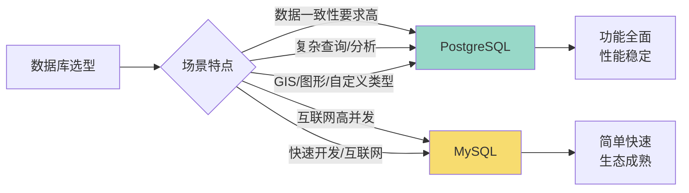
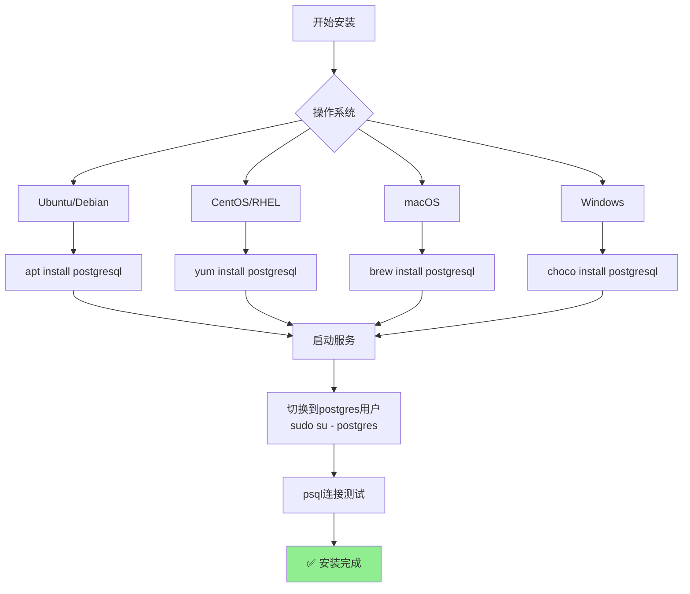
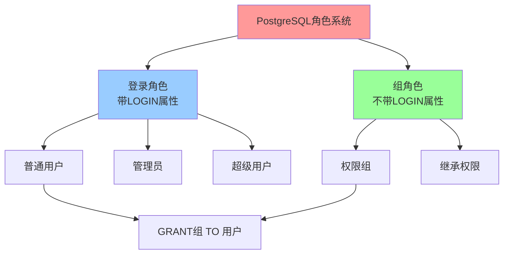
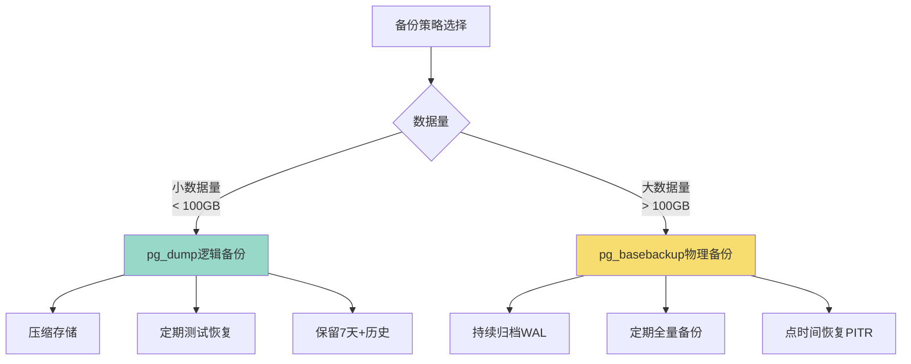
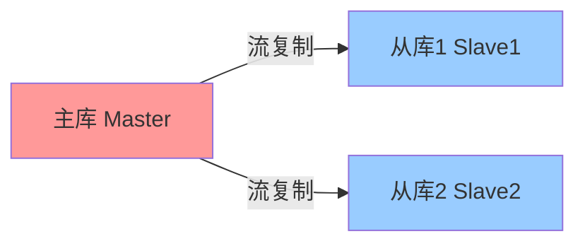

+++
title = "第45章：PostgreSQL"
weight = 450
date = "2026-03-24T13:18:28+08:00"
type = "docs"
description = ""
isCJKLanguage = true
draft = false
+++


# 第四十五章：PostgreSQL

## 45.1 PostgreSQL 简介

### PostgreSQL——"功能怪兽"来袭！

如果说MySQL是个**实用主义者**，那**PostgreSQL**就是一个**功能狂魔**。

它的口号是：
> **"The world's most advanced open source relational database"**
> （世界上最先进的开源关系型数据库）

这话真不是吹的！PostgreSQL的功能多到让人眼花缭乱，只有你想不到，没有它做不到！

### PostgreSQL的诞生史

**1986年**，IBM研究员Edgar Codd提出了关系型数据库理论，已经过去了17年。

这时候，加州大学伯克利分校的Michael Stonebraker教授（后来创办了Illustra公司）开始搞事情：

```
1986年：Postgres项目启动
    ↓
1994年：Postgres95发布（加入SQL支持）
    ↓
1996年：PostgreSQL 6.0正式发布
    ↓
2005年：PostgreSQL 8.0开始支持Windows
    ↓
2010年：PostgreSQL 9.0引入流复制
    ↓
2018年：PostgreSQL 11 引入分区表改进
    ↓
2023年：PostgreSQL 16 发布
    ↓
持续更新中...
```

**为什么叫PostgreSQL？**

- "Post" = "after"（在...之后）
- "gres" = "Ingres"（前身数据库项目）
- 所以 "PostgreSQL" = "在Ingres之后的SQL"

现在很多人叫它 **"Postgres"**，这个名字更简洁！

### PostgreSQL vs MySQL——谁是天下第一？

这是一个程序员争论了几十年的问题！就像" Vim vs Emacs "、" tabs vs 空格"一样，永无止境...

| 对比项 | PostgreSQL | MySQL |
|--------|-----------|-------|
| **诞生时间** | 1986年 | 1995年 |
| **开发语言** | C | C/C++ |
| **协议** | PostgreSQL协议 | MySQL协议 |
| **SQL标准** | 几乎100%支持 | 部分支持 |
| **事务支持** | 完整ACID | InnoDB引擎支持 |
| **并发控制** | MVCC | MVCC + 表级锁 |
| **索引类型** | B-tree, Hash, GiST, GIN, BRIN... | B-tree, Hash, R-tree, FULLTEXT |
| **扩展性** | 非常强 | 一般 |
| **性能特点** | 复杂查询快 | 简单查询快 |
| **生态** | 相对小众 | 非常成熟 |

简单来说：
- **MySQL** 像是**瑞士军刀**——小巧精悍，互联网标配，出了问题好找解决方案
- **PostgreSQL** 像是**德国工业机床**——精密强大，什么都能做，但需要专业操作人员

选哪个？取决于你的需求和偏好。就像选女朋友——啊不，选技术栈，要选合适的，不是选最贵的！



### PostgreSQL的独门绝技

#### 1. 丰富的数据类型

MySQL："我支持常见的数据类型！"
PostgreSQL："我支持你支持的所有类型，加上这些："

```sql
-- PostgreSQL独有的数据类型

-- 数组类型 - 一列可以存多个值，不用另建表了！
CREATE TABLE students (
    name VARCHAR(50),
    scores INT[]  -- 数组类型，可以存多个分数
);

INSERT INTO students VALUES ('小明', ARRAY[85, 90, 78, 92]);

-- JSON/JSONB类型 - 想存什么就存什么，灵活度拉满
CREATE TABLE api_logs (
    data JSONB  -- 二进制JSON，查询更快，性能更好
);

INSERT INTO api_logs VALUES ('{"ip": "192.168.1.1", "status": 200}');

-- 范围类型 - 专门处理日期/数值范围，比如"这个房间1月1日到1月10日被预订了"
CREATE TABLE reservations (
    room_id INT,
    stay_date DATERANGE  -- 日期范围
);

-- IP地址类型 - 比字符串更专业，还能做IP段查询
CREATE TABLE access_logs (
    ip INET  -- 专门存储IP地址
);

-- 几何类型 - 坐标、多边形...GIS应用必备
CREATE TABLE locations (
    pos POINT,  -- 坐标点
    area POLYGON  -- 多边形
);

-- UUID类型 - 全宇宙唯一的ID，再也不用担心ID冲突了
CREATE TABLE orders (
    id UUID DEFAULT gen_random_uuid()  -- 全局唯一ID
);

-- 枚举类型 - 定义好选项，不在列表里的别想插进来
CREATE TYPE order_status AS ENUM ('pending', 'paid', 'shipped', 'delivered');
```

**一句话总结**：PostgreSQL就像一个"全能型选手"，什么数据类型都能玩！

#### 2. 强大的扩展性

PostgreSQL可以安装扩展来增加功能：

```bash
# PostGIS - 地理信息系统扩展
CREATE EXTENSION postgis;

# hstore - 键值存储扩展
CREATE EXTENSION hstore;

# pg_trgm - 模糊匹配扩展
CREATE EXTENSION pg_trgm;

# UUID生成扩展（内置）
CREATE EXTENSION "uuid-ossp";
```

#### 3. 高级索引类型

```sql
-- GiST索引 - 适合几何数据、全文搜索
CREATE INDEX idx_location ON stores USING GIST (location);

-- GIN索引 - 适合数组、JSON、全文搜索
CREATE INDEX idx_tags ON articles USING GIN (tags);

-- BRIN索引 - 适合顺序存储的大表（如日志）
CREATE INDEX idx_created ON logs USING BRIN (created_at);

-- 部分索引 - 只对特定数据建索引
CREATE INDEX idx_active_users ON users (email) WHERE status = 'active';
```

#### 4. 高级特性

```sql
-- 物化视图 - 预先计算好的视图，查询超快
CREATE MATERIALIZED VIEW monthly_sales AS
SELECT 
    date_trunc('month', order_date) as month,
    SUM(amount) as total
FROM orders
GROUP BY date_trunc('month', order_date);

-- 每次需要刷新
REFRESH MATERIALIZED VIEW monthly_sales;

-- 触发器 - 自动执行的操作
CREATE TRIGGER check_stock
    BEFORE UPDATE ON products
    FOR EACH ROW
    EXECUTE FUNCTION check_stock_function();

-- 存储过程 - 复杂业务逻辑
CREATE OR REPLACE FUNCTION transfer_funds(
    from_account INT,
    to_account INT,
    amount DECIMAL
) RETURNS VOID AS $$
BEGIN
    UPDATE accounts SET balance = balance - amount WHERE id = from_account;
    UPDATE accounts SET balance = balance + amount WHERE id = to_account;
END;
$$ LANGUAGE plpgsql;
```

### PostgreSQL的适用场景

**适合用PostgreSQL的场景：**
- **数据一致性要求高的系统**：金融、账务、订单
- **复杂查询和报表**：OLAP分析、数据仓库
- **GIS地理信息系统**：地图应用、LBS服务
- **全文检索**：搜索引擎、内容管理系统
- **自定义数据类型**：物联网、日志分析
- **科研和学术领域**：统计分析、机器学习

**不太适合PostgreSQL的场景：**
- 简单的CRUD应用（MySQL更快）
- 高并发写入的互联网应用（可能需要额外调优）
- 超大规模互联网产品（可能需要TiDB等分布式方案）

### PostgreSQL的客户端工具

```bash
# psql - 命令行客户端（自带）
psql -U postgres -d mydb

# pgAdmin - Web图形界面
# https://www.pgadmin.org/

# DBeaver - 通用数据库工具
# https://dbeaver.io/
```

### 一图总结

```mermaid
mindmap
  root((PostgreSQL))
    数据类型丰富
      数组
      JSON/JSONB
      范围类型
      IP地址
      UUID
    索引类型多样
      B-tree
      GiST
      GIN
      BRIN
    扩展性强
      PostGIS
      hstore
      pg_trgm
    高级特性
      MVCC
      物化视图
      触发器
      存储过程
    适用场景
      GIS系统
      数据分析
      复杂业务
```



### 小结

PostgreSQL的特点：
- **功能最强大**：支持几乎所有SQL标准
- **数据类型丰富**：数组、JSON、UUID、范围类型...
- **扩展性强**：可以安装各种扩展
- **索引多样**：B-tree、GiST、GIN、BRIN...
- **适合复杂业务**：学术研究、数据分析、GIS系统

下一节我们将学习如何安装PostgreSQL！

## 45.2 PostgreSQL 安装

### 安装方式选择

PostgreSQL有多种安装方式：

| 安装方式 | 优点 | 缺点 |
|----------|------|------|
| 系统包管理器 | 简单、官方维护 | 版本可能较旧 |
| PostgreSQL官方仓库 | 最新版本 | 配置稍复杂 |
| Docker | 快速、隔离 | 需要Docker知识 |

### Ubuntu/Debian 安装

**方式一：使用系统仓库安装**

```bash
# 更新软件包列表
sudo apt update

# 安装PostgreSQL
sudo apt install postgresql postgresql-contrib -y

# 查看版本
psql --version
# psql (PostgreSQL) 16.1 (Ubuntu 16.1-1.pgdg22.04+1)
```

**方式二：使用Docker安装**

```bash
# 拉取PostgreSQL镜像（latest是最新版）
docker pull postgres

# 运行PostgreSQL容器
docker run -d \
    --name postgres-server \
    -p 5432:5432 \
    -e POSTGRES_PASSWORD=MySecurePassword123 \
    -e POSTGRES_USER=postgres \
    -e POSTGRES_DB=mydb \
    -v postgres-data:/var/lib/postgresql/data \
    postgres:latest

# 查看运行状态
docker ps

# 连接PostgreSQL
docker exec -it postgres-server psql -U postgres
```

### CentOS/RHEL 安装

**方式一：使用DNF/Yum安装**

```bash
# CentOS 8/RHEL 8
sudo dnf install postgresql-server postgresql-contrib -y

# 初始化数据库
sudo postgresql-setup --initdb --unit postgresql

# 启动并设置开机启动
sudo systemctl start postgresql
sudo systemctl enable postgresql

# 查看版本
psql --version
```

**方式二：使用PostgreSQL官方仓库**

```bash
# 安装PostgreSQL官方仓库
sudo dnf install -y https://download.postgresql.org/pub/repos/yum/reporpms/EL-9-x86_64/pgdg-redhat-repo-latest.noarch.rpm

# 安装PostgreSQL 16
sudo dnf install postgresql16-server postgresql16-contrib -y

# 初始化
sudo /usr/pgsql-16/bin/postgresql-16-setup initdb

# 启动服务
sudo systemctl start postgresql-16
sudo systemctl enable postgresql-16
```

### macOS 安装

**方式一：使用Homebrew**

```bash
# 安装PostgreSQL
brew install postgresql@16

# 启动服务
brew services start postgresql@16

# 连接
psql -U postgres
```

**方式二：使用Docker（跨平台）**

```bash
# 和Linux一样
docker run -d --name postgres-mac -p 5432:5432 -e POSTGRES_PASSWORD=secret postgres:latest
```

### Windows 安装

**方式一：使用Chocolatey**

```powershell
# 安装PostgreSQL
choco install postgresql16 -y

# 或使用图形安装包下载：
# https://www.postgresql.org/download/windows/
```

**方式二：使用Docker Desktop**

```powershell
docker run -d --name postgres-win -p 5432:5432 -e POSTGRES_PASSWORD=secret postgres:latest
```

### 安装后配置

**1. 检查服务状态**

```bash
# Ubuntu/Debian
sudo systemctl status postgresql

# 应该看到：
# ● postgresql.service - PostgreSQL RDBMS
#      Loaded: loaded (/lib/systemd/system/postgresql.service; enabled)
#      Active: active (exited) since Tue 2024-01-01 00:00:00 CST; 1min er>
```

**2. 默认创建的Linux用户**

```bash
# PostgreSQL安装后会自动创建Linux用户postgres
sudo -i -u postgres
psql

# 退出
\q
exit
```

**3. 连接PostgreSQL**

```bash
# 本地连接（系统用户和数据库用户匹配，无需密码）
sudo -u postgres psql

# 或
psql -U postgres

# 查看版本
SELECT version();
```

执行结果：

```
                                                      version
 PostgreSQL 16.1 (Ubuntu 16.1-1.pgdg22.04+1) on x86_64-pc-linux-gnu, compiled by gcc (Ubuntu 11.4.0-1ubuntu1~22.04) 11.4.0, 64-bit
(1 row)
```

**4. 常用管理命令**

```bash
# 切换到postgres用户
sudo su - postgres

# 创建数据库
createdb myapp

# 删除数据库
dropdb myapp

# 创建系统用户（PostgreSQL用户）
createuser -P myuser
# -P 会提示输入密码

# 删除系统用户
dropuser myuser

# 登录数据库
psql -d myapp
```

### 配置远程连接（可选）

```bash
# 修改配置文件
sudo nano /etc/postgresql/16/main/postgresql.conf

# 找到并修改
listen_addresses = '*'  # 监听所有地址

# 修改访问权限
sudo nano /etc/postgresql/16/main/pg_hba.conf

# 添加允许连接的规则
host    all     all     0.0.0.0/0     md5

# 重启服务
sudo systemctl restart postgresql
```

### 一图总结安装流程



### 小结

PostgreSQL安装要点：
- Ubuntu/Debian：`apt install postgresql postgresql-contrib`
- CentOS：`yum install postgresql-server postgresql-contrib`
- macOS：`brew install postgresql@16`
- Docker：`docker run -e POSTGRES_PASSWORD=xxx postgres`
- 本地连接：`sudo -u postgres psql`

下一节我们将学习PostgreSQL的用户与角色管理！

## 45.3 用户与角色管理

### PostgreSQL的用户哲学

PostgreSQL没有"用户"的概念，只有**角色（Role）**。

这其实是更科学的做法！因为PostgreSQL的角色：
- 可以是用户（登录）
- 可以是组（不登录，只用来管理权限）
- 可以同时是用户和组

### 角色 vs 用户的区别

```sql
-- PostgreSQL的做法：角色就是一切
CREATE ROLE myapp;           -- 创建一个角色（不能登录）
CREATE ROLE myapp LOGIN;     -- 创建一个能登录的角色（等价于"用户"）

-- MySQL的做法：用户和主机是分开的
CREATE USER 'myapp'@'%';     -- 创建用户
GRANT ALL ON *.* TO 'myapp'@'%'; -- 授权
```

### 创建角色（用户）

```sql
-- 切换到postgres用户
sudo -u postgres psql

-- 1. 创建登录角色（相当于MySQL的用户）
CREATE ROLE myapp WITH LOGIN PASSWORD 'MySecurePass123';

-- 2. 创建带过期时间的角色
CREATE ROLE temp_user WITH LOGIN PASSWORD 'TempPass123' VALID UNTIL '2024-12-31';

-- 3. 创建超级用户（慎用！拥有所有权限）
CREATE ROLE admin WITH SUPERUSER LOGIN PASSWORD 'AdminPass123';

-- 4. 创建带创建数据库权限的角色
CREATE ROLE developer WITH CREATEDB LOGIN PASSWORD 'DevPass123';

-- 5. 创建带创建角色权限的角色
CREATE ROLE dba WITH CREATEROLE LOGIN PASSWORD 'DbaPass123';
```

### 角色属性

| 属性 | 说明 |
|------|------|
| `LOGIN` | 可以登录（否则只能是组） |
| `SUPERUSER` | 超级用户，拥有所有权限 |
| `CREATEDB` | 可以创建数据库 |
| `CREATEROLE` | 可以创建新角色 |
| `INHERIT` | 自动继承所属组的权限（默认） |
| `REPLICATION` | 用于流复制 |
| `BYPASSRLS` | 跳过行级安全策略 |
| `VALID UNTIL '时间'` | 密码过期时间 |

### 修改角色

```sql
-- 修改角色密码
ALTER ROLE myapp WITH PASSWORD 'NewPass123';

-- 修改角色属性
ALTER ROLE myapp WITH CREATEDB;

-- 撤销角色属性
ALTER ROLE myapp WITH NOCREATEDB;

-- 设置密码过期时间
ALTER ROLE myapp VALID UNTIL '2025-12-31';

-- 设置密码永不过期
ALTER ROLE myapp VALID UNTIL 'infinity';

-- 重命名角色
ALTER ROLE myapp RENAME TO app_user;
```

### 删除角色

```sql
-- 删除角色（必须先删除角色拥有的所有对象）
DROP ROLE myapp;

-- 或者如果角色有对象，会报错，需要先处理
-- 先转移对象所有权
REASSIGN OWNED BY myapp TO postgres;
-- 再删除角色
DROP ROLE myapp;
```

### 角色权限管理

```sql
-- 授予权限
GRANT SELECT, INSERT, UPDATE, DELETE ON ALL TABLES IN SCHEMA public TO myapp;

-- 授予所有表权限
GRANT ALL PRIVILEGES ON DATABASE mydb TO myapp;

-- 授予创建表的权限
GRANT CREATE ON SCHEMA public TO myapp;

-- 撤销权限
REVOKE DELETE ON ALL TABLES IN SCHEMA public FROM myapp;

-- 撤销所有权限
REVOKE ALL PRIVILEGES ON DATABASE mydb FROM myapp;
```

### 角色组管理

PostgreSQL的角色可以是用户（带LOGIN属性）或者组（不带LOGIN属性），也可以是两者兼有：

```sql
-- 1. 创建一个组角色（不能登录）
CREATE ROLE developers NOLOGIN;

-- 2. 给组授予权限
GRANT ALL ON DATABASE myapp TO developers;

-- 3. 创建用户角色（带LOGIN属性）
CREATE ROLE alice WITH LOGIN PASSWORD 'AlicePass123';
CREATE ROLE bob WITH LOGIN PASSWORD 'BobPass123';

-- 4. 让用户角色加入组
GRANT developers TO alice;
GRANT developers TO bob;

-- 现在alice和bob都继承了developers的权限（需要角色本身有INHERIT属性，默认就有）
```

### 查看角色信息

```sql
-- 查看所有角色
\du

-- 或
SELECT rolname, rolsuper, rolcreatedb, rolcreaterole 
FROM pg_roles;

-- 查看当前用户
SELECT current_user;

-- 查看会话用户
SELECT session_user;
```

执行结果：

```
                                    List of roles
 Role name  |                         Attributes                         | Member of
------------+--------------------------------------------------------+------------
 alice      | Create DB, inherits permissions                         | {developers}
 bob        | Create DB, inherits permissions                         | {developers}
 developers | Cannot login                                          | {}
 myapp      |                                                        | {}
 postgres   | Superuser, Bypass RLS                                 | {}
```

### 权限继承示例

```sql
-- 场景：开发团队需要读所有表，但只能写自己的表

-- 1. 创建开发组角色
CREATE ROLE dev_group;

-- 2. 给开发组只读权限
GRANT SELECT ON ALL TABLES IN SCHEMA public TO dev_group;

-- 3. 创建开发人员角色，加入组
CREATE ROLE alice WITH LOGIN PASSWORD 'AlicePass' INHERIT;
GRANT dev_group TO alice;

-- alice登录后，自动继承dev_group的只读权限
-- alice还可以额外获得写自己表的权限
GRANT INSERT, UPDATE, DELETE ON TABLE alice_projects TO alice;
```

### 一图总结角色权限



### 小结

PostgreSQL角色管理要点：
- **角色（Role）** 是PostgreSQL的用户/组统一概念
- `CREATE ROLE` 创建角色
- `GRANT ... TO ...` 授权
- `REVOKE ... FROM ...` 收回权限
- 组角色 + 继承 = 灵活的权限管理

下一节我们将学习数据库操作！

## 45.4 数据库操作

### PostgreSQL数据库结构

PostgreSQL的逻辑结构：

```
服务器
  └── 数据库集群（Data Cluster）
        └── 数据库1
              └── Schema（模式）
                    └── 表、视图、函数...
        └── 数据库2
              └── Schema
                    └── ...
```

### 创建数据库

```sql
-- 登录后创建数据库
sudo -u postgres psql

-- 1. 创建基本数据库
CREATE DATABASE myapp;

-- 2. 创建带字符集的数据库
CREATE DATABASE myapp WITH ENCODING='UTF8' LC_COLLATE='en_US.UTF-8' LC_CTYPE='en_US.UTF-8';

-- 3. 创建带模板的数据库
CREATE DATABASE myapp TEMPLATE template0;

-- 4. 创建带所有者的数据库
CREATE DATABASE myapp OWNER myapp_user;
```

### 查看数据库

```sql
-- 查看所有数据库
\l

-- 或
SELECT datname FROM pg_database;

-- 查看数据库详细信息
\l+

-- 查看当前数据库
SELECT current_database();
```

执行结果：

```
                                  List of databases
   Name    |  Owner   | Encoding |   Collate   |    Ctype    |   Access privileges
-----------+----------+----------+-------------+-------------+-----------------------
 myapp     | postgres | UTF8     | en_US.UTF-8 | en_US.UTF-8 |
 postgres  | postgres | UTF8     | en_US.UTF-8 | en_US.UTF-8 |
 template0 | postgres | UTF8     | en_US.UTF-8 | en_US.UTF-8 | =c/postgres          +
           |          |          |             |             | postgres=CTc/postgres
 template1 | postgres | UTF8     | en_US.UTF-8 | en_US.UTF-8 | =c/postgres          +
           |          |          |             |             | postgres=CTc/postgres
```

### 连接数据库

```sql
-- 连接指定数据库
\c myapp

-- 连接后提示符会变成
-- myapp=#

-- 查看当前数据库
SELECT current_database();
```

### 删除数据库

```sql
-- 删除数据库（必须先断开连接）
DROP DATABASE myapp;

-- 安全删除（只删除存在的数据库）
DROP DATABASE IF EXISTS myapp;
```

### Schema（模式）操作

Schema是数据库内的命名空间，类似于命名文件夹。

```sql
-- 默认有一个public schema

-- 1. 创建schema
CREATE SCHEMA myschema;

-- 2. 创建带所有者的schema
CREATE SCHEMA myschema AUTHORIZATION myapp_user;

-- 3. 在指定schema创建表
CREATE TABLE myschema.users (
    id SERIAL PRIMARY KEY,
    name VARCHAR(100)
);

-- 4. 查看所有schema
\dn

-- 5. 设置search_path（搜索顺序）
SET search_path TO myschema, public;

-- 6. 删除schema
DROP SCHEMA myschema;
```

### 表操作

```sql
-- 创建表
CREATE TABLE users (
    id SERIAL PRIMARY KEY,
    username VARCHAR(50) NOT NULL,
    email VARCHAR(100) NOT NULL UNIQUE,
    password_hash CHAR(64) NOT NULL,
    age INT,
    created_at TIMESTAMP DEFAULT CURRENT_TIMESTAMP
);

-- 查看表
\d

-- 查看表结构
\d users

-- 创建表（带约束）
CREATE TABLE orders (
    id SERIAL PRIMARY KEY,
    order_no VARCHAR(32) NOT NULL UNIQUE,
    user_id INT REFERENCES users(id),
    total_amount DECIMAL(10, 2) NOT NULL,
    status VARCHAR(20) DEFAULT 'pending',
    created_at TIMESTAMP DEFAULT CURRENT_TIMESTAMP
);

-- 修改表
ALTER TABLE users ADD COLUMN phone VARCHAR(20);
ALTER TABLE users DROP COLUMN phone;
ALTER TABLE users ALTER COLUMN username TYPE VARCHAR(100);

-- 删除表
DROP TABLE orders;
DROP TABLE IF EXISTS orders;
```

### 常用数据类型

```sql
-- 数值类型
CREATE TABLE numeric_types (
    small_int SMALLINT,      -- 2字节整数 -32768 ~ 32767
    int_col INT,             -- 4字节整数 -21亿 ~ 21亿
    big_int BIGINT,          -- 8字节整数
    decimal_col DECIMAL(10,2), -- 精确小数
    numeric_col NUMERIC(10,2), -- 同DECIMAL
    real_col REAL,           -- 单精度浮点
    double_col DOUBLE PRECISION  -- 双精度浮点
);

-- 字符串类型
CREATE TABLE string_types (
    fixed_char CHAR(10),      -- 固定长度，不足补空格
    varchar_col VARCHAR(100), -- 可变长度
    text_col TEXT             -- 无长度限制
);

-- 日期时间类型
CREATE TABLE date_types (
    date_col DATE,           -- 日期
    time_col TIME,          -- 时间
    timestamp_col TIMESTAMP, -- 日期时间
    timestamptz_col TIMESTAMPTZ, -- 带时区的日期时间
    interval_col INTERVAL   -- 时间间隔
);

-- 布尔类型
CREATE TABLE bool_types (
    is_active BOOLEAN
);

-- 数组类型（PostgreSQL独有）
CREATE TABLE array_types (
    scores INT[],
    tags TEXT[]
);

-- JSON类型（PostgreSQL独有）
CREATE TABLE json_types (
    data JSON,
    data_b JSONB  -- 二进制JSON，查询更快
);

-- UUID类型
CREATE TABLE uuid_types (
    id UUID DEFAULT gen_random_uuid()
);

-- 网络地址类型
CREATE TABLE network_types (
    ip INET,
    mac MACADDR
);
```

### 小结

PostgreSQL数据库操作要点：
- `CREATE DATABASE` 创建数据库
- `\l` 查看所有数据库
- `\c dbname` 切换数据库
- Schema是数据库内的命名空间
- 支持丰富的数据类型：数组、JSON、UUID、INET...

下一节我们将学习PostgreSQL的备份与恢复！

## 45.5 备份与恢复

### PostgreSQL备份工具

PostgreSQL提供了多种备份方式：

| 工具 | 适用场景 | 特点 |
|------|----------|------|
| `pg_dump` | 单数据库备份 | 逻辑备份，可跨版本恢复 |
| `pg_dumpall` | 全集群备份 | 备份所有数据库和全局对象 |
| `pg_basebackup` | 全量物理备份 | 物理备份，速度快 |
| `COPY` | 表数据备份 | 导出为CSV |

### pg_dump 逻辑备份

```bash
# 基本语法
pg_dump -U username -d dbname > backup.sql

# 1. 备份单个数据库
pg_dump -U postgres -d myapp > /backup/myapp_backup.sql

# 2. 备份所有数据库
pg_dumpall -U postgres > /backup/all_databases_backup.sql

# 3. 压缩备份（节省空间）
pg_dump -U postgres -d myapp | gzip > /backup/myapp_backup.sql.gz

# 4. 只备份表结构
pg_dump -U postgres -d myapp --schema-only > /backup/myapp_schema.sql

# 5. 只备份数据
pg_dump -U postgres -d myapp --data-only > /backup/myapp_data.sql

# 6. 备份指定表
pg_dump -U postgres -d myapp -t users -t orders > /backup/myapp_tables.sql

# 7. 备份到自定义格式（压缩率更高）
pg_dump -U postgres -d myapp -Fc > /backup/myapp_backup.dump
```

### pg_dumpall 全集群备份

```bash
# 备份所有数据库和全局对象（角色、表空间等）
pg_dumpall -U postgres > /backup/full_cluster_backup.sql

# 只备份角色和表空间定义
pg_dumpall --roles-only > /backup/roles_backup.sql

# 只备份表空间定义
pg_dumpall --tablespaces-only > /backup/tablespaces_backup.sql
```

### 恢复操作

```bash
# 1. 从SQL文件恢复
psql -U postgres -d myapp < /backup/myapp_backup.sql

# 2. 解压并恢复
gunzip -c /backup/myapp_backup.sql.gz | psql -U postgres -d myapp

# 3. 从自定义格式恢复（pg_dumpall的备份）
psql -U postgres -d postgres < /backup/full_cluster_backup.sql

# 4. 从自定义格式恢复（需要pg_restore）
pg_restore -U postgres -d myapp /backup/myapp_backup.dump

# 5. 恢复到指定表（先删除再恢复）
pg_restore -U postgres -d myapp --clean -t users /backup/myapp_backup.dump
```

### COPY 导出/导入

```sql
-- 导出表数据为CSV
\copy users TO '/tmp/users.csv' CSV HEADER;

-- 从CSV导入数据
\copy users FROM '/tmp/users.csv' CSV HEADER;

-- 导出查询结果
\copy (SELECT * FROM users WHERE age > 18) TO '/tmp/adult_users.csv' CSV HEADER;
```

命令行方式：

```bash
# 导出
psql -U postgres -d myapp -c "\copy users TO '/tmp/users.csv' CSV HEADER"

# 导入
psql -U postgres -d myapp -c "\copy users FROM '/tmp/users.csv' CSV HEADER"
```

### 定时自动备份脚本

```bash
#!/bin/bash
# PostgreSQL自动备份脚本

# 配置
PG_USER="postgres"
BACKUP_DIR="/backup/postgresql"
DATE=$(date +%Y%m%d_%H%M%S)

# 创建备份目录
mkdir -p $BACKUP_DIR

# 备份所有数据库
echo "开始备份所有数据库..."
pg_dumpall -U $PG_USER | gzip > $BACKUP_DIR/all_db_$DATE.sql.gz

# 备份单个重要数据库
pg_dump -U $PG_USER myapp | gzip > $BACKUP_DIR/myapp_$DATE.sql.gz

# 删除7天前的备份
find $BACKUP_DIR -name "*.gz" -mtime +7 -delete

# 列出备份文件
ls -lh $BACKUP_DIR

echo "备份完成: $DATE"
```

```bash
# 添加执行权限
chmod +x /backup/pg_backup.sh

# 添加到crontab，每天凌晨2点执行
crontab -e
# 0 2 * * * /backup/pg_backup.sh >> /var/log/pg_backup.log 2>&1
```

### pg_basebackup 物理备份

物理备份是直接复制数据库文件，速度快，但不能跨平台恢复。

```bash
# 1. 配置PostgreSQL允许物理备份
# 编辑 postgresql.conf
sudo nano /etc/postgresql/16/main/postgresql.conf

# 添加/修改
wal_level = replica
max_wal_senders = 3
listen_addresses = '*'

# 重启服务
sudo systemctl restart postgresql

# 2. 创建备份目录
sudo mkdir -p /var/lib/postgresql/backups
sudo chown postgres:postgres /var/lib/postgresql/backups

# 3. 执行物理备份
su - postgres
pg_basebackup -h localhost -U postgres -D /var/lib/postgresql/backups/base_backup -Ft -z -P

# -h: 主服务器地址
# -U: 连接用户名
# -D: 备份目录
# -Ft: 使用tar格式
# -z: 压缩
# -P: 显示进度

# 4. 备份结果
ls -la /var/lib/postgresql/backups/base_backup/
```

### 一图总结备份策略



### 小结

PostgreSQL备份恢复要点：
- `pg_dump` 逻辑备份，适合小数据量
- `pg_dumpall` 备份全集群
- `pg_basebackup` 物理备份，适合大数据量
- `COPY` 导出表数据为CSV
- 定期备份 + 异地存储

下一节我们将学习PostgreSQL的主从复制！

## 45.6 主从复制

### PostgreSQL复制概述

PostgreSQL有两种复制方式：

| 方式 | 原理 | 适用场景 |
|------|------|----------|
| **流复制（Streaming Replication）** | 主库实时发送WAL日志给从库 | 读写分离、高可用 |
| **逻辑复制（Logical Replication）** | 基于SQL复制，可以复制单个表 | 跨版本复制、部分数据复制 |



### 配置流复制

#### 主库配置

**步骤1：修改postgresql.conf**

```bash
sudo nano /etc/postgresql/16/main/postgresql.conf

# 添加/修改配置
wal_level = replica          # 开启WAL日志
max_wal_senders = 3         # 最大WAL发送进程数
max_replication_slots = 3   # 最大复制槽数量
wal_keep_size = 1GB         # 保留的WAL文件大小

# 启用复制槽（推荐）
hot_standby = on
```

**步骤2：修改pg_hba.conf**

```bash
sudo nano /etc/postgresql/16/main/pg_hba.conf

# 添加允许复制的用户连接规则
# 允许从局域网IP复制
host    replication     all             192.168.1.0/24            md5

# 本地复制
local   replication     all                                     trust
```

**步骤3：创建复制用户**

```sql
sudo -u postgres psql

-- 创建复制专用用户
CREATE USER replicator WITH REPLICATION ENCRYPTED PASSWORD 'ReplPass2024!';
```

**步骤4：重启主库**

```bash
sudo systemctl restart postgresql
```

#### 从库配置

**方法一：使用pg_basebackup创建从库**

```bash
# 1. 停止从库服务
sudo systemctl stop postgresql

# 2. 备份现有数据（如果有）
sudo mv /var/lib/postgresql/16/main /var/lib/postgresql/16/main.bak

# 3. 使用pg_basebackup创建从库
su - postgres
pg_basebackup -h 192.168.1.100 -U replicator -D /var/lib/postgresql/16/main -P -Xs -z

# -h: 主库地址
# -U: 复制用户
# -D: 从库数据目录
# -P: 显示进度
# -Xs: 同步WAL日志
# -z: 压缩

# 4. 配置从库为只读模式
sudo nano /var/lib/postgresql/16/main/postgresql.conf

# 添加
hot_standby = on

# 5. 创建恢复配置文件
sudo nano /var/lib/postgresql/16/main/postgresql.auto.conf

standby_mode = on
primary_conninfo = 'host=192.168.1.100 port=5432 user=replicator password=ReplPass2024!'

# 6. 启动从库
sudo systemctl start postgresql
```

#### 验证复制状态

```bash
# 在主库查看复制状态
psql -U postgres -c "SELECT * FROM pg_stat_replication;"

# 查看更详细的信息
psql -U postgres -c "SELECT client_addr, state, sent_lsn, write_lsn, flush_lsn, replay_lsn FROM pg_stat_replication;"
```

或者用 `sudo -u postgres` 方式：

```bash
sudo -u postgres psql -c "SELECT * FROM pg_stat_replication;"
```

执行结果：

```
-[ RECORD 1 ]----+------------------------
pid              | 12345
usesysid         | 16384
usename          | replicator
application_name | postgres
client_addr      | 192.168.1.101
client_hostname  |
client_port      | 54321
backend_start    | 2024-01-01 12:00:00
state            | streaming
sent_lsn         | 0/3000000
write_lsn        | 0/3000000
flush_lsn        | 0/3000000
replay_lsn       | 0/3000000
```

#### 从从库查询

```sql
-- 在从库执行（只读）
sudo -u postgres psql -c "SELECT * FROM pg_stat_wal_receiver;"
```

---

## 本章小结

本章我们学习了PostgreSQL这个功能强大的开源数据库！

### 核心命令回顾

| 分类 | 命令 |
|------|------|
| **安装** | `apt install postgresql postgresql-contrib` |
| **连接** | `sudo -u postgres psql` |
| **角色** | `CREATE ROLE ... LOGIN PASSWORD '...'` |
| **数据库** | `CREATE DATABASE myapp` |
| **备份** | `pg_dump -U postgres -d myapp > backup.sql` |
| **恢复** | `psql -U postgres -d myapp < backup.sql` |
| **主从** | `pg_basebackup -h master -U replicator ...` |

### PostgreSQL vs MySQL

| 特性 | PostgreSQL | MySQL |
|------|-----------|-------|
| 数据类型 | 极其丰富（数组、JSON、UUID...） | 基础类型 |
| 索引类型 | B-tree、GiST、GIN、BRIN... | B-tree、Hash |
| 扩展性 | 非常强 | 一般 |
| SQL标准 | 几乎100% | 部分 |
| 复制方式 | 流复制、逻辑复制 | 主从、半同步 |

### 下章预告

下一章我们将学习 **Redis**，这是速度最快的键值数据库，主打高性能和丰富的数据结构！

> **趣味彩蛋**：PostgreSQL的Logo是一头大象（Slonik），所以PostgreSQL用户被称为"驯象师"。
> 
> 而MySQL的Logo是海豚，所以MySQL用户被称为"海豚骑士"。
> 
> 两个阵营的程序员见面，常常会为了"大象好还是海豚好"吵得不可开交。
> 
> 但其实，**适合的才是最好的！** 🐘 vs 🐬


