+++
title = "第46章：Redis"
weight = 460
date = "2026-03-24T13:18:28+08:00"
type = "docs"
description = ""
isCJKLanguage = true
draft = false
+++


# 第四十六章：Redis

## 46.1 Redis 简介

### Redis——内存数据库的速度之王！

如果说MySQL是**仓库**，那么Redis就是**超级VIP保鲜柜**。

为什么这么说？
- 普通数据库（MySQL）：数据存在**硬盘**上
- Redis：数据存在**内存**里！

这意味着什么？**速度的碾压！**

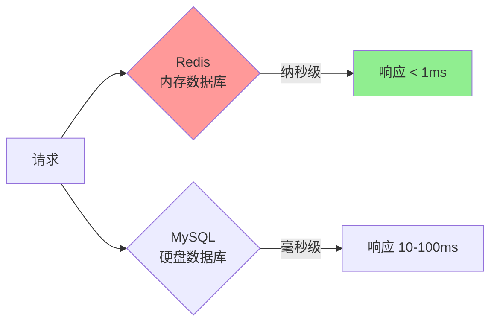

**Redis有多快？**
- 读操作：每秒 **10万-50万次**
- 写操作：每秒 **5万-20万次**
- 延迟：亚毫秒级（< 1ms）

对比一下MySQL：
- 读操作：每秒 **1万-5万次**
- 写操作：每秒 **几千-1万次**
- 延迟：几毫秒到几十毫秒

**结论：Redis比MySQL快5-10倍！在极端场景下差距更大！**

### Redis的诞生

Redis的作者是意大利程序员 **Salvatore Sanfilippo**（网名Antirez）。

2009年，Salvatore为了解决网站的高并发问题，开发了Redis。一开始只是为了解决一个简单的问题：**让网站能实时显示在线用户数量**。

没想到这个"临时解决方案"火了！

```
2009年：Redis诞生，解决实时统计问题
    ↓
2010年：VMware赞助Redis开发
    ↓
2013年：Redis 2.8，稳定版发布
    ↓
2015年：Redis 3.0，集群支持
    ↓
2017年：Redis 4.0，模块系统
    ↓
2018年：Redis 5.0，流数据类型
    ↓
2022年：Redis 7.0，ACLv2
    ↓
持续更新中...
```

### Redis的名字来源

**Redis** = **RE**mote **DI**ctionary **S**erver

翻译过来就是：**远程字典服务器**

为什么会叫这个名字？因为Redis的设计理念就是一个存储"键-值"对（Key-Value）的服务器，就像一本超级大字典，你查什么关键词，它就返回什么内容——比真的字典好用多了，至少不会查到"释义"看到"略"！

### Redis的核心特点

| 特点 | 说明 |
|------|------|
| **内存存储** | 所有数据存在内存，读写速度飞快 |
| **持久化** | 支持RDB和AOF，数据不会丢 |
| **数据结构丰富** | String、Hash、List、Set、ZSet... |
| **主从复制** | 一主多从，读写分离 |
| **高可用** | Sentinel哨兵 + Cluster集群 |
| **单线程** | 使用C语言编写，事件循环模型 |
| **高性能** | 基于内存，QPS轻松上10万+ |

### Redis vs 其他数据库

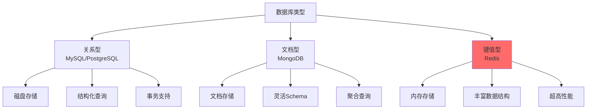

### Redis的用途

| 用途 | 说明 | 示例 |
|------|------|------|
| **缓存层** | 热点数据缓存 | 商品信息、用户信息 |
| **会话存储** | 用户登录状态 | Session、Token |
| **实时排行榜** | 有序集合 | 游戏积分、热度排行 |
| **消息队列** | 轻量级队列 | 异步任务、实时通知 |
| **分布式锁** | 多进程协调 | 库存扣减、秒杀 |
| **限流器** | 控制访问频率 | API限流 |

### Redis的安装方式

```bash
# Ubuntu/Debian
sudo apt install redis-server

# CentOS/RHEL
sudo yum install epel-release
sudo yum install redis

# Docker（最简单）
docker run -d --name redis -p 6379:6379 redis:latest

# macOS
brew install redis
brew services start redis
```

### Redis客户端工具

```bash
# redis-cli - 命令行客户端（自带）
redis-cli

# 连接远程Redis
redis-cli -h 192.168.1.100 -p 6379

# 常用命令
redis-cli PING        # 测试连接，返回PONG
redis-cli INFO        # 查看Redis信息
redis-cli DBSIZE      # 查看键数量
redis-cli FLUSHDB     # 清空当前数据库（危险！）
redis-cli FLUSHALL    # 清空所有数据库（超级危险！）
```

### 一图总结Redis

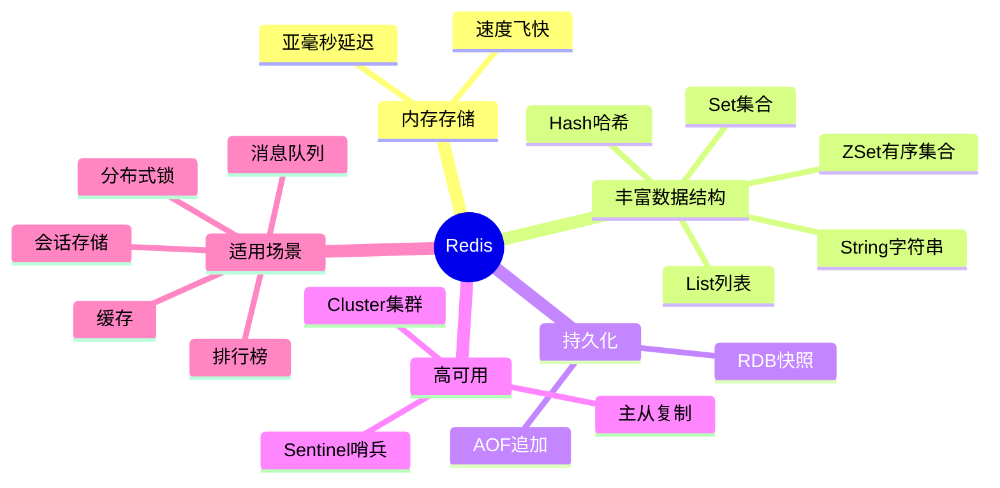

### 小结

Redis是高性能的内存数据库：
- **所有数据存在内存**，速度飞快
- **丰富的数据结构**，不只是简单的键值
- **支持持久化**，数据不会丢失
- **支持主从复制和集群**，高可用

下一节我们将学习如何安装和配置Redis！

## 46.2 Redis 安装

### 安装方式对比

| 安装方式 | 优点 | 缺点 |
|----------|------|------|
| 系统包管理器 | 简单 | 版本可能较旧 |
| Docker | 快速、隔离 | 需要Docker |
| 源码编译 | 最新版本、完全可控 | 编译耗时 |

### Ubuntu/Debian 安装

```bash
# 更新软件源
sudo apt update

# 安装Redis
sudo apt install redis-server -y

# 安装Redis工具（包含redis-cli等）
sudo apt install redis-tools -y

# 查看Redis版本
redis-server --version
# Redis server v=6.0.16 sha=00000000:0 malloc=jemalloc-5.3.0 bits=64
```

### CentOS/RHEL 安装

```bash
# CentOS 7/8
sudo yum install epel-release -y
sudo yum install redis -y

# 启动服务
sudo systemctl start redis
sudo systemctl enable redis

# 查看版本
redis-server --version
```

### Docker 安装（跨平台通用）

```bash
# 拉取最新Redis镜像
docker pull redis:latest

# 运行Redis容器
docker run -d \
    --name redis-server \
    -p 6379:6379 \
    redis:latest

# 运行带密码的Redis
docker run -d \
    --name redis-secure \
    -p 6380:6379 \
    redis:latest \
    redis-server --requirepass MySecurePass123

# 查看运行状态
docker ps
```

### 源码编译安装（获取最新版本）

```bash
# 1. 安装编译工具
sudo apt install build-essential -y

# 2. 下载Redis源码
cd /tmp
wget https://github.com/redis/redis/archive/refs/tags/7.2.4.tar.gz

# 3. 解压
tar xzf redis-7.2.4.tar.gz
cd redis-7.2.4

# 4. 编译
make -j$(nproc)

# 5. 安装（可选，把Redis安装到系统）
sudo make install

# 6. 验证
redis-server --version
```

### 安装后的配置

**1. 启动Redis服务**

```bash
# Ubuntu/Debian (systemd)
sudo systemctl start redis-server
sudo systemctl enable redis-server

# 检查状态
sudo systemctl status redis-server
```

执行结果：

```
● redis-server.service - Redis In-Memory Data Store
     Loaded: loaded (/lib/systemd/system/redis-server.service; enabled; vendor preset: enabled)
     Active: active (running) since Tue 2024-01-01 00:00:00 CST; 1min 30s ago
   Main PID: 1234 (redis-server)
     Status: "Ready to accept connections"
```

**2. 连接测试**

```bash
# 使用redis-cli连接
redis-cli

# 测试连接
127.0.0.1:6379> PING
PONG

# 查看Redis信息
127.0.0.1:6379> INFO
```

### Redis配置文件

Redis的主要配置文件位置：

| 操作系统 | 配置文件路径 |
|----------|-------------|
| Ubuntu/Debian | `/etc/redis/redis.conf` |
| CentOS/RHEL | `/etc/redis.conf` |
| Docker | `/etc/redis/redis.conf` |

**常用配置项：**

```bash
# 查看完整配置
sudo cat /etc/redis/redis.conf
```

关键配置项说明：

```bash
# 网络配置
bind 127.0.0.1              # 监听地址（改为0.0.0.0允许远程连接）
port 6379                    # 监听端口
tcp-backlog 511              # TCP连接队列长度

# 通用配置
daemonize no                 # 是否以守护进程运行（Docker设为no）
supervised no                # Upstart/systemd管理
pidfile /var/run/redis/redis-server.pid
loglevel notice              # 日志级别：debug/verbose/notice/warning
logfile ""                   # 日志文件（空则输出到stdout）

# 数据持久化配置
dir /var/lib/redis           # 数据目录（重要！磁盘空间要够）
dbfilename dump.rdb          # RDB文件名

# RDB持久化（快照）
save 900 1                   # 900秒内1次修改就保存
save 300 10                  # 300秒内10次修改就保存
save 60 10000                # 60秒内10000次修改就保存

# AOF持久化（追加）
appendonly no                # 是否开启AOF（建议生产环境开启）
appendfilename "appendonly.aof"
appendfsync everysec         # everysec:每秒同步（推荐）

# 内存配置
maxmemory 256mb              # 最大内存（根据服务器配置调整）
maxmemory-policy allkeys-lru # 内存满时的淘汰策略

# 安全配置
requirepass ""               # 密码（生产环境必须设置！）
```

### 生产环境配置建议

```bash
# 编辑配置文件
sudo nano /etc/redis/redis.conf
```

**必须修改的配置：**

```bash
# 1. 允许远程连接（如果需要）
bind 0.0.0.0

# 2. 设置密码
requirepass YourSecurePassword123

# 3. 设置最大内存（根据服务器配置）
maxmemory 2gb

# 4. 开启AOF持久化（强烈建议）
appendonly yes
appendfsync everysec

# 5. 设置密码后，redis-cli需要认证
# redis-cli
# AUTH YourSecurePassword123
```

### 远程连接配置

**方式1：通过redis-cli**

```bash
# 连接远程Redis
redis-cli -h 192.168.1.100 -p 6379

# 如果有密码
redis-cli -h 192.168.1.100 -p 6379 -a YourPassword

# 连接后认证
redis-cli
AUTH YourPassword
```

**方式2：开放防火墙**

```bash
# Ubuntu (ufw)
sudo ufw allow 6379/tcp

# CentOS (firewalld)
sudo firewall-cmd --permanent --add-port=6379/tcp
sudo firewall-cmd --reload
```

### 一图总结安装流程

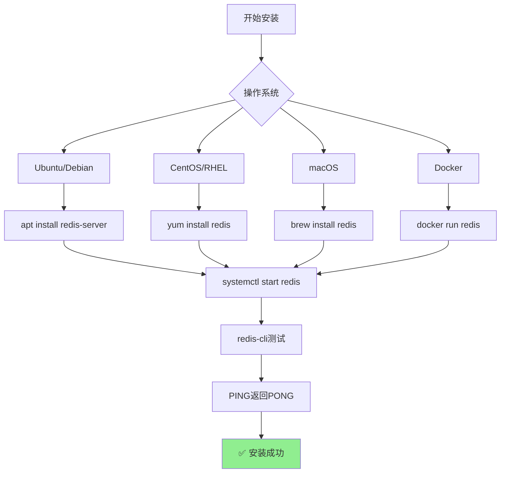

### 小结

Redis安装要点：
- Ubuntu：`apt install redis-server`
- CentOS：`yum install redis`
- Docker：`docker run -d -p 6379:6379 redis`
- 配置文件：`/etc/redis/redis.conf`
- 生产环境必须设置密码

下一节我们将学习Redis的数据类型，这是Redis最强大的地方！

## 46.3 数据类型

Redis不只是简单的键值存储，它支持**丰富的数据结构**！

这就像一个工具箱，不只有锤子，还有螺丝刀、钳子、锯子...每种工具都有它的用武之地。

### Redis的五种基本数据类型

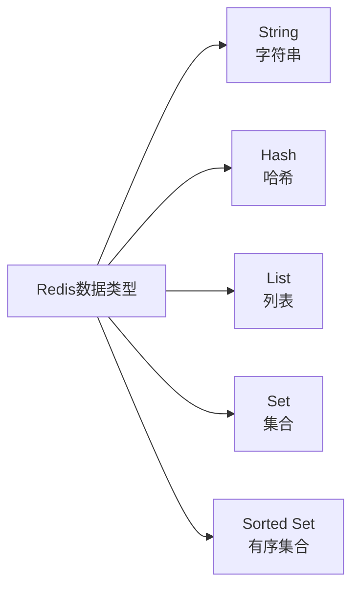

### 46.3.1 String（字符串）

String是Redis最基本的数据类型，可以存储任何字符串（文本、数字、二进制数据）。

**常用命令：**

```bash
# 设置值
SET key "hello"
SET user:1:name "xiaoming"
SET counter 100

# 获取值
GET key
# "hello"

# 设置多个值
MSET user:1:name "xiaoming" user:1:age "25" user:1:city "Beijing"

# 获取多个值
MGET user:1:name user:1:age user:1:city
# 1) "xiaoming"
# 2) "25"
# 3) "Beijing"

# 设置带过期时间的值（秒）
SET session:abc123 "user_id:1" EX 3600  # 1小时后过期

# 设置带过期时间的值（毫秒）
SET token "abc123" PX 3600000  # 1小时后过期

# 设置值（仅当key不存在）
SETNX newkey "value"  # 如果newkey不存在才设置

# 设置值（仅当key存在）
SETEX key 3600 "value"  # 设置值并指定过期时间

# 获取旧值并设置新值
GETSET key "newvalue"
# 返回旧值

# 自增/自减
SET counter 100
INCR counter       # counter变成101
INCRBY counter 5   # counter变成106
DECR counter       # counter变成105
DECRBY counter 10  # counter变成95

# 自增浮点数
SET price 99.99
INCRBYFLOAT price 0.01  # price变成100.00

# 字符串操作
APPEND key "world"     # 在key的值后面追加"world"
STRLEN key             # 获取字符串长度
GETRANGE key 0 4       # 获取子字符串（索引0-4）
SETRANGE key 0 "HELLO" # 从索引0开始替换
```

**String的用途：**

| 场景 | 示例 |
|------|------|
| 缓存网页 | `SET page:home "<html>..."` |
| 存储Token | `SET token:xxx "user_id"` |
| 计数器 | `INCR article:views:1` |
| 分布式锁 | `SET lock:order "1" NX EX 30` |

**计数器实战：**

```bash
# 文章阅读量统计
INCR article:views:1001
INCR article:views:1001
INCR article:views:1001
# 阅读量：3

# 获取阅读量
GET article:views:1001
# "3"
```

**分布式锁实战：**

```bash
# 获取锁（仅当key不存在时设置，并设置过期时间）
SET lock:order:123456 "locked" NX EX 30

# 释放锁（删除key）
DEL lock:order:123456
```

### 46.3.2 Hash（哈希）

Hash就像一个**对象**或**字典**，存储键值对集合。非常适合存储对象数据！

**数据结构示意：**

```
user:1 = {
    name: "xiaoming",
    age: "25",
    email: "xiaoming@example.com"
}
```

**常用命令：**

```bash
# 设置Hash字段
HSET user:1 name "xiaoming"
HSET user:1 age 25
HSET user:1 email "xiaoming@example.com"

# 一次设置多个字段
HSET user:1 name "xiaoming" age 25 email "xiaoming@example.com"

# 获取字段值
HGET user:1 name
# "xiaoming"

# 获取多个字段值
HMGET user:1 name age email
# 1) "xiaoming"
# 2) "25"
# 3) "xiaoming@example.com"

# 获取所有字段和值
HGETALL user:1
# 1) "name"
# 2) "xiaoming"
# 3) "age"
# 4) "25"
# 5) "email"
# 6) "xiaoming@example.com"

# 获取所有字段
HKEYS user:1
# 1) "name"
# 2) "age"
# 3) "email"

# 获取所有值
HVALS user:1
# 1) "xiaoming"
# 2) "25"
# 3) "xiaoming@example.com"

# 字段是否存在
HEXISTS user:1 name
# (integer) 1

# 字段数量
HLEN user:1
# (integer) 3

# 删除字段
HDEL user:1 email
HGETALL user:1
# 1) "name"
# 2) "xiaoming"
# 3) "age"
# 4) "25"

# 自增（字段值必须是数字）
HSET user:1 age 25
HINCRBY user:1 age 1  # age变成26
HINCRBY user:1 age 5  # age变成31

# 字符串操作
HSET user:1 tags "java,python,go"
HSTRLEN user:1 name
# (integer) 8
```

**Hash的用途：**

| 场景 | 示例 |
|------|------|
| 存储用户信息 | `HSET user:1 name "xiaoming" age 25` |
| 存储商品信息 | `HSET product:1001 name "iPhone" price 9999` |
| 存储配置信息 | `HSET config:app port 8080 debug true` |

**用户信息实战：**

```bash
# 存储用户信息
HSET user:1001 name "xiaoming" email "xiaoming@example.com" age 25 city "Beijing"

# 获取用户信息
HGETALL user:1001
# 1) "name"
# 2) "xiaoming"
# 3) "email"
# 4) "xiaoming@example.com"
# 5) "age"
# 6) "25"
# 7) "city"
# 8) "Beijing"

# 更新年龄
HINCRBY user:1001 age 1

# 只获取部分字段
HMGET user:1001 name email
```

### 46.3.3 List（列表）

List是一个**有序的字符串列表**，可以按照插入顺序存储多个元素。支持两端操作！

**数据结构示意：**

```
mylist = ["a", "b", "c", "d", "e"]
        left                    right
```

**常用命令：**

```bash
# 从左边插入（头插）
LPUSH mylist "a"
LPUSH mylist "b"
LPUSH mylist "c"
# mylist: ["c", "b", "a"]

# 从右边插入（尾插）
RPUSH mylist "x"
RPUSH mylist "y"
# mylist: ["c", "b", "a", "x", "y"]

# 获取列表元素
LRANGE mylist 0 -1  # 获取所有元素
# 1) "c"
# 2) "b"
# 3) "a"
# 4) "x"
# 5) "y"

# 获取指定范围
LRANGE mylist 0 2  # 前3个元素
# 1) "c"
# 2) "b"
# 3) "a"

# 获取长度
LLEN mylist
# (integer) 5

# 从左边弹出（头出）
LPOP mylist
# "c"
# mylist: ["b", "a", "x", "y"]

# 从右边弹出（尾出）
RPOP mylist
# "y"
# mylist: ["b", "a", "x"]

# 按索引获取元素
LINDEX mylist 0  # 第一个元素
# "b"
LINDEX mylist -1 # 最后一个元素
# "x"

# 设置指定索引的值
LSET mylist 0 "B"
# mylist: ["B", "a", "x"]

# 截断列表（保留指定范围）
LTRIM mylist 0 1
# mylist: ["B", "a"]

# 阻塞操作（队列/消息队列用）
# 阻塞从左边弹出，列表为空则等待
BLPOP mylist 0  # 0表示一直等待
# 或 BLPOP mylist 10（等待10秒）

# 阻塞从右边弹出
BRPOP mylist 0

# 批量插入
RPUSH mylist "1" "2" "3" "4" "5"
# mylist: ["1", "2", "3", "4", "5"]

# 获取列表范围
LRANGE mylist 0 -1
# 1) "1"
# 2) "2"
# 3) "3"
# 4) "4"
# 5) "5"
```

**List的用途：**

| 场景 | 示例 |
|------|------|
| 消息队列 | `LPUSH queue "msg1"` + `BRPOP queue 0` |
| 最新消息列表 | `LPUSH user:1:timeline "msg"` + `LTRIM user:1:timeline 0 99` |
| 任务队列 | `LPUSH tasks "task1"` + `BRPOP tasks 0` |

**消息队列实战：**

```bash
# 生产者：发送消息
LPUSH queue:orders "order:1001"
LPUSH queue:orders "order:1002"
LPUSH queue:orders "order:1003"

# 消费者：接收消息（阻塞等待）
BRPOP queue:orders 0
# "order:1001"
# 或
BLPOP queue:orders 0
# "order:1003"（左进右出，弹出最后进入的）
```

**最新N条消息实战：**

```bash
# 用户发布消息
LPUSH user:1:posts "message 1"
LPUSH user:1:posts "message 2"
LPUSH user:1:posts "message 3"

# 只保留最新10条
LTRIM user:1:posts 0 9

# 获取最新消息
LRANGE user:1:posts 0 9
```

### 46.3.4 Set（集合）

Set是一个**无序的、唯一的字符串集合**。不能有重复元素！

**数据结构示意：**

```
myset = {"apple", "banana", "cherry"}
        唯一性：无重复
```

**常用命令：**

```bash
# 添加元素
SADD myset "apple"
SADD myset "banana"
SADD myset "cherry"
SADD myset "apple"  # 重复元素会被忽略

# 获取所有元素
SMEMBERS myset
# 1) "apple"
# 2) "banana"
# 3) "cherry"

# 获取元素数量
SCARD myset
# (integer) 3

# 判断元素是否存在
SISMEMBER myset "apple"
# (integer) 1 (存在)
SISMEMBER myset "grape"
# (integer) 0 (不存在)

# 删除元素
SREM myset "banana"
SMEMBERS myset
# 1) "apple"
# 2) "cherry"

# 随机弹出元素
SPOP myset
# 返回弹出的元素
SMEMBERS myset

# 随机获取元素（不删除）
SRANDMEMBER myset 2  # 获取2个随机元素

# 集合运算
SADD set1 "a" "b" "c"
SADD set2 "b" "c" "d"

# 交集
SINTER set1 set2
# 1) "b"
# 2) "c"

# 并集
SUNION set1 set2
# 1) "a"
# 2) "b"
# 3) "c"
# 4) "d"

# 差集（set1有set2没有的）
SDIFF set1 set2
# 1) "a"

# 将交集结果存入新key
SINTERSTORE set1_inter_set2 set1 set2
SMEMBERS set1_inter_set2
# 1) "b"
# 2) "c"
```

**Set的用途：**

| 场景 | 示例 |
|------|------|
| 标签系统 | `SADD article:1:tags "redis" "database"` |
| 好友关系 | `SADD user:1:followers 2 3 4 5` |
| 去重统计 | `SADD ip:20240101 "192.168.1.1" "192.168.1.2"` |
| 抽奖 | `SRANDMEMBER prizes 3` |

**标签系统实战：**

```bash
# 给文章添加标签
SADD article:1001:tags "Redis" "Database" "Cache"
SADD article:1002:tags "MySQL" "Database"

# 获取文章的所有标签
SMEMBERS article:1001:tags
# 1) "Redis"
# 2) "Database"
# 3) "Cache"

# 查找同时有多个标签的文章
SINTER article:1001:tags article:1002:tags
# 1) "Database"

# 获取用户感兴趣的标签
SUNION user:1:tags user:2:tags
```

**去重统计实战：**

```bash
# 统计每天的独立访客
SADD visits:20240101 "192.168.1.1" "192.168.1.2" "192.168.1.1"
# 只算1个IP

# 获取当天独立访客数
SCARD visits:20240101
# (integer) 2
```

### 46.3.5 Sorted Set（有序集合）

Sorted Set（ZSet）是Redis最强大的数据类型！它是一个**有序的、唯一的字符串集合**，每个元素都有一个分数（score）来排序。

**数据结构示意：**

```
zset = {
    "xiaoming": 95,   # 分数95
    "xiaohong": 88,   # 分数88
    "xiaogang": 92    # 分数92
}
按分数排序：xiaohong(88) < xiaogang(92) < xiaoming(95)
```

**常用命令：**

```bash
# 添加元素（带分数）
ZADD leaderboard 95 "xiaoming"
ZADD leaderboard 88 "xiaohong"
ZADD leaderboard 92 "xiaogang"

# 获取元素（按分数从小到大）
ZRANGE leaderboard 0 -1
# 1) "xiaohong"
# 2) "xiaogang"
# 3) "xiaoming"

# 获取元素（按分数从大到小）
ZREVRANGE leaderboard 0 -1
# 1) "xiaoming"
# 2) "xiaogang"
# 3) "xiaohong"

# 获取元素和分数
ZRANGE leaderboard 0 -1 WITHSCORES
# 1) "xiaohong"
# 2) "88"
# 3) "xiaogang"
# 4) "92"
# 5) "xiaoming"
# 6) "95"

# 获取指定分数范围的元素
ZRANGEBYSCORE leaderboard 80 90
# 1) "xiaohong"
# 2) "xiaogang"

# 获取排名（从0开始）
ZRANK leaderboard "xiaohong"
# (integer) 0  # 第一名

ZRANK leaderboard "xiaoming"
# (integer) 2  # 第三名

# 获取分数
ZSCORE leaderboard "xiaoming"
# "95"

# 获取元素数量
ZCARD leaderboard
# (integer) 3

# 删除元素
ZREM leaderboard "xiaohong"

# 删除指定分数范围的元素
ZREMRANGEBYSCORE leaderboard 80 90

# 自增分数
ZINCRBY leaderboard 5 "xiaohong"  # xiaohong分数从88变成93

# 统计分数范围内元素数量
ZCOUNT leaderboard 80 90
# (integer) 1

# 有序集合运算（交集、并集）
ZADD set1 100 "a" 200 "b"
ZADD set2 150 "b" 250 "c"

# 交集（元素分数相加）
ZINTERSTORE inter 2 set1 set2
ZRANGE inter 0 -1 WITHSCORES
# 1) "b"
# 2) "350"  # 200+150
```

**Sorted Set的用途：**

| 场景 | 示例 |
|------|------|
| 排行榜 | `ZADD game:leaderboard 10000 "xiaoming"` |
| 热搜排行 | `ZINCRBY hot:search 1000 "热点新闻"` |
| 延时队列 | `ZADD delay:queue <timestamp> "task"` |
| 滑动窗口限流 | `ZADD rate:limit:user:1 <time> <request_id>` |

**排行榜实战：**

```bash
# 游戏积分排行榜
ZADD game:scores 15000 "xiaoming"
ZADD game:scores 12000 "xiaohong"
ZADD game:scores 18000 "xiaogang"
ZADD game:scores 9000 "xiaoli"

# 获取前3名
ZREVRANGE game:scores 0 2 WITHSCORES
# 1) "xiaogang"
# 2) "18000"
# 3) "xiaoming"
# 4) "15000"
# 5) "xiaohong"
# 6) "12000"

# 获取玩家排名
ZREVRANK game:scores "xiaoming"
# (integer) 0  # 第1名

# 玩家得分变化后更新
ZINCRBY game:scores 5000 "xiaohong"
ZREVRANK game:scores "xiaohong"
# (integer) 1  # 变成第2名
```

**热搜排行实战：**

```bash
# 用户搜索"Redis"
ZINCRBY hot:search 100 "Redis"

# 用户搜索"数据库"
ZINCRBY hot:search 80 "数据库"

# 用户搜索"MySQL"
ZINCRBY hot:search 60 "MySQL"

# 获取实时热搜榜（前10）
ZREVRANGE hot:search 0 9 WITHSCORES
# 1) "Redis"
# 2) "100"
# 3) "数据库"
# 4) "80"
# 5) "MySQL"
# 6) "60"

# 每小时重置热搜
# DEL hot:search
```

### 数据类型对比

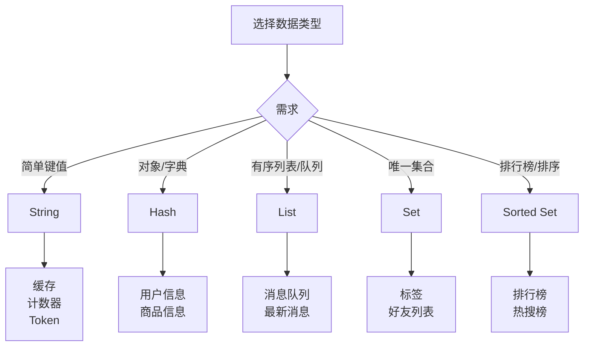

### 小结

Redis五种数据类型：

| 类型 | 特点 | 常用命令 | 适用场景 |
|------|------|----------|----------|
| **String** | 简单键值 | SET/GET | 缓存、计数器、Token |
| **Hash** | 对象存储 | HSET/HGET | 用户信息、商品信息 |
| **List** | 有序列表 | LPUSH/RPOP | 消息队列、最新消息 |
| **Set** | 无序唯一 | SADD/SMEMBERS | 标签、好友、去重 |
| **ZSet** | 有序唯一 | ZADD/ZRANGE | 排行榜、热搜 |

下一节我们将学习Redis的持久化机制！

## 46.4 持久化

Redis数据存在**内存**里，速度飞快！但是...万一服务器断电了怎么办？你的数据会不会像网吧停电一样，全部GG？

别担心！Redis有**持久化**机制，可以把数据保存到硬盘上，断电也不丢数据！

### 46.4.1 RDB：快照

**RDB（Redis Database）** 是一种**快照**持久化方式。它会在某个时刻，给内存数据拍一张"照片"，保存到硬盘上。

**原理：**

```
时刻T1: 内存数据 -> "咔嚓" -> dump.rdb文件
                ↓
时刻T2: 服务器重启 -> 读取dump.rdb -> 数据恢复！
```

RDB就像给你的数据买了份"定期保险"——虽然可能丢失最后一次"拍照"之后的数据，但恢复起来快啊！

**配置方式：**

```bash
# 编辑配置文件
sudo nano /etc/redis/redis.conf

# RDB触发条件（满足任一条件就保存快照）
# 格式：save 秒数 修改次数
save 900 1       # 900秒内至少1次修改就保存
save 300 10      # 300秒内至少10次修改就保存
save 60 10000    # 60秒内至少10000次修改就保存（高并发场景）

# RDB文件存放目录（要有足够空间！）
dir /var/lib/redis
dbfilename dump.rdb

# 是否压缩RDB文件（压缩省空间，但CPU开销）
rdbcompression yes

# RDB文件校验（保证文件完整性）
rdbchecksum yes
```

**手动触发RDB快照：**

```bash
# 方式1：阻塞方式（会暂停服务，不推荐在生产环境用）
redis-cli SAVE

# 方式2：非阻塞方式（在后台fork子进程执行，推荐！）
redis-cli BGSAVE

# 查看BGSAVE是否完成
redis-cli LASTSAVE
# 返回一个Unix时间戳，如果多次调用时间变了，说明保存完成
```

**RDB的优点：**
- 文件紧凑（经过压缩），备份恢复快
- 适合大规模数据备份和灾难恢复
- fork()在后台执行，不阻塞主进程

**RDB的缺点：**
- 可能丢失最后一次快照之后的数据（最多丢失几分钟）
- 数据量大时，fork()操作会短暂阻塞

### 46.4.2 AOF：追加

**AOF（Append Only File）** 是一种**日志**持久化方式。它会像一个尽职的秘书，把你的每一个操作都记录下来。

**原理：**

```
你执行命令 -> "好的老板！" -> 追加到appendonly.aof文件
                    ↓
恢复数据 -> 重放所有命令 -> 数据恢复！
```

AOF就像给你的数据买了份"实时保险"——每做一次操作就记录一次，出事了从头来一遍！

**配置方式：**

```bash
# 编辑配置文件
sudo nano /etc/redis/redis.conf

# 开启AOF
appendonly yes

# AOF文件名
appendfilename "appendonly.aof"

# AOF同步策略（决定多久写一次硬盘）
appendfsync everysec   # everysec: 每秒同步一次（推荐！性能和安全的平衡）

# 其他策略：
# appendfsync always    # 每次操作都同步（最安全，但慢得像蜗牛）
# appendfsync no        # 让操作系统决定（最快，但可能丢数据）
```

**三种同步策略对比：**

| 策略 | 安全性 | 性能 | 可能丢失的数据 |
|------|--------|------|--------------|
| `always` | 最高 | 最慢 | 最多丢失1条命令 |
| `everysec` | 中等 | 中等 | 最多丢失1秒数据 |
| `no` | 最低 | 最快 | 取决于系统 |

**AOF文件内容长这样：**

```bash
# 查看AOF文件
cat /var/lib/redis/appendonly.aof

# 内容示例（这是Redis的通信协议格式）：
*3
$3
SET
$3
key
$5
value
*3
$3
SET
$4
name
$8
xiaoming
```

看不懂？没关系，反正Redis自己能看懂就行！

**AOF重写（Rewrite）：**

AOF文件会越来越大——每次操作都记，小学生作文都能写成长篇小说！Redis会定期"压缩"这个小说。

```bash
# 手动触发AOF重写（后台执行）
redis-cli BGREWRITEAOF

# 配置自动重写条件
auto-aof-rewrite-percentage 100  # 文件比上次重写后大一倍就自动重写
auto-aof-rewrite-min-size 64mb   # 文件小于64MB先不重写
```

**AOF的优点：**
- 数据安全性更高（everysec模式最多丢1秒数据）
- 即使只追加写入，不会出现随机IO问题

**AOF的缺点：**
- AOF文件通常比RDB文件大（因为记录了所有操作）
- 恢复速度比RDB慢（需要重放所有命令）

### RDB vs AOF 对比

| 对比项 | RDB | AOF |
|--------|-----|-----|
| **持久化方式** | 快照 | 追加日志 |
| **文件大小** | 小（紧凑） | 大（包含所有操作） |
| **恢复速度** | 快 | 慢 |
| **数据安全性** | 可能丢失数据 | 最多丢失1秒数据 |
| **CPU开销** | fork开销大 | 写入频繁CPU开销大 |
| **适用场景** | 备份、灾难恢复 | 数据敏感业务 |

### 推荐的持久化配置（生产环境）

```bash
# 编辑配置文件
sudo nano /etc/redis/redis.conf

# ============ RDB配置 ============
# 保存条件
save 900 1
save 300 10
save 60 10000

# 文件路径
dir /var/lib/redis
dbfilename dump.rdb

# ============ AOF配置 ============
# 开启AOF
appendonly yes
appendfilename "appendonly.aof"

# 同步策略（每秒同步）
appendfsync everysec

# AOF重写配置
auto-aof-rewrite-percentage 100
auto-aof-rewrite-min-size 64mb

# 允许AOF截断（如果损坏）
aof-load-truncated yes

# RDB+AOF混合持久化（Redis 7.0+）
aof-use-rdb-preamble yes
```

### 恢复数据

```bash
# 1. 先查看有哪些持久化文件
ls -la /var/lib/redis/

# 2. 如果同时有RDB和AOF，Redis会优先用AOF恢复
# 3. 停止Redis
sudo systemctl stop redis

# 4. 备份现有数据文件
sudo cp /var/lib/redis/*.rdb /backup/
sudo cp /var/lib/redis/*.aof /backup/

# 5. 把备份文件放回数据目录
sudo cp /backup/dump.rdb /var/lib/redis/
sudo chown redis:redis /var/lib/redis/dump.rdb

# 6. 启动Redis
sudo systemctl start redis

# 7. 验证数据
redis-cli GET key
```

### 一图总结持久化

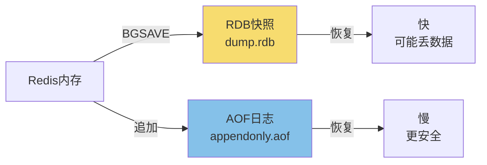

### 小结

Redis持久化两种方式：
- **RDB**：定时快照，文件小，恢复快，但可能丢数据
- **AOF**：追加日志，安全性高，文件大，恢复慢

**生产环境推荐：同时开启RDB和AOF**，数据最安全！

下一节我们将学习Redis的集群模式！

## 46.5 集群模式

单机Redis能抗多少QPS？大概10万-20万。

但如果你的业务有100万QPS怎么办？

答案：**Redis集群**！

### 46.5.1 主从复制

主从复制是最简单的Redis高可用方案。

**原理：**

```
主库(Master) -> 同步 -> 从库(Slave)
                    ↓
              数据一模一样
```

**配置从库：**

```bash
# 方式1：修改配置文件（永久生效）
sudo nano /etc/redis/redis.conf

# 添加/修改
replicaof 192.168.1.100 6379
# 或者（新版本用这个）
replicaof <master-ip> <master-port>

# 如果主库有密码
masterauth <password>

# 从库只读（默认开启）
replica-read-only yes

# 重启从库
sudo systemctl restart redis

# 方式2：命令行动态设置（临时生效，重启失效）
redis-cli replicaof 192.168.1.100 6379

# 取消复制
redis-cli replicaof no one
```

**验证主从状态：**

```bash
# 在主库查看
redis-cli INFO replication

# 输出示例：
# role:master
# connected_slaves:2
# slave0:ip=192.168.1.101,port=6379,state=online,offset=12345,lag=0
# slave1:ip=192.168.1.102,port=6379,state=online,offset=12345,lag=0

# 在从库查看
redis-cli INFO replication

# 输出示例：
# role:slave
# master_host:192.168.1.100
# master_port:6379
# master_link_status:up
```

**测试主从同步：**

```bash
# 在主库写入
redis-cli SET testkey "hello"
redis-cli INCR counter

# 在从库读取（应该能看到）
redis-cli GET testkey
# "hello"
```

### 46.5.2 Sentinel 哨兵

主从复制有个问题：**主库挂了怎么办？**

Redis Sentinel（哨兵）就是来解决这个问题的！

**哨兵的功能：**
- **监控**：监控主库和从库是否正常运行
- **自动故障转移**：主库挂了，自动选举一个从库升级为新主库
- **通知**：故障转移后通知应用
- **配置提供者**：应用通过哨兵获取当前的主库地址

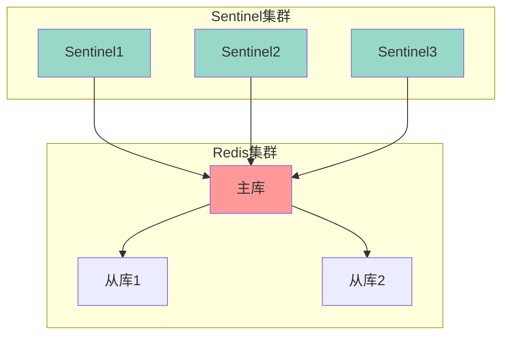

**配置哨兵：**

```bash
# 安装哨兵（Redis自带）
# 配置文件位置
sudo nano /etc/redis/sentinel.conf

# 最小配置：
port 26379

# 监控的主库名称和IP
sentinel monitor mymaster 192.168.1.100 6379 2
# mymaster是主库名称
# 2表示2个哨兵同意才进行故障转移

# 主库密码（如果有）
sentinel auth-pass mymaster YourPassword

# 故障转移超时时间
sentinel down-after-milliseconds mymaster 30000

# 并行同步从库数量
parallel-syncs 1

# 故障转移后执行脚本
sentinel notification-script mymaster /var/redis/notify.sh
```

```bash
# 启动哨兵
redis-sentinel /etc/redis/sentinel.conf

# 或
redis-server /etc/redis/sentinel.conf --sentinel

# 查看哨兵状态
redis-cli -p 26379 INFO sentinel

# 输出示例：
# sentinel_masters:1
# master0:name=mymaster,status=ok,address=192.168.1.100:6379
# slaves=2
```

**Sentinel工作流程：**

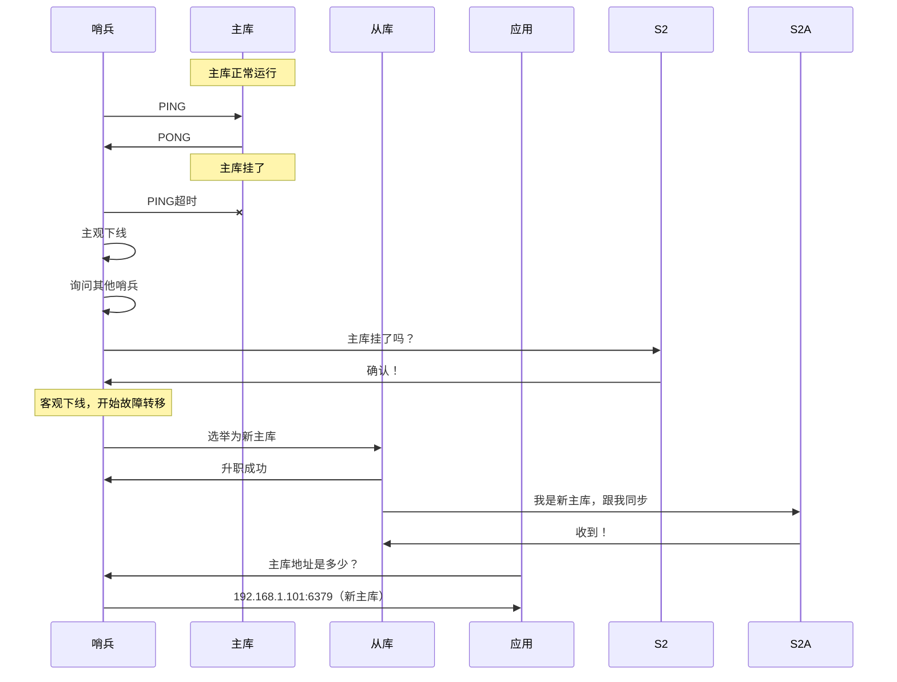

### 46.5.3 Cluster 集群

当数据量非常大，一台机器存不下怎么办？

**Redis Cluster** 来帮你！它把数据**分片**存储到多台机器上！

**Cluster的核心概念：**

```
16384个槽位 -> 分散到N个节点

节点1: 槽位 0-5460
节点2: 槽位 5461-10922
节点3: 槽位 10923-16383
```

**为什么是16384个槽？**
- 足够多，可以均匀分布到多个节点
- 槽信息不大，方便在集群节点间传输
- 这个数字是Redis创始人经过权衡选择的结果

**创建Redis Cluster（6台机器）：**

```bash
# 假设3个主库 + 3个从库

# 节点1 (主)
redis-server --port 7001 --cluster-enabled yes --cluster-config-file nodes-7001.conf --daemonize yes

# 节点2 (主)
redis-server --port 7002 --cluster-enabled yes --cluster-config-file nodes-7002.conf --daemonize yes

# 节点3 (主)
redis-server --port 7003 --cluster-enabled yes --cluster-config-file nodes-7003.conf --daemonize yes

# 节点4 (从)
redis-server --port 7004 --cluster-enabled yes --cluster-config-file nodes-7004.conf --daemonize yes

# 节点5 (从)
redis-server --port 7005 --cluster-enabled yes --cluster-config-file nodes-7005.conf --daemonize yes

# 节点6 (从)
redis-server --port 7006 --cluster-enabled yes --cluster-config-file nodes-7006.conf --daemonize yes

# 创建集群（分配槽位和主从关系）
redis-cli --cluster create 192.168.1.101:7001 192.168.1.102:7002 192.168.1.103:7003 \
    192.168.1.104:7004 192.168.1.105:7005 192.168.1.106:7006 \
    --cluster-replicas 1
# --cluster-replicas 1 表示每个主库有1个从库

# 查看集群状态
redis-cli -p 7001 CLUSTER NODES
```

**Cluster工作原理：**

```mermaid
flowchart TB
    subgraph "Redis Cluster"
        M1[主库1<br/>槽0-5460] --> S1[从库1]
        M2[主库2<br/>槽5461-10922] --> S2[从库2]
        M3[主库3<br/>槽10923-16383] --> S3[从库3]
    end
    
    A[应用] -->|请求key1| M1
    A -->|请求key2| M2
    A -->|请求key3| M3
    
    Note over A: Redis客户端自动计算key属于哪个槽
```

**连接集群：**

```bash
# 使用redis-cli连接集群
redis-cli -c -p 7001

# -c 表示集群模式

# 测试
127.0.0.1:7001> SET name xiaoming
# 自动跳转到对应节点
-> Redirected to slot [5798] located at 192.168.1.102:7002
OK

# 获取数据
127.0.0.1:7002> GET name
# 自动从对应节点获取
-> Redirected to slot [5798] located at 192.168.1.102:7002
"xiaoming"
```

### 高可用方案对比

| 方案 | 适用场景 | 复杂度 | 特点 |
|------|----------|--------|------|
| **主从复制** | 读写分离 | 低 | 数据备份，读扩展 |
| **Sentinel** | 自动故障转移 | 中 | 监控 + 故障转移 |
| **Cluster** | 数据分片 | 高 | 数据分布 + 高可用 |

### 小结

Redis集群模式：
- **主从复制**：一主多从，数据备份，读写分离
- **Sentinel**：监控主库，自动故障转移，高可用
- **Cluster**：数据分片到多个节点，海量数据 + 高可用

下一节我们将学习Redis的缓存策略！

## 46.6 缓存策略

Redis最常用的场景就是**缓存**。但缓存怎么用才能既快又省内存？

这就需要**缓存策略**！

### 缓存的经典问题

```
缓存穿透：查询不存在的数据，每次都打到数据库
缓存击穿：热点key过期，瞬间大量请求打到数据库
缓存雪崩：大量key同时过期，瞬间大量请求打到数据库
```

### 缓存穿透解决方案

**问题：** 查询一个不存在的数据，缓存没有，数据库也没有，每次都打到数据库。

**解决方案：**

```python
def get_user(user_id):
    # 1. 先查缓存
    cache_key = f"user:{user_id}"
    user = redis.get(cache_key)
    
    if user:
        return json.loads(user)
    
    # 2. 缓存没有，查数据库
    user = db.query("SELECT * FROM users WHERE id = ?", user_id)
    
    if user:
        # 3. 数据库有，存入缓存
        redis.setex(cache_key, 3600, json.dumps(user))
    else:
        # 4. 数据库也没有，设置空值缓存（防止穿透）
        redis.setex(cache_key, 300, "NULL")
    
    return user
```

### 缓存击穿解决方案

**问题：** 热点key过期，瞬间大量请求同时打到数据库。

**解决方案：互斥锁/分布式锁**

```python
import time
import hashlib

def get_user_with_lock(user_id):
    cache_key = f"user:{user_id}"
    
    # 1. 先查缓存
    user = redis.get(cache_key)
    if user:
        return json.loads(user)
    
    # 2. 缓存没有，获取锁
    lock_key = f"lock:user:{user_id}"
    lock_id = hashlib.md5(str(time.time()).encode()).hexdigest()
    
    # SETNX + EXPIRE 原子操作
    lock_acquired = redis.set(lock_key, lock_id, nx=True, ex=10)
    
    if lock_acquired:
        try:
            # 3. 获取到锁，查数据库
            user = db.query("SELECT * FROM users WHERE id = ?", user_id)
            
            if user:
                redis.setex(cache_key, 3600, json.dumps(user))
            
            return user
        finally:
            # 4. 释放锁
            if redis.get(lock_key) == lock_id:
                redis.delete(lock_key)
    else:
        # 5. 没获取到锁，等待一下再查缓存
        time.sleep(0.1)
        return get_user_with_lock(user_id)
```

### 缓存雪崩解决方案

**问题：** 大量key同时过期或Redis重启，瞬间大量请求打到数据库。

**解决方案1：过期时间加随机值**

```python
# 设置过期时间时加随机值
base_ttl = 3600  # 1小时
random_ttl = random.randint(0, 300)  # 0-5分钟随机
ttl = base_ttl + random_ttl

redis.setex(cache_key, ttl, value)
```

**解决方案2：永不过期 + 异步更新**

```python
def get_user_async(user_id):
    cache_key = f"user:{user_id}"
    
    # 1. 先查缓存
    user = redis.get(cache_key)
    if user:
        return json.loads(user)
    
    # 2. 没有缓存，从数据库查
    user = db.query("SELECT * FROM users WHERE id = ?", user_id)
    
    if user:
        # 设置永不过期
        redis.set(cache_key, json.dumps(user))
        
        # 异步更新缓存（可以发到队列处理）
        queue.put(("update_cache", user_id, user))
    
    return user
```

### 缓存淘汰策略

当Redis内存满了，新数据进来怎么办？

这时候Redis就会开始"断舍离"——不是Marie Kondo那种，是根据一定策略把旧数据踢出去！

**Redis的内存淘汰策略（maxmemory-policy）：**

| 策略 | 说明 | 比喻 |
|------|------|------|
| `noeviction` | 不淘汰，返回错误（默认） | 仓库满了，暂停进货 |
| `allkeys-lru` | 所有key中，淘汰最近最少使用的 | 把好久不用的东西扔掉 |
| `volatile-lru` | 有过期时间的key中，淘汰最近最少使用的 | 只在有保质期的东西里挑 |
| `allkeys-random` | 所有key中，随机淘汰 | 闭眼随便扔 |
| `volatile-random` | 有过期时间的key中，随机淘汰 | 在快过期的东西里随便扔 |
| `allkeys-lfu` | 所有key中，淘汰使用频率最低的 | 把使用频率最低的踢出去 |
| `volatile-lfu` | 有过期时间的key中，淘汰使用频率最低的 | 挑快过期且不常用的踢 |
| `volatile-ttl` | 有过期时间的key中，淘汰剩余TTL最短的 | 先扔快过期的东西 |

**最常用的是 `allkeys-lru`**——想象一下，你衣柜满了，你会先扔那些"去年买的一年都没穿过的衣服"，而不是"上周刚买的限量款"。

**配置淘汰策略：**

```bash
# 设置最大内存
sudo nano /etc/redis/redis.conf

maxmemory 2gb
maxmemory-policy allkeys-lru  # 推荐这个！
```

### 缓存使用最佳实践

```python
# 1. 选择合适的缓存粒度
# ❌ 不好：缓存整个用户列表
redis.set("users:all", json.dumps(all_users))

# ✅ 好：缓存单个用户
for user in users:
    redis.setex(f"user:{user.id}", 3600, json.dumps(user))

# 2. 合理设置过期时间
# ❌ 不好：所有数据都是1小时
redis.setex("key", 3600, value)

# ✅ 好：根据数据特性设置
# 配置数据：永不过期，更新时删除
# 用户数据：30分钟过期
# 临时数据：5分钟过期

# 3. 使用缓存预热
def warm_cache():
    # 系统启动时，把热点数据加载到缓存
    hot_users = db.query("SELECT * FROM users WHERE is_vip = 1")
    for user in hot_users:
        redis.setex(f"user:{user.id}", 86400, json.dumps(user))

# 4. 缓存监控
def monitor_cache():
    info = redis.info()
    print(f"内存使用: {info['used_memory_human']}")
    print(f"键数量: {redis.dbsize()}")
    print(f"命中率: {info['keyspace_hits'] / (info['keyspace_hits'] + info['keyspace_misses']) * 100}%")
```

### 一图总结缓存策略

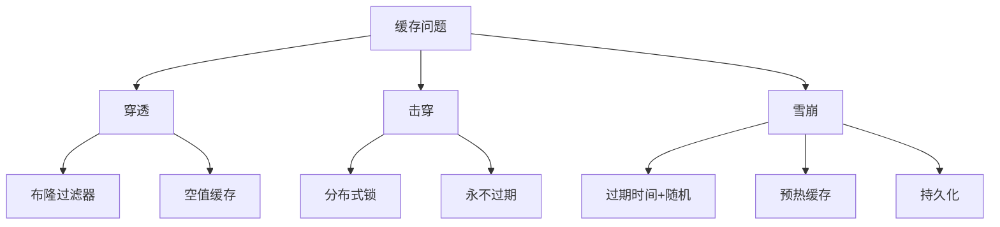

### 小结

缓存策略三剑客：
- **缓存穿透**：布隆过滤器 + 空值缓存
- **缓存击穿**：分布式锁 + 永不过期
- **缓存雪崩**：过期时间随机 + 预热缓存

内存淘汰策略：`allkeys-lru` 是最常用的！

下一节我们将学习Redis配置！

## 46.7 Redis 配置

### 核心配置项

Redis的配置文件位于 `/etc/redis/redis.conf`。

**网络配置：**

```bash
# 监听地址（多个用逗号分隔）
bind 127.0.0.1 192.168.1.100

# 端口
port 6379

# TCP连接队列长度
tcp-backlog 511

# 超时时间（客户端多久没操作就断开）
timeout 300

# 心跳检测频率
tcp-keepalive 300
```

**通用配置：**

```bash
# 是否守护进程运行
daemonize no

# PID文件
pidfile /var/run/redis/redis-server.pid

# 日志级别
loglevel notice
# debug: 调试信息
# verbose: 详细信息
# notice: 一般信息（生产环境）
# warning: 警告信息

# 日志文件
logfile /var/log/redis/redis-server.log

# 数据库数量（16个）
databases 16
```

**持久化配置：**

```bash
# RDB持久化
save 900 1
save 300 10
save 60 10000
dir /var/lib/redis
dbfilename dump.rdb

# AOF持久化
appendonly no
appendfilename "appendonly.aof"
appendfsync everysec
auto-aof-rewrite-percentage 100
auto-aof-rewrite-min-size 64mb
```

**内存配置：**

```bash
# 最大内存（根据服务器配置）
maxmemory 2gb

# 内存淘汰策略
maxmemory-policy allkeys-lru
```

**安全配置：**

```bash
# 设置密码
requirepass YourSecurePassword123

# 危险命令重命名
rename-command FLUSHDB ""
rename-command FLUSHALL ""
rename-command DEBUG ""

# 禁止远程连接（bind内网IP）
bind 192.168.1.100
```

### 生产环境配置示例

```bash
# /etc/redis/redis.conf 生产环境配置

# 网络
bind 0.0.0.0
port 6379
tcp-backlog 65535
timeout 60
tcp-keepalive 300

# 安全
requirepass YourSuperSecurePassword123
protected-mode yes

# 通用
daemonize no
supervised systemd
pidfile /var/run/redis/redis-server.pid
loglevel notice
logfile /var/log/redis/redis-server.log
databases 16

# 持久化 - RDB
save 900 1
save 300 10
save 60 10000
dir /var/lib/redis
dbfilename dump.rdb
rdbcompression yes
rdbchecksum yes

# 持久化 - AOF
appendonly yes
appendfilename "appendonly.aof"
appendfsync everysec
no-appendfsync-on-rewrite no
auto-aof-rewrite-percentage 100
auto-aof-rewrite-min-size 64mb

# 内存
maxmemory 4gb
maxmemory-policy allkeys-lru

# 客户端
maxclients 10000

# 性能优化
tcp-backlog 65535
```

### 小结

Redis核心配置：
- **网络**：`bind`、`port`、`requirepass`
- **持久化**：`save`、`appendonly`
- **内存**：`maxmemory`、`maxmemory-policy`
- **安全**：密码、危险命令重命名

下一节我们将学习如何连接Redis！

## 46.8 Redis 连接

### redis-cli 连接

```bash
# 连接本地Redis
redis-cli

# 连接远程Redis
redis-cli -h 192.168.1.100 -p 6379

# 有密码的Redis
redis-cli -h 192.168.1.100 -p 6379 -a YourPassword
# 或连接后用AUTH命令
redis-cli
AUTH YourPassword

# 选择数据库（默认0-15）
redis-cli -n 1

# 执行命令后退出
redis-cli PING
redis-cli GET key
redis-cli --pipe < commands.txt
```

### Redis连接命令

```bash
# 测试连接
redis-cli PING
# PONG

# 查看服务器信息
redis-cli INFO

# 查看所有键
redis-cli KEYS "*"

# 查看键数量
redis-cli DBSIZE

# 查看键类型
redis-cli TYPE key

# 查看键剩余TTL
redis-cli TTL key

# 删除键
redis-cli DEL key

# 删除所有键（危险！）
redis-cli FLUSHDB    # 清空当前数据库
redis-cli FLUSHALL   # 清空所有数据库

# 切换数据库
redis-cli SELECT 0
redis-cli SELECT 1

# 监视操作（调试用）
redis-cli MONITOR

# 查看客户端连接
redis-cli CLIENT LIST

# 关闭客户端连接
redis-cli CLIENT KILL ip:port
```

### Python连接Redis

```python
# 安装redis库
pip install redis

# 基本使用
import redis

# 创建连接
r = redis.Redis(
    host='localhost',
    port=6379,
    password='YourPassword',
    db=0,
    decode_responses=True  # 自动解码为字符串
)

# 测试连接
r.ping()  # True

# String操作
r.set('name', 'xiaoming')
r.get('name')  # 'xiaoming'

# Hash操作
r.hset('user:1', mapping={'name': 'xiaoming', 'age': 25})
r.hgetall('user:1')  # {'name': 'xiaoming', 'age': '25'}

# List操作
r.lpush('queue', 'task1', 'task2')
r.rpop('queue')  # 'task1'

# Set操作
r.sadd('tags', 'redis', 'database')
r.smembers('tags')  # {'redis', 'database'}

# ZSet操作
r.zadd('leaderboard', {'xiaoming': 100, 'xiaohong': 90})
r.zrevrange('leaderboard', 0, -1, withscores=True)
# [('xiaoming', 100.0), ('xiaohong', 90.0)]

# 连接池
pool = redis.ConnectionPool(
    host='localhost',
    port=6379,
    max_connections=10
)
r = redis.Redis(connection_pool=pool)
```

### Java连接Redis

```java
// Maven依赖
// <dependency>
//     <groupId>redis.clients</groupId>
//     <artifactId>jedis</artifactId>
//     <version>5.0.0</version>
// </dependency>

import redis.clients.jedis.Jedis;
import redis.clients.jedis.JedisPool;
import redis.clients.jedis.JedisPoolConfig;

public class RedisDemo {
    public static void main(String[] args) {
        // 创建连接池
        JedisPoolConfig config = new JedisPoolConfig();
        config.setMaxTotal(100);
        config.setMaxIdle(50);
        config.setMinIdle(10);
        
        JedisPool pool = new JedisPool(config, "localhost", 6379, 3000, "password");
        
        // 获取连接
        try (Jedis jedis = pool.getResource()) {
            // String操作
            jedis.set("name", "xiaoming");
            System.out.println(jedis.get("name"));
            
            // Hash操作
            jedis.hset("user:1", "name", "xiaoming");
            jedis.hset("user:1", "age", "25");
            System.out.println(jedis.hgetAll("user:1"));
            
            // List操作
            jedis.lpush("queue", "task1", "task2");
            System.out.println(jedis.rpop("queue"));
            
            // Set操作
            jedis.sadd("tags", "redis", "database");
            System.out.println(jedis.smembers("tags"));
            
            // ZSet操作
            jedis.zadd("leaderboard", 100, "xiaoming");
            jedis.zadd("leaderboard", 90, "xiaohong");
            System.out.println(jedis.zrevrangeWithScores("leaderboard", 0, -1));
        }
        
        pool.close();
    }
}
```

### 一图总结连接方式

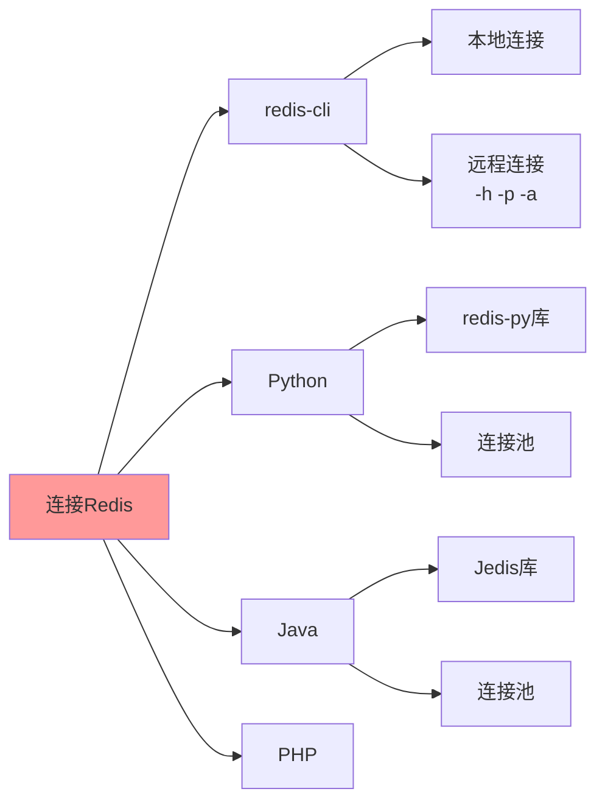

---

## 本章小结

本章我们学习了Redis，从简介到安装，从数据类型到持久化，从集群到缓存策略！

### 核心内容回顾

| 分类 | 内容 |
|------|------|
| **数据类型** | String、Hash、List、Set、ZSet |
| **持久化** | RDB（快照）、AOF（追加日志） |
| **高可用** | 主从复制、Sentinel哨兵、Cluster集群 |
| **缓存策略** | 穿透、击穿、雪崩 |
| **连接** | redis-cli、Python、Java |

### Redis vs 其他数据库

| 特点 | Redis | MySQL | PostgreSQL |
|------|-------|-------|------------|
| 数据存储 | 内存 | 磁盘 | 磁盘 |
| 数据结构 | 丰富 | 表格 | 表格+丰富类型 |
| 性能 | 极快（10万+ QPS） | 快（1万 QPS） | 快（1万 QPS） |
| 适用场景 | 缓存、会话、排行榜 | 普通业务 | 复杂业务 |

### 下章预告

下一章我们将学习 **消息队列**，这是现代分布式系统的核心组件之一。我们会学习RabbitMQ和Kafka，敬请期待！

> **趣味彩蛋**：Redis的作者Antirez曾经说过："Redis的代码量只有2万行，但功能比你想象的强大得多！"
> 
> 是的，有时候简单才是王道。一行 `SET key value`，背后是十几年的精心设计。
> 
> 记住：**用好Redis，性能翻10倍不是梦！但用不好，数据全丢泪两行！** 🚀


