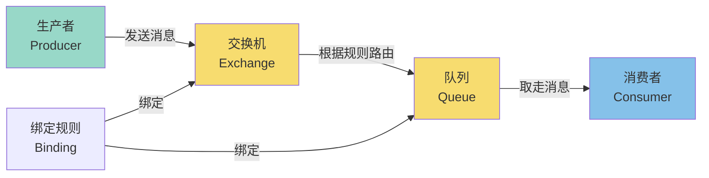
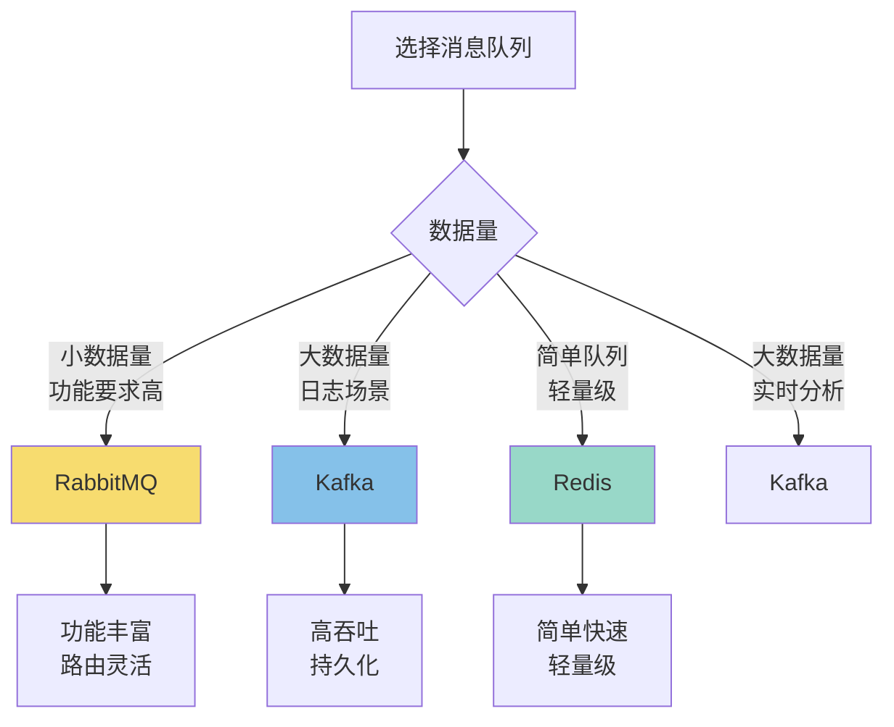
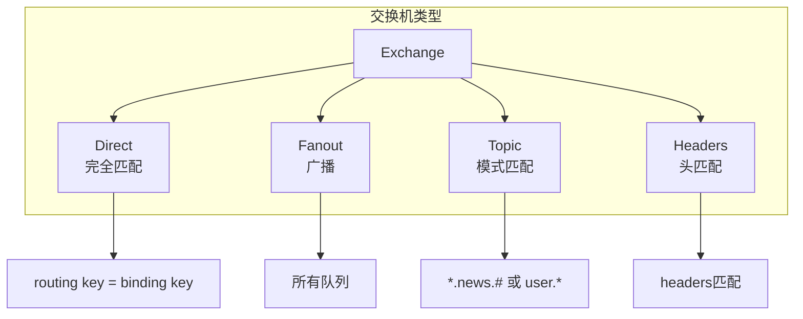
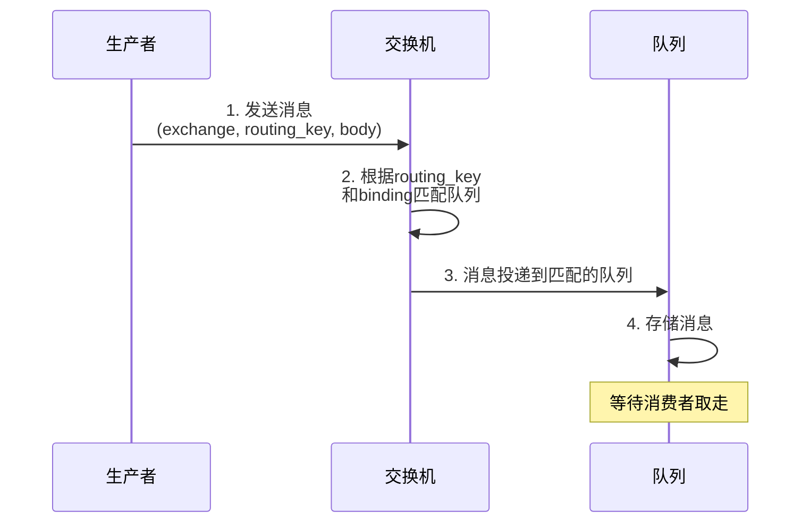
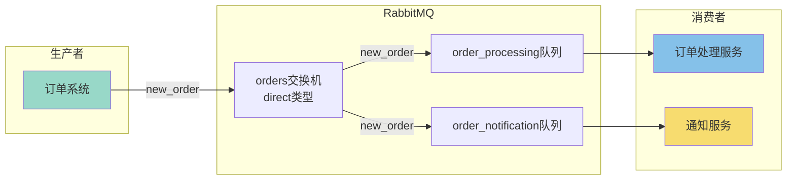

+++
title = "第47章：消息队列"
weight = 470
date = "2026-03-24T13:18:28+08:00"
type = "docs"
description = ""
isCJKLanguage = true
draft = false
+++


# 第四十七章：消息队列

## 47.1 消息队列简介

### 消息队列是什么？

想象一下这个场景：

你去快餐店点餐：
- **没有消息队列**：你站在柜台前等，厨师做完你的汉堡，你才能走。后面的人都在排队等。
- **有消息队列**：你点完餐，拿了号码牌，找个位置坐下玩手机。厨师做完你的汉堡，叫你的号，你来取。

**消息队列**就是这个"号码牌系统"！它让**发送方**和**接收方**不用一直互相等待，可以异步处理。

### 为什么需要消息队列？

**没有消息队列的世界：**

```
用户下单 → 系统处理 → 发短信通知 → 发邮件通知 → 更新库存 → 返回结果
                                ↓
                         如果发邮件挂了？
                         整个流程都失败！
```

**有消息队列的世界：**

```
用户下单 → 系统处理 → 写入消息队列 → 立即返回"下单成功"
                ↓
        邮件服务：从队列取消息 → 发邮件
        库存服务：从队列取消息 → 更新库存
        通知服务：从队列取消息 → 发短信
        
        任何服务挂了？没关系，消息还在队列里，慢慢处理！
```

### 消息队列的四大好处

| 好处 | 说明 | 比喻 |
|------|------|------|
| **异步处理** | 非核心流程异步执行，提升响应速度 | 点餐后等叫号 |
| **削峰填谷** | 高峰期消息堆积，低峰期慢慢处理 | 火车站分流 |
| **解耦** | 生产者和消费者互不影响 | 快递柜 |
| **可靠传输** | 消息持久化，保证不丢失 | 挂号信 |

### 消息队列的核心概念



> **流程解释**：生产者把消息扔给交换机，交换机根据"绑定规则"决定消息该去哪个队列，消费者再从队列里取走消息。这就像：外卖小哥（生产者）把外卖送到前台（交换机），前台根据你的手机尾号（绑定规则）把你的餐放到对应货架（队列），你自己（消费者）去取。

**核心组件：**

| 组件 | 说明 |
|------|------|
| **Producer（生产者）** | 发送消息的应用 |
| **Consumer（消费者）** | 接收消息的应用 |
| **Broker（代理）** | 消息队列服务器，存储和转发消息 |
| **Queue（队列）** | 存储消息的容器 |
| **Exchange（交换机）** | 决定消息路由到哪个队列 |
| **Message（消息）** | 传输的数据单元 |

### 两种消息模型

**1. 点对点模型（Queue）**

```
生产者1 ──┐
生产者2 ──┼──→ 队列 ──→ 消费者1
生产者3 ──┘         └──→ 消费者2（竞争消费，一条消息只能被一个消费者消费）
```

一条消息只能被**一个消费者**消费。

**2. 发布订阅模型（Pub/Sub）**

```
生产者 ──→ 交换机 ──→ 队列1 ──→ 消费者1
                 ├──→ 队列2 ──→ 消费者2
                 └──→ 队列3 ──→ 消费者3
```

一条消息可以被**所有订阅的消费者**消费。

### 主流消息队列对比

| 特性 | RabbitMQ | Kafka | Redis |
|------|----------|-------|-------|
| **吞吐量** | 中（万级/秒） | 高（百万/秒） | 高（十万/秒） |
| **延迟** | 低（微秒级） | 低（毫秒级） | 极低（微秒级） |
| **消息持久化** | 支持 | 支持 | 可配置 |
| **消息堆积** | 受限于内存 | 优秀（磁盘） | 受限于内存 |
| **功能丰富度** | 非常丰富 | 一般 | 较少 |
| **复杂度** | 中等 | 中等 | 低 |
| **适用场景** | 企业级应用 | 大数据、日志 | 简单队列、缓存 |



### 消息队列的常见问题

| 问题 | 说明 | 解决思路 |
|------|------|----------|
| **消息丢失** | 网络问题或Broker挂了 | 持久化 + 确认机制 |
| **消息重复** | 消费者挂了导致重发 | 幂等性处理 |
| **顺序消息** | 要求消息按顺序处理 | 单队列 + 单消费者 |
| **消息堆积** | 消费者处理不过来 | 增加消费者 + 扩容 |

### 小结

消息队列是现代分布式系统的核心组件：
- **异步处理**：提升系统响应速度
- **解耦**：生产者和消费者独立
- **削峰**：应对流量高峰
- **可靠传输**：保证消息不丢失

下一节我们将学习RabbitMQ，这是功能最丰富的消息队列！

## 47.2 RabbitMQ

### RabbitMQ简介

**RabbitMQ** 是用Erlang语言开发的消息队列软件，实现了AMQP（高级消息队列协议）标准。

**AMQP是什么？**
Advanced Message Queuing Protocol（高级消息队列协议），是一种网络协议，定义了消息如何路由和传递。

**RabbitMQ的特点：**
- 功能最丰富
- 支持多种消息模式
- 灵活的路由规则
- 管理界面友好
- 社区活跃，文档完善

### 47.2.1 安装

**Docker安装（最简单）**

```bash
# 拉取RabbitMQ镜像（带管理界面）
docker pull rabbitmq:3.12-management

# 运行RabbitMQ容器
docker run -d \
    --name rabbitmq \
    -p 5672:5672 \
    -p 15672:15672 \
    -e RABBITMQ_DEFAULT_USER=admin \
    -e RABBITMQ_DEFAULT_PASS=Admin123 \
    rabbitmq:3.12-management

# 查看运行状态
docker ps

# 查看日志
docker logs rabbitmq
```

**Ubuntu/Debian安装**

```bash
# 安装Erlang（RabbitMQ依赖Erlang）
sudo apt update
sudo apt install -y erlang

# 添加RabbitMQ仓库
curl -fsSL https://packagecloud.io/rabbitmq/rabbitmq-server/gpgkey | sudo gpg --dearmor -o /usr/share/keyrings/rabbitmq.gpg

# 安装RabbitMQ
sudo apt update
sudo apt install -y rabbitmq-server

# 启动服务
sudo systemctl start rabbitmq-server
sudo systemctl enable rabbitmq-server

# 查看状态
sudo systemctl status rabbitmq-server
```

**访问管理界面**

安装完成后，可以通过浏览器访问RabbitMQ管理界面：
- 地址：`http://localhost:15672`
- 默认账号：`guest` / `guest`（或你自己设置的账号）
- 端口15672是管理界面，5672是AMQP协议端口

### 47.2.2 交换机

交换机（Exchange）是RabbitMQ的核心组件，它决定了消息路由到哪个队列。

**交换机有四种类型：**

| 类型 | 说明 | 路由规则 |
|------|------|----------|
| **direct** | 完全匹配 | routing key = binding key |
| **fanout** | 广播 | 所有绑定的队列 |
| **topic** | 模式匹配 | routing key匹配binding key |
| **headers** | 消息头匹配 | headers属性匹配 |



**创建交换机**

**方式1：通过管理界面创建**

1. 打开 `http://localhost:15672`
2. 登录后点击 "Exchanges" 标签
3. 点击 "Add a new exchange"
4. 填写信息：
   - Name: `my-exchange`
   - Type: `direct`
   - Durability: `Durable`
5. 点击 "Add exchange"

**方式2：通过命令行**

```bash
# 使用rabbitmqadmin创建交换机
docker exec rabbitmq rabbitmqadmin declare exchange \
    name=my-exchange \
    type=direct \
    durable=true
```

### 47.2.3 队列

队列（Queue）是存储消息的地方。

**队列的属性：**

| 属性 | 说明 |
|------|------|
| **Name** | 队列名称 |
| **Durable** | 持久化，Broker重启后队列还在 |
| **Exclusive** | 独占，只能有一个连接 |
| **Auto-delete** | 自动删除，最后一个消费者消失时删除 |
| **Arguments** | 额外参数 |

**创建队列**

**方式1：通过管理界面**
1. 打开 "Queues" 标签
2. 点击 "Add a new queue"
3. 填写信息：
   - Name: `my-queue`
   - Durability: `Durable`
4. 点击 "Add queue"

**方式2：通过命令行**

```bash
# 声明队列
docker exec rabbitmq rabbitmqadmin declare queue \
    name=my-queue \
    durable=true

# 列出所有队列
docker exec rabbitmq rabbitmqadmin list queues

# 绑定队列到交换机
docker exec rabbitmq rabbitmqadmin declare binding \
    source=my-exchange \
    destination=my-queue \
    routing_key=my-key
```

### 47.2.4 生产者

生产者（Producer）发送消息到交换机。

**Python发送消息示例**

```python
# 安装pika库
pip install pika

# producer.py
import pika

# 连接RabbitMQ
connection = pika.BlockingConnection(
    pika.ConnectionParameters('localhost')
)
channel = connection.channel()

# 声明交换机
channel.exchange_declare(
    exchange='my-exchange',
    exchange_type='direct',
    durable=True
)

# 发送消息
message = "Hello RabbitMQ!"
channel.basic_publish(
    exchange='my-exchange',
    routing_key='my-key',  # 路由键
    body=message,
    properties=pika.BasicProperties(
        delivery_mode=2,  # 持久化消息
        content_type='text/plain'
    )
)

print(f" [x] Sent: {message}")

connection.close()
```

**发送消息流程**



### 47.2.5 消费者

消费者（Consumer）从队列接收消息。

**Python接收消息示例**

```python
# consumer.py
import pika

# 连接RabbitMQ
connection = pika.BlockingConnection(
    pika.ConnectionParameters('localhost')
)
channel = connection.channel()

# 声明队列（和发送者保持一致）
channel.queue_declare(queue='my-queue', durable=True)

# 定义回调函数
def callback(ch, method, properties, body):
    print(f" [x] Received: {body.decode()}")
    
    # 模拟处理
    import time
    time.sleep(1)
    
    # 确认消息已处理
    ch.basic_ack(delivery_tag=method.delivery_tag)

# 设置QoS（预取数量）
channel.basic_qos(prefetch_count=1)

# 开始消费
channel.basic_consume(
    queue='my-queue',
    on_message_callback=callback,
    auto_ack=False  # 手动确认
)

print(' [*] Waiting for messages. To exit press CTRL+C')
channel.start_consuming()
```

**完整示例：点对点消息**

```python
# producer.py - 生产者
import pika

connection = pika.BlockingConnection(pika.ConnectionParameters('localhost'))
channel = connection.channel()

# 声明交换机
channel.exchange_declare(exchange='orders', exchange_type='direct', durable=True)

# 发送订单消息
order = '{"order_id": 12345, "amount": 99.99, "user": "xiaoming"}'
channel.basic_publish(
    exchange='orders',
    routing_key='new_order',
    body=order,
    properties=pika.BasicProperties(
        delivery_mode=2,
        content_type='application/json'
    )
)

print(f" [x] Order sent: {order}")
connection.close()
```

```python
# consumer.py - 消费者
import pika
import json

connection = pika.BlockingConnection(pika.ConnectionParameters('localhost'))
channel = connection.channel()

# 声明交换机和队列
channel.exchange_declare(exchange='orders', exchange_type='direct', durable=True)
channel.queue_declare(queue='order_processing', durable=True)

# 绑定队列到交换机
channel.queue_bind(exchange='orders', queue='order_processing', routing_key='new_order')

def process_order(ch, method, properties, body):
    order = json.loads(body)
    print(f" [x] Processing order: {order}")
    
    # 模拟订单处理（库存扣减、支付等）
    print(f"     Order {order['order_id']} processed!")
    
    # 确认消息
    ch.basic_ack(delivery_tag=method.delivery_tag)

channel.basic_qos(prefetch_count=1)
channel.basic_consume(queue='order_processing', on_message_callback=process_order)

print(' [*] Waiting for orders...')
channel.start_consuming()
```

### 完整的RabbitMQ示例



```python
# 设置完整环境的脚本
import pika

def setup_rabbitmq():
    connection = pika.BlockingConnection(pika.ConnectionParameters('localhost'))
    channel = connection.channel()
    
    # 1. 创建交换机
    channel.exchange_declare(
        exchange='orders',
        exchange_type='direct',
        durable=True
    )
    
    # 2. 创建队列
    channel.queue_declare(queue='order_processing', durable=True)
    channel.queue_declare(queue='order_notification', durable=True)
    
    # 3. 绑定队列到交换机
    channel.queue_bind(
        exchange='orders',
        queue='order_processing',
        routing_key='new_order'
    )
    channel.queue_bind(
        exchange='orders',
        queue='order_notification',
        routing_key='new_order'
    )
    
    print(" [*] RabbitMQ setup complete!")
    connection.close()

if __name__ == '__main__':
    setup_rabbitmq()
```

### 小结

RabbitMQ核心概念：
- **Exchange（交换机）**：决定消息路由到哪个队列
- **Queue（队列）**：存储消息
- **Binding（绑定）**：交换机和队列的关联
- **Routing Key（路由键）**：消息的路由规则

下一节我们将学习Kafka，这是大数据场景下的消息队列！

## 47.3 Kafka

### Kafka简介

**Kafka** 是Apache基金会的开源项目，最初由LinkedIn开发，用于处理海量的日志数据。

**Kafka的特点：**
- 超高吞吐量（百万/秒）
- 分布式架构
- 消息持久化到磁盘
- 支持消息回溯
- 适合大数据场景

### 47.3.1 安装

**Docker安装（最简单）**

```bash
# 创建一个网络（可选）
docker network create kafka-net

# 启动Zookeeper（Kafka依赖Zookeeper）
docker run -d \
    --name zookeeper \
    -p 2181:2181 \
    confluentinc/cp-zookeeper:latest \
    environment ZOOKEEPER_CLIENT_PORT=2181

# 启动Kafka
docker run -d \
    --name kafka \
    --network kafka-net \
    -p 9092:9092 \
    -e KAFKA_BROKER_ID=1 \
    -e KAFKA_ZOOKEEPER_CONNECT=zookeeper:2181 \
    -e KAFKA_ADVERTISED_LISTENERS=PLAINTEXT://localhost:9092 \
    -e KAFKA_OFFSETS_TOPIC_REPLICATION_FACTOR=1 \
    confluentinc/cp-kafka:latest

# 查看Kafka日志
docker logs -f kafka
```

**Kafka管理工具（可选）**

```bash
# 安装kafka-manager（一个Web管理界面）
docker run -d \
    --name kafka-manager \
    -p 9000:9000 \
    -e ZK_HOSTS=zookeeper:2181 \
    hlebalbau/kafka-manager:stable
```

### 47.3.2 Topic

Topic（主题）是Kafka中消息的分类单位。

**Topic的概念：**
- 类似文件夹
- 消息按Topic分类存储
- 生产者和消费者通过Topic进行消息传递

**创建Topic**

```bash
# 进入Kafka容器
docker exec -it kafka bash

# 创建Topic
kafka-topics.sh --create \
    --bootstrap-server localhost:9092 \
    --topic my-topic \
    --partitions 3 \
    --replication-factor 1

# 查看Topic列表
kafka-topics.sh --list --bootstrap-server localhost:9092

# 查看Topic详情
kafka-topics.sh --describe --bootstrap-server localhost:9092 --topic my-topic
```

执行结果：

```
Topic: my-topic    PartitionCount: 3    ReplicationFactor: 1
Topic: my-topic    Partition: 0    Leader: 1    Replicas: 1    Isr: 1
Topic: my-topic    Partition: 1    Leader: 1    Replicas: 1    Isr: 1
Topic: my-topic    Partition: 2    Leader: 1    Replicas: 1    Isr: 1
```

**Topic的配置参数**

| 参数 | 说明 |
|------|------|
| `partitions` | 分区数，决定并行度 |
| `replication-factor` | 副本数，决定数据冗余 |
| `retention.ms` | 消息保留时间 |
| `cleanup.policy` | 清理策略（delete/compact） |

### 47.3.3 分区

分区（Partition）是Kafka实现并行和扩展性的关键！

**分区的概念：**

```
Topic: my-topic
├── Partition 0: [msg1, msg2, msg5, msg8]
├── Partition 1: [msg3, msg4, msg9]
└── Partition 2: [msg6, msg7, msg10]
```

**为什么需要分区？**

1. **并行处理**：多个分区可以并行生产/消费
2. **水平扩展**：可以增加分区数来提升处理能力
3. **负载均衡**：消息分散到不同分区

**分区策略：**

```python
# 默认策略：根据key的hash值分配分区
# 有key的消息，相同key一定到同一个分区
producer.send('my-topic', key='user:1', value='message')

# 无key的消息：轮询分配
producer.send('my-topic', value='message1')
producer.send('my-topic', value='message2')  # 会分到下一个分区
```

### 47.3.4 消费者组

消费者组（Consumer Group）是一组消费者的集合。

**消费者组的特点：**

```mermaid
flowchart TB
    subgraph "Consumer Group: order-service"
        C1[消费者1<br/>消费Partitions 0,1]
        C2[消费者2<br/>消费Partition 2]
    end
    
    subgraph "Topic: orders"
        P0[Partition 0]
        P1[Partition 1]
        P2[Partition 2]
    end
    
    P0 --> C1
    P1 --> C1
    P2 --> C2
    
    Note over C1,C2: 同一消费者组内，消息只被消费一次
```

- 同一消费者组内，**一条消息只被一个消费者消费**
- 不同消费者组，**可以重复消费同一条消息**
- 分区数和消费者数最好匹配

**创建消费者组：**

```bash
# 创建消费者组
kafka-consumer-groups.sh --create \
    --bootstrap-server localhost:9092 \
    --group my-group \
    --topic my-topic

# 查看消费者组列表
kafka-consumer-groups.sh --list --bootstrap-server localhost:9092

# 查看消费者组详情
kafka-consumer-groups.sh --describe \
    --bootstrap-server localhost:9092 \
    --group my-group
```

**Python生产者示例：**

```python
# 安装kafka库
pip install kafka-python

# producer.py
from kafka import KafkaProducer

# 创建生产者
producer = KafkaProducer(
    bootstrap_servers=['localhost:9092'],
    value_serializer=lambda v: v.encode('utf-8')
)

# 发送消息
for i in range(10):
    message = f"Message {i}"
    producer.send('my-topic', value=message)
    print(f" [x] Sent: {message}")

# 确保所有消息发送完成
producer.flush()
producer.close()
```

**Python消费者示例：**

```python
# consumer.py
from kafka import KafkaConsumer

# 创建消费者
consumer = KafkaConsumer(
    'my-topic',
    bootstrap_servers=['localhost:9092'],
    group_id='my-group',  # 消费者组
    auto_offset_reset='earliest',  # 从最早的消息开始消费
    value_deserializer=lambda v: v.decode('utf-8')
)

print(' [*] Waiting for messages...')

for message in consumer:
    print(f" [x] Received: {message.value}")
    print(f"      Partition: {message.partition}, Offset: {message.offset}")
```

### Kafka vs RabbitMQ

| 对比项 | Kafka | RabbitMQ |
|--------|-------|----------|
| **吞吐量** | 百万/秒 | 万/秒 |
| **延迟** | 毫秒级 | 微秒级 |
| **消息模型** | 发布/订阅 | 发布/订阅 + 点对点 |
| **消息顺序** | 分区内有序 | 单队列有序 |
| **消息持久化** | 优秀（磁盘） | 一般（内存+磁盘） |
| **消息回溯** | 支持 | 不支持 |
| **适用场景** | 日志、大数据 | 企业应用 |

### 小结

Kafka核心概念：
- **Topic（主题）**：消息分类
- **Partition（分区）**：并行处理
- **Consumer Group（消费者组）**：消息消费
- **Offset（偏移量）**：消息位置

**选择建议：**
- 企业应用、灵活路由 → RabbitMQ
- 大数据、日志处理 → Kafka
- 简单队列、追求性能 → Redis

---

## 本章小结

本章我们学习了消息队列的基础知识和两大主流实现：RabbitMQ和Kafka。

### 消息队列的核心价值

| 价值 | 说明 |
|------|------|
| **异步处理** | 提升系统响应速度 |
| **削峰填谷** | 应对流量高峰 |
| **解耦** | 生产者和消费者独立 |
| **可靠传输** | 保证消息不丢失 |

### RabbitMQ vs Kafka

| 特性 | RabbitMQ | Kafka |
|------|----------|-------|
| **吞吐量** | 中等（万级） | 极高（百万级） |
| **延迟** | 低（微秒级） | 毫秒级 |
| **消息模型** | 多 | 发布/订阅 |
| **持久化** | 内存+磁盘 | 磁盘 |
| **消息回溯** | ❌ | ✅ |
| **适用场景** | 企业应用 | 大数据、日志 |

### 核心概念对比

| RabbitMQ | Kafka |
|----------|-------|
| Exchange（交换机） | Topic（主题） |
| Binding（绑定） | Partition（分区） |
| Routing Key（路由键） | Key（消息键） |
| Consumer（消费者） | Consumer Group（消费者组） |
| Queue（队列） | Partition（分区） |

### 何时使用消息队列？

| 场景 | 推荐 |
|------|------|
| 异步任务处理 | RabbitMQ / Redis |
| 订单处理 | RabbitMQ |
| 日志收集 | Kafka |
| 实时流处理 | Kafka |
| 事件驱动架构 | RabbitMQ / Kafka |
| 简单消息通知 | Redis |

### 下章预告

恭喜你完成了数据库基础系列的学习！

从关系型数据库（MySQL/MariaDB、PostgreSQL）到非关系型数据库（MongoDB、Redis）再到消息队列（RabbitMQ、Kafka），你已经掌握了现代后端开发的核心技术！

> **趣味彩蛋**：消息队列有个有趣的别名，叫"消息中间件"。
> 
> 为什么叫"中间件"？因为它站在应用程序和数据库之间，就像一个称职的中间人：
> 
> "生产者说：'我有个消息'
> 消费者说：'我等着呢'
> 中间件说：'你们不用直接聊了，我替你们传话！'"
> 
> 记住：**没有消息队列的系统，就像没有快递柜的快递公司——容易乱，容易丢！** 📦


