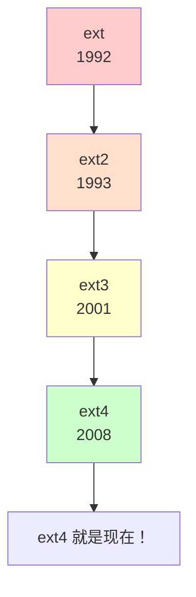
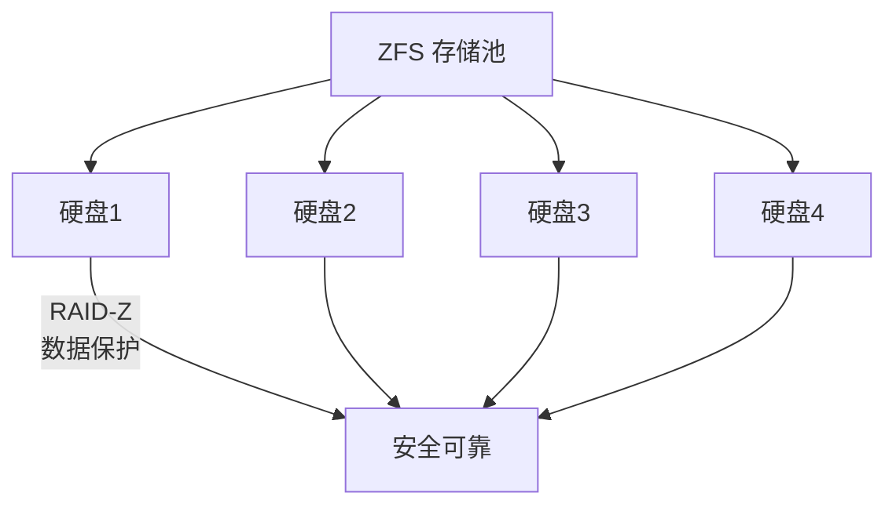
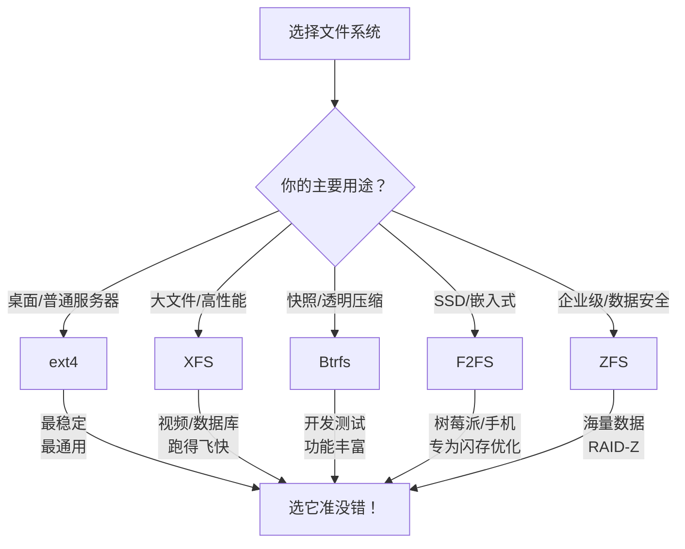
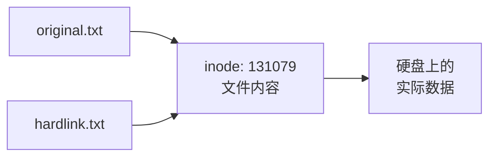

+++
title = "第11章：文件系统基础"
weight = 110
date = "2026-03-24T13:18:28+08:00"
type = "docs"
description = ""
isCJKLanguage = true
draft = false
+++


# 第十一章：文件系统基础
## 11.1 什么是文件系统？文件系统的作用

想象一下：你有一个超级大的仓库，里面堆满了各种各样的货物。有家具、有食物、有衣服、还有你高中时偷偷藏起来的情书...但是！这个仓库**没有任何架子、没有标签、没有任何整理系统**！

乱不乱？太乱了！你想找一个特定的东西？除非你有特异功能，否则你得把整个仓库翻个底朝天！

**这就是没有文件系统的硬盘的样子。**

### 文件系统是什么？

**文件系统**（File System）就是硬盘的"仓库管理系统"！它负责：

1. **存放数据**：把你的文件整齐地存放在硬盘上
2. **查找定位**：想找某个文件？文件系统帮你快速定位
3. **权限管理**：谁可以读？谁可以写？文件系统说了算
4. **组织结构**：文件夹、子文件夹，一层一层整整齐齐

> 专业词汇：**文件系统**（File System）是一种存储和组织数据的方法。它定义了文件如何命名、存储、检索和管理。不同的文件系统有不同的"管理策略"，就像不同的仓库有不同的货架系统。

### 类比理解

| 现实世界 | 文件系统 |
|----------|----------|
| 仓库 | 硬盘 |
| 货架 | 文件的存储位置 |
| 标签系统 | 文件名 |
| 管理员 | 文件系统 |
| 找东西 | 读取文件 |
| 放东西 | 写入文件 |

### 为什么需要文件系统？

没有文件系统，硬盘就是一堆毫无意义的0和1。有了文件系统，这堆0和1就变成了：

- 你的自拍照片
- 你写的毕业论文
- 你珍藏的电影
- 你偷偷浏览过的...咳咳，这个我没看见


> 简单来说：文件系统就是硬盘的"翻译官"，它把人类能看懂的文件名、文件夹结构，翻译成硬盘能理解的存储方式。没有它，你的电脑就是个文盲！

---

## 11.2 文件系统发展历程

Linux 的文件系统可不是石头缝里蹦出来的，它也有自己的"族谱"和"进化史"。让我们穿越时空，看看文件系统是如何一步步演进的！

### 11.2.1 ext：第一个 Linux 文件系统

**ext** = **Ext**ended **F**ile **S**ystem，扩展文件系统。

这是 Linux 的"开山鼻祖"，1992年诞生，由 Remy Card 开发。那时候的 Linux 还是个"小朋友"，ext 就是它的第一个"收纳盒"。

```bash
# ext 文件系统的特点：
# - 最大文件大小：2GB
# - 最大文件系统大小：2GB
# - 没有日志功能
# - 性能一般
```

但是！ext 有个致命问题——**经常断电会丢数据**！想象一下，你写了一万字的论文，电脑突然断电...恭喜你，论文可能没了！

> 趣闻：ext 听起来很古老对吧？但它奠定了 Linux 文件系统的基本架构。后来者都是在它的基础上缝缝补补、升级换代的！

### 11.2.2 ext2：无日志文件系统

**ext2** = **E**xtended **F**ile **S**ystem v2，第二代扩展文件系统。

1993年，ext2 横空出世！它是 ext 的升级版，稳定性和性能都有了显著提升。

```bash
# ext2 文件系统的特点：
# - 最大文件大小：2TB
# - 最大文件系统大小：8TB
# - 没有日志功能（这是硬伤！）
# - 性能比 ext 好
# - 曾经是 Linux 的主力文件系统
```

ext2 最大的特点就是**没有日志**。什么是日志？后面会详细讲。简单说，日志就像飞机的"黑匣子"，记录了所有操作。**没有日志的文件系统，就像没有黑匣子的飞机——出了事你都不知道怎么摔的！**

ext2 至今还有一些"死忠粉"，因为它适合 U 盘和 SD 卡（没有日志开销），但桌面和服务器领域基本已经退休了。

### 11.2.3 ext3：带日志的文件系统

**ext3** = **E**xtended **F**ile **S**ystem v3，第三代扩展文件系统。

2001年，ext3 来了！这是 ext2 的"Plus 版"，最大的改进就是**加入了日志功能**！

```bash
# ext3 文件系统的特点：
# - 所有 ext2 的优点
# - 新增日志功能！
# - 三种日志模式：
#   - journal：完整记录数据日志，最安全但最慢
#   - ordered：只记录元数据日志，中等
#   - writeback：只记录操作顺序，最快但最不安全
# - 最大文件系统大小：16TB
```

有了日志，ext3 在突然断电或崩溃后，**恢复速度比 ext2 快100倍**！再也不用等漫长的文件系统检查（fsck）了！

> 打个比方：ext2 像是一个不做笔记的学生，考试前复习全靠翻书；ext3 像是一个认真做笔记的学生，复习起来又快又准！

### 11.2.4 ext4：当前主流

**ext4** = **E**xtended **F**ile **S**ystem v4，第四代扩展文件系统。

2008年，ext4 正式发布！这是目前**最流行、使用最广泛**的 Linux 文件系统！大多数 Linux 发行版的默认选择！

```bash
# ext4 文件系统的特点：
# - 最大文件大小：16TB
# - 最大文件系统大小：1EB（艾字节！1EB = 10亿TB）
# - 支持日志
# - 支持extent（区间）存储：大幅提升大文件性能
# - 支持延迟分配：提升性能
# - 向后兼容 ext3 和 ext2
# - 修复了 ext3 的一些设计缺陷
```

ext4 是 ext 家族的"集大成者"，它继承了前辈的所有优点，同时加入了大量新特性。就像 iPhone 4 对 iPhone 家族的意义——**一款改变一切的产品**！



> ext4 的 extent 存储：以前的文件系统像是在停车场里一个个找车位，extent 则是直接给你分配一个连续的车位区间！大文件读写快到飞起！

---

## 11.3 XFS 文件系统：高性能，适合大文件

**XFS** 是一种高性能的日志文件系统，特别擅长处理**大文件**和**高并发**。它诞生于1993年的 Silicon Graphics（SGI），最初是为了处理 3D 图形工作站的大型文件而设计的。

### XFS 的特点

```bash
# XFS 文件系统的特点：
# - 最大文件大小：8EB（比 ext4 还大！）
# - 最大文件系统大小：16EB（真正的大块头！）
# - 高性能，特别是大文件
# - 支持日志
# - 支持在线扩容（可以动态调整大小！）
# - 元数据操作性能优秀
```

### XFS vs ext4

| 特性 | XFS | ext4 |
|------|-----|------|
| 最大文件系统大小 | 16EB | 1EB |
| 大文件性能 | 极好 | 好 |
| 小文件性能 | 一般 | 很好 |
| 修复速度 | 快 | 快 |
| 在线扩容 | 支持 | 有限支持 |

### 谁适合用 XFS？

- **视频处理**：剪辑 4K、8K 视频？XFS 是你的菜！
- **数据分析**：处理巨大的数据集？XFS 跑得飞快！
- **服务器**：高并发访问？XFS 稳得一批！
- **RHEL/CentOS**：这些发行版默认就是 XFS！

```bash
# 查看系统上的 XFS 文件系统
df -T | grep xfs

# 创建 XFS 文件系统
mkfs.xfs /dev/sdb1

# 查看 XFS 文件系统信息
xfs_info /dev/sdb1
```

> 小贴士：如果你要存放大文件（视频、虚拟机镜像、数据库），XFS 通常比 ext4 表现更好。但如果你的场景是海量小文件（代码仓库、邮箱服务器），ext4 可能更合适！

---

## 11.4 Btrfs 文件系统：现代文件系统，Copy-on-Write

**Btrfs** = **B**-tree **f**ile **s**ystem，发音是"butter-fs"（黄油文件系统）。它是一种**现代**文件系统，由 Oracle 于2007年开发，2009年被合并入 Linux 内核主线！

### Btrfs 的核心理念

Btrfs 的设计目标：**一个能搞定一切的下一代文件系统**！它有很多企业级特性：

```bash
# Btrfs 的核心特性：

# 1. Copy-on-Write（写时复制）
#    想象一下：你有一本书，复制一本不需要重新抄一遍，
#    而是两个人"共享"同一本书，等有人要改的时候再复制！
#    快照秒建，效率爆棚！

# 2. 快照（Snapshot）
#    相当于系统的"时光机"！可以随时回到某个时间点

# 3. 透明压缩
#    文件自动压缩，读取时自动解压，你感觉不到！

# 4. 跨文件系统
#    可以把多个硬盘合并成一个逻辑分区！

# 5. 内置 RAID 支持
#    不需要 LVM 或硬件 RAID，Btrfs 自己就能做！

# 6. 在线修复
#    可以在挂载状态下修复损坏的元数据
```

### Btrfs vs ext4

| 特性 | Btrfs | ext4 |
|------|-------|------|
| Copy-on-Write | ✅ 原生支持 | ❌ 不支持 |
| 快照 | ✅ 内置 | ❌ 需要额外工具 |
| 透明压缩 | ✅ 原生支持 | ❌ 不支持 |
| 在线扩容 | ✅ 支持 | 有限支持 |
| RAID | ✅ 内置 | ❌ 需另外配置 |
| 稳定性 | 稍差（还在完善中） | 非常稳定 |

### Btrfs 使用示例

```bash
# 创建 Btrfs 文件系统
mkfs.btrfs /dev/sdb1

# 挂载
mount /dev/sdb1 /mnt

# 创建快照（需要先创建子卷）
btrfs subvolume create /mnt/data
btrfs subvolume snapshot /mnt/data /mnt/snapshot_2024

# 查看文件系统使用情况
btrfs filesystem df /mnt

# 查看空间使用
btrfs filesystem show
```

> 注意：Btrfs 虽然功能强大，但它毕竟是"年轻"的文件系统，在某些极端场景下可能不如 ext4 稳定。建议在生产环境使用前充分测试。有些 Linux 发行版（如 Fedora）把它作为默认文件系统，但像 Debian 和 RHEL 还是比较保守地默认使用 ext4 或 XFS。

---

## 11.5 ZFS 文件系统：无限可扩展，RAID-Z

**ZFS** = **Z**etta**f**ile **S**ystem，Zetta 是10的21次方，这是一个"野心勃勃"的命名——它的目标就是成为能存储海量数据的文件系统！

ZFS 最初由 Sun Microsystems 为 Solaris 开发（2005年），后来开源，是真正的"企业级"选手！

### ZFS 的杀手锏

```bash
# ZFS 的核心特性：

# 1. 无限可扩展
#    最大限制？ZB 级别（10亿 TB）！
#    基本上，你的硬盘阵列追不上 ZFS 的想象力！

# 2. RAID-Z
#    软件 RAID 的终极形态！数据安全性爆表！
#    再也不怕硬盘坏了！

# 3. 存储池（ZPOOL）概念
#    把多个硬盘变成一个"池子"，
#    想加硬盘？扔进去就行！

# 4. 写时复制（COW）
#    和 Btrfs 类似的机制，数据安全有保障

# 5. 数据完整性验证
#    每读取一次数据，ZFS 都会验证 checksum
#    默默守护你的数据！

# 6. 快照和克隆
#    快照零成本，克隆秒完成
```



### ZFS vs Btrfs

| 特性 | ZFS | Btrfs |
|------|-----|-------|
| 成熟度 | 非常成熟 | 相对年轻 |
| 最大存储 | ZB 级别 | 不如 ZFS |
| RAID | RAID-Z（强大） | 有限的 RAID |
| 内存需求 | 较高（8GB+ 推荐） | 较低 |
| Linux 原生支持 | 需要安装 zfs-dkms | 内核内置 |
| 许可证 | CDDL（和 GPL 不兼容） | GPL |

> 在 Linux 上使用 ZFS 需要加载额外的内核模块（通过 ZFS on Linux 项目）。如果你追求极致的数据安全和企业级特性，ZFS 是不二之选！但在 Linux 上，Btrfs 可能是更"原生"的选择。

---

## 11.6 F2FS 文件系统：闪存优化

**F2FS** = **F**lash-**F**riendly **F**ile **S**ystem，闪存友好的文件系统。

这个名字就告诉你它的特长——**为闪存（SSD、UFS、eMMC）而生**！

### 为什么需要专门的闪存文件系统？

传统的文件系统（如 ext4）是为**机械硬盘（HDD）**设计的。SSD 和机械硬盘的工作原理完全不同：

| 机械硬盘（HDD） | 固态硬盘（SSD） |
|-----------------|-----------------|
| 有机械臂，转动磁盘 | 没有机械部件，纯电子 |
| 随机读写慢 | 随机读写快 |
| 写入有磨损 | 写入有寿命限制（写入寿命） |
| 不需要考虑擦除 | 需要先擦除再写入 |
| 顺序写入快 | 顺序写入快 |

F2FS 就是针对 SSD 的特性优化设计的：

```bash
# F2FS 的优化策略：

# 1. 异地更新（Out-of-Place Update）
#    不直接覆盖旧数据，而是写入新位置
#    减少闪存的写入放大（Write Amplification）！

# 2. 垃圾回收（GC）
#    后台自动清理无效数据块
#    保持闪存性能！

# 3. 断电保护
#    专门为嵌入式设备优化
#    突然断电也不怕丢数据！

# 4. TRIM 支持
#    告诉 SSD 哪些数据块可以回收
#    让 SSD 保持最佳性能！
```

### F2FS 使用场景

```bash
# 创建 F2FS 文件系统
mkfs.f2fs /dev/sdb1

# 挂载
mount -t f2fs /dev/sdb1 /mnt

# 查看 F2FS 信息
cat /proc/fs/f2fs/dev/checkpoint
```

> F2FS 是三星电子开发的，所以如果你用的是三星的 SSD 或手机（Android 很多用 F2FS），F2FS 能让你的设备性能更好！对于普通桌面 Linux 用户来说，ext4 依然是最佳选择，但如果你在树莓派或者嵌入式设备上跑 Linux，F2FS 值得一试！

---

## 11.7 文件系统对比与选择建议

现在我们已经认识了这么多种文件系统，是时候来一个"华山论剑"了！

### 11.7.1 ext4：通用场景

**ext4** 是 Linux 的"万能选手"，**适合90%的使用场景**！

```bash
# ext4 适用场景：
# - 桌面 Linux（Ubuntu、Linux Mint 等）
# - 中小企业服务器
# - 普通虚拟化环境
# - 日志服务器
# - 开发测试环境
```

> 如果你不知道选什么，选 ext4 准没错！它是经过时间考验的"老大哥"，稳定、可靠、社区支持好！

### 11.7.2 XFS：大文件、高性能

**XFS** 适合**需要处理大量大文件**的场景！

```bash
# XFS 适用场景：
# - 视频编辑工作站
# - 大型数据库（PostgreSQL、MySQL）
# - 科学计算和数据分析
# - 高性能计算（HPC）
# - 大型文件服务器（NFS、Samba）
# - RHEL/CentOS 服务器（默认选择！）
```

> 如果你经常处理 4K/8K 视频、或者跑大型数据库，XFS 能让你的硬盘"飞起来"！

### 11.7.3 Btrfs：高级功能

**Btrfs** 适合**需要快照、备份等高级功能**的场景！

```bash
# Btrfs 适用场景：
# - 需要频繁快照的开发测试环境
# - 需要透明压缩的存储空间受限环境
# - 桌面 Linux 用户（Fedora 默认）
# - 愿意尝试新技术的爱好者
```

> Btrfs 的快照功能对于开发测试来说简直是神器！可以随时回滚，测试新功能再也不怕搞砸了！



---

## 11.8 FHS 文件系统标准：目录规范

**FHS** = **F**ilesystem **H**ierarchy **S**tandard，文件系统层次结构标准。

这是一个"约定俗成"的规范，规定了 Linux 各目录应该放什么内容。为什么要规范？因为这样程序员开发软件时，就知道"配置文件应该放 /etc"、"日志应该放 /var/log"！

> 简单理解：FHS 就是 Linux 的"装修规范"——厨房放灶台，卫生间放马桶，**不能乱来**！

### FHS 的核心目录

```bash
# /           根目录，文件系统的起点
# ├── /bin    基本命令（ls、cp、mv、rm 等）
# ├── /boot   启动文件（内核、GRUB）
# ├── /dev    设备文件（硬盘、键盘、鼠标）
# ├── /etc    系统配置文件
# ├── /home   普通用户家目录
# ├── /root   root 用户家目录
# ├── /lib    共享库文件
# ├── /media  可移动媒体（U 盘、光盘）
# ├── /mnt    临时挂载点
# ├── /opt    可选应用软件
# ├── /proc   虚拟文件系统（内核信息）
# ├── /sbin   系统管理命令
# ├── /srv    服务数据
# ├── /sys    虚拟文件系统（系统信息）
# ├── /tmp    临时文件
# ├── /usr    用户程序和数据
# └── /var    可变数据（日志、缓存）
```

> 为什么要有这个规范？想象一下，如果每个 Linux 发行版都把配置文件放在不同的地方，管理员得疯了！有了 FHS，世界大同，换个发行版也不用手忙脚乱找配置文件了！

---

## 11.9 inode 是什么？

这是 Linux 文件系统中**最重要**的概念之一！理解 inode，你就能理解 Linux 是如何"真正"存储文件的！

### 11.9.1 inode 数据结构

**inode** = **i**ndex **node**，索引节点。

当你创建一个文件时，Linux 会做两件事：
1. 把文件内容存放在硬盘的某个位置
2. 创建一个 **inode** 记录这个文件的"身份证信息"

```bash
# inode 里存储的信息（元数据）：
# - 文件大小
# - 文件所有者（UID、GID）
# - 文件权限（rwx）
# - 创建时间（ctime）
# - 修改时间（mtime）
# - 访问时间（atime）
# - 文件类型（普通文件、目录、链接...）
# - 文件数据块的位置（重要！）
# - 硬链接计数
```

> 打个比方：inode 就像是图书馆的**图书卡片**！卡片上写着书名、作者、在哪个书架，但卡片本身不是书！文件内容存在"书架"上，而 inode 是记录文件信息的"卡片"！

### 11.9.2 inode 编号

每个文件都有一个独一无二的 inode 编号：

```bash
# 查看文件的 inode 编号
ls -li file.txt

# 输出：
# 131079 -rw-r--r--  1 user user  123 Jan 15 10:30 file.txt
# ↑ 这个 131079 就是 inode 编号！
```

> inode 编号就像你的身份证号，每个文件都只有一个！两个人不能有同一个身份证号，两个文件也不能有同一个 inode 编号！

### 11.9.3 inode 数量限制

**重要**：inode 不是无限的！格式化硬盘时，系统会根据磁盘大小分配固定数量的 inode！

```bash
# 查看文件系统 inode 数量
df -i

# 输出示例：
# Filesystem       Inodes  IUsed   IFree IUse% Mounted on
# /dev/sda1      3932160  123456  3808704    4% /
# /dev/sdb1      1966080   78910  1887170    5% /data

# 查看单个文件的 inode 信息
stat file.txt

# 输出：
# File: file.txt
# Size: 123            Blocks: 8          IO Block: 4096   regular file
# Device: 803h/2051d   Inode: 131079      Links: 1
# Access: (0644/-rw-r--r--)  Uid: ( 1000/    user)   Gid: ( 1000/    user)
# Access: 2024-01-15 10:30:00.000000000 +0800
# Modify: 2024-01-15 10:30:00.000000000 +0800
# Change: 2024-01-15 10:30:00.000000000 +0800
```

> 如果你的硬盘上都是**海量小文件**（比如代码仓库），可能会遇到"磁盘还有空间，但 inode 用完了"的情况！这时候你就没法创建新文件了！可以用 `df -i` 检查 inode 使用情况！

---

## 11.10 硬链接与 inode

**硬链接**是 inode 的"双胞胎"——两个文件名指向同一个 inode！

```bash
# 创建硬链接
ln original.txt hardlink.txt

# 查看：
# 131079 -rw-r--r--  2 user user  123 Jan 15 10:30 original.txt
# 131079 -rw-r--r--  1 user user  123 Jan 15 10:35 hardlink.txt
# ↑ 注意：两个文件的 inode 编号相同！都是 131079！
# Links 那一列变成 2 了（之前是 1）！

# 这就是硬链接的本质：
# 同一个 inode，有两个文件名！
```



硬链接的特点：
- **共享 inode**：两个文件名指向同一个 inode
- **删除一个不影响另一个**：删硬链接只是减少 link 计数
- **不能跨分区**：因为 inode 编号只在同一个分区有效
- **不能链接目录**：防止循环引用

> 想象一下：你的中文名叫"张三"，英文名叫"San Zhang"，但都是同一个人！硬链接就是这个道理——一个文件，两个名字！

---

## 11.11 文件系统日志机制

**日志**（Journal）是文件系统的"黑匣子"和"保险箱"！

### 什么是日志？

日志就像写日记——在做任何事情之前，先把"我要做什么"记下来！

### 日志的工作原理


### 为什么需要日志？

| 没有日志的文件系统 | 有日志的文件系统 |
|-------------------|-----------------|
| 突然断电后，可能丢失整个文件 | 突然断电后，几秒钟恢复 |
| 需要漫长的 fsck 检查 | 不需要或只需几秒 |
| 数据可能损坏 | 数据完整性有保障 |

### 日志的三种模式

```bash
# ext3/ext4 支持三种日志模式：

# 1. journal 模式（最安全）
#    把所有数据都写入日志
#    优点：最安全
#    缺点：最慢（要写两遍）
mount -o data=journal /dev/sdb1 /mnt

# 2. ordered 模式（默认，最常用）
#    只记录元数据日志，写入数据后再标记完成
#    优点：平衡安全和性能
#    缺点：相对 journal 稍不安全
mount -o data=ordered /dev/sdb1 /mnt

# 3. writeback 模式（最快）
#    只记录操作顺序，不等数据写完就标记完成
#    优点：最快
#    缺点：最不安全，可能丢数据
mount -o data=writeback /dev/sdb1 /mnt
```

### ext4 默认的日志配置

```bash
# ext4 默认使用 ordered 模式
# 这是大多数场景下的最佳选择！

# 查看当前文件系统的日志模式
tune2fs -l /dev/sdb1 | grep "Journal mode"

# 输出示例：
# Journal mode:          ordered
```

> 总结：日志就是文件系统的"后悔药"！有了它，就算突然断电，系统也能快速恢复到一致状态，不会让你的数据"人间蒸发"！

---

## 本章小结

本章我们学习了 Linux 文件系统的基础知识！

**核心知识点回顾：**

1. **文件系统**是硬盘的"仓库管理系统"，负责存放、查找、组织和管理文件。

2. **ext 系列进化史**：ext → ext2 → ext3 → ext4。ext4 是目前最主流的选择！

3. **其他文件系统**：
   - **XFS**：大文件、高性能场景
   - **Btrfs**：现代文件系统，支持快照、压缩
   - **ZFS**：企业级，无限可扩展，RAID-Z
   - **F2FS**：闪存优化，为 SSD 而生

4. **FHS**（文件系统层次结构标准）规范了 Linux 目录结构，让文件存放"有章可循"。

5. **inode** 是文件的"身份证"，存储文件的元数据（权限、时间、大小、数据块位置等）。

6. **硬链接**是同一个 inode 的多个文件名，共享数据，删除一个不影响另一个。

7. **日志机制**是文件系统的"保险箱"，保证突然断电后能快速恢复，不丢数据。

**文件系统选择建议：**

- 桌面/普通服务器 → **ext4**
- 大文件/高性能 → **XFS**
- 快照/透明压缩 → **Btrfs**
- SSD/嵌入式 → **F2FS**
- 企业级/海量数据 → **ZFS**

下一章我们将学习 **Linux 目录结构详解**，深入了解每个目录的用途！敬请期待！