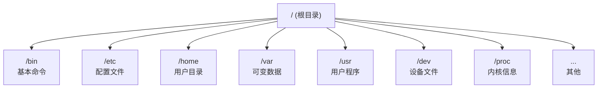

+++
title = "第12章：Linux 目录结构详解"
weight = 120
date = "2026-03-24T13:18:28+08:00"
type = "docs"
description = ""
isCJKLanguage = true
draft = false
+++


# 第十二章：Linux 目录结构详解

## 12.1 根目录 /：整个系统的入口

**根目录**（Root Directory）是 Linux 文件系统的"老大"，所有文件和目录都从它开始。类似于 Windows 的"此电脑"，但 Linux 的根目录更纯粹——**一切皆文件**！

```bash
# 查看根目录内容
ls -la /

# 输出示例：
# total 128
# drwxr-xr-x  25 root root 4096 Jan 15 00:00 .
# drwxr-xr-x   2 root root 4096 Jan 15 00:00 ..
# drwxr-xr-x   2 root root 4096 Jan 15 00:00 bin
# dr-xr-xr-x   1 root root 4096 Jan 15 00:00 boot
# drwxr-xr-x  18 root root 4096 Jan 15 00:00 dev
# drwxr-xr-x  18 root root 4096 Jan 15 00:00 etc
# drwxr-xr-x   3 root root 4096 Jan 15 00:00 home
# dr-xr-xr-x  20 root root 4096 Jan 15 00:00 lib
# drwxr-xr-x   3 root root 4096 Jan 15 00:00 media
# drwxr-xr-x   2 root root 4096 Jan 15 00:00 mnt
# drwxr-xr-x   2 root root 4096 Jan 15 00:00 opt
# dr-xr-x    2 root root 4096 Jan 15 00:00 proc
# dr-xr-x   3 root root 4096 Jan 15 00:00 root
# drwxr-xr-x  18 root root 4096 Jan 15 00:00 run
# drwxr-xr-x  18 root root 4096 Jan 15 00:00 sbin
# drwxr-xr-x   3 root root 4096 Jan 15 00:00 srv
# dr-xr-x   2 root root 4096 Jan 15 00:00 sys
# drwxr-xr-x  17 root root 4096 Jan 15 00:00 tmp
# drwxr-xr-x  11 root root 4096 Jan 15 00:00 usr
# drwxr-xr-x  25 root root 4096 Jan 15 00:00 var
```

> 小技巧：根目录的路径是 `/`（斜杠）。记住这个符号！它是 Linux 里最重要的符号，没有之一！路径以 `/` 开头表示从根目录开始，叫**绝对路径**！

### 根目录的特点

```bash
# 根目录的特殊性：
# 1. 根目录没有父目录，它就是最顶层！
# 2. / 是所有路径的起点
# 3. 普通用户对 / 只有读取和执行权限，没有写入权限

# 这就是为什么普通用户不能直接在 / 下创建文件：
touch /test.txt
# 输出：touch: cannot touch '/test.txt': Permission denied
```



> 想象一下：根目录就像一棵大树的根，所有树枝（其他目录）都从它生长出来。砍掉根，树就死了；删除 /，系统就完了！

---

## 12.2 /bin 目录：基本用户命令（ls、cp、mv、rm）

**/bin** = **bin**aries，二进制文件（可执行程序）。

这里存放着 Linux 的"基本生存工具"——没有它们，系统基本没法用！

```bash
# 查看 /bin 目录内容
ls /bin | head -20

# 常见的命令：
# ls      # 列出目录内容
# cp      # 复制文件
# mv      # 移动/重命名
# rm      # 删除文件
# cat     # 查看文件内容
# mkdir   # 创建目录
# rmdir   # 删除空目录
# chown   # 更改文件所有者
# chmod   # 更改文件权限
# date    # 显示日期时间
# echo    # 输出文本
# grep    # 文本搜索
# ps      # 查看进程
# kill    # 终止进程
# pwd     # 显示当前目录
# cd      # 切换目录（Shell 内置，但历史上在 /bin）
```

> 小知识：/bin 里的命令是**所有用户都能用**的，不管你是普通用户还是 root 用户。这里的"binaries"指的是编译好的可执行文件，不是"二进制数据"的意思！

### /bin vs /usr/bin

```bash
# 历史上：
# /bin      - 系统启动必备的命令（单用户模式也能用）
# /usr/bin  - 用户安装的程序

# 现代 Linux（/usr 合并后）：
# /bin      - /usr/bin 的符号链接
# /sbin     - /usr/sbin 的符号链接

# 验证：
ls -la /bin
# lrwxrwxrwx  1 root root 7 Jan 15 00:00 bin -> usr/bin
```

---

## 12.3 /sbin 目录：系统管理命令（fdisk、mkfs）

**/sbin** = **s**ystem **bin**aries，系统二进制文件。

这里存放的是**系统管理员**才需要用的"高级工具"——普通用户一般用不到！

```bash
# 查看 /sbin 目录
ls /sbin | head -20

# 常见的系统管理命令：
# fdisk      # 磁盘分区工具
# mkfs       # 格式化文件系统
# fsck       # 文件系统检查修复
# mount      # 挂载文件系统
# umount     # 卸载文件系统
# lvm        # 逻辑卷管理工具
# raidstart  # 启动 RAID
# iwconfig   # 无线网络配置
# iptables   # 防火墙配置
# reboot     # 重启系统
# halt       # 关机
# poweroff   # 关闭电源
```

> 对比一下：/bin 是"生活必需品"（谁都需要），/sbin 是"专业工具"（管理员专用）。就像普通感冒去药房买药 vs 去医院做手术！

---

## 12.4 /etc 目录：系统配置（最重要！）

**/etc** 是 Linux 中**最最重要的目录**之一！它的名字来自法语 "et cetera"，意思是"其他"。现在它的意思是"**系统配置文件存放地**"！

> 如果 / 是 Linux 的心脏，那 /etc 就是 Linux 的大脑——所有决定都在这里！

### /etc 目录一览

```bash
# 查看 /etc 目录（内容很多）
ls /etc | wc -l
# 输出：大约 200+ 个配置文件！

ls /etc | head -40
# passwd     # 用户信息
# shadow     # 用户密码（加密）
# group      # 用户组信息
# hosts      # 本地 DNS 解析
# hostname   # 主机名
# resolv.conf # DNS 配置
# fstab      # 文件系统挂载表
# crontab    # 定时任务
# sudoers    # sudo 配置
# profile    # 系统环境变量
# bash.bashrc # 系统级 Bash 配置
# ssh/       # SSH 配置目录
# nginx/     # Nginx 配置目录
# apache2/   # Apache 配置目录
# systemd/   # systemd 配置
# X11/       # X Window 配置
# xdg/       # XDG 配置
# ...
```

### 12.4.1 /etc/passwd：用户信息文件

**/etc/passwd** 存放着系统中所有用户的信息。

```bash
# 查看 passwd 文件
cat /etc/passwd

# 输出格式：
# username:password:UID:GID:GECOS:home_directory:shell
# 用户名:密码:UID:GID:用户信息:家目录:登录Shell

# 典型示例：
# root:x:0:0:root:/root:/bin/bash
# daemon:x:1:1:daemon:/usr/sbin:/usr/sbin/nologin
# www-data:x:33:33:www-data:/var/www:/usr/sbin/nologin
# ubuntu:x:1000:1000:Ubuntu:/home/ubuntu:/bin/bash
```

| 字段 | 含义 | 示例 |
|------|------|------|
| username | 用户名 | ubuntu |
| password | 密码（x 表示在 shadow） | x |
| UID | 用户标识符 | 1000 |
| GID | 主组标识符 | 1000 |
| GECOS | 用户信息（可选） | Ubuntu |
| home_directory | 家目录 | /home/ubuntu |
| shell | 登录 Shell | /bin/bash |

> 注意：密码不会明文存在 passwd 里！密码字段的 `x` 表示实际的密码哈希在 `/etc/shadow` 文件中！

### 12.4.2 /etc/shadow：用户密码（加密）

**/etc/shadow** 存放着用户密码的**加密哈希**！这个文件只有 root 用户能读取！

```bash
# 查看 shadow 文件（需要 root 权限）
sudo cat /etc/shadow

# 输出格式：
# username:password:last_change:min_days:max_days:warn_days:inactive:expire:reserved
# 用户名:密码哈希:最后修改:最小天数:最大天数:警告天数:过期天数:失效日期:保留

# 典型示例：
# root:$6$abcdefgh1234567890:19000:0:99999:7:::
# ubuntu:$6$ijklmnop9876543210:19000:0:99999:7:::
```

| 字段 | 含义 |
|------|------|
| username | 用户名 |
| password | 密码哈希（$6$ 表示 SHA-512） |
| last_change | 最后一次修改密码的日期（从1970年算起） |
| min_days | 密码最小使用天数 |
| max_days | 密码最大使用天数（99999 表示永不过期） |
| warn_days | 密码过期前多少天开始警告 |
| inactive | 密码过期后多少天仍可登录 |
| expire | 账户过期日期 |

> 安全提示：/etc/shadow 只有 root 能读，普通用户看不到！这是为了防止别人拿到密码哈希进行暴力破解！

### 12.4.3 /etc/group：用户组信息

**/etc/group** 存放着用户组的信息。

```bash
# 查看 group 文件
cat /etc/group

# 输出格式：
# group_name:password:GID:user_list
# 组名:密码:GID:成员列表

# 典型示例：
# root:x:0:
# sudo:x:27:ubuntu
# www-data:x:33:www-data
# ubuntu:x:1000:ubuntu
# docker:x:999:ubuntu,user1,user2
```

> 小技巧：同一个用户可以属于**多个组**！用户的主组（GID）记录在 /etc/passwd 中，附加组列在 /etc/group 的最后一列。

### 12.4.4 /etc/hostname：主机名

**/etc/hostname** 文件里只存放着**主机名**这一个信息！

```bash
# 查看主机名
cat /etc/hostname

# 输出示例：
# my-awesome-server

# 临时修改主机名（重启后失效）
sudo hostname new-hostname

# 永久修改主机名
sudo hostnamectl set-hostname new-hostname
```

### 12.4.5 /etc/hosts：本地 DNS 解析

**/etc/hosts** 是"本地的 DNS 服务器"，在你查询 DNS 之前，系统会先查这个文件！

```bash
# 查看 hosts 文件
cat /etc/hosts

# 输出：
# 127.0.0.1   localhost
# 127.0.1.1   my-computer
# ::1         localhost ip6-localhost ip6-loopback

# 添加自定义解析
# 格式：IP地址    主机名    别名
192.168.1.100   my-server.local   my-server
```

> 实用场景：开发时，你想给本地网站起个名字，比如 `myapp.test`：
> ```bash
> 127.0.0.1   myapp.test
> ```
> 这样浏览器访问 `myapp.test` 就等于访问 `127.0.0.1`！

### 12.4.6 /etc/resolv.conf：DNS 配置

**/etc/resolv.conf** 告诉系统"去哪找 DNS 服务器"！

```bash
# 查看 resolv.conf
cat /etc/resolv.conf

# 输出：
# nameserver 8.8.8.8
# nameserver 8.8.4.4
# nameserver 1.1.1.1

# resolv.conf 格式：
# nameserver IP地址   # DNS 服务器地址
```

| nameserver | DNS 服务器 | 说明 |
|------------|-----------|------|
| 8.8.8.8 | Google DNS | 稳定快速 |
| 8.8.4.4 | Google DNS | 备用 |
| 1.1.1.1 | Cloudflare DNS | 隐私优先 |

> 注意：Ubuntu 18.04+ 使用 systemd-resolved，/etc/resolv.conf 通常是符号链接！修改会被覆盖！

### 12.4.7 /etc/fstab：文件系统挂载表

**/etc/fstab** = **f**ile **s**ystem **tab**le，文件系统表。这个文件定义了开机时**自动挂载**哪些文件系统！

> ⚠️ **重要警告**：修改 /etc/fstab 前务必备份！错误的配置可能导致系统无法启动！修改后使用 `sudo mount -a` 测试，确认无错误后再重启！

```bash
# 查看 fstab 文件
cat /etc/fstab

# 输出示例：
# # /etc/fstab: static file system information.
# #
# # Use 'blkid' to print the universally unique identifier for a
# # device; this may be used with UUID= as a more robust way to name
# # devices that works even if disks are added and removed.
# # See fstab(5).
#
# <file system>         <mount point>   <type>  <options>       <dump>  <pass>
# UUID=xxxx-xxxx       /boot/efi       vfat    umask=0077      0       1
# UUID=xxxxxxxx-xxxx   /               ext4    errors=remount-ro 0       1
# UUID=xxxxxxxx-xxxx   none             swap    sw              0       0
# UUID=xxxxxxxx-xxxx   /data            ext4    defaults        0       2
```

| 字段 | 含义 | 示例 |
|------|------|------|
| file system | 设备/UUID/LABEL | UUID=xxxx-xxxx |
| mount point | 挂载点 | /boot/efi |
| type | 文件系统类型 | ext4, vfat, swap |
| options | 挂载选项 | defaults, nofail |
| dump | 备份标志（0或1） | 0 |
| pass | fsck 顺序（0,1,2） | 1 |

> 重要选项：
> - `nofail`：如果挂载失败，不要报错，继续启动
> - `defaults`：使用默认选项（rw,suid,dev,exec,auto,nouser,async）
> - `errors=remount-ro`：出错时重新挂载为只读

### 12.4.8 /etc/crontab：定时任务

**/etc/crontab** 定义了**系统级**的定时任务！

```bash
# 查看 crontab
cat /etc/crontab

# 输出：
# SHELL=/bin/bash
# PATH=/usr/local/sbin:/usr/local/bin:/sbin:/bin:/usr/sbin:/usr/bin
#
# m h dom mon dow user  command
# 分 时 日 月 周 用户  命令

# 示例：
# 0 5 * * * root    cd / && run-parts /etc/cron.daily
# 0 6 * * 1 root    apt update && apt upgrade -y
```

| 字段 | 含义 | 值 |
|------|------|-----|
| m | 分钟 | 0-59 |
| h | 小时 | 0-23 |
| dom | 日 | 1-31 |
| mon | 月 | 1-12 |
| dow | 星期 | 0-7（0和7都是周日） |
| user | 执行用户 | root, www-data, 等 |
| command | 要执行的命令 | 任意命令 |

> crontab 时间格式小技巧：
> - `*` = 任意值
> - `,` = 列表，如 1,3,5
> - `-` = 范围，如 1-5
> - `/` = 步长，如 */5 表示每5个单位

### 12.4.9 /etc/sudoers：sudo 配置

**/etc/sudoers** 定义了**谁可以用 sudo 命令**，以及可以用 sudo 做什么！

```bash
# 查看 sudoers 文件
cat /etc/sudoers

# 输出：
# Defaults        env_reset
# Defaults        mail_passwd
# Defaults        secure_path="/usr/local/sbin:/usr/local/bin:/usr/sbin:/usr/bin:/sbin:/bin"
#
# root            ALL=(ALL:ALL) ALL
# %admin          ALL=(ALL) ALL
# %sudo           ALL=(ALL:ALL) ALL
```

| 格式 | 含义 |
|------|------|
| user | 用户名 |
| host | 允许从哪台主机登录 |
| runas | 可以以哪个用户/组运行 |
| commands | 可以执行哪些命令 |

```bash
# 典型配置示例：

# 让 ubuntu 用户可以无密码使用 sudo
ubuntu ALL=(ALL) NOPASSWD: ALL

# 让 webadmin 组可以以 www-data 用户运行命令
%webadmin ALL=(www-data) /usr/bin/systemctl restart nginx

# 限制用户只能执行特定命令
john ALL=(ALL) /usr/bin/systemctl restart apache2, /usr/bin/systemctl stop apache2
```

> 安全提示：**永远不要直接编辑 /etc/sudoers**！使用 `sudo visudo` 命令，它会检查语法错误，防止你把自己锁在外面！

### 12.4.10 /etc/profile：系统环境变量

**/etc/profile** 是**系统级**的环境变量配置文件。当用户登录时，会执行这个文件。

```bash
# 查看 profile
cat /etc/profile

# 输出：
# # /etc/profile: system-wide .profile file for the Bourne shell
# # (bash(1) and Bourne compatible sh(1))

# 设置 PATH
# export PATH="/usr/local/bin:/usr/bin:/bin"

# 设置默认 umask
# umask 022

# 设置 locale
# export LANG=en_US.UTF-8

# 调用其他配置
# for i in /etc/profile.d/*.sh; do
#     if [ -r "$i" ]; then
#         . "$i"
#     fi
# done
```

> 加载顺序：/etc/profile → /etc/profile.d/*.sh → ~/.bash_profile → ~/.bash_login → ~/.profile

### 12.4.11 /etc/bash.bashrc：系统级 Bash 配置

**/etc/bash.bashrc** 是**系统级 Bash 配置文件**，每次打开新的 Bash 终端都会执行！

```bash
# 查看 bash.bashrc
cat /etc/bash.bashrc

# 输出示例：
# if not running interactively, don't do anything
# case $- in
#     *i*) ;;
#       *) return;;
# esac

# 设置默认选项
# set -o vi  # 默认使用 vi 模式

# 设置别名
# alias ll='ls -la'
# alias grep='grep --color=auto'

# 设置 Bash 提示符
# PS1='${debian_chroot:+($debian_chroot)}\[\033[01;32m\]\u@\h\[\033[00m\]:\[\033[01;34m\]\w\[\033[00m\]\$ '
```

> 小技巧：个人配置放在 ~/.bashrc，系统级配置放在 /etc/bash.bashrc。修改个人配置不影响其他用户！

### 12.4.12 /etc/ssh/sshd_config：SSH 服务器配置

**/etc/ssh/sshd_config** 是 SSH 服务器的主配置文件！

```bash
# 查看 sshd_config
cat /etc/ssh/sshd_config | grep -v "^#" | grep -v "^$"

# 输出：
# Port 22
# Protocol 2
# HostKey /etc/ssh/ssh_host_rsa_key
# HostKey /etc/ssh/ssh_host_ecdsa_key
# HostKey /etc/ssh/ssh_host_ed25519_key
# PermitRootLogin no
# PubkeyAuthentication yes
# PasswordAuthentication yes
# PermitEmptyPasswords no
# ChallengeResponseAuthentication no
# UsePAM yes
# X11Forwarding yes
# PrintMotd no
# AcceptEnv LANG LC_*
# Subsystem sftp /usr/lib/openssh/sftp-server
```

| 配置项 | 含义 | 建议值 |
|--------|------|--------|
| Port | SSH 端口 | 22（默认）或自定义 |
| PermitRootLogin | 允许 root 登录 | no（禁止） |
| PubkeyAuthentication | 公钥认证 | yes |
| PasswordAuthentication | 密码认证 | yes（可选关闭） |
| X11Forwarding | X11 转发 | yes（可选） |

```bash
# 修改配置后，重启 SSH 服务生效
sudo systemctl restart sshd

# 测试配置语法
sudo sshd -t
```

> 安全建议：
> 1. 禁止 root 登录：`PermitRootLogin no`
> 2. 使用密钥登录：`PasswordAuthentication no`
> 3. 更改默认端口：`Port 2222`

### 12.4.13 /etc/nginx/nginx.conf：Nginx 配置

**/etc/nginx/nginx.conf** 是 Nginx Web 服务器的主配置文件！

```nginx
# 查看 nginx.conf
cat /etc/nginx/nginx.conf

# 输出：
# user www-data;
# worker_processes auto;
# pid /run/nginx.pid;
# error_log /var/log/nginx/error.log;

# events {
#     worker_connections 1024;
# }

# http {
#     include /etc/nginx/mime.types;
#     default_type application/octet-stream;
#
#     access_log /var/log/nginx/access.log;
#
#     sendfile on;
#     tcp_nopush on;
#     tcp_nodelay on;
#     keepalive_timeout 65;
#     types_hash_max_size 2048;
#
#     include /etc/nginx/conf.d/*.conf;
#     include /etc/nginx/sites-enabled/*;
# }
```

| 配置项 | 含义 |
|--------|------|
| user | Nginx 工作进程的用户 |
| worker_processes | 工作进程数（auto 表示自动） |
| worker_connections | 每个进程的最大连接数 |
| error_log | 错误日志路径 |
| access_log | 访问日志路径 |

```bash
# 测试配置语法
sudo nginx -t

# 重新加载配置
sudo systemctl reload nginx

# 重启 Nginx
sudo systemctl restart nginx
```

### 12.4.14 /etc/apache2/apache2.conf：Apache 配置

**/etc/apache2/apache2.conf** 是 Apache 2 Web 服务器的主配置文件！

```apache
# 查看 apache2.conf
cat /etc/apache2/apache2.conf

# 输出：
# ServerRoot "/etc/apache2"
# PidFile ${APACHE_PID_FILE}
# Timeout 300
# KeepAlive On
# MaxKeepAliveRequests 100
# KeepAliveTimeout 5

# User ${APACHE_RUN_USER}
# Group ${APACHE_RUN_GROUP}

# HostnameLookups Off

# ErrorLog ${APACHE_LOG_DIR}/error.log
# LogLevel warn

# Include module configuration:
# IncludeOptional mods-enabled/*.load
# IncludeOptional mods-enabled/*.conf

# Include list of ports to listen
# Include ports.conf

# Include generic snippets of statements
# IncludeOptional conf-enabled/*.conf

# Include the virtual host configurations:
# Include sites-enabled/
```

| 配置项 | 含义 |
|--------|------|
| ServerRoot | 配置文件的根目录 |
| PidFile | 进程 ID 文件位置 |
| Timeout | 请求超时时间（秒） |
| MaxKeepAliveRequests | 最大 Keep-Alive 请求数 |
| KeepAliveTimeout | Keep-Alive 超时时间 |
| ErrorLog | 错误日志路径 |

```bash
# Apache 模块管理
sudo a2enmod rewrite     # 启用 rewrite 模块
sudo a2dismod autoindex  # 禁用 autoindex 模块

# 测试配置
sudo apache2ctl -t

# 重载配置
sudo systemctl reload apache2
```

---

## 12.5 /home 目录：普通用户家目录

**/home** 是普通用户的"家"，里面放着所有普通用户的个人文件！

```bash
# 查看 /home 目录
ls -la /home

# 输出：
# total 8
# drwxr-xr-x  3 root root 4096 Jan 15 10:00 ubuntu
# drwxr-xr-x  3 root root 4096 Jan 15 10:00 john
# drwxr-xr-x  3 root root 4096 Jan 15 10:00 alice
```

> 每个普通用户都有自己独立的家目录！用户的家目录路径是 `/home/用户名`！

### 12.5.1 /home/用户名/

每个用户的家目录里都有些"约定俗成"的隐藏文件：

```bash
# 查看用户家目录的隐藏文件
ls -la ~

# 典型内容：
# .bashrc         # Bash 配置文件（每次打开终端执行）
# .profile        # 用户环境配置（登录时执行）
# .bash_history   # 命令历史记录
# .bash_logout    # 退出时执行的脚本
# .cache/         # 缓存目录
# .config/        # 用户配置目录
# .local/         # 用户本地程序
# .ssh/           # SSH 密钥和配置
```

### 12.5.2 ~/.bashrc：用户级 Bash 配置

**~/.bashrc** 是用户个人的 Bash 配置，只对这个用户生效！

```bash
# 编辑当前用户的 bashrc
nano ~/.bashrc

# 添加内容示例：
# alias ll='ls -la'
# alias gs='git status'
# alias gp='git push'
# export EDITOR='vim'
# export PATH="$HOME/.local/bin:$PATH"
```

> 修改 ~/.bashrc 后，执行 `source ~/.bashrc` 或重新打开终端生效！

### 12.5.3 ~/.ssh/：SSH 密钥

**~/.ssh/** 目录存放 SSH 相关的密钥和配置！

```bash
# 查看 ~/.ssh 目录
ls -la ~/.ssh

# 输出：
# total 8
# -rw------- 1 ubuntu ubuntu 220 Jan 15 10:00 authorized_keys
# -rw------- 1 ubuntu ubuntu 1675 Jan 15 10:00 id_rsa
# -rw-r--r-- 1 ubuntu ubuntu  401 Jan 15 10:00 id_rsa.pub
# -rw-r--r-- 1 ubuntu ubuntu  444 Jan 15 10:00 known_hosts
```

| 文件 | 作用 | 权限建议 |
|------|------|----------|
| id_rsa | 私钥（保密！只有自己能看） | 600 或 400 |
| id_rsa.pub | 公钥（可以分享给别人） | 644 |
| authorized_keys | 允许登录的公钥列表 | 600 |
| known_hosts | 已知的主机密钥 | 644 |
| config | SSH 连接配置 | 600 |

```bash
# 生成 SSH 密钥对
ssh-keygen -t rsa -b 4096 -C "your_email@example.com"

# 命令行参数说明：
# -t rsa     # 密钥类型（rsa, ed25519, ecdsa）
# -b 4096    # 密钥位数（越大越安全）
# -C "注释"  # 注释（通常是邮箱）

# 将公钥添加到远程服务器
ssh-copy-id user@remote-server

# 或者手动添加
cat ~/.ssh/id_rsa.pub | ssh user@remote-server "mkdir -p ~/.ssh && cat >> ~/.ssh/authorized_keys"
```

---

## 12.6 /root 目录：root 用户家目录

**/root** 是 root 超级用户的"家"！注意：它不在 /home 下，而是直接在 / 下！

```bash
# 查看 /root 目录
ls -la /root

# 输出：
# total 64
# drwx------ 14 root root 4096 Jan 15 10:00 .
# drwxr-xr-x 18 root root 4096 Jan 15 09:00 ..
# -rw-------  1 root root 5701 Jan 15 10:00 .bash_history
# -rw-r--r--  1 root root  3106 Jan 15 10:00 .bashrc
# -rw-------  1 root root  220 Jan 15 10:00 .profile
# drwx------  3 root root 4096 Jan 15 10:00 .ssh
```

> 为什么 /root 不在 /home/root？因为 /home 可能位于单独的分区，如果 /home 挂载失败，root 用户将无法登录！所以 root 有自己独立的家目录！

---

## 12.7 /usr 目录：用户程序

**/usr** = **U**nix **S**ystem **R**esources，Unix 系统资源。这个目录存放着**用户安装的程序和库文件**！

```bash
# /usr 目录结构
/usr
├── bin/      # 用户命令（大部分命令在这里！）
├── sbin/     # 系统管理命令
├── lib/      # 库文件
├── local/    # 本地安装的程序
├── share/    # 共享数据（文档、图标）
├── include/  # C 头文件
├── src/      # 源代码
└── games/    # 游戏（Ubuntu 默认移除了）
```

### 12.7.1 /usr/bin：用户命令（大部分命令）

这里存放着**用户安装的软件**提供的命令！

```bash
# 查看 /usr/bin 内容
ls /usr/bin | head -20

# 大部分我们用的命令都在这里：
# python3, node, npm, git, vim, nano, curl, wget...
```

### 12.7.2 /usr/sbin：系统管理命令

系统管理命令，但通常不是"系统启动必备"的！

```bash
# 查看 /usr/sbin 内容
ls /usr/sbin | head -20

# apache2, nginx, mysqld, docker, lxc...
```

### 12.7.3 /usr/lib：库文件

存放程序的**动态链接库（.so 文件）**！

```bash
# 查看库文件
ls /usr/lib | head -20

# 常见的库：
# libc.so.6       # C 标准库
# libpthread.so   # 线程库
# libssl.so       # OpenSSL 库
```

### 12.7.4 /usr/local：本地安装程序

**/usr/local** 是管理员安装"手动编译软件"的地方！apt 安装的软件不会放在这里！

```bash
# /usr/local 目录结构
/usr/local/
├── bin/      # 本地安装的可执行文件
├── sbin/     # 本地安装的系统程序
├── lib/      # 本地安装的库
├── include/  # 本地安装的头文件
└── share/    # 本地共享数据

# 常用场景：
# 安装 Python 库到本地
# pip install --user some-package
# 安装到 ~/.local/lib/python3.x/site-packages/

# 编译安装的软件
# ./configure --prefix=/usr/local
# make && sudo make install
```

> 为什么要有 /usr/local？因为 apt 安装的软件由包管理器管理，而手动编译的软件放这里可以"独立管理"，不会和 apt 冲突！

### 12.7.5 /usr/share：共享数据

存放程序的**文档、图标、桌面文件**等共享数据！

```bash
# /usr/share 结构
/usr/share/
├── doc/           # 文档
├── man/           # man 手册
├── icons/         # 图标
├── applications/  # .desktop 文件
├── locale/        # 语言文件
└── vim/          # Vim 运行时文件
```

### 12.7.6 /usr/include：头文件

存放 C/C++ **头文件（.h 文件）**，编译程序时用！

```bash
# 查看头文件
ls /usr/include | head -10

# 常见头文件：
# stdio.h, stdlib.h, string.h...
# python3.9/Python.h...
# openssl/ssl.h...
```

### 12.7.7 /usr/src：内核源码

存放 **Linux 内核源代码**！

```bash
# 查看 /usr/src
ls -la /usr/src

# 输出：
# linux-headers-5.15.0-56-generic/
# linux-headers-5.15.0-56/
```

---

## 12.8 /var 目录：可变数据（日志！）

**/var** = **var**iable，可变数据。这里存放着**经常变化的文件**——日志、缓存、数据库等！

```bash
# /var 目录结构
/var
├── log/       # 系统和应用日志（重要！）
├── cache/     # 应用缓存
├── lib/       # 应用数据
├── spool/     # 打印任务、邮件队列
├── www/       # 网站数据
├── tmp/       # 临时文件
├── backup/    # 备份
└── run/       # 运行时数据
```

> 如果 /var 满了，你的系统可能会"爆炸"——日志写不进去，邮件收不到，打印队列卡死！所以监控 /var 的使用率很重要！

### 12.8.1 /var/log：系统日志

**/var/log** 是 Linux 的"黑匣子"，记录着系统的一切活动！

```bash
# 查看 /var/log 目录
ls /var/log

# 输出：
# alternatives.log    # apt 安装日志
# auth.log            # 认证日志
# boot.log           # 启动日志
# btmp               # 登录失败记录
# dmesg              # 内核消息
# dpkg.log           # dpkg 包管理日志
# kern.log           # 内核日志
# syslog             # 系统日志
# ubuntu-advantage.log
# unattended-upgrades.log
# wtmp               # 登录记录
# nginx/             # Nginx 日志目录
# apache2/           # Apache 日志目录
```

#### 12.8.1.1 /var/log/syslog：系统日志

**/var/log/syslog** 记录系统的一般事件！

```bash
# 查看 syslog（需要权限）
sudo cat /var/log/syslog | tail -20

# 输出示例：
# Jan 15 10:30:01 my-server CRON[12345]: (root) CMD (test -x /usr/sbin/anacron ...)
# Jan 15 10:35:22 my-server sshd[12346]: Accepted publickey for ubuntu from 192.168.1.100
# Jan 15 10:40:00 my-server systemd[1]: Started Daily apt download activities.
```

> 实用技巧：分析 syslog 找问题
> ```bash
> # 查看最近一次启动的日志
> grep "kernel" /var/log/syslog | tail
>
> # 查看某个时间段内的日志
> sudo grep "Jan 15 10:" /var/log/syslog
> ```

#### 12.8.1.2 /var/log/auth.log：认证日志

**/var/log/auth.log** 记录所有**认证相关**的事件——登录、sudo、SSH 等！

```bash
# 查看认证日志
sudo cat /var/log/auth.log | tail -20

# 输出示例：
# Jan 15 10:30:01 my-server sshd[12345]: Accepted publickey for ubuntu from 192.168.1.100 port 12345
# Jan 15 10:31:00 my-server sudo: ubuntu : TTY=pts/0 ; PWD=/home/ubuntu ; USER=root ; COMMAND=/bin/ls
# Jan 15 10:35:00 my-server sshd[12346]: Failed password for invalid user admin from 192.168.1.200 port 12345
```

> 安全提示：经常检查 auth.log，可以发现**暴力破解尝试**！如果看到大量 SSH 登录失败，说明有人在扫描你的服务器！

#### 12.8.1.3 /var/log/nginx/：Nginx 日志

Nginx 的日志目录！

```bash
# 查看 Nginx 日志目录
ls -la /var/log/nginx/

# 输出：
# access.log      # 访问日志
# error.log       # 错误日志
```

```bash
# 查看访问日志
sudo tail -20 /var/log/nginx/access.log

# 输出示例：
# 192.168.1.100 - - [15/Jan/2024:10:30:00 +080
# 192.168.1.100 - - [15/Jan/2024:10:30:00 +0800] "GET / HTTP/1.1" 200 612 "-" "Mozilla/5.0..."
# 192.168.1.101 - - [15/Jan/2024:10:31:00 +0800] "GET /api/users HTTP/1.1" 404 162 "-" "curl/7.68.0"
```

| 字段 | 含义 |
|------|------|
| 192.168.1.100 | 客户端 IP |
| - | 用户名（未认证） |
| [15/Jan/2024:10:30:00 +0800] | 请求时间 |
| GET / HTTP/1.1 | 请求方法、路径、协议 |
| 200 | HTTP 状态码 |
| 612 | 响应大小（字节） |
#### 12.8.1.4 /var/log/apache2/：Apache 日志

Apache 的日志目录！

```bash
# 查看 Apache 日志目录
ls -la /var/log/apache2/

# 输出：
# access.log       # 访问日志
# error.log        # 错误日志
# other_vhosts_access.log  # 虚拟主机日志
```

---

### 12.8.2 /var/www：网站数据

**/var/www** 是 Web 服务器的"地盘"，存放网站文件！

```bash
# 查看 /var/www
ls -la /var/www/

# 典型结构（Nginx）：
# /var/www/
# ├── html/           # 默认网站目录
# │   └── index.html
# ├── mysite/         # 其他网站
# │   ├── index.php
# │   └── wp-content/
# └── cgi-bin/        # CGI 脚本
```

> 配置文件中的网站路径通常指向这里！
> - Nginx: `/var/www/html`
> - Apache: `/var/www/html`

---

### 12.8.3 /var/cache：缓存

**/var/cache** 存放应用程序的**缓存文件**！

```bash
# 查看缓存目录
ls /var/cache/

# 输出：
# apt/              # apt 包缓存
# debconf/          # debconf 配置缓存
# ldconfig/         # 动态链接库缓存
# man/              # man 手册缓存
# apache2/          # Apache 缓存
# nginx/            # Nginx 缓存
# apt-cacher-ng/    # apt 代理缓存
```

> 这些缓存可以安全删除，重新生成即可！但 /var/cache/apt 删了之后，下次安装软件需要重新下载！

---

### 12.8.4 /var/spool：队列（打印任务、邮件）

**/var/spool** 存放"排队等待处理"的任务！

```bash
# 查看 spool 目录
ls /var/spool/

# 输出：
# at/               # 定时任务队列
# cron/             # cron 任务队列
# mail/             # 邮件队列
# lpd/              # 打印机队列
# mqueue/           # 邮件队列（发送中）
```

```bash
# 查看邮件队列
ls /var/spool/mail/

# 查看打印机队列
lpq
```

> 为什么叫 spool？它是 "Simultaneous Peripheral Operations On-Line" 的缩写——听起来很技术，但其实就是"排队等打印"的意思！

---

### 12.8.5 /var/lib：应用数据

**/var/lib** 存放应用程序的**运行时数据**！

```bash
# 查看 lib 目录
ls /var/lib/

# 输出：
# dpkg/             # dpkg 包数据库
# apt/              # apt 状态数据
# systemd/          # systemd 状态
# mysql/            # MySQL 数据
# postgresql/       # PostgreSQL 数据
# docker/           # Docker 数据
# cloud/            # 云平台数据
```

```bash
# 查看 MySQL 数据库位置
ls /var/lib/mysql/

# 查看 Docker 镜像位置
ls /var/lib/docker/
```

---

## 12.9 /tmp 目录：临时文件（系统清理）

**/tmp** 是 Linux 的"公共厕所"——大家都可以用，但用完就走，系统会定期清理！

```bash
# /tmp 特点：
# - 所有用户都能读写
# - 系统重启后可能清空
# - 大多数发行版会定期清理
# - 适合存放临时文件

# 查看 /tmp
ls -la /tmp
```

> 重要：不要在 /tmp 里放重要文件！系统可能会自动清理！重要文件放 /home 或其他持久化存储！

```bash
# 手动清理 /tmp（需要 root）
sudo rm -rf /tmp/*

# 查看 /tmp 大小
du -sh /tmp
```

---

## 12.10 /proc 目录：虚拟文件系统（内核信息）

**/proc** 是一个"魔法目录"——它里面的文件**不存在于硬盘上**，而是 Linux 内核动态生成的！它就像是通往内核的"窗口"！

```bash
# 查看 /proc 目录
ls /proc

# 输出：
# 1/       # PID 1 的进程（init/systemd）
# 2/       # PID 2 的进程（kthreadd）
# ...
# cpuinfo  # CPU 信息
# meminfo  # 内存信息
# uptime   # 系统运行时间
# version  # 内核版本
```

> 访问 /proc 里的文件，就是"读取内核的状态"！这些文件都是内核提供的"只读信息"！

### 12.10.1 /proc/cpuinfo：CPU 信息

```bash
# 查看 CPU 信息
cat /proc/cpuinfo

# 关键信息：
# processor       : 0
# model name      : Intel(R) Core(TM) i7-10700 CPU @ 2.90GHz
# cpu cores       : 8
# cache size      : 16384 KB
# flags           : fpu vme de pse tsc msr pae mce cx8...
```

```bash
# 常用命令查看 CPU 信息
lscpu
```

### 12.10.2 /proc/meminfo：内存信息

```bash
# 查看内存信息
cat /proc/meminfo

# 输出：
# MemTotal:        32768448 kB      # 总内存（GB）
# MemFree:         16777216 kB      # 空闲内存
# MemAvailable:    25165824 kB      # 可用内存
# Buffers:           524288 kB      # 缓冲区
# Cached:           8388608 kB      # 缓存
# SwapCached:              0 kB      # 交换分区缓存
# SwapTotal:       16777216 kB      # 交换分区总量
# SwapFree:        16777216 kB      # 交换分区空闲
```

```bash
# 常用命令查看内存
free -h
```

### 12.10.3 /proc/uptime：运行时间

```bash
# 查看系统运行时间
cat /proc/uptime

# 输出：
# 1234567.89 9876543.21
# 第一个数字：系统运行秒数
# 第二个数字：系统空闲时间秒数

# 转换为人类可读格式
uptime -p
# 输出：up 3 weeks, 2 days, 5 hours, 30 minutes

uptime
# 输出：15:42:01 up 23 days,  3:22,  2 users,  load average: 0.52, 0.58, 0.59
```

### 12.10.4 /proc/进程ID/：进程信息

每个进程的详细信息都在这里！

```bash
# 查看当前 bash 进程的 PID
echo $$

# 查看该进程的信息
ls /proc/$$
# cmdline    # 命令行参数
# environ     # 环境变量
# fd/         # 文件描述符
# maps        # 内存映射
# status      # 进程状态
# cwd -> /home/ubuntu  # 当前工作目录（符号链接）
# exe -> /usr/bin/bash # 可执行文件（符号链接）
```

```bash
# 查看进程的状态
cat /proc/$$/status

# 输出：
# Name:   bash
# State: S (sleeping)
# Pid:    12345
# PPid:   12340
# ...
```

---

## 12.11 /sys 目录：虚拟文件系统（系统信息）

**/sys** 和 /proc 类似，也是一个"虚拟文件系统"，但它专门提供**系统硬件和内核子系统**的信息！

```bash
# 查看 /sys 目录
ls /sys

# 输出：
# block/        # 块设备
# bus/          # 总线类型
# class/        # 设备类
# dev/          # 设备节点
# devices/      # 设备层次结构
# fs/           # 文件系统
# kernel/       # 内核配置
# module/       # 内核模块
```

### 12.11.1 /sys/class/：设备类

按类别组织的设备！

```bash
# 查看设备类
ls /sys/class/

# 输出：
# backlight/    # 屏幕背光
# battery/       # 电池
# bluetooth/     # 蓝牙
# firmware/      # 固件
# graphics/      # 图形设备
# input/         # 输入设备
# net/           # 网络设备
# power_supply/  # 电源
# sound/         # 声音设备
# tty/           # 终端设备
```

### 12.11.2 /sys/block/：块设备

所有块设备（硬盘、SSD 等）！

```bash
# 查看块设备
ls /sys/block/

# 输出：
# loop0  loop1  loop2  ...  # 回环设备
# sda    sdb    sdc    ...  # 物理硬盘

# 查看 sda 设备信息
ls /sys/block/sda/

# sda1  sda2  sda3  ...     # 分区
```

---

## 12.12 /dev 目录：设备文件

**/dev** 存放着 Linux 的"设备文件"！在 Linux 里，**一切皆文件**——硬盘是文件，键盘是文件，打印机也是文件！

```bash
# 查看 /dev 目录
ls /dev

# 输出：
# null    # 黑洞设备
# zero    # 零设备
# random  # 随机数设备
# urandom # 快速随机数设备
# tty/    # 终端设备
# sda/    # 第一块硬盘
# sda1/   # 第一块硬盘的第一个分区
```

### 12.12.1 /dev/sda：第一块硬盘

```bash
# 硬盘设备命名规则：
# /dev/sda     # 第一块 SATA/SCSI 硬盘
# /dev/sdb     # 第二块 SATA/SCSI 硬盘
# /dev/nvme0n1 # 第一块 NVMe SSD
# /dev/vda     # 第一块虚拟硬盘（KVM/Xen）
# /dev/hda     # 第一块 IDE 硬盘（老式）

# 分区命名：
# /dev/sda1    # 第一块硬盘的第一个分区
# /dev/sda2    # 第一块硬盘的第二个分区
```

### 12.12.2 /dev/null：黑洞设备

**/dev/null** 是"黑洞"——写进去的东西全部消失，读出来的是空白！

```bash
# 丢弃所有输出（不显示任何东西）
command > /dev/null

# 丢弃错误输出
command 2> /dev/null

# 同时丢弃正常输出和错误输出
command > /dev/null 2>&1

# 从 /dev/null 读取（什么都没有）
cat /dev/null
# 输出：空白
```

> 实用技巧：清空文件
> ```bash
> cat /dev/null > file.txt
> # 比 rm file.txt && touch file.txt 快多了！
> ```

### 12.12.3 /dev/zero：零设备

**/dev/zero** 是一个"无限的零生成器"——读取它会得到无数个 `\0`（空字节）！

```bash
# 创建一个 1GB 的零文件
dd if=/dev/zero of=/tmp/testfile bs=1M count=1024

# 参数说明：
# if=/dev/zero    # 输入文件（零设备）
# of=/tmp/testfile # 输出文件
# bs=1M            # 每次写入 1MB
# count=1024       # 写入 1024 次 = 1GB
```

> 用途：创建测试文件、初始化磁盘、备份等！

### 12.12.4 /dev/random：随机数设备

```bash
# /dev/random  - 真随机数生成器（可能会阻塞）
# /dev/urandom - 伪随机数生成器（永不阻塞，更快）

# 生成随机数
cat /dev/urandom | head -c 16 | xxd

# 生成随机密码
cat /dev/urandom | tr -dc 'a-zA-Z0-9' | head -c 16
```

> 推荐：除非做安全相关操作，否则用 /dev/urandom！因为 /dev/random 可能因为熵不足而"卡住"！

---

## 12.13 /boot 目录：启动文件

**/boot** 是 Linux 的"启动区"——没有它，你的电脑都不知道怎么开机！

```bash
# 查看 /boot 目录
ls -la /boot/

# 输出：
# initrd.img-5.15.0-56-generic    # 初始化内存盘
# vmlinuz-5.15.0-56-generic        # 内核镜像
# System.map-5.15.0-56-generic      # 内核符号表
# grub/                              # GRUB 引导器配置
# config-5.15.0-56-generic         # 内核配置
```

### 12.13.1 /boot/vmlinuz：内核镜像

**vmlinuz** 是 Linux 内核的"可执行文件"！

```bash
# 内核镜像命名规则：
# vmlinuz-<版本号>-<发行商>
# vmlinuz-5.15.0-56-generic

# 如果是 UEFI 启动，还会有：
# /boot/efi/EFI/ubuntu/shimx64.efi
# /boot/efi/EFI/ubuntu/grubx64.efi
```

### 12.13.2 /boot/initrd.img：初始化内存盘

**initrd.img** = **init**ial **R**oot **D**isk，初始化根磁盘！

它是启动过程中的"临时文件系统"，在内核启动后、真正根文件系统挂载前使用！

```bash
# 查看 initrd 内容（解压）
mkdir /tmp/initrd && cd /tmp/initrd
zcat /boot/initrd.img-5.15.0-56-generic | cpio -id
```

### 12.13.3 /boot/grub/：GRUB 引导器

**GRUB** = **GR**and **U**nified **B**ootloader，GRUB 是 Linux 的"启动菜单"！

```bash
# 查看 GRUB 配置
ls /boot/grub/

# 主要配置文件：
# grub.cfg       # GRUB 2 主配置（通常由 update-grub 自动生成）
# /etc/default/grub  # GRUB 默认配置
# /etc/grub.d/       # GRUB 脚本片段

# 修改默认启动项：
sudo nano /etc/default/grub
# GRUB_DEFAULT=0  # 0 = 第一个菜单项
# GRUB_TIMEOUT=10  # 等待时间（秒）

# 更新 GRUB 配置
sudo update-grub
```

---

## 12.14 重要配置文件位置速查表

| 用途 | 配置文件路径 |
|------|-------------|
| **用户管理** | |
| 用户信息 | /etc/passwd |
| 用户密码 | /etc/shadow |
| 用户组 | /etc/group |
| **网络配置** | |
| 主机名 | /etc/hostname |
| 本地 DNS | /etc/hosts |
| DNS | /etc/resolv.conf |
| **系统配置** | |
| 文件系统挂载 | /etc/fstab |
| 定时任务 | /etc/crontab |
| sudo 配置 | /etc/sudoers |
| 环境变量 | /etc/profile |
| Bash 配置 | /etc/bash.bashrc |
| **服务配置** | |
| SSH 服务 | /etc/ssh/sshd_config |
| Nginx | /etc/nginx/nginx.conf |
| Apache | /etc/apache2/apache2.conf |
| **重要目录** | |
| 命令 | /bin, /usr/bin |
| 系统命令 | /sbin, /usr/sbin |
| 库文件 | /lib, /usr/lib |
| 日志 | /var/log |
| 临时文件 | /tmp |
| 内核信息 | /proc |
| 硬件信息 | /sys |
| 设备文件 | /dev |
| 网站数据 | /var/www |
| 用户家目录 | /home |
| root 家目录 | /root |

---

## 本章小结

本章我们深入学习了 Linux 的目录结构！

**核心知识点：**

1. **根目录 /** 是整个文件系统的起点，"一切皆文件"！

2. **主要目录速记：**
   - /bin, /usr/bin → 命令
   - /sbin, /usr/sbin → 系统管理命令
   - /etc → 配置文件（最重要的目录！）
   - /var → 可变数据（日志、缓存）
   - /home → 普通用户家目录
   - /root → root 用户家目录
   - /proc, /sys → 虚拟文件系统（内核信息）
   - /dev → 设备文件

3. **重要配置文件：**
   - /etc/passwd, /etc/shadow, /etc/group → 用户管理
   - /etc/fstab → 开机自动挂载
   - /etc/sudoers → sudo 权限
   - /etc/ssh/sshd_config → SSH 配置

4. **日志位置：**
   - /var/log/syslog → 系统日志
   - /var/log/auth.log → 认证日志
   - /var/log/nginx/, /var/log/apache2/ → Web 服务器日志

5. **虚拟文件系统：**
   - /proc → 内核和进程信息
   - /sys → 硬件和设备信息

**记住 Linux 目录结构的黄金法则：**
- **/etc** 是系统的"大脑"（配置）
- **/var** 是系统的"消化系统"（经常变化）
- **/proc** 和 **/sys** 是系统的"X光片"（信息窗口）

下一章我们将学习 **磁盘管理入门**，掌握分区、格式化、挂载的技能！敬请期待！