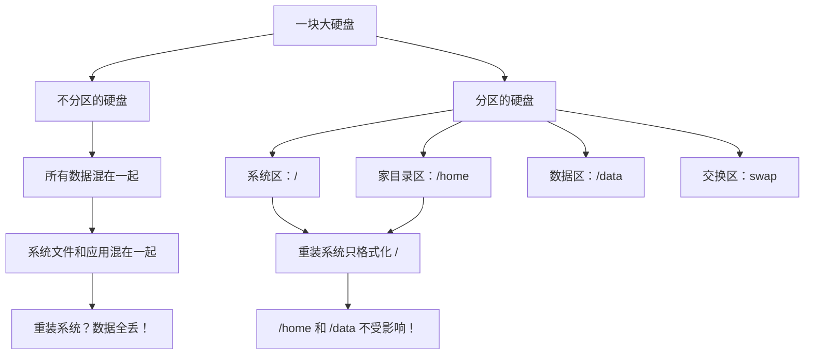

+++
title = "第13章：磁盘管理入门"
weight = 130
date = "2026-03-24T13:18:28+08:00"
type = "docs"
description = ""
isCJKLanguage = true
draft = false
+++


# 第十三章：磁盘管理入门
## 13.1 磁盘分区概念：为什么要分区？

想象一下：你买了一个巨大的仓库（硬盘），但是**不分隔间**就直接往里塞东西...找东西的时候怎么办？把整个仓库翻个底朝天？

**分区就是把一个大硬盘分成多个"隔间"**，每个隔间可以放不同的东西，有不同的"规则"！

### 为什么要分区？



### 分区的好处

| 好处 | 说明 |
|------|------|
| **数据安全** | 系统坏了，只丢系统区 |
| **重装方便** | 重装系统不动用户数据 |
| **性能优化** | 不同分区用不同文件系统 |
| **隔离日志** | 日志爆了，不影响其他分区 |
| **多系统启动** | 一块硬盘装多个系统 |

> 打个比方：分区就像给你的房子分房间——厨房、卧室、卫生间各司其职。厨房发大水了，不会把你卧室淹了！

---

## 13.2 MBR 分区表：传统分区方式（最大 2TB）

**MBR** = **M**aster **B**oot **R**ecord，主引导记录。这是早期的分区方式，1983年诞生，统治了 PC 领域几十年！

### MBR 的限制

```bash
# MBR 的硬伤：
# 1. 最大支持 2TB 的硬盘！
#    超过 2TB？对不起，用不了！
# 2. 最多只能有 4 个主分区！
#    想分更多？必须用"扩展分区"套"逻辑分区"！
```

> MBR 就像老式邮政编码，只能编码有限的地址！

### 13.2.1 主分区：最多 4 个

**主分区**是"正式的分区"，可以安装操作系统！

```bash
# 主分区特点：
# - 最多 4 个（这是 MBR 的硬限制！）
# - 可以安装操作系统
# - 可以设置为启动分区
# - 可以格式化
```

### 13.2.2 扩展分区

**扩展分区**是 MBR 的"变通方案"——当你想分超过4个区时！

```bash
# 扩展分区特点：
# - 最多 1 个（所以主分区+扩展分区 ≤ 4）
# - 不能直接使用，只是"容器"
# - 里面可以划分多个"逻辑分区"
```

### 13.2.3 逻辑分区

**逻辑分区**是从扩展分区里"划分"出来的分区！

```bash
# MBR 分区布局示例：
# /dev/sda
# ├── /dev/sda1  (主分区)  50GB   # 安装 Windows
# ├── /dev/sda2  (主分区) 100GB   # 安装 Linux
# ├── /dev/sda3  (扩展分区) 剩余空间
# │   ├── /dev/sda5  (逻辑分区)  200GB  # /home
# │   ├── /dev/sda6  (逻辑分区)   50GB  # swap
# └── (扩展分区本身不能使用)

# 注意：扩展分区没有编号（sda3），逻辑分区从 sda5 开始！
```

> 小技巧：主分区是"独立房间"，逻辑分区是"合租房里的隔间"！

---

## 13.3 GPT 分区表：现代分区方式（UEFI，无限制）

**GPT** = **G**UID **P**artition **T**able，GUID 分区表。这是现代硬盘的"标配"！

### GPT 的优势

```bash
# GPT 的优势：
# 1. 最大支持 9.4ZB（是的，ZB！约等于无限）
# 2. 最多 128 个分区（Windows 限制，Linux 无限制）
# 3. 自带备份（分区表在硬盘头尾各存一份）
# 4. CRC 校验（数据损坏能检测出来）
# 5. 64位磁盘序列号（唯一标识）
```

> GPT 就像现代邮政编码系统，能编码几乎无限的地址！

### GPT vs MBR

| 特性 | MBR | GPT |
|------|-----|-----|
| 最大硬盘 | 2TB | 9.4ZB |
| 最大分区数 | 4（主）+ 扩展 | 128（Windows）/ 无限（Linux）|
| 启动方式 | BIOS | UEFI |
| 分区表备份 | 无 | 硬盘头尾各一份 |
| 数据校验 | 无 | CRC 校验 |

> 现代电脑（2010年后）基本都支持 UEFI + GPT！如果你的电脑还在用 MBR，是时候升级了！

---

## 13.4 fdisk 分区工具：MBR 分区

**fdisk** 是 Linux 最经典的分区工具，但只支持 MBR！

```bash
# fdisk 只支持 MBR
# 想用 GPT？用 gdisk 或 parted！
```

### 13.4.1 fdisk -l：列出分区

```bash
# 列出所有磁盘的分区
sudo fdisk -l

# 输出示例：
# Disk /dev/sda: 500 GB, 500107862016 bytes, 976773168 sectors
# Units = sectors of 1 * 512 = 512 bytes
# Sector size (logical/physical): 512 bytes / 4096 bytes
# I/O size (minimum/optimal): 4096 bytes / 4096 bytes
# Disk label type: dos
# Disk identifier: 0x00012345
#
# Device      Boot   Start      End         Blocks     Id   System
# /dev/sda1  *      2048      1024000     512000     83   Linux
# /dev/sda2         1024001   500000000   250000000  83   Linux
```

### 13.4.2 fdisk /dev/sdb：交互式分区

```bash
# 开始分区（交互式）
sudo fdisk /dev/sdb

# fdisk 交互命令：
# Command action
#    a   toggle a bootable flag
#    b   edit bsd disklabel
#    c   toggle the dos compatibility flag
#    d   delete a partition         # 删除分区
#    l   list known partition types # 列出分区类型
#    m   print this menu            # 显示帮助
#    n   add a new partition         # 新建分区
#    o   create a new empty DOS partition table
#    p   print the partition table   # 显示分区表
#    q   quit without saving changes # 不保存退出
#    s   create a new empty Sun disklabel
#    t   change a partition's system id
#    u   change display/entry units
#    v   verify the partition table
#    w   write table to disk and exit # 保存退出
```

### 13.4.3 n：新建分区

```bash
# fdisk 交互示例：创建一个 10GB 的分区

Command (m for help): n
Partition type:
   p   primary (3 primary, 0 extended, 1 free)
   e   extended
Select (default p): p
Partition number (1-4, default 3): 3
First sector (2048-500000000, default 2048): <直接回车使用默认值>
Last sector, +sectors or +size{K,M,G} (2048-500000000, default 500000000): +10G

Command (m for help): p
# Device      Boot   Start      End         Blocks     Id   System
# /dev/sdb3          2048    20971520    10485248   83   Linux
```

> 💡 **小技巧**：起始扇区直接按回车使用默认值即可，通常不需要手动指定。结束位置可以用 `+10G` 这样的格式指定大小，比计算扇区数方便多了！

### 13.4.4 p：主分区

```bash
# 新建主分区
Command (m for help): n
Partition type:
   p   primary (0 primary, 0 extended, 4 free)
   e   extended
Select (default p): p
Partition number (1-4, default 1): 1
# 输入分区大小
Last sector...: +50G
```

> 💡 **提示**：如果已经有分区，fdisk会显示当前分区数量，分区编号需要选择未被使用的。

### 13.4.5 e：扩展分区

```bash
# 新建扩展分区
Command (m for help): n
Partition type:
   p   primary (2 primary, 0 extended, 2 free)
   e   extended
Select (default p): e
Partition number (1-4, default 3): 3
# 指定大小为剩余全部空间
Last sector...: +200G
```

> ⚠️ **注意**：扩展分区本身不能使用，需要在其中创建逻辑分区！

### 13.4.6 l：逻辑分区

```bash
# 在扩展分区内创建逻辑分区
Command (m for help): n
# 如果已有扩展分区，fdisk会自动提示创建逻辑分区
Select (default p): l
# 逻辑分区自动分配编号（从5开始，1-4保留给主分区/扩展分区）
# 输入分区大小
Last sector...: +100G
```

> 💡 **逻辑分区编号规则**：
> - 1-4：保留给主分区和扩展分区
> - 5+：逻辑分区（从5开始）
> - 例如：/dev/sda5, /dev/sda6, /dev/sda7...

### 13.4.7 w：保存退出

```bash
# 保存并退出
Command (m for help): w
# The partition table has been altered!
# Calling ioctl() to re-read partition table.
# Syncing disks.
```

> 重要：修改完分区后，需要重新读取分区表！使用 `partprobe` 或重启系统！

---

## 13.5 gdisk 分区工具：GPT 分区

**gdisk** = **G**PT **disk**，专门用于 GPT 分区的工具！用法和 fdisk 几乎一样！

```bash
# 安装 gdisk（Ubuntu）
sudo apt install gdisk

# 列出 GPT 分区
sudo gdisk -l /dev/sda

# 开始分区
sudo gdisk /dev/sdb

# gdisk 交互命令（和 fdisk 类似）：
# Command: n (new partition)
# Command: p (print partition table)
# Command: d (delete partition)
# Command: w (write and quit)
# Command: q (quit without saving)
```

> gdisk 支持 GPT，但没有 MBR 的主/逻辑分区概念——所有分区都是"主分区"，最多128个！

---

## 13.6 parted 分区工具：交互式分区

**parted** 是一个"全能选手"，同时支持 MBR 和 GPT！

### 13.6.1 parted /dev/sdb

```bash
# 启动 parted（交互式）
sudo parted /dev/sdb

# parted 提示符：
# (parted)
```

### 13.6.2 mklabel gpt

```bash
# 创建分区表
(parted) mklabel gpt
# Warning: The existing disk label on /dev/sdb will be destroyed and all data on this disk will be lost.
# Do you want to continue?
# Yes/No? Yes

# 分区表类型：
# msdos   # MBR
# gpt     # GPT
```

### 13.6.3 mkpart

```bash
# 创建分区
(parted) mkpart
# Partition name?  []? data
# File system type?  [ext2]? ext4
# Start? 1MB
# End? 100GB

# 查看分区
(parted) print
# Model: VMware Virtual Disk (scsi)
# Disk /dev/sdb: 500GB
# Sector size (logical/physical): 512B/512B
# Partition Table: gpt
#
# Number  Start   End     Size    File system  Name   Flags
#  1      1049kB 100GB   100GB   ext4        data
```

```bash
# parted 常用命令：
# (parted) help              # 显示帮助
# (parted) print             # 显示分区表
# (parted) mklabel gpt      # 创建分区表
# (parted) mkpart           # 创建分区
# (parted) rm 1             # 删除分区 1
# (parted) quit             # 退出
```

---

## 13.7 mkfs 格式化

**mkfs** = **m**a**k**e **f**ile**s**ystem，格式化！创建文件系统！

```bash
# mkfs 只是"前端"，实际调用具体工具：
# mkfs.ext4  → 格式化 ext4
# mkfs.xfs   → 格式化 XFS
# mkfs.vfat  → 格式化 FAT32（U 盘）
```

### 13.7.1 mkfs.ext4 /dev/sdb1

```bash
# 格式化为 ext4
sudo mkfs.ext4 /dev/sdb1

# 输出：
# mke2fs 1.45.6 (20-Mar-2020)
# Discarding device blocks: done
# Creating filesystem with 262144 4k blocks and 65536 inodes
# Filesystem UUID: a1b2c3d4-e5f6-7890-abcd-ef1234567890
# Superblock backups stored on blocks:
#     32768, 98304, 163840, 229376, 294912
# Allocating group tables: done
# Writing inode tables: done
# Creating journal (4096 blocks): done
# Writing superblocks and filesystem accounting information: done
```

### 13.7.2 mkfs.xfs /dev/sdb1

```bash
# 格式化为 XFS
sudo mkfs.xfs /dev/sdb1

# 输出：
# meta-data=/dev/sdb1            isize=512    agcount=4, agsize=65536 blks
#          =                       sectsz=512   attr=2, projid32bit=1
#          =                       crc=1        finobt=1, sparse=1, rmapbt=1
#          =                       unreclaim=1  nodinodeq=on,  nobrowse
# data     =                       bsize=4096   blocks=262144, imaxpct=25
#          =                       sunit=0      swidth=0 blks
# naming   =version 2              bsize=4096   ascii-ci=0, ftype=1
# log      =internal log           bsize=4096   blocks=1280, version=2
#          =                       sectsz=512   sunit=0 blks, lazy-count=1
# realtime =none                   extsz=4096   blocks=0, rtextents=0
```

### 13.7.3 mkfs.btrfs /dev/sdb1

```bash
# 格式化为 Btrfs
sudo mkfs.btrfs /dev/sdb1

# 输出：
# btrfs-progs v5.4
# See http://btrfs.wiki.kernel.org for more information.
#
# Label:              (null)
# Device size:        100.00 GiB
# Btrfs version:      5.4
# Allocated:          0 bytes
# UBIQUITY:           -
# Checksum:           crc32c
# Number of devices:   1
# Devices:
#    ID        SIZE      PATH
#    1       100.00 GiB  /dev/sdb1
```

### 13.7.4 -L 指定卷标

```bash
# 指定卷标（就像给硬盘起名字）
sudo mkfs.ext4 -L "MyData" /dev/sdb1

# 查看卷标
sudo e2label /dev/sdb1
# MyData

# 查看所有磁盘的 UUID 和卷标
sudo blkid
# /dev/sdb1: LABEL="MyData" UUID="a1b2c3d4-e5f6-7890-abcd-ef1234567890" TYPE="ext4"
```

---

## 13.8 mount 挂载

**mount** 是"挂载"命令，把分区/硬盘连接到目录！

> 为什么需要挂载？因为 Linux 所有文件都在一个树形结构里。新硬盘不挂载，就无法访问！

### 13.8.1 mount /dev/sdb1 /mnt

```bash
# 基本挂载
sudo mount /dev/sdb1 /mnt

# 查看挂载
df -h /mnt
# Filesystem      Size  Used Avail Use% Mounted on
# /dev/sdb1       99G   60M   94G   1% /mnt

# 查看所有挂载
mount
```

### 13.8.2 mount -o ro：只读挂载

```bash
# 只读挂载（不能写入）
sudo mount -o ro /dev/sdb1 /mnt

# 重新挂载为读写
sudo mount -o rw /dev/sdb1 /mnt
```

### 13.8.3 mount -t ext4：指定类型

```bash
# 指定文件系统类型（通常不需要，mount 会自动检测）
sudo mount -t ext4 /dev/sdb1 /mnt

# 常用挂载选项：
# ro            # 只读
# rw            # 读写
# noexec        # 禁止执行程序
# nosuid        # 忽略 suid 位
# nodev         # 不解释字符/块设备
# noatime       # 不更新访问时间
# relatime      # 相对 atime 更新
# defaults      # 默认选项（rw, suid, dev, exec, auto, nouser, async）

# 组合使用
sudo mount -o noexec,nosuid,nodev /dev/sdb1 /mnt
```

---

## 13.9 umount 卸载

**umount** 是"卸载"命令，解除挂载关系！

### 13.9.1 umount /mnt

```bash
# 通过挂载点卸载
sudo umount /mnt

# 通过设备卸载
sudo umount /dev/sdb1
```

### 13.9.2 umount /dev/sdb1

```bash
# 通过设备名卸载
sudo umount /dev/sdb1

# 如果设备正在使用，会报错：
# umount: /mnt: target is busy.
```

### 13.9.3 umount -l：强制卸载

```bash
# -l = lazy，懒卸载
# 立即断开文件系统，但延迟清理（等所有进程释放后）
sudo umount -l /mnt

# -f = force，强制卸载（主要用于NFS等网络文件系统）
# 本地文件系统强制卸载可能导致数据损坏！
sudo umount -f /mnt

# 查看谁在使用这个挂载点
sudo lsof +D /mnt
# 或
sudo fuser -v /mnt

# 终止占用进程后重试
sudo fuser -k /mnt
sudo umount /mnt
```

> 小技巧：卸载前先切换到其他目录！
> ```bash
> cd ~
> sudo umount /mnt
> ```

> ⚠️ **警告**：强制卸载可能导致数据损坏！尽量先关闭占用文件，而不是强制卸载。

---

## 13.10 /etc/fstab 自动挂载配置

**/etc/fstab** 定义了开机时**自动挂载**的文件系统！

### 13.10.1 格式：设备 挂载点 类型 选项 转储 检查

```bash
# /etc/fstab 格式：
# <file system>   <mount point>   <type>   <options>       <dump>  <pass>
# 设备             挂载点           类型      选项            转储    检查

# 示例：
UUID=a1b2c3d4-e5f6-7890-abcd-ef1234567890  /data  ext4  defaults  0  2
```

| 字段 | 说明 |
|------|------|
| file system | 设备名、UUID 或 LABEL |
| mount point | 挂载点（交换分区用 `none`）|
| type | 文件系统类型 |
| options | 挂载选项（defaults, nofail 等）|
| dump | 是否备份（0=否, 1=是）|
| pass | fsck 检查顺序（0=不检查, 1=先检查根, 2=后检查）|

### 13.10.2 UUID 方式挂载

```bash
# 查看 UUID
sudo blkid

# /dev/sda1: UUID="xxxx-xxxx" TYPE="vfat"
# /dev/sda2: UUID="a1b2c3d4-..." TYPE="ext4"

# 使用 UUID 挂载（推荐！）
# /etc/fstab 配置：
UUID=a1b2c3d4-e5f6-7890-abcd-ef1234567890  /data  ext4  defaults  0  2
```

> 为什么用 UUID？因为设备名（/dev/sda）可能会变！UUID 是固定的！

### 13.10.3 LABEL 方式挂载

```bash
# 使用卷标挂载
# /etc/fstab 配置：
LABEL=MyData  /data  ext4  defaults  0  2
```

### 常用 fstab 配置示例

```bash
# /etc/fstab

# 根分区
UUID=root-uuid  /               ext4    errors=remount-ro  0  1

# 交换分区
UUID=swap-uuid  none            swap    sw                0  0

# 数据分区
UUID=data-uuid  /data          ext4    defaults          0  2

# Windows NTFS 分区
UUID=windows-uuid  /mnt/windows ntfs-3g defaults,uid=1000,gid=1000  0  0

# NFS 网络挂载
192.168.1.100:/nfs/share  /nfs  nfs  defaults  0  0

# CIFS/SMB 共享
//192.168.1.100/share  /smb  cifs  username=user,password=pass  0  0
```

> 测试 fstab 配置：
> ```bash
> sudo mount -a
> # 如果没有报错，说明配置正确！
> ```

---

## 13.11 UUID 和 LABEL：稳定的设备标识

设备名（/dev/sda）会变，但 **UUID** 和 **LABEL** 是稳定的！

### 13.11.1 blkid：查看 UUID

```bash
# 查看所有磁盘的 UUID 和类型
sudo blkid

# 输出：
# /dev/sda1: UUID="xxxx-xxxx" TYPE="vfat" PARTUUID="yyyy-yyyy"
# /dev/sda2: UUID="a1b2c3d4-e5f6-7890-abcd-ef1234567890" TYPE="ext4" PARTUUID="zzzz-zzzz"

# 查看特定设备
sudo blkid /dev/sdb1
# /dev/sdb1: UUID="a1b2c3d4-e5f6-7890-abcd-ef1234567890" TYPE="ext4"
```

### 13.11.2 e2label：设置卷标

```bash
# 设置 ext4 卷标
sudo e2label /dev/sdb1 "MyData"

# 查看卷标
sudo e2label /dev/sdb1
# MyData

# 设置 XFS 卷标
sudo xfs_admin -L "MyXFSData" /dev/sdb1
```

---

## 13.12 df 查看磁盘使用情况

**df** = **d**isk **f**ree，磁盘剩余空间！

### 13.12.1 df -h：人性化显示

```bash
# -h = human-readable，人类可读
df -h

# 输出：
# Filesystem      Size  Used Avail Use% Mounted on
# /dev/sda2       100G   40G   60G  40% /
# /dev/sda1       500M  100M  400M  20% /boot
# /dev/sdb1       200G   80G  120G  40% /data
# tmpfs           2.0G     0  2.0G   0% /dev/shm
```

### 13.12.2 df -T：显示文件系统类型

```bash
# -T = type，显示文件系统类型
df -hT

# 输出：
# Filesystem     Type      Size  Used Avail Use% Mounted on
# /dev/sda2     ext4      100G   40G   60G  40% /
# tmpfs          tmpfs     2.0G     0  2.0G   0% /dev/shm
# /dev/sdb1      xfs       200G   80G  120G  40% /data
```

### 13.12.3 df -i：显示 inode

```bash
# -i = inode，显示 inode 使用情况
df -i

# 输出：
# Filesystem      Inodes  IUsed  IFree IUse% Mounted on
# /dev/sda2     3932160  123456 3808704   4% /
# /dev/sdb1     1966080   78910 1887170   5% /data
```

> 如果 inode 满了，即使磁盘还有空间，也无法创建新文件！

---

## 13.13 du 查看目录大小

**du** = **d**isk **u**sage，磁盘使用情况！

### 13.13.1 du -sh 目录：总大小

```bash
# -s = summarize，总计
# -h = human-readable
du -sh /var/log

# 输出：
# 1.2G    /var/log
```

### 13.13.2 du -h --max-depth=1：子目录大小

```bash
# --max-depth=1，只显示一级子目录
du -h --max-depth=1 /var

# 输出：
# 500M    /var/cache
# 1.2G    /var/log
# 50G     /var/www
# 200M    /var/lib
# ...

# 排序显示（最大的在前面）
du -h --max-depth=1 /var | sort -rh
```

### 常用 du 命令

```bash
# 查看当前目录各子目录大小
du -h --max-depth=1

# 查找最大的 10 个文件/目录
du -ah /home | sort -rh | head -10

# 排除某些目录
du -sh --exclude='*.log' /var/log
```

---

## 13.14 磁盘配额管理：quota

**磁盘配额**可以限制用户或组使用的磁盘空间！

```bash
# 安装 quota
sudo apt install quota

# 1. 在 /etc/fstab 中启用配额
# /etc/fstab
UUID=xxxx  /data  ext4  defaults,usrquota,grpquota  0  2

# 2. 重新挂载
sudo umount /data
sudo mount -o remount /data

# 3. 初始化配额数据库
sudo quotacheck -cum /data

# 4. 启用配额
sudo quotaon /data

# 5. 设置用户配额
sudo edquota username
# Disk quotas for user username (uid 1000):
#   Filesystem                   blocks    soft    hard    inodes    soft    hard
#   /dev/sdb1                       0     100M     150M         0       0       0

# 6. 查看配额
sudo quota username

# 7. 查看配额状态
sudo quota -s username
```

```bash
# 配额命令总结：
# quotacheck    # 扫描文件系统，创建配额数据库
# quotaon       # 启用配额
# quotaoff      # 禁用配额
# edquota       # 编辑用户配额
# edquota -g    # 编辑组配额
# quota         # 查看用户配额
# repquota      # 查看所有用户的配额状态
```

> 配额设置说明：
> - **soft limit**：软限制，快到达时警告
> - **hard limit**：硬限制，禁止超过
> - 宽限期：超过 soft limit 后，在宽限期内仍可写入，超过硬限制则禁止

---

## 本章小结

本章我们学习了 Linux 磁盘管理的基础知识！

**核心知识点：**

1. **分区概念**：分区把大硬盘分成多个"隔间"，便于管理和备份。

2. **MBR vs GPT**：
   - MBR：老式，最大 2TB，最多 4 个主分区
   - GPT：现代，几乎无限空间，最多 128 个分区

3. **分区工具**：
   - fdisk：MBR 分区
   - gdisk：GPT 分区
   - parted：全能选手（MBR 和 GPT 都能用）

4. **文件系统创建（mkfs）**：
   - mkfs.ext4：ext4 文件系统
   - mkfs.xfs：XFS 文件系统
   - mkfs.btrfs：Btrfs 文件系统

5. **挂载（mount/umount）**：
   - 挂载点必须是已存在的目录
   - 卸载前确保没有程序在使用

6. **/etc/fstab 自动挂载**：
   - 使用 UUID 比设备名更稳定
   - 修改后用 `mount -a` 测试

7. **UUID 和 LABEL**：
   - blkid 查看 UUID
   - e2label 设置卷标

8. **磁盘使用情况**：
   - df：查看文件系统使用
   - du：查看目录大小

9. **磁盘配额**：限制用户/组的磁盘使用量。

下一章我们将学习 **链接文件**，深入理解硬链接和软链接！敬请期待！