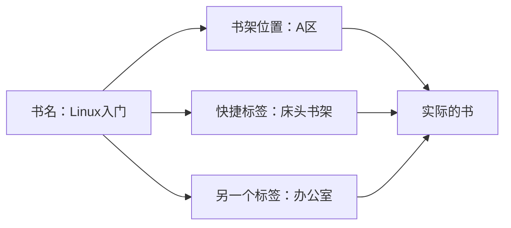
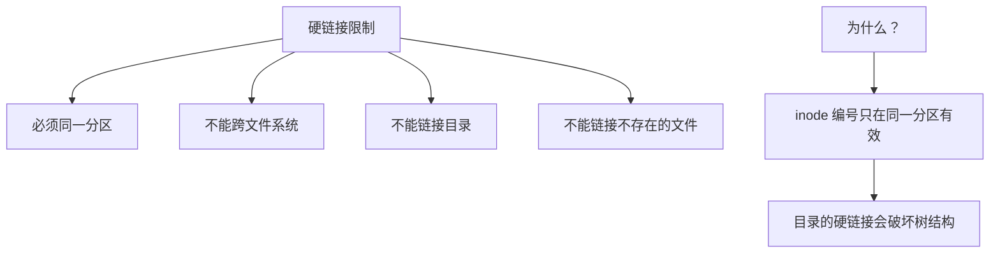
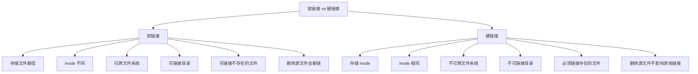
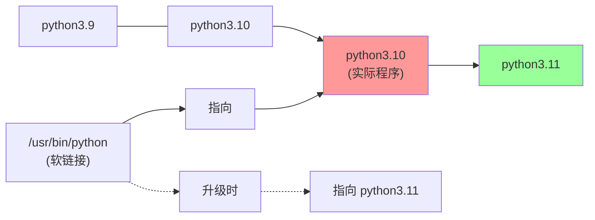

+++
title = "第14章：链接文件"
weight = 140
date = "2026-03-24T13:18:28+08:00"
type = "docs"
description = ""
isCJKLanguage = true
draft = false
+++


# 第十四章：链接文件
## 14.1 什么是链接？链接的作用

想象一下这样的场景：你的书架上有一本超级重要的书《Linux入门到精通》。你把它放在了"技术书籍"区，但你想在"床头"也能随时看到它。

**你会怎么做？**

- 选项1：买两本（浪费钱！）
- 选项2：把书拆成两半（出版社要追杀你！）
- 选项3：**做个标签/索引，指向书架上的那本书**！✅

在 Linux 里，这个"标签/索引"就是**链接**！

### 链接是什么？

**链接**（Link）是文件的"快捷方式"或"别名"。它让你可以用多个名字访问同一个文件！



### 链接解决了什么问题？

| 问题 | 没有链接 | 有链接 |
|------|----------|--------|
| 同一文件多处使用 | 复制多份，占用空间 | 多个名字，一份文件 |
| 文件改名/移动 | 所有引用都要改 | 改一处，其他自动生效 |
| 程序找库 | 必须知道库的真实路径 | 可以链接到任何位置 |

---

## 14.2 硬链接：同一个 inode 的多个文件名

**硬链接**是 Linux 里最"直接"的链接方式——**多个文件名，指向同一个 inode（数据存储位置）**！

> 简单理解：硬链接就是给同一个文件起了多个"身份证号"！

### 14.2.1 创建硬链接：ln 源 目标

```bash
# 创建硬链接
# 语法：ln 源文件 目标链接名
ln original.txt hardlink.txt

# 查看：
ls -li original.txt hardlink.txt

# 输出：
# 131079 -rw-r--r--  2 user user  123 Jan 15 10:30 original.txt
# 131079 -rw-r--r--  2 user user  123 Jan 15 10:35 hardlink.txt
# ↑ 注意：两个文件的 inode 相同（131079）！
# Links 那列都是 2（表示有2个硬链接指向这个 inode）
```

### 14.2.2 特点：同一分区，不能跨文件系统

硬链接虽然好用，但有**严格的限制**：

```bash
# 限制1：不能跨文件系统
# /home 和 /data 可能是不同的分区
ln /home/user/file.txt /data/file_hardlink.txt
# ln: failed to create hard link '/data/file_hardlink.txt': Invalid cross-device link

# 限制2：不能链接目录
ln /home/user /home/user_hardlink
# ln: /home/user: hard link not allowed for directory
```



### 硬链接的工作原理

```bash
# inode 的链接计数（Links）决定了文件数据是否会被释放
# 只有当 Links = 0 时，文件数据才会被真正删除（磁盘空间回收）

# 示例：
touch original.txt          # Links = 1
ln original.txt link1.txt   # Links = 2
ln link1.txt link2.txt     # Links = 3

rm original.txt             # Links = 2，文件数据还在！
rm link1.txt               # Links = 1，文件数据还在！
rm link2.txt               # Links = 0，文件数据被删除，磁盘空间回收！
```

> 想象一下：每个 inode 就像一个公寓，Links 就像公寓的门牌号。删除硬链接只是"摘掉一个门牌号"，只有当所有门牌号都没了，公寓才会被清空！

> ⚠️ **重要提示**：硬链接创建后，所有链接都是"平等"的——没有"原文件"和"链接"的区别！它们都是指向同一份数据的文件名，删除任何一个都不影响其他链接。

---

## 14.3 软链接（符号链接）：快捷方式

**软链接**（Symbolic Link）也叫**符号链接**，它更像是 Windows 的"快捷方式"——它存储的是**目标文件的路径**，而不是 inode！

> 软链接是一个"指针"，指向另一个文件/目录！

### 14.3.1 创建软链接：ln -s 源 目标

```bash
# 创建软链接
# 语法：ln -s 源文件 目标链接名
ln -s original.txt symlink.txt

# 查看：
ls -li original.txt symlink.txt

# 输出：
# 131079 -rw-r--r--  1 user user  123 Jan 15 10:30 original.txt
# 131080 lrwxrwxrwx  1 user user   12 Jan 15 10:40 symlink.txt -> original.txt
# ↑ 注意：
# 1. inode 不同（131079 vs 131080）
# 2. 文件大小是 12（因为存的是路径 "original.txt"）
# 3. 类型是 l（软链接）
# 4. -> 箭头显示指向的目标
```

### 14.3.2 特点：可跨分区，可链接目录

软链接几乎没有限制！

```bash
# 可以跨文件系统
ln -s /home/user/file.txt /data/file_link.txt
# 成功！

# 可以链接目录
ln -s /home/user/projects /home/user/projects_link
# 成功！

# 可以链接不存在的文件（软链接会变成"断链"）
ln -s /nonexistent.txt dangling_link.txt
# 创建成功，但链接是断的
```

```bash
# 检查软链接是否有效
# 1. ls -l 显示的颜色不同（红色通常表示断链）
ls -l dangling_link.txt
# lrwxrwxrwx 1 user user 12 Jan 15 10:40 dangling_link.txt -> /nonexistent.txt
# （红色，表示断链）

# 2. 用 -d 检查目录链接
file symlink.txt
# symlink.txt: symbolic link to original.txt

# 3. 读取链接会失败
cat dangling_link.txt
# cat: dangling_link.txt: No such file or directory
```



---

## 14.4 硬链接 vs 软链接：区别与应用场景

让我们来一个全面的对比！

### 14.4.1 硬链接：文件备份

硬链接最适合的场景：**同分区内的文件共享**！

> 重要提示：硬链接**不是真正的备份**！因为修改任何一个硬链接，所有硬链接的内容都会一起变！它们本质上是"同一个文件"的不同名字。

那硬链接有什么用？

```bash
# 场景1：同一个分区内，多个位置需要访问同一份数据
# 比如：一个大数据库文件，数据库和备份脚本都要访问
ln /data/huge_database.db /backup/huge_database_link.db
# 两个路径，物理上只有一份数据！

# 场景2：协作开发
# 两个人在同一个项目里工作，需要访问同一份代码
ln /shared/project_main.c /home/alice/project_main.c
ln /shared/project_main.c /home/bob/project_main.c
# 三个文件名，同一份代码！

# 场景3：版本控制系统的"内部原理"
# Git 内部就是用硬链接来共享内容的！
```

> 硬链接的"坑"：**修改任何一个硬链接，所有硬链接都会变**！因为它们本质上是同一个文件！

### 14.4.2 软链接：软件版本管理

软链接最适合的场景：**软件版本管理**！

```bash
# 场景：你安装了多个 Python 版本
# /usr/bin/python3.8
# /usr/bin/python3.9
# /usr/bin/python3.10

# 你想让 python 总是指向最新的版本
sudo ln -s /usr/bin/python3.10 /usr/bin/python
#          ↑ 源                    ↑ 链接名

# 升级时：
# 1. 安装新版本
# 2. 改一下链接
sudo ln -sf /usr/bin/python3.11 /usr/bin/python
# ↑ -f 强制覆盖原来的链接
```

> 软链接是"软件版本管理神器"！一个链接，多个版本，切换自如！



---

## 14.5 ln 创建链接

**ln** = **l**i**n**k，创建链接！

### 14.5.1 ln 源 目标：硬链接

```bash
# 创建硬链接
ln original.txt hardlink.txt

# 验证
ls -li original.txt hardlink.txt
# 131079 -rw-r--r--  2 user user  123 Jan 15 10:30 original.txt
# 131079 -rw-r--r--  2 user user  123 Jan 15 10:35 hardlink.txt
```

### 14.5.2 ln -s 源 目标：软链接

```bash
# 创建软链接
ln -s target.txt link.txt

# 验证
ls -li target.txt link.txt
# 131079 -rw-r--r--  1 user user  123 Jan 15 10:30 target.txt
# 131080 lrwxrwxrwx  1 user user   11 Jan 15 10:40 link.txt -> target.txt
```

### 14.5.3 ln -sf：强制覆盖

```bash
# -s  创建软链接
# -f  强制覆盖已存在的链接

# 如果 link.txt 已经存在
ln -sf new_target.txt link.txt

# 原来的 link.txt -> old_target.txt
# 变成了 link.txt -> new_target.txt
```

### 完整选项说明

```bash
# ln 常用选项：
# -s, --symbolic     # 创建软链接（符号链接）
# -f, --force        # 强制覆盖已存在的链接
# -n, --no-dereference   # 如果目标是软链接，不follow它
# -v, --verbose      # 显示详细过程

# 示例：
ln -sv /path/to/target link_name

# 查看链接指向
readlink link_name
# /path/to/target

# 查看链接信息
file link_name
# link_name: symbolic link to /path/to/target
```

---

## 本章小结

本章我们学习了 Linux 中的链接文件！

**核心知识点：**

1. **链接**是文件的"快捷方式"或"别名"，让一个文件可以用多个名字访问。

2. **硬链接**：
   - 多个文件名指向同一个 inode
   - inode 的链接计数（Links）记录有多少个文件名
   - **限制**：不能跨文件系统、不能链接目录、必须链接存在的文件
   - **特点**：删除一个硬链接，只要还有 Links > 0，文件就不会消失
   - **用途**：适合同一文件需要多个"入口"的场景

3. **软链接（符号链接）**：
   - 存储的是目标文件的路径（类似 Windows 快捷方式）
   - **没有硬链接的限制**：可跨文件系统、可链接目录、可链接不存在的文件
   - **缺点**：删除源文件后，软链接会变成"断链"
   - **用途**：软件版本管理、创建路径别名、解决路径深度问题

4. **ln 命令**：
   - `ln 源 目标` → 创建硬链接
   - `ln -s 源 目标` → 创建软链接
   - `ln -sf` → 强制覆盖

**硬链接 vs 软链接对比：**

| 特性 | 硬链接 | 软链接 |
|------|--------|--------|
| 本质 | 指向同一 inode | 存储目标路径 |
| inode | 相同 | 不同 |
| 跨文件系统 | ❌ 不行 | ✅ 可以 |
| 链接目录 | ❌ 不行 | ✅ 可以 |
| 链接不存在文件 | ❌ 不行 | ✅ 可以 |
| 删除源文件 | 不影响 | 变成断链 |
| 占用空间 | 不占额外空间 | 几乎为0 |
| 性能 | 稍快 | 稍慢（多一次寻址） |

**实用场景：**

```bash
# 1. 创建常用目录的快捷方式
ln -s /var/www/html mywebsite

# 2. 管理多个软件版本
ln -sf /opt/python-3.11.0/bin/python /usr/bin/python

# 3. 解决长路径问题
ln -s /home/user/documents/projects/linux/kernel/source /home/user/kernel

# 4. 快速访问网络存储
ln -s /mnt/nas-server/documents ~/documents
```

恭喜你完成了 Linux 基础教程第11-14章！🎉

你已经学会了：
- 文件系统基础与各种文件系统类型
- Linux 目录结构详解
- 磁盘管理（分区、格式化、挂载）
- 链接文件（硬链接与软链接）

继续加油，Linux 大神之路，从这里开始！🚀