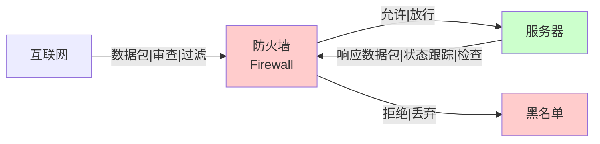
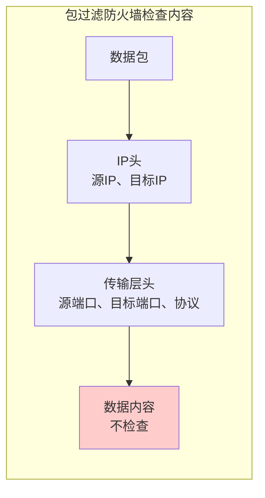
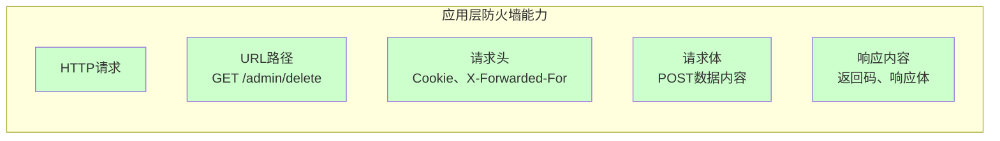
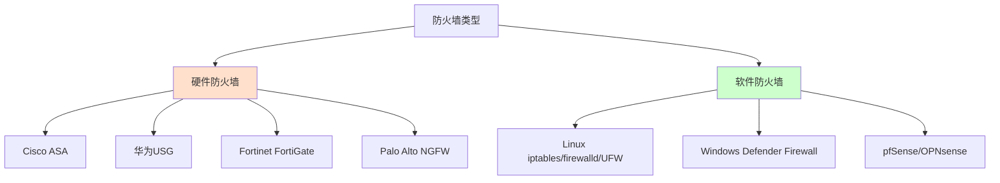
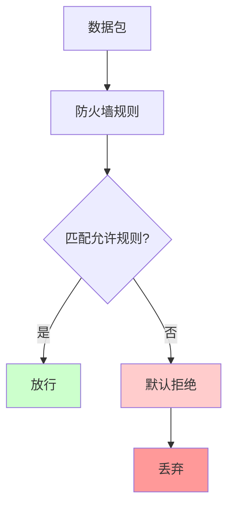
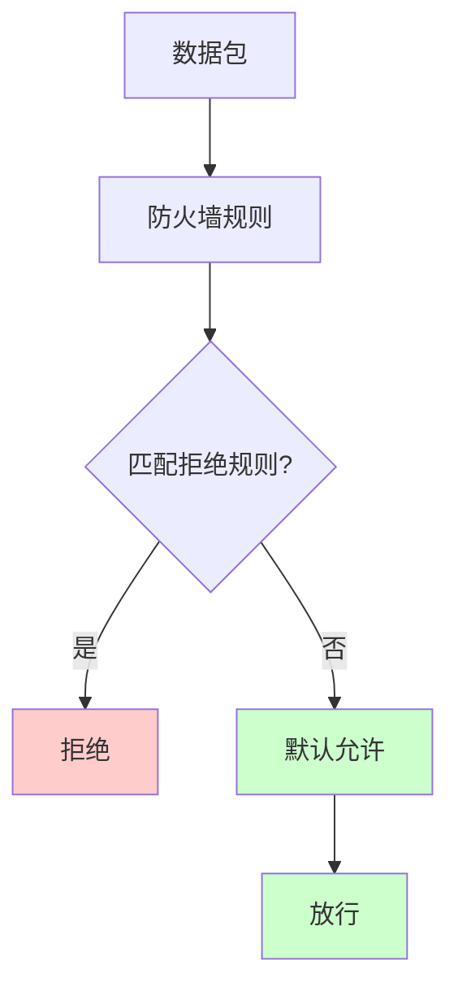

+++
title = "第34章：防火墙基础"
weight = 340
date = "2026-03-24T13:18:28+08:00"
type = "docs"
description = ""
isCJKLanguage = true
draft = false
+++


# 第三十四章：防火墙基础

防火墙（Firewall）是网络安全的"守门员"——它站在你的服务器和网络之间，决定哪些数据包可以进来，哪些必须滚蛋。

想象一下：你的服务器是一栋大楼，防火墙就是大楼门口的保安。他会问你三个问题：你是谁？你找谁？你有通行证吗？三个问题有一个答不上来，对不起，请回吧。

> 本章配套视频：防火墙就是网络世界里的门卫，没有它，你的服务器就是裸奔。

## 34.1 防火墙是什么？网络访问控制

防火墙是一种网络安全系统，它根据预先定义好的安全规则（Rule Set），对进出网络的数据包进行过滤和管控。

说人话：防火墙就是一个"数据包审查员"。每个想进出你服务器的数据包，都要经过它的盘问——"你从哪来？要到哪去？是什么协议？用什么端口？"。符合规则就放行，不符合就拒之门外。

防火墙的核心功能：

- **包过滤（Packet Filtering）**：检查每个数据包的头部信息（源IP、目标IP、端口、协议），决定放行还是丢弃
- **状态检测（Stateful Inspection）**：不仅看单个数据包，还跟踪连接状态（新建、Established、Related等）
- **应用层过滤（Application Layer Filtering）**：深入到应用层协议，检查数据包的内容（比如HTTP请求的URL）



## 34.2 防火墙类型

防火墙按技术层次分为三代：包过滤防火墙、状态检测防火墙、应用层防火墙。

### 34.2.1 包过滤防火墙

包过滤防火墙（Packet Filtering Firewall）是第一代防火墙，也是最简单、最基础的一种。

它工作在OSI模型的网络层（第三层）和传输层（第四层），只检查数据包的头部信息：

- 源IP地址
- 目标IP地址
- 源端口
- 目标端口
- 协议类型（TCP、UDP、ICMP）

**优点**：速度快，资源消耗低，对网络性能影响小。

**缺点**：只能看到"表面信息"，无法感知"上下文"。比如，它不知道这个数据包是新建连接的第一个包，还是已经建立连接后的数据包。



**典型代表**：早期的Cisco路由器ACL（Access Control List）、Linux的iptables基础规则。

### 34.2.2 状态检测防火墙

状态检测防火墙（Stateful Inspection Firewall）是第二代防火墙，又称"状态追踪防火墙"。

它的革命性创新是：会维护一个"连接状态表"（State Table），记录所有活跃的网络连接。当数据包到达时，防火墙不仅检查包本身，还会检查这个包是否属于一个已建立的合法连接。

工作原理：

- 当第一个TCP SYN包到达时，防火墙创建一个连接状态记录
- 后续属于这个连接的数据包，直接根据状态表放行
- 连接结束（FIN/RST）时，状态记录被删除

```mermaid
sequenceDiagram
    participant C as 客户端
    participant F as 状态检测防火墙
    participant S as 服务器

    C->>F: SYN包（新建连接）
    F->>F: 检查状态表：无记录<br/>检查规则：允许<br/>创建状态记录
    F->>S: SYN包
    S->>F: SYN-ACK包
    F->>F: 检查状态表：有记录<br/>匹配规则：放行
    F->>C: SYN-ACK包
    C->>F: ACK包
    F->>F: 检查状态表：有记录<br/>匹配规则：放行
    F->>S: ACK包
    Note over F: 此后该连接的数据包<br/>直接根据状态表放行
    C->>S: 数据传输...
    F->>S: （根据状态表直接放行）
    style F fill:#ffcccc
```

**优点**：比包过滤更安全，性能也不错，因为已建立连接的数据包不需要逐条规则匹配。

> 🎯 **实际应用**：现代Linux防火墙（iptables、firewalld、UFW）都使用状态检测，这是目前最主流的防火墙技术。

**缺点**：对UDP等无连接协议的连接状态跟踪较困难（通常使用超时机制）。

**典型代表**：Linux iptables（配合state模块）、Cisco ASA、华为防火墙。

### 34.2.3 应用层防火墙

应用层防火墙（Application Layer Firewall）是第三代防火墙，也叫"代理防火墙"（Proxy Firewall）。

它工作在OSI模型的第七层（应用层），能够理解特定应用层协议（如HTTP、SMTP、FTP）的内容，从而做出更精确的安全决策。

举个例子：传统防火墙只检查HTTP请求的IP和端口，而应用层防火墙能检查"你请求的URL是什么"、"请求头里带了什么Cookie"、"POST的数据是否符合预期"。



**优点**：安全性最高，能防御应用层攻击（SQL注入、XSS等）。

**缺点**：性能开销大，因为要解析每个数据包的应用层内容。

**典型代表**：Web应用防火墙（WAF，如ModSecurity）、下一代防火墙（NGFW，如Palo Alto、Fortinet）。

## 34.3 硬件防火墙 vs 软件防火墙

防火墙按部署形态分为硬件防火墙和软件防火墙。

**硬件防火墙**：独立的网络安全设备，通常是一台专门的机器，有自己的硬件和操作系统。企业级部署，吞吐量高，适合保护整个网络边界。

- **Cisco ASA**：Cisco经典的企业级防火墙
- **华为USG**：华为的防火墙产品线
- **Fortinet FortiGate**：Fortinet的下一代防火墙
- **Palo Alto PA系列**：Palo Alto的NGFW

**软件防火墙**：运行在操作系统上的防火墙软件，部署灵活，适合单台服务器或小型网络。

- **Linux iptables/nftables**：Linux内核内置
- **Linux firewalld**：CentOS/RHEL默认防火墙
- **Linux UFW**：Ubuntu默认防火墙，iptables的简化前端
- **Windows Defender Firewall**：Windows自带防火墙
- **pfSense/OPNsense**：开源的软件防火墙，可装在普通硬件上



**选择建议**：

- 中小企业、单机服务器：用软件防火墙（UFW/firewalld）完全够用
- 大型企业、数据中心：硬件防火墙做边界防护，软件防火墙做主机防护（纵深防御）
- 云服务器：云厂商提供安全组（本质上是软件防火墙），配合系统内防火墙使用

## 34.4 防火墙策略原则

防火墙规则的设计有两种基本原则：默认拒绝（Default Deny）和默认允许（Default Allow）。

### 34.4.1 默认拒绝

默认拒绝（Default Deny）的策略是：除非明确允许，否则一律禁止。

白名单模式——"法无授权即禁止"。

**优点**：最安全。任何新的服务、端口，如果没有明确开放，就无法被外部访问。攻击者想进来，难上加难。

**缺点**：配置复杂。你需要事先知道所有合法业务需求，然后逐一放行。如果漏掉某个正常需求，会导致业务故障。



**适用场景**：对外提供服务的Web服务器、数据库服务器、安全要求高的环境。

### 34.4.2 默认允许

默认允许（Default Allow）的策略是：除非明确禁止，否则一律放行。

黑名单模式——"法无禁止即自由"。

**优点**：配置简单，业务不会因为防火墙问题中断。

**缺点**：安全性差。只要没被规则明确禁止，攻击者就能进来。



**适用场景**：内网环境、测试环境、不关心安全性的场景。

> **安全铁律**：生产环境必须用"默认拒绝"策略。宁可业务暂时不通，也不能让攻击者长驱直入。

## 34.5 常见端口与服务对应关系

防火墙配置中最核心的工作就是"端口管理"——开放哪些端口，关闭哪些端口。下面是常见服务及其对应端口的汇总表：

| 端口 | 服务 | 说明 | 建议 |
|------|------|------|------|
| 22 | SSH | 远程管理 | 仅对管理IP开放 |
| 80 | HTTP | Web服务 | 开放 |
| 443 | HTTPS | 加密Web | 开放 |
| 21 | FTP | 文件传输 | 建议关闭，用SFTP替代 |
| 23 | Telnet | 明文远程登录 | **必须关闭** |
| 25 | SMTP | 邮件发送 | 仅对邮件服务器开放 |
| 53 | DNS | 域名解析 | UDP 53，谨慎开放 |
| 3306 | MySQL | 数据库 | **禁止公网访问** |
| 5432 | PostgreSQL | 数据库 | **禁止公网访问** |
| 6379 | Redis | 缓存数据库 | **禁止公网访问** |
| 27017 | MongoDB | NoSQL数据库 | **禁止公网访问** |
| 3389 | RDP | Windows远程桌面 | 仅对管理IP开放 |
| 445 | SMB | Windows文件共享 | 建议关闭 |
| 20/21 | FTP | 文件传输 | 建议关闭 |

> **安全配置原则**：防火墙规则越少越好，权限越小越安全。Web服务器只需要开放80/443，数据库只需要本地访问，SSH只对管理员IP开放。

---

## 本章小结

本章我们学了防火墙的基础知识：

- **防火墙定义**：网络访问控制设备，对进出数据包进行过滤和管控
- **包过滤防火墙**：第一代，只看IP头和端口，速度快但不安全
- **状态检测防火墙**：第二代，维护连接状态表，比包过滤更智能
- **应用层防火墙**：第三代，看懂应用层协议内容，最安全但性能开销大
- **硬件防火墙 vs 软件防火墙**：硬件适合企业边界，软件适合单台服务器
- **默认拒绝 vs 默认允许**：默认拒绝更安全（白名单），默认允许是作死（黑名单）
- **端口与服务关系**：知道常见服务对应什么端口，是防火墙配置的基础

下一章，我们开始在Ubuntu上用UFW配置防火墙。
