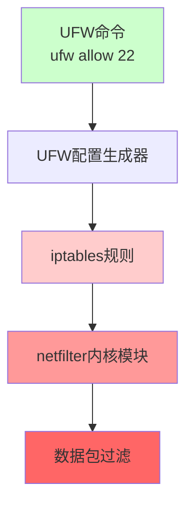

+++
title = "第35章：UFW 防火墙（Ubuntu）"
weight = 350
date = "2026-03-24T13:18:28+08:00"
type = "docs"
description = ""
isCJKLanguage = true
draft = false
+++


# 第三十五章：UFW 防火墙（Ubuntu）

UFW（Uncomplicated Firewall）是Ubuntu默认的防火墙管理工具。它的设计目标就是一个：**让复杂的iptables配置变得简单**。

用过iptables的人都知道，那语法简直是天书——`iptables -A INPUT -p tcp --dport 22 -j ACCEPT` 这种命令，谁记得住？UFW就是来解决这个痛点的，用`ufw allow 22`代替上面那一长串。

> 本章配套视频：UFW，让防火墙配置从"天书"变成"大白话"。

## 35.1 UFW 简介：Uncomplicated Firewall

UFW由 Canonical 公司开发，专门为Ubuntu/Debian设计。它的底层是强大的iptables/netfilter框架，但上层提供了一个简洁的命令行界面。

### 35.1.1 基于 iptables

UFW并不是一个新的防火墙内核，它只是iptables的"翻译器"和"简化壳"。所有UFW的规则，最终都会被转换成iptables规则，由Linux内核的netfilter模块执行。



简单理解：UFW = iptables的GUI（命令行版）。

### 35.1.2 命令简化

UFW把复杂的iptables命令简化成了几个简单的单词：

| UFW命令 | 等价的iptables命令 | 说明 |
|---------|-------------------|------|
| `ufw allow 22` | `iptables -A INPUT -p tcp --dport 22 -j ACCEPT` | 开放22端口 |
| `ufw deny 80` | `iptables -A INPUT -p tcp --dport 80 -j DROP` | 禁止80端口 |
| `ufw delete allow 22` | `iptables -D INPUT -p tcp --dport 22 -j ACCEPT` | 删除22端口规则 |
| `ufw status` | `iptables -L -n` | 查看规则 |

这就是UFW的设计哲学——简单，但不是简陋。

## 35.2 ufw status：查看状态

安装Ubuntu Server时，UFW默认是关闭的（inactive）。配置防火墙之前，先看看它的状态。

```bash
# 查看UFW状态（详细模式）
sudo ufw status verbose
```

```bash
Status: inactive
```

```bash
# 启用后查看状态
sudo ufw enable
sudo ufw status verbose
```

```bash
Status: active
Logging: on (low)
Default: deny (incoming), allow (outgoing), deny (routed)

To                         Action      From
--                         ------      ----
22/tcp                     ALLOW IN    Anywhere
80/tcp                     ALLOW IN    Anywhere
443/tcp                    ALLOW IN    Anywhere
```

输出解读：

- `Status: active`：防火墙已启用
- `Logging: on (low)`：日志记录开启，级别为low
- `Default: deny (incoming), allow (outgoing)`：默认策略是——入站拒绝、出站允许
- 下面的列表显示已添加的放行规则

```bash
# 查看规则（简洁模式，不显示注释）
sudo ufw status numbered
```

```bash
Status: active

     Status                         Action                   From
     --                         ------                   ----
[ 1] 22/tcp                     ALLOW IN                Anywhere
[ 2] 80/tcp                     ALLOW IN                Anywhere
[ 3] 443/tcp                    ALLOW IN                Anywhere
```

## 35.3 ufw enable：启用防火墙

配置好规则后，用`ufw enable`启用防火墙。

```bash
# 启用UFW
sudo ufw enable
```

```bash
Command may disrupt existing ssh connections. Proceed with operation [y/n] y
Firewall is active and enabled on system startup
```

> **重要提醒**：启用防火墙之前，**务必先放行SSH端口（22）**，否则你会把自己锁在外面！如果SSH用的不是22端口，先用`ufw allow <你的SSH端口>`放行后再enable。

## 35.4 ufw disable：禁用防火墙

```bash
# 禁用UFW
sudo ufw disable
```

```bash
Firewall stopped and disabled on system startup
```

> **警告**：生产环境禁用防火墙要三思。没有防火墙，你的服务器就是裸奔。

## 35.5 ufw allow：开放端口

`ufw allow`是最常用的命令，用来放行端口（允许入站连接）。

### 35.5.1 ufw allow 80

开放80端口（HTTP）：

```bash
# 开放80端口（TCP+UDP都开放）
sudo ufw allow 80

# 查看结果
sudo ufw status
```

```bash
To                         Action      From
--                         ------      ----
80                         ALLOW IN    Anywhere
```

### 35.5.2 ufw allow 80/tcp

只开放TCP协议的80端口（通常这是你想要的）：

```bash
# 只开放TCP 80端口
sudo ufw allow 80/tcp

# 开放多个端口（用冒号分隔）
sudo ufw allow 8000:9000/tcp

# 开放UDP端口
sudo ufw allow 53/udp
```

```bash
# 常见Web服务端口
sudo ufw allow 80/tcp   # HTTP
sudo ufw allow 443/tcp  # HTTPS
sudo ufw allow 22/tcp   # SSH
```

> **放行之最**：对于只提供Web服务的服务器，开放80和443就够了。如果你的Web服务只跑HTTPS，至少也要放行443端口。

## 35.6 ufw deny：禁止端口

`ufw deny`用于拒绝入站连接。如果默认策略是allow，可以用deny显式禁止特定端口。

```bash
# 禁止80端口入站（通常配合默认allow策略使用）
sudo ufw deny 80/tcp

# 查看结果
sudo ufw status numbered
```

```bash
     Status                         Action                   From
     --                         ------                   ----
[ 1] 22/tcp                     ALLOW IN                Anywhere
[ 2] 80/tcp                     DENY IN                 Anywhere
```

## 35.7 ufw delete：删除规则

删除已添加的防火墙规则。

### 35.7.1 ufw delete allow 80

```bash
# 删除允许80端口的规则
sudo ufw delete allow 80

# 或者用编号删除（更精确）
sudo ufw status numbered
```

```bash
     Status                         Action                   From
     --                         ------                   ----
[ 1] 22/tcp                     ALLOW IN                Anywhere
[ 2] 80/tcp                     ALLOW IN                Anywhere
```

```bash
# 删除编号为2的规则
sudo ufw delete 2

# 确认删除
Proceed with operation [y/n] y
Rule deleted.
```

## 35.8 ufw allow 'OpenSSH'：按服务名开放

UFW支持直接用服务名代替端口号，`OpenSSH`对应22端口，`Nginx Full`会开放80和443。

```bash
# 放行SSH（按服务名）
sudo ufw allow 'OpenSSH'

# 放行Nginx Full（HTTP + HTTPS）
sudo ufw allow 'Nginx Full'

# 放行Apache Full
sudo ufw allow 'Apache Full'

# 放行CUPS（打印机服务）
sudo ufw allow 'CUPS'
```

> **技巧**：服务名在`/etc/services`文件中定义。可以用`grep -E "ssh|http" /etc/services`查看已知服务。

## 35.9 ufw allow from：按 IP 开放

除了按端口，还可以按来源IP进行过滤。

```bash
# 只允许192.168.1.100这个IP访问22端口
sudo ufw allow from 192.168.1.100 to any port 22

# 只允许192.168.1.0/24整个网段访问80端口
sudo ufw allow from 192.168.1.0/24 to any port 80

# 允许特定IP访问所有端口（IP白名单）
sudo ufw allow from 192.168.1.100
```

```bash
# 查看结果
sudo ufw status
```

```bash
To                         Action      From
--                         ------      ----
22                         ALLOW IN    192.168.1.100
80                         ALLOW IN    192.168.1.0/24
```

## 35.10 ufw limit：速率限制防暴力破解

`ufw limit`是专门用来防暴力破解的命令。它的工作原理：同一个IP在60秒内最多尝试连接6次，超过就封禁。

```bash
# 对SSH端口启用速率限制
sudo ufw limit 22/tcp

# 如果SSH端口不是22
sudo ufw limit 2222/tcp
```

```bash
# 查看结果
sudo ufw status numbered
```

```bash
     Status                         Action                   From
     --                         ------                   ----
[ 1] 22/tcp                     LIMIT IN                Anywhere
```

> **适用场景**：`ufw limit`最适合SSH这种需要开放但又容易被暴力破解的服务。脚本小子用自动化工具扫描22端口，`ufw limit`会让他们吃闭门羹。

## 35.11 ufw default：默认策略

UFW的默认策略决定"没有明确规则匹配的流量"该怎么处理。

```bash
# 查看当前默认策略
sudo ufw status verbose
```

```bash
Default: deny (incoming), allow (outgoing), deny (routed)
```

- `deny (incoming)`：入站默认拒绝（白名单，推荐）
- `allow (outgoing)`：出站默认允许
- `deny (routed)`：路由转发默认拒绝

```bash
# 修改默认入站策略为允许（不推荐）
sudo ufw default allow incoming

# 修改默认入站策略为拒绝（推荐）
sudo ufw default deny incoming

# 修改默认出站策略为拒绝（最安全，但可能影响正常业务）
sudo ufw default deny outgoing
```

> **生产环境推荐**：`ufw default deny incoming`。只放行你明确需要的服务，其他一律拒绝。

## 35.12 ufw 日志：/var/log/ufw.log

UFW的日志记录了所有被允许和被拒绝的连接尝试，是排查问题和安全审计的重要依据。

```bash
# 查看UFW日志（实时跟踪）
sudo tail -f /var/log/ufw.log

# 查看最近的UFW日志（最后50行）
sudo tail -50 /var/log/ufw.log
```

```bash
# 日志示例
Mar 23 22:10:01 my-server kernel: [UFW BLOCK] IN=eth0 OUT= MAC=00:0c:29:5a:6b:7c:00:1a:2b:3c:4d:5e:08:00 SRC=192.168.1.100 DST=192.168.1.10 LEN=60 TOS=0x00 PREC=0x00 TTL=64 ID=54321 DF PROTO=TCP SPT=54321 DPT=22 WINDOW=65535 RES=0x00 SYN URGP=0

Mar 23 22:10:02 my-server kernel: [UFW BLOCK] IN=eth0 OUT= MAC=00:0c:29:5a:6b:7c:00:1a:2b:3c:4d:5e:08:00 SRC=192.168.1.100 DST=192.168.1.10 LEN=60 TOS=0x00 PREC=0x00 TTL=64 ID=54322 DF PROTO=TCP SPT=54322 DPT=22 WINDOW=65535 RES=0x00 SYN URGP=0
```

日志字段说明：

- `[UFW BLOCK]`：被UFW阻止（ALLOW则是被允许）
- `IN=eth0`：入站网卡
- `SRC=192.168.1.100`：源IP
- `DST=192.168.1.10`：目标IP
- `PROTO=TCP`：协议类型
- `SPT=54321`：源端口
- `DPT=22`：目标端口

**设置日志级别**：

```bash
# 查看当前日志级别
sudo ufw status verbose

# 设置日志为low（只记录被阻止的）
sudo ufw logging low

# 设置日志为medium（记录被阻止和部分允许的）
sudo ufw logging medium

# 设置日志为high（记录所有，包括正常通过的）
sudo ufw logging high

# 关闭日志
sudo ufw logging off
```

```bash
# 用grep过滤特定IP或端口的日志
sudo grep "DPT=22" /var/log/ufw.log | tail -20

# 统计被阻止SSH连接的IP
sudo grep "DPT=22.*BLOCK" /var/log/ufw.log | awk '{print $11}' | sort | uniq -c | sort -rn
```

> **安全运维建议**：定期查看UFW日志，你会惊讶地发现，全世界有多少"好奇"的IP在扫描你的服务器端口。

---

## 本章小结

本章我们掌握了Ubuntu下UFW防火墙的配置：

- **UFW简介**：Uncomplicated Firewall，iptables的简化壳
- **ufw status**：查看防火墙状态，`verbose`显示详情，`numbered`显示编号
- **ufw enable/disable**：启用/禁用防火墙，启用前先放行SSH！
- **ufw allow**：开放端口，`allow 80/tcp`指定协议，`allow 'OpenSSH'`按服务名
- **ufw deny**：禁止端口
- **ufw delete**：删除规则，`delete allow 80`或`delete 2`按编号删
- **ufw allow from**：按来源IP放行，支持网段`192.168.1.0/24`
- **ufw limit**：速率限制，防暴力破解
- **ufw default**：设置默认策略，生产环境用`default deny incoming`
- **日志**：`/var/log/ufw.log`记录所有被允许和被拒绝的连接

UFW让Linux防火墙配置从"天书"变成"人话"。
