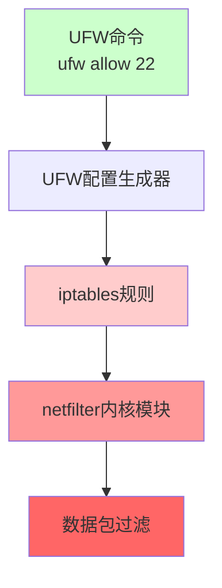

+++
title = "第35章：UFW 防火墙（Ubuntu）"
weight = 350
date = "2026-03-24T13:18:28+08:00"
type = "docs"
description = ""
isCJKLanguage = true
draft = false
+++


# 第三十五章：UFW 防火墙（Ubuntu）

UFW（Uncomplicated Firewall）是Ubuntu默认的防火墙管理工具。它的设计目标就是一个：**让复杂的iptables配置变得简单**。

用过iptables的人都知道，那语法简直是天书——`iptables -A INPUT -p tcp --dport 22 -j ACCEPT` 这种命令，谁记得住？UFW就是来解决这个痛点的，用`ufw allow 22`代替上面那一长串。

> 本章配套视频：UFW，让防火墙配置从"天书"变成"大白话"。

## 35.1 UFW 简介：Uncomplicated Firewall

UFW 由 Canonical 发起，专为 Ubuntu/Debian 设计，现在由社区维护。它的底层是 iptables/nftables 这一套内核框架，上面包了一层简洁的命令行界面。

### 35.1.1 基于 iptables

UFW并不是一个新的防火墙内核，它只是iptables的"翻译器"和"简化壳"。所有UFW的规则，最终都会被转换成iptables规则，由Linux内核的netfilter模块执行。


```mermaid
graph TB
    A["UFW命令<br/>ufw allow 22"]
    B["UFW配置生成器"]
    C["iptables规则"]
    D["netfilter内核模块"]
    E["数据包过滤"]
    A --> B --> C --> D --> E
    style A fill:#ccffcc
    style C fill:#ffcccc
    style D fill:#ff9999
    style E fill:#ff6666
```

简单理解：**UFW 是 iptables 的一个前端**（注意不是"图形界面"，它本身就是命令行工具）。你只需要说"放行 22 端口"，剩下的按顺序插入规则、处理 IPv6、维护规则文件，UFW 都替你做了。

### 35.1.2 命令简化

UFW把复杂的iptables命令简化成了几个简单的单词：

| UFW命令 | 等价的iptables命令 | 说明 |
|---------|-------------------|------|
| `ufw allow 22` | `iptables -A INPUT -p tcp --dport 22 -j ACCEPT` | 开放22端口 |
| `ufw deny 80` | `iptables -A INPUT -p tcp --dport 80 -j DROP` | 禁止80端口 |
| `ufw delete allow 22` | `iptables -D INPUT -p tcp --dport 22 -j ACCEPT` | 删除22端口规则 |
| `ufw status` | `iptables -L -n` | 查看规则 |

这就是UFW的设计哲学——简单，但不是简陋。

## 35.2 ufw status：查看状态

安装Ubuntu Server时，UFW默认是关闭的（inactive）。配置防火墙之前，先看看它的状态。

```bash
# 查看UFW状态（详细模式）
sudo ufw status verbose
```

```bash
Status: inactive
```

```bash
# 启用后查看状态
sudo ufw enable
sudo ufw status verbose
```

```bash
Status: active
Logging: on (low)
Default: deny (incoming), allow (outgoing), deny (routed)

To                         Action      From
--                         ------      ----
22/tcp                     ALLOW IN    Anywhere
80/tcp                     ALLOW IN    Anywhere
443/tcp                    ALLOW IN    Anywhere
```

输出解读：

- `Status: active`：防火墙已启用
- `Logging: on (low)`：日志记录开启，级别为low
- `Default: deny (incoming), allow (outgoing)`：默认策略是——入站拒绝、出站允许
- 下面的列表显示已添加的放行规则

```bash
# 查看规则（简洁模式，不显示注释）
sudo ufw status numbered
```

```bash
Status: active

[ 1] 22/tcp                     ALLOW IN                Anywhere
[ 2] 80/tcp                     ALLOW IN                Anywhere
[ 3] 443/tcp                    ALLOW IN                Anywhere
```

`numbered` 模式的输出**没有表头**，每行开头的 `[ 1]` 就是规则编号；编号是按当前顺序临时排的，删掉一条之后其余编号会跟着变。

## 35.3 ufw enable：启用防火墙

配置好规则后，用`ufw enable`启用防火墙。

```bash
# 启用UFW
sudo ufw enable
```

```bash
Command may disrupt existing ssh connections. Proceed with operation [y/n] y
Firewall is active and enabled on system startup
```

> **重要提醒**：启用防火墙之前，**务必先放行SSH端口（22）**，否则你会把自己锁在外面！如果SSH用的不是22端口，先用`ufw allow <你的SSH端口>`放行后再enable。

## 35.4 ufw disable：禁用防火墙

```bash
# 禁用UFW
sudo ufw disable
```

```bash
Firewall stopped and disabled on system startup
```

> **警告**：生产环境禁用防火墙要三思。没有防火墙，你的服务器就是裸奔。

## 35.5 ufw allow：开放端口

`ufw allow`是最常用的命令，用来放行端口（允许入站连接）。

### 35.5.1 ufw allow 80

开放80端口（HTTP）：

```bash
# 开放80端口（TCP+UDP都开放）
sudo ufw allow 80

# 查看结果
sudo ufw status
```

```bash
To                         Action      From
--                         ------      ----
80                         ALLOW IN    Anywhere
```

### 35.5.2 ufw allow 80/tcp

只开放TCP协议的80端口（通常这是你想要的）：

```bash
# 只开放TCP 80端口
sudo ufw allow 80/tcp

# 开放多个端口（用冒号分隔）
sudo ufw allow 8000:9000/tcp

# 开放UDP端口
sudo ufw allow 53/udp
```

```bash
# 常见Web服务端口
sudo ufw allow 80/tcp   # HTTP
sudo ufw allow 443/tcp  # HTTPS
sudo ufw allow 22/tcp   # SSH
```

> **放行之最**：对于只提供Web服务的服务器，开放80和443就够了。如果你的Web服务只跑HTTPS，至少也要放行443端口。

## 35.6 ufw deny：禁止端口

`ufw deny`用于拒绝入站连接。如果默认策略是allow，可以用deny显式禁止特定端口。

```bash
# 禁止80端口入站（通常配合默认allow策略使用）
sudo ufw deny 80/tcp

# 查看结果
sudo ufw status numbered
```

```bash
     Status                         Action                   From
     --                         ------                   ----
[ 1] 22/tcp                     ALLOW IN                Anywhere
[ 2] 80/tcp                     DENY IN                 Anywhere
```

## 35.7 ufw delete：删除规则

删除已添加的防火墙规则。

### 35.7.1 ufw delete allow 80

```bash
# 删除允许80端口的规则
sudo ufw delete allow 80

# 或者用编号删除（更精确）
sudo ufw status numbered
```

```bash
     Status                         Action                   From
     --                         ------                   ----
[ 1] 22/tcp                     ALLOW IN                Anywhere
[ 2] 80/tcp                     ALLOW IN                Anywhere
```

```bash
# 删除编号为2的规则
sudo ufw delete 2

# 确认删除
Proceed with operation [y/n] y
Rule deleted.
```

> ⚠️ **按编号删除后，一定要重新 `ufw status numbered` 再删下一条**：删掉 `[2]` 之后，原来的 `[3]` 就变成了 `[2]`，凭记忆连着删很容易删错。更稳妥的写法是按内容删（`sudo ufw delete allow 80/tcp`），内容只影响那一条规则。

## 35.8 ufw allow 'OpenSSH'：按服务名开放

UFW支持直接用服务名代替端口号，`OpenSSH`对应22端口，`Nginx Full`会开放80和443。

```bash
# 放行SSH（按服务名）
sudo ufw allow 'OpenSSH'

# 放行Nginx Full（HTTP + HTTPS）
sudo ufw allow 'Nginx Full'

# 放行Apache Full
sudo ufw allow 'Apache Full'

# 放行CUPS（打印机服务）
sudo ufw allow 'CUPS'
```

> **技巧**：服务名在`/etc/services`文件中定义。可以用`grep -E "ssh|http" /etc/services`查看已知服务。

## 35.9 ufw allow from：按 IP 开放

除了按端口，还可以按来源IP进行过滤。

```bash
# 只允许192.168.1.100这个IP访问22端口
sudo ufw allow from 192.168.1.100 to any port 22

# 只允许192.168.1.0/24整个网段访问80端口
sudo ufw allow from 192.168.1.0/24 to any port 80

# 允许特定IP访问所有端口（IP白名单）
sudo ufw allow from 192.168.1.100
```

```bash
# 查看结果
sudo ufw status
```

```bash
To                         Action      From
--                         ------      ----
22                         ALLOW IN    192.168.1.100
80                         ALLOW IN    192.168.1.0/24
```

## 35.10 ufw limit：速率限制防暴力破解

`ufw limit`是专门用来防暴力破解的命令。它的工作原理：同一个IP在60秒内最多尝试连接6次，超过就封禁。

```bash
# 对SSH端口启用速率限制
sudo ufw limit 22/tcp

# 如果SSH端口不是22
sudo ufw limit 2222/tcp
```

准确的规则是：**同一个来源 IP，在 30 秒内新建连接超过 6 次，就拒绝（丢弃）后续的连接请求**，而不是"60 秒封 6 次"。UFW 底层用的是 iptables 的 `recent` 模块（`--seconds 30 --hitcount 6`），看源码或 `iptables -L -n` 都能对出来。

使用前要注意两点：

```bash
# 1. 如果原来已经有普通的 allow 规则，先删掉再换成 limit，否则两条并存
sudo ufw delete allow 22/tcp
sudo ufw limit 22/tcp

# 2. limit 只针对"新建连接"，已经建立的 SSH 会话不受影响
sudo ufw status numbered
```

```bash
# 查看结果
sudo ufw status numbered
```

```bash
     Status                         Action                   From
     --                         ------                   ----
[ 1] 22/tcp                     LIMIT IN                Anywhere
```

> **适用场景**：`ufw limit` 适合 SSH 这种"必须开放、又容易被反复尝试密码"的服务。它能在不改端口的情况下抬高暴力破解的成本。
>
> ⚠️ 但它**不能替代 fail2ban**：`limit` 只在 30 秒的窗口里计数，攻击者放慢速度（比如每 10 秒试一次）就能绕开；而且它不会通知你、也不会把 IP 拉黑。真正要挡暴力破解，请把 `ufw limit` 当作第一层，再配合 `fail2ban` 或"仅允许密钥登录 + 禁用密码登录"。

## 35.11 ufw default：默认策略

UFW的默认策略决定"没有明确规则匹配的流量"该怎么处理。

```bash
# 查看当前默认策略
sudo ufw status verbose
```

```bash
Default: deny (incoming), allow (outgoing), deny (routed)
```

- `deny (incoming)`：入站默认拒绝（白名单，推荐）
- `allow (outgoing)`：出站默认允许
- `deny (routed)`：路由转发默认拒绝

```bash
# 修改默认入站策略为允许（不推荐）
sudo ufw default allow incoming

# 修改默认入站策略为拒绝（推荐）
sudo ufw default deny incoming

# 修改默认出站策略为拒绝（最安全，但可能影响正常业务）
sudo ufw default deny outgoing
```

> **生产环境推荐**：`ufw default deny incoming`。只放行你明确需要的服务，其他一律拒绝。

## 35.12 ufw 日志：/var/log/ufw.log

UFW的日志记录了所有被允许和被拒绝的连接尝试，是排查问题和安全审计的重要依据。

```bash
# 查看UFW日志（实时跟踪）
sudo tail -f /var/log/ufw.log

# 查看最近的UFW日志（最后 50 行）
sudo tail -n 50 /var/log/ufw.log
```

> ⚠️ `/var/log/ufw.log` 是 rsyslog 按 `/etc/rsyslog.d/20-ufw.conf` 里的规则写出来的。**如果系统没装 rsyslog、或者日志只进 journald，这个文件就不存在**。这种情况改用下面这条命令看（UFW 的日志来自内核）：
>
> ```bash
> sudo journalctl -k | grep UFW
> sudo dmesg | grep UFW
> ```

```bash
# 日志示例
Mar 23 22:10:01 my-server kernel: [UFW BLOCK] IN=eth0 OUT= MAC=00:0c:29:5a:6b:7c:00:1a:2b:3c:4d:5e:08:00 SRC=192.168.1.100 DST=192.168.1.10 LEN=60 TOS=0x00 PREC=0x00 TTL=64 ID=54321 DF PROTO=TCP SPT=54321 DPT=22 WINDOW=65535 RES=0x00 SYN URGP=0

Mar 23 22:10:02 my-server kernel: [UFW BLOCK] IN=eth0 OUT= MAC=00:0c:29:5a:6b:7c:00:1a:2b:3c:4d:5e:08:00 SRC=192.168.1.100 DST=192.168.1.10 LEN=60 TOS=0x00 PREC=0x00 TTL=64 ID=54322 DF PROTO=TCP SPT=54322 DPT=22 WINDOW=65535 RES=0x00 SYN URGP=0
```

日志字段说明：

- `[UFW BLOCK]`：被UFW阻止（ALLOW则是被允许）
- `IN=eth0`：入站网卡
- `SRC=192.168.1.100`：源IP
- `DST=192.168.1.10`：目标IP
- `PROTO=TCP`：协议类型
- `SPT=54321`：源端口
- `DPT=22`：目标端口

**设置日志级别**：

```bash
# 查看当前日志级别
sudo ufw status verbose

# 设置日志为low（只记录被阻止的）
sudo ufw logging low

# 设置日志为medium（记录被阻止和部分允许的）
sudo ufw logging medium

# 设置日志为high（记录所有，包括正常通过的）
sudo ufw logging high

# 关闭日志
sudo ufw logging off
```

```bash
# 用 grep 过滤特定端口（注意 [UFW BLOCK] 出现在行首附近，别把匹配顺序写反）
sudo grep "DPT=22" /var/log/ufw.log | tail -n 20

# 统计"被阻止的 SSH 连接"都来自哪些 IP：
# 用 grep -o 精确抠出 SRC= 字段，比按"第几列"去数更稳（列数会随 OUT=、MAC= 等字段变化）
sudo grep 'UFW BLOCK' /var/log/ufw.log | grep 'DPT=22' | grep -o 'SRC=[0-9.]*' | sort | uniq -c | sort -rn | head -20
```

如果同一个 IP 频繁出现在统计结果的前几名，说明它正在扫描或爆破你的 22 端口。可选的处置：改掉 SSH 端口、只允许密钥登录、用 `ufw allow from <可信网段> to any port 22` 做白名单，或者上 fail2ban 自动拉黑。

> **安全运维建议**：定期查看UFW日志，你会惊讶地发现，全世界有多少"好奇"的IP在扫描你的服务器端口。

---

## 35.13 其他常用操作与避坑

### 35.13.1 看有哪些现成的服务配置

```bash
# 列出 UFW 自带的"应用配置"（来自 /etc/ufw/applications.d/ 和已安装服务）
sudo ufw app list

# 看某个配置到底开了哪些端口
sudo ufw app info 'Nginx Full'
# Port: 80,443/tcp
```

用 `ufw app info` 确认端口再放行，比凭记忆敲 `ufw allow 80` 靠谱。

### 35.13.2 改配置前先"演习"

```bash
sudo ufw --dry-run enable          # 只看会生成哪些规则，不真正启用
sudo ufw --dry-run allow 8080/tcp  # 任何命令都能加 --dry-run

sudo ufw reload                    # 重新加载规则（改完配置文件后）
sudo ufw reset                     # 清空所有规则并回到默认状态（会问你确认）
```

### 35.13.3 一条"改 SSH 端口也不掉线"的操作顺序

这是远程操作防火墙最容易出事故的场景，顺序必须是：**先放行新端口，再用新端口验证能连上，最后才删旧规则**。

```bash
# 假设把 SSH 从 22 改到 2222
sudo sed -i 's/^#\?Port .*/Port 2222/' /etc/ssh/sshd_config
sudo sshd -t                       # 先检查配置语法
sudo systemctl restart ssh         # Debian/Ubuntu 服务名是 ssh；RHEL 是 sshd

# 1. 先放行新端口（此时 22 仍然开着，安全网还在）
sudo ufw allow 2222/tcp

# 2. 另开一个终端，用新端口登录验证
#    ssh -p 2222 user@服务器

# 3. 确认新端口可用、没有其他问题后，再删掉 22
sudo ufw delete allow 22/tcp
```

> ⚠️ 别一次性 `ufw reset` 再重建规则，也别在只有一条 SSH 连接的情况下直接 `ufw default deny incoming`——万一规则写错，你就只能去机房或控制台了。云服务器记得先确认"救援控制台"可用。

### 35.13.4 UFW 与 Docker 的"著名冲突"

装过 Docker 的机器上，`ufw deny 8080` 常常**不起作用**：Docker 会自己往 `DOCKER` 链里插规则，而它的链在 UFW 的规则之前被调用，端口照样对公网开放。

```bash
sudo iptables -L DOCKER -n --line-numbers   # 能看到 Docker 自己加的规则
```

常见解法（按推荐程度）：

1. 让容器只监听本机：`-p 127.0.0.1:8080:80`，对外统一走反向代理；
2. 在 `ufw` 之前禁用 Docker 的 iptables 管理（`/etc/docker/daemon.json` 里 `"iptables": false`），然后自己写转发规则；
3. 用 `ufw-docker` 这类小工具把 Docker 规则接到 UFW 的框架里。

关键点是：**装了 Docker 之后，不能只靠 UFW 判断端口是否对公网开放**，一定要在另一台机器上用 `nc -vz 服务器IP 端口` 实测一下。

---

## 本章小结

本章我们掌握了Ubuntu下UFW防火墙的配置：

- **UFW简介**：Uncomplicated Firewall，iptables 的前端（不是图形界面）
- **ufw status**：查看防火墙状态，`verbose`显示详情，`numbered`显示编号
- **ufw enable/disable**：启用/禁用防火墙，启用前先放行SSH！
- **ufw allow**：开放端口，`allow 80/tcp`指定协议，`allow 'OpenSSH'`按服务名
- **ufw deny**：禁止端口
- **ufw delete**：删除规则，推荐按内容删；按编号删时每次都要重新 `status numbered`
- **ufw allow from**：按来源IP放行，支持网段`192.168.1.0/24`
- **ufw limit**：同一 IP 30 秒内新建连接超过 6 次即拒绝；是"减速带"，不是 fail2ban 的替代品
- **ufw default**：设置默认策略，生产环境用`default deny incoming`
- **日志**：默认写到 `/var/log/ufw.log`；没有 rsyslog 时用 `journalctl -k | grep UFW`
- **避坑**：删规则先演习、改 SSH 顺序不能错、装了 Docker 要实测端口

UFW让Linux防火墙配置从"天书"变成"人话"。
