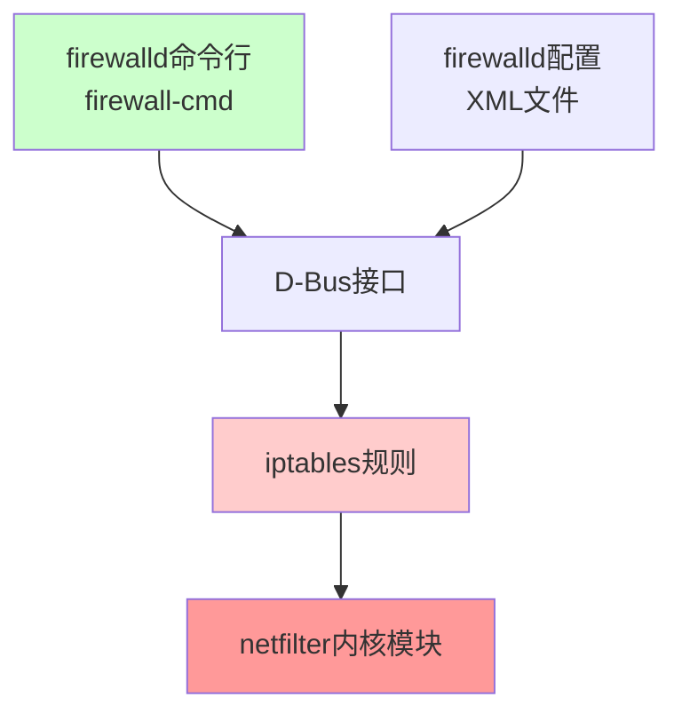
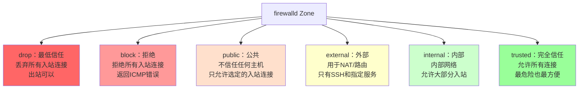

+++
title = "第36章：firewalld 防火墙（CentOS/RHEL）"
weight = 360
date = "2026-03-24T13:18:28+08:00"
type = "docs"
description = ""
isCJKLanguage = true
draft = false
+++


# 第三十六章：firewalld 防火墙（CentOS/RHEL）

CentOS/RHEL（以及 Fedora、OpenSUSE 等）默认使用 `firewalld` 作为防火墙管理工具。和Ubuntu的UFW不同，firewalld是红帽系Linux的标配。

firewalld的核心概念是"区域"（Zone）——每个网络接口可以属于一个区域，每个区域有不同的信任级别和规则。firewalld还支持"服务"（Service）和"端口"（Port）的灵活配置，比直接写iptables规则要友好得多。

> 本章配套视频：CentOS服务器到手，先把firewalld配置好，别等被黑了才想起来。

## 36.1 firewalld 简介：动态防火墙

firewalld（Dynamic Firewall Manager）是红帽Linux的默认防火墙管理系统，从RHEL 7开始取代了iptables的静态配置方式。

### 36.1.1 基于 iptables

和UFW一样，firewalld底层也是iptables/netfilter。它通过D-Bus接口与iptables交互，提供了更灵活的配置方式。



### 36.1.2 zone 概念

firewalld引入了"区域"（Zone）的概念。Zone是一组预定义的规则集，代表不同的信任级别。

每个网卡可以分配到一个Zone，firewalld根据网卡所属Zone来决定应用哪些规则。Zone是firewalld的核心，几乎所有的配置都围绕着Zone展开。



## 36.2 firewall-cmd 命令

firewalld的管理命令是`firewall-cmd`。和UFW类似，它也提供了运行时配置和永久配置两种模式。

```bash
# 查看firewalld版本
firewall-cmd --version

# 查看当前状态
firewall-cmd --state
```

```bash
running
```

> **重要区别**：firewalld区分"运行时配置"（Runtime）和"永久配置"（Permanent）。运行时配置立即生效但重启后丢失，永久配置需要reload才生效。**生产环境务必使用`--permanent`参数**。
> 
> ⚠️ **血泪教训**：很多新手配置完防火墙，重启服务器后发现规则没了，SSH连不上——就是因为没加`--permanent`！配置完记得测试：`sudo firewall-cmd --reload`。

## 36.3 zone 概念

firewalld内置了多个预设Zone，每个Zone有不同的默认规则。

### 36.3.1 drop：最低信任

drop区域是"最不信任"的区域，丢弃所有入站数据包，不回复任何响应。

```bash
# 查看drop区域的规则
firewall-cmd --zone=drop --list-all
```

```bash
drop (active)
  target: DROP
  icmp-block-inversion: no
  interfaces: eth0
  sources:
  services:
  ports:
  protocols:
  masquerade: no
  forward-ports:
  source-ports:
  icmp-blocks:
  rich rules:
```

- `target: DROP`：默认动作是丢弃所有入站
- `interfaces: eth0`：eth0网卡属于这个zone
- `services:`：没有放行任何服务

### 36.3.2 block：拒绝

block区域和drop类似，但会返回ICMP错误（如`icmp-host-prohibited`）。

```bash
firewall-cmd --zone=block --list-all
```

```bash
block (active)
  target: %%REJECT%%
  icmp-block-inversion: no
  interfaces:
  sources:
  services:
  ports:
  protocols:
  masquerade: no
  forward-ports:
  source-ports:
  icmp-blocks:
  rich rules:
```

`%%REJECT%%` vs `DROP`：REJECT会返回ICMP拒绝消息，告诉对方"你被拒绝了"；DROP则完全无视，就像石沉大海。

### 36.3.3 public：公共

public区域是firewalld的默认区域，适用于"公共场所"的网卡（如连接互联网的网卡）。

```bash
firewall-cmd --zone=public --list-all
```

```bash
public (active)
  target: default
  icmp-block-inversion: no
  interfaces: eth0
  sources:
  services: ssh dhcpv6-client
  ports:
  protocols:
  masquerade: no
  forward-ports:
  source-ports:
  icmp-blocks:
  rich rules:
```

默认只放行了`ssh`和`dhcpv6-client`，其他入站连接一律默认拒绝。

### 36.3.4 external：外部

external区域用于需要NAT/路由功能的场景，比如把服务器当路由器用。

```bash
firewall-cmd --zone=external --list-all
```

```bash
external (active)
  target: default
  icmp-block-inversion: no
  interfaces:
  sources:
  services: ssh
  ports:
  protocols:
  masquerade: yes      # 开启NAT伪装！
  forward-ports:
  source-ports:
  icmp-blocks:
  rich rules:
```

注意`masquerade: yes`——这是external区域的特殊之处，它会自动开启IP地址伪装（类似家用路由器的NAT功能）。

### 36.3.5 internal：内部

internal区域适用于内部网络，信任度较高，默认允许大部分入站服务。

```bash
firewall-cmd --zone=internal --list-all
```

```bash
internal (active)
  target: default
  icmp-block-inversion: no
  interfaces:
  sources:
  services: ssh mdns samba-client dhcpv6-client
  ports:
  protocols:
  masquerade: no
  forward-ports:
  source-ports:
  icmp-blocks:
  rich rules:
```

默认允许`ssh`、`mdns`（局域网设备发现）、`samba-client`（Windows文件共享客户端）、`dhcpv6-client`。

### 36.3.6 trusted：完全信任

trusted区域是最危险的区域——允许所有入站连接。等同于"关掉防火墙"。

```bash
firewall-cmd --zone=trusted --list-all
```

```bash
trusted (active)
  target: ACCEPT
  icmp-block-inversion: no
  interfaces:
  sources:
  services:
  ports:
  protocols:
  masquerade: no
  forward-ports:
  source-ports:
  icmp-blocks:
  rich rules:
```

`target: ACCEPT`意味着所有入站连接都被接受。

> **使用场景**：trusted区域适合用于管理网卡（如VPN网卡），只允许管理员从特定网卡访问。

## 36.4 firewall-cmd --list-all：查看所有规则

查看当前zone的所有规则：

```bash
# 查看默认zone的所有规则
firewall-cmd --list-all

# 查看指定zone的规则
firewall-cmd --zone=public --list-all
```

```bash
# 查看所有zone
firewall-cmd --list-all-zones
```

```bash
# 查看已放行的服务
firewall-cmd --list-services

# 查看已放行的端口
firewall-cmd --list-ports

# 查看已放行的协议
firewall-cmd --list-protocols
```

## 36.5 firewall-cmd --add-port：开放端口

用`--add-port`开放端口：

```bash
# 临时开放80端口（运行时配置，重启失效）
sudo firewall-cmd --add-port=80/tcp

# 永久开放80端口
sudo firewall-cmd --permanent --add-port=80/tcp

# 开放端口范围
sudo firewall-cmd --permanent --add-port=8000-9000/tcp

# 开放UDP端口
sudo firewall-cmd --permanent --add-port=53/udp

# 查看结果
sudo firewall-cmd --list-ports
```

```bash
80/tcp
```

> **生产环境必用`--permanent`**：临时配置重启就丢，永久配置才靠谱。

## 36.6 firewall-cmd --remove-port：关闭端口

```bash
# 永久关闭80端口
sudo firewall-cmd --permanent --remove-port=80/tcp

# 重新加载使配置生效
sudo firewall-cmd --reload

# 验证
sudo firewall-cmd --list-ports
```

## 36.7 firewall-cmd --add-service：按服务开放

firewalld内置了很多预定义服务，比直接指定端口更方便：

```bash
# 查看所有可用服务
firewall-cmd --get-services
```

```bash
RH-Satellite-6 amanda-client amanda-k5-client bacula bacula-client bitcoin bitcoin-rpc bitcoin-testnet bitcoin-testnet-rpc ceph ceph-mon cfengine condor-contact condor-creator dhcp dhcpv6 dhcpv6-client dns docker-registry dropbox-lansync elasticsearch freeswitch git gre gopher high-availability http https imap imaps ipp ipp-client ipsec iscsi-target jenkins kadmin kerberos kibana klogin kpasswd kshell ldap ldaps libvirt libvirt-clients lightning-network llmnr managesieve matrix mdns minidlna mongodb mosh mountd mqtt mqtt-tls ms-wbt mssql mysql nfs nfs3 nmea-2000 portmap postgresql privoxy prometheus proxy-dhcp ptp pulseaudio puppetmaster quassel radius redis redis-sentinel rpc-bind rsh rsyncd rtsp salt-master samba samba-client samba-dc sane sip sips smtp smtp-submission smtps snmp snmptrap spideroak-lansync squid ssh steam-streaming svdrp svn syslog syslog-tls telnet tentp tftp tftp-client tinc tor-socks transmission-daemon-gtk udp-broadcast vdsm vnc-server wbem-http wbem-https wsman wsmans xdmcp xmpp-bosh xmpp-client xmpp-local xmpp-server zabbix-agent zabbix-server
```

```bash
# 永久放行HTTP服务
sudo firewall-cmd --permanent --add-service=http

# 永久放行HTTPS服务
sudo firewall-cmd --permanent --add-service=https

# 同时放行多个服务
sudo firewall-cmd --permanent --add-service={http,https}

# 放行Nginx Full（包含http和https）
sudo firewall-cmd --permanent --add-service=nginx-full

# 关闭服务
sudo firewall-cmd --permanent --remove-service=http
```

```bash
# 查看已放行的服务
sudo firewall-cmd --list-services
```

```bash
ssh dhcpv6-client http https
```

## 36.8 firewall-cmd --permanent：永久生效

`--permanent`参数是firewalld的"持久化开关"。不加这个参数，配置只对当前会话生效，重启后丢失。

```bash
# 错误做法：临时生效，重启后没了
sudo firewall-cmd --add-port=80/tcp

# 正确做法：永久生效
sudo firewall-cmd --permanent --add-port=80/tcp

# reload使永久配置生效
sudo firewall-cmd --reload
```

> **实战顺序**：先`--permanent`添加规则，最后`--reload`一次性使所有永久配置生效。不要每改一条就reload一次，效率太低。

## 36.9 firewall-cmd --reload：重新加载

`--reload`重新读取配置文件，使所有`--permanent`添加的规则生效。

```bash
# 重新加载配置
sudo firewall-cmd --reload

# 查看当前运行时配置（不是永久配置）
sudo firewall-cmd --list-all

# 查看运行时配置的完整信息
sudo firewall-cmd --runtime-to-permanent
```

```bash
# 典型配置流程
sudo firewall-cmd --permanent --add-service=http
sudo firewall-cmd --permanent --add-service=https
sudo firewall-cmd --permanent --add-port=3306/tcp
sudo firewall-cmd --permanent --remove-service=cockpit
sudo firewall-cmd --reload
```

## 36.10 rich-rule 高级规则

rich-rule（富规则）是firewalld的高级规则语法，支持复杂的条件判断和动作。

### 36.10.1 基于 IP 的规则

按来源IP放行或拒绝：

```bash
# 只允许特定IP访问SSH
sudo firewall-cmd --permanent --add-rich-rule='rule family="ipv4" source address="192.168.1.100" service name="ssh" accept'

# 禁止特定IP访问所有端口
sudo firewall-cmd --permanent --add-rich-rule='rule family="ipv4" source address="10.0.0.50" drop'

# 允许特定IP段访问80端口
sudo firewall-cmd --permanent --add-rich-rule='rule family="ipv4" source address="192.168.1.0/24" port port="80" protocol="tcp" accept'
```

```bash
# 查看所有富规则
sudo firewall-cmd --list-rich-rules
```

```bash
rule family="ipv4" source address="192.168.1.100" service name="ssh" accept
```

### 36.10.2 端口转发

firewalld支持端口转发（Port Forwarding），将一个端口的流量转发到另一台机器：

```bash
# 将本机的2222端口转发到另一台机器的22端口
sudo firewall-cmd --permanent --add-rich-rule='rule family="ipv4" forward-port port="2222" protocol="tcp" to-port="22" to-addr="192.168.1.200"'

# reload使配置生效
sudo firewall-cmd --reload

# 查看端口转发规则
sudo firewall-cmd --list-forward-ports
```

```bash
port=2222:proto=tcp:toport=22:toaddr=192.168.1.200
```

> **应用场景**：内网服务器没有公网IP，通过有公网IP的跳板机做端口转发访问内网服务。

---

## 本章小结

本章我们掌握了CentOS/RHEL下firewalld防火墙的配置：

- **firewalld简介**：红帽系Linux的动态防火墙，核心概念是Zone（区域）
- **Zone类型**：drop（丢弃）、block（拒绝）、public（公共）、external（外部/NAT）、internal（内部）、trusted（信任）
- **firewall-cmd**：firewalld的命令行管理工具
- **--list-all**：查看所有规则
- **--add-port / --remove-port**：开放/关闭端口
- **--add-service / --remove-service**：按服务名放行/关闭
- **--permanent**：使配置永久生效（生产环境必备）
- **--reload**：重新加载配置使永久规则生效
- **rich-rule**：高级规则，支持按IP放行、端口转发等复杂场景

firewalld的Zone+Service+Rich Rule三层配置，足够应付绝大多数生产环境需求。
