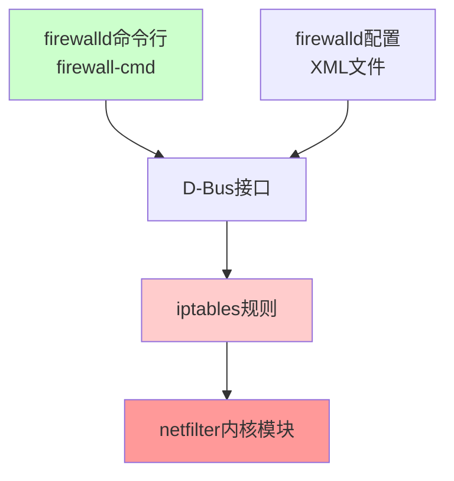
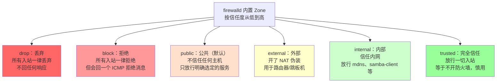

+++
title = "第36章：firewalld 防火墙（CentOS/RHEL）"
weight = 360
date = "2026-03-24T13:18:28+08:00"
type = "docs"
description = ""
isCJKLanguage = true
draft = false
+++


# 第三十六章：firewalld 防火墙（CentOS/RHEL）

CentOS/RHEL（以及 Fedora、OpenSUSE 等）默认使用 `firewalld` 作为防火墙管理工具。和Ubuntu的UFW不同，firewalld是红帽系Linux的标配。

firewalld的核心概念是"区域"（Zone）——每个网络接口可以属于一个区域，每个区域有不同的信任级别和规则。firewalld还支持"服务"（Service）和"端口"（Port）的灵活配置，比直接写iptables规则要友好得多。

> 本章配套视频：CentOS服务器到手，先把firewalld配置好，别等被黑了才想起来。

## 36.1 firewalld 简介：动态防火墙

firewalld（Dynamic Firewall Manager）是红帽Linux的默认防火墙管理系统，从RHEL 7开始取代了iptables的静态配置方式。

### 36.1.1 底层是什么

这里必须先纠正一个流传很广的说法：**firewalld 的底层不一定是 iptables**。

| 系统 / firewalld 版本 | 默认后端 |
|----------------------|---------|
| RHEL 7、CentOS 7（firewalld 0.4 前后） | iptables |
| RHEL 8+、RHEL 9、CentOS Stream、Fedora（firewalld 0.6 以后） | **nftables** |

无论用哪个后端，都是同一套 Linux 内核的包过滤框架，规则最终下发给内核执行。想确认当前用的是哪个：

```bash
firewall-cmd --version
sudo nft list ruleset | head -30      # 有输出说明就是 nftables 后端
sudo iptables -L -n | head            # 老系统看这个
```

`firewall-cmd` 与 `firewalld` 守护进程之间通过 **D-Bus** 通信，所以普通用户不能直接改防火墙——必须通过 `sudo` 调 `firewall-cmd`，由守护进程去写后端规则。


```mermaid
graph TB
    A["firewalld命令行<br/>firewall-cmd"]
    B["firewalld配置<br/>XML文件"]
    C["D-Bus接口"]
    D["iptables规则"]
    E["netfilter内核模块"]
    A --> C --> D --> E
    B --> C
    style A fill:#ccffcc
    style D fill:#ffcccc
    style E fill:#ff9999
```

### 36.1.2 zone 概念

firewalld引入了"区域"（Zone）的概念。Zone是一组预定义的规则集，代表不同的信任级别。

每个网卡可以分配到一个Zone，firewalld根据网卡所属Zone来决定应用哪些规则。Zone是firewalld的核心，几乎所有的配置都围绕着Zone展开。


```mermaid
graph TB
    A["firewalld 内置 Zone<br>按信任度从低到高"] --> B["drop：丢弃<br>所有入站一律丢弃<br>不回任何响应"]
    A --> C["block"]
    A --> D["public"]
    A --> E["external"]
    A --> F["internal"]
    A --> G["trusted"]

    C["block：拒绝<br>所有入站一律拒绝<br>但会回一个 ICMP 拒绝消息"]
    D["public：公共（默认）<br>不信任任何主机<br>只放行明确选定的服务"]
    E["external：外部<br>开了 NAT 伪装<br>用于路由器/跳板机"]
    F["internal：内部<br>信任内网<br>放行 mdns、samba-client 等"]
    G["trusted：完全信任<br>放行一切入站<br>等于不开防火墙，慎用"]

    style B fill:#ff6666
    style C fill:#ff9999
    style D fill:#ffe0cc
    style E fill:#ffffcc
    style F fill:#ccffcc
    style G fill:#99ff99
```

完整的 9 个内置 Zone（还有 `dmz`、`work`、`home`）和它们的详细说明，可以直接问 firewalld：

```bash
firewall-cmd --get-zones                      # 列出所有 zone 名
firewall-cmd --get-default-zone               # 当前默认 zone
firewall-cmd --zone=dmz --list-all            # 看某个 zone 的详细配置
firewall-cmd --get-active-zones               # 看哪些 zone 正挂在网卡上
```

除了教程里详细展开的 drop、block、public、external、internal、trusted，另外三个：

| Zone | 定位 |
|------|------|
| `dmz` | 隔离区：对外提供服务但严格受限，只放行必要端口 |
| `work` | 办公网络：信任同事的机器，放行 ssh、mdns、dhcpv6-client 等 |
| `home` | 家庭网络：比 work 更宽松一点，额外放行 samba-client |

> 实际运维里，**90% 的情况只要一个 `public`** 就够了：默认拒绝，然后按需 `--add-service` / `--add-port`。Zone 的价值在于"同一台机器有多块网卡、连接不同网络"时能套用不同规则。

## 36.2 firewall-cmd 命令

firewalld的管理命令是`firewall-cmd`。和UFW类似，它也提供了运行时配置和永久配置两种模式。

```bash
# 查看firewalld版本
firewall-cmd --version

# 查看当前状态
firewall-cmd --state
```

```bash
running
```

> **重要区别**：firewalld 有两套并行的配置，这是它和 UFW 最大的不同：
>
> | | 运行时配置（Runtime） | 永久配置（Permanent） |
> |---|---|---|
> | 存哪里 | 内存 | `/etc/firewalld/zones/*.xml` |
> | 立即生效 | 是 | **否，要 `--reload`（或重启 firewalld）才生效** |
> | 重启后 | 丢失 | 保留 |
> | 怎么改 | `firewall-cmd --add-port=...` | `firewall-cmd --permanent --add-port=...` |
>
> ⚠️ **血泪教训**：只写了 `--permanent` 而忘了 `--reload`，规则不会立刻生效，你以为没加上；反过来，只写了运行时规则没加 `--permanent`，重启后规则就没了。**"改完永久配置必须 reload"是本章最该记住的一句话。**
>
> 如果已经在运行时调试好了，也可以"就地转正"，不用把命令再敲一遍：
>
> ```bash
> sudo firewall-cmd --runtime-to-permanent   # 把当前运行时配置整体写入永久配置
> ```

## 36.3 zone 概念

firewalld内置了多个预设Zone，每个Zone有不同的默认规则。

### 36.3.1 drop：最低信任

drop区域是"最不信任"的区域，丢弃所有入站数据包，不回复任何响应。

```bash
# 查看drop区域的规则
firewall-cmd --zone=drop --list-all
```

```bash
drop (active)
  target: DROP
  icmp-block-inversion: no
  interfaces: eth0
  sources:
  services:
  ports:
  protocols:
  masquerade: no
  forward-ports:
  source-ports:
  icmp-blocks:
  rich rules:
```

- `target: DROP`：默认动作是丢弃所有入站
- `interfaces: eth0`：eth0网卡属于这个zone
- `services:`：没有放行任何服务

### 36.3.2 block：拒绝

block区域和drop类似，但会返回ICMP错误（如`icmp-host-prohibited`）。

```bash
firewall-cmd --zone=block --list-all
```

```bash
block (active)
  target: %%REJECT%%
  icmp-block-inversion: no
  interfaces:
  sources:
  services:
  ports:
  protocols:
  masquerade: no
  forward-ports:
  source-ports:
  icmp-blocks:
  rich rules:
```

`%%REJECT%%` vs `DROP`：REJECT会返回ICMP拒绝消息，告诉对方"你被拒绝了"；DROP则完全无视，就像石沉大海。

### 36.3.3 public：公共

public区域是firewalld的默认区域，适用于"公共场所"的网卡（如连接互联网的网卡）。

```bash
firewall-cmd --zone=public --list-all
```

```bash
public (active)
  target: default
  icmp-block-inversion: no
  interfaces: eth0
  sources:
  services: ssh dhcpv6-client
  ports:
  protocols:
  masquerade: no
  forward-ports:
  source-ports:
  icmp-blocks:
  rich rules:
```

默认只放行了`ssh`和`dhcpv6-client`，其他入站连接一律默认拒绝。

### 36.3.4 external：外部

external区域用于需要NAT/路由功能的场景，比如把服务器当路由器用。

```bash
firewall-cmd --zone=external --list-all
```

```bash
external (active)
  target: default
  icmp-block-inversion: no
  interfaces:
  sources:
  services: ssh
  ports:
  protocols:
  masquerade: yes      # 开启NAT伪装！
  forward-ports:
  source-ports:
  icmp-blocks:
  rich rules:
```

注意`masquerade: yes`——这是external区域的特殊之处，它会自动开启IP地址伪装（类似家用路由器的NAT功能）。

### 36.3.5 internal：内部

internal区域适用于内部网络，信任度较高，默认允许大部分入站服务。

```bash
firewall-cmd --zone=internal --list-all
```

```bash
internal (active)
  target: default
  icmp-block-inversion: no
  interfaces:
  sources:
  services: ssh mdns samba-client dhcpv6-client
  ports:
  protocols:
  masquerade: no
  forward-ports:
  source-ports:
  icmp-blocks:
  rich rules:
```

默认允许`ssh`、`mdns`（局域网设备发现）、`samba-client`（Windows文件共享客户端）、`dhcpv6-client`。

### 36.3.6 trusted：完全信任

trusted区域是最危险的区域——允许所有入站连接。等同于"关掉防火墙"。

```bash
firewall-cmd --zone=trusted --list-all
```

```bash
trusted (active)
  target: ACCEPT
  icmp-block-inversion: no
  interfaces:
  sources:
  services:
  ports:
  protocols:
  masquerade: no
  forward-ports:
  source-ports:
  icmp-blocks:
  rich rules:
```

`target: ACCEPT`意味着所有入站连接都被接受。

> **使用场景**：trusted区域适合用于管理网卡（如VPN网卡），只允许管理员从特定网卡访问。

## 36.4 firewall-cmd --list-all：查看所有规则

查看当前zone的所有规则：

```bash
# 查看默认zone的所有规则
firewall-cmd --list-all

# 查看指定zone的规则
firewall-cmd --zone=public --list-all
```

```bash
# 查看所有zone
firewall-cmd --list-all-zones
```

```bash
# 查看已放行的服务
firewall-cmd --list-services

# 查看已放行的端口
firewall-cmd --list-ports

# 查看已放行的协议
firewall-cmd --list-protocols
```

## 36.5 firewall-cmd --add-port：开放端口

用`--add-port`开放端口：

```bash
# 临时开放80端口（运行时配置，重启失效）
sudo firewall-cmd --add-port=80/tcp

# 永久开放80端口
sudo firewall-cmd --permanent --add-port=80/tcp

# 开放端口范围
sudo firewall-cmd --permanent --add-port=8000-9000/tcp

# 开放UDP端口
sudo firewall-cmd --permanent --add-port=53/udp

# 查看结果
sudo firewall-cmd --list-ports
```

```bash
80/tcp
```

> ⚠️ 上面这些命令**没有写 `--zone`，默认操作的是"当前默认 zone"**（通常是 `public`）。如果机器改过默认 zone，或者有多个 zone 挂在不同网卡上，命令就会落到你不期望的地方。**养成显式写 zone 的习惯**：
>
> ```bash
> sudo firewall-cmd --zone=public --permanent --add-port=3306/tcp
> sudo firewall-cmd --reload
> sudo firewall-cmd --zone=public --list-ports     # 验证
> ```
>
> 另外注意：`--list-ports` 看的是**运行时**规则。只加了 `--permanent` 还没 reload 时，它显示不出你刚加的东西——别急着怀疑自己输错了。

## 36.6 firewall-cmd --remove-port：关闭端口

```bash
# 永久关闭80端口
sudo firewall-cmd --permanent --remove-port=80/tcp

# 重新加载使配置生效
sudo firewall-cmd --reload

# 验证
sudo firewall-cmd --list-ports
```

## 36.7 firewall-cmd --add-service：按服务开放

firewalld内置了很多预定义服务，比直接指定端口更方便：

```bash
# 查看所有可用服务
firewall-cmd --get-services
```

```bash
RH-Satellite-6 amanda-client amanda-k5-client bacula bacula-client bitcoin bitcoin-rpc bitcoin-testnet bitcoin-testnet-rpc ceph ceph-mon cfengine condor-contact condor-creator dhcp dhcpv6 dhcpv6-client dns docker-registry dropbox-lansync elasticsearch freeswitch git gre gopher high-availability http https imap imaps ipp ipp-client ipsec iscsi-target jenkins kadmin kerberos kibana klogin kpasswd kshell ldap ldaps libvirt libvirt-clients lightning-network llmnr managesieve matrix mdns minidlna mongodb mosh mountd mqtt mqtt-tls ms-wbt mssql mysql nfs nfs3 nmea-2000 portmap postgresql privoxy prometheus proxy-dhcp ptp pulseaudio puppetmaster quassel radius redis redis-sentinel rpc-bind rsh rsyncd rtsp salt-master samba samba-client samba-dc sane sip sips smtp smtp-submission smtps snmp snmptrap spideroak-lansync squid ssh steam-streaming svdrp svn syslog syslog-tls telnet tentp tftp tftp-client tinc tor-socks transmission-daemon-gtk udp-broadcast vdsm vnc-server wbem-http wbem-https wsman wsmans xdmcp xmpp-bosh xmpp-client xmpp-local xmpp-server zabbix-agent zabbix-server
```

```bash
# 永久放行HTTP服务
sudo firewall-cmd --permanent --add-service=http

# 永久放行HTTPS服务
sudo firewall-cmd --permanent --add-service=https

# 一次放行多个服务（大括号由 Shell 展开成两条命令）
sudo firewall-cmd --permanent --add-service={http,https}

# 关闭服务
sudo firewall-cmd --permanent --remove-service=http
```

> ⚠️ firewalld 的"服务"清单和 UFW 的应用配置**不是一回事**。比如 UFW 里有 `Nginx Full`，但 firewalld 默认**没有 `nginx`、`nginx-full` 这样的服务**，`--add-service=nginx-full` 会直接报 `INVALID_SERVICE`。这种情况按端口放行即可：
>
> ```bash
> sudo firewall-cmd --permanent --add-port=80/tcp
> sudo firewall-cmd --permanent --add-port=443/tcp
> sudo firewall-cmd --reload
> ```
>
> 想自己定义一个名为 `nginx` 的服务？在 `/etc/firewalld/services/` 下写一个 XML 即可（把 `/usr/lib/firewalld/services/` 里的现成文件复制过来改端口最省事），然后 `firewall-cmd --reload`。

```bash
# 查看已放行的服务
sudo firewall-cmd --list-services
```

```bash
ssh dhcpv6-client http https
```

## 36.8 firewall-cmd --permanent：永久生效

`--permanent`参数是firewalld的"持久化开关"。不加这个参数，配置只对当前会话生效，重启后丢失。

```bash
# 错误做法：临时生效，重启后没了
sudo firewall-cmd --add-port=80/tcp

# 正确做法：永久生效
sudo firewall-cmd --permanent --add-port=80/tcp

# reload使永久配置生效
sudo firewall-cmd --reload
```

> **实战顺序**：先`--permanent`添加规则，最后`--reload`一次性使所有永久配置生效。不要每改一条就reload一次，效率太低。

## 36.9 firewall-cmd --reload：重新加载

`--reload`重新读取配置文件，使所有`--permanent`添加的规则生效。

```bash
# 重新加载配置
sudo firewall-cmd --reload

# 查看当前【运行时】生效的规则
sudo firewall-cmd --list-all

# 把当前的运行时配置整体写进永久配置（在运行时调试好后"就地转正"）
sudo firewall-cmd --runtime-to-permanent
```

注意 `--list-all` 和 `--permanent --list-all` 看的是两套数据，别混淆：

```bash
sudo firewall-cmd --list-all                      # 运行时
sudo firewall-cmd --permanent --list-all          # 永久（可能需要 reload 才会一致）
```

另外，`--reload` 会**丢弃所有只在运行时做的改动**。所以"运行时调试 → 满意后 --runtime-to-permanent → reload 验证"这条路径，比"边改边 reload"稳得多。

```bash
# 典型配置流程
sudo firewall-cmd --permanent --add-service=http
sudo firewall-cmd --permanent --add-service=https
sudo firewall-cmd --permanent --add-port=3306/tcp
sudo firewall-cmd --permanent --remove-service=cockpit
sudo firewall-cmd --reload
```

## 36.10 rich-rule 高级规则

rich-rule（富规则）是firewalld的高级规则语法，支持复杂的条件判断和动作。

### 36.10.1 基于 IP 的规则

按来源IP放行或拒绝：

```bash
# 只允许特定IP访问SSH
sudo firewall-cmd --permanent --add-rich-rule='rule family="ipv4" source address="192.168.1.100" service name="ssh" accept'

# 禁止特定IP访问所有端口
sudo firewall-cmd --permanent --add-rich-rule='rule family="ipv4" source address="10.0.0.50" drop'

# 允许特定IP段访问80端口
sudo firewall-cmd --permanent --add-rich-rule='rule family="ipv4" source address="192.168.1.0/24" port port="80" protocol="tcp" accept'
```

```bash
# 查看所有富规则
sudo firewall-cmd --list-rich-rules
```

```bash
rule family="ipv4" source address="192.168.1.100" service name="ssh" accept
```

### 36.10.2 端口转发

firewalld支持端口转发（Port Forwarding），将一个端口的流量转发到另一台机器：

```bash
# 将本机的2222端口转发到另一台机器的22端口
sudo firewall-cmd --permanent --add-rich-rule='rule family="ipv4" forward-port port="2222" protocol="tcp" to-port="22" to-addr="192.168.1.200"'

# reload使配置生效
sudo firewall-cmd --reload

# 查看端口转发规则
sudo firewall-cmd --list-forward-ports
```

```bash
port=2222:proto=tcp:toport=22:toaddr=192.168.1.200
```

> **应用场景**：内网服务器没有公网IP，通过有公网IP的跳板机做端口转发访问内网服务。

> ⚠️ **端口转发必须有 `masquerade`（NAT 伪装）配合**，否则转出去的包回不来。转发到另一台机器时，要在做转发的这台机器上开启：
>
> ```bash
> sudo firewall-cmd --permanent --add-masquerade
> sudo firewall-cmd --reload
> ```
>
> 同时内核转发也得打开：
>
> ```bash
> echo 'net.ipv4.ip_forward=1' | sudo tee /etc/sysctl.d/99-forward.conf
> sudo sysctl --system
> ```
>
> 还有一点容易漏：**请求得先能被"接收"才谈得上转发**。如果 `public` zone 的默认策略是拒绝，那么 2222 端口本身也要放行（`--add-port=2222/tcp`），否则包在进 zone 的那一步就被丢了。

---

## 36.11 常用运维操作与避坑

### 36.11.1 每台机器都该会的几条

```bash
# 看当前默认 zone，以及哪些 zone/网卡是活跃的
sudo firewall-cmd --get-default-zone
sudo firewall-cmd --get-active-zones

# 改默认 zone（比如把默认的 public 换成更严格的 drop）
sudo firewall-cmd --set-default-zone=public

# 把某块网卡挪到别的 zone（立即生效，但不改永久配置）
sudo firewall-cmd --zone=internal --change-interface=eth1
sudo firewall-cmd --permanent --zone=internal --change-interface=eth1

# 按来源网段匹配（不依赖网卡，适合"只允许内网访问"）
sudo firewall-cmd --permanent --zone=trusted --add-source=192.168.1.0/24

# 应急开关：所有流量一律拒绝（服务器被入侵时先拔网线用）
sudo firewall-cmd --panic-on
sudo firewall-cmd --panic-off

# 重启、停用服务
sudo systemctl restart firewalld
sudo systemctl status firewalld
```

### 36.11.2 规则存在哪

```bash
sudo ls /etc/firewalld/zones/        # 永久配置：每个 zone 一个 XML 文件
sudo cat /etc/firewalld/zones/public.xml

sudo cat /usr/lib/firewalld/services/http.xml   # 预定义服务的定义（端口在这里）
sudo ls /etc/firewalld/services/                # 你自己定义的服务放这里
```

临时想手工改 XML 也可以，但改完必须 `firewall-cmd --reload`，并且**文件格式写错会导致 firewalld 起不来**——不如老老实实用 `firewall-cmd` 生成。

### 36.11.3 避坑清单

1. **只写 `--permanent` 不写 `--reload`**：规则没生效，以为加错了。改永久配置后一律 `--reload`。
2. **不写 `--zone`**：落在默认 zone 上。多网卡、多 zone 的机器一定要显式指定。
3. **`--list-all` 和 `--permanent --list-all` 混着看**：前者是运行时，后者是文件里存的。两者不一致时，先想清楚要不要 `--runtime-to-permanent`。
4. **改 SSH 端口时先删旧规则**：正确顺序是"改 sshd 配置 → 放行新端口 → 另开会话验证 → 再删旧端口"，和 35.13.3 里的流程一样。
5. **`--direct` 直写规则**：这是老 API，容易被 firewalld 的 reload 冲掉。除非确定需要，否则一律用 rich-rule 或 zone 配置。
6. **和 Docker 混用**：Docker 会直接往 nftables/iptables 里插自己的链，绕过 firewalld。容器端口想只对本机开放就写成 `-p 127.0.0.1:8080:80`，再从外部用 `nc -vz` 验证。
7. **别把 `trusted` 当作"方便"**：给网卡加 `trusted` 等于那块网卡上的流量全部放行。

---

## 本章小结

本章我们掌握了CentOS/RHEL下firewalld防火墙的配置：

- **firewalld简介**：红帽系 Linux 的动态防火墙；RHEL 8/9 及以后的默认后端是 **nftables**，不是 iptables
- **Zone类型**：共 9 个内置 zone，常用的有 drop（丢弃）、block（拒绝）、public（公共，默认）、external（外部/NAT）、internal（内部）、trusted（信任）
- **运行时 vs 永久**：`--permanent` 改的是文件，必须 `firewall-cmd --reload` 才生效；`--runtime-to-permanent` 可以把调好的运行时配置转正
- **firewall-cmd**：firewalld的命令行管理工具
- **--list-all**：查看运行时规则；加 `--permanent` 才是看文件里的配置
- **--add-port / --remove-port**：开放/关闭端口
- **--add-service / --remove-service**：按服务名放行/关闭（firewalld 没有 `nginx-full` 这种服务，按端口放行）
- **rich-rule**：高级规则，支持按 IP 放行、端口转发等复杂场景
- **端口转发**：记得同时开 `masquerade` 和 `net.ipv4.ip_forward`
- **应急**：`--panic-on` 一键切断所有流量

firewalld的Zone+Service+Rich Rule三层配置，足够应付绝大多数生产环境需求。
