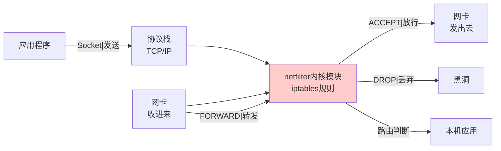
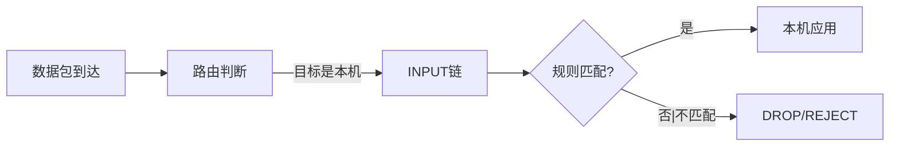
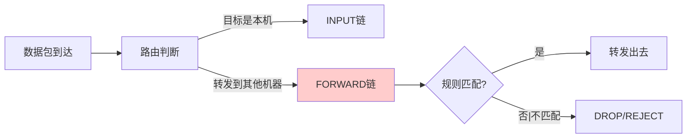
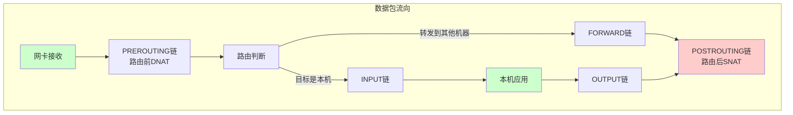

+++
title = "第37章：iptables 底层配置"
weight = 370
date = "2026-03-24T13:18:28+08:00"
type = "docs"
description = ""
isCJKLanguage = true
draft = false
+++


# 第三十七章：iptables 底层配置

iptables是Linux内核netfilter模块的用户态配置工具，也是UFW和firewalld的"底层老板"。虽然UFW和firewalld已经足够好用，但理解iptables能让你真正掌握Linux防火墙的原理。

iptables的语法看起来复杂，但只要理解"四表五链"的框架，就能把整个系统串联起来。

> 本章配套视频：UFW和firewalld是"自动挡"，iptables是"手动挡"。学会手动挡，才能真正成为老司机。

## 37.1 iptables 简介：Linux 防火墙核心

iptables是Linux 2.4内核引入的防火墙工具，至今仍是Linux网络安全的核心。虽然新的nftables正在逐步取代它，但iptables仍然是目前最广泛使用的Linux防火墙工具。

iptables的工作位置：



iptables并不是防火墙本身——真正的防火墙是Linux内核的netfilter模块。iptables只是一个"配置工具"，用来告诉netfilter该怎么过滤数据包。

## 37.2 四表

iptables把规则组织成"表"（Table）。不同的表负责不同的功能。

### 37.2.1 filter：过滤（默认表）

filter表是最常用的表，负责数据包的过滤（放行、丢弃、拒绝）。

如果不给表名参数，默认操作的就是filter表。

```bash
# 显式指定filter表（效果一样）
iptables -t filter -L

# 不指定表名（默认是filter）
iptables -L
```

### 37.2.2 nat：地址转换

nat表（Network Address Translation）负责网络地址转换，包括SNAT（源地址转换）和DNAT（目标地址转换）。

nat表常用于共享上网（内网机器通过网关访问互联网）和端口映射。

### 37.2.3 mangle：修改

mangle表负责修改数据包的头部信息，如修改TTL、QoS标记等。普通配置很少用到。

### 37.2.4 raw：原始

raw表用于配置 exemptions（豁免跟踪），主要用于性能优化和某些特殊场景（如禁止追踪特定连接）。

```bash
# 查看所有表
iptables -t filter -L -n
iptables -t nat -L -n
iptables -t mangle -L -n
iptables -t raw -L -n
```

## 37.3 五链

"链"（Chain）是数据包在iptables中经过的检查点。五条链分别对应数据包在网络协议栈不同位置的检查时机。

### 37.3.1 INPUT：入站

INPUT链处理目标是本机的数据包。当数据包的目的IP是本机时，数据包会经过INPUT链检查。



### 37.3.2 OUTPUT：出站

OUTPUT链处理从本机发出的数据包。本机进程主动发出的数据包，都经过OUTPUT链检查。

### 37.3.3 FORWARD：转发

FORWARD链处理经过本机转发的数据包。当数据包的目的IP不是本机，但本机作为路由器转发时，数据包经过FORWARD链。

> 💡 **实际场景**：FORWARD链在以下场景中使用：
> - 本机作为路由器/网关，连接两个网络（如内网和外网）
> - Docker容器网络，宿主机转发容器的数据包
> - VPN服务器，转发VPN客户端的数据包
> - NAT网络地址转换时的数据包转发



### 37.3.4 PREROUTING：路由前

PREROUTING链在路由判断之前执行，主要用于DNAT（目标地址转换）。常用于端口映射——当外部访问本机的80端口时，在PREROUTING链里改写成内网某台机器的IP和端口。

### 37.3.5 POSTROUTING：路由后

POSTROUTING链在路由判断之后执行，主要用于SNAT（源地址转换）和MASQUERADE（伪装）。当数据包要发出时，在POSTROUTING链里改写源IP。



## 37.4 iptables 语法

iptables命令的基本格式：

```bash
iptables -A 链名 -p 协议 --dport 端口 -j 动作
```

### 37.4.1 -A：追加

`-A`（Append）在指定链的末尾追加一条规则。

```bash
# 允许TCP 22端口入站
iptables -A INPUT -p tcp --dport 22 -j ACCEPT

# 禁止TCP 80端口入站
iptables -A INPUT -p tcp --dport 80 -j DROP
```

### 37.4.2 -I：插入

`-I`（Insert）在指定链的开头插入一条规则。规则的顺序很重要——iptables从上到下匹配，第一条匹配的规则决定动作。

```bash
# 在INPUT链开头插入一条规则
iptables -I INPUT -p tcp --dport 22 -j ACCEPT

# 在指定位置插入（插入到第3条规则之后）
iptables -I INPUT 3 -p tcp --dport 80 -j ACCEPT
```

### 37.4.3 -D：删除

`-D`（Delete）删除一条规则。

```bash
# 方法1：指定完整规则删除
iptables -D INPUT -p tcp --dport 22 -j ACCEPT

# 方法2：指定规则编号删除
iptables -D INPUT 1

# 查看规则编号
iptables -L --line-numbers
```

```bash
# 查看带编号的规则
iptables -L INPUT --line-numbers -n
```

```bash
Chain INPUT (policy ACCEPT)
num  target     prot opt source               destination
1    ACCEPT     tcp  --  0.0.0.0/0            0.0.0.0/0            tcp dpt:22
2    DROP       tcp  --  0.0.0.0/0            0.0.0.0/0            tcp dpt:80
```

### 37.4.4 -L：列表

`-L`（List）列出规则。

```bash
# 列出所有规则
iptables -L

# 列出filter表的所有规则（默认表）
iptables -L -n

# 查看规则时显示更多详情
iptables -L -v -n

# 只查看INPUT链
iptables -L INPUT -n
```

## 37.5 规则匹配

iptables的精髓在于"匹配条件"。只有当数据包满足匹配条件时，对应的动作才会被执行。

### 37.5.1 -p：协议

`-p`（Protocol）指定协议类型。

```bash
# 匹配TCP协议
iptables -A INPUT -p tcp -j ACCEPT

# 匹配UDP协议
iptables -A INPUT -p udp -j ACCEPT

# 匹配ICMP协议（ping用的）
iptables -A INPUT -p icmp -j ACCEPT

# 匹配所有协议
iptables -A INPUT -p all -j ACCEPT
```

### 37.5.2 --dport：目标端口

`--dport`（Destination Port）指定目标端口，必须和`-p tcp`或`-p udp`一起使用。

```bash
# 允许80端口入站
iptables -A INPUT -p tcp --dport 80 -j ACCEPT

# 允许443端口入站
iptables -A INPUT -p tcp --dport 443 -j ACCEPT

# 允许22端口入站
iptables -A INPUT -p tcp --dport 22 -j ACCEPT

# 允许端口范围（8000-9000）
iptables -A INPUT -p tcp --dport 8000:9000 -j ACCEPT
```

### 37.5.3 -s：源地址

`-s`（Source）指定源IP地址或网段。

```bash
# 只允许特定IP访问22端口
iptables -A INPUT -p tcp -s 192.168.1.100 --dport 22 -j ACCEPT

# 允许整个网段访问80端口
iptables -A INPUT -p tcp -s 192.168.1.0/24 --dport 80 -j ACCEPT

# 禁止特定IP访问
iptables -A INPUT -p tcp -s 10.0.0.50 --dport 80 -j DROP
```

### 37.5.4 -d：目标地址

`-d`（Destination）指定目标IP地址。

```bash
# 只允许访问本机的特定IP的80端口
iptables -A INPUT -p tcp -d 192.168.1.100 --dport 80 -j ACCEPT

# 限制本机访问特定目标（用于OUTPUT链）
iptables -A OUTPUT -p tcp -d 93.184.216.34 --dport 443 -j ACCEPT
```

## 37.6 动作

-j（Jump）指定匹配规则后执行的动作。

### 37.6.1 ACCEPT：接受

ACCEPT是"放行"，数据包通过检查，继续传输。

```bash
# 放行SSH
iptables -A INPUT -p tcp --dport 22 -j ACCEPT
```

### 37.6.2 DROP：丢弃

DROP是"丢弃"，数据包被无声丢弃，客户端收不到任何响应（超时）。

```bash
# 丢弃所有来自特定IP的数据包
iptables -A INPUT -p tcp -s 10.0.0.50 -j DROP
```

> **DROP vs REJECT**：DROP不会返回任何提示，就像石沉大海。REJECT会返回一个ICMP错误包（如"端口不可达"）。DROP更"安静"，安全性更高（攻击者不知道你存在）；REJECT更"礼貌"，方便调试。

### 37.6.3 REJECT：拒绝

REJECT是"拒绝"，返回ICMP错误，告诉对方连接被拒绝。

```bash
# 拒绝并返回ICMP端口不可达
iptables -A INPUT -p tcp --dport 80 -j REJECT --reject-with icmp-port-unreachable
```

### 37.6.4 LOG：日志

LOG动作用于记录日志，不中断数据包的处理（数据包会继续匹配下一条规则）。

```bash
# 记录所有被DROP的TCP数据包
iptables -A INPUT -p tcp -j LOG --log-prefix "iptables-DROP: "

# 记录所有未匹配的SSH连接尝试
iptables -A INPUT -p tcp --dport 22 -m state --state NEW -j LOG --log-prefix "SSH-BRUTEFORCE: "
```

> **注意**：LOG不会终止规则匹配链。如果想记录日志然后DROP，要用两条规则——第一条LOG，第二条DROP。

## 37.7 NAT 配置

NAT（Network Address Translation，网络地址转换）是Linux防火墙的另一大功能。iptables的nat表负责NAT。

### 37.7.1 SNAT：源地址转换

SNAT（Source NAT）修改数据包的源IP。常用于"共享上网"——内网机器通过网关访问互联网时，网关把内网IP转换成公网IP。

```bash
# SNAT：将源IP转换为固定IP（用于有固定公网IP的场景）
iptables -t nat -A POSTROUTING -s 192.168.1.0/24 -j SNAT --to-source 1.2.3.4

# POSTROUTING链：在数据包发出之前修改源IP
```

### 37.7.2 DNAT：目标地址转换

DNAT（Destination NAT）修改数据包的目标IP。常用于"端口映射"——把网关公网IP的某个端口映射到内网某台机器。

```bash
# DNAT：将访问本机80端口的请求转发到内网192.168.1.100的80端口
iptables -t nat -A PREROUTING -p tcp --dport 80 -j DNAT --to-destination 192.168.1.100:80

# PREROUTING链：在路由判断之前修改目标IP
```

### 37.7.3 MASQUERADE：伪装

MASQUERADE是SNAT的"自动版"。当网关有动态公网IP时（DHCP或PPPoE），用MASQUERADE比SNAT更方便——它会自动获取网卡当前的IP地址。

```bash
# MASQUERADE：自动获取出口网卡的IP作为源IP
iptables -t nat -A POSTROUTING -s 192.168.1.0/24 -o eth0 -j MASQUERADE

# -o eth0：指定出口网卡（连接互联网的网卡）
```

```bash
# 完整的共享上网配置示例
# 开启IP转发
echo 1 > /proc/sys/net/ipv4/ip_forward

# 或者永久设置
echo "net.ipv4.ip_forward = 1" >> /etc/sysctl.conf
sysctl -p

# MASQUERADE规则
iptables -t nat -A POSTROUTING -s 192.168.1.0/24 -o eth0 -j MASQUERADE

# 允许转发
iptables -A FORWARD -i eth1 -o eth0 -m state --state RELATED,ESTABLISHED -j ACCEPT
iptables -A FORWARD -i eth0 -o eth1 -m state --state RELATED,ESTABLISHED -j ACCEPT
iptables -A FORWARD -i eth1 -o eth0 -j ACCEPT
```

## 37.8 iptables-save 保存规则

iptables的规则默认只存在于内存中，重启后会丢失。需要用`iptables-save`保存到文件。

```bash
# 保存当前iptables规则到文件
sudo iptables-save > /etc/iptables/rules.v4

# 查看保存的内容
cat /etc/iptables/rules.v4
```

```bash
# Generated by iptables-save
*filter
:INPUT ACCEPT [0:0]
:FORWARD ACCEPT [0:0]
:OUTPUT ACCEPT [0:0]
-A INPUT -p tcp -m tcp --dport 22 -j ACCEPT
-A INPUT -p tcp -m tcp --dport 80 -j ACCEPT
-A INPUT -p tcp -m tcp --dport 443 -j ACCEPT
COMMIT
# Completed
```

## 37.9 iptables-restore 恢复规则

用`iptables-restore`从文件恢复规则。

```bash
# 从文件恢复iptables规则
sudo iptables-restore < /etc/iptables/rules.v4

# 开机自动恢复规则（Debian/Ubuntu）
# 编辑/etc/network/interfaces，在auto网卡配置中加上
# pre-up iptables-restore < /etc/iptables/rules.v4
```

```bash
# 设置开机自动恢复规则（systemd方式）
sudo systemctl enable netfilter-persistent

# 保存当前规则
sudo netfilter-persistent save
```

> **生产环境建议**：把iptables规则保存到`/etc/iptables/rules.v4`，并配置开机自动恢复，避免服务器重启后防火墙规则丢失。

---

## 本章小结

本章我们深入理解了iptables防火墙的底层原理和配置：

- **iptables简介**：Linux内核netfilter的用户态配置工具，是UFW/firewalld的底层
- **四表**：filter（过滤）、nat（地址转换）、mangle（修改）、raw（原始）
- **五链**：INPUT（入站）、OUTPUT（出站）、FORWARD（转发）、PREROUTING（路由前）、POSTROUTING（路由后）
- **规则语法**：`iptables -A 链 -p 协议 --dport 端口 -j 动作`
- **匹配条件**：`-p`协议、`--dport`目标端口、`-s`源IP、`-d`目标IP
- **四种动作**：ACCEPT（放行）、DROP（丢弃）、REJECT（拒绝）、LOG（日志）
- **NAT配置**：SNAT（源地址转换）、DNAT（目标地址转换）、MASQUERADE（伪装）
- **规则保存恢复**：`iptables-save`和`iptables-restore`

iptables是Linux防火墙的"内功心法"，掌握了它，你就能理解UFW和firewalld在背后做了什么。
