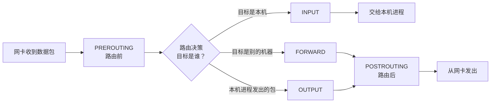

+++
title = "第37章：iptables 底层配置"
weight = 370
date = "2026-03-24T13:18:28+08:00"
type = "docs"
description = ""
isCJKLanguage = true
draft = false
+++


# 第三十七章：iptables 底层配置

`iptables` 是 Linux 内核包过滤框架（netfilter）的命令行工具，也是 UFW、firewalld 这些"自动挡"背后真正干活的东西。理解它，你才能看懂 `ufw status` 生成的规则、明白 Docker 为什么能绕过 UFW。

iptables 的语法看着吓人，但它其实就是一个固定套路：**在"哪张表"的"哪条链"上，匹配"什么条件"，然后执行"什么动作"**。把"四表五链"这张地图记住，剩下的都是查手册。

> ⚠️ 动手前先记住两件事：
>
> 1. **改错了会把自己锁在服务器外面**（尤其远程改 SSH 相关规则时）；
> 2. **iptables 规则默认重启就丢**，必须做持久化（见 37.7）。

## 37.1 iptables 与 nftables

| | iptables | nftables |
|---|---|---|
| 出现时间 | Linux 2.4（2001 年） | Linux 3.13（2014 年） |
| 规则结构 | 固定的表 + 链 | 一个统一的规则集，可自定义表链 |
| 处理多个规则 | 内核里逐条线性匹配，规则多时变慢 | 支持集合和映射，一次匹配一批 |
| 现状 | 维护中，仍是绝大多数文档的写法 | RHEL 9、Debian 12 等新系统的默认 |

而在**现代发行版上，你敲的 `iptables` 很可能已经是 `iptables-nft`**——它能理解 iptables 语法，但实际把规则翻译成 nftables 存起来：

```bash
# 看自己用的是哪个实现
iptables --version
# iptables v1.8.7 (nf_tables)     ← 翻译成 nftables
# iptables v1.8.7 (legacy)        ← 老式实现

# 同一批规则，用两种方式看
sudo iptables -S
sudo nft list ruleset | head -40
```

**结论**：iptables 语法值得学（存量系统和文档太多），但新项目不要用它手写复杂规则——用 firewalld/nftables，或者 `ufw`。

## 37.2 数据包是怎么走过来的

netfilter 在内核协议栈里埋了几个"检查点"，数据包每经过一个检查点，就会按顺序去查对应的规则。


```mermaid
graph LR
    NIC["网卡收到数据包"] --> PRE["PREROUTING<br>路由前"]
    PRE --> ROUTE{"路由决策<br>目标是谁？"}
    ROUTE -->|"目标是本机"| IN["INPUT"]
    ROUTE -->|"目标是别的机器"| FWD["FORWARD"]
    ROUTE -->|"本机进程发出的包"| OUT["OUTPUT"]
    IN --> APP["交给本机进程"]
    FWD --> POST["POSTROUTING<br>路由后"]
    OUT --> POST
    POST --> NICOUT["从网卡发出"]
```

三条路径记牢：

- **发给本机**：PREROUTING → INPUT → 本机进程；
- **经本机转发**：PREROUTING → FORWARD → POSTROUTING；
- **本机发出**：OUTPUT → POSTROUTING。

### 37.2.1 四张表（其实是五张）

| 表 | 干什么 | 常用链 |
|----|--------|--------|
| `filter` | 过滤数据包（放行/丢弃），**默认表** | INPUT、FORWARD、OUTPUT |
| `nat` | 地址转换（SNAT/DNAT/端口映射） | PREROUTING、POSTROUTING、OUTPUT |
| `mangle` | 修改包头（TTL、TOS、打标记） | 全部五条链 |
| `raw` | 让某些包**跳过连接跟踪** | PREROUTING、OUTPUT |
| `security` | 配合 SELinux 打安全标记 | INPUT、FORWARD、OUTPUT |

日常 95% 的操作都在 `filter` 表，其次的 5% 在 `nat` 表。`mangle`、`raw`、`security` 除非有明确需求，否则不用碰。

```bash
# 不指定 -t 就是 filter 表，这两条等价
sudo iptables -L -n
sudo iptables -t filter -L -n
```

### 37.2.2 五条链

| 链 | 处理什么 |
|----|---------|
| `INPUT` | 目标是本机的包 |
| `OUTPUT` | 本机进程发出的包 |
| `FORWARD` | 只是路过、要转给别人的包 |
| `PREROUTING` | 包刚进网卡、**还没做路由判断**时 |
| `POSTROUTING` | 路由判断完、**即将离开网卡**时 |

> **为什么要分 PREROUTING 和 POSTROUTING？** 因为 DNAT（改目标地址）必须在路由判断**之前**做，否则内核不知道往哪转；SNAT（改源地址）必须在路由判断**之后**做，否则改完会影响路由选择。位置是固定的，也解释了为什么端口映射写在 PREROUTING、共享上网写在 POSTROUTING。

**FORWARD 链什么时候会用上？**

- 本机当路由器/网关，连接内外网；
- Docker/K8s 宿主机转发容器的流量；
- VPN 服务器转发客户端的流量；
- 端口映射（DNAT）之后，包也要经过 FORWARD 才转得出去——**这是新手最容易漏的一步**：DNAT 写对了却不通，十有八九是 FORWARD 默认策略把包丢了。

## 37.3 命令语法

```bash
iptables -t 表名 操作 链名 匹配条件 -j 动作
```

`-t` 不写就是 `filter` 表。最常用的"操作"：

| 参数 | 含义 |
|------|------|
| `-A 链` | 追加到链末尾 |
| `-I 链 [编号]` | 插入到链首（或指定编号位置） |
| `-D 链 [编号]` | 按内容或编号删除 |
| `-R 链 编号` | 替换某条规则 |
| `-F [链]` | 清空规则（不改默认策略） |
| `-P 链 动作` | 设置链的默认策略 |
| `-L -n -v --line-numbers` | 查看规则（`-n` 不做 DNS 反解，快得多） |
| `-S` | 用"可执行命令"的形式打印规则，适合复制备份 |

```bash
# 查看带编号的规则（编号用于 -D / -R）
sudo iptables -L INPUT -n --line-numbers -v
```

```text
Chain INPUT (policy ACCEPT 0 packets, 0 bytes)
num   pkts bytes target     prot opt in     out     source        destination
1       12   720 ACCEPT     tcp  --  *      *       0.0.0.0/0     0.0.0.0/0     tcp dpt:22
2        0     0 DROP       tcp  --  *      *       0.0.0.0/0     0.0.0.0/0     tcp dpt:80
```

`pkts` 和 `bytes` 两列非常有用：**规则明明写了却没生效，先看计数器是不是 0**——是 0 就说明包根本没走到这条规则（多半被前面的规则拦了）。

## 37.4 匹配条件

### 37.4.1 基础匹配

```bash
# 协议
sudo iptables -A INPUT -p tcp -j ACCEPT
sudo iptables -A INPUT -p udp -j ACCEPT
sudo iptables -A INPUT -p icmp -j ACCEPT

# 端口（必须配合 -p tcp 或 -p udp）
sudo iptables -A INPUT -p tcp --dport 443 -j ACCEPT
sudo iptables -A INPUT -p tcp --sport 1024:65535 -j ACCEPT    # 源端口范围
sudo iptables -A INPUT -p tcp --dport 8000:9000 -j ACCEPT     # 目标端口范围

# 地址
sudo iptables -A INPUT -s 192.168.1.0/24 -j ACCEPT            # 来源网段
sudo iptables -A INPUT -d 10.0.0.1 -j ACCEPT                  # 目标地址
sudo iptables -A INPUT -s 10.0.0.50 -j DROP                   # 封禁单个 IP

# 网卡
sudo iptables -A INPUT -i eth0 -j ACCEPT                      # 入站网卡
sudo iptables -A OUTPUT -o eth0 -j ACCEPT                     # 出站网卡
```

### 37.4.2 扩展模块（`-m`）：真正干活的在这里

单靠上面几个条件写不出可用的防火墙，必须用 `-m` 加载扩展模块：

```bash
# 1) conntrack：连接状态（最关键，务必理解）
sudo iptables -A INPUT -m conntrack --ctstate ESTABLISHED,RELATED -j ACCEPT
sudo iptables -A INPUT -p tcp --dport 22 -m conntrack --ctstate NEW -j ACCEPT

# 2) multiport：一条规则写多个不连续的端口
sudo iptables -A INPUT -p tcp -m multiport --dports 80,443,8080 -j ACCEPT

# 3) iprange：匹配任意 IP 区间（网段写法表达不了的）
sudo iptables -A INPUT -m iprange --src-range 192.168.1.10-192.168.1.50 -j ACCEPT

# 4) limit：限速，防刷
sudo iptables -A INPUT -p icmp --icmp-type echo-request -m limit --limit 1/second -j ACCEPT

# 5) recent：记录"最近来过的 IP"，用来做简易封禁
sudo iptables -A INPUT -p tcp --dport 22 -m conntrack --ctstate NEW -m recent --set --name SSH
sudo iptables -A INPUT -p tcp --dport 22 -m conntrack --ctstate NEW -m recent --update --seconds 60 --hitcount 4 --name SSH -j DROP

# 6) comment：给规则写备注，半年后还能看懂
sudo iptables -A INPUT -p tcp --dport 3306 -m comment --comment "MySQL 仅内网" -s 10.0.0.0/8 -j ACCEPT

# 7) mac：按来源 MAC 过滤（只能用于同一二层网络）
sudo iptables -A INPUT -m mac --mac-source 00:11:22:33:44:55 -j ACCEPT
```

`--ctstate` 的常用值：

| 状态 | 含义 |
|------|------|
| `NEW` | 发起一个新连接（第一个包） |
| `ESTABLISHED` | 属于已建立连接的后续包 |
| `RELATED` | 与已有连接相关的新连接（如 FTP 数据连接、ICMP 错误） |
| `INVALID` | 状态异常，通常直接丢 |

> `-m state --state ...` 是老写法，现在官方推荐 `-m conntrack --ctstate ...`，功能一致。**但无论哪种，那条 `ESTABLISHED,RELATED` 的放行规则都是整套配置的基石**——忘了它，你会遇到"新连接进得来、回包出不去"的诡异现象。

## 37.5 动作

| 动作 | 含义 |
|------|------|
| `ACCEPT` | 放行，不再往下匹配 |
| `DROP` | 直接丢弃，**不回复任何信息**（对方等到超时） |
| `REJECT` | 拒绝并回复 ICMP/TCP 拒绝包（对方立刻知道被拒） |
| `LOG` | 记录到内核日志，**然后继续往下匹配**（不终止） |
| `RETURN` | 从自定义链返回上一级链 |
| `-j 自定义链名` | 跳到自定义链继续匹配 |

```bash
# DROP：像石沉大海，扫描器更难判断你是否存在
sudo iptables -A INPUT -s 10.0.0.50 -j DROP

# REJECT：立刻回"端口不可达"，调试方便，但会暴露主机存在
sudo iptables -A INPUT -p tcp --dport 80 -j REJECT --reject-with icmp-port-unreachable

# LOG：只记录，不拦截
sudo iptables -A INPUT -p tcp --dport 22 -m conntrack --ctstate NEW \
     -j LOG --log-prefix "[SSH-ATTEMPT] " --log-level warning
```

> ⚠️ `LOG` 动作**不会终止匹配**。想"既记录又拦截"必须写成两条规则，而且顺序不能反：
>
> ```bash
> sudo iptables -A INPUT -p tcp --dport 23 -j LOG --log-prefix "[TELNET] "
> sudo iptables -A INPUT -p tcp --dport 23 -j DROP
> ```
>
> 一旦 DROP 写在前面，包已经被丢掉，后面的 LOG 永远不会被执行。另外日志写得太频繁会把自己的磁盘写满，给 LOG 规则加上 `-m limit --limit 5/minute` 是个好习惯。

DROP 与 REJECT 怎么选：

- **对外网**用 `DROP`：不给扫描器任何回应，减少信息泄露；
- **对内网/调试期**用 `REJECT`：立刻报错，方便排查（不用傻等超时）。

## 37.6 一套可以真正使用的配置

把前面所有零件拼起来。**注意顺序：先放行必要流量，最后再改默认策略**，中途任何一步错了都还有回旋余地。

```bash
#!/bin/bash
# 基础防火墙脚本（简化版，生产请按需增删）
set -e

# ---- 1. 先确认 SSH 端口会放行（改之前一定要确认！）----
SSH_PORT=22

# ---- 2. 清空旧规则（-F 只清规则，不动默认策略）----
iptables -F
iptables -X            # 删除自定义链

# ---- 3. 默认策略：先设成"宽进"，避免把自己关在外面 ----
iptables -P INPUT ACCEPT
iptables -P FORWARD DROP
iptables -P OUTPUT ACCEPT

# ---- 4. 本机回环必须放行（很多服务靠它通信）----
iptables -A INPUT -i lo -j ACCEPT

# ---- 5. 已建立的连接和回包要放行（整套规则的地基）----
iptables -A INPUT -m conntrack --ctstate ESTABLISHED,RELATED -j ACCEPT

# ---- 6. 丢弃状态异常的包 ----
iptables -A INPUT -m conntrack --ctstate INVALID -j DROP

# ---- 7. 放行需要的服务 ----
iptables -A INPUT -p icmp --icmp-type echo-request -m limit --limit 1/second -j ACCEPT
iptables -A INPUT -p tcp --dport "$SSH_PORT" -m conntrack --ctstate NEW -j ACCEPT
iptables -A INPUT -p tcp -m multiport --dports 80,443 -m conntrack --ctstate NEW -j ACCEPT

# ---- 8. 最后才把 INPUT 默认策略改成 DROP ----
iptables -P INPUT DROP

# ---- 9. 看看结果 ----
iptables -L -n -v --line-numbers
```

三条必须理解的要点：

1. **`ESTABLISHED,RELATED` 那条规则是地基**。默认 DROP 之后，如果没有它，你发出的请求的回包也会被丢弃，表现为"能发包、收不到响应"。
2. **顺序就是一切**。iptables 从上往下匹配，命中 `ACCEPT`/`DROP`/`REJECT` 就结束。所以"放行特定端口"必须写在"默认拒绝"生效之前。
3. **默认策略最后改**。先放行 SSH 再 `-P INPUT DROP`，即使写漏了别的规则，你至少还能连上去修。

### 37.6.1 远程改规则时的"自锁保险"

这是远程运维 iptables 最重要的一条经验：**给自己留一条退路**。方法是在后台挂一个定时任务，几分钟后自动恢复成一份"已知可用的规则"：

```bash
# 1. 先把当前可用的规则存下来
sudo iptables-save > /root/iptables.working

# 2. 起一个 5 分钟后自动恢复的后台任务
sudo nohup bash -c 'sleep 300; iptables-restore < /root/iptables.working' >/dev/null 2>&1 &

# 3. 现在可以放心大胆地改规则（5 分钟内）
#    改完自己新开一个终端验证 SSH 还能不能连

# 4. 确认没问题后，干掉那个定时恢复的进程，别让它把你的新规则覆盖回去
sudo pkill -f 'iptables-restore'
```

如果 5 分钟后把自己锁了，那个后台任务会把规则恢复回来，你重新连上即可。云服务器还可以借助控制台的 VNC/串口，但别把希望都寄托在它身上。

## 37.7 NAT：地址转换

NAT 在 `nat` 表里，用于"改地址"。两种主要场景：**共享上网**（SNAT/MASQUERADE）和**端口映射**（DNAT）。

### 37.7.1 前提：打开 IP 转发

任何涉及转发的配置都要求内核允许转发，否则包会在路由那步被丢掉：

```bash
# 临时生效（重启失效）
sudo sysctl -w net.ipv4.ip_forward=1

# 永久生效（推荐写在 /etc/sysctl.d/ 下，别直接改 /etc/sysctl.conf）
echo 'net.ipv4.ip_forward = 1' | sudo tee /etc/sysctl.d/99-ipforward.conf
sudo sysctl --system
```

### 37.7.2 SNAT：共享上网（出口有固定公网 IP）

```bash
# 内网 192.168.1.0/24 的机器，经本机上网时把源地址改成 1.2.3.4
sudo iptables -t nat -A POSTROUTING -s 192.168.1.0/24 -o eth0 -j SNAT --to-source 1.2.3.4

# 对应的 FORWARD 放行（新连接出去 + 回包进来）
sudo iptables -A FORWARD -i eth1 -o eth0 -m conntrack --ctstate NEW,ESTABLISHED,RELATED -j ACCEPT
sudo iptables -A FORWARD -i eth0 -o eth1 -m conntrack --ctstate ESTABLISHED,RELATED -j ACCEPT
```

注意 FORWARD 的两条规则方向不同：**出去的那条要放行 `NEW`，回来的那条只需要 `ESTABLISHED,RELATED`**。把两边都写成 NEW 是常见错误（虽然不太危险），把回来那条也要求 NEW 则会导致连接完全不通。

### 37.7.3 MASQUERADE：共享上网（出口 IP 会变）

出口是拨号/DHCP 拿到的动态 IP 时，用 `MASQUERADE`，它会自动取当前出口网卡的 IP：

```bash
sudo iptables -t nat -A POSTROUTING -s 192.168.1.0/24 -o eth0 -j MASQUERADE
```

差别只有一个：**SNAT 要写死 IP，MASQUERADE 自动查**。代价是它每次都要去问网卡地址，性能略低——有固定 IP 就用 SNAT。

### 37.7.4 DNAT：端口映射（把外网端口转到内网机器）

```bash
# 把本机 80 端口收到的请求，转发到内网 192.168.1.100 的 8080 端口
sudo iptables -t nat -A PREROUTING -p tcp --dport 80 \
     -j DNAT --to-destination 192.168.1.100:8080

# ⚠️ 别忘了 FORWARD：DNAT 只改了目标地址，包还得被"允许转出去"
sudo iptables -A FORWARD -p tcp -d 192.168.1.100 --dport 8080 \
     -m conntrack --ctstate NEW,ESTABLISHED,RELATED -j ACCEPT
```

**DNAT 写了却不通，90% 是漏了 FORWARD 那条规则**（或者 FORWARD 默认策略是 DROP）。

如果内网机器需要"从内网访问公网 IP 也能转回来"（NAT 回流/hairpin），还要对本机出去的流量也做一次 DNAT：

```bash
# 内网访问公网 IP 时的回环处理（场景：内网用域名访问自己的服务）
sudo iptables -t nat -A OUTPUT -p tcp -d 1.2.3.4 --dport 80 \
     -j DNAT --to-destination 192.168.1.100:8080
```

> ⚠️ 纯 iptables 的 NAT 规则**重启就丢**，而且新手很容易在这里把自己写进死胡同。如果只是想做端口映射，用 `firewalld --add-forward-port` 或 `nftables` 会更省心。

## 37.8 保存规则：不做这一步，重启就白干

内存里的 iptables 规则在重启后**全部消失**，必须显式保存。

```bash
# 手工备份/恢复
sudo iptables-save > /root/iptables.rules
sudo iptables-restore < /root/iptables.rules

# 确认文件内容（这是一份可以直接复用的文本）
cat /root/iptables.rules
```

```text
*nat
:PREROUTING ACCEPT [0:0]
:INPUT ACCEPT [0:0]
:OUTPUT ACCEPT [0:0]
:POSTROUTING ACCEPT [0:0]
-A POSTROUTING -s 192.168.1.0/24 -o eth0 -j MASQUERADE
COMMIT

*filter
:INPUT DROP [0:0]
:FORWARD DROP [0:0]
:OUTPUT ACCEPT [0:0]
-A INPUT -i lo -j ACCEPT
-A INPUT -m conntrack --ctstate ESTABLISHED,RELATED -j ACCEPT
-A INPUT -p tcp -m tcp --dport 22 -j ACCEPT
COMMIT
```

按发行版选择持久化方案：

```bash
# Debian / Ubuntu：用 netfilter-persistent
sudo apt install iptables-persistent        # 安装时会问你要不要保存当前规则
sudo netfilter-persistent save              # 存到 /etc/iptables/rules.v4
sudo netfilter-persistent reload            # 重新加载
sudo systemctl enable netfilter-persistent  # 开机自动加载

# Ubuntu 的 ufw 本身也是"持久化"的：
sudo ufw enable                             # 开机自动启用，规则存在 /etc/ufw/

# RHEL 7 / CentOS 7：用 iptables-services
sudo yum install iptables-services
sudo service iptables save                  # 存到 /etc/sysconfig/iptables
sudo systemctl enable iptables

# RHEL 8+ / CentOS Stream / Rocky 9：官方已不推荐 iptables-services，
# 请改用 firewalld（第 36 章）或 nftables，把规则写进 /etc/nftables.conf
```

> ⚠️ 不要用 `/etc/network/interfaces` 里写 `pre-up iptables-restore` 这种老办法——ifupdown 在现代 Ubuntu 上已经被 netplan 接管，写了不生效。统一用上面对应的持久化服务。

## 37.9 排错清单

1. **规则没生效？** 先看 `iptables -L -n -v` 里那条规则的 `pkts` 计数：计数为 0 说明包没走到这条规则（顺序问题），计数在涨说明规则生效但动作不对。
2. **忘了 `ESTABLISHED,RELATED`？** 症状是"新连接能出去，但收不到回包"或"SSH 能连上，一会儿就卡住"。
3. **`LOG` 写在 `DROP` 后面？** 永远不会有日志。LOG 必须在前面。
4. **顺序反了？** 例如 `-A INPUT -j DROP` 写在放行规则之前，后面写再多也没用。要插到前面就用 `-I`。
5. **DNAT 不通？** 检查 FORWARD 链和 `net.ipv4.ip_forward`，两个都要对。
6. **重启后规则没了？** 没做持久化，见 37.8。
7. **装了 Docker 就"漏"了？** Docker 会自己往 `nat`/`filter` 里插 `DOCKER` 链，且位置在 iptables 自定义规则之前。明文写 `iptables -A INPUT -j DROP` 通常挡不住已发布到 `0.0.0.0` 的容器端口。改用 `-p 127.0.0.1:8080:80` 或 `ufw-docker`，并在别的机器上实测。
8. **被自己锁在外面了？** 用云控制台/机房 KVM 进去，`iptables -F`，然后按 37.6.1 的方法给自己留保险再改。

## 本章小结

| 知识点 | 要点 |
|--------|------|
| 定位 | iptables 是 netfilter 的命令行配置工具；现代系统上通常由 `iptables-nft` 翻译给 nftables |
| 五张表 | filter（过滤，默认）、nat（地址转换）、mangle（改包头）、raw（跳过连接跟踪）、security（SELinux） |
| 五条链 | INPUT、OUTPUT、FORWARD、PREROUTING、POSTROUTING |
| 包的路径 | 本机→INPUT；转发→FORWARD；发出→OUTPUT；进出网卡分别经过 PREROUTING / POSTROUTING |
| 语法 | `iptables -t 表 -A 链 匹配 -j 动作`；顺序至上，命中终止动作即结束 |
| 常用匹配 | `-p`、`-s`/`-d`、`--dport`、`-i`/`-o`、`-m conntrack`、`-m multiport`、`-m limit`、`-m recent` |
| 动作 | ACCEPT、DROP、REJECT、LOG（不终止）、RETURN、跳自定义链 |
| 地基规则 | `-m conntrack --ctstate ESTABLISHED,RELATED -j ACCEPT` |
| NAT | SNAT（固定出口 IP）、MASQUERADE（动态 IP）、DNAT（端口映射，别忘了 FORWARD + ip_forward） |
| 持久化 | `iptables-save`/`iptables-restore` + `netfilter-persistent`（Debian）或 `iptables-services`（RHEL 7） |
| 安全操作 | 先放行、后改默认策略；远程改规则前留"自动恢复"的后路 |

iptables 是这套体系里的"内功"：理解了表、链、状态和顺序，你就能看懂 UFW 生成的规则、明白 firewalld 在背后做了什么，也知道为什么 Docker 能让你的防火墙"形同虚设"。

**下一章预告**：第三十八章进入系统安全加固——账号与登录安全、服务最小化、文件权限审计、SELinux/AppArmor、安全基线检查。
