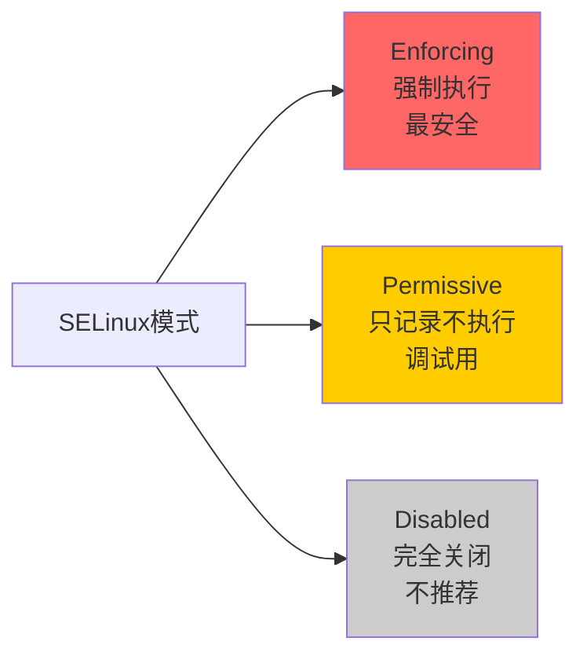

+++
title = "第38章：系统安全加固"
weight = 380
date = "2026-03-24T13:18:28+08:00"
type = "docs"
description = ""
isCJKLanguage = true
draft = false
+++


# 第三十八章：系统安全加固

服务器上线后，第一件事是什么？改密码？装软件？不，是安全加固。

想象一下：你买了一套房子，结果门锁是出厂默认密码，窗户没关，地下室入口大开——你会直接住进去吗？服务器也是一个道理。

安全加固就是给服务器装上防盗门、更换高级锁芯、安装监控摄像头。防火墙拦住了外部攻击，内部安全加固则防止"家贼"和"误操作"。

> 本章配套视频：服务器安全加固清单，做完这些，你的服务器才能叫"生产级"。

## 38.1 用户安全策略

用户账户是Linux系统的第一道防线。弱密码是入侵的最佳入口。

### 38.1.1 密码复杂度

弱密码是网络安全最大的敌人。以下密码绝对不能用：

- `123456`、`password`、`admin`、`root`——这种密码脚本小子3秒就能破解
- 生日、电话号码、姓名——社工库里有你的所有信息
- 纯单词——字典攻击专门针对这种

强密码的标准：

- 至少12位
- 包含大小写字母
- 包含数字
- 包含特殊字符（`!@#$%^&*`）
- 不要用个人信息

```bash
# 生成一个随机强密码（16位）
openssl rand -base64 16
```

```bash
# 输出示例
xK9#mP2$vL5@nQ8&wY3!
```

### 38.1.2 定期更换密码

密码不是设一次就用一辈子。即使是强密码，也要定期更换。

企业环境通常要求90天更换一次密码，并记录密码历史（不能重复使用最近5次的密码）。

## 38.2 密码策略配置

### 38.2.1 /etc/login.defs

`/etc/login.defs`是用户登录相关的配置文件，可以设置密码过期策略。

```bash
# 查看当前配置
cat /etc/login.defs
```

关键配置项：

```bash
# 密码最大有效期（天）
PASS_MAX_DAYS   99999

# 密码最小有效期（天），防止刚改完又改回去
PASS_MIN_DAYS   0

# 密码长度最小值
PASS_MIN_LEN    5

# 密码过期前警告天数
PASS_WARN_AGE   7
```

修改密码策略：

```bash
# 编辑配置文件
sudo vim /etc/login.defs

# 设置：密码最长90天有效，最短1天才能改，提前7天警告
PASS_MAX_DAYS   90
PASS_MIN_DAYS   1
PASS_WARN_AGE   7
```

> **注意**：`/etc/login.defs`只影响新建用户，已有的用户需要用`chage`命令修改。
> 
> 🔒 **安全建议**：对于已有用户，建议强制要求下次登录时修改密码：
> ```bash
> # 强制所有用户下次登录必须改密码
> sudo chage -d 0 $(cut -d: -f1 /etc/passwd)
> ```

```bash
# 查看用户密码状态
sudo chage -l username

# 设置密码过期时间
sudo chage -M 90 username

# 设置账户过期时间
sudo chage -E 2026-12-31 username

# 强制用户下次登录必须改密码
sudo chage -d 0 username
```

### 38.2.2 PAM 配置

PAM（Pluggable Authentication Modules，可插拔认证模块）是Linux认证系统的核心框架。`/etc/pam.d/`目录下的文件控制着密码策略、服务认证等。

```bash
# 查看密码复杂度配置文件
cat /etc/pam.d/common-password
```

```bash
# 按服务查看PAM配置
cat /etc/pam.d/passwd
```

安装`libpam-pwquality`来启用强密码策略：

```bash
# Ubuntu安装
sudo apt install libpam-pwquality

# CentOS安装
sudo yum install pam_pwquality
```

配置密码复杂度（编辑`/etc/security/pwquality.conf`）：

```bash
# 编辑密码质量配置
sudo vim /etc/security/pwquality.conf
```

```bash
# 密码最小长度
minlen = 12

# 至少包含一个大写字母
ucredit = 1

# 至少包含一个小写字母
lcredit = 1

# 至少包含一个数字
dcredit = 1

# 至少包含一个特殊字符
ocredit = 1

# 同一类的最大连续字符数（如不能有3个连续数字）
maxrepeat = 3

# 不能是用户名
difok = 3

# 用户名逆向检查（如密码不能是"admin"的逆序"nima"）
gecoscheck = 1
```

## 38.3 登录失败锁定

登录失败锁定（Account Lockout）是防止暴力破解的利器——连续输入错误密码若干次后，账户被锁定一段时间。

### 38.3.1 pam_faillock

`pam_faillock`模块实现登录失败锁定功能。

```bash
# 检查是否已安装
which pam_faillock
```

### 38.3.2 /etc/pam.d/login

配置PAM实现登录失败锁定：

```bash
# 编辑系统登录PAM配置
sudo vim /etc/pam.d/login
```

在`auth`部分添加：

```bash
# 在 auth required pam_faillock.so preauth 之前添加
# 锁定登录失败次数
auth required pam_faillock.so deny=3 unlock_time=600

# unlock_time=600 表示锁定600秒（10分钟）
# deny=3 表示连续3次失败后锁定
```

完整的`/etc/pam.d/login`示例：

```bash
# PAM configuration for login

# auth部分
auth       requisite    pam_nologin.so
auth       required    pam_faillock.so preauth silent audit deny=3 unlock_time=600
auth       [success=1 default=ignore]  pam_unix.so try_first_pass
auth       requisite   pam_succeed_if.so user ingroup nopasswdlogin
auth       [default=die]  pam_faillock.so authfail audit deny=3 unlock_time=600
auth       required    pam_permit.so

# account部分
account    required    pam_faillock.so
account    requisite   pam_nologin.so
account    include     system-auth
account    required    pam_access.so
```

```bash
# 重启系统或重新加载PAM配置后生效
# 手动解锁被锁定的账户
sudo faillock --user username --reset
```

```bash
# 查看用户的登录失败记录
sudo faillock --user username
```

```bash
# 输出示例
username:
When         Type        Source         Valid
2026-03-23 10:00:00    RHOST         192.168.1.100         V
2026-03-23 10:00:30    RHOST         192.168.1.100         V
2026-03-23 10:01:00    RHOST         192.168.1.100         V
```

## 38.4 禁用不必要的服务

服务器上跑的服务越多，攻击面越大。禁用不需要的服务，是安全加固的重要步骤。

### 38.4.1 systemctl mask 服务

用`systemctl mask`禁用服务，比`systemctl stop`更彻底——mask会把服务链接到`/dev/null`，从根本上防止服务启动。

```bash
# 查看所有正在运行的服务
systemctl list-units --type=service --state=running
```

```bash
# 查看所有已安装的服务（包括没运行的）
systemctl list-unit-files --type=service
```

```bash
# 禁用不必要的服务（示例）
sudo systemctl mask cups           # 打印机服务
sudo systemctl mask bluetooth      # 蓝牙
sudo systemctl mask avahi-daemon  # 局域网设备发现

# 启用被mask的服务
sudo systemctl unmask cups
```

> **mask vs disable**：disable只是取消开机自启，但服务依然可以手动启动；mask则是彻底禁用，连手动启动都不行。

### 38.4.2 检查运行中的服务

定期审计运行中的服务：

```bash
# 检查SSH是否在跑
systemctl status sshd

# 检查所有监听TCP端口的服务
ss -tulpn | grep LISTEN
```

```bash
# 输出示例
Proto Recv-Q Send-Q Local Address           Foreign Address         State       PID/Program name
tcp        0      0 0.0.0.0:22              0.0.0.0:*               LISTEN      1234/sshd: /usr/sbin
tcp        0      0 127.0.0.1:631           0.0.0.0:*               LISTEN      2345/cupsd
tcp        0      0 0.0.0.0:3306            0.0.0.0:*               LISTEN      3456/mysqld
```

## 38.5 内核参数调优

Linux内核参数（sysctl）可以调整网络相关的安全设置，防御SYN Flood、IP Spoofing等网络攻击。

### 38.5.1 /etc/sysctl.conf

`/etc/sysctl.conf`是内核参数配置文件，`sysctl -p`命令重新加载。

```bash
# 查看当前所有内核参数
sysctl -a
```

### 38.5.2 网络安全参数

以下是常用的网络安全加固参数：

```bash
# 编辑sysctl配置
sudo vim /etc/sysctl.conf
```

```bash
# ============ 网络安全参数 ============

# 禁用IP转发（如果不是路由器）
net.ipv4.ip_forward = 0

# 禁用ICMP重定向（防止路由欺骗）
net.ipv4.conf.all.accept_redirects = 0
net.ipv4.conf.default.accept_redirects = 0
net.ipv6.conf.all.accept_redirects = 0
net.ipv6.conf.default.accept_redirects = 0

# 启用SYN Cookie（防御SYN Flood攻击）
net.ipv4.tcp_syncookies = 1
net.ipv4.tcp_syn_retries = 2
net.ipv4.tcp_synack_retries = 2

# 禁止IP源路由
net.ipv4.conf.all.accept_source_route = 0
net.ipv4.conf.default.accept_source_route = 0
net.ipv6.conf.all.accept_source_route = 0
net.ipv6.conf.default.accept_source_route = 0

# 开启ICMP ping广播限制（防止Smurf攻击）
net.ipv4.icmp_echo_ignore_broadcasts = 1

# 忽略ICMP ping请求（可选，隐藏服务器存在）
# net.ipv4.icmp_echo_ignore_all = 1

# 禁用IPv6（如果没有IPv6需求）
net.ipv6.conf.all.disable_ipv6 = 1
net.ipv6.conf.default.disable_ipv6 = 1

# 调整本地端口范围
net.ipv4.ip_local_port_range = 1024 65535

# 启用反向路径过滤（防止IP Spoofing）
net.ipv4.conf.all.rp_filter = 1
net.ipv4.conf.default.rp_filter = 1

# 调整最大SYN队列长度
net.core.netdev_max_backlog = 5000
net.core.somaxconn = 1024
```

```bash
# 应用配置（不重启服务器）
sudo sysctl -p

# 应用特定参数
sudo sysctl -w net.ipv4.tcp_syncookies=1

# 查看参数当前值
sysctl net.ipv4.tcp_syncookies
```

## 38.6 系统更新

保持系统软件最新，是最基本也最重要的安全措施。

### 38.6.1 自动安全更新

Ubuntu启用自动安全更新：

```bash
# 安装unattended-upgrades
sudo apt install unattended-upgrades

# 启用自动更新
sudo dpkg-reconfigure -plow unattended-upgrades
```

CentOS启用自动更新：

```bash
# 安装yum-cron
sudo yum install -y yum-cron

# 启用服务
sudo systemctl enable yum-cron
sudo systemctl start yum-cron
```

### 38.6.2 unattended-upgrades

配置`unattended-upgrades`的更新行为：

```bash
# 编辑配置文件
sudo vim /etc/apt/apt.conf.d/50unattended-upgrades
```

```bash
# 自动更新，但不自动重启（除非必要）
Unattended-Upgrade::Automatic-Reboot "false";

# 只安装安全更新
Unattended-Upgrade::Mail "root";
Unattended-Upgrade::Remove-Unused-Dependencies "true";
Unattended-Upgrade::Allowed-Origins {
        "${distro_id}:${distro_codename}";
        "${distro_id}:${distro_codename}-security";
};
```

## 38.7 SELinux：强制访问控制（CentOS/RHEL）

SELinux（Security-Enhanced Linux）是美国国家安全局（NSA）开发的Linux安全模块，强制执行访问控制策略。

### 38.7.1 三种模式：Enforcing、Permissive、Disabled

SELinux有三种运行模式：

- **Enforcing（强制模式）**：SELinux强制执行安全策略，拒绝违规访问。**生产环境必须用这个**。
- **Permissive（宽容模式）**：SELinux不执行安全策略，但会记录违规行为。用于测试和调试。
- **Disabled（禁用模式）**：完全关闭SELinux。**不推荐**。



### 38.7.2 getenforce

查看当前SELinux模式：

```bash
getenforce
```

```bash
Enforcing
```

### 38.7.3 setenforce

临时修改SELinux模式（重启后失效，永久修改需要编辑配置文件）：

```bash
# 临时设为宽容模式（调试用）
sudo setenforce Permissive

# 临时改回强制模式
sudo setenforce Enforcing

# 验证
getenforce
```

永久修改SELinux模式（编辑配置文件）：

```bash
# 编辑SELinux配置文件
sudo vim /etc/selinux/config
```

```bash
# This file controls the state of SELinux on the system.
# SELINUX= can take one of these three values:
#     enforcing - SELinux security policy is enforced.
#     permissive - SELinux prints warnings instead of enforcing.
#     disabled - No SELinux policy is loaded.
SELINUX=enforcing
# SELINUXTYPE= can take one of three values:
#     targeted - Targeted processes are protected,
#     minimum - Modification of targeted policy. Only selected processes are protected.
#     mls - Multi Level Security protection.
SELINUXTYPE=targeted
```

```bash
# 查看SELinux状态（详细信息）
sestatus
```

```bash
SELinux status:                 enabled
SELinuxfs mount:                /sys/fs/selinux
SELinux root directory:         /etc/selinux
Loaded policy name:             targeted
Current mode:                   enforcing
Mode from config file:          enforcing
Policy MLS status:              enabled
Policy deny_unknown status:     allowed
Max kernel policy version:      33
```

## 38.8 AppArmor：强制访问控制（Ubuntu）

AppArmor是Ubuntu默认的强制访问控制（MAC）系统，和SELinux功能类似，但配置更简单。

### 38.8.1 配置文件

AppArmor的配置文件在`/etc/apparmor.d/`目录下，每个程序有自己的profile。

```bash
# 查看AppArmor配置文件
ls -la /etc/apparmor.d/
```

```bash
# 查看nginx的AppArmor配置
cat /etc/apparmor.d/usr.sbin.nginx
```

AppArmor profile示例（简化版）：

```bash
# /etc/apparmor.d/usr.sbin/nginx
#include <tunables/global>

/usr/sbin/nginx {
  # 允许读取系统库文件
  /usr/sbin/nginx mr,

  # 允许读取网站目录
  /var/www/** r,

  # 允许读写日志
  /var/log/nginx/** rw,

  # 禁止访问其他目录
  /** deny,
}
```

### 38.8.2 aa-status

查看AppArmor状态：

```bash
sudo aa-status
```

```bash
apparmor module is loaded.
6 profiles are loaded.
6 profiles are in enforce mode.
   /usr/bin/evince
   /usr/bin/evince-prespawn
   /usr/sbin/cupsd
   /usr/sbin/nginx
   /usr/sbin/sshd
   /usr/sbin/tcpdump
0 profiles are in complain mode.
```

```bash
# 重新加载AppArmor配置
sudo systemctl reload apparmor

# 禁用AppArmor（不推荐）
sudo systemctl disable apparmor
sudo systemctl stop apparmor
```

## 38.9 rkhunter：Rootkit 检测

rkhunter（Rootkit Hunter）是一款检测Linux Rootkit的软件。

### 38.9.1 apt install rkhunter

```bash
# Ubuntu安装
sudo apt install rkhunter

# CentOS安装
sudo yum install epel-release
sudo yum install rkhunter
```

### 38.9.2 rkhunter --check

运行Rootkit检测：

```bash
# 更新rkhunter数据库（首次使用前必须运行）
sudo rkhunter --update

# 执行检测
sudo rkhunter --check --skip-keypress
```

```bash
# 输出示例（关键部分）
[ Rootkit Hunter version 1.4.6 ]

Checking system commands...

  Performing 'strings' checks...
    Checking for string replacements...              [OK]

Checking for rootkits...
  Checking for login backdoors...                   [OK]
  Checking for suspicious files...                   [OK]
  Checking for hidden files...                      [OK]

System checks summary...
  All checks passed!
```

> **定期运行**：建议将rkhunter加入cron任务，每周自动检测一次，并把结果发送到管理员邮箱。

## 38.10 clamav：Linux 杀毒软件

ClamAV是开源的杀毒软件，主要用于扫描Linux服务器上的Windows病毒（防止传给Windows用户）。

### 38.10.1 apt install clamav

```bash
# Ubuntu安装
sudo apt install clamav clamav-daemon

# CentOS安装
sudo yum install clamav clamav-update
```

### 38.10.2 clamscan

扫描目录：

```bash
# 更新病毒库
sudo freshclam

# 扫描整个系统
sudo clamscan -r /

# 扫描指定目录（不删除感染文件）
sudo clamscan -r /home

# 扫描并删除感染文件
sudo clamscan -r --remove /tmp/virus_files

# 只显示感染文件（静默模式）
sudo clamscan -r -i /home

# 扫描后生成报告
sudo clamscan -r --log=/var/log/clamav/scan.log /home
```

```bash
# 输出示例
----------- SCAN SUMMARY -----------
Known viruses: 8647252
Engine version: 0.103.8
Scanned directories: 1024
Scanned files: 5432
Infected files: 0
Data scanned: 2.45 GB
Data read: 3.21 GB (ratio 0.76%)
Time: 45.123 sec
```

## 38.11 AIDE：文件完整性检查

AIDE（Advanced Intrusion Detection Environment）是一款文件完整性监控工具，可以检测系统文件是否被篡改。

### 38.11.1 aideinit

初始化AIDE数据库：

```bash
# 安装AIDE
sudo apt install aide

# 初始化数据库
sudo aideinit
```

```bash
# 移动生成的数据库文件
sudo mv /var/lib/aide/aide.db.new /var/lib/aide/aide.db
```

### 38.11.2 aide --check

定期检查文件完整性：

```bash
# 执行完整性检查
sudo aide --check

# 查看上次检查结果（详细）
sudo aide --check --report=verbose
```

```bash
# 输出示例（如果文件被篡改）
 Aline added : /etc/passwd
 File directory: /etc/ssh
 Aline changes: /etc/ssh/sshd_config
```

## 38.12 auditd：Linux 审计系统

auditd（Linux Audit Daemon）是Linux的审计系统，记录系统上的安全相关事件，比如谁执行了什么命令、修改了什么文件。

### 38.12.1 auditctl

`auditctl`是auditd的命令行控制工具。

```bash
# 查看审计规则
sudo auditctl -l

# 查看审计状态
sudo auditctl -s
```

```bash
# 添加审计规则：监控/etc/passwd文件的修改
sudo auditctl -w /etc/passwd -p wa -k passwd_modify

# 参数说明：
# -w：监控文件路径
# -p：监控权限（r=读,w=写,a=属性,x=执行）
# -k：给规则起个名字（用于搜索）
```

```bash
# 监控SSH配置文件修改
sudo auditctl -w /etc/ssh/sshd_config -p wa -k sshd_config_modify

# 监控用户认证相关文件
sudo auditctl -w /etc/pam.d/ -p wa -k pam_modify

# 删除规则
sudo auditctl -W /etc/passwd -p wa -k passwd_modify
```

### 38.12.2 aureport

`aureport`生成审计报告。

```bash
# 查看所有认证事件
sudo aureport -au

# 查看失败的认证尝试
sudo aureport -au --failed

# 查看执行过的命令
sudo aureport -e --success

# 查看文件修改事件
sudo aureport -f --success

# 按用户统计
sudo aureport -u --summary
```

```bash
# aureport -au 输出示例
Authentication Report
============================================
# date time auid term host exe result
1. 03/23/2026 10:00:00 root ssh 192.168.1.100 /usr/sbin/sshd success
2. 03/23/2026 10:05:23 invalid login 192.168.1.200 /usr/sbin/sshd failed
3. 03/23/2026 10:05:45 invalid login 192.168.1.200 /usr/sbin/sshd failed
```

> **审计是事后分析工具**：auditd记录的事件是事后查看的，不能实时阻止攻击。但通过分析审计日志，可以追溯入侵者的行为轨迹。

---

## 本章小结

本章我们完成了Linux系统安全加固的全面学习：

- **用户安全策略**：强密码（12位+大小写+数字+特殊字符）、定期更换
- **密码策略配置**：`/etc/login.defs`控制密码有效期，PAM配置复杂度
- **登录失败锁定**：`pam_faillock`，连续3次失败锁定10分钟
- **禁用不必要服务**：`systemctl mask`彻底禁用服务
- **内核参数调优**：`/etc/sysctl.conf`，防御SYN Flood、IP Spoofing
- **系统更新**：启用自动安全更新（unattended-upgrades）
- **SELinux**（CentOS）：三种模式，Enforcing是生产环境必须
- **AppArmor**（Ubuntu）：MAC访问控制，配置文件在`/etc/apparmor.d/`
- **rkhunter**：Rootkit检测工具，定期检查
- **ClamAV**：Linux杀毒软件，扫描Windows病毒
- **AIDE**：文件完整性监控，对比基准数据库发现篡改
- **auditd**：Linux审计系统，追踪安全事件

服务器安全不是一次性的工作，而是持续的过程。定期检查、定期更新、定期审计，才能保证服务器长期安全。
