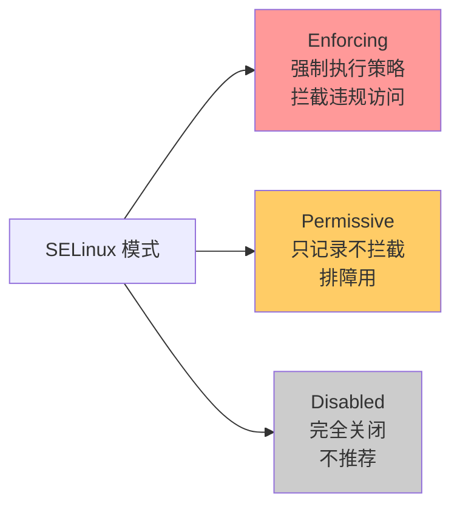

+++
title = "第38章：系统安全加固"
weight = 380
date = "2026-03-24T13:18:28+08:00"
type = "docs"
description = ""
isCJKLanguage = true
draft = false
+++


# 第三十八章：系统安全加固

服务器上线后，第一件事是什么？改密码？装软件？不，是安全加固。

想象一下：你买了一套房子，结果门锁是出厂默认密码，窗户没关，地下室入口大开——你会直接住进去吗？服务器也是一个道理。

安全加固就是给服务器装上防盗门、更换高级锁芯、安装监控摄像头。防火墙拦住了外部攻击，内部安全加固则防止"家贼"和"误操作"。

> 本章配套视频：服务器安全加固清单，做完这些，你的服务器才能叫"生产级"。

## 38.1 用户安全策略

用户账户是Linux系统的第一道防线。弱密码是入侵的最佳入口。

### 38.1.1 密码复杂度

弱密码是网络安全最大的敌人。以下密码绝对不能用：

- `123456`、`password`、`admin`、`root`——这种密码脚本小子3秒就能破解
- 生日、电话号码、姓名——社工库里有你的所有信息
- 纯单词——字典攻击专门针对这种

强密码的标准：

- 至少12位
- 包含大小写字母
- 包含数字
- 包含特殊字符（`!@#$%^&*`）
- 不要用个人信息

```bash
# 生成一个随机强密码（16 字节，base64 后约 24 个字符）
openssl rand -base64 16
```

```bash
# 输出示例（base64 的字符集是 A-Z a-z 0-9 + /，可能出现 = 结尾）
9kQ2xW7vLp3nR8tZbY5mFg==
```

> ⚠️ 注意上面这行的字符集：`openssl rand -base64` **只会产生 `A-Z a-z 0-9 + /`**，不会出现 `#`、`$`、`&`、`!` 这类符号。网上不少"示例输出"是随手编的，看到 `xK9#mP2$vL5` 这种就知道不是真的。
>
> 如果目标系统要求密码里必须有特殊字符，可以自己从更宽的可打印字符里取：
>
> ```bash
> # 从 /dev/urandom 里筛出可打印字符，取 20 个
> LC_ALL=C tr -dc 'A-Za-z0-9!@#$%^&*()_+-=' < /dev/urandom | head -c 20; echo
> ```
>
> 另外，随机密码**不需要"看起来复杂"**——真正决定强度的是长度和不可预测性，不是有没有 `!`。

### 38.1.2 定期更换密码

密码不是设一次就用一辈子。即使是强密码，也要定期更换。

企业环境通常要求90天更换一次密码，并记录密码历史（不能重复使用最近5次的密码）。

> 补充一句：**"每 90 天强制换密码"这条老规矩正在被逐步淘汰**。NIST SP 800-63B 等现代指南不再推荐定期强制改密，理由是用户会把它变成 `Passw0rd1` → `Passw0rd2` 这种可预测的循环，反而更不安全。现在的推荐做法是：**密码足够长 + 全站唯一 + 开启多因素认证（MFA）+ 发现泄露后再强制更换**。企业等保合规场景可能仍要求 90 天，那就按合规要求来。

密码历史（禁用最近用过的那几个）由 PAM 的 `pam_pwhistory`（Debian 通过 `remember=5` 配置在 `common-password` 里）负责，不是 `login.defs` 的配置项。

## 38.2 密码策略配置

### 38.2.1 /etc/login.defs

`/etc/login.defs`是用户登录相关的配置文件，可以设置密码过期策略。

```bash
# 查看当前配置
cat /etc/login.defs
```

关键配置项：

```bash
# 密码最大有效期（天）
PASS_MAX_DAYS   99999

# 密码最小有效期（天），防止刚改完又改回去
PASS_MIN_DAYS   0

# 密码长度最小值
PASS_MIN_LEN    5

# 密码过期前警告天数
PASS_WARN_AGE   7
```

修改密码策略：

```bash
# 编辑配置文件
sudo vim /etc/login.defs

# 设置：密码最长90天有效，最短1天才能改，提前7天警告
PASS_MAX_DAYS   90
PASS_MIN_DAYS   1
PASS_WARN_AGE   7
```

> **注意**：`/etc/login.defs`只影响新建用户，已有的用户需要用`chage`命令修改。
>
> 还有一点必须说清楚：**`PASS_MIN_LEN` 在现代系统上基本不起作用**。它只被少数老工具（如 `passwd` 的部分实现）读取，真正决定"密码最少几位"的是 PAM 里的 `pam_pwquality`（见 38.2.2）。所以别只改 `login.defs` 就以为密码策略生效了，改完一定要用 `passwd` 实测一次。
>
> 🔒 **安全建议**：对于已有用户，可以强制要求下次登录时修改密码。**但注意只挑真实的人类用户**：
>
> ```bash
> # 只对 UID >= 1000 的普通用户（排除 root 和所有系统账号）
> awk -F: '$3 >= 1000 && $3 < 65534 {print $1}' /etc/passwd
>
> # 确认名单没问题后，再批量执行
> for u in $(awk -F: '$3 >= 1000 && $3 < 65534 {print $1}' /etc/passwd); do
>     sudo chage -d 0 "$u"
> done
> ```
>
> ⚠️ 千万别写成 `chage -d 0 $(cut -d: -f1 /etc/passwd)`：`/etc/passwd` 里还有 `daemon`、`bin`、`mysql`、`nginx` 等几十个系统账号，给它们设成"下次登录必须改密"轻则让服务起不来，重则直接把数据库/Web 服务锁死。

```bash
# 查看用户密码状态
sudo chage -l username

# 设置密码过期时间
sudo chage -M 90 username

# 设置账户过期时间
sudo chage -E 2026-12-31 username

# 强制用户下次登录必须改密码
sudo chage -d 0 username
```

### 38.2.2 PAM 配置

PAM（Pluggable Authentication Modules，可插拔认证模块）是Linux认证系统的核心框架。`/etc/pam.d/`目录下的文件控制着密码策略、服务认证等。

```bash
# 查看密码复杂度配置文件
cat /etc/pam.d/common-password
```

```bash
# 按服务查看PAM配置
cat /etc/pam.d/passwd
```

安装`libpam-pwquality`来启用强密码策略：

```bash
# Debian / Ubuntu：包名就是 libpam-pwquality
sudo apt install libpam-pwquality

# RHEL / CentOS / Rocky 系：包名是 libpwquality（模块文件叫 pam_pwquality.so）
sudo dnf install libpwquality
```

装完之后还要确认 PAM 真的在用这个模块：

```bash
# Debian / Ubuntu：应该能看到一行 pam_pwquality.so
grep pwquality /etc/pam.d/common-password

# 如果没看到，运行 pam-auth-update 勾选 pwquality 后再检查
sudo pam-auth-update

# RHEL 8+ 用 authselect 管理 PAM，相关的默认策略里已经带 pwquality
authselect current
```

配置密码复杂度（编辑`/etc/security/pwquality.conf`）：

```bash
# 编辑密码质量配置
sudo vim /etc/security/pwquality.conf
```

```bash
# 密码最小长度
minlen = 12

# 至少要包含 3 类字符（大写/小写/数字/符号 四选三）
minclass = 3

# 下面这四个是"信用分"写法：
#   正数 = 每出现一个该类别字符，就给 minlen 加 1 分（是"加分"，不是"要求"）
#   负数 = 强制要求至少出现 N 个该类别字符
#
# 想"必须包含大写"，要写负数：
ucredit = -1      # 至少 1 个大写字母
lcredit = -1      # 至少 1 个小写字母
dcredit = -1      # 至少 1 个数字
ocredit = -1      # 至少 1 个特殊字符

# 不允许出现 3 个及以上连续相同的字符（如 aaa、111）
maxrepeat = 3

# 最多允许 3 个连续的同"类"字符（如 abc、123）
maxclassrepeat = 4

# 新密码与旧密码至少要有 3 个字符不同
difok = 3

# 不允许密码包含用户名（或用户名的逆序、简单变形）
usercheck = 1

# 不允许密码里出现 GECOS（真实姓名、电话等）里的词
gecoscheck = 1
```

> ⚠️ **`ucredit = 1` 和 `ucredit = -1` 是两回事**，这是 pwquality 里最容易搞错的地方：
>
> - `ucredit = 1`：密码里有大写字母就"加分"，没有也不拦——**它并不会强制要求大写**；
> - `ucredit = -1`：**强制要求**至少 1 个大写字母。
>
> 很多"加固脚本"抄来抄去都是正数，结果密码策略形同虚设。另外 `difok` 是"与旧密码的差异字符数"，不是"不能是用户名"——那个是 `usercheck`。

改完立刻用普通用户验证一下，别只看配置文件：

```bash
# 用普通用户执行，故意设一个短密码，应该被拒绝
passwd
# BAD PASSWORD: The password is shorter than 12 characters
```

想单独测试规则是否按预期生效，可以调高详细程度（`/etc/security/pwquality.conf` 里的 `verbose = 1`），失败原因会打印得清清楚楚。

## 38.3 登录失败锁定

登录失败锁定（Account Lockout）是防止暴力破解的利器——连续输入错误密码若干次后，账户被锁定一段时间。

### 38.3.1 pam_faillock 是什么

`pam_faillock` 是一个 **PAM 模块**（不是一个命令，所以 `which pam_faillock` 永远找不到东西，得用 `ls` 去找 `.so` 文件）。它的工作是：记录登录失败次数，达到阈值后把这个账号或来源 IP 锁一段时间。

```bash
# 找模块文件（Debian/Ubuntu 在 security/ 目录下）
ls /usr/lib/x86_64-linux-gnu/security/pam_faillock.so
# RHEL 系通常在 /usr/lib64/security/
ls /usr/lib64/security/pam_faillock.so

# 真正能用的命令是 faillock：查看失败记录、手动解锁
which faillock
```

### 38.3.2 正确的配置姿势：四行配对，缺一不可

`pam_faillock` 必须写成**一组**才能工作。单独写一行 `auth required pam_faillock.so deny=3` 不会有任何效果，这也是很多"加固脚本"看起来跑了、实际没锁的原因：

```text
auth     required                     pam_faillock.so preauth    # 登录前先查：这个账号被锁了吗
auth     [success=1 default=ignore]   pam_unix.so                # 校验密码
auth     [default=die]                pam_faillock.so authfail   # 密码错了，记一次失败
account  required                     pam_faillock.so            # 锁定期内一律不放行
```

具体怎么改，取决于发行版，**不要手工编辑 `/etc/pam.d/` 下面的文件**（改漏一个入口就白干了）：

```bash
# RHEL 8 / 9 / CentOS Stream / Rocky：用 authselect 一键启用
sudo authselect enable-feature with-faillock
authselect current

# Debian / Ubuntu：用 pam-auth-update 勾选
sudo pam-auth-update
```

参数推荐集中写在 **`/etc/security/faillock.conf`** 里，而不是塞在 PAM 那一行——这样 `login`、`sshd`、`su`、图形登录统一生效：

```bash
# /etc/security/faillock.conf
deny = 3                  # 连续失败 3 次就锁
unlock_time = 600         # 锁 600 秒（10 分钟）
fail_interval = 900       # 只有在 15 分钟内的失败才累计
even_deny_root            # 对 root 也生效（默认 root 不受限，远程爆破 root 时很危险）
root_unlock_time = 60     # root 只锁 60 秒，避免把自己也锁死
audit                     # 把失败事件写进审计日志
silent                    # 密码提示里不透露"还剩几次机会"
```

> ⚠️ **只改 `/etc/pam.d/login` 是不够的**：SSH 登录走 `/etc/pam.d/sshd`，图形界面走 `gdm-password` / `lightdm`，`su` 走 `/etc/pam.d/su`。这就是推荐用 `authselect` / `pam-auth-update` 的原因——它们会把所有入口一起改好。
>
> 另外别把 `audit` 和 `silent` 的语义搞混：`audit` 是"失败也写审计日志"，`silent` 是"不回显那些提示信息"。原稿把 Red Hat 和 Debian 的写法混抄在一起，`account include system-auth` 这行在 Debian 上是找不到文件的（Debian 叫 `common-account`），照着抄会导致 PAM 直接报错、所有人登不进来。

### 38.3.3 查看失败记录与解锁

```bash
# 看某个账号的失败记录（被锁后要执行的第一条命令）
sudo faillock --user username

# 手动解锁
sudo faillock --user username --reset

# 看所有被锁的账号
sudo faillock
```

```bash
# 查看用户的登录失败记录
sudo faillock --user username
```

```bash
# 输出示例
username:
When         Type        Source         Valid
2026-03-23 10:00:00    RHOST         192.168.1.100         V
2026-03-23 10:00:30    RHOST         192.168.1.100         V
2026-03-23 10:01:00    RHOST         192.168.1.100         V
```

## 38.4 禁用不必要的服务

服务器上跑的服务越多，攻击面越大。禁用不需要的服务，是安全加固的重要步骤。

### 38.4.1 systemctl mask 服务

用`systemctl mask`禁用服务，比`systemctl stop`更彻底——mask会把服务链接到`/dev/null`，从根本上防止服务启动。

```bash
# 查看所有正在运行的服务
systemctl list-units --type=service --state=running
```

```bash
# 查看所有已安装的服务（包括没运行的）
systemctl list-unit-files --type=service
```

```bash
# 禁用不必要的服务（示例）
sudo systemctl mask cups           # 打印机服务
sudo systemctl mask bluetooth      # 蓝牙
sudo systemctl mask avahi-daemon  # 局域网设备发现

# 启用被mask的服务
sudo systemctl unmask cups
```

> **mask vs disable**：disable只是取消开机自启，但服务依然可以手动启动；mask则是彻底禁用，连手动启动都不行。

### 38.4.2 检查运行中的服务

定期审计运行中的服务：

```bash
# 检查SSH是否在跑
systemctl status sshd

# 检查所有监听TCP端口的服务
ss -tulpn | grep LISTEN
```

```bash
# 输出示例
Proto Recv-Q Send-Q Local Address           Foreign Address         State       PID/Program name
tcp        0      0 0.0.0.0:22              0.0.0.0:*               LISTEN      1234/sshd: /usr/sbin
tcp        0      0 127.0.0.1:631           0.0.0.0:*               LISTEN      2345/cupsd
tcp        0      0 0.0.0.0:3306            0.0.0.0:*               LISTEN      3456/mysqld
```

## 38.5 内核参数调优

Linux内核参数（sysctl）可以调整网络相关的安全设置，防御SYN Flood、IP Spoofing等网络攻击。

### 38.5.1 配置文件放哪

内核参数（sysctl）用文件管理。**别再往 `/etc/sysctl.conf` 里堆了**——那个文件属于发行版/软件包，你自己加的规则和它混在一起，将来排查会很痛苦。规范做法是在 `/etc/sysctl.d/` 下建一个带优先级的独立文件：

```bash
# 查看当前所有内核参数（输出很长，建议配合 grep）
sysctl -a
sysctl net.ipv4.tcp_syncookies

# 推荐：自建一个 99 开头（数字大，后加载、优先级高）的文件
sudo vim /etc/sysctl.d/99-hardening.conf

# 让 /etc/sysctl.d/ 里的所有文件都生效
sudo sysctl --system

# sysctl -p 只读 /etc/sysctl.conf（或者 -p 指定的那个文件），
# 改完 /etc/sysctl.d/ 下的文件请用 --system
```

配置文件里的 `#` 和 `;` 都表示注释，格式就是 `键 = 值`，**等号两边可以有空格**（这点和 Shell 变量不同）。

### 38.5.2 网络安全参数

以下是常用的网络安全加固参数：

```bash
# 编辑我们自己创建的配置文件
sudo vim /etc/sysctl.d/99-hardening.conf
```

```bash
# ============ 网络安全参数 ============

# 禁用IP转发（如果不是路由器）
net.ipv4.ip_forward = 0

# 禁用ICMP重定向（防止路由欺骗）
net.ipv4.conf.all.accept_redirects = 0
net.ipv4.conf.default.accept_redirects = 0
net.ipv6.conf.all.accept_redirects = 0
net.ipv6.conf.default.accept_redirects = 0

# 启用SYN Cookie（防御SYN Flood攻击）
net.ipv4.tcp_syncookies = 1
net.ipv4.tcp_syn_retries = 2
net.ipv4.tcp_synack_retries = 2

# 禁止IP源路由
net.ipv4.conf.all.accept_source_route = 0
net.ipv4.conf.default.accept_source_route = 0
net.ipv6.conf.all.accept_source_route = 0
net.ipv6.conf.default.accept_source_route = 0

# 开启ICMP ping广播限制（防止Smurf攻击）
net.ipv4.icmp_echo_ignore_broadcasts = 1

# 忽略ICMP ping请求（可选，隐藏服务器存在）
# net.ipv4.icmp_echo_ignore_all = 1

# 禁用IPv6（如果没有IPv6需求）
net.ipv6.conf.all.disable_ipv6 = 1
net.ipv6.conf.default.disable_ipv6 = 1

# 本地临时端口范围（客户端发起连接时用的源端口）
# 默认通常是 "32768 60999"，够用就别动。
# 改成从 1024 起会和服务端口撞车，收益也微乎其微，新手建议保持默认。
net.ipv4.ip_local_port_range = 32768 60999

# 启用反向路径过滤（防止IP Spoofing）
net.ipv4.conf.all.rp_filter = 1
net.ipv4.conf.default.rp_filter = 1

# 调整最大SYN队列长度
net.core.netdev_max_backlog = 5000
net.core.somaxconn = 1024
```

```bash
# 应用 /etc/sysctl.d/ 下所有配置（不重启服务器）
sudo sysctl --system

# 应用特定参数
sudo sysctl -w net.ipv4.tcp_syncookies=1

# 查看参数当前值
sysctl net.ipv4.tcp_syncookies
```

### 38.5.3 还值得加上的几条

上面那份偏"网络攻击防护"，下面这些是主机层面的加固，同样写进 `99-hardening.conf`：

```bash
# 记录"不可能出现"的源地址（火星包），方便发现异常流量
net.ipv4.conf.all.log_martians = 1

# 不发送 ICMP 重定向（本机不是路由器时）
net.ipv4.conf.all.send_redirects = 0
net.ipv4.conf.default.send_redirects = 0

# 不接收"安全重定向"，进一步防路由欺骗
net.ipv4.conf.all.secure_redirects = 0
net.ipv4.conf.default.secure_redirects = 0

# 内核地址空间随机化（ASLR），2 表示完全随机
kernel.randomize_va_space = 2

# 限制普通用户看内核日志、读内核地址（防信息泄露）
kernel.dmesg_restrict = 1
kernel.kptr_restrict = 2

# 防"硬链接/软链接"类提权攻击
fs.protected_hardlinks = 1
fs.protected_symlinks = 1

# 禁止普通用户使用 eBPF（除非确实需要）
kernel.unprivileged_bpf_disabled = 1
```

> ⚠️ 改内核参数前先想清楚"这台机器是干什么的"：
>
> - `net.ipv4.ip_forward` 设成 0 会**关掉路由转发**——Docker、K8s、VPN、软路由全都依赖它，设错服务立刻挂；
> - `disable_ipv6 = 1` 在某些系统上会拖慢 DNS、影响部分服务，需要彻底关闭时更推荐用内核启动参数 `ipv6.disable=1`；
> - `kernel.unprivileged_bpf_disabled = 1` 会让普通用户无法运行依赖 eBPF 的工具（部分监控、抓包工具会受影响）。
>
> **改完一定要验证服务还正常**，别一次性塞几十行然后重启——出问题时你根本不知道是哪一行导致的。

## 38.6 系统更新

保持系统软件最新，是最基本也最重要的安全措施。绝大多数被拿下的服务器，问题都出在"补丁没打"。

### 38.6.1 Ubuntu / Debian：unattended-upgrades

```bash
# 安装
sudo apt install unattended-upgrades apt-listchanges

# 刷新自动更新开关（会问你"是否自动下载并安装安全更新"，选 Yes）
sudo dpkg-reconfigure -plow unattended-upgrades
```

装完会有两个配置文件，职责不同，别混淆：

- `/etc/apt/apt.conf.d/20auto-upgrades`：**开不开自动更新**（开关）
- `/etc/apt/apt.conf.d/50unattended-upgrades`：**更新什么、怎么更新**（策略）

先确认开关真的打开了：

```bash
cat /etc/apt/apt.conf.d/20auto-upgrades
```

```text
APT::Periodic::Update-Package-Lists "1";
APT::Periodic::Unattended-Upgrade "1";
```

两个值都要是 `"1"`。只在 `50unattended-upgrades` 里写策略、`20auto-upgrades` 里没开，是整个机制最常见的"配了却不更新"原因。

> 谁在触发：Ubuntu 上由 `apt-daily.timer` 和 `apt-daily-upgrade.timer` 驱动，不是 cron。用 `systemctl list-timers 'apt-daily*'` 看下次运行时间；跑完后用 `journalctl -u apt-daily-upgrade` 能看到这次更新了什么。

### 38.6.2 配置 50unattended-upgrades

```bash
sudo vim /etc/apt/apt.conf.d/50unattended-upgrades
```

下面列出关键项。注意 Debian/Ubuntu 的配置文件里 **`//` 是注释，必须去掉注释才会生效**：

```text
// ---- 允许的更新来源 ----
Unattended-Upgrade::Allowed-Origins {
        "${distro_id}:${distro_codename}";
        "${distro_id}:${distro_codename}-security";
        // 想连普通更新一起装，再放开下一行（风险更高，可能带入新内核）
        // "${distro_id}:${distro_codename}-updates";
};

// 想固定某些包不自动升级，填在这里
// Unattended-Upgrade::Package-Blacklist {
//     "linux-image-";
//     "nvidia-";
// };

// ---- 自动重启 ----
// 内核 / glibc 更新后需要重启才真正生效；一般保持 false，
// 由管理员挑维护窗口重启，而不是让服务器半夜自己重启
Unattended-Upgrade::Automatic-Reboot "false";
// 若确实要自动重启，指定具体时间更稳妥
// Unattended-Upgrade::Automatic-Reboot "true";
// Unattended-Upgrade::Automatic-Reboot-Time "03:00";

// ---- 清理与通知 ----
// 自动删除不再被依赖的旧内核包；前提是你有回滚 / 救援手段
Unattended-Upgrade::Remove-Unused-Dependencies "true";
// 更新结果发邮件给谁
Unattended-Upgrade::Mail "root";
// 只在"出错或需要重启"时发信，减少噪音
Unattended-Upgrade::MailReport "on-change";
```

> 原稿把 `Unattended-Upgrade::Mail "root";` 直接写进 `Allowed-Origins { ... }` 的大括号里，这是**语法错误**：`Allowed-Origins` 后面必须紧跟属于它的 `{ }` 列表，`Mail` 是独立配置行，要另起一行。

改完手工跑一次干跑，确认配置能解析、没有报错：

```bash
sudo unattended-upgrade --dry-run --debug
```

### 38.6.3 RHEL / CentOS / Rocky / Alma：dnf-automatic

RHEL 8 及以后的系统里，老的 `yum-cron` 已被 `dnf-automatic` 取代（CentOS 7 已停止维护，不建议再用于生产）：

```bash
# 安装
sudo dnf install -y dnf-automatic

# 编辑策略
sudo vim /etc/dnf/automatic.conf
```

关键配置：

```ini
[commands]
# security = 只装安全更新；default = 装全部可用更新
upgrade_type = security
# yes 才真正安装；no 只下载不安装
apply_updates = yes
```

```ini
[emitters]
# 通过邮件通知（需要本机能发信）
emit_via = email
email_from = root@localhost
email_to = root@localhost
```

```bash
# 启用并启动定时器（是 timer，不是 service）
sudo systemctl enable --now dnf-automatic.timer

# 查看下次运行时间
systemctl list-timers dnf-automatic.timer
```

> 一句话记忆：Ubuntu 系用 `unattended-upgrades`，RHEL 系用 `dnf-automatic`。不管哪种，装完都要**验证它真的跑起来了**（干跑一次或看 timer），别装完就当完事。

---

## 38.7 SELinux：强制访问控制（CentOS/RHEL）

SELinux（Security-Enhanced Linux）由美国国家安全局（NSA）主导开发，是内核里的强制访问控制（MAC）模块。它判断的不是"你是谁"，而是"这个进程有没有资格碰这个文件"。

### 38.7.1 三种模式：Enforcing、Permissive、Disabled


```mermaid
graph LR
    A["SELinux 模式"] --> B["Enforcing<br/>强制执行策略<br/>拦截违规访问"]
    A --> C["Permissive<br/>只记录不拦截<br/>排障用"]
    A --> D["Disabled<br/>完全关闭<br/>不推荐"]
    style B fill:#ff9999
    style C fill:#ffcc66
    style D fill:#cccccc
```

- **Enforcing（强制）**：策略生效，违规访问被拒绝并记录。生产环境用这个。
- **Permissive（宽容）**：策略仍然加载、违规行为仍然记录，只是**不拦截**。这是排障应该用的模式。
- **Disabled（禁用）**：内核根本不加载 SELinux 策略。

> 排障请用 Permissive，**不要用 Disabled**。原因很实际：Disabled 状态下新建 / 修改的文件不会被打上 SELinux 标签；等你哪天想重新开启，就得对整个文件系统做一次 relabel（`sudo touch /.autorelabel` 后重启，耗时可能很长），否则系统会因为标签错乱而大片异常。

### 38.7.2 查看状态：getenforce / sestatus

```bash
getenforce
```

```text
Enforcing
```

```bash
# 更详细的信息
sestatus
```

```text
SELinux status:                 enabled
SELinuxfs mount:                /sys/fs/selinux
SELinux root directory:         /etc/selinux
Loaded policy name:             targeted
Current mode:                   enforcing
Mode from config file:          enforcing
Policy MLS status:              enabled
Policy deny_unknown status:     allowed
Max kernel policy version:      33
```

这里要分清两个字段：`Current mode` 是**当前**模式，`Mode from config file` 是**下次开机**的模式。两者不一致，说明你只临时切了模式、没改配置文件。

### 38.7.3 临时切换与永久修改

临时切换（重启后失效）：

```bash
# 切到宽容模式（排障）
sudo setenforce 0            # 0 = Permissive
sudo setenforce Permissive   # 写名字也行

# 切回强制模式
sudo setenforce 1            # 1 = Enforcing
sudo setenforce Enforcing

# 验证
getenforce
```

永久修改要改配置文件 `/etc/selinux/config`：

```bash
sudo vim /etc/selinux/config
```

```text
# 三个取值：enforcing / permissive / disabled
SELINUX=enforcing

# 策略类型，绝大多数场景用 targeted
SELINUXTYPE=targeted
```

> `setenforce` 只能在 Enforcing ↔ Permissive 之间切换，**不能切到或切出 Disabled**。从 Disabled 回到 Enforcing 必须改配置文件并重启，而且重启前建议先 `sudo touch /.autorelabel`，让系统开机自动重新打标签。

### 38.7.4 常用命令与"到底拦了什么"

SELinux 报错在应用日志里常常只写一句 `Permission denied`，看着像普通权限问题。真正的原因要去审计日志里找。

```bash
# 看最近的 SELinux 拒绝记录（AVC）
sudo ausearch -m AVC -ts recent

# 翻译成人话：这条拒绝到底为什么发生
sudo ausearch -m AVC -ts today | audit2why

# 让工具给出"该怎么打标签 / 加规则"的建议（生成的是草稿，需人工审阅）
sudo ausearch -m AVC -ts recent | audit2allow -m mypolicy
```

标准流程是：先把模式临时切到 Permissive，让应用跑通并产生完整的拒绝记录，再一次性生成策略，避免边改边被拦。

修复"文件标签不对"是最常见的操作：

```bash
# 查看文件和进程当前标签
ls -Z /var/www/html/index.html
ps -eZ | grep nginx

# 把某个路径的标签恢复成策略默认值（最常用）
sudo restorecon -Rv /var/www/html

# 查看某路径"按策略应该是"什么标签
sudo matchpathcon /var/www/html
```

要让 SELinux 允许某个服务使用非默认端口（例如让 nginx 监听 8080），要改的是策略里的端口定义，跟防火墙是两回事：

```bash
# 查看允许的 HTTP 端口
sudo semanage port -l | grep http_port_t

# 把 8080 加进允许列表
sudo semanage port -a -t http_port_t -p tcp 8080
```

```bash
# 生成可读报告（需要 setroubleshoot-server 包）
sudo dnf install -y setroubleshoot-server
sudo sealert -a /var/log/audit/audit.log
```

> 提醒：`semanage`、`restorecon` 分别来自 `policycoreutils-python-utils`、`policycoreutils` 包，最小化安装的系统上可能没有，需要手动补装。另外禁止 SELinux 开机自动 relabel 的 `/.autorelabel` 文件，也会在 relabel 完成后自动消失。

---

## 38.8 AppArmor：强制访问控制（Ubuntu）

AppArmor 是 Ubuntu / Debian 默认的强制访问控制框架，作用与 SELinux 类似，但按**路径**而不是按标签来限制程序，写规则比 SELinux 直观得多。

### 38.8.1 配置文件

profile 都放在 `/etc/apparmor.d/` 下。约定是**把程序路径里的斜杠换成点**来命名，所以 nginx 的 profile 文件名是 `usr.sbin.nginx`（一个文件），而不是 `usr.sbin/nginx`（一个目录下的文件）：

```bash
ls /etc/apparmor.d/
```

```text
abstractions/  tunables/  usr.bin.man  usr.sbin.nginx  usr.sbin.tcpdump  ...
```

```bash
# 查看 nginx 的 profile
cat /etc/apparmor.d/usr.sbin.nginx
```

profile 大致长这样：

```text
# /etc/apparmor.d/usr.sbin.nginx
#include <tunables/global>

/usr/sbin/nginx flags=(attach_disconnected,mediate_deleted) {
  #include <abstractions/base>
  #include <abstractions/nameservice>

  # 自己的二进制可读可执行（m = 映射执行，r = 读）
  /usr/sbin/nginx mr,

  # 网站目录只读
  /var/www/** r,

  # 日志目录可读写
  /var/log/nginx/** rw,

  # 允许 nginx 执行自己拉起的辅助程序
  /usr/bin/php* ix,

  # 敏感文件明确拒绝（deny 优先级最高，会覆盖上面的允许）
  deny /etc/shadow r,
}
```

> 原稿把文件路径写成 `/etc/apparmor.d/usr.sbin/nginx`（斜杠），与它自己前面 `ls /etc/apparmor.d/` 的结果都矛盾。实际就是 `/etc/apparmor.d/usr.sbin.nginx`。另外 `deny /**` 这种"整体兜底拒绝"写法在 AppArmor 里语义特殊、容易被误解，真实 profile 更常用对敏感路径逐条 `deny`。

### 38.8.2 查看状态与切换模式

```bash
sudo aa-status
```

```text
apparmor module is loaded.
34 profiles are loaded.
30 profiles are in enforce mode.
   /usr/sbin/nginx
   /usr/sbin/sshd
   ...
4 profiles are in complain mode.
   /usr/bin/man
   ...
2 processes have profiles defined.
0 processes are in enforce mode.
```

切换到"只记录不拦截"（complain，等价于 SELinux 的 Permissive）：

```bash
# 单个 profile 切到 complain
sudo aa-complain /etc/apparmor.d/usr.sbin.nginx

# 排障完切回 enforce
sudo aa-enforce /etc/apparmor.d/usr.sbin.nginx

# 完全停用某个 profile（文件仍在，只是不加载）
sudo aa-disable /etc/apparmor.d/usr.sbin.nginx

# 改动 profile 后重新加载
sudo apparmor_parser -r /etc/apparmor.d/usr.sbin.nginx
# 或整体重载
sudo systemctl reload apparmor
```

拒绝记录去哪看：

```bash
# 内核日志里搜 DENIED
sudo journalctl -k | grep -i apparmor | grep DENIED
# 或者
sudo dmesg | grep -i 'apparmor.*DENIED'
```

> **别用 `systemctl disable apparmor` 来"关掉 AppArmor"**：那样只是让服务开机不启动，已加载的 profile 在内核里仍然生效，而且下次更新或依赖它的服务可能又把它拉起来。真正彻底关闭要在内核启动参数里加 `apparmor=0`（改 GRUB 后执行 `sudo update-grub` 并重启），这属于最后手段，排障请优先用 `aa-complain`。

---

## 38.9 rkhunter：Rootkit 检测

rkhunter（Rootkit Hunter）通过比对系统命令的已知特征、检查隐藏文件和后门，来判断系统是否被植入 rootkit。

### 38.9.1 安装

```bash
# Ubuntu / Debian
sudo apt install rkhunter

# RHEL 9 / CentOS Stream / Rocky / Alma（rkhunter 在 EPEL 仓库里）
sudo dnf install -y epel-release
sudo dnf install -y rkhunter
```

> RHEL 8 及以后统一用 `dnf`；`yum` 只是一个兼容别名，新脚本里不建议再写。

### 38.9.2 首次运行：先建基线，再检查

顺序很重要：**必须在一台确认干净的系统上先建基线**，否则 rkhunter 会把当前（可能已被篡改）的文件当成"正确"。

```bash
# 更新特征库
sudo rkhunter --update

# 生成 / 刷新基线数据库（第一次部署时执行；系统大版本升级后也应重跑）
sudo rkhunter --propupd

# 执行检测，跳过按键确认，适合脚本和 cron
sudo rkhunter --check --skip-keypress
```

```text
[ Rootkit Hunter version 1.4.6 ]

Checking system commands...
  Performing 'strings' checks...
    Checking for string replacements...              [ OK ]

Checking for rootkits...
  Checking for login backdoors...                    [ OK ]
  Checking for suspicious files...                   [ OK ]
  Checking for hidden files...                       [ OK ]

System checks summary
=====================
Files checked: 143
Rootkits checked: 480
Suspect files: 0
All results have been written to the log file (/var/log/rkhunter.log)
```

> 以上输出为示意，行数与版本随系统不同。真正有意义的是"有没有 warning"，而不是数字。

误报处理与配置：

```bash
# 查看本次告警的详细原因
sudo grep -i warning /var/log/rkhunter.log

# 用白名单排除误报（例如自己编译安装的工具）
sudo vim /etc/rkhunter.conf
```

```text
# 允许某些被判定为"隐藏"的目录
ALLOWHIDDENDIR=/dev/.udev
# 把自建工具加入白名单
SCRIPTWHITELIST=/usr/local/bin/mytool
# 告警时发邮件给谁
MAIL-ON-WARNING=root
```

```bash
# 每周日凌晨 3:30 自动检查
sudo crontab -e
```

```text
30 3 * * 0 /usr/bin/rkhunter --cronjob --report-warnings-only
```

> rootkit 检测工具本身也可能被高水平攻击者绕过。它的价值是"发现常见后门"和"留下定期检查记录"，不是万无一失的保险。同理，**不要在怀疑已被入侵的机器上执行 `--propupd`**，那等于把后门写进基线。

---

## 38.10 ClamAV：Linux 上的杀毒扫描

ClamAV 是开源杀毒引擎。在 Linux 服务器上，它的主要用途是扫描**来往文件里的 Windows 病毒**（文件服务器、邮件网关），以及排查挖矿脚本、网页后门，而不是给 Linux 做"日常杀毒"。

### 38.10.1 安装与服务

```bash
# Ubuntu / Debian
sudo apt install clamav clamav-daemon
```

```bash
# RHEL 9 / CentOS Stream / Rocky / Alma（在 EPEL 仓库里）
sudo dnf install -y epel-release
sudo dnf install -y clamav clamav-update clamd
```

病毒库更新交给后台服务 / 定时器，不用自己手动守：

```bash
# Ubuntu / Debian：由 clamav-freshclam.service 负责，默认已随包启用
sudo systemctl status clamav-freshclam

# RHEL 系：同名服务，需手动启用
sudo systemctl enable --now clamav-freshclam

# 手动更新一次做验证
sudo freshclam
```

> 首次 `freshclam` 要下载几百 MB 病毒库，可能等几分钟。如果报 `Failed to load main.cvd` 之类的错误，通常是包没装齐（RHEL 上需要 `clamav-update`）或服务还没起来。

### 38.10.2 扫描：优先用 clamdscan

`clamscan` 每次运行都要把病毒库重新读进内存，慢且吃内存。装了 `clamd` 守护进程后应改用 `clamdscan`，它复用常驻进程里已加载的病毒库，快得多：

```bash
# 用守护进程扫描（推荐）
sudo clamdscan -r /home

# 没有 clamd 时的退路
sudo clamscan -r /home

# 只打印被感染的文件，安静模式
sudo clamscan -r -i /home

# 结果输出到日志
sudo clamscan -r --log=/var/log/clamav/scan.log /home

# 把可疑文件挪到隔离目录（比直接删除安全，可人工复核）
sudo mkdir -p /var/quarantine
sudo clamscan -r --move=/var/quarantine /home
```

> **慎用 `--remove`**：杀毒引擎会误报，直接删除可能删掉正常文件（数据库文件、编译产物、别人上传的合法附件）。生产上更稳的是 `--move` 到隔离目录再人工复核。

```text
----------- SCAN SUMMARY -----------
Known viruses: 8647252
Engine version: 1.3.1
Scanned directories: 1024
Scanned files: 5432
Infected files: 0
Data scanned: 2.45 GB
Data read: 3.21 GB (ratio 0.76%)
Time: 45.123 sec
```

> 上面数字只是示意，实际随病毒库和扫描对象变化；`Engine version` 应与你安装的版本一致，如果显示得很奇怪，多半是病毒库没更新成功。

---

## 38.11 AIDE：文件完整性检查

AIDE（Advanced Intrusion Detection Environment）先给系统文件建一份"指纹基线"（哈希、权限、属主等），之后每次检查都与基线比对，任何文件被改动都会暴露出来。

### 38.11.1 建立基线

```bash
# Ubuntu / Debian
sudo apt install aide
```

Debian 系提供了一个包装脚本 `aideinit`，它会自动生成数据库并放到正确位置：

```bash
# 首次初始化（会跑一段时间，取决于文件数量）
sudo aideinit

# 确认结果，替换成正式基线
ls -l /var/lib/aide/
sudo cp /var/lib/aide/aide.db.new /var/lib/aide/aide.db
```

RHEL 系没有 `aideinit` 脚本，用 `aide` 自己初始化：

```bash
# RHEL 9 / Rocky / Alma
sudo dnf install -y aide
sudo aide --init
# 生成的是 /var/lib/aide/aide.db.new.gz，去掉 .new 才是正式基线
sudo mv /var/lib/aide/aide.db.new.gz /var/lib/aide/aide.db.gz
```

配置文件：Debian 是 `/etc/aide/aide.conf`，RHEL 是 `/etc/aide.conf`。里面用"宏"决定监控哪些目录、看哪些属性（`p` 权限、`i` inode、`n` 链接数、`u` 属主、`g` 属组、`s` 大小、`m` 修改时间、`sha256` 哈希等）。

### 38.11.2 定期检查

```bash
# 执行检查，与基线对比
sudo aide --check

# 结果落盘，便于回溯
sudo aide --check > /var/log/aide-check-$(date +%F).log
```

有改动时的输出大致是这样（`f` 表示文件条目，`++++++++++++` 表示新增）：

```text
Start timestamp: 2026-03-23 03:00:01 +0800 (AIDE 0.18.6)
AIDE found differences between database and filesystem!!
Summary:
  Total number of entries:      87321
  Added entries:                1
  Removed entries:              0
  Changed entries:              3

---------------------------------------------------
Added entries:
---------------------------------------------------
f++++++++++++++++: /etc/cron.d/suspicious

---------------------------------------------------
Changed entries:
---------------------------------------------------
f   ...    .C... : /etc/ssh/sshd_config
f   ...    .C... : /etc/passwd
```

把它排进定时任务（别每天跑，也别和备份任务同一时刻抢 IO）：

```bash
sudo vim /etc/cron.d/aide-check
```

```text
# 每天凌晨 3:07 检查，结果追加进日志（低优先级，别拖慢业务）
7 3 * * * root /usr/bin/nice -n 19 /usr/bin/aide --check >> /var/log/aide-check.log 2>&1
```

> 关键点：**基线必须在确认系统干净时建立**。如果基线是在已被入侵之后做的，那后门也会被当成"正常"而永远不告警。打完大补丁（内核、glibc、systemd）后误报会很多，应在更新完成后重建基线。

---

## 38.12 auditd：Linux 审计系统

auditd 把内核产生的安全事件写进审计日志，回答"谁在什么时候、以什么身份、改了哪个文件"。它是**事后追溯**工具，不能实时拦截，但对取证和合规非常重要。

### 38.12.1 auditd 与 auditctl

```bash
# 确认服务在跑（并设为开机自启）
sudo systemctl enable --now auditd

# 查看当前规则
sudo auditctl -l

# 查看状态（其中的 lost 计数也要留意）
sudo auditctl -s
```

添加规则（注意：`auditctl` 加的规则是**临时的，重启即丢**）：

```bash
# 监控文件：属性或内容被写就记录
sudo auditctl -w /etc/passwd -p wa -k passwd_modify
```

```text
参数说明：
-w 要监控的路径（文件或目录）
-p 监控的权限：r=读 w=写 x=执行 a=改属性（权限/属主/时间戳）
-k 规则的名字（key），用于事后检索
```

```bash
# 监控 SSH 配置
sudo auditctl -w /etc/ssh/sshd_config -p wa -k sshd_config

# 监控 PAM 目录（注意：-w 作用在目录上时只盯目录本身，不含目录里的文件）
sudo auditctl -w /etc/pam.d -p wa -k pam_dir

# 想覆盖目录里的文件，用 -F dir= 的 syscall 规则
sudo auditctl -a always,exit -F dir=/etc/pam.d -F perm=wa -k pam_files
```

删除规则。**`-W` 只接路径，不能再带 `-p` 或 `-k`** —— 原稿写成 `-W /etc/passwd -p wa -k passwd_modify` 是错的：

```bash
# 正确：按路径删除 watch 规则
sudo auditctl -W /etc/passwd

# syscall 类规则要用 -d 加完整定义来删（键名必须写全）
sudo auditctl -d always,exit -F dir=/etc/pam.d -F perm=wa -k pam_files

# 想清空所有规则（谨慎）
sudo auditctl -D
```

### 38.12.2 让规则永久生效

`auditctl` 加的东西重启就没了。要让规则开机自动加载，必须写进规则文件：

```bash
sudo vim /etc/audit/rules.d/99-important.rules
```

```text
# 重要文件被写或被改权限就记录
-w /etc/passwd -p wa -k passwd_modify
-w /etc/shadow -p wa -k shadow_modify
-w /etc/ssh/sshd_config -p wa -k sshd_config
# 记录执行过的命令（量大，按需开启）
-a always,exit -F arch=b64 -S execve -k exec_cmds
```

```bash
# 合并 rules.d 下的所有规则并加载
sudo augenrules --load

# 确认已生效
sudo auditctl -l
```

> 直接把规则写进 `/etc/audit/audit.rules` 在 RHEL 上会被 `augenrules` 覆盖，正确位置是 `/etc/audit/rules.d/`。

### 38.12.3 查询与报告：ausearch / aureport

```bash
# 按 key 查某条规则产生的事件
sudo ausearch -k passwd_modify

# 把时间戳翻译成人能看懂的形式（默认输出的是 epoch 数字）
sudo ausearch -k passwd_modify -i

# 按时间范围查
sudo ausearch -ts 03/23/2026 00:00:00 -te 03/23/2026 12:00:00 -k sshd_config

# 按消息类型查认证事件
sudo ausearch -m USER_AUTH -ts today
```

```bash
# 认证事件汇总
sudo aureport -au

# 只看失败的认证
sudo aureport -au --failed

# 文件访问事件汇总
sudo aureport -f --summary

# 用户相关汇总
sudo aureport -u --summary

# 命令执行报告（必须先开了 execve 规则才有内容）
sudo aureport -x --summary
```

```text
# sudo aureport -au 的样例输出（示意）
Authentication Report
============================================
# date time acct host term exe success event
1. 03/23/2026 10:00:00 root 192.168.1.100 ssh /usr/sbin/sshd yes 84
2. 03/23/2026 10:05:23 unknown 192.168.1.200 ssh /usr/sbin/sshd no 96
3. 03/23/2026 10:05:45 unknown 192.168.1.200 ssh /usr/sbin/sshd no 102
```

> **auditd 是事后工具**：它记录已经发生的事，不会像防火墙那样拦下攻击。它的价值在于事后能看清"谁改了什么、谁登录过"。生产环境还应该把审计日志实时送到远程日志服务器或 SIEM，防止被入侵者顺手清掉本地日志。

---

## 本章小结

本章把 Linux 主机加固的主要方面梳理了一遍：

- **账户与密码**：强密码（长度优先，12 位以上）、`login.defs` 管有效期、PAM `pwquality` 管复杂度；注意 `ucredit = -1` 才是"强制包含大写"，正数是加分。
- **登录失败锁定**：`pam_faillock` 的四行配对写法，或用 `authselect enable-feature with-faillock` / `pam-auth-update` 一键启用；解锁用 `faillock --user xxx --reset`。
- **服务最小化**：`systemctl mask` 彻底禁用没用的服务，`ss -tulnp` 看清谁在监听。
- **内核参数**：集中放在 `/etc/sysctl.d/99-hardening.conf`，用 `sysctl --system` 应用；`ip_forward`、`rp_filter` 这类参数动之前先想清楚会不会影响 Docker / K8s / VPN。
- **自动更新**：Ubuntu 用 `unattended-upgrades`，RHEL 系用 `dnf-automatic`；记得验证 timer 真的跑起来了。
- **MAC（强制访问控制）**：RHEL 系是 SELinux（排障用 Permissive，`ausearch -m AVC` + `audit2why`，`restorecon` 修标签）；Ubuntu 是 AppArmor（排障用 `aa-complain`，profile 名是点分隔的 `usr.sbin.nginx`）。
- **恶意软件检测**：`rkhunter --propupd` 先建基线再 `--check`；ClamAV 优先用 `clamdscan`，`--remove` 慎用。
- **完整性检查**：AIDE 用"干净时的基线"对比现在，发现被篡改的文件。
- **审计**：auditd 的 `-w / -p / -k` 规则要写进 `/etc/audit/rules.d/` 才持久；查询用 `ausearch`，汇总用 `aureport`。

安全加固不是"配一次就完事"，而是**持续**的：定期打补丁、定期看审计、定期比对完整性基线。把这几件事排进日常维护，服务器才算真正进入"生产级"。
