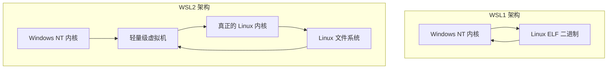
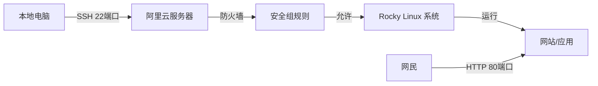

+++
title = "第3章：选择与安装 Linux"
weight = 30
date = "2026-03-23T08:39:00+08:00"
type = "docs"
description = ""
isCJKLanguage = true
draft = false
+++

# 第三章：选择与安装 Linux

## 3.1 虚拟机 vs 实体机 vs 云服务器：各种安装方式的优缺点对比

俗话说的好，"工欲善其事，必先利其器"。在学习 Linux 这条不归路上，你第一步要做的决定，不是选哪个发行版，不是背哪个命令，而是——**你要把 Linux 装在哪儿**？

这个选择，会直接影响你的学习体验、钱包厚度、甚至你老妈看你整天对着电脑的眼神。

下面我们就来一场"安装位置大比拼"，看看虚拟机、实体机、云服务器这三位选手，各有什么看家本领。

---

### 什么是虚拟机？

**虚拟机（Virtual Machine，VM）** 简单来说就是"在一台电脑里，用软件模拟出另一台电脑"。

你可以把它想象成：你家里有一栋房子（实体机），你在房子里隔出了好几个透明隔间（虚拟机），每个隔间里都可以住不同的"租客"（操作系统）。这些租客彼此不知道隔壁住的是谁，还以为自己独占了一整栋房子。

实现虚拟机的软件有很多，比如 **VMware Workstation**、**VirtualBox**、**Hyper-V** 等等。它们就是在你的 CPU 上玩"障眼法"的高手，让你的操作系统产生"幻觉"，以为自己有独立的硬件。

---

### 什么是实体机？

**实体机（Bare Metal）** 就是把 Linux 直接装在真实的物理硬件上，没有软件这层"中介"。

这相当于你买了一栋新房子，然后直接搬进去住。所有的地板、墙壁、窗户都是真的，没有隔间，没有虚拟化层，一切都是"原汁原味"。

---

### 什么是云服务器？

**云服务器（Cloud Server）** 就是别人帮你准备好了一台电脑（物理服务器），然后通过互联网把这台电脑"租"给你。你可以在上面安装 Linux，然后通过远程连接来操控它。

这就好比你出差时住的酒店公寓——你不需要买房子，只需要花钱租一个房间，拎包入住。水电网络都帮你配好了，你只需要关心怎么把自己的东西搬进去。

常见的云服务提供商包括：**阿里云**、**腾讯云**、**AWS**、**Google Cloud**、**Azure** 等等。

---

### 三位选手同台竞技

下面用一张表来总结三者的优缺点：

| 对比项 | 虚拟机 | 实体机 | 云服务器 |
|--------|--------|--------|----------|
| **安装难度** | ⭐ 简单 | ⭐⭐⭐ 复杂 | ⭐ 简单 |
| **成本** | 💰 免费（软件免费） | 💰💰 买电脑的钱 | 💰💰 每月付费 |
| **性能** | 🚗 打了个九折 | 🚀 满血发挥 | 🚗 看配置，通常是九折 |
| **隔离性** | 🔒 互不影响 | 🔒 完全独立 | 🔒 互不影响 |
| **学习硬件** | ❌ 学不到 | ✅ 真枪实弹 | ❌ 学不到 |
| **便携性** | 📦 复制粘贴就走 | 🚚 重度依赖硬件 | 🌍 随时随地访问 |
| **搞坏系统的代价** | 😈 一键还原 | 😱 重装系统 | 😈 重装系统 |
| **24小时运行** | ❌ 电脑得开着 | ❌ 电脑得开着 | ✅ 真正的服务器 |

---

### 适用人群分析

**🎮 虚拟机选手——适合你吗？**

如果你是学生党、上班族、只是想玩 Linux 试试水的小白，虚拟机是你的**最佳选择**。

理由？便宜（基本免费）、安全（搞坏了可以一键还原）、方便（同一台电脑同时跑 Windows 和 Linux），而且不需要你有多余的电脑。

用虚拟机学 Linux，就像在游泳池里学游泳——淹不死，但该学的动作都能学到。

---

**🖥️ 实体机选手——适合你吗？**

如果你是个"原教旨主义者"，追求最高性能，想真正了解硬件和系统的每一个细节，或者你手里有一台旧电脑不想浪费，那实体机是**你的归宿**。

实体机装 Linux，就像是野外生存——没有安全网，没有一键还原，但你能够真正理解系统的每一个血管和神经。

不过要注意，实体机安装有"翻车"风险，一不小心可能把 Windows 也带走了……（做好备份！）

---

**☁️ 云服务器选手——适合你吗？**

如果你想体验"当管理员"的快感，或者想学习服务器运维、搭建网站、部署项目，云服务器是**首选**。

云服务器的好处是：只要你有一台能上网的电脑，全世界都是你的机房。24小时运行，不关机，不吵不闹，不占你家里的空间。

缺点嘛……就是你要花钱，而且对于完全不会 Linux 的小白来说，"远程操控"这一步本身就有点门槛。

---

### 笔者的建议

**新手推荐：虚拟机** — 最安全、最省钱、最灵活。一台电脑走天下，Windows 和 Linux 双宿双飞。

**进阶推荐：云服务器** — 当你熟悉了基本操作，想体验"我是管理员"的快感时，花十几块钱买台云服务器玩玩，搭建个博客、跑个脚本，体验一把"云计算"的感觉。

**骨灰级推荐：实体机** — 真正爱 Linux 的人，最终都会有一台自己的"Linux 原生机"。那时候你就会开始嫌弃虚拟机性能损耗，开始享受"原生"带来的快感。

---

### 一句话总结

> 虚拟机是"安全牌"，云服务器是"进阶牌"，实体机是"信仰牌"。
>
> 选哪张，看你钱包和勇气。

---

## 3.2 VMware Workstation Pro 安装 Ubuntu 全过程（图文步骤）

VMware Workstation Pro 是啥？它是 VMware 公司出品的虚拟机软件，堪称虚拟机领域的"宝马奔驰"。功能强大，稳定性好，就是……要钱（个人用户可以申请免费试用，但商用可得乖乖掏钱）。

不过对于学习来说，VMware 绝对是"香饽饽"级别的存在。下面我们就手把手教你，从下载到安装，从创建虚拟机到跑起 Ubuntu，一条龙服务！

---

### 3.2.1 下载 VMware Workstation

首先，你得去把 VMware Workstation Pro 弄到手。

**下载地址：** [https://www.vmware.com/products/workstation-pro.html](https://www.vmware.com/products/workstation-pro.html)

进入官网后，找"Download Workstation Pro"按钮，点击它，会让你登录或注册 VMware 账号。别慌，注册个账号又不收钱，填填表单就行。

**版本选择：**

- **Windows 用户**下载 `.exe` 安装包
- **Linux 用户**下载 `.bundle` 安装包

下载完成后，你会得到一个看起来像 `VMware-workstation-full-17.x.x.exe` 的文件（版本号可能不同，这很正常，软件更新比手机系统还勤快）。

---

### 3.2.2 创建新虚拟机

安装好 VMware 之后，打开它，你会看到这么一个界面：

```
┌─────────────────────────────────────────────────────────┐
│                                                         │
│         🖥️  VMware Workstation Pro                     │
│                                                         │
│   ┌──────────────┐  ┌──────────────┐  ┌──────────────┐  │
│   │              │  │              │  │              │  │
│   │  创建新      │  │  打开现有    │  │  快速安装    │  │
│   │  虚拟机      │  │  虚拟机      │  │  虚拟机      │  │
│   │              │  │              │  │              │  │
│   └──────────────┘  └──────────────┘  └──────────────┘  │
│                                                         │
└─────────────────────────────────────────────────────────┘
```

点击**"创建新虚拟机"**（或者按快捷键 `Ctrl + N`），VMware 就会带你进入"新建虚拟机向导"——一个让你一步步配置虚拟机的神奇流程。

---

### 3.2.3 选择客户机操作系统

向导第一步，问你："客官，你想装什么系统呀？"

这里有两个选项：

- **典型（推荐）** — VMware 帮你自动选参数，你只管下一步
- **自定义（高级）** — 你自己折腾各项参数，适合"老司机"

新手建议选**典型**，因为 VMware 的自动配置已经挺靠谱了。

接下来，选择你下载好的 Ubuntu ISO 文件：

```
┌─────────────────────────────────────────────────────────┐
│  安装客户机操作系统                                     │
│                                                         │
│  ○ 安装程序光盘                                         │
│  ○ 安装程序光盘映像文件(ISO)  ← 选这个！               │
│    [浏览(B)...]                                         │
│                                                         │
│  Ubuntu 安装映像路径: C:\Users\你的用户名\Downloads\    │
│                      ubuntu-22.04-desktop-amd64.iso     │
│                                                         │
└─────────────────────────────────────────────────────────┘
```

点击"浏览"按钮，找到你之前下载好的 Ubuntu ISO 文件，选中它，点"下一步"。

VMware 会自动检测到你给的是 Ubuntu 系统，填上虚拟机名称，比如 `Ubuntu-22.04-Test`。

---

### 3.2.4 分配处理器和内存

这一页是重点！处理器（CPU）和内存（RAM）怎么分配，决定了你的虚拟机跑起来是"纵享丝滑"还是"幻灯片展览"。

**处理器分配建议：**

| 你的电脑配置 | 建议分配给虚拟机 |
|--------------|------------------|
| 4核CPU + 8G内存 | 2核 + **4G内存**（能用，但有点卡） |
| 8核CPU + 16G内存 | 4核 + **8G内存**（推荐配置） |
| 16核CPU + 32G内存 | 8核 + **16G内存**（纵享丝滑） |

**内存分配建议：**

- Ubuntu 桌面版官方最低要求是 4G内存，但 4G 真的只能用来看幻灯片——开个浏览器就卡成PPT
- **8G是舒适区**，可以流畅运行 GNOME 桌面 + 浏览器 + IDE
- **16G是豪华区**，可以同时开多个虚拟机、跑 Docker、编译代码
- 别贪心！别把全部内存都给虚拟机，不然宿主机（你的 Windows）可能会蓝屏给你看
- 💡 **血泪教训**：如果你只有 8G 内存，建议给虚拟机 4G，留 4G 给 Windows；如果你有 16G，可以给虚拟机 8G，两边都舒服

```
┌─────────────────────────────────────────────────────────┐
│  虚拟机硬件配置                                         │
│                                                         │
│  处理器:  [2] 核  (你的电脑有 8 核)                    │
│                                                         │
│  内存:    [4096] MB  (建议范围: 2048 - 8192 MB)         │
│                                                         │
│  ⚠️ 分配的内存将从此主机可用内存中扣除                  │
│                                                         │
└─────────────────────────────────────────────────────────┘
```

拖动滑块或者直接输入数字，分配好了点"下一步"。

---

### 3.2.5 配置网络

网络配置这一步，一般选默认的"使用网络地址转换(NAT)"就行。

**NAT 是什么鬼？**

简单说就是：你的虚拟机通过你的 Windows 的网络身份上网。虚拟机和 Windows 在同一个"局域网"里，但外面的设备不知道虚拟机的存在，它只知道"哦，是 Windows 在上网"。

这种模式适合大多数场景：上网、下载东西、更新系统都没问题。

如果你想虚拟机像一台真实电脑一样被外界访问（比如搭网站），那就选"桥接模式"——这个我们后面再讲。

---

### 3.2.6 创建磁盘

这一步让你选择磁盘类型和大小。

**磁盘类型：**

- **NVMe** — 固态硬盘专用，速度飞快，如果你的电脑是 SSD，选这个
- **SATA** — 传统接口，兼容性好，老电脑或者机械硬盘选这个

**磁盘大小：**

Ubuntu 桌面版本身 20G 就够，但考虑到你要装软件、存文件、下载各种东西，建议**至少给 60G**。

如果你硬盘空间够大，给 100G 也不过分——反正虚拟机磁盘文件会"按需增长"，你分配 100G 不代表立刻占用 100G，它会随着你的使用慢慢变大。

```
┌─────────────────────────────────────────────────────────┐
│  指定磁盘容量                                           │
│                                                         │
│  最大磁盘大小(GB): [  60  ]                           │
│                                                         │
│  ○ 将磁盘存储为单个文件  ← 推荐，搬家方便              │
│  ○ 将磁盘拆分成多个文件                                 │
│                                                         │
│  当前分配: 60 GB (动态扩展)                            │
│                                                         │
└─────────────────────────────────────────────────────────┘
```

选"单个文件"，点"下一步"。

---

### 3.2.7 挂载 ISO 镜像

等等，上一步不是已经选了 ISO 文件吗？怎么还要挂载？

别慌，之前在 3.2.3 选 ISO 是"预设"，现在这一步是"正式挂载"——相当于把光盘放进光驱。

在 VMware 主界面，找到你刚创建的虚拟机 `Ubuntu-22.04-Test`，选中它，然后点"编辑虚拟机设置"。

在弹出的窗口里，找到"CD/DVD (SATA)"，选择"使用 ISO 映像文件"，再次浏览找到你的 Ubuntu ISO，点确定。

```
┌─────────────────────────────────────────────────────────┐
│  虚拟机设置                                             │
│                                                         │
│  设备           状态                                    │
│  ─────────────  ─────────                              │
│  内存           4 GB                                    │
│  处理器         2 核                                    │
│  硬盘(SCSI)     60 GB                                  │
│  CD/DVD (SATA)  使用 ISO 映像文件: ubuntu-22.04...iso  │
│  网络适配器     NAT                                    │
│  USB 控制器     已连接                                  │
│  声卡           自动检测                               │
│  显示器         自动检测                               │
│                                                         │
└─────────────────────────────────────────────────────────┘
```

好了，现在虚拟机已经准备好了，就等着开机安装 Ubuntu 了！

---

### 3.2.8 安装 Ubuntu 步骤

终于到了最激动人心的时刻！点击 VMware 里那个绿色的"启动"按钮 ▶️，虚拟机就要开机了！

由于我们挂载了 Ubuntu ISO，虚拟机启动后会从"虚拟光盘"启动，直接进入 Ubuntu 的安装界面。

**第一步：欢迎页面**

你会看到一个欢迎界面，左边有一排语言选择。往下滑，找到"中文（简体）"，点"安装 Ubuntu"。

**第二步：键盘布局**

默认是"汉语"，直接点"继续"就行。如果你用的是特殊键盘（比如机械键盘换了键帽），可以点"检测键盘"自己测试一下。

**第三步：安装选项**

这里有两个选项：

```
┌─────────────────────────────────────────────────────────┐
│  ○ 最小安装                                             │
│    仅安装浏览器、基本工具                               │
│  ● 正常安装                                             │
│    安装浏览器、工具、办公软件、游戏等  ← 选这个！      │
│                                                         │
│  ☑ 安装时下载更新         ← 勾选，省时间               │
│  ☑ 安装第三方软件...      ← 勾选，支持更多格式         │
│                                                         │
└─────────────────────────────────────────────────────────┘
```

**第四步：安装类型**

这里有两个重要选项：

- **清除整个磁盘并安装 Ubuntu** — 虚拟机只有一块虚拟磁盘，所以放心选这个，数据无价的虚拟机版本！
- **其他选项** — 手动分区，给老司机准备的

新手直接选第一个，然后点"现在安装"。

弹出确认框，点"继续"。

**第五步：设置用户和密码**

这一步你要创建一个账户：

```
┌─────────────────────────────────────────────────────────┐
│  Who are you?                                          │
│                                                         │
│  你的名字:     [李明]                                  │
│                                                         │
│  计算机名称:   [ubuntu-test]  ← 主机名                │
│                                                         │
│  输入用户名:   [liming]      ← 登录用的用户名         │
│                                                         │
│  输入密码:     [********]                              │
│  确认密码:     [********]                              │
│                                                         │
│  ○ 登录时需要密码                                      │
│  ○ 自动登录              ← 服务器选这个，桌面选上面   │
│                                                         │
└─────────────────────────────────────────────────────────┘
```

填完了点"继续"，就开始安装了！

**第六步：喝杯咖啡等着**

安装过程大概 5-15 分钟，看你电脑配置和分配的硬件资源而定。中间会显示一些幻灯片，介绍 Ubuntu 的特色功能，可以看看，也可以跳过。

**第七步：安装完成！**

安装结束后，会提示你"安装完成，请重启"。点"现在重启"。

重启后，你会看到 Ubuntu 的登录界面——输入你刚才设置的密码，敲回车！

```
┌─────────────────────────────────────────────────────────┐
│                                                         │
│                    🐧 Ubuntu 22.04 LTS                  │
│                    Welcome to Ubuntu!                   │
│                                                         │
│                    [  李明  ]                           │
│                    [ ●●●●●● ]                           │
│                                                         │
│                    [Sign In]                           │
│                                                         │
└─────────────────────────────────────────────────────────┘
```

恭喜你！🎉 Ubuntu 安装成功！现在你已经是 Linux 用户了！

---

### 小结

恭喜你完成了 VMware 虚拟机的搭建和 Ubuntu 的安装！现在你已经拥有了一台运行在 Windows 里的 Linux 电脑。VMware 的虚拟机就像是一个"沙盒"，你可以随便折腾，就算把系统玩坏了，大不了删掉重来，不会影响你宝贵的 Windows。

**记住以下关键点：**

1. 处理器和内存别分配太多，留点给宿主系统
2. 网络用 NAT 模式基本够用
3. 磁盘大小看需求，但 60G 是起步线
4. 安装时记得挂载 ISO 文件
5. 装完 Ubuntu 后，第一件事是先换国内源、更新系统！

现在，拿起你的鼠标（或者键盘），开始在 Linux 的世界里探险吧！🚀

---

## 3.3 VirtualBox 安装 Ubuntu（免费开源虚拟机）

如果说 VMware Workstation 是虚拟机界的"宝马"，那 **VirtualBox** 就是"自行车"——不要钱，还能到处骑！

VirtualBox 是 Oracle（甲骨文）公司出品的开源虚拟机软件，完全免费，跨平台（Windows、macOS、Linux 都能用），体积小，功能全。对于不想花钱、或者学生党来说，VirtualBox 绝对是"真香警告"。

这一节我们就来用 VirtualBox 把 Ubuntu 装起来，整个过程和 VMware 类似，但细节略有不同，且听我细细道来。

---

### VirtualBox 下载与安装

**下载地址：** [https://www.virtualbox.org/wiki/Downloads](https://www.virtualbox.org/wiki/Downloads)

进入官网，你会看到：

```
┌─────────────────────────────────────────┐
│  VirtualBox 7.x.x  platform packages   │
│                                         │
│  ● Windows  hosts    ← Windows用户点这个 │
│  ● macOS / Intel   hosts               │
│  ● Linux  hosts                          │
│                                         │
│  Plus:  Extension Pack (可选，USB等支持) │
│                                         │
└─────────────────────────────────────────┘
```

点击 "Windows hosts" 下载安装包（约 100MB），下载完双击运行安装。

**安装注意事项：**

- 安装过程中会提示安装"虚拟网卡"，点"是"同意
- 如果杀毒软件报警，放行即可
- 安装完会要求重启电脑，别心疼，点重启

---

### 新建虚拟机

打开 VirtualBox，主界面长这样：

```
┌─────────────────────────────────────────────────────────┐
│            🟢 Oracle VM VirtualBox 管理器                │
│                                                         │
│   [新建(N)]    [设置(S)]    [启动(T)]    [删除(D)]     │
│                                                         │
│   名称              系统           内存      状态       │
│   ───────────────────────────────────────────────────  │
│   (空的，还没有任何虚拟机)                              │
│                                                         │
└─────────────────────────────────────────────────────────┘
```

点击**"新建"**按钮，弹出新建虚拟机向导。

---

### 配置虚拟机参数

**第一步：起个名字**

名称随便起，比如 `MyUbuntu`，然后类型选 `Linux`，版本选 `Ubuntu (64-bit)`。

> ⚠️ 如果你没看到 64-bit 选项，说明 CPU 虚拟化没开。重启电脑，进 BIOS，找到 Virtualization Technology 或 VT-x，Enable 一下。

**第二步：分配内存**

VirtualBox 默认推荐 1024MB（1GB）。但对于 Ubuntu 桌面版来说，1GB 属于"勉强能用"级别。

建议分配：

| 你的电脑内存 | 建议分配给 VirtualBox |
|--------------|----------------------|
| 8GB | 4096 MB（4GB） |
| 16GB | 8192 MB（8GB） |

拖动滑块或者直接输入数字。

**第三步：创建虚拟硬盘**

选"现在创建虚拟硬盘"，点"创建"。

硬盘文件类型选 **VDI（VirtualBox 磁盘映像）**，点"下一步"。

磁盘存储方式选"动态分配"（空间用多少占多少，不是一次性吃满），点"下一步"。

磁盘大小给 **60GB** 或更多，点"创建"。

---

### 挂载 Ubuntu ISO

虚拟机建好了，但还缺"启动盘"——也就是 Ubuntu 的 ISO 文件。

在 VirtualBox 主界面，选中你刚创建的虚拟机 `MyUbuntu`，点**"设置"**按钮（或者右键 → 设置）。

在设置窗口里，找到**"存储"**选项卡：

```
┌─────────────────────────────────────────────────────────┐
│  存储控制器: SATA (IDE)                    [选中它]   │
│    ├─ MyUbuntu.vdi              固态硬盘    60 GB     │
│    ├─ [光盘图标: 空的]          ← 光驱是空的！        │
│                                                         │
│  属性 ────────────────                                  │
│  盘片: [ IDE 主通道: 0 ]                                │
│                                                         │
└─────────────────────────────────────────────────────────┘
```

点击那个"[光盘图标: 空的]"，右边会显示"属性"面板。

点"分配光盘"右边的光盘图标 🔽，选择"选择一个虚拟光盘文件..."，找到你下载好的 Ubuntu ISO 文件。

```
┌─────────────────────────────────────────────────────────┐
│  分配光盘 / 虚拟光盘                                     │
│  ────────────────────────                               │
│  [🔽 分配光盘: 选择虚拟光盘文件...]                      │
│                                                         │
│  当前虚拟机光盘: ubuntu-22.04-desktop-amd64.iso        │
│                                                         │
└─────────────────────────────────────────────────────────┘
```

点"OK"保存设置。

---

### 启动虚拟机！

回到 VirtualBox 主界面，选中 `MyUbuntu`，点那个大大的**"启动"** ▶️ 按钮。

虚拟机窗口弹出来了！经过短暂的加载，你会看到 Ubuntu 的安装界面——和 VMware 里的一模一样！接下来的安装步骤就参照 3.2.8 节即可，这里不再赘述。

---

### VirtualBox 增强工具（推荐安装）

虚拟机装好后，有一件事强烈建议你做：**安装 VirtualBox 增强功能**。

这相当于给虚拟机装"显卡驱动"和"分辨率自适应工具"，让你的虚拟机：

- 支持自动调整分辨率（窗口拖大拖小，Ubuntu 桌面跟着变）
- 支持共享剪贴板（Windows 和 Ubuntu 之间复制粘贴文字）
- 支持文件夹共享（Windows 和 Ubuntu 之间传文件）

**安装方法：**

在 Ubuntu 虚拟机里，点击顶部菜单的**"设备" → "安装增强功能"**。

桌面上会出现一个光盘图标，双击它，终端会自动弹出，运行：

```bash
# 安装增强功能（需要 root 权限）
# 注意：VBox_GAs_7.x.x 中的版本号需要换成实际看到的
sudo bash /media/$USER/VBox_GAs_7.x.x/runasroot.sh
```

> ⚠️ 记得把 `VBox_GAs_7.x.x` 换成实际看到的文件夹名字（版本号可能不同）。

安装完后，重启虚拟机：

```bash
sudo reboot
```

重启后，增强功能就生效了！

---

### VirtualBox vs VMware 怎么选？

| 对比项 | VirtualBox | VMware Workstation Pro |
|--------|------------|------------------------|
| **价格** | 💰 免费！ | 💰💰 收费（个人免费试用） |
| **体积** | 📦 约 100MB | 📦📦 约 500MB |
| **功能** | 基本够用 | 更专业、功能更多 |
| **性能** | 略逊于 VMware | 稍好一点 |
| **跨平台** | ✅ Windows/macOS/Linux | Windows/Linux 更多 |
| **上手难度** | ⭐ 简单 | ⭐⭐ 稍复杂 |

**选谁？**

- 穷学生、临时用用 → **VirtualBox**
- 专业开发、长期使用 → **VMware**
- 两个都装，互补使用也行 😏

---

### 小结

VirtualBox 是一个功能齐全、完全免费的好工具。用它来安装 Ubuntu，再合适不过了。整个过程和 VMware 类似，但因为不要钱，所以格外香。

**记住以下关键点：**

1. CPU 虚拟化没开先去 BIOS 开启
2. 内存分配 **8GB 是舒适区**，4GB 只能看幻灯片
3. 装完系统记得装增强功能，分辨率和剪贴板就靠它了
4. 遇到问题善用搜索引擎，你遇到的问题 99% 别人都遇到过

好了，现在你已经掌握了两大虚拟机的安装方法，出去吹牛有资本了！🐂

---

## 3.4 WSL2 在 Windows 上运行 Linux（推荐初学者，最简单）

如果说虚拟机是"模拟了一台电脑"，那 **WSL2** 就是在 Windows 里直接长出了一个 Linux！

**WSL** 的全称是 **Windows Subsystem for Linux**，翻译成人话就是"Windows 里的 Linux 子系统"。它不是虚拟机，不是容器，而是 Windows 和 Linux 融合的产物——Linux 内核直接跑在 Windows 上，两套系统共享同一个硬盘，互通有无。

WSL2 是 WSL 的升级版，最大的区别是：**WSL1 是"翻译层"，WSL2 是"真内核"**。WSL2 用真正的 Linux 内核，性能比 WSL1 强了不止一个档次，而且兼容性更好。

这一节我们从零开始，把 WSL2 装好，让你 Windows 里直接跑 Ubuntu！

---

### 3.4.1 启用 WSL 功能

WSL2 不是 Windows 默认开启的功能，你需要手动"解锁"它。

**方法一：PowerShell（推荐）**

右键点击 Windows 开始菜单，选择"终端（管理员）"或"PowerShell（管理员）"。

> ⚠️ 一定要用管理员权限打开！不然会报错"权限不够"。

在终端里输入以下命令，敲回车：

```powershell
# Windows 10 2004+ 和 Windows 11 用户专用，一条命令搞定一切
wsl --install
```

这条命令会自动：启用 WSL 功能、启用虚拟机平台、下载 Ubuntu Linux 内核更新包。命令跑完会提示你重启电脑，重启完再打开 Microsoft Store 安装 Ubuntu 即可。

**方法二：控制面板**

如果命令行让你害怕，可以去控制面板折腾：

1. 打开"控制面板" → "程序" → "启用或关闭 Windows 功能"
2. 找到"适用于 Linux 的 Windows 子系统"（WSL），勾选
3. 找到"虚拟机平台"，也勾选
4. 点确定，Windows 会自动安装相关组件
5. 重启电脑

```
┌─────────────────────────────────────────────────────────┐
│  Windows 功能                                            │
│                                                         │
│  ☑ 适用于 Linux 的 Windows 子系统     ← 必选           │
│  ☑ 虚拟机平台                        ← WSL2 必选       │
│  ☐ Windows 沙盒                                    │
│  ☐ Hyper-V                                          │
│                                                         │
└─────────────────────────────────────────────────────────┘
```

---

### 3.4.2 安装 WSL2 内核更新包

如果你用的是 Windows 10，老版本的 WSL2 可能需要手动安装内核更新包。Windows 11 用户基本不需要这一步，可以跳过。

**下载地址：** [https://docs.microsoft.com/zh-cn/windows/wsl/wsl2-kernel](https://docs.microsoft.com/zh-cn/windows/wsl/wsl2-kernel)

下载 `wsl_update_x64.msi` 安装包，双击运行安装即可。

这个更新包的作用是：给 WSL2 配备最新的 Linux 内核，让它跑得更快更稳。

---

### 3.4.3 安装 Ubuntu

WSL 功能启用后，安装 Ubuntu 就简单得不能再简单了。

**方法一：Microsoft Store（图形界面）**

打开 Microsoft Store，搜索"Ubuntu"，你会看到好几个版本：

```
┌─────────────────────────────────────────────────────────┐
│  Microsoft Store - Ubuntu                               │
│                                                         │
│  ┌─────────────────────────────────────────────────┐   │
│  │ 🟢 Ubuntu 22.04.1 LTS                           │   │
│  │     官方发行版，推荐长期支持版本                 │   │
│  └─────────────────────────────────────────────────┘   │
│                                                         │
│  ┌─────────────────────────────────────────────────┐   │
│  │ 🔵 Ubuntu 20.04.5 LTS                           │   │
│  │     稳定版，版本稍旧                            │   │
│  └─────────────────────────────────────────────────┘   │
│                                                         │
│  ┌─────────────────────────────────────────────────┐   │
│  │ 🟡 Ubuntu (滚动版)                               │   │
│  │     紧跟潮流，版本最新                          │   │
│  └─────────────────────────────────────────────────┘   │
│                                                         │
└─────────────────────────────────────────────────────────┘
```

点"获取"或"安装"，下载完点"启动"。

**方法二：命令行（一行命令）**

打开 PowerShell（管理员），输入：

```powershell
# 安装 Ubuntu（最新版）
# 注意：wsl --install 不指定 -d 时，默认安装 Ubuntu
wsl --install

# 安装指定版本（Ubuntu-22.04）
wsl --install -d Ubuntu-22.04

# 查看所有可用的发行版
wsl --list --online
# 或简写：wsl -l -o
```

> 💡 **默认行为**：`wsl --install` 不指定 `-d` 参数时，**默认安装 Ubuntu**。如果你想安装其他发行版（如 Debian、openSUSE），需要用 `-d` 参数指定，或者从 Microsoft Store 安装。

然后回车，等着下载安装完成。

---

### 第一次启动 Ubuntu

安装完成后，第一次启动 Ubuntu 会让你设置用户名和密码：

```
Installing, this may take a few minutes...
Please create a default UNIX user account. For more information
visit: https://aka.ms/wslusers

Enter new UNIX username: liming
New password:
Retype new password:
```

**用户名规则：**

- 必须小写
- 不能有空格和特殊字符
- 不能是 root、admin 这种系统保留名

设置完用户名和密码，你就正式进入了 Ubuntu 的世界！🎉

```
liming@DESKTOP-XXXXXX:~$
```

这个提示符的意思是：

| 部分 | 含义 |
|------|------|
| `liming` | 当前用户名 |
| `@` | "在" |
| `DESKTOP-XXXXXX` | 电脑名（Windows 电脑名） |
| `:` | 分隔符 |
| `~` | 当前目录（`~` 代表 home 目录） |
| `$` | 普通用户提示符（root 用户是 `#`） |

---

### 3.4.4 WSL2 与 WSL1 的区别

WSL1 和 WSL2 虽然名字差不多，但"内心"完全不一样。

**架构对比：**



**关键区别：**

| 对比项 | WSL1 | WSL2 |
|--------|------|------|
| **运行方式** | Linux 二进制系统调用翻译 | 真正的 Linux 内核虚拟机 |
| **性能（文件系统）** | ✅ 快（直接访问 Windows 文件） | ⚠️ 跨系统访问稍慢 |
| **性能（系统调用）** | ❌ 慢（需要翻译） | ✅ 快（原生系统调用） |
| **Docker 支持** | ❌ 不支持 | ✅ 支持 |
| **Linux 内核版本** | 旧（微软维护的翻译层） | ✅ 跟上游同步更新 |
| **内存占用** | 较少 | 较多（运行完整内核） |
| **启动速度** | 🚀 几秒 | 🚀 几秒（比以前快多了） |

**怎么选？**

- 如果你只是运行命令行工具、写代码、跑脚本 → **WSL2**
- 如果你需要频繁访问 Windows 文件、追求文件系统跨平台访问速度 → **WSL1**
- 但说实话，现在 WSL2 已经很成熟了，**无脑选 WSL2 就对了**

**切换 WSL1/WSL2 的方法：**

```powershell
# 查看已安装的 WSL 发行版及其版本
wsl -l -v

# NAME                   STATE           VERSION
# Ubuntu                 Running         2
# Ubuntu-20.04           Stopped         1

# 把 Ubuntu 从 WSL1 升级到 WSL2
wsl --set-version Ubuntu 2

# 把 Ubuntu 从 WSL2 降级到 WSL1
wsl --set-version Ubuntu 1
```

---

### WSL2 的实用技巧

**1. 在 Windows 文件管理器里访问 Linux 文件**

打开文件管理器，在地址栏输入：

```
\\wsl$
```

或者直接输入 `\\wsl$\Ubuntu\home\liming`，就能看到 Linux 的文件目录了。

**2. 在 Ubuntu 里访问 Windows 文件**

Windows 的硬盘挂载在 `/mnt/` 目录下：

```bash
# 访问 Windows C 盘
ls /mnt/c

# 访问 Windows D 盘（如果有）
ls /mnt/d

# 访问 Windows 桌面
ls /mnt/c/Users/你的用户名/Desktop
```

**3. 在 Windows 终端里快速打开 WSL**

在 Windows 资源管理器的地址栏输入 `wt` 回车，当前目录就会在 Windows Terminal 里以 WSL 打开。

**4. 配置 WSL2 的内存和 CPU**

WSL2 默认会占用 Windows 的一半资源，有时候显得有点"贪心"。可以创建一个 `.wslconfig` 文件来限制它：

```bash
# 在 Windows 用户目录下创建配置文件
# C:\Users\你的用户名\.wslconfig
```

文件内容：

```ini
[wsl2]
# 限制 WSL2 最多使用 4GB 内存
memory=4GB

# 限制 WSL2 最多使用 2 个 CPU
processors=2

# 禁用 swap（如果内存够用的话）
swap=0

# 给 /mnt 分配更多缓存，提升性能
nestedVirtualization=false
```

改完保存，在 PowerShell 里重启 WSL：

```powershell
wsl --shutdown
```

然后再打开 Ubuntu，配置就生效了。

---

### WSL2 vs 虚拟机，选哪个？

| 对比项 | WSL2 | VMware/VirtualBox |
|--------|------|-------------------|
| **安装难度** | ⭐ 一个命令搞定 | ⭐⭐ 要下载 ISO、配置虚拟机 |
| **资源占用** | 🚀 轻量级 | 📦 较重（独立操作系统） |
| **图形界面** | ⚠️ 需要额外配置 X Server | ✅ 原生支持 |
| **Linux 体验** | 命令行为主 | 完整桌面体验 |
| **与 Windows 互通** | ✅ 极其方便 | ⚠️ 需要配置共享文件夹 |
| **学习价值** | 中等 | 高（完整系统） |

**结论：**

- **纯命令行学习者** → WSL2，又快又省事
- **想学桌面环境、玩桌面软件** → VMware/VirtualBox 完整虚拟机
- **都想学** → 两个都装，不冲突 😏

---

### 小结

WSL2 是 Windows 和 Linux 融合的最佳代表。一个命令就能装好，不需要下载 ISO，不需要配置虚拟机，直接就有了一个可以跑绝大多数 Linux 命令的环境。

**核心要点：**

1. Windows 10/11 用户用 `wsl --install` 一行搞定
2. WSL2 是真正的 Linux 内核，性能更强
3. Ubuntu 安装后第一次启动要设用户名密码
4. WSL2 和虚拟机各有优势，可以都用

WSL2 让"在 Windows 里学 Linux"变得前所未有的简单。如果你不想折腾虚拟机，又想体验 Linux 的命令行魅力，WSL2 绝对是你的首选！

---

## 3.5 在 VirtualBox 中安装 CentOS/Rocky Linux

学完了 Ubuntu，我们来点不一样的口味：**CentOS** 和 **Rocky Linux**！

这两个是啥？为什么突然冒出来两个没听过的名字？

别急，让我慢慢道来。

---

### 先来聊聊 CentOS 和 Rocky Linux 的"江湖恩怨"

**CentOS** 是一个基于 RHEL（Red Hat Enterprise Linux）的社区版 Linux 发行版。简单来说，Red Hat 卖企业级 Linux 系统，CentOS 就是它的"免费开源版"——代码一样，只是没有商业支持。

CentOS 一直是服务器领域的"香饽饽"，因为稳定、文档丰富、生态成熟。然而……

**2020年，CentOS 突然宣布"转型"：**

- CentOS Linux 8 → 2021年底停止维护
- CentOS Stream → 成为滚动发布版，不再是稳定版

这消息一出，服务器圈炸锅了！很多人辛辛苦苦学的 CentOS，一夜之间变成了"弃子"。

就在这个历史性时刻，**Rocky Linux** 应运而生！

**Rocky Linux** 是 CentOS 创始人 Gregory Kurtzer 牵头搞的项目，目标是"做一个完全兼容 RHEL 的免费社区版"。Rocky 是创始人名字的延续（Gregory Kurtzer → Rocky），和"致敬 RHEL"没有直接关系——只是两个名字恰好都带"y"而已 😄

简单来说：

- **CentOS Stream** ≈ 摸着石头过河的试验版
- **Rocky Linux** ≈ 原汁原味的 RHEL 克隆版

对于学习服务器管理、运维、部署来说，Rocky Linux 是目前最接近 RHEL 的选择，也是最有"安全感"的选择。

---

### 下载 Rocky Linux ISO

**下载地址：** [https://rockylinux.org/download](https://rockylinux.org/download)

Rocky Linux 提供了多个版本：

| 版本 | 适用场景 |
|------|----------|
| **DVD ISO** | 完整安装包，离线安装，体积大（约 10GB） |
| **Minimal ISO** | 最小化安装，只有命令行，体积小（约 2GB） ✅ 推荐 |
| **Boot ISO** | 网络安装，需要网络引导 |

新手推荐下载 **Minimal ISO**，省时省力。

同样，如果你想要 CentOS（Stream 版），去 [https://www.centos.org/centos-stream/](https://www.centos.org/centos-stream/) 下载。

---

### 创建 VirtualBox 虚拟机（和 Ubuntu 类似，但有区别）

打开 VirtualBox，点"新建"，配置参数：

| 参数 | 建议值 |
|------|--------|
| **名称** | RockyLinux-9 |
| **类型** | Linux |
| **版本** | Red Hat (64-bit) |
| **内存** | 2048 MB（服务器版不需要显卡，吃内存少） |
| **硬盘** | 60GB，动态分配，VDI |

创建完虚拟机后，在"设置 → 存储"里挂载下载好的 Rocky Linux Minimal ISO（参照 3.3 节的挂载方法）。

---

### 开始安装 Rocky Linux

启动虚拟机，进入安装界面。

**第一步：选择安装介质**

你会看到一个菜单：

```
┌────────────────────────────────────────────┐
│  Install Rocky Linux 9                    │
│  Test this media & install Rocky Linux 9  │
│  Troubleshooting                          │
└────────────────────────────────────────────┘
```

选第一个 `Install Rocky Linux 9`，回车。

**第二步：选择语言**

选"中文（简体）"，点"继续"。

**第三步：安装摘要（重点！）**

这个页面是 Rocky Linux 安装的核心，各种设置都在这里：

```
┌─────────────────────────────────────────────────────────┐
│  安装信息摘要                                            │
│                                                         │
│  📍 本地化 ────────────────────────────                   │
│     键盘布局        [汉语]              [完成]          │
│     语言支持        [中文（简体）]      [完成]          │
│     时间日期        [亚洲/上海]         [完成]          │
│                                                         │
│  💻 系统 ─────────────────────────────────               │
│     安装目标        [自动分区]           [完成]          │
│     网络和主机名    [以太网 enp0s3]      [完成]          │
│                                                         │
│  ⚙️ 软件 ─────────────────────────────────               │
│     安装源        [本地介质]            [完成]          │
│     软件选择      [最小安装] ← 推荐     [完成]          │
│                                                         │
│  🔧 系统 ─────────────────────────────────               │
│     KDUMP         [已启用]               [完成]          │
│     安全策略      [标准]                [完成]          │
│                                                         │
│  👤 用户设置 ────────────────────────────                 │
│     Root 密码     [设置]                [完成]          │
│     用户创建      [创建用户]            [完成]          │
│                                                         │
│  ⏹️ 开始安装                                    [完成]  │
│                                                         │
└─────────────────────────────────────────────────────────┘
```

重点说说几个关键设置：

---

### 安装目标：磁盘分区

默认是"自动分区"，Rocky 会自动给你分好 swap、boot、root 三个区。对于新手来说，自动就够了。

如果你想手动分区（进阶操作），点进去可以看到：

```
┌─────────────────────────────────────────────────────────┐
│  存储配置                                                │
│                                                         │
│  ○ 自动          Rocky 自动为你分区                     │
│  ● 自定义        自己动手，丰衣足食                     │
│  ○ 高级          极客专属                               │
│                                                         │
└─────────────────────────────────────────────────────────┘
```

建议新手选"自动"，省心省力。

---

### 网络和主机名

找到"网络和主机名"，点进去：

- 把以太网开关拨到"ON"——不开网络等于没联网的服务器
- 主机名改成你喜欢的名字，比如 `rocky-server`

点"完成"。

---

### 软件选择

这里是重点！Rocky Linux 安装时会让你选"预装哪些软件"。

```
┌─────────────────────────────────────────────────────────┐
│  软件选择                                               │
│                                                         │
│  基环境 ────────────                                   │
│  ─────────────────────                                 │
│  ○ 服务器（带 GUI）    带图形界面，耗资源              │
│  ● 服务器              命令行，纯爷们 ✅ 推荐          │
│  ○ 最小安装            最精简，适合高手                  │
│  ○ 自定义操作系统      自己选                           │
│                                                         │
└─────────────────────────────────────────────────────────┘
```

既然是学 Linux 服务器，选 **"服务器"** 就好，命令行优先，图形界面等需要再加。

---

### Root 密码和用户创建

- **Root 密码**：相当于 Windows 的 Administrator，超级管理员。设置一个强密码（Rocky Linux 对 root 密码有复杂度要求，6位以上、要有大小写和数字）
- **创建用户**：建议也创建一个普通用户，平时用这个登录，sudo 提权

```
┌─────────────────────────────────────────────────────────┐
│  Root 密码                                              │
│  ─────────────────                                       │
│  新密码：    [●●●●●●●●●]                               │
│  确认密码：  [●●●●●●●●●]                               │
│                                                         │
│  [完成]                                                 │
└─────────────────────────────────────────────────────────┘
```

---

### 开始安装！

所有配置点"完成"后，下方会出现一个"开始安装"按钮，点它！

安装过程大概 5-10 分钟，你可以在旁边看到实时进度：

```
正在安装：
[████████████████████████████░░░░░░░░] 75%
正在配置软件包...
正在安装引导装载程序...
```

安装结束后，点"重启系统"。

---

### 首次登录 Rocky Linux

重启后，你会看到黑底白字的命令行：

```
Rocky Linux 9.1 (Blue Onyx)
Kernel 5.14.0-162.6.1.el9_1.x86_64 on an x86_64

rocky-server login: _
```

输入你创建的用户名，回车，再输入密码（输入时屏幕不显示字符，正常的，盲打就行）。

登录成功！

```
[liming@rocky-server ~]$
```

看到 `$` 提示符，恭喜你！Rocky Linux 服务器版已经跑起来了！🎉

---

### Rocky Linux vs Ubuntu：服务器版对比

| 对比项 | Rocky Linux | Ubuntu Server |
|--------|-------------|----------------|
| **血缘** | RHEL 克隆 | Debian 衍生 |
| **软件包格式** | RPM + DNF/YUM | DEB + APT |
| **包管理器** | `dnf` | `apt` |
| **更新频率** | 慢而稳（RHEL 风格） | 快而新 |
| **适用场景** | 企业服务器 | 通用服务器 |
| **学习难度** | 稍难（文档稍少） | 简单（社区庞大） |
| **生产环境** | 🏢 企业首选 | 🚀 互联网公司爱用 |

---

### 常用命令对比（Ubuntu vs Rocky）

| 操作 | Ubuntu | Rocky (RHEL系) |
|------|--------|----------------|
| 安装软件 | `apt install nginx` | `dnf install nginx` |
| 更新软件 | `apt update && apt upgrade` | `dnf update` |
| 删除软件 | `apt remove nginx` | `dnf remove nginx` |
| 搜索软件 | `apt search nginx` | `dnf search nginx` |
| 启动服务 | `systemctl start nginx` | `systemctl start nginx` |
| 防火墙放行 | `ufw allow 80/tcp` | `firewall-cmd --add-port=80/tcp --permanent` |

---

### 小结

Rocky Linux 是 CentOS 的"精神续作"，如果你想学企业级 Linux 运维，Rocky Linux 是目前最接近 RHEL 的免费选择。

安装过程和 Ubuntu 类似，但软件包管理器是 `dnf` 而不是 `apt`，这是两大门派的核心区别之一。

**记住以下关键点：**

1. Rocky Linux 基于 RHEL，稳定性优先
2. 安装时选"服务器"基环境，命令行起步
3. 不要忘记开启网络（以太网拨到 ON）
4. dnf 是 RHEL 系的包管理器，和 apt 用法类似
5. 登录后第一件事：`dnf update` 更新系统

好了，现在你手里有了 Ubuntu 和 Rocky Linux，两大门派都玩过了，视野打开了！🌟

---

## 3.6 阿里云服务器购买与连接

好，现在我们要来点"真格"的——买一台云服务器！

云服务器是什么？就是你花钱租一台 24 小时不关机的电脑，放在别人的机房里，通过网络远程操控它。你不需要担心硬件损坏、不需要担心停电、不需要担心风扇吵，整个互联网就是你的机房。

**阿里云**是国内最大的云服务商之一，学生价便宜到几块钱一个月，是入门服务器运维的绝佳选择。

这一节我们就手把手教你：注册账号 → 买服务器 → 配置安全组 → 远程连接，全程实战！

---

### 3.6.1 阿里云官网注册与实名认证

**官网地址：** [https://www.aliyun.com/](https://www.aliyun.com/)

打开官网，右上角有"免费注册"按钮。如果你有淘宝账号或支付宝账号，可以直接扫码登录——阿里系的东西，一家人不说两家话。

**实名认证**是必须的一步，不然买不了服务器。好在支付宝一键认证，填个信息、扫个脸就搞定了，速度飞快。

---

### 3.6.2 创建 ECS 实例

登录阿里云控制台后，搜索框输入"ECS"，点击进入云服务器 ECS 管理页面。

**第一步：选择购买页**

点击"创建实例"或"前往购买"：

```
┌─────────────────────────────────────────────────────────┐
│  云服务器 ECS - 创建实例                                 │
│                                                         │
│  付费方式 ────────────                                  │
│  ─────────────────────                                 │
│  ● 包年包月    ← 长期使用选这个，便宜                   │
│  ○ 按量付费    ← 用多少付多少，适合临时测试            │
│                                                         │
│  实例规格 ────────────                                  │
│  ─────────────────────                                 │
│  架构：☐ x86_64   ☑ ARM                               │
│  类别：☑ 计算型  ☐ 通用型  ☐ 内存型                   │
│  规格：ecs.t5-lc2m1.large (2核1G) ← 学生级入门        │
│                                                         │
│  镜像 ──────────────────                               │
│  操作系统：☑ 公共镜像  Rocky Linux 9.3 x64             │
│  版本：    9.3                                        │
│                                                         │
│  存储：    高效云盘  40GB   √                         │
│                                                         │
└─────────────────────────────────────────────────────────┘
```

**选型建议（学生/个人学习）：**

| 配置项 | 推荐选择 |
|--------|----------|
| **付费方式** | 包年包月（便宜，学生有优惠） |
| **地域** | 选择离你最近的地域（如华东上海） |
| **实例规格** | 1核2G 或 2核2G 够用 |
| **操作系统** | Rocky Linux 9 / Ubuntu 22.04 LTS |
| **存储** | 40GB 高效云盘起步 |

> 💡 学生可以去阿里云"云翼计划"看看，1核2G的服务器一个月只要 9.9 元，简直是白菜价！

**第二步：网络和安全组**

- **网络**：默认专有网络就行
- **安全组**：这个很重要，后面单独讲

**第三步：确认订单并支付**

检查一下配置，看看总价是多少，然后点"立即购买"，用支付宝/微信/银行卡支付。

支付成功后，你的服务器就在创建中了，一般 1-3 分钟就能创建完成！

---

### 3.6.3 安全组配置

安全组是阿里云的"防火墙"，决定哪些端口可以对外访问。

**为什么重要？**

假如你的服务器是一栋大楼，安全组就是大楼的门禁系统。你开放哪个端口，外面的人就能通过哪个端口进来访问你的服务。端口没开，外面的人就进不来——但有时候你会把自己也锁在外面。

**登录阿里云控制台 → ECS → 安全组 → 配置规则**

默认安全组里可能只开放了 SSH 端口（22）。如果需要跑网站，需要开放 HTTP（80）和 HTTPS（443）端口。

**添加安全组规则：**

```
┌─────────────────────────────────────────────────────────┐
│  快速添加规则                                            │
│                                                         │
│  勾选：☑ HTTP (80)   ☑ HTTPS (443)   ☑ SSH (22)      │
│                                                         │
│  方向：入方向                                            │
│  协议：TCP                                              │
│  端口范围：80/80                                        │
│  授权对象：0.0.0.0/0  ← 所有人可访问                   │
│                                                         │
└─────────────────────────────────────────────────────────┘
```

> ⚠️ 如果你只想让自己的电脑连SSH，可以把 `0.0.0.0/0` 改成你的电脑 IP 地址（查询方法：百度搜"我的IP地址"）。这样别人就无法SSH连接你的服务器了。

---

### 3.6.4 Xshell 远程连接

服务器买好了，现在要远程连接上去操作。

**Xshell** 是一款 Windows 上的 SSH 客户端软件，免费用于家庭/学校，功能强大、界面美观、连接稳定，是服务器运维的必备神器。

**下载地址：** [https://www.netsarang.com/en/xshell/](https://www.netsarang.com/en/xshell/)（下载家庭/学校免费版）

安装完 Xshell，打开它，开始创建连接：

**第一步：新建会话**

点击菜单栏的"文件 → 新建"，填入以下信息：

```
┌─────────────────────────────────────────────────────────┐
│  会话属性                                               │
│                                                         │
│  名称：       [阿里云 Rocky 服务器]                     │
│  协议：       [SSH]                                     │
│                                                         │
│  主机：       [你的服务器公网IP]  ← 阿里云控制台找     │
│  端口号：     [22]                                      │
│                                                         │
└─────────────────────────────────────────────────────────┘
```

服务器的公网 IP 在哪里找？阿里云控制台 → ECS → 实例，找到你的实例，复制"公网 IP"列的地址。

**第二步：填写用户名密码**

点击左侧"用户身份验证"：

```
┌─────────────────────────────────────────────────────────┐
│  方法：       [Password]                               │
│  用户名：     [root]     ← 服务器的用户名              │
│  密码：       [●●●●●●●●]  ← 你设置的 root 密码        │
│                                                         │
└─────────────────────────────────────────────────────────┘
```

点"确定"保存。

**第三步：连接！**

在会话列表里双击你的连接，Xshell 会弹出一个窗口询问"是否保存主机密钥"，点"接受并保存"。

然后——

```
Connecting to 你的服务器IP:22...
Connection established.
Escape character is '^]'.

Welcome to Rocky Linux 9.1 (Blue Onyx)
Kernel 5.14.0-162.6.1.el9_1.x86_64 on an x86_64

root@你的服务器名:~#
```

看到 `#` 提示符了吗？！恭喜你！你已经成功登录你的云服务器了！🎉

---

### 玩转你的云服务器

现在你面对的是一台真正的远程服务器，和虚拟机里的 Linux 比起来，这台服务器是真的在互联网上运行的，任何人都可以访问它（前提是你开放了端口）。

**先做几件必做的事：**

**1. 更新系统**

```bash
# Rocky Linux / CentOS 系统更新命令
dnf update -y
```

**2. 创建一个普通用户（别总用 root！）**

```bash
# 创建一个叫 liming 的用户
useradd liming

# 给 liming 设置密码
passwd liming
# 输入新密码两次

# 给 liming 添加 sudo 权限（这样 liming 可以临时提权）
usermod -aG wheel liming
```

**3. 用新用户登录 SSH**

之后连接 SSH 时，用普通用户 `liming` 登录，需要提权时用 `sudo` 命令。

```bash
# 以 liming 身份登录后，安装软件需要加 sudo
sudo dnf install nginx -y

# 系统会要求输入 liming 的密码，输入后就能以 root 权限执行了
```

**4. 安装宝塔面板（可选）**

如果你不想记命令，想用图形界面管理服务器，可以安装**宝塔面板**：

```bash
# 一键安装宝塔面板（Rocky Linux）
yum install -y wget && wget -O install.sh https://download.bt.cn/install/install_6.0.sh && sh install.sh
```

安装完成后，访问 `http://你的服务器IP:8888`，用面板给的账号密码登录，就可以用图形界面管理服务器了。

---

### 一张图看明白：本地电脑 → 云服务器 → 网站



---

### 小结

阿里云服务器是学习 Linux 服务器运维的绝佳途径。花几块钱租一台真实的在线服务器，体验一把"当网管"的感觉。

**记住以下关键点：**

1. 学生有优惠，去"云翼计划"看看
2. 安全组是防火墙，端口没开放 = 服务访问不了
3. Xshell 是 SSH 客户端，连接格式：`ssh 用户名@服务器IP`
4. 不要总是用 root 登录，创建一个普通用户，用 sudo 提权
5. 玩坏了不怕，可以重新初始化磁盘（阿里云控制台有这功能）

好了，现在你有了一台真正的云服务器，可以搭建博客、部署代码、玩各种骚操作了！互联网上从此多了一台属于你的 Linux 服务器，想想就激动！🚀☁️

---

## 3.7 腾讯云服务器购买与连接

阿里云搞定了，腾讯云自然也不能落下！

**腾讯云**是国内第二大云服务商，和阿里云是"老对手"。价格、服务、配置都差不多，对于学习来说，哪个便宜用哪个，没有绝对的好坏之分。

这一节我们快速过一遍腾讯云的购买和连接流程，很多地方和阿里云类似，我会重点讲讲不一样的地方。

---

### 腾讯云官网注册

**官网地址：** [https://cloud.tencent.com/](https://cloud.tencent.com/)

右上角点"免费注册"或"登录"，支持微信扫码登录——腾讯系的产品，微信就是通行证，省去了记密码的烦恼。

实名认证同样是必须的，微信扫码授权即可完成认证，速度比阿里云还快那么一丢丢。

---

### 创建云服务器（轻量应用服务器 vs CVM）

腾讯云的服务器分两类，容易让人犯迷糊：

| 类型 | 全称 | 特点 |
|------|------|------|
| **轻量应用服务器** | Lighthouse | 便宜、开箱即用、自带应用镜像 |
| **云服务器 CVM** | Cloud Virtual Machine | 自由度高、可自定义一切 |

**选哪个？**

- 新手/学生党 → **轻量应用服务器**，自带宝塔面板、WordPress 等镜像，点几下鼠标就能跑起一个网站
- 进阶用户 → **CVM**，自由折腾

我们以轻量应用服务器为例：

**第一步：选择配置**

进入 [https://cloud.tencent.com/product/lighthouse](https://cloud.tencent.com/product/lighthouse)，点"立即选购"。

```
┌─────────────────────────────────────────────────────────┐
│  轻量应用服务器选购                                     │
│                                                         │
│  应用镜像 ────────────                                  │
│  ─────────────────────                                 │
│  ● Rocky Linux 9.0 (推荐)  ← 服务器选这个             │
│  ○ Ubuntu 22.04 LTS                                   │
│  ○ CentOS Stream 9                                     │
│  ○ 宝塔Linux面板 (BT-Panel)                           │
│  ○ WordPress 应用镜像                                  │
│                                                         │
│  地域：     [上海]  ← 离你近就好                       │
│  实例套餐： [2核2G - 60GB SSD - 流量包 800GB/月]     │
│                                                         │
│  购买时长： [1年]  ¥ 328/年（活动价）                 │
│                                                         │
└─────────────────────────────────────────────────────────┘
```

**第二步：设置登录方式**

腾讯云支持两种登录方式：

```
┌─────────────────────────────────────────────────────────┐
│  登录方式                                               │
│                                                         │
│  ○ 立即关联密钥                                        │
│     自动生成密钥对，下载私钥文件 🔑                    │
│     优点：安全、方便（不用记密码）                     │
│     缺点：第一次要配置密钥，稍微麻烦                  │
│                                                         │
│  ● 设置密码                                            │
│     用户名：root                                       │
│     密码：    [●●●●●●●●●]  ← 简单粗暴                │
│                                                         │
└─────────────────────────────────────────────────────────┘
```

**选择建议：** 新手选"设置密码"，简单直接。等熟悉了再去研究密钥登录也不迟。

**第三步：确认购买，支付**

点"立即购买"，支付宝/微信/银行卡支付，完成！

---

### 找到服务器 IP 地址

支付成功后，去控制台找你的服务器：

腾讯云控制台 → 轻量应用服务器 → 找到你的实例，复制公网 IP。

```
┌─────────────────────────────────────────────────────────┐
│  实例 ID    实例名称     IP地址         状态          │
│  ──────────────────────────────────────────────────── │
│  lhins-xxx  Rocky-Server 49.xx.xx.123  运行中        │
│                                                         │
└─────────────────────────────────────────────────────────┘
```

---

### 安全组配置

腾讯云也有安全组，叫法不同但原理一样：**控制哪些端口可以被外界访问**。

进入"防火墙"标签页：

```
┌─────────────────────────────────────────────────────────┐
│  防火墙规则                                             │
│                                                         │
│  规则名称    策略   协议   端口    来源                │
│  ──────────────────────────────────────────────────── │
│  SSH (22)    允许   TCP    22      0.0.0.0/0          │
│  HTTP (80)   允许   TCP    80      0.0.0.0/0          │
│  HTTPS (443) 允许   TCP    443     0.0.0.0/0          │
│  全部拒绝    拒绝   全部   全部    0.0.0.0/0 ← 默认   │
│                                                         │
│  [+ 添加规则]                                          │
│                                                         │
└─────────────────────────────────────────────────────────┘
```

默认只开放了 22 端口（SSH），如果需要跑网站，记得添加 80（HTTP）和 443（HTTPS）端口的规则。

---

### 用 Xshell 连接腾讯云

连接方法和阿里云一模一样！

打开 Xshell → 新建会话：

```
┌─────────────────────────────────────────────────────────┐
│  会话属性                                               │
│                                                         │
│  名称：       [腾讯云 Rocky 服务器]                     │
│  主机：       [你的腾讯云公网IP]                       │
│  端口：       [22]                                     │
│                                                         │
│  用户身份验证 ──────────────────                       │
│  用户名：     [root]                                   │
│  密码：       [你设置的密码]                          │
│                                                         │
└─────────────────────────────────────────────────────────┘
```

点确定 → 双击连接 → 看到 `#` 提示符 = 连接成功！

---

### 腾讯云 vs 阿里云：选哪个？

| 对比项 | 腾讯云 | 阿里云 |
|--------|--------|--------|
| **价格** | 💰 学生优惠，1核2G约10元/月 | 💰 学生优惠，1核2G约9.9元/月 |
| **控制台体验** | 界面清晰，新手友好 | 功能全面，稍复杂 |
| **生态整合** | 微信生态（小程序、云开发） | 淘宝/支付宝生态 |
| **安全组/防火墙** | 叫"防火墙" | 叫"安全组" |
| **客服支持** | 工单+电话 | 工单+电话+在线客服 |
| **知名度** | 腾讯撑腰 | 阿里撑腰 |

**结论：** 价格差不多，哪个有优惠用哪个，不用纠结！

---

### 腾讯云特有的好东西：密钥登录

腾讯云支持密钥对登录，比密码登录更安全。创建方法：

**第一步：创建密钥**

控制台 → 轻量应用服务器 → 密钥 → 创建密钥

```
┌─────────────────────────────────────────────────────────┐
│  创建密钥                                               │
│                                                         │
│  密钥名称：  [my-rocky-key]                            │
│  加密方式：  ○ 自动生成密钥对  ← 推荐                │
│              ○ 使用已有公钥                           │
│                                                         │
└─────────────────────────────────────────────────────────┘
```

点"创建"，系统会自动生成公钥，并让你**下载私钥文件**（`.pem` 文件）。

> ⚠️ 私钥文件只能下载一次！一定要保存好！丢了就没了！

**第二步：关联密钥到服务器**

创建完密钥后，在实例列表里，勾选你的服务器 → 更多操作 → 绑定密钥。

**第三步：在 Xshell 里使用密钥登录**

打开 Xshell → 新建会话 → 点击左侧"用户身份验证"：

```
┌─────────────────────────────────────────────────────────┐
│  方法：       [Public Key]                             │
│  用户名：     [root]                                   │
│  用户密钥：                                           │
│     浏览(B)... → 找到你的 .pem 私钥文件              │
│  密钥密码：   [如果设置了的话]                        │
│                                                         │
└─────────────────────────────────────────────────────────┘
```

这样就告别密码登录了，SSH 连接更加安全！

---

### 小结

腾讯云和阿里云在购买和配置上非常相似，最大的区别在于生态和操作界面。

**记住以下关键点：**

1. 轻量应用服务器适合新手，CVM 适合进阶用户
2. 防火墙规则控制端口访问，80 和 443 别忘了开
3. 腾讯云支持密钥登录，安全性更高
4. 腾讯云控制台整体体验比较清爽，菜单逻辑清晰

有了两朵"云"（阿里云和腾讯云）的使用经验，你在云计算领域就算是真正入门了！以后不管去哪家云计算公司，原理都是相通的——云计算的核心就是：别人帮你管电脑，你通过网络控制它。☁️🐧

---

## 3.8 AWS EC2 实例创建与连接

国际范儿来了！**AWS**（Amazon Web Services）是全球最大的云服务平台，亚马逊出品，在全球多个区域提供服务，是云计算领域的"老大哥"。

> 💡 **区域数量说明**：AWS 的区域数量在不断增加，建议访问 [AWS Global Infrastructure](https://aws.amazon.com/about-aws/global-infrastructure/) 查看最新信息。

如果你想学国际化的云计算，或者以后想去外资公司/出海业务，AWS 是必修课。AWS 的 EC2（Elastic Compute Cloud）就是它的云服务器服务。

这一节我们手把手教你从零开始创建 AWS 账号、创建 EC2 实例、配置安全组、远程连接，全程图解！

---

### 3.8.1 AWS 账号创建

**官网地址：** [https://aws.amazon.com/](https://aws.amazon.com/)

点击右上角"登录/注册" → "创建 AWS 账户"。

**注册流程：**

1. **输入邮箱和密码** — 填一个你没用来注册过 AWS 的邮箱，设置账户密码
2. **验证邮箱** — AWS 会发一封验证邮件给你，点里面的链接
3. **填写联系人信息** — 选"个人账户"，填姓名、地址、电话
4. **绑定信用卡** — AWS 需要信用卡验证（不会立即扣钱，新用户有12个月免费套餐）
5. **手机验证** — 输入你的手机号，AWS 会打给你，让你输入屏幕上显示的 PIN 码
6. **选择支持计划** — 选"基本支持（免费）"就行

> 💡 **免费套餐说明**：AWS 新用户有一年期的免费套餐，包括 EC2 的 t2.micro 实例（1核1G）每月 750 小时，完全够学习使用！

---

### 3.8.2 选择 AMI（Amazon Machine Image）

登录 AWS 控制台后，搜索 "EC2"，点击进入 EC2 控制台。

**第一步：点击"启动实例"**

```
EC2 控制台

[启动实例]  ← 大按钮，一眼就能看到

快速启动 ──────
AMI 选择 ──────
  Amazon Linux    Amazon
  Ubuntu Server   Canonical
  Red Hat Enterprise Linux  Red Hat
  SUSE Linux Enterprise Server  SUSE
  Windows  Microsoft
```

选 **Ubuntu Server 22.04 LTS（64位）**，点"选择"。

---

### 3.8.3 实例类型选择

选择完 AMI，下一步选实例类型：

```
实例类型

t2.micro    1 vCPU, 1 GiB  免费套餐  ← 选这个
t2.small    1 vCPU, 2 GiB
t2.medium   2 vCPU, 4 GiB
t3.micro    2 vCPU, 1 GiB

你的免费套餐包括 t2.micro (750 小时/月)
```

选 `t2.micro`（免费），点"下一步：配置实例详情"。

---

### 3.8.4 安全组配置

和阿里云/腾讯云的安全组类似，AWS 的安全组控制端口访问。

在配置页面找到"安全组"设置：

```
安全组配置

已添加 1 条规则：

类型          协议   端口范围   来源
SSH           TCP    22        0.0.0.0/0

[添加规则]

勾选：HTTP (80)   0.0.0.0/0
勾选：HTTPS (443)  0.0.0.0/0
```

点击"添加规则"，手动添加：

- **类型**：HTTP，端口 80，来源 0.0.0.0/0
- **类型**：HTTPS，端口 443，来源 0.0.0.0/0

点"审核和启动"。

---

### 3.8.5 密钥对创建

这是 AWS 最"香"的地方——密钥对登录！AWS 会帮你生成一个公钥，你下载私钥文件（`.pem`），之后 SSH 连接就用这个私钥。

**第一次创建密钥对？**

```
创建密钥对

○ 选择现有密钥对（如果你之前创建过）
● 创建新密钥对  ← 选这个

密钥对名称：aws-rocky-key
密钥类型：RSA
私钥格式：.pem (适用于 Linux/macOS/Windows)
```

输入密钥对名称（比如 `aws-rocky-key`），点"下载密钥对"。

> ⚠️ 私钥文件只能下载一次！下载后保存好，不要丢失！不要上传到 GitHub！不要给任何人！

点击"启动实例"！

---

### 3.8.6 使用 PuTTY 连接

AWS 默认的密钥格式是 `.pem`（Linux/macOS 用），Windows 用户常用 PuTTY 连接，需要先把 `.pem` 转换成 PuTTY 能认的 `.ppk` 格式。

**下载 PuTTY 和 PuTTYgen：** [https://www.chiark.greenend.org.uk/~sgtatham/putty/](https://www.chiark.greenend.org.uk/~sgtatham/putty/)

**第一步：用 PuTTYgen 转换密钥**

1. 打开 `PuTTYgen`
2. 点击"Load"，找到你的 `.pem` 文件
3. 点"Save private key"，保存为 `.ppk` 文件

**第二步：用 PuTTY 连接 EC2**

1. 打开 PuTTY
2. 主机名填：`ubuntu@你的EC2公网IP`

```
PuTTY Configuration

主机名：ubuntu@ec2-54-123-45-67.compute-1.amazonaws.com
端口：22
连接类型：SSH

左侧分类 → Connection → SSH → Auth
  Private key file for authentication:
  [Browse...] → 选择你的 .ppk 文件
```

点"打开"，第一次连接会弹出安全警告，点"是"。

成功登录后，你会看到：

```
Welcome to Ubuntu 22.04.1 LTS (GNU/Linux 5.15.0-1028-aws x86_64)

ubuntu@ip-172-31-xx-xx:~$
```

> 💡 **注意默认用户名**：
> - **Ubuntu AMI**：默认用户是 `ubuntu`
> - **Amazon Linux AMI**：默认用户是 `ec2-user`
> - **CentOS/RHEL AMI**：默认用户是 `ec2-user` 或 `root`
> 
> 连不上？先检查一下你是不是用错用户名了！这是新手最容易踩的坑之一。

---

### 小结

AWS EC2 是全球最流行的云服务器服务，EC2 实例创建流程和国内云厂商类似，但安全组、密钥对等概念是相通的。

**记住以下关键点：**

1. 新用户有一年免费套餐，t2.micro 每月 750 小时
2. 安全组控制端口，22/80/443 记得按需开放
3. 密钥对要保存好，丢了找不到，AWS 不会帮你保管
4. Windows 用户用 PuTTY 需要把 .pem 转成 .ppk
5. EC2 默认用户是 `ubuntu`，不是 `root`

AWS 学好了，以后去外企/出海业务/跨境电商，都能派上用场！🌍🚀

---

## 3.9 物理机安装：单系统直接安装

虚拟机玩腻了？云服务器玩够了？现在我们来点更刺激的——**物理机安装**。

物理机安装就是在一台真实的电脑上装 Linux，没有任何虚拟化层，系统直接跑在硬件上。这才是 Linux 的"原教旨"玩法！

这一节先讲最简单的：**单系统直接安装**——电脑上只有 Linux，没有 Windows，没有 macOS，干干净净。

---

### 准备工作

**1. 备份重要数据！**

装系统有风险，操作不当可能丢失硬盘上所有数据。提前把重要文件拷贝到外接硬盘或云盘。

**2. 下载 Ubuntu 桌面版 ISO**

去 [https://ubuntu.com/download/desktop](https://ubuntu.com/download/desktop) 下载最新的 Ubuntu 桌面版 ISO 文件（大约 4GB）。

**3. 制作启动U盘**

你需要一个小工具把 ISO 写入 U 盘，让电脑从 U 盘启动安装：

| 工具 | 平台 | 下载地址 |
|------|------|----------|
| **Rufus** | Windows | https://rufus.ie |
| **Etcher** | Windows/macOS/Linux | https://www.balena.io/etcher |
| **dd 命令** | Linux/macOS | 终端直接用 |

以 Rufus 为例（Windows 用户最常用）：

1. 插入 U 盘（至少 4GB）
2. 打开 Rufus
3. 设备选你的 U 盘
4. 引导类型选"磁盘或 ISO 镜像" → 点"选择"找到你的 Ubuntu ISO
5. 分区方案选"GPT"（UEFI 电脑）或 "MBR"（BIOS 电脑）
6. 点击"开始"

> ⚠️ U 盘会被格式化！里面所有数据都会消失！

Linux 或 macOS 用 dd 命令：

```bash
# 假设 U 盘设备名为 /dev/sdX（注意不要写错！）
sudo dd if=ubuntu-22.04-desktop-amd64.iso of=/dev/sdX bs=4M status=progress
```

**4. 设置 BIOS 启动顺序**

把电脑关机，插入 U 盘，开机时按 `F2`/`F12`/`Del`（不同电脑按键不同）进入 BIOS 设置界面。

找到 "Boot Order" 或 "启动顺序"，把 USB 设备拖到第一位，保存退出。

---

### 开始安装

电脑从 U 盘启动后，会进入 Ubuntu 的试用/安装界面。

**第一步：选择语言**

选"中文（简体）"，点"安装 Ubuntu"。

**第二步：键盘布局**

默认就行，直接"继续"。

**第三步：连接网络**

插网线或者连 Wi-Fi。Ubuntu 安装过程中可能会下载更新，建议连上。

**第四步：安装类型**

```
安装类型

清除磁盘并安装 Ubuntu  ← 单系统选这个！
其他选项（手动分区）
清除整个磁盘并加密（安全但麻烦）
使用 LVM（高级分区管理）

在新安装的 Ubuntu 旁边安装 Windows（或别的）
  ← 双系统才勾这个！单系统不勾！
```

单系统安装，直接选"清除磁盘并安装 Ubuntu"。

**第五步：设置时区**

地图上点中国区域，或者搜"Shanghai"，确认后点"继续"。

**第六步：创建用户**

```
Who are you?

你的名字：    [李明]
计算机名称：  [ubuntu-pc]  ← 主机名
用户名：      [liming]      ← 登录用
密码：        [●●●●●●●]

登录时需要密码
自动登录              ← 私人电脑可以选这个
```

**第七步：等待安装**

安装过程 10-20 分钟，中途不要断电。喝杯茶，看看 Ubuntu 的介绍幻灯片。

**第八步：重启！**

安装完成后，系统会让你重启。拔掉 U 盘，电脑从硬盘启动。

看到 Ubuntu 桌面了吗？！🎉 恭喜你！Linux 已经驻扎在你的真电脑上啦！

---

### 小结

物理机装 Linux 是每个 Linux 爱好者迟早要过的一关。单系统安装最简单，适合当"第一跳"。

**核心要点：**

1. 备份重要数据！
2. 用 Rufus/Etcher 制作启动 U 盘
3. BIOS 里设置 U 盘为第一启动项
4. 单系统选"清除磁盘并安装 Ubuntu"
5. 安装完拔 U 盘，从硬盘启动

物理机 Linux 跑起来，那叫一个"纵享丝滑"——没有虚拟化层的性能损耗，所有的 CPU、内存、显卡都是你的！😎

---

## 3.10 物理机安装：Windows + Linux 双系统

单系统装过了，现在来点更刺激的：**Windows + Linux 双系统**。

双系统的意思是一台电脑装两个系统，启动时可以选择进入哪个。和虚拟机不同，双系统的两个系统都是"原生"运行，没有虚拟化性能损耗。

---

### 3.10.1 磁盘分区：预留未分配空间

双系统安装的第一步，不是装系统，而是**给 Linux 留空间**。

Windows 系统下，按 `Win + X`，选择"磁盘管理"。

找到你的主硬盘（C盘），右键 → "压缩卷"：

```
压缩 C:

压缩前的总大小：    500 GB
压缩空间输入：      100000  MB  ← 约 100 GB
压缩后总计：        400 GB

[压缩]
```

输入你想给 Linux 的空间大小（建议 60-100 GB），点"压缩"。

压缩完成后，硬盘上会出现一块"未分配空间"——这就是 Linux 的地盘了！

> ⚠️ 只压缩 C 盘，别动其他分区！压缩量不要超过剩余可用空间！

---

### 3.10.2 使用 U 盘制作启动盘

和单系统安装一样，用 Rufus 或 Etcher 把 Ubuntu ISO 写入 U 盘（参照 3.9 节的方法）。

**特别注意：Rufus 里要选"GPT"分区格式**，因为现在大多数电脑都是 UEFI 启动模式，MBR 已经过时了。

```
Rufus 设置：

设备：      [你的 U 盘]
引导类型：  [ISO 镜像] → 选择 Ubuntu
分区类型：  GPT  ← UEFI 电脑选这个
目标系统：  UEFI (非 CSM)
文件系统：  FAT32

[开始]
```

---

### 3.10.3 安装引导器

这一步非常关键！安装双系统时，**引导器（GRUB）必须装在 EFI 分区**，而不是 Linux 的根分区。否则 Windows 和 Linux 都会无法启动。

进入 Ubuntu 安装程序，到了分区那一步（选"其他选项"）：

**手动分区步骤（UEFI 模式必须）：**

1. **找到未分配空间**，点左下角"+"按钮，依次创建以下分区：

2. **EFI 系统分区**（UEFI 启动必须有！如果已经有 EFI 分区，跳过这步）：

```
分区类型：逻辑分区
空间大小：512 MB
用于：EFI 系统分区
挂载点：/boot/efi     ← 重要！别挂错了！
```

> ⚠️ 如果安装前 Windows 已经用了 UEFI 模式，你的硬盘上肯定已经有一个 EFI 分区了（通常 100-500 MB）。这种情况下**不要新建 EFI 分区**，直接在"安装引导器的设备"里选那个已有的 EFI 分区即可。新建会导致 Windows 无法启动！

3. **创建根分区**（必须）：

```
分区类型：逻辑分区
空间大小：剩余全部给 Linux
用于：EXT4 日志文件系统
挂载点：/       ← 根目录
```

4. **交换空间（可选）**：如果内存小于 8GB，可以加一个和内存一样大的 swap 分区。不过现代 Linux 通常用 swapfile，可以跳过。

5. **安装引导器的设备**：一定要选 **EFI 分区所在的硬盘**（通常是一个小分区，100-500 MB），不要选整个硬盘！

---

### 3.10.4 启动时选择系统

安装完成后，每次开机你都会看到 **GRUB 引导菜单**：

```
┌────────────────────────────────────────────┐
│  Ubuntu                                   │
│  Advanced options for Ubuntu              │
│  Windows Boot Manager (on /dev/sda1)  ← Windows │
│  System setup                            │
└────────────────────────────────────────────┘
```

- 选择"Ubuntu" → 启动 Linux
- 选择"Windows Boot Manager" → 启动 Windows

**在 Linux 里修复 GRUB（如果 Windows 升级后 GRUB 消失）：**

```bash
# 重新安装 GRUB 到 EFI 分区（/dev/sda 是硬盘，ssd1 是 EFI 分区所在位置，根据实际情况改）
sudo grub-install /dev/sda

# 更新 GRUB 菜单，让它检测到 Windows
sudo update-grub
```

> 💡 如果找不到 EFI 分区，先用 `lsblk` 或 `fdisk -l` 查看分区情况，确认哪个分区是 EFI。

---

### 双系统常见问题

**Q：安装完 Ubuntu 后，Windows 时间变差了 8 小时？**

A：因为 Linux 和 Windows 对 BIOS 时间的理解不同。在 Ubuntu 里运行：

```bash
# 让 Ubuntu 使用本地时间（和 Windows 保持一致）
timedatectl set-local-rtc 1
```

**Q：GRUB 菜单没出现，直接进了 Windows？**

A：在 Ubuntu 里运行：

```bash
# 修复 GRUB 引导
sudo update-grub
```

---

### 小结

双系统安装是物理机安装里的"进阶玩法"，难点在于分区和引导器的配置。

**记住以下关键点：**

1. 先在 Windows 里用磁盘管理压缩出未分配空间
2. 用 Rufus 制作启动盘时选 GPT 分区格式
3. UEFI 模式下引导器装在 EFI 分区，不要选整个硬盘
4. 安装完出现 GRUB 菜单，两个系统都能选

双系统的好处是：Windows 不丢，Linux 也有，两个世界一机搞定！🐟🐻

---

## 3.11 UEFI 与 BIOS 引导模式区别

在安装双系统或者折腾电脑启动时，你一定会遇到两个词：**UEFI** 和 **BIOS**。

这两个是干嘛的？它们是电脑的"启动管理器"——电脑开机后，第一个运行的程序就是它们，负责找到硬盘上的操作系统，然后把它加载起来。

---

### 3.11.1 BIOS：传统模式，MBR 分区表

**BIOS**（Basic Input/Output System）是历史悠久的固件接口，从 1980 年代就开始用了。

**特点：**

- 只支持 **MBR（Master Boot Record）** 分区表
- MBR 最大支持 2TB 硬盘，超过 2TB 的硬盘用不了
- 启动时按特定键（F2/Del）进入设置界面
- 启动速度较慢，功能有限

**MBR 分区表是什么？**

MBR 是老式的硬盘分区方式，在硬盘的第一个扇区（512字节）存储分区信息。最多只能有 4 个主分区，如果要更多，需要用"扩展分区"这个 trick。

```
MBR 分区结构：

扇区 0: 主引导记录 (446字节)
       引导代码
       分区表 (64字节, 4条记录)

最多 4 个主分区（或 3主+1扩展）
最大硬盘容量: 2 TB
```

---

### 3.11.2 UEFI：新标准，GPT 分区表，安全启动

**UEFI**（Unified Extensible Firmware Interface）是 BIOS 的继任者，2007 年推出，现在新电脑几乎全部标配 UEFI。

**特点：**

- 支持 **GPT（GUID Partition Table）** 分区表
- GPT 没有 2TB 限制，理论支持最大 18EB
- 启动速度更快，有图形界面
- 支持**安全启动（Secure Boot）**——防止恶意软件篡改引导程序
- 有独立的 EFI 分区（ESP），存储引导程序

**GPT 分区表是什么？**

GPT 是现代硬盘分区标准，不再有 4 分区的限制，可以创建最多 128 个分区。分区信息存储在硬盘开头和结尾两处，损坏一半还能恢复。

```
GPT 分区结构：

LBA 0: protective MBR (兼容性)
LBA 1: GPT 头（分区表起始信息）
LBA 2-33: 分区条目（128条）

最多 128 个主分区
最大硬盘容量: 18 EB (理论值)
双重备份（头在开头，副本在结尾）
```

---

### UEFI vs BIOS 对比

| 对比项 | BIOS | UEFI |
|--------|------|------|
| **诞生年代** | 1980s | 2007 年 |
| **分区表** | MBR | GPT |
| **最大硬盘** | 2TB | 18EB |
| **分区数量** | 最多 4 个主分区 | 最多 128 个分区 |
| **启动速度** | 慢 | 快 |
| **安全启动** | 不支持 | 支持 Secure Boot |
| **现代电脑支持** | 老机器 | 新机器（2012年后） |

---

### 安全启动（Secure Boot）是什么？

**安全启动**是 UEFI 的一个功能，会检查启动链中每个程序的"签名"。如果发现某个引导程序没有受信任的签名（比如某些恶意软件），就会拒绝启动。

大多数 Linux 发行版（如 Ubuntu、Fedora）都有微软签名，可以通过 Secure Boot。如果用的是小众 Linux 发行版，可能需要关闭 Secure Boot 才能启动。

关闭方法：进 BIOS/UEFI 设置 → 找到 "Secure Boot" → 设为 "Disabled"。

---

### 如何判断电脑是 UEFI 还是 BIOS？

**方法一：Windows 系统信息（最可靠）**

1. 按 `Win + R`，输入 `msinfo32`，回车
2. 找到右边 **"BIOS 模式"** 这一行：
   - 显示 **UEFI** → 你的电脑是 UEFI 启动
   - 显示 **Legacy** → 你的电脑是 BIOS/Legacy 启动

```
系统信息
├── BIOS 模式:      UFI        ← 看这里！
├── BIOS 版本:      American Megatrends 5.13
└── 操作系统版本:   Windows 11 22H2
```

> 💡 这个方法最准确，`msinfo32` 直接告诉你答案，一目了然。

---

**方法二：命令提示符（管理员）**

以管理员身份打开 PowerShell 或 CMD，输入：

```cmd
bcdedit /enum firmware
```

观察输出的关键信息：

- 如果看到 `Windows Boot Manager` 的 `path` 是 `bootmgfw.efi` 之类的 `.efi` 路径
- 以及 `Firmware Application` 条目里出现 **`UEFI:`** 前缀的设备描述（如 `UEFI:CD/DVD Drive`、`UEFI:Removable Device`）

以上任一出现，都说明是 **UEFI 启动**。

例如你的输出中有：
```
description UEFI:CD/DVD Drive
description UEFI:Removable Device
description UEFI:Network Device
```

这就是最直接的 UEFI 证据——固件层面已经在用 UEFI 标准枚举设备了。

---

**方法三：Linux 下判断**

如果你已经在跑 Linux（虚拟机或实体机），在终端输入：

```bash
# 如果这个目录存在，说明是 UEFI 启动
ls /sys/firmware/efi

# 如果目录不存在（报错了），说明是 BIOS/Legacy 启动
```

---

**方法四：直接看硬盘分区类型（供参考）**

在 Windows 里按 `Win + R`，输入 `diskmgmt.msc`，在磁盘上右键 → "属性" → "卷"选项卡，找到 **"分区样式"**：

- 显示 **GUID 分区表 (GPT)** → 可能是 UEFI（也可能是 GPT + Legacy BIOS）
- 显示 **主启动记录(MBR)** → BIOS/Legacy 启动

> ⚠️ 注意：这个方法有时会骗人——有些电脑用 GPT 但仍以 Legacy BIOS 模式启动。最靠谱的还是方法一的 `msinfo32`。

---

### 小结

UEFI 和 BIOS 是两种启动模式，现在新电脑基本都是 UEFI 天下了。

**记住以下关键点：**

1. UEFI 是 BIOS 的升级版，各方面都更先进
2. UEFI 必须配 GPT，BIOS 必须配 MBR，不能混用
3. 新电脑（2012年后）基本全是 UEFI，不用纠结
4. 安装双系统时，引导器要装在 EFI 分区

---

## 3.12 首次登录 Ubuntu 桌面环境

历经千辛万苦，Ubuntu 终于装好了！现在让我们来看看装完系统后都要做些什么。

---

### 3.12.1 创建用户账号

如果在安装时你已经创建了用户，这一步可以跳过。如果你想添加新用户：

```bash
# 创建一个新用户
sudo adduser liming

# 给用户添加 sudo 权限
sudo usermod -aG sudo liming
```

---

### 3.12.2 连接网络

**有线网络：** 插上网线，系统自动识别，自动联网。

**无线网络（Wi-Fi）：**

1. 点击右上角网络图标
2. 点"Wi-Fi 设置"
3. 找到你的 Wi-Fi 名字，点击，输入密码，点"连接"

> 💡 如果找不到 Wi-Fi 选项，可能是缺少无线网卡驱动。

---

### 3.12.3 系统更新

Ubuntu 装好后的第一件事：**更新系统！**

**方法一：图形界面**

点击左下角"活动"，搜索"软件更新器"，打开它，检查并安装更新。

**方法二：终端命令（推荐）**

按 `Ctrl + Alt + T` 打开终端，输入：

```bash
# 更新软件包列表
sudo apt update

# 升级所有可升级的软件包
sudo apt upgrade -y
```

---

### 配置国内镜像源（强烈推荐！）

Ubuntu 默认从国外服务器下载软件，速度感人。国内有很多镜像站，速度飞快！

**命令行修改：**

```bash
# 备份原来的源
sudo cp /etc/apt/sources.list /etc/apt/sources.list.bak

# 编辑源列表
sudo nano /etc/apt/sources.list
```

把文件内容替换成阿里云源（Ubuntu 22.04 Jammy）：

```
deb https://mirrors.aliyun.com/ubuntu/ jammy main restricted universe multiverse
deb https://mirrors.aliyun.com/ubuntu/ jammy-updates main restricted universe multiverse
deb https://mirrors.aliyun.com/ubuntu/ jammy-backports main restricted universe multiverse
deb https://mirrors.aliyun.com/ubuntu/ jammy-security main restricted universe multiverse
```

保存退出，然后：

```bash
sudo apt update
```

---

### 小结

Ubuntu 桌面版装好后，记住"三板斧"：**创建用户 → 连网 → 更新系统**。然后配置国内镜像源，之后安装软件就飞快了！

**记住以下关键点：**

1. 有线插网线，无线找 Wi-Fi 图标
2. `sudo apt update && sudo apt upgrade -y` 是更新系统的标准操作
3. 国内一定要换阿里云/清华源，速度差距 10 倍不止

---

## 3.13 最小化服务器系统安装（无图形界面）

说完了桌面版，现在来说说**服务器版**的安装。

服务器版 Linux 和桌面版有什么区别？

- **桌面版**：有漂亮的图形界面，鼠标点点就能操作
- **服务器版**：没有图形界面，全部用命令行操作，轻量、高效

---

### 3.13.1 下载 Server 版 ISO

去 Ubuntu 官网下载 Server 版 ISO：

**下载地址：** [https://ubuntu.com/download/server](https://ubuntu.com/download/server)

注意区分桌面版和服务器版：

| 版本 | 文件名特征 | 大小 |
|------|-----------|------|
| 桌面版 Desktop | `ubuntu-22.04-desktop-amd64.iso` | ~4GB |
| 服务器版 Server | `ubuntu-22.04-live-server-amd64.iso` | ~1.5GB |

---

### 3.13.2 安装选项选择

新版 Ubuntu Server（22.04）的安装是半图形化的，用键盘上下左右操作。

**安装步骤：**

1. **语言**：选 English（服务器环境用英文更通用）
2. **键盘**：选你的键盘布局，默认就行
3. **网络**：确保网卡是启用状态
4. **代理**：如果没有代理服务器，直接回车跳过
5. **镜像地址**：改成国内镜像（`https://mirrors.aliyun.com/ubuntu/`）
6. **磁盘分区**：选"使用整个磁盘"，自动分区即可
7. **用户设置**：创建你的用户名和密码
8. **SSH 服务**：这里一定要选 **Install OpenSSH server**！

```
Ubuntu Server Installer

环境配置
  OpenSSH server  ← 必装！远程连接全靠它
```

9. **安装**：点"Done"，开始安装

安装过程大约 5-10 分钟，完成后点"Reboot Now"。

---

### 3.13.3 配置静态 IP

服务器版 Ubuntu 默认用 DHCP 自动获取 IP，最好配个固定 IP，方便远程连接。

**修改 Netplan 配置（Ubuntu 22.04）：**

```bash
# 编辑网络配置文件
sudo nano /etc/netplan/00-installer-config.yaml
```

改成静态 IP（根据你的网络环境修改）：

```yaml
network:
  version: 2
  renderer: networkd
  ethernets:
    enp0s3:
      dhcp4: false
      addresses:
        - 192.168.1.100/24
      gateway4: 192.168.1.1
      nameservers:
        addresses:
          - 223.5.5.5
          - 119.29.29.29
```

> ⚠️ IP 地址段要和你家/机房的网络一致！

保存退出，然后：

```bash
# 应用新配置
sudo netplan apply

# 验证 IP
ip addr show enp0s3
```

---

### 小结

最小化服务器版安装是运维工程师的必备技能。

**记住以下关键点：**

1. 服务器版用 Server ISO，不是 Desktop ISO
2. 安装时一定要装 OpenSSH，否则无法远程连接
3. 改成国内镜像源，下载速度翻 10 倍
4. 静态 IP 通过 Netplan 配置，改完 `sudo netplan apply` 生效

---

## 本章小结

第三章我们从零开始，详细讲解了 Linux 的各种安装方式。无论你是想用虚拟机"试水"，还是买台云服务器"真枪实弹"，亦或是直接装在物理机上"原汁原味"，这一章都覆盖到了。

---

### 知识点回顾

**1. 安装方式的选择**

| 安装方式 | 推荐指数 | 适合人群 |
|----------|----------|----------|
| 虚拟机（VMware/VirtualBox） | ⭐⭐⭐⭐⭐ | 新手，零风险体验 |
| WSL2 | ⭐⭐⭐⭐ | Windows 用户，快速上手命令行 |
| 云服务器（阿里云/腾讯云/AWS） | ⭐⭐⭐⭐ | 进阶学习，真实战环境 |
| 物理机单系统 | ⭐⭐⭐ | Linux 爱好者，性能追求者 |
| 物理机双系统 | ⭐⭐⭐⭐ | 两全其美，鱼和熊掌兼得 |

**2. 关键概念扫盲**

- **虚拟机**：软件模拟的电脑，隔离性好，搞坏了可以一键还原
- **WSL2**：Windows 里的 Linux 子系统，轻量但体验有限
- **云服务器**：别人帮你管的电脑，24 小时在线，通过 SSH 远程控制
- **BIOS/UEFI**：两种启动模式，现在新电脑基本全是 UEFI
- **MBR/GPT**：两种分区表，UEFI 配 GPT，BIOS 配 MBR
- **安全组/防火墙**：控制端口开放，相当于大楼的门禁系统
- **SSH**：远程登录协议，云服务器管理必备

**3. 三大门派**

| 门派 | 代表系统 | 包管理器 | 适用场景 |
|------|----------|----------|----------|
| Debian 系 | Ubuntu、Debian | APT | 桌面、个人服务器、社区活跃 |
| RHEL 系 | Rocky Linux、CentOS、RHEL | DNF/YUM | 企业服务器、稳定优先 |
| Arch 系 | Arch Linux、Manjaro | PACMAN | 极客、滚动更新、自定义程度高 |

**4. 安装后的必做事项**

- 更新系统：`sudo apt update && sudo apt upgrade -y`（或 `dnf update`）
- 配置国内镜像源：阿里云、清华源，速度提升 10 倍
- 创建普通用户：用 `adduser` 创建，不要总是用 root
- 安装 OpenSSH：服务器版必须装，远程连接全靠它
- 配置静态 IP：服务器最好用固定 IP，方便管理

---

### 下章预告

安装好了 Linux，接下来当然要会用它！第四章我们将深入了解 **Linux 桌面环境**，从 GNOME 到 KDE，从 Xfce 到窗口管理器，让你的 Linux 不仅能用，而且用得漂亮、用得顺手！

准备好了吗？让我们继续 Linux 之旅！🚀🐧

---
