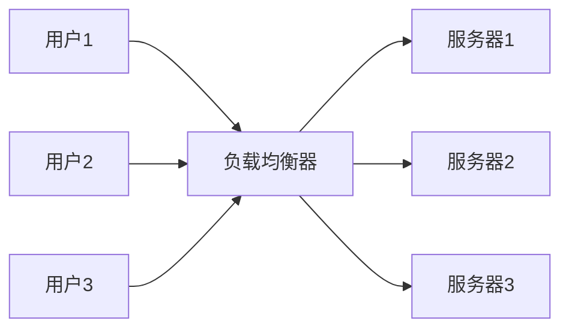
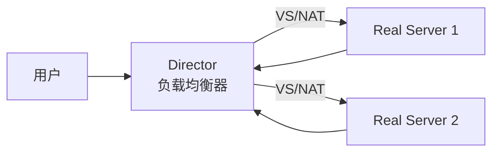
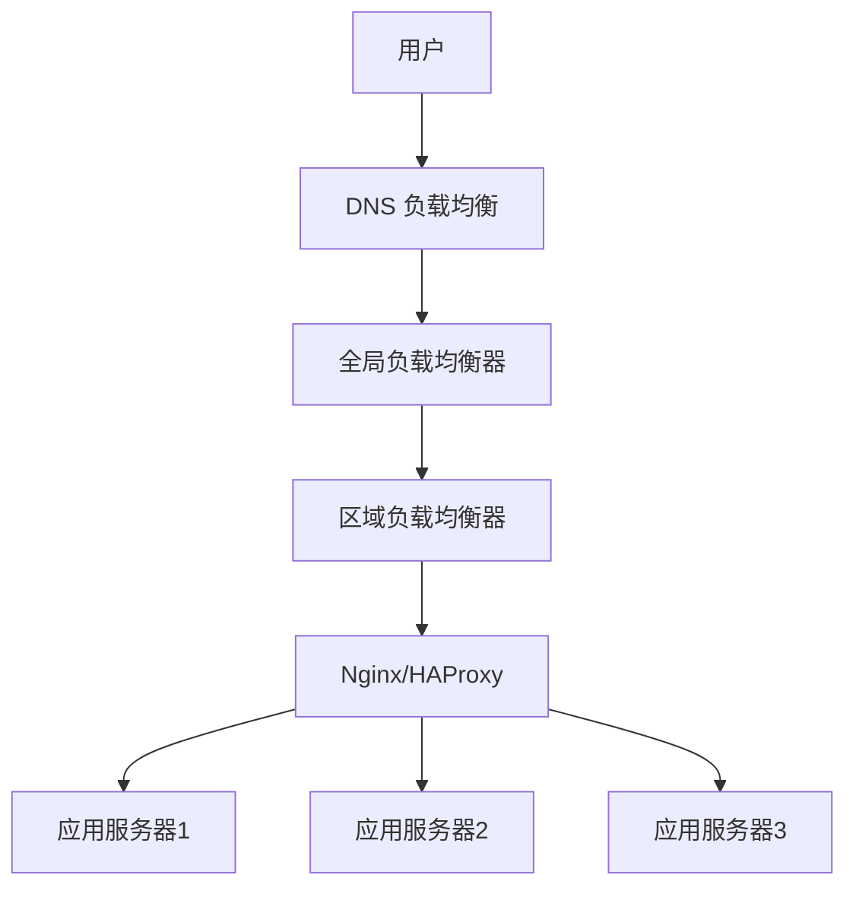

+++
title = "第63章：负载均衡"
weight = 630
date = "2026-03-24T13:18:28+08:00"
type = "docs"
description = ""
isCJKLanguage = true
draft = false
+++


# 第六十三章：负载均衡

## 63.1 Nginx 负载均衡

### 为什么需要负载均衡？

想象一下：一家餐厅只有1个厨师，生意火爆后，1个厨师做不过来，客人等太久。

**解决方案**：
1. 增加厨师数量（水平扩展）
2. 有人专门负责分配客人到不同厨师（负载均衡器）



### Nginx 负载均衡配置

```bash
# 安装 Nginx
sudo apt install nginx

# 配置负载均衡
sudo nano /etc/nginx/conf.d/upstream.conf
```

```nginx
# upstream 定义后端服务器池
upstream backend {
    # 1. 轮询（默认）
    server backend1.example.com;
    server backend2.example.com;
    server backend3.example.com;
}

# 使用 upstream
server {
    listen 80;
    server_name myapp.com;

    location / {
        proxy_pass http://backend;
        proxy_set_header Host $host;
        proxy_set_header X-Real-IP $remote_addr;
        proxy_set_header X-Forwarded-For $proxy_add_x_forwarded_for;
    }
}
```

### 负载均衡算法

```nginx
# 1. 轮询（Round Robin）- 默认
upstream backend {
    server 192.168.1.101;
    server 192.168.1.102;
    server 192.168.1.103;
}

# 2. 加权轮询（Weighted Round Robin）
upstream backend {
    server 192.168.1.101 weight=5;   # 接收5倍流量
    server 192.168.1.102 weight=3;
    server 192.168.1.103 weight=2;
}

# 3. IP 哈希（IP Hash）- 同一 IP 访问同一服务器
upstream backend {
    ip_hash;
    server 192.168.1.101;
    server 192.168.1.102;
    server 192.168.1.103;
}

# 4. 最少连接（Least Connections）
upstream backend {
    least_conn;
    server 192.168.1.101;
    server 192.168.1.102;
    server 192.168.1.103;
}

# 5. 通用哈希（Hash）
upstream backend {
    hash $request_uri consistent;
    server 192.168.1.101;
    server 192.168.1.102;
}
```

### 健康检查

```nginx
upstream backend {
    server 192.168.1.101 max_fails=3 fail_timeout=30s;
    server 192.168.1.102 max_fails=3 fail_timeout=30s;
    server 192.168.1.103 max_fails=3 fail_timeout=30s down;
}
```

### 完整配置示例

```nginx
# /etc/nginx/conf.d/backend.conf

upstream backend_servers {
    least_conn;  # 最少连接算法
    
    server 192.168.1.101:8080 weight=5;
    server 192.168.1.102:8080 weight=3;
    server 192.168.1.103:8080 weight=2;
    
    # 保持连接
    keepalive 32;
}

server {
    listen 80;
    server_name myapp.com;

    # 开启 gzip
    gzip on;
    gzip_types text/plain application/json application/javascript text/css;

    location / {
        proxy_pass http://backend_servers;
        
        # 设置请求头
        proxy_set_header Host $host;
        proxy_set_header X-Real-IP $remote_addr;
        proxy_set_header X-Forwarded-For $proxy_add_x_forwarded_for;
        proxy_set_header X-Forwarded-Proto $scheme;
        
        # 超时设置
        proxy_connect_timeout 60s;
        proxy_send_timeout 60s;
        proxy_read_timeout 60s;
        
        # 缓冲
        proxy_buffering on;
        proxy_buffer_size 4k;
        proxy_buffers 8 4k;
    }
}
```

### HTTPS 配置

```nginx
server {
    listen 443 ssl http2;
    server_name myapp.com;

    ssl_certificate /etc/ssl/certs/myapp.crt;
    ssl_certificate_key /etc/ssl/private/myapp.key;

    ssl_protocols TLSv1.2 TLSv1.3;
    ssl_ciphers HIGH:!aNULL:!MD5;
    ssl_prefer_server_ciphers on;

    location / {
        proxy_pass http://backend_servers;
        proxy_set_header Host $host;
        proxy_set_header X-Real-IP $remote_addr;
        proxy_set_header X-Forwarded-For $proxy_add_x_forwarded_for;
        proxy_set_header X-Forwarded-Proto $scheme;
    }
}

# HTTP 重定向到 HTTPS
server {
    listen 80;
    server_name myapp.com;
    return 301 https://$server_name$request_uri;
}
```

## 63.2 HAProxy

HAProxy 是专业的负载均衡器，性能极高，常用于大流量场景。

### 安装 HAProxy

```bash
# Ubuntu/Debian
sudo apt install haproxy

# CentOS/RHEL
sudo yum install haproxy

# 启动
sudo systemctl enable haproxy
sudo systemctl start haproxy
```

### 基本配置

```bash
# /etc/haproxy/haproxy.cfg
global
    log /dev/log local0
    log /dev/log local1 notice
    chroot /var/lib/haproxy
    stats socket /run/haproxy/admin.sock mode 660 level admin
    stats timeout 30s
    user haproxy
    group haproxy
    daemon
    maxconn 4000

defaults
    log global
    mode http
    option httplog
    option dontlognull
    timeout connect 5000
    timeout client 50000
    timeout server 50000

#Frontend 配置
frontend http_front
    bind *:80
    mode http
    default_backend web_servers

#Backend 配置
backend web_servers
    mode http
    balance roundrobin
    option httpchk GET /health
    server web1 192.168.1.101:8080 check inter 2000 rise 2 fall 3
    server web2 192.168.1.102:8080 check inter 2000 rise 2 fall 3
    server web3 192.168.1.103:8080 check inter 2000 rise 2 fall 3
```

### 负载均衡算法

```bash
# roundrobin - 轮询（默认，最常用）
backend web_servers
    balance roundrobin

# static-rr - 静态轮循（不支持权重动态调整）
backend web_servers
    balance static-rr

# leastconn - 最少连接
backend web_servers
    balance leastconn

# source - 源地址哈希
backend web_servers
    balance source

# uri - URI 哈希
backend web_servers
    balance uri

# url_param - URL 参数
backend web_servers
    balance url_param session_id

# hdr - HTTP 头哈希
backend web_servers
    balance hdr(host)
```

### 健康检查

```bash
backend web_servers
    # HTTP 健康检查
    option httpchk GET /health
    
    # TCP 心跳检查
    option tcpchk
    
    # 检查间隔和阈值
    server web1 192.168.1.101:8080 check inter 2000 fall 3 rise 2
    
    # 带权重的健康检查
    server web1 192.168.1.101:8080 weight 100 check inter 2000
```

### HTTPS 配置

```bash
frontend https_front
    bind *:443 ssl crt /etc/ssl/certs/myapp.pem
    
    # 重定向 HTTP 到 HTTPS
    http-request redirect scheme https unless { ssl_fc }
    
    default_backend web_servers
```

### 统计页面

```bash
# 启用统计页面
listen stats
    bind *:8404
    stats enable
    stats uri /stats
    stats refresh 30s
    stats auth admin:password
```

### 高可用配置

```bash
# /etc/haproxy/haproxy.cfg

# Frontend
frontend http_front
    bind *:80
    bind *:443 ssl crt /etc/ssl/certs/myapp.pem
    mode http
    default_backend web_servers

# Backend
backend web_servers
    mode http
    balance roundrobin
    option forwardfor
    option httpchk
    http-check expect status 200
    server web1 192.168.1.101:8080 check weight 100
    server web2 192.168.1.102:8080 check weight 100
    server web3 192.168.1.103:8080 check weight 100 disabled  # 备用
```

## 63.3 LVS

LVS（Linux Virtual Server）是 Linux 内核层面的负载均衡，性能极高。

### LVS 架构



### LVS 三种模式

| 模式 | 说明 | 特点 |
|------|------|------|
| NAT | 网络地址转换 | 都需要在 Director 上 |
| IP Tunneling | IP 隧道 | 服务器可以跨网段 |
| Direct Routing | 直接路由 | 性能最好 |

### 安装 LVS

```bash
# CentOS/RHEL
sudo yum install ipvsadm

# Ubuntu/Debian
sudo apt install ipvsadm

# 查看 LVS 版本
ipvsadm --version
```

### NAT 模式配置

```bash
# 开启 IP 转发
echo 1 > /proc/sys/net/ipv4/ip_forward

# 永久生效
sudo nano /etc/sysctl.conf
# net.ipv4.ip_forward = 1
sudo sysctl -p

# 添加 LVS 服务
ipvsadm -A -t 192.168.1.100:80 -s rr

# 添加 Real Server
ipvsadm -a -t 192.168.1.100:80 -r 192.168.1.101:80 -m
ipvsadm -a -t 192.168.1.100:80 -r 192.168.1.102:80 -m

# 查看配置
ipvsadm -L -n

# 保存配置
ipvsadm-save > /etc/sysconfig/ipvsadm
```

### LVS 管理命令

```bash
# 查看连接
ipvsadm -L -c

# 查看统计
ipvsadm -L -n --stats

# 查看速率
ipvsadm -L -n --rate

# 清空所有连接
ipvsadm -C

# 删除 LVS 服务
ipvsadm -D -t 192.168.1.100:80

# 修改算法
ipvsadm -E -t 192.168.1.100:80 -s wlc
```

### Keepalived + LVS

```bash
# 安装 Keepalived
sudo yum install keepalived

# /etc/keepalived/keepalived.conf
! Configuration File for keepalived

global_defs {
   router_id LVS_MASTER
}

vrrp_instance VI_1 {
    state MASTER
    interface eth0
    virtual_router_id 51
    priority 100
    advert_int 1
    authentication {
        auth_type PASS
        auth_pass 1111
    }
    virtual_ipaddress {
        192.168.1.100
    }
}

virtual_server 192.168.1.100 80 {
    delay_loop 6
    lb_algo rr
    lb_kind NAT
    persistence_timeout 50
    protocol TCP

    real_server 192.168.1.101 80 {
        weight 1
        TCP_CHECK {
            connect_timeout 3
            nb_get_retry 3
            delay_before_retry 3
            connect_port 80
        }
    }

    real_server 192.168.1.102 80 {
        weight 1
        TCP_CHECK {
            connect_timeout 3
            nb_get_retry 3
            delay_before_retry 3
            connect_port 80
        }
    }
}
```

## 63.4 云负载均衡

### AWS ALB/NLB

```bash
# AWS CLI 创建 ALB
aws elbv2 create-load-balancer \
    --name my-alb \
    --subnets subnet-12345678 subnet-87654321 \
    --security-groups sg-12345678 \
    --type application

# 创建目标组
aws elbv2 create-target-group \
    --name my-targets \
    --protocol HTTP \
    --port 80 \
    --vpc-id vpc-12345678

# 注册目标
aws elbv2 register-targets \
    --target-group-arn arn:aws:elasticloadbalancing:... \
    --targets Id=i-12345678 Id=i-87654321

# 创建监听器
aws elbv2 create-listener \
    --load-balancer-arn arn:aws:elasticloadbalancing:... \
    --protocol HTTP \
    --port 80 \
    --default-actions Type=forward,TargetGroupArn=arn:aws:...
```

### Kubernetes Service (LoadBalancer)

```yaml
apiVersion: v1
kind: Service
metadata:
  name: my-app
spec:
  type: LoadBalancer
  selector:
    app: my-app
  ports:
    - protocol: TCP
      port: 80
      targetPort: 8080
```

### Nginx Ingress Controller

```yaml
apiVersion: networking.k8s.io/v1
kind: Ingress
metadata:
  name: my-app-ingress
  annotations:
    nginx.ingress.kubernetes.io/rewrite-target: /
spec:
  ingressClassName: nginx
  rules:
  - host: myapp.com
    http:
      paths:
      - path: /
        pathType: Prefix
        backend:
          service:
            name: my-app
            port:
              number: 80
```

### 负载均衡高级特性

#### 会话保持（Session Persistence）

让同一用户的请求始终发送到同一后端服务器：

```nginx
# Nginx IP Hash（基于客户端IP）
upstream backend {
    ip_hash;
    server 192.168.1.101;
    server 192.168.1.102;
}

# 基于 Cookie 的会话保持
upstream backend {
    server 192.168.1.101;
    server 192.168.1.102;
}

# 后端设置 Cookie
# server {
#     add_header Set-Cookie "route=$server_addr";
# }

# HAProxy 基于 Cookie
backend servers
    cookie SERVERID insert indirect nocache
    server web1 192.168.1.101:8080 cookie web1
    server web2 192.168.1.102:8080 cookie web2
```

#### SSL/TLS 终结

在负载均衡器上处理 HTTPS，减轻后端压力：

```nginx
# Nginx SSL 配置
server {
    listen 443 ssl http2;
    server_name myapp.com;

    ssl_certificate /etc/ssl/certs/myapp.crt;
    ssl_certificate_key /etc/ssl/private/myapp.key;

    # SSL 优化
    ssl_protocols TLSv1.2 TLSv1.3;
    ssl_ciphers HIGH:!aNULL:!MD5;
    ssl_prefer_server_ciphers on;
    ssl_session_cache shared:SSL:10m;
    ssl_session_timeout 10m;

    # 安全头
    add_header X-Frame-Options "SAMEORIGIN" always;
    add_header X-Content-Type-Options "nosniff" always;
    add_header X-XSS-Protection "1; mode=block" always;

    location / {
        proxy_pass http://backend;
    }
}

# HTTP 重定向到 HTTPS
server {
    listen 80;
    server_name myapp.com;
    return 301 https://$server_name$request_uri;
}
```

```bash
# HAProxy SSL 配置
frontend https_front
    bind *:443 ssl crt /etc/ssl/certs/myapp.pem

    # 或者使用多证书
    bind *:443 ssl crt /etc/ssl/certs/ alpn http/1.1

    default_backend web_servers

# 转换证书为 HAProxy 格式
cat server.crt server.key > /etc/ssl/certs/myapp.pem
```

#### 连接池与会话复用

```nginx
upstream backend {
    server 192.168.1.101:8080;
    server 192.168.1.102:8080;

    # 保持长连接
    keepalive 32;
    keepalive_requests 100;
    keepalive_timeout 60s;
}

location / {
    proxy_pass http://backend;
    # 启用 HTTP/1.1
    proxy_http_version 1.1;
    # 清空连接头
    proxy_set_header Connection "";
}
```

#### 限流与防护

```nginx
# 限制连接数
limit_conn_zone $binary_remote_addr zone=conn_limit:10m;
limit_conn conn_limit 10;

# 限制请求速率
limit_req_zone $binary_remote_addr zone=req_limit:10m rate=10r/s;

location / {
    limit_req zone=req_limit burst=20 nodelay;
}

# 基于变量的限流
map $request_uri $limit {
    /api/ 100r/s;
    /static/ 1000r/s;
    default 10r/s;
}
```

#### 灰度发布与A/B测试

```nginx
# 基于 Cookie 的灰度发布
upstream backend_v1 {
    server 192.168.1.101:8080;
}

upstream backend_v2 {
    server 192.168.1.102:8080;
}

server {
    listen 80;

    # 新版本用户
    if ($cookie_version = "new") {
        proxy_pass http://backend_v2;
    }

    # 默认旧版本
    location / {
        proxy_pass http://backend_v1;
    }
}
```

### 负载均衡监控

#### Nginx 状态监控

```nginx
# 启用状态页
server {
    listen 80;
    server_name localhost;

    location /nginx_status {
        stub_status on;
        access_log off;
        allow 127.0.0.1;
        deny all;
    }
}
```

```bash
# 访问状态页
curl http://127.0.0.1/nginx_status
# Active connections: 291
# server accepts handled requests
# 16630948 16630948 31070465
# Reading: 6 Writing: 179 Waiting: 106
```

#### HAProxy 统计页面

```bash
# 启用统计页
listen stats
    bind *:8404
    stats enable
    stats uri /stats
    stats refresh 30s
    stats auth admin:password
    stats admin if TRUE
```

#### Prometheus 监控指标

```yaml
# nginx-prometheus-exporter
# https://github.com/nginxinc/nginx-prometheus-exporter

# 使用 HAProxy Exporter
# https://github.com/prometheus/haproxy_exporter

scrape_configs:
  - job_name: 'haproxy'
    static_configs:
      - targets: ['localhost:8404']
```

### 负载均衡故障排查

```bash
# 1. 检查后端服务器是否存活
curl -v http://backend_server:8080/health

# 2. 检查负载均衡器日志
tail -f /var/log/nginx/access.log
tail -f /var/log/haproxy.log

# 3. 检查连接状态
netstat -an | grep :80 | wc -l

# 4. 测试后端响应时间
curl -w "@curl-format.txt" -o /dev/null -s http://myapp.com/

# curl-format.txt 内容：
# time_namelookup: %{time_namelookup}\n
# time_connect: %{time_connect}\n
# time_starttransfer: %{time_starttransfer}\n
# time_total: %{time_total}\n

# 5. 测试负载分发
for i in {1..10}; do curl -s http://myapp.com/; done
```

### 常见问题与解决方案

| 问题 | 原因 | 解决方案 |
|------|------|---------|
| 后端服务器全挂 | 健康检查失败 | 检查后端服务、调整检查参数 |
| 会话丢失 | 轮询导致 | 启用会话保持 |
| 502 Bad Gateway | 后端无响应 | 检查后端端口、权限 |
| 503 Service Unavailable | 全部后端不可用 | 检查上游配置、扩容 |
| SSL 证书错误 | 证书过期/配置错误 | 更新证书、检查格式 |
| 响应慢 | 负载不均/后端性能 | 调整权重、优化后端 |

## 本章小结

本章我们学习了负载均衡的核心知识：

| 工具 | 类型 | 特点 |
|------|------|------|
| Nginx | 七层负载均衡 | 简单、功能丰富 |
| HAProxy | 四层/七层 | 高性能、稳定性 |
| LVS | 四层负载均衡 | 内核级、性能最强 |
| 云 LB | 托管服务 | 按需扩展、自动容错 |

负载均衡算法：

| 算法 | 说明 |
|------|------|
| Round Robin | 轮询 |
| Weighted RR | 加权轮询 |
| Least Connections | 最少连接 |
| IP Hash | IP 哈希 |
| URL Hash | URL 哈希 |

负载均衡架构：



---

> 💡 **温馨提示**：
> 负载均衡不只是分发请求，还包括健康检查、会话保持、SSL 终结等功能。选择合适的负载均衡策略对系统性能至关重要。记住：**没有最好的负载均衡器，只有最适合的**！

---

**第六十三章：负载均衡 — 完结！** 🎉

下一章（也是最后一章！）我们将学习"高可用"，掌握 Keepalived、VRRP、Pacemaker、高可用架构等内容。敬请期待！ 🚀
