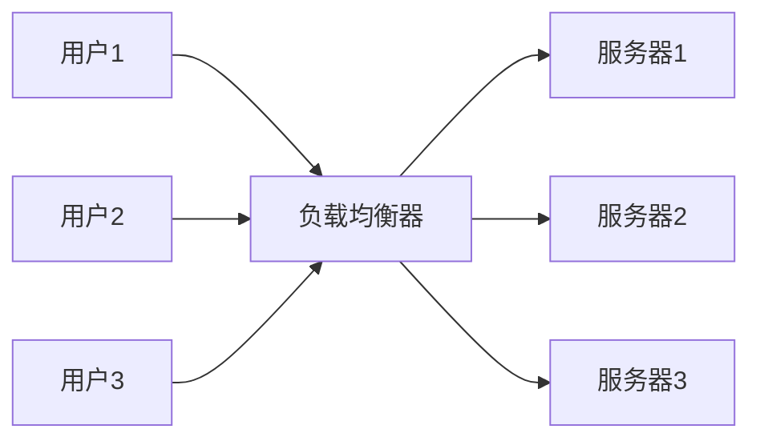
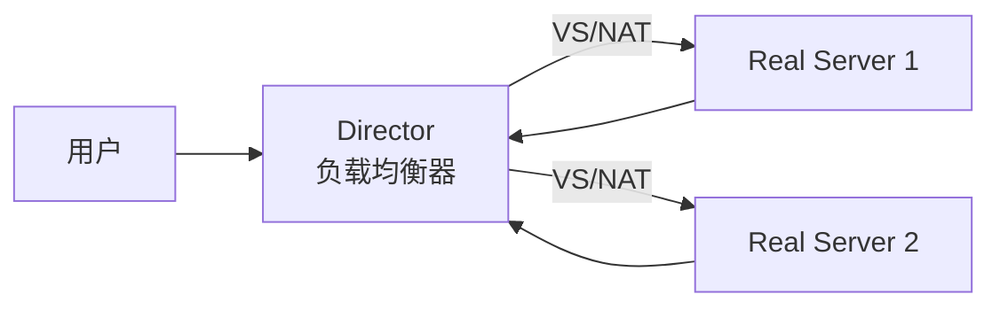
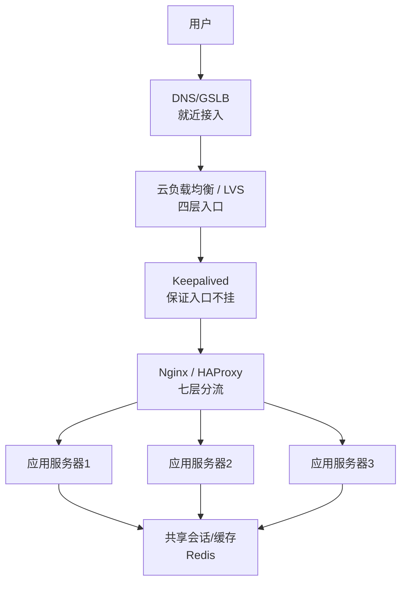

+++
title = "第63章：负载均衡"
weight = 630
date = "2026-03-24T13:18:28+08:00"
type = "docs"
description = ""
isCJKLanguage = true
draft = false
+++


# 第六十三章：负载均衡

## 63.1 Nginx 负载均衡

### 为什么需要负载均衡？

想象一下：一家餐厅只有1个厨师，生意火爆后，1个厨师做不过来，客人等太久。

**解决方案**：
1. 增加厨师数量（水平扩展）
2. 有人专门负责分配客人到不同厨师（负载均衡器）


```mermaid
graph LR
    A[用户1] --> LB[负载均衡器]
    B[用户2] --> LB
    C[用户3] --> LB
    LB --> S1[服务器1]
    LB --> S2[服务器2]
    LB --> S3[服务器3]
```

### Nginx 负载均衡配置

```bash
# 安装 Nginx
sudo apt install nginx

# 配置负载均衡
sudo nano /etc/nginx/conf.d/upstream.conf
```

```nginx
# upstream 定义后端服务器池
upstream backend {
    # 1. 轮询（默认）
    server backend1.example.com;
    server backend2.example.com;
    server backend3.example.com;
}

# 使用 upstream
server {
    listen 80;
    server_name myapp.com;

    location / {
        proxy_pass http://backend;
        proxy_set_header Host $host;
        proxy_set_header X-Real-IP $remote_addr;
        proxy_set_header X-Forwarded-For $proxy_add_x_forwarded_for;
    }
}
```

### 负载均衡算法

```nginx
# 1. 轮询（Round Robin）- 默认
upstream backend {
    server 192.168.1.101;
    server 192.168.1.102;
    server 192.168.1.103;
}

# 2. 加权轮询（Weighted Round Robin）
upstream backend {
    server 192.168.1.101 weight=5;   # 接收5倍流量
    server 192.168.1.102 weight=3;
    server 192.168.1.103 weight=2;
}

# 3. IP 哈希（IP Hash）- 同一 IP 访问同一服务器
upstream backend {
    ip_hash;
    server 192.168.1.101;
    server 192.168.1.102;
    server 192.168.1.103;
}

# 4. 最少连接（Least Connections）
upstream backend {
    least_conn;
    server 192.168.1.101;
    server 192.168.1.102;
    server 192.168.1.103;
}

# 5. 通用哈希（Hash）
upstream backend {
    hash $request_uri consistent;
    server 192.168.1.101;
    server 192.168.1.102;
}
```

选算法时可以先问自己两个问题：**后端的会话状态放在哪里**、**后端实例的处理能力是否一致**。

| 算法 | 适用场景 | 注意事项 |
|------|----------|----------|
| 轮询 `round-robin` | 后端同构、请求耗时接近 | 默认算法，无需配置 |
| 加权轮询 `weight` | 后端配置有差异（新老机器混跑） | 权重是相对值，只影响比例 |
| 最少连接 `least_conn` | 请求耗时差异大（有长请求） | 比轮询更贴合实际负载 |
| IP 哈希 `ip_hash` | 需要简单会话保持 | 同一出口 IP 的整个公司/学校会落在同一台后端；NAT 环境下容易倾斜 |
| 一致性哈希 `hash ... consistent` | 缓存类后端，希望扩容时少迁移 | 需要配合 `zone` 才能动态增删节点 |

> **关于 upstream 里的主机名**：开源版 Nginx 只在**启动/重载时**解析一次 upstream 里的域名，
> 之后 DNS 变了也不会自动更新。想让它动态解析，需要用 `zone` + `resolver` 配合变量，
> 或者直接写 IP（这也是生产环境中 upstream 常见写 IP 的原因）。
> 与之相对，**后端健康检查在开源版里只有被动模式**（靠真实请求的失败次数判断），
> 主动探测属于 Nginx Plus 的商业功能。

### 健康检查

```nginx
upstream backend {
    server 192.168.1.101 max_fails=3 fail_timeout=30s;
    server 192.168.1.102 max_fails=3 fail_timeout=30s;
    server 192.168.1.103 max_fails=3 fail_timeout=30s down;
}
```

这几个参数的含义经常被误解，逐个说清楚：

| 参数 | 含义 |
|------|------|
| `max_fails=3` | 在 `fail_timeout` 这段时间内，累计失败 3 次就认为该后端不可用 |
| `fail_timeout=30s` | 双重含义：既统计失败次数的时间窗，也是标记不可用后的**摘除时长** |
| `down` | 永久标记为下线，只有改配置或重载才会恢复，一般用于手动摘除节点 |
| `backup` | 备份节点，只有主节点全挂时才会被使用 |
| `max_conns=100` | 限制单个后端的最大并发连接数，防止小机器被打爆 |
| `slow_start=30s` | 节点恢复后，用 30 秒逐步把权重从 0 升到设定值（避免刚恢复就被打挂） |

> **被动健康检查的坑**：它是"先用真实用户请求去撞"，某个后端挂了，
> 依然会有少量用户请求先失败一次，然后才被摘除。
> 如果想要"后端挂掉时用户无感知"，就需要主动探测能力——那是 Nginx Plus，
> 或者干脆把这一层交给 HAProxy / 云负载均衡。

> **别忘了控制重试行为**：默认 `proxy_next_upstream` 会在连接失败、超时等情况下自动换一台后端重试。
> 对**非幂等请求**（如 POST 下单）要格外小心，否则可能重复提交，
> 通常配合 `proxy_next_upstream_tries 2;` 限制重试次数，或用 `non_idempotent` 显式声明允许重试非幂等请求。

### 完整配置示例

```nginx
# /etc/nginx/conf.d/backend.conf

upstream backend_servers {
    least_conn;  # 最少连接算法
    
    server 192.168.1.101:8080 weight=5;
    server 192.168.1.102:8080 weight=3;
    server 192.168.1.103:8080 weight=2;
    
    # 保持连接
    keepalive 32;
}

server {
    listen 80;
    server_name myapp.com;

    # 开启 gzip
    gzip on;
    gzip_types text/plain application/json application/javascript text/css;

    location / {
        proxy_pass http://backend_servers;
        
        # 设置请求头
        proxy_set_header Host $host;
        proxy_set_header X-Real-IP $remote_addr;
        proxy_set_header X-Forwarded-For $proxy_add_x_forwarded_for;
        proxy_set_header X-Forwarded-Proto $scheme;

        # 复用与后端的连接：这三行必须配对出现，缺一条 keepalive 就不会生效
        proxy_http_version 1.1;
        proxy_set_header Connection "";
        
        # 超时设置
        proxy_connect_timeout 60s;
        proxy_send_timeout 60s;
        proxy_read_timeout 60s;
        
        # 缓冲
        proxy_buffering on;
        proxy_buffer_size 4k;
        proxy_buffers 8 4k;
    }
}
```

### HTTPS 配置

```nginx
server {
    listen 443 ssl;
    http2 on;                       # Nginx 1.25.1 起，http2 是独立的指令
    server_name myapp.com;

    ssl_certificate /etc/ssl/certs/myapp.crt;
    ssl_certificate_key /etc/ssl/private/myapp.key;

    ssl_protocols TLSv1.2 TLSv1.3;
    ssl_ciphers HIGH:!aNULL:!MD5;
    ssl_prefer_server_ciphers on;   # 只影响 TLS 1.2 及更早版本，对 TLS 1.3 无效

    location / {
        proxy_pass http://backend_servers;
        proxy_set_header Host $host;
        proxy_set_header X-Real-IP $remote_addr;
        proxy_set_header X-Forwarded-For $proxy_add_x_forwarded_for;
        proxy_set_header X-Forwarded-Proto $scheme;
    }
}

# HTTP 重定向到 HTTPS
server {
    listen 80;
    server_name myapp.com;
    return 301 https://$server_name$request_uri;
}
```

> **两个容易忽略的点**
>
> - `listen 443 ssl http2;` 这种把 http2 写在 listen 后面的写法，从 **Nginx 1.25.1 起已被标记为废弃**，
>   新配置请统一写成独立的 `http2 on;`，否则重载时会收到 warning。
> - `ssl_prefer_server_ciphers on;` 只对 TLS 1.2 及更早版本生效；TLS 1.3 的套件选择由客户端主导，
>   所以真正想控制 TLS 1.3，靠的是 `ssl_conf_command Ciphersuites ...` 之类的配置，而不是这一行。
> - 重定向时建议用 `$host` 而不是 `$server_name`：`$server_name` 只取配置里写的第一个名字，
>   用 `return 301 https://$host$request_uri;` 更稳。

## 63.2 HAProxy

HAProxy 是专业的负载均衡器，性能极高，常用于大流量场景。

### 安装 HAProxy

```bash
# Ubuntu/Debian
sudo apt install haproxy

# CentOS/RHEL
sudo yum install haproxy

# 启动
sudo systemctl enable haproxy
sudo systemctl start haproxy
```

### 基本配置

```bash
# /etc/haproxy/haproxy.cfg
global
    log /dev/log local0
    log /dev/log local1 notice
    chroot /var/lib/haproxy
    stats socket /run/haproxy/admin.sock mode 660 level admin
    stats timeout 30s
    user haproxy
    group haproxy
    daemon
    maxconn 4000

defaults
    log global
    mode http
    option httplog
    option dontlognull
    timeout connect 5000
    timeout client 50000
    timeout server 50000

#Frontend 配置
frontend http_front
    bind *:80
    mode http
    default_backend web_servers

#Backend 配置
backend web_servers
    mode http
    balance roundrobin
    option httpchk GET /health
    server web1 192.168.1.101:8080 check inter 2000 rise 2 fall 3
    server web2 192.168.1.102:8080 check inter 2000 rise 2 fall 3
    server web3 192.168.1.103:8080 check inter 2000 rise 2 fall 3
```

### 负载均衡算法

```bash
# roundrobin - 轮询（默认，最常用）
backend web_servers
    balance roundrobin

# static-rr - 静态轮循（不支持权重动态调整）
backend web_servers
    balance static-rr

# leastconn - 最少连接
backend web_servers
    balance leastconn

# source - 源地址哈希
backend web_servers
    balance source

# uri - URI 哈希
backend web_servers
    balance uri

# url_param - URL 参数
backend web_servers
    balance url_param session_id

# hdr - HTTP 头哈希
backend web_servers
    balance hdr(host)
```

### 健康检查

```bash
backend web_servers
    # HTTP 健康检查
    option httpchk GET /health

    # 要求检查接口返回 200 才算健康（默认只要 TCP 连得上就算健康）
    http-check expect status 200

    # TCP 层检查（注意选项名是 tcp-check，写 tcpchk 会导致 HAProxy 启动直接报错）
    option tcp-check

    # 检查间隔和阈值
    server web1 192.168.1.101:8080 check inter 2000 fall 3 rise 2

    # 带权重的健康检查
    server web1 192.168.1.101:8080 weight 100 check inter 2000
```

健康检查参数的含义，和前面的 Nginx 一一对应：

| 参数 | 含义 |
|------|------|
| `check` | 开启对该后端服务器的健康检查 |
| `inter 2000` | 检查间隔 2000 毫秒 |
| `fall 3` | 连续失败 3 次才判定为不可用（避免因偶发抖动误摘） |
| `rise 2` | 连续成功 2 次才重新纳入负载（避免刚恢复就被打挂） |
| `weight 100` | 权重，`roundrobin` 下按比例分配请求 |
| `backup` | 标记为备份节点，主节点全挂时才启用 |
| `disabled` | 管理性下线（**不是"备用"**，配上去这台机器就一直不会被使用） |
| `maxconn 100` | 单台后端的最大并发连接数 |

> **`option tcp-check` 与 `option httpchk` 的区别**：前者只确认 TCP 端口能连上，
> 后端进程僵死、返回 500 时它仍会认为"健康"；后者会发起真实 HTTP 请求并按返回码判断，
> 更贴近"用户能不能正常访问"。所以只要后端是 HTTP 服务，就应该用 `option httpchk`。

### HTTPS 配置

```bash
frontend https_front
    bind *:443 ssl crt /etc/ssl/certs/myapp.pem

    default_backend web_servers

# HTTP 到 HTTPS 的重定向要单独开一个 80 端口的 frontend
# 注意：不能把重定向规则写在只监听 443 的 frontend 上——
# 那里 ssl_fc 恒为真，条件永远不成立，写了等于没写
frontend http_front
    bind *:80
    http-request redirect scheme https code 301
```

### 统计页面

```bash
# 启用统计页面
listen stats
    bind *:8404
stats enable
stats uri /stats
stats refresh 30s
stats auth admin:password
```

> **统计页要当成敏感页面**：它会暴露后端服务器列表、健康状态、流量等内部信息。
> 生产环境请至少做到：改用强口令、限制来源 IP、别暴露在公网。
> 想开放"在页面上直接上下线后端"的管理功能，需要显式加
> `stats admin if LOCALHOST`——`LOCALHOST` 是内置 ACL，只放行本机访问；
> 写 `if TRUE` 是无效写法，HAProxy 会因为找不到名为 `TRUE` 的 ACL 而报错。

### 高可用配置

```bash
# /etc/haproxy/haproxy.cfg

# Frontend
frontend http_front
    bind *:80
    bind *:443 ssl crt /etc/ssl/certs/myapp.pem
    mode http
    default_backend web_servers

# Backend
backend web_servers
    mode http
    balance roundrobin
    option forwardfor
    option httpchk
    http-check expect status 200
    server web1 192.168.1.101:8080 check weight 100
    server web2 192.168.1.102:8080 check weight 100
    server web3 192.168.1.103:8080 check weight 100 disabled  # 备用
```

> **最后一行有两个问题**：`disabled` 的意思是"**管理性下线**"，配上去这台服务器会一直不被使用，
> 并不是"备用"。要表达"平时不用、主节点全挂才顶上"，应该写 `backup`：
>
> ```bash
> server web3 192.168.1.103:8080 check weight 100 backup
> ```
>
> 另外 HAProxy 在 2.x 里的推荐做法是把 `mode`、`timeout` 等公共项放进 `defaults` 段，
> frontend/backend 里只留各自特有的配置，配置更短也更好维护。

## 63.3 LVS

LVS（Linux Virtual Server）是 Linux 内核层面的负载均衡（现由 `ipvs` 模块实现），
它工作在**四层**，只按 IP/端口转发，不解析 HTTP 内容，因此性能极高、单机可以扛住很大流量。

> **先分清四层和七层**，这决定了你该选哪个工具：
>
> | 维度 | 四层（LVS / HAProxy 的 tcp 模式 / 云 NLB） | 七层（Nginx / HAProxy 的 http 模式 / 云 ALB） |
> |------|-------------------------------------------|--------------------------------------------|
> | 工作依据 | IP、端口、TCP 标志位 | URL、Header、Cookie |
> | 性能 | 最高（内核转发，几乎无额外开销） | 较高（需要解析和重组 HTTP） |
> | 能力 | 只做转发，不懂业务 | 可按路径分流、改写请求头、会话保持、限流、灰度 |
> | 证书处理 | 一般交给后端 | 可以集中做 SSL 终结 |
> | 典型场景 | 数据库代理、大流量入口、非 HTTP 协议 | Web 应用、API 网关、需要按内容分流的场景 |

### LVS 架构


```mermaid
graph LR
    A[用户] --> D[Director<br/>负载均衡器]
    D -->|VS/NAT| B[Real Server 1]
    D -->|VS/NAT| C[Real Server 2]
    B --> D
    C --> D
```

### LVS 三种模式

| 模式 | 说明 | 特点与限制 |
|------|------|------------|
| NAT | 网络地址转换（`ipvsadm -m`） | 请求和响应**都必须经过 Director**，因此把真实服务器网关指向 Director；Director 容易成为带宽瓶颈 |
| IP Tunneling | IP 隧道（`ipvsadm -i`） | Director 把请求封装后转给真实服务器，**响应由真实服务器直接返回客户端**；真实服务器要支持 IPIP、可跨网段 |
| Direct Routing | 直接路由（`ipvsadm -g`） | 性能最好（响应不经 Director）；真实服务器要配置 VIP 并抑制 ARP 响应，且必须与 Director 在同一二层网络 |

> 三种模式里 DR 最常用，但它有一个"必须做"的前置动作：
> 真实服务器上要把 VIP 绑到回环口（或关闭 ARP 响应），否则整个网段都会来抢这个 VIP 的 ARP，
> 表现为"VIP 时通时不通"。典型配置是 `net.ipv4.conf.all.arp_ignore=1`、`arp_announce=2`，
> 再把 VIP 加到 `lo` 上并带上 `/32` 掩码。

### 安装 LVS

```bash
# CentOS/RHEL
sudo yum install ipvsadm

# Ubuntu/Debian
sudo apt install ipvsadm

# 查看 LVS 版本
ipvsadm --version
```

### NAT 模式配置

```bash
# 开启 IP 转发（重定向由当前 shell 执行，所以要借 sudo tee 或直接用 sysctl）
sudo sysctl -w net.ipv4.ip_forward=1

# 永久生效
echo 'net.ipv4.ip_forward = 1' | sudo tee /etc/sysctl.d/99-ipforward.conf
sudo sysctl --system

# 添加 LVS 服务
ipvsadm -A -t 192.168.1.100:80 -s rr

# 添加 Real Server
ipvsadm -a -t 192.168.1.100:80 -r 192.168.1.101:80 -m
ipvsadm -a -t 192.168.1.100:80 -r 192.168.1.102:80 -m

# 查看配置
ipvsadm -L -n

# 保存配置（RHEL 系）
sudo ipvsadm-save > /etc/sysconfig/ipvsadm
# Debian/Ubuntu 上通常用 ipvsadm 服务保存，重启后自动恢复
sudo service ipvsadm save
```

> **注意**：`ipvsadm` 的规则默认**不会自动持久化**，重启后全部丢失。
> 除了上面两种保存方式，更常见的做法是交给 keepalived 管理——把
> `virtual_server` 段写好，规则由 keepalived 在启动时自动下发，不需要手工 `ipvsadm -a`。

### LVS 管理命令

```bash
# 查看连接
ipvsadm -L -c

# 查看统计
ipvsadm -L -n --stats

# 查看速率
ipvsadm -L -n --rate

# 清空所有连接
ipvsadm -C

# 删除 LVS 服务
ipvsadm -D -t 192.168.1.100:80

# 修改算法
ipvsadm -E -t 192.168.1.100:80 -s wlc
```

### Keepalived + LVS

```bash
# 安装 Keepalived
sudo dnf install keepalived        # RHEL 8+；Debian/Ubuntu 用 apt install keepalived

# /etc/keepalived/keepalived.conf
! Configuration File for keepalived

global_defs {
   router_id LVS_MASTER
}

vrrp_instance VI_1 {
    state MASTER
    interface eth0
    virtual_router_id 51
    priority 100
    advert_int 1
    authentication {
        auth_type PASS
        auth_pass 1111
    }
    virtual_ipaddress {
        192.168.1.100
    }
}

virtual_server 192.168.1.100 80 {
    delay_loop 6
    lb_algo rr
    lb_kind NAT
    persistence_timeout 50
    protocol TCP

    real_server 192.168.1.101 80 {
        weight 1
        TCP_CHECK {
            connect_timeout 3
            nb_get_retry 3
            delay_before_retry 3
            connect_port 80
        }
    }

    real_server 192.168.1.102 80 {
        weight 1
        TCP_CHECK {
            connect_timeout 3
            nb_get_retry 3
            delay_before_retry 3
            connect_port 80
        }
    }
}
```

> **配置里的几个关键点**
>
> - `state MASTER` / `state BACKUP` 只是**初始状态**，最终由 `priority` 决定谁持有 VIP；
>   现在更推荐两台都写 `state BACKUP` 并配合 `nopreempt`，避免主节点恢复后抢回 VIP 造成抖动。
> - `virtual_router_id` 在同一网段内**必须唯一**，两台交换机/两套集群撞号会导致 VIP 频繁漂移，
>   这是"VIP 莫名乱跳"最常见的原因。
> - `auth_pass` 最长 8 位，写长会被截断；它只是防止误接入，**不是安全机制**，不要当密码用。
> - `advert_int` 是心跳间隔（秒），两台机器必须一致。
> - `lb_kind` 要与真实服务器的配置匹配：`NAT` 时真实服务器网关指向 Director；
>   写 `DR` 时才需要在真实服务器上做前面说的 ARP 抑制和 VIP 配置。

## 63.4 云负载均衡

### AWS ALB/NLB

```bash
# AWS CLI 创建 ALB
aws elbv2 create-load-balancer \
    --name my-alb \
    --subnets subnet-12345678 subnet-87654321 \
    --security-groups sg-12345678 \
    --type application

# 创建目标组
aws elbv2 create-target-group \
    --name my-targets \
    --protocol HTTP \
    --port 80 \
    --vpc-id vpc-12345678

# 注册目标
aws elbv2 register-targets \
    --target-group-arn arn:aws:elasticloadbalancing:... \
    --targets Id=i-12345678 Id=i-87654321

# 创建监听器
aws elbv2 create-listener \
    --load-balancer-arn arn:aws:elasticloadbalancing:... \
    --protocol HTTP \
    --port 80 \
    --default-actions Type=forward,TargetGroupArn=arn:aws:...
```

### Kubernetes Service (LoadBalancer)

```yaml
apiVersion: v1
kind: Service
metadata:
  name: my-app
spec:
  type: LoadBalancer
  selector:
    app: my-app
  ports:
    - protocol: TCP
      port: 80
      targetPort: 8080
```

### Nginx Ingress Controller

```yaml
apiVersion: networking.k8s.io/v1
kind: Ingress
metadata:
  name: my-app-ingress
  annotations:
    nginx.ingress.kubernetes.io/rewrite-target: /
spec:
  ingressClassName: nginx
  rules:
  - host: myapp.com
    http:
      paths:
      - path: /
        pathType: Prefix
        backend:
          service:
            name: my-app
            port:
              number: 80
```

### 负载均衡高级特性

#### 会话保持（Session Persistence）

让同一用户的请求始终发送到同一后端服务器：

```nginx
# Nginx IP Hash（基于客户端IP）
upstream backend {
    ip_hash;
    server 192.168.1.101;
    server 192.168.1.102;
}

# 基于 Cookie 的会话保持
upstream backend {
    server 192.168.1.101;
    server 192.168.1.102;
}

# 后端设置 Cookie
# server {
#     add_header Set-Cookie "route=$server_addr";
# }

# HAProxy 基于 Cookie
backend servers
    cookie SERVERID insert indirect nocache
    server web1 192.168.1.101:8080 cookie web1
    server web2 192.168.1.102:8080 cookie web2
```

> **会话保持要慎用**，先说清楚它的问题：一旦用户的会话被"钉"在某台后端上，
> 那台机器挂了用户就会掉线，负载也会因为分布不均而倾斜；扩容时新节点分不到老会话。
> 所以**更推荐的做法是让后端"无状态"**——把会话数据放到 Redis / 数据库，
> 让任意一台后端都能处理任意用户的请求，这样就不需要会话保持了。
>
> 如果确实需要，几种方案的适用性如下：
>
> | 方案 | 说明 | 限制 |
> |------|------|------|
> | Nginx `ip_hash` | 按客户端 IP 固定后端 | 出口 IP 相同的一群人会被压在同一台；移动网络切换 IP 会掉会话 |
> | Nginx Plus `sticky cookie` | 由 LB 下发 Cookie 指定后端 | 商业版功能；开源版需第三方模块（如 nginx-sticky-module） |
> | HAProxy `cookie` | 由 HAProxy 插入/识别 Cookie | 开源版可用，是 HAProxy 场景下最常用的方案 |
> | 后端共享会话（Redis 等） | 与负载均衡器无关 | 需要改造应用，但最稳、最易扩展 |
>
> 另外注意：上面注释里 `add_header Set-Cookie "route=$server_addr"` 的写法**不可用**，
> `$server_addr` 取的是负载均衡器自己的地址，而不是后端地址，靠它做路由是错的。

#### SSL/TLS 终结

在负载均衡器上处理 HTTPS，减轻后端压力：

```nginx
# Nginx SSL 配置
server {
    listen 443 ssl;
    http2 on;
    server_name myapp.com;

    ssl_certificate /etc/ssl/certs/myapp.crt;
    ssl_certificate_key /etc/ssl/private/myapp.key;

    # SSL 优化
    ssl_protocols TLSv1.2 TLSv1.3;
    ssl_ciphers HIGH:!aNULL:!MD5;
    ssl_prefer_server_ciphers on;
    ssl_session_cache shared:SSL:10m;
    ssl_session_timeout 10m;

    # 安全头
    add_header X-Frame-Options "SAMEORIGIN" always;
    add_header X-Content-Type-Options "nosniff" always;
    add_header Referrer-Policy "strict-origin-when-cross-origin" always;
    add_header Strict-Transport-Security "max-age=63072000; includeSubDomains" always;
    add_header Content-Security-Policy "default-src 'self'" always;

    location / {
        proxy_pass http://backend;
    }
}

# HTTP 重定向到 HTTPS
server {
    listen 80;
    server_name myapp.com;
    return 301 https://$server_name$request_uri;
}
```

```bash
# HAProxy SSL 配置
frontend https_front
    bind *:443 ssl crt /etc/ssl/certs/myapp.pem

    # 或者使用多证书
    bind *:443 ssl crt /etc/ssl/certs/ alpn http/1.1

    default_backend web_servers

# 转换证书为 HAProxy 格式
cat server.crt server.key > /etc/ssl/certs/myapp.pem
```

> **`X-XSS-Protection` 不要再加**：这是早期浏览器"XSS 过滤器"的开关，
> 现代浏览器（Chrome 从 78 起）已移除该过滤器，这个响应头**现在只会带来兼容问题**，
> 设置成 `1` 甚至可能引入漏洞。真正有效的防线是 **CSP（Content-Security-Policy）**。
> 上例里的 CSP 只是最保守的起点，实际要按站点加载的资源（CDN、图片、接口域名）逐项放开。
>
> **关于 HSTS**：一旦下发，浏览器在 `max-age` 时间内会强制用 HTTPS 访问该域名，
> 配置错误会导致站点**无法回退到 HTTP**（这点一定要在上生产前想清楚），
> 建议先用较短的 `max-age`（如 300 秒）验证，再逐步加长。
>
> **HAProxy 的证书文件**：`cat cert key > myapp.pem` 的顺序是**证书在前、私钥在后**，
> 而且要把中间证书也拼进去（否则部分客户端会报证书链不完整）。
> 生成的 pem 属于敏感文件，权限设成 `600` 且属主为 haproxy 运行用户。

#### 连接池与会话复用

```nginx
upstream backend {
    server 192.168.1.101:8080;
    server 192.168.1.102:8080;

    # 保持长连接
    keepalive 32;
    keepalive_requests 100;
    keepalive_timeout 60s;
}

location / {
    proxy_pass http://backend;
    # 启用 HTTP/1.1
    proxy_http_version 1.1;
    # 清空连接头
    proxy_set_header Connection "";
}
```

#### 限流与防护

```nginx
# 限制连接数
limit_conn_zone $binary_remote_addr zone=conn_limit:10m;
limit_conn conn_limit 10;

# 限制请求速率
limit_req_zone $binary_remote_addr zone=req_limit:10m rate=10r/s;

location / {
    limit_req zone=req_limit burst=20 nodelay;
}

# 基于变量的限流
map $request_uri $limit {
    /api/ 100r/s;
    /static/ 1000r/s;
    default 10r/s;
}
```

> **上面 `map` 那段是错的**：`limit_req_zone` 的 `rate` 只能写**常量**，不支持变量，
> 所以 `map` 出来的 `$limit` 无处可用，写了也不会生效。
> 想对不同路径用不同速率，正确做法是**定义多个 zone，然后在各自的 location 里引用**：
>
> ```nginx
> # 普通接口：每秒 10 个请求
> limit_req_zone $binary_remote_addr zone=api_limit:10m rate=10r/s;
> # 静态资源：每秒 100 个请求
> limit_req_zone $binary_remote_addr zone=static_limit:10m rate=100r/s;
>
> location /api/ {
>     limit_req zone=api_limit burst=20 nodelay;
>     proxy_pass http://backend;
> }
> location /static/ {
>     limit_req zone=static_limit burst=50;
>     proxy_pass http://backend;
> }
> ```
>
> 还有两点容易踩坑：`limit_req` 按 **IP** 限流，若前面还有一层 CDN/负载均衡，
> 必须先用 `real_ip` 模块还原真实客户端 IP，否则所有用户会被当成同一个 IP 一起限流；
> 另外 `burst` 是"允许积压的请求数"，加 `nodelay` 表示积压的请求立即处理（而不是排队），
> 用来应对突发流量，不要设置得过大。

#### 灰度发布与A/B测试

```nginx
# 基于 Cookie 的灰度发布
upstream backend_v1 {
    server 192.168.1.101:8080;
}

upstream backend_v2 {
    server 192.168.1.102:8080;
}

server {
    listen 80;

    # 新版本用户
    if ($cookie_version = "new") {
        proxy_pass http://backend_v2;
    }

    # 默认旧版本
    location / {
        proxy_pass http://backend_v1;
    }
}
```

> **上面这段配置实际跑不起来**：`proxy_pass` 不能直接写在 `server` 块里，
> 它只能出现在 `location`（或 `location` 内的 `if`）中，Nginx 启动时会报语法错误。
> 正确的写法是把判断放进 `location`：
>
> ```nginx
> server {
>     listen 80;
>
>     location / {
>         # 带 version=new Cookie 的用户走新版本
>         if ($cookie_version = "new") {
>             proxy_pass http://backend_v2;
>         }
>         proxy_pass http://backend_v1;
>     }
> }
> ```
>
> 这就是常说的 "if is evil"：`if` 在 Nginx 里的行为不像普通编程语言，
> 只建议用于 `return`、`rewrite` 或这种"覆盖一次 proxy_pass"的场景，
> 不要在 `if` 里写一堆指令。更复杂的灰度策略（按比例、按用户 ID 哈希）
> 建议用 `split_clients` 指令或交给服务网格/网关来做。

### 负载均衡监控

#### Nginx 状态监控

```nginx
# 启用状态页
server {
    listen 80;
    server_name _;

    location /nginx_status {
        stub_status on;
        access_log off;
        allow 127.0.0.1;
        allow 10.0.0.0/8;      # 允许监控服务器所在网段读取
        deny all;
    }
}
```

> **两个前提**：`stub_status` 属于 `ngx_http_stub_status_module` 模块，
> 虽然主流发行版的 Nginx 都默认编译进去了，但用 `nginx -V 2>&1 | grep -o with-http_stub_status_module`
> 确认一下更稳妥。另外**状态页绝不要对公网开放**，上面用 `allow/deny` 限制了来源，
> 这是最低要求；更规范的做法是只监听内网地址（如 `listen 127.0.0.1:80;`）。

```bash
# 访问状态页
curl http://127.0.0.1/nginx_status
# Active connections: 291
# server accepts handled requests
# 16630948 16630948 31070465
# Reading: 6 Writing: 179 Waiting: 106
```

#### HAProxy 统计页面

```bash
# 启用统计页
listen stats
    bind *:8404
    stats enable
    stats uri /stats
    stats refresh 30s
    stats auth admin:password
    stats admin if TRUE
```

#### Prometheus 监控指标

```yaml
# nginx-prometheus-exporter
# https://github.com/nginxinc/nginx-prometheus-exporter

# 使用 HAProxy Exporter
# https://github.com/prometheus/haproxy_exporter

scrape_configs:
  - job_name: 'haproxy'
    static_configs:
      - targets: ['localhost:8404']
```

> **更省事的方案**：HAProxy **2.0 起内置了 Prometheus 指标导出**，不需要额外装 exporter。
> 只要在 frontend 里加一行，就能直接抓取：
>
> ```bash
> frontend stats
>     bind *:8404
>     http-request use-service prometheus-exporter if { path /metrics }
>     stats enable
>     stats uri /stats
> ```
>
> ```yaml
> scrape_configs:
>   - job_name: 'haproxy'
>     metrics_path: /metrics
>     static_configs:
>       - targets: ['10.0.0.11:8404']
> ```
>
> Nginx 这边则没有内置方案，需要部署 `nginx-prometheus-exporter` 去读取 `stub_status` 页面，
> 再让 Prometheus 抓取 exporter 的地址（注意：抓的是 **exporter 的端口**，不是 Nginx 的 80）。

### 负载均衡故障排查

```bash
# 1. 检查后端服务器是否存活
curl -v http://backend_server:8080/health

# 2. 检查负载均衡器日志
tail -f /var/log/nginx/access.log
tail -f /var/log/haproxy.log

# 3. 检查连接状态（netstat 已废弃，用 ss）
ss -tan | grep ':80 ' | wc -l
# 想看更细的：ss -s 汇总，ss -ti 看每个连接的 RTT、重传、拥塞窗口

# 4. 测试后端响应时间
curl -w "@curl-format.txt" -o /dev/null -s http://myapp.com/

# curl-format.txt 内容：
# time_namelookup: %{time_namelookup}\n
# time_connect: %{time_connect}\n
# time_starttransfer: %{time_starttransfer}\n
# time_total: %{time_total}\n

# 5. 测试负载分发
for i in {1..10}; do curl -s http://myapp.com/; done
```

### 常见问题与解决方案

| 现象 | 常见原因 | 排查方向 |
|------|----------|----------|
| 502 Bad Gateway | 后端进程挂了、端口写错、SELinux 拦截、后端超时 | 先在 LB 上 `curl` 后端健康检查接口；看 LB 与后端两侧日志 |
| 503 Service Unavailable | 所有后端都被摘除、上游配置写错 | 看 HAProxy 统计页或 Nginx error_log；检查后端是否集体重启 |
| 504 Gateway Timeout | 后端处理太慢，超过 `proxy_read_timeout` | 先确认是后端慢还是网络慢（看后端日志耗时），再决定调超时还是优化后端 |
| 请求全部落到同一台后端 | 会话保持/哈希算法导致倾斜，或前面有 NAT | 检查 `ip_hash`、CDN 是否统一了源 IP，必要时改用 `least_conn` |
| 会话频繁丢失 | 轮询切换后端，或后端各自保存 session | 优先把会话外置到 Redis；确需时再启用会话保持 |
| VIP 时通时不通 | 双主抢占、`virtual_router_id` 冲突、DR 模式 ARP 未抑制 | `ip addr` 看 VIP 在谁身上，检查 keepalived 日志与 ARP 配置 |
| 证书报错 | 证书过期、证书链不完整、后端 SSL 配置不一致 | `openssl s_client -connect 域名:443 -servername 域名` 看链是否完整 |
| 响应变慢但后端不忙 | 连接数上限、上游 keepalive 没生效、DNS 反复解析 | 看 `ss -s`、确认 `proxy_http_version 1.1` 与 `Connection ""` 是否配对 |

## 本章小结

本章我们学习了负载均衡的核心知识：

| 工具 | 工作层次 | 特点 | 什么时候选它 |
|------|----------|------|--------------|
| Nginx | 七层（也能做四层） | 配置直观、生态成熟、既是 Web 服务器又是 LB | 站点入口、需要按路径/域名分流 |
| HAProxy | 四层/七层 | 专注负载均衡，健康检查与会话保持能力最强 | 对稳定性和流量控制要求高的大型入口 |
| LVS（ipvs） | 四层 | 内核转发，性能最强、最省资源 | 超高流量、非 HTTP 协议、愿意接受配置复杂度 |
| 云负载均衡（ALB/NLB 等） | 四层/七层 | 免运维、自带高可用与弹性扩容 | 已经在云上、不想自己维护入口层 |

负载均衡算法：

| 算法 | 说明 |
|------|------|
| Round Robin | 轮询 |
| Weighted RR | 加权轮询 |
| Least Connections | 最少连接 |
| IP Hash | IP 哈希 |
| URL Hash | URL 哈希 |

> **选型思路**：绝大多数场景先用云负载均衡或 Nginx 就够了，
> 只有当 QPS 很高、或者需要精细的会话保持与健康检查时，才考虑把入口换成 HAProxy；
> LVS 一般出现在"四层入口 + 大量后端"的架构里，往往和 keepalived 搭配使用。

负载均衡架构：


```mermaid
graph TB
    A[用户] --> B[DNS/GSLB<br/>就近接入]
    B --> C[云负载均衡 / LVS<br/>四层入口]
    C --> D[Keepalived<br/>保证入口不挂]
    D --> E[Nginx / HAProxy<br/>七层分流]
    E --> F[应用服务器1]
    E --> G[应用服务器2]
    E --> H[应用服务器3]
    F --> I[共享会话/缓存<br/>Redis]
    G --> I
    H --> I
```

最后归纳成四句话：

1. **先确定层次**：只做转发用四层，需要按内容分流就用七层。
2. **健康检查要贴合业务**：能发 HTTP 检查就别只看 TCP 端口，否则进程僵死也不会被摘除。
3. **优先让后端无状态**：会话外置到 Redis，比各种"会话保持"都更稳。
4. **入口层本身也必须高可用**：负载均衡器自己挂了，后面再多机器也没用——这正是下一章要解决的。

---

> 💡 **温馨提示**：
> 负载均衡不只是分发请求，还包括健康检查、会话保持、SSL 终结等功能。选择合适的负载均衡策略对系统性能至关重要。记住：**没有最好的负载均衡器，只有最适合的**！

---

**第六十三章：负载均衡 — 完结！** 🎉

下一章（也是最后一章！）我们将学习"高可用"，掌握 Keepalived、VRRP、Pacemaker、高可用架构等内容。敬请期待！ 🚀
