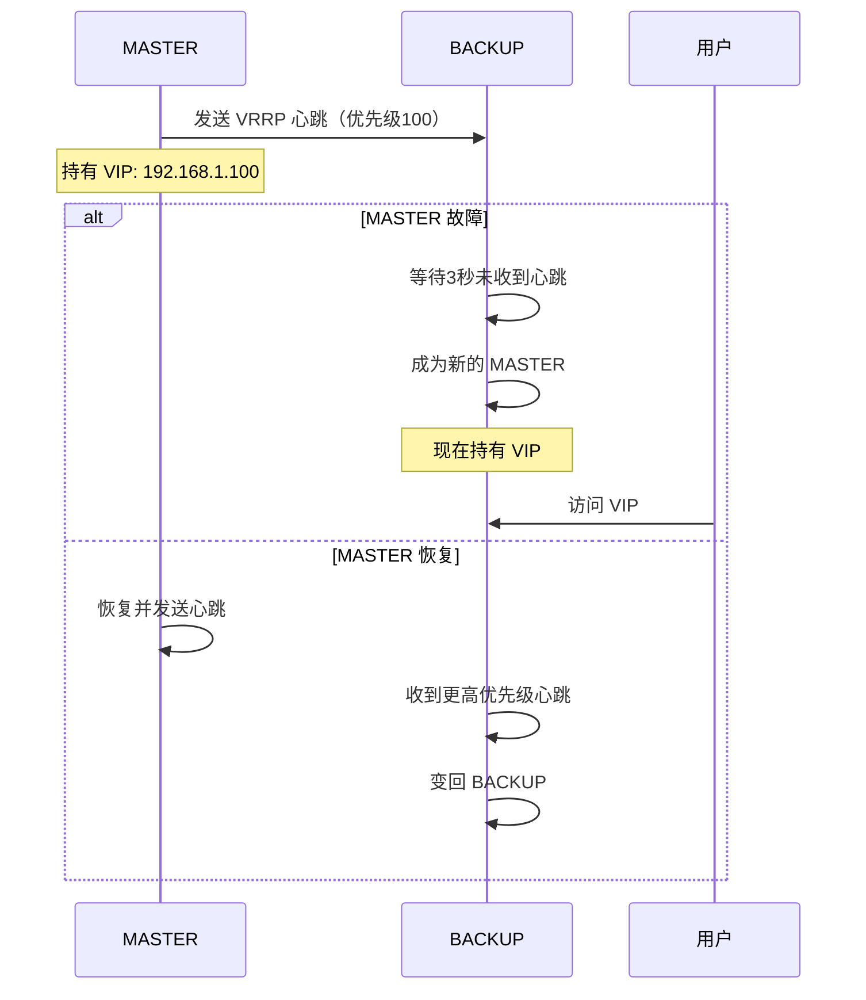
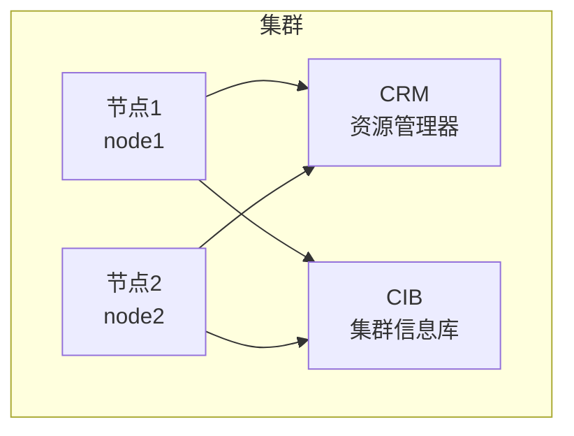
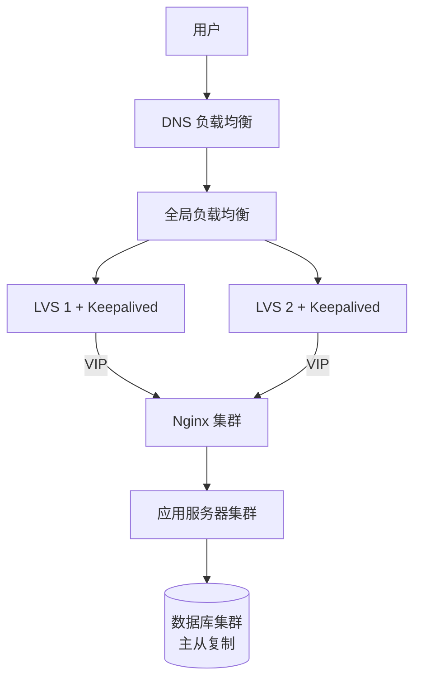
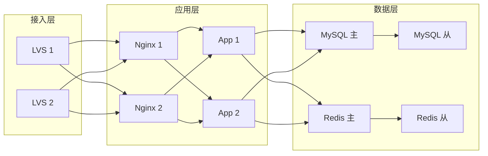
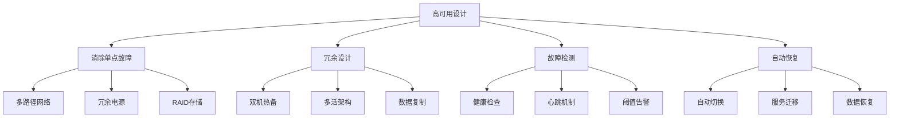
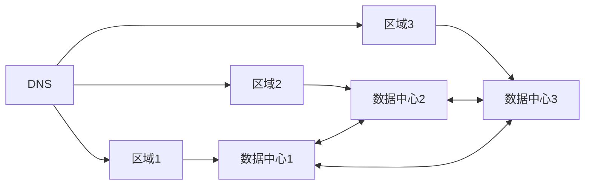

+++
title = "第64章：高可用"
weight = 640
date = "2026-03-24T13:18:28+08:00"
type = "docs"
description = ""
isCJKLanguage = true
draft = false
+++


# 第六十四章：高可用

## 64.1 Keepalived

### 什么是高可用？

想象一下：你家的备用电源。当主电源停电时，备用电源自动接管，冰箱继续工作，空调继续运转，你甚至感觉不到停电了。

**高可用（High Availability，HA）** 就是给服务器配备"备用电源"！


### Keepalived 是什么？

Keepalived 是一款基于 VRRP 协议的高可用软件，主要用于：
1. **IP 漂移**：故障时 VIP 自动切换
2. **健康检查**：检测服务状态
3. **故障转移**：自动切换到备用节点

### Keepalived 安装

```bash
# Ubuntu/Debian
sudo apt install keepalived

# CentOS/RHEL
sudo yum install keepalived

# 启动
sudo systemctl enable keepalived
sudo systemctl start keepalived
```

### Keepalived 配置

```bash
# /etc/keepalived/keepalived.conf

! Configuration File for keepalived

global_defs {
   router_id LVS_DEVEL
   vrrp_skip_check_adv_addr
   vrrp_garp_interval 0
   vrrp_gna_interval 0
}

vrrp_instance VI_1 {
    state MASTER              # 初始状态：MASTER 或 BACKUP
    interface eth0            # 网卡名称
    virtual_router_id 51      # VRRP 路由 ID（同一组要相同）
    priority 100              # 优先级（MASTER 要比 BACKUP 高）
    advert_int 1              # 心跳间隔（秒）
    nopreempt                 # 非抢占模式
    
    authentication {
        auth_type PASS        # 认证类型
        auth_pass 1111        # 认证密码
    }
    
    virtual_ipaddress {
        192.168.1.100         # 虚拟 IP（VIP）
    }
    
    # 通知脚本
    notify_master "/etc/keepalived/notify.sh master"
    notify_backup "/etc/keepalived/notify.sh backup"
    notify_fault "/etc/keepalived/notify.sh fault"
}
```

### MASTER/BACKUP 配置

**MASTER 节点** (`node1`)：
```bash
# /etc/keepalived/keepalived.conf

vrrp_instance VI_1 {
    state MASTER
    interface eth0
    virtual_router_id 51
    priority 100
    advert_int 1
    
    authentication {
        auth_type PASS
        auth_pass 1111
    }
    
    virtual_ipaddress {
        192.168.1.100
    }
}
```

**BACKUP 节点** (`node2`)：
```bash
# /etc/keepalived/keepalived.conf

vrrp_instance VI_1 {
    state BACKUP
    interface eth0
    virtual_router_id 51
    priority 90               # 低于 MASTER
    advert_int 1
    
    authentication {
        auth_type PASS
        auth_pass 1111
    }
    
    virtual_ipaddress {
        192.168.1.100
    }
}
```

### 健康检查

```bash
# 检查脚本
vrrp_script chk_nginx {
    script "/usr/bin/pgrep nginx"
    interval 2                # 每2秒检查一次
    weight -20                # 检查失败时优先级减少20
    fall 2                    # 连续2次失败才算失败
    rise 1                    # 连续1次成功就算成功
}

vrrp_instance VI_1 {
    # ... 其他配置 ...
    
    track_script {
        chk_nginx            # 使用上面的检查脚本
    }
}
```

### Nginx + Keepalived 完整配置

**MASTER 节点**：
```bash
# /etc/keepalived/keepalived.conf

global_defs {
   router_id NGINX_MASTER
}

vrrp_script chk_nginx {
    script "pgrep nginx"
    interval 2
    weight -20
    fall 2
    rise 1
}

vrrp_instance VI_1 {
    state MASTER
    interface eth0
    virtual_router_id 51
    priority 100
    advert_int 1
    authentication {
        auth_type PASS
        auth_pass 1111
    }
    
    virtual_ipaddress {
        192.168.1.100/24 dev eth0
    }
    
    track_script {
        chk_nginx
    }
}
```

**BACKUP 节点**：
```bash
# /etc/keepalived/keepalived.conf（除了 priority 90，其他相同）
```

## 64.2 VRRP

### VRRP 协议简介

VRRP（Virtual Router Redundancy Protocol，虚拟路由器冗余协议）是 Keepalived 工作的基础协议。



### VRRP 工作原理

| 概念 | 说明 |
|------|------|
| Virtual Router | 虚拟路由器（一组真实路由器） |
| Virtual IP | 虚拟 IP（用户访问的 IP） |
| Master | 主路由器（当前持有 VIP） |
| Backup | 备份路由器（待命状态） |
| Priority | 优先级（决定谁是 Master） |
| VRRP Group | VRRP 组（同一组的路由器协同工作） |

### VRRP 选举过程

1. 初始状态，所有路由器都认为自己应该是 Master
2. 优先级高的成为 Master
3. Master 定期发送心跳
4. 如果 Backup 收不到心跳，开始选举
5. 优先级最高的 Backup 成为新的 Master

### VRRP 安全

```bash
# 简单认证
authentication {
    auth_type PASS
    auth_pass 1111
}

# AH 认证（更安全）
authentication {
    auth_type AH
    auth_pass "MySecretPassword!"
}
```

## 64.3 Pacemaker

### Pacemaker 简介

Pacemaker 是 Linux 下最强大的高可用集群管理器，支持更复杂的高可用场景。



### Pacemaker 组件

| 组件 | 说明 |
|------|------|
| CRM | 集群资源管理器 |
| CIB | 集群信息库（XML 配置） |
| PEngine | 策略引擎（计算最优位置） |
| LRM | 本地资源管理器 |
| DC | 设计的协调器 |

### 安装 Pacemaker

```bash
# CentOS/RHEL (需要 EPEL)
sudo yum install pacemaker pcs

# Ubuntu/Debian
sudo apt install pacemaker pcs

# 启动并设置开机启动
sudo systemctl start pcsd
sudo systemctl enable pcsd

# 设置 hacluster 密码
sudo passwd hacluster
```

### 集群配置

```bash
# 1. 节点认证
sudo pcs host auth node1 node2

# 2. 创建集群
sudo pcs cluster setup my_cluster --start node1 node2

# 3. 启用集群
sudo pcs cluster enable --all

# 4. 检查状态
sudo pcs cluster status
```

### 资源管理

```bash
# 创建资源（VIP）
sudo pcs resource create VIP ocf:heartbeat:IPaddr2 \
    ip=192.168.1.100 \
    cidr_netmask=24 \
    op monitor interval=30s

# 创建资源（Nginx）
sudo pcs resource create WebServer systemd:nginx

# 创建资源（MySQL）
sudo pcs resource create MySQL ocf:heartbeat:mysql \
    binary=/usr/bin/mysqld \
    config=/etc/my.cnf \
    datadir=/var/lib/mysql \
    op monitor interval=20s

# 查看资源
sudo pcs resource show

# 启动资源
sudo pcs resource start VIP

# 资源约束
sudo pcs constraint colocation add WebServer VIP INFINITY
sudo pcs constraint order VIP then WebServer
```

### 故障转移

```bash
# 手动迁移资源
sudo pcs resource move WebServer node2

# 查看资源位置
sudo pcs resource location WebServer

# 设置资源粘性（偏好当前节点）
sudo pcs resource meta WebServer resource-stickiness=100

# 亲和性约束
sudo pcs constraint location WebServer prefers node1=200
sudo pcs constraint location WebServer prefers node2=100
```

### 监控和日志

```bash
# 查看集群状态
sudo pcs status

# 查看资源详情
sudo pcs resource show VIP --full

# 查看事件日志
sudo journalctl -u pacemaker -f

# 查看资源代理
sudo pcs resource standards
sudo pcs resource agents ocf:heartbeat
```

## 64.4 高可用架构

### 经典高可用架构



### Web 应用高可用



### MySQL 高可用方案

| 方案 | 说明 | 复杂度 |
|------|------|--------|
| 主从复制 | 异步复制 | 低 |
| 双主复制 | 双向同步 | 中 |
| MHA | 主从自动切换 | 高 |
| MySQL Cluster | NDB 存储引擎 | 高 |
| Galera Cluster | 同步多主 | 中 |
| Orchestrator | 拓扑管理+故障转移 | 中 |

### Nginx + Keepalived 实战

```bash
# /etc/keepalived/keepalived.conf (MASTER)

global_defs {
   router_id lb-master
}

vrrp_script chk_nginx {
    script "/etc/keepalived/check_nginx.sh"
    interval 2
    weight -20
}

vrrp_instance VI_1 {
    state MASTER
    interface eth0
    virtual_router_id 51
    priority 100
    advert_int 1
    
    authentication {
        auth_type PASS
        auth_pass 1111
    }
    
    virtual_ipaddress {
        192.168.1.100/24
    }
    
    track_script {
        chk_nginx
    }
}
```

```bash
# /etc/keepalived/check_nginx.sh
#!/bin/bash

if [ $(pgrep -c nginx) -eq 0 ]; then
    exit 1
fi
exit 0
```

### Ceph 分布式存储高可用

```bash
# Ceph 架构
ceph osd tree

# 副本池配置
ceph osd pool set mypool size 3
ceph osd pool set mypool min_size 2

# PG 状态
ceph pg stat
```

### 高可用架构设计原则



### 常见高可用架构

#### 主备模式（Active-Passive）

```
    [用户] --> [VIP]
              ↓
         [主服务器] <--> [备服务器]
              ↓
         [共享存储]
```

```bash
# 主备切换场景
# 1. 主服务器故障检测
# 2. Keepalived 释放 VIP
# 3. 备服务器接管 VIP
# 4. 启动服务
# 5. 用户无感知恢复
```

#### 双主模式（Active-Active）

```
    [用户1] --> [VIP1] --> [服务器1]
    [用户2] --> [VIP2] --> [服务器2]
         ↓               ↓
      [共享存储] <-----> [共享存储]
```

#### 多活架构（Multi-Active）



### MySQL 高可用方案详解

#### 主从复制 + 故障转移

```bash
# 1. 配置主从复制
# 主库 my.cnf
[mysqld]
server-id=1
log-bin=mysql-bin
binlog-format=ROW

# 从库 my.cnf
[mysqld]
server-id=2
relay-log=relay-bin
read-only=1

# 2. 主库创建复制用户
GRANT REPLICATION SLAVE ON *.* TO 'repl'@'%' IDENTIFIED BY 'password';

# 3. 从库配置主库信息
CHANGE MASTER TO
    MASTER_HOST='主库IP',
    MASTER_USER='repl',
    MASTER_PASSWORD='password',
    MASTER_LOG_FILE='mysql-bin.000001',
    MASTER_LOG_POS=123;
```

#### MHA（MySQL High Availability）

```bash
# 安装 MHA
yum install mha4mysql-node mha4mysql-manager

# 配置 MHA
# /etc/app1.cnf
[server default]
user=mha
password=mha
manager_workdir=/var/log/mha
remote_workdir=/var/log/mha

[server1]
hostname=192.168.1.101

[server2]
hostname=192.168.1.102
candidate_master=1
```

#### Galera Cluster（同步多主）

```bash
# 安装 Galera
# CentOS
yum install MariaDB-server-galera

# 配置 Galera
# /etc/my.cnf.d/server.cnf
[galera]
wsrep_on=ON
wsrep_cluster_name="my_cluster"
wsrep_cluster_address="gcomm://192.168.1.101,192.168.1.102,192.168.1.103"
wsrep_node_address=192.168.1.101
wsrep_provider=/usr/lib/galera/libgalera_smm.so
```

### Redis 高可用方案

#### 主从 + Sentinel

```bash
# 1. 启动主从
redis-server --port 6379 --daemonize yes
redis-server --port 6380 --daemonize yes --slaveof 127.0.0.1 6379

# 2. 启动 Sentinel
redis-sentinel /etc/sentinel.conf

# 3. Sentinel 配置
# /etc/sentinel.conf
sentinel monitor mymaster 127.0.0.1 6379 2
sentinel down-after-milliseconds mymaster 5000
sentinel parallel-syncs mymaster 1
sentinel failover-timeout mymaster 900000
```

#### Redis Cluster

```bash
# 创建集群
redis-cli --cluster create 192.168.1.101:6379 192.168.1.102:6379 192.168.1.103:6379 \
    --cluster-replicas 1

# 查看集群状态
redis-cli -c cluster info
redis-cli -c cluster nodes
```

### Keepalived 故障排查

```bash
# 1. 查看 Keepalived 状态
systemctl status keepalived
journalctl -u keepalived -f

# 2. 查看 VRRP 状态
cat /var/log/messages | grep -i keepalived

# 3. 检查 VIP 是否绑定
ip addr show | grep 192.168.1.100

# 4. 测试 VRRP 通信
tcpdump -i eth0 vrrp

# 5. 常见问题
# - VIP 没有绑定：检查防火墙、优先级
# -频繁切换：检查网络稳定性、心跳间隔
# - 服务未启动：检查 notify 脚本、优先级计算
```

### Pacemaker 高级配置

```bash
# 查看集群状态
sudo pcs cluster status

# 查看资源详细状态
sudo pcs resource show

# 查看约束
sudo pcs constraint show

# 设置资源亲和性（在一起）
sudo pcs constraint colocation add webserver with VIP INFINITY

# 设置启动顺序
sudo pcs constraint order VIP then webserver

# 设置资源粘性（倾向留在当前节点）
sudo pcs resource meta webserver resource-stickiness=100

# 测试故障转移
sudo pcs resource move webserver node2
```

### 高可用方案选型指南

| 场景 | 推荐方案 | 原因 |
|------|---------|------|
| Web 服务 | Nginx + Keepalived | 简单、成本低 |
| 数据库 | 主从 + MHA/Galera | 数据一致性 |
| 缓存 | Redis Sentinel/Cluster | 自动故障转移 |
| 存储 | Ceph/GlusterFS | 分布式冗余 |
| 消息队列 | Kafka/RabbitMQ 集群 | 高可用队列 |
| 负载均衡 | LVS + Keepalived | 内核级性能 |

## 本章小结

本章我们学习了高可用的核心知识：

| 组件 | 说明 |
|------|------|
| Keepalived | VRRP 实现，VIP 漂移 |
| VRRP | 虚拟路由器冗余协议 |
| Pacemaker | 集群资源管理器 |
| 高可用架构 | 多层高可用设计 |

高可用指标：

| 指标 | 说明 |
|------|------|
| 可用性 | 系统正常运行时间比例 |
| 99.9% | 一年宕机约 8.7 小时 |
| 99.99% | 一年宕机约 52 分钟 |
| 99.999% | 一年宕机约 5 分钟 |

高可用设计原则：
1. **消除单点故障**
2. **冗余部署**
3. **故障自动检测和转移**
4. **数据一致性保证**

---

> 💡 **温馨提示**：
> 高可用不是万能的，它增加了系统复杂度。评估是否需要高可用时，考虑：停机成本有多高？业务连续性要求有多严格？预算允许吗？有时候，简单的备份+恢复策略可能更实用。

---

**第六十四章：高可用 — 完结！** 🎉

---

# 🎊 全书完结！🎊

## 教程总结

经过十二章的学习，我们从 Linux 基础一路走到了高可用架构：

| 卷 | 章节 | 主题 |
|----|------|------|
| 第十三卷 | 53-54 | Bash 脚本 |
| 第十四卷 | 55-56 | Git 版本控制 |
| 第十五卷 | 57-58 | 监控与日志 |
| 第十六卷 | 59-60 | 备份与恢复 |
| 第十七卷 | 61-62 | 自动化运维 |
| 第十八卷 | 63-64 | 负载均衡与高可用 |

## 学习路线图


## 下一阶段建议

1. **Kubernetes**：容器编排是现代运维的核心
2. **Prometheus + Grafana**：监控的可视化进阶
3. **CI/CD**：Jenkins、GitLab CI、Argo CD
4. **云原生**：Docker Compose、Kubernetes、Istio
5. **安全**：防火墙、安全审计、漏洞扫描

---

> 🎉 **恭喜你完成了 Linux 核心教程的全部内容！**
> 
> 从 Shell 脚本到 Git，从监控到备份，从自动化到高可用——你已经掌握了 Linux 世界的核心知识。
> 
> 记住：**技术是工具，思维是灵魂**。持续学习，不断实践，你就是下一个 Linux 大师！

**感谢阅读，祝学习愉快！** 🚀
